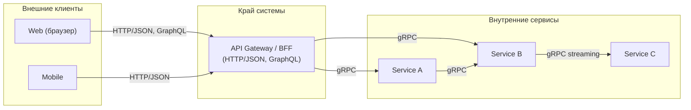

[← Назад к индексу части 17](index.md)

## 17.1. gRPC: интуиция и место в архитектуре

### Цель раздела

Сформировать у тебя **интуитивное понимание**, что такое gRPC и зачем он нужен: в каких сценариях он **дополняет**, а не заменяет REST/GraphQL, почему его любят команды микросервисов, и какие архитектурные решения ты принимаешь, выбирая gRPC.

### В этом разделе главное

- gRPC — это **RPC‑подход поверх HTTP/2 с protobuf**, а не «просто ещё один формат данных».
- Его сила — во **внутреннем общении сервисов**: строгие контракты, высокая производительность, стриминг.
- Для **публичных API и браузерных клиентов** gRPC часто неудобен: нужен прокси/шлюз, сложнее отладка, нет «читаемых глазом» запросов.
- Выбор gRPC — это **архитектурное решение**: ты привязываешься к protobuf, к генерации кода, к определённому способу эволюции контрактов.
- В реальных системах gRPC почти всегда живёт **рядом с REST/GraphQL**, а не вместо них.

### Термины

- **RPC** — способ взаимодействия, когда ты «вызываешь удалённую процедуру» почти как локальную функцию.
- **gRPC** — реализация RPC от Google, использующая HTTP/2 и protobuf.
- **Внутренний API** — API, которым пользуются **другие сервисы или компоненты твоей системы**, а не внешние клиенты.
- **Публичный API** — API, открытый для внешних клиентов (мобильные/веб‑приложения, сторонние интеграторы).
- **Прозрачная сериализация** — когда формат данных и протокол «спрятаны» за сгенерированным клиентом, и разработчик почти не думает о низком уровне.

### Теория и правила

1. **gRPC — это не конкуренция HTTP, а способ его использования.**  
   gRPC работает поверх HTTP/2:
   - использует **один TCP‑коннект** и мультиплексирование потоков;
   - передаёт **бинарные сообщения** в protobuf;
   - использует **стандартные HTTP‑механизмы** (TLS, заголовки) «под капотом».

2. **Основная зона силы gRPC — взаимодействие сервисов внутри системы.**
   - Высокая производительность и компактный бинарный формат → хорошо для **нагруженных внутренних API**.
   - Строгий IDL (protobuf) → удобно **генерировать клиентов** на разных языках.
   - Streaming (server/client/bidi) → удобно для **real‑time** сценариев между сервисами.

3. **Для браузера gRPC неудобен напрямую.**
   - Браузеры не дают прямой доступ к HTTP/2‑фреймам и не «понимают» gRPC нативно.
   - Нужен **grpc‑web** или API‑шлюз, который переводит:
     - HTTP/JSON ⇄ gRPC;
     - или gRPC‑Web ⇄ обычный gRPC.

4. **gRPC усиливает связанность через IDL.**
   - Если ты меняешь `.proto` и генерируешь код, **клиенты должны обновиться**, иначе контракт ломается.
   - Это хорошо для **строгих контрактов** во внутренней системе, но плохо, если у тебя:
     - много независимых внешних клиентов;
     - слабый контроль над версиями на их стороне.

5. **gRPC не отменяет REST/GraphQL, а дополняет их.**
   - Публичный API → часто REST или GraphQL (понятно, дебажится в браузере, есть кэширование, dev‑инструменты).
   - Внутренние микросервисы → gRPC для плотного, типобезопасного взаимодействия и стриминга.

### Простыми словами

Представь, что у тебя **город сервисов**:

- REST и GraphQL — это как **общественный транспорт**:
  - он стандартизирован (маршруты/URL, расписание/методы);
  - любой человек (клиент) может посмотреть карту и поехать.
- gRPC — это **служебный транспорт для работников города**:
  - быстрые служебные автобусы без лишних остановок;
  - ездят по внутренним дорогам;
  - маршруты не обязаны быть понятны гостям города, главное — эффективно возить работников.

Если ты попытаешься обслуживать **туристов (внешних клиентов)** только этим служебным транспортом:

- им будет сложно разобраться;
- тебе придётся строить **специальные пересадки/пояснения** (шлюзы, адаптеры).

### Картинка в голове

Визуально место gRPC в типичной микросервисной архитектуре можно представить так:

Держи в голове: **gRPC живёт «внутри коробки сервисов»**, а REST/GraphQL — на границе с внешним миром.

### Как запомнить

- gRPC — это **«внутренний служебный транспорт»** между сервисами, а не универсальный публичный API.
- Если тебе нужен **читаемый человеком, легко дебажимый API** для браузера и внешних клиентов — смотри на REST/GraphQL.
- Если тебе нужен **быстрый, строго типизированный канал между сервисами** или стриминг — смотри на gRPC.

### Примеры

**Пример 1. Внутренний биллинг в микросервисах**

- Публичное API (для фронтенда и интеграторов):
  - REST `/payments`, `/invoices` или GraphQL‑схема.
- Внутри:
  - сервис `billing` общается с `ledger` и `fraud‑check` через gRPC:
    - `Charge(request) returns (ChargeResponse)`;
    - `StreamTransactions(stream Transaction) returns (Ack)`.

**Пример 2. Аналитика в real‑time**

- Фронтенду нужен **агрегированный отчёт** — REST/GraphQL.
- Между `event‑collector` и `analytics‑engine` — **поток событий** через gRPC‑стриминг.

### Практика / реальные сценарии

- Крупный продукт с десятками микросервисов:
  - публичные API → REST/GraphQL;
  - внутренние запросы с высокой нагрузкой → gRPC;
  - сервисы на разных языках → удобно через protobuf.
- Команда начинает писать **всё** на gRPC, включая публичный API:
  - быстро оказывается, что **дебажить сложнее**, браузер‑клиенту нужен grpc‑web или прокси;
  - документация и инструменты для внешних разработчиков хуже, чем у REST/GraphQL.

### Типичные ошибки

- «Переписать все REST‑эндпоинты на gRPC, потому что так быстрее» — на практике:
  - выигрыша может не быть, если узкое место не в сериализации;
  - сложность клиентской части и инфраструктуры резко вырастает.
- Пытаться сделать **публичное gRPC‑API для браузеров без шлюза**:
  - начинаются пляски с grpc‑web, CORS, нестандартными библиотеками.
- Игнорировать **версионирование и эволюцию `.proto`**:
  - breaking‑изменения ломают клиентов;
  - нет продуманной стратегии deprecation и миграций.

### Что будет, если…

- …использовать gRPC только из‑за «производительности», не измерив узкие места?
  - Скорее всего ты получишь **сложнее инфраструктуру** без реального выигрыша: узкими местами могут быть БД, кэш, алгоритмы, а не сериализация.
- …сделать gRPC единственным протоколом и для внутренних, и для внешних клиентов?
  - Ты завязал **всю экосистему** на специфичный стек; любая интеграция потребует нестандартного клиента или прослойки.

### Проверь себя

1. Почему gRPC особенно удобен **между микросервисами**, но не всегда удобен как **публичный API**?  
2. Какую роль играет **protobuf** в gRPC, и чем это отличается от «JSON поверх HTTP»?  
3. В каком случае ты бы предложил(а) gRPC в своей архитектуре?

Ответ

1. Между микросервисами можно контролировать версии клиентов, стеки и инфраструктуру; бинарный формат и строгие контракты дают выигрыш. Для публичных API нужны читаемость, простые клиенты, инструменты типа curl/Postman, документация — там REST/GraphQL удобнее.  
2. Protobuf — это IDL и бинарный формат: на его основе генерируются клиенты и серверы, типы проверяются на этапе компиляции. JSON поверх HTTP — просто формат данных, контракт обычно описывается отдельно (OpenAPI/описание словами), валидируется в рантайме.  
3. Например, когда у тебя есть несколько бекенд‑сервисов на разных языках, которым нужно обмениваться большим объёмом данных с низкой латентностью, или когда нужны стриминговые запросы (логирование, аналитика, чаты) между сервисами.

### Запомните

- gRPC — это **инструмент для внутренних, строго типизированных и иногда стриминговых API**, а не автоматическая замена REST/GraphQL.
- Выбор gRPC — это **архитектурное решение о контракте и эволюции сервисов**, а не просто выбор «формата данных».

---
