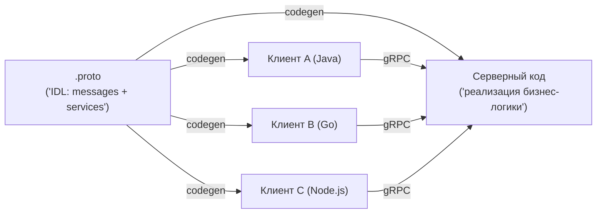
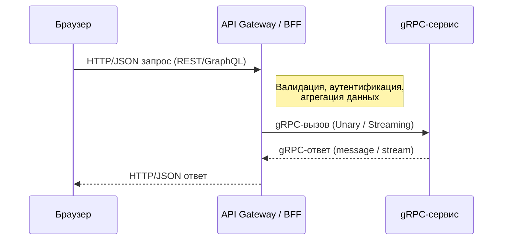

[← Назад к индексу части 17](index.md)

## 17.2. Как устроен gRPC‑контракт на практике

### Цель раздела

Научить тебя **читать и понимать `.proto` файлы**, видеть за ними архитектурные решения (границы, версии, эволюция), понимать виды RPC (unary, streaming) и то, как gRPC‑контракты «врастают» в архитектуру сервисов.

### В этом разделе главное

- gRPC‑контракты описываются в **`.proto` файлах**: сообщения (message) и сервисы (service).
- Есть разные виды вызовов: **unary, server‑streaming, client‑streaming, bidirectional streaming**.
- На основе `.proto` генерируется код клиентов и серверов, что облегчает типобезопасность и развёртывание.
- Эволюция контрактов требует **аккуратности**: соблюдения правил нумерации полей, добавления новых полей без ломки старых клиентов.
- gRPC‑контракт — это часть **архитектурного договора** между командами и сервисами.

### Термины

- **message** — структура данных в protobuf: набор полей с типами и номерами.
- **service** — набор RPC‑методов (операций), которые может вызвать клиент.
- **field number** — номер поля в message, который используется в бинарной сериализации.
- **codegen** — генерация клиентского и серверного кода из `.proto` файлов.

### Теория и правила

1. **Структура `.proto` файла.**

   Упрощённый пример:

   ```proto
   syntax = "proto3";

   package payments.v1;

   message ChargeRequest {
     string user_id = 1;
     double amount = 2;
     string currency = 3;
   }

   message ChargeResponse {
     string payment_id = 1;
     bool success = 2;
     string error_message = 3;
   }

   service PaymentService {
     rpc Charge(ChargeRequest) returns (ChargeResponse);
   }
   ```

   Здесь:

   - `ChargeRequest` и `ChargeResponse` — сообщения (типы данных);
   - `PaymentService` — сервис;
   - `Charge` — RPC‑метод.

2. **Типы RPC.**

   - **Unary:** `rpc GetUser(GetUserRequest) returns (GetUserResponse);`
   - **Server‑streaming:** `rpc ListEvents(EventsRequest) returns (stream Event);`
   - **Client‑streaming:** `rpc Upload(stream Chunk) returns (UploadSummary);`
   - **Bidirectional streaming:** `rpc Chat(stream Message) returns (stream Message);`

   Архитектурно:

   - unary ближе всего к привычному HTTP‑запросу;
   - стриминг — отдельный класс задач (логирование, чаты, аналитика).

3. **Эволюция контрактов.**

   В protobuf есть правила обратной совместимости:

   - можно **добавлять новые поля** с новыми номерами;
   - нельзя **переиспользовать номера удалённых полей**;
   - лучше не менять типы и семантику существующих полей.

   ##### Сквозной пример: эволюция `.proto` без ломки клиентов

   Версия 1:

   ```proto
   syntax = "proto3";
   package orders.v1;

   message GetOrderRequest { string order_id = 1; }

   message Order {
     string id = 1;
     string status = 2;
   }

   service OrdersService {
     rpc GetOrder(GetOrderRequest) returns (Order);
   }
   ```

   **Безопасное изменение** — добавить поле с новым номером:

   ```proto
   message Order {
     string id = 1;
     string status = 2;
     string customer_id = 3; // новое поле
   }
   ```

   **Опасное изменение** — переиспользовать номер удалённого поля или поменять тип “на том же номере”.

   Практика “как делать правильно”:

   - добавляй новое поле новым номером;
   - старое не переиспользуй;
   - если удаляешь/переименовываешь — **резервируй**:

   ```proto
   message Order {
     string id = 1;
     string status = 2;
     string customer_id = 3;
     reserved 4, 5;
     reserved "legacy_customer";
   }
   ```

   Мини‑правило: относись к `.proto` так же, как к публичному API — **add → migrate → deprecate → remove** (см. часть 30).

4. **Генерация кода и границы.**

   - Клиенты и серверы генерируются из одной IDL:
     - удобно, но создаёт **жёсткую связанность** по версиям;
     - требует дисциплины в обновлении.

5. **Ошибки, таймауты и наблюдаемость в gRPC.**

   - В gRPC есть **статусы ошибок** (OK, INVALID_ARGUMENT, NOT_FOUND, DEADLINE_EXCEEDED и т.д.) — это часть контракта, как и типы данных.
   - Клиент обычно задаёт **deadline/timeout** на вызов; если сервер не успел — это уже особый сценарий, который нужно явно обрабатывать.
   - Логи, метрики (latency per method, error rate) и трейсы по gRPC‑вызовам — ключ к тому, чтобы **диагностировать проблемы не только по коду, но и по контракту**.

### Пошагово

Мини‑алгоритм, как «прочитать» gRPC‑контракт архитектурно:

1. Посмотри на **package и версию** (например, `payments.v1`):
   - это подсказка о **доменных границах** и версии API.
2. Посмотри на **service**:
   - какие методы есть, как они сгруппированы;
   - не превратился ли сервис в «бог‑объект» с десятками методов.
3. Посмотри на **messages**:
   - какие поля в запросах/ответах;
   - есть ли доменные сущности и ID с явной семантикой.
4. Обрати внимание на **виды RPC**:
   - где unary, где streaming и почему;
   - не используют ли стриминг без понимания последствий.
5. Подумай об **эволюции**:
   - есть ли места, где изменение поля вызовет лавину изменений;
   - предусмотрено ли версионирование (`v1`, `v2` пакетов).

### Простыми словами

`.proto` файл — это **«договор в одном документе»**:

- вот какие **типы данных** мы передаём;
- вот какие **операции** ты можешь вызвать;
- вот **их параметры и ответы**.

Кодогенерация превращает этот договор:

- на стороне сервера — в **каркас**, куда ты вписываешь бизнес‑логику;
- на стороне клиента — в **библиотеку**, через которую вызываешь методы.

### Картинка в голове



Образ: **один договор → много реализаций**. Но любое изменение договора требует синхронизации всех участников.

#### Жизненный цикл gRPC‑вызова через API‑шлюз



Эта схема помогает увидеть:

- почему **браузер обычно не говорит с gRPC напрямую**;
- где удобно ставить **логирование, метрики, трейсинг** (на шлюзе и на сервисе);
- как gRPC‑контракт «встраивается» в общую архитектуру API‑слоя.

### Как запомнить

- `.proto` — это **источник правды** для gRPC‑контракта.
- **Streaming** — это не «быстрее», а «другой способ общения» (потоки вместо одиночных запросов).
- Изменять `.proto` надо **как архитектурное решение**, а не «как обычный DTO».

### Мини‑чек‑лист “gRPC‑контракт живёт, а не «лежит файлом»”

- [ ] `.proto` проходит code review как артефакт контракта (владельцы указаны)
- [ ] есть правила совместимости (что запрещено менять без версии)
- [ ] есть стратегия версий (например, `package X.v1`, `X.v2` и срок поддержки)
- [ ] есть мониторинг по методу RPC (latency/error rate per method) и deadline‑политика
- [ ] есть процесс обновления клиентов (пакеты/SDK/релизы), иначе “типобезопасность” превращается в “координационный ад”

### Примеры

**Пример 1. Добавление нового поля**

- Было:

  ```proto
  message User {
    string id = 1;
    string email = 2;
  }
  ```

- Стало:

  ```proto
  message User {
    string id = 1;
    string email = 2;
    string full_name = 3; // новое поле
  }
  ```

Старые клиенты:

- не знают о `full_name`, но это не ломает сериализацию;
- могут начать его использовать после обновления своей версии.

**Пример 2. Неправильное изменение**

- Было:

  ```proto
  message User {
    string id = 1;
    string email = 2;
  }
  ```

- Стало:

  ```proto
  message User {
    string id = 1;
    int64 email = 2; // поменяли тип
  }
  ```

Это может сломать старых клиентов при десериализации.

### Практика / реальные сценарии

- Команда добавляет поле в `.proto` без понимания правил:
  - на одном языке всё работает, на другом — неожиданные ошибки;
  - проблема сложнее, чем «поменять DTO» в REST.
- Несколько команд делят один `.proto` файл:
  - любые изменения превращаются в **переговоры**;
  - нужен процесс управления версиями и владельцами.

### Типичные ошибки

- Относиться к `.proto` как к «просто описанию DTO»:
  - вносить хаотичные изменения;
  - не документировать breaking‑изменения.
- Пихать **всё подряд** в один сервис:
  - огромный интерфейс, сложно выделять границы.
- Не продумывать версионирование:
  - `v1` живёт вечно, внутри него творится хаос.

### Что будет, если…

- …изменять `.proto` без контроля версий и координации?
  - Ты получишь **ломающееся взаимодействие** между сервисами и трудновоспроизводимые баги.
- …использовать стриминг повсюду, где он не нужен?
  - Усложнится логика клиентов/серверов, диагностика и тесты, а выигрыша может не быть.

### Проверь себя

1. Чем **message** в protobuf принципиально отличается от «DTO‑класса» в обычном коде?  
2. Почему **нельзя переиспользовать** номер поля, даже если ты удалил старое поле?  
3. В чём архитектурный плюс и минус того, что и клиент, и сервер генерируются из **одного `.proto`**?

<details><summary>Ответ</summary>

1. Message — это часть **формального IDL**, от которого зависят все клиенты и серверы, и который жёстко связан с бинарным форматом; DTO‑класс — просто структура в коде, его изменение может не иметь сетевых последствий.  
2. Потому что номера используются в бинарной сериализации: переиспользование может привести к тому, что старые данные будут интерпретированы новым кодом **совсем иначе**, ломая совместимость.  
3. Плюс: строгая типизация и единый источник правды; минус: **жёсткая связанность по версии** и необходимость координации изменений между командами.

</details>

### Запомните

- `.proto` — это **архитектурный артефакт**, а не просто схема данных.
- Эволюция gRPC‑контрактов требует дисциплины: думай о ней как об эволюции публичного API внутри системы.

---
