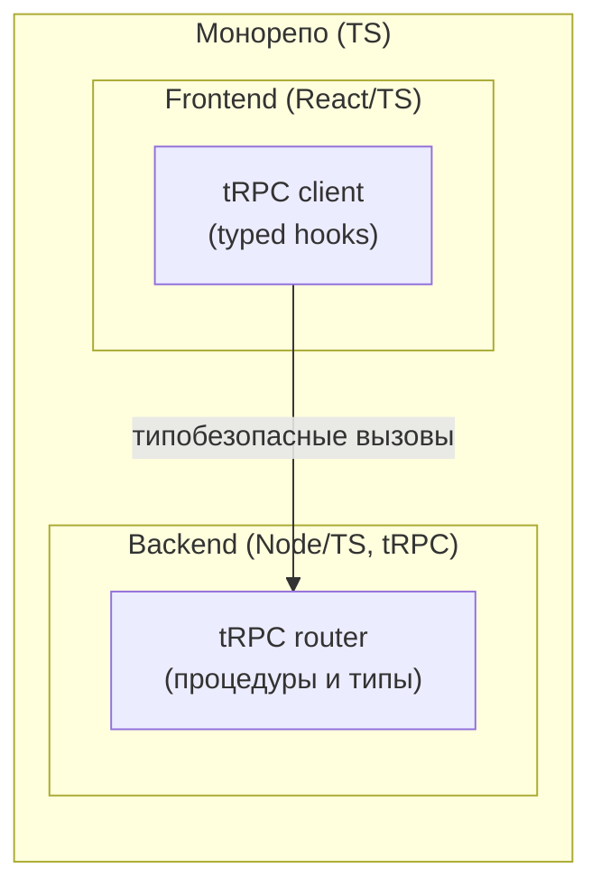

[← Назад к индексу части 17](index.md)

## 17.3. tRPC и end‑to‑end типобезопасность

### Цель раздела

Показать, как **tRPC и похожие подходы** позволяют сделать API **типобезопасным от сервера до клиента**, какие плюсы это даёт (скорость разработки, меньше багов), и какие архитектурные риски создаёт (сцепление, границы, миграции).

### В этом разделе главное

- tRPC — это не «просто библиотека», а **архитектурный подход**: контракт описывается в коде, а не в отдельной схеме.
- End‑to‑end типы:
  - ускоряют разработку в монорепо/BFF;
  - усиливают сцепление фронта и бекенда.
- tRPC отлично заходит в сценариях:
  - один стек (TS/Node);
  - одна команда/монорепо;
  - быстрый эксперимент/продукт.
- Для крупных распределённых систем (много сервисов, много клиентов) **REST/GraphQL/gRPC с явными схемами** чаще устойчивее.

### Термины

- **tRPC router** — объект, описывающий эндпоинты (процедуры) и их вход/выход в TS.
- **Procedure** — отдельная операция (аналог метода API) с типами ввода/вывода.
- **Monorepo** — репозиторий, где фронт и бэк (и/или несколько сервисов) живут вместе.

### Теория и правила

1. **Идея tRPC: контракт = код.**

   Вместо отдельного IDL (OpenAPI/GraphQL schema/proto):

   - ты описываешь API **прямо в TypeScript**;
   - клиент импортирует типы и вызовы из той же кодовой базы;
   - компилятор TS проверяет соответствие.

2. **Плюсы такого подхода.**

   - Нет «рассинхрона» между схемой и кодом.
   - Очень быстрый фидбек: поменял тип → фронт тут же «сломался» на этапе сборки.
   - Отлично подходит для **BFF‑слоя**, тесно связанного с конкретным фронтом.

3. **Минусы и ограничения.**

   - Сильное сцепление:
     - фронт и бэк должны разделять одни и те же типы/код;
     - сложнее выделять независимые сервисы.
   - Сложнее делать:
     - **внешние интеграции** (нет удобной внешней схемы);
     - мульти‑языковые клиенты.

4. **Эволюция API на tRPC.**

   - Разделение на маршруты (`v1`, `v2` роутеры), явная **депрекация процедур**, сохранение старых сигнатур на переходный период — всё это так же важно, как и для REST/GraphQL.
   - Переименование типов и полей без продуманного плана миграции ломает клиентов **на этапе сборки**, а не в рантайме — это хорошо, но всё равно требует архитектурных решений.

   ##### Сквозной пример: tRPC в монорепо и граница применимости

   Типовая схема “frontend → tRPC(BFF) → домен/сервисы”:

   ```mermaid
   flowchart LR
     FE[Frontend (TS)] --> C[tRPC client]
     C --> R[tRPC router (BFF)]
     R --> Core[Use cases / Domain]
     Core --> DB[(DB)]
   ```

   **Где tRPC идеален**:
   - один продукт, один репозиторий, одна команда;
   - нужен быстрый цикл изменений и минимизация “рассинхрона схем”.

   **Где tRPC начинает мешать**:
   - 2+ команды и нужен контракт/эволюция независимо от UI;
   - внешний публичный API/интеграторы;
   - мульти‑языковые клиенты.

   Практичный компромисс: tRPC держать как **внутренний контракт между фронтом и BFF**, а наружные контракты (партнёры/мобильные команды/другие сервисы) оформлять как REST(OpenAPI)/GraphQL/gRPC.

5. **tRPC vs REST/GraphQL/gRPC.**

   - REST/GraphQL/gRPC:
     - явно отделяют **схему/IDL** от кода;
     - лучше работают в многокомандных и мульти‑языковых контекстах.
   - tRPC:
     - минимизирует трение внутри **одной команды и стека**;
     - может мешать, когда система растёт и нужно разделять границы.

### Простыми словами

Представь, что у тебя есть **комната разработчиков**:

- все пишут на TypeScript;
- фронт и бэк в одном репозитории;
- вы быстро экспериментируете.

tRPC — это как **общий словарь, лежащий посреди комнаты**:

- любой может дописать туда новые слова (типы);
- сразу все видят изменения и подстраиваются.

Если к вам придут **партнёры из другой компании** (другой язык, другой репозиторий), им:

- сложно будет использовать ваш общий словарь;
- придётся либо дописывать адаптеры, либо выделять отдельный «официальный словарь» (REST/GraphQL/gRPC схемы).

### Картинка в голове



Вся связка — **внутри одного монорепо**. Внешнему миру ты либо даёшь другой API, либо не даёшь его вовсе.

### Как запомнить

- tRPC = **«контракт в коде»** (TS), хорошо для **одной команды**.
- REST/GraphQL/gRPC = **«контракт как отдельный артефакт»**, лучше для **многих участников**.

### Примеры

**Пример 1. tRPC‑эндпоинт в BFF**

Упрощённо:

```ts
const appRouter = t.router({
  getUser: t.procedure
    .input(z.object({ id: z.string() }))
    .output(z.object({ id: z.string(), email: z.string() }))
    .query(async ({ input }) => {
      const user = await db.user.findById(input.id);
      return { id: user.id, email: user.email };
    }),
});
```

На фронте:

```ts
const { data } = trpc.getUser.useQuery({ id: "123" });
// data: { id: string; email: string }
```

Любое изменение типа на сервере **сразу отразится** на фронте при сборке.

### Практика / реальные сценарии

- Стартап на Next.js/React/Node:
  - tRPC отлично подходит для быстрого развития продукта;
  - API почти не нужен внешнему миру;
  - команда маленькая и сидит в одном репо.
- Крупная компания:
  - несколько команд, несколько клиентов (web, mobile, партнёры);
  - tRPC как «главный API» создаёт проблемы:
    - нужно выдумывать формат, как описать контракт для внешнего мира;
    - тяжело двигать команды независимо.

### Типичные ошибки

- Строить **ядро системы** (основной бекенд) на tRPC, ожидая, что потом будет легко «выделить сервисы».
- Не иметь **никакой публичной схемы** для внешних клиентов, кроме TS‑типов в монорепо.
- Путать «быстрый старт» с «устойчивой архитектурой на годы».

### Что будет, если…

- …на tRPC построить сложную многокомандную систему?
  - Возникнут **жёсткие связи** между командами по кодовой базе и типам;
  - станет сложно выделять сервисы и менять границы.
- …использовать tRPC только как внутренний BFF под веб‑клиент?
  - Это может быть очень хорошим компромиссом: фронт и BFF эволюционируют вместе, а дальше BFF говорит с остальным миром по REST/GraphQL/gRPC.

### Проверь себя

1. В чём ключевое **архитектурное отличие** tRPC от REST/GraphQL/gRPC?  
2. В каких случаях tRPC даёт **максимальный выигрыш**, а в каких — превращается в «золотую клетку»?  
3. Как можно сочетать tRPC с более «классическими» API‑подходами в одной системе?

<details><summary>Ответ</summary>

1. В том, что контракт описывается **в коде, а не в отдельной схеме/IDL**, и типы «протекают» напрямую от сервера к клиенту. Это усиливает скорость разработки внутри одного стека, но уменьшает явность и универсальность контракта.  
2. Максимальный выигрыш — в монорепо/одной команде и TS‑стеке, где фронт и бэк тесно связаны и быстро меняются. «Золотая клетка» — когда система растёт, появляются другие языки, внешние интеграции и необходимость отделять контракт от реализации.  
3. Например, использовать tRPC только между фронтом и BFF, а дальше BFF общается с сервисами по REST/GraphQL/gRPC; либо иметь отдельный публичный REST/GraphQL‑слой поверх tRPC‑основанного внутреннего API.

</details>

### Запомните

- tRPC — мощный инструмент **ускорения разработки**, но он должен занимать **правильное место** в архитектуре: обычно в BFF/монолите, а не в распределённой системе целиком.

---
