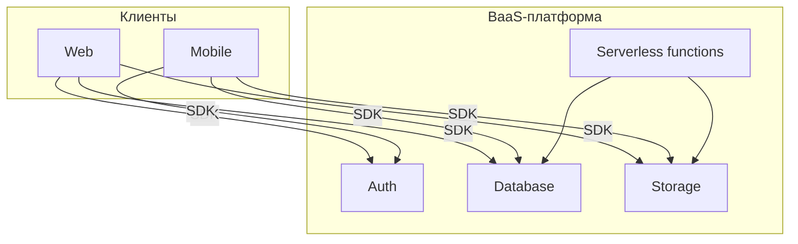

[← Назад к индексу части 17](index.md)

## 17.4. BaaS: быстрый старт и его цена

### Цель раздела

Помочь тебе увидеть **BaaS не как «магический бесплатный бекенд»**, а как **набор архитектурных решений и ограничений**, которые ты принимаешь: что BaaS даёт, какие сценарии для него естественны, где он начнёт мешать, и как думать о миграции.

### В этом разделе главное

- BaaS (Firebase, Supabase и др.) даёт **готовые кирпичи бекенда**: аутентификация, БД, файлы, серверные функции.
- Это сильно ускоряет старт (особенно для MVP и небольших продуктов), но:
  - ограничивает **модель данных и безопасности**;
  - создаёт **vendor lock‑in**;
  - может быть дорогим при росте нагрузки.
- Архитектурное решение «идём в BaaS» должно сопровождаться:
  - пониманием **границ платформы**;
  - хотя бы грубым планом **миграции**, если продукт выстрелит.

### Термины

- **Rules / Policies** — правила доступа к данным и ресурсам в BaaS.
- **Serverless functions** — малые функции, исполняемые провайдером по событию/HTTP.
- **Multi‑tenant** — сценарии, где одна платформа обслуживает множество клиентов.

### Теория и правила

1. **Что даёт BaaS.**

   Обычно:

   - аутентификация и авторизация;
   - БД (документная/реляционная) с API;
   - хранилище файлов;
   - функции (serverless);
   - триггеры по событиям.

2. **Где BaaS силён.**

   - MVP‑проекты, прототипы;
   - небольшие приложения с предсказуемой моделью;
   - продукты, где **скорость вывода на рынок** важнее, чем полная гибкость.

3. **Где BaaS начинает мешать.**

   - Сложные доменные модели, требующие тонкого контроля над БД.
   - Особые требования по **регуляторике, изоляции данных, аудиту**.
   - Необычные паттерны по масштабированию и отказоустойчивости.

4. **Vendor lock‑in как архитектурный долг.**

   - Чем глубже ты полагаешься на:
     - специфический язык запросов;
     - проприетарные расширения;
     - уникальные фичи (например, встроенный чат/аналитика),
   - тем **сложнее миграция**.

### Сквозной пример: “стартуем на BaaS, но сохраняем путь к миграции”

Если выбираете BaaS ради скорости, сделайте это так, чтобы “переезд” был возможен не теоретически, а практически.

**Принцип 1. Не прятать доменные правила в rules/policies как единственное место логики**

- правила доступа в BaaS — важны, но доменные инварианты лучше держать в контролируемом коде (functions/серверный слой), иначе миграция превратится в переписывание “магии”.

**Принцип 2. Выделить контракт данных (схемы/DTO) и места интеграции**

- явно описать: что считается сущностями, какие операции (создать/оплатить/выдать доступ) есть, и что является источником истины.

#### Пошаговый план миграции (если продукт вырос)

0) Миграция = Strangler (см. часть 32), не big‑bang.  
1) Выбери 1 домен, который болит сильнее всего (billing/права/интеграции).  
2) Построй рядом “свой” сервис с контрактом (REST/gRPC) и наблюдаемостью (часть 31).  
3) Переведи один поток трафика/операцию на новый сервис (canary/shadowing).  
4) Перенеси данные домена (план отката обязателен).  
5) Сократи роль BaaS до “краевых задач” или выведи его полностью.

#### Стоп‑условия (когда BaaS становится подозрительным выбором)

- нужна строгая регуляторика/аудит/изоляция (enterprise);
- нужны приватные сети/VPC‑зависимости и тонкий контроль над инфраструктурой;
- доменная логика усложнилась и требует управляемых транзакций/инвариантов;
- 2+ команды и контракт должен жить независимо от UI и SDK платформы.

### Простыми словами

BaaS — это как **арендовать квартиру с мебелью**:

- быстро заехал;
- не нужно покупать мебель, технику, ставить окна.

Но:

- ты не можешь свободно ломать стены;
- не можешь легко перенести квартиру в другой дом;
- если хозяин повысит аренду или поменяет правила, ты зависим.

В программных терминах:

- быстро стартуешь, не строя собственный бекенд;
- но архитектурные решения (как устроены данные, права, лимиты) во многом приняты за тебя.

### Картинка в голове

Твой «бекенд» — это тонкий слой над SDK и функциями внутри BaaS. Мигрировать на другой стек = **поменять дом**, а не только мебель.

### Как запомнить

- BaaS = **скоростной старт, дорогой переезд**.
- Если ты заранее знаешь, что система будет:
  - долго жить;
  - сильно расти;
  - требовать особых гарантий,  
  — BaaS стоит рассматривать как **временное решение** или вообще не использовать.

### Примеры

**Пример 1. Учебное приложение или pet‑project**

- Авторизоваться через Google/Email;
- хранить пару коллекций документов;
- хранить картинки пользователей.

BaaS идеально: минимальный код, фокус на продукте.

**Пример 2. Корпоративная CRM с особыми требованиями**

- Сложные бизнес‑правила;
- отчёты, аудиты, интеграции;
- регуляторные требования.

BaaS станет **жёстким ограничителем**, придётся либо городить костыли, либо мигрировать.

### Практика / реальные сценарии

- Стартап вырастает, и внезапно:
  - счета за BaaS становятся большими;
  - нужны функции, которых нет в платформе;
  - попытка миграции выглядит как переписывание системы.
- Команда не думает об архитектуре, потому что «за нас подумал BaaS», но:
  - схемы данных становятся хаотичными;
  - правила безопасности сложно поддерживать и тестировать.

### Типичные ошибки

- Начинать серьёзный продукт на BaaS **без плана**, что будет, если он выстрелит.
- Считать, что BaaS «решает архитектуру»:
  - на самом деле он просто **подставляет свою архитектуру**, а не убирает потребность думать.
- Завязывать всё на **специфические фичи** (проприетарные триггеры, особые интеграции), усложняя миграции.

### Что будет, если…

- …игнорировать vendor lock‑in при планировании?
  - Через пару лет окажется, что ты **заперт** в платформе, а повышающиеся цены и ограничения бьют по бизнесу.
- …использовать BaaS только на ранней стадии, сохраняя **минимум специфики**?
  - Ты получишь быстрый старт, и при необходимости миграция будет проще: меньше завязок на уникальные фичи платформы.

### Проверь себя

1. Чем BaaS принципиально отличается от «просто PaaS или IaaS»?  
2. В каких сценариях BaaS — **особенно разумный выбор**, а в каких — подозрительный сигнал?  
3. Какие признаки подскажут, что «пора думать о миграции» с BaaS?

Ответ

1. PaaS/IaaS дают инфраструктуру (серверы, контейнеры, базы) для твоего кода; BaaS даёт **готовые сервисы бекенда** (auth, БД, storage, функции) и диктует архитектурную модель данных и безопасности.  
2. Разумный выбор: MVP, учебные/внутренние приложения, проекты с маленькой командой и фокусом на быстрый вывод. Подозрительный — долгосрочные продукты с жёсткими требованиями к данным, интеграциям, регуляторике.  
3. Например: растущие счета, боль от ограничений по данным и запросам, потребность в функциях, которых нет у провайдера, сложности с соблюдением регуляторных требований, рост технического долга в правилах доступа и структурах данных.

### Запомните

- BaaS — сильный инструмент, но **архитектурно дорогой**: принимает за тебя много решений и усложняет отступление назад.

---
