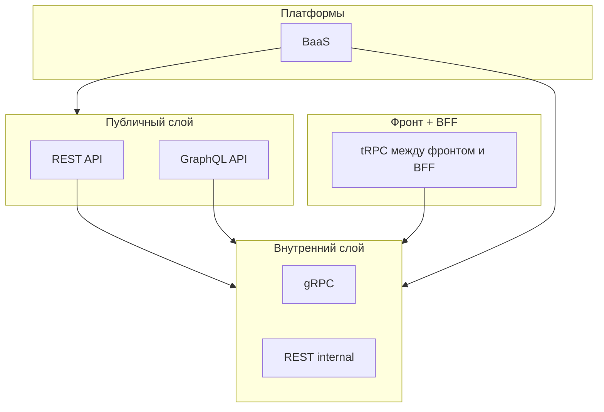

[← Назад к индексу части 17](index.md)

## 17.5. Как выбирать: REST, GraphQL, gRPC, tRPC, BaaS

### Цель раздела

Дать тебе **практический чек‑лист**, который поможет выбирать между REST, GraphQL, gRPC, tRPC и BaaS под конкретный сценарий: публичный API, внутренний сервис, MVP, BFF‑слой и т.п., а также показать типичные анти‑паттерны.

### В этом разделе главное

- Нет «лучшего» API‑подхода, есть **подход под контекст**.
- REST, GraphQL, gRPC, tRPC и BaaS — это **разные уровни и аспекты**:
  - REST/GraphQL/gRPC — про **контракты и протоколы**;
  - tRPC — про **end‑to‑end типобезопасность в TS‑стеке**;
  - BaaS — про **делегирование бекенда платформе**.
- Часто уместна **комбинация**:
  - REST/GraphQL публично + gRPC внутри;
  - tRPC между фронтом и BFF;
  - BaaS как временное решение или часть системы.

### Термины

- **Публичный API** — API для внешних клиентов/интеграторов.
- **Внутренний API** — API между сервисами или внутренними компонентами.
- **BFF** — Backend for Frontend, слой адаптации под конкретный тип клиента.

### Теория и правила

1. **Смотри на тип клиента.**

   - Браузер, внешние партнёры → **REST или GraphQL**;
   - внутренние сервисы → **REST или gRPC** (иногда GraphQL).

2. **Смотри на организационный контекст.**

   - Одна команда, один стек → **tRPC** может сильно ускорить;
   - много команд, много клиентов и языков → лучше **явные IDL** (OpenAPI, GraphQL, protobuf).

3. **Смотри на жизненный цикл продукта.**

   - MVP/эксперимент → можно взять **BaaS или tRPC**;
   - долгоживущая платформа → лучше **устойчивые, хорошо документируемые контракты**.

4. **Смотри на нагрузки и профиль трафика.**

   - много коротких запросов между сервисами → gRPC имеет смысл;
   - богато связанные запросы от клиента по данным → GraphQL;
   - простые CRUD/ресурсные операции → REST.

### Простыми словами

Подбор API‑подхода похож на **выбор транспорта в городе**:

- REST — **автобусы и метро**: стандартизированно, привычно, подходит большинству;
- GraphQL — **такси по маршруту клиента**: клиент сам говорит, куда и как ехать (какие поля нужны);
- gRPC — **служебный транспорт**: быстрый, но не для всех;
- tRPC — **личный самокат команды**: удобно, пока команда одна и все рядом;
- BaaS — **каршеринг со своей экосистемой**: сел и поехал, но ездишь по правилам провайдера.

### Картинка в голове

Система редко использует **что‑то одно**; важно, чтобы комбинация была осознанной.

### Как запомнить

- Вопрос «что выбрать» всегда начинай с:
  - **кто клиент?**
  - **кто команда и стек?**
  - **какой жизненный цикл продукта?**
  - **какие ограничения по данным и регуляторике?**

### Сравнительная таблица подходов

| Подход | Где уместен | Сильные стороны | Ограничения / риски |
|--------|-------------|-----------------|----------------------|
| **REST** | Публичные и внутренние API, простые CRUD, интеграции с партнёрами | Простота, читаемость, богатая экосистема (OpenAPI), кэширование HTTP | Многословность, возможен over/under‑fetching, сложные графы данных требуют нескольких запросов |
| **GraphQL** | Клиентские приложения с богатыми экранами и разными сценариями чтения | Клиент выбирает поля, один запрос вместо нескольких, типизированная схема | Сложнее сервер и кэширование, риск «толстой» схемы, нужен опыт команды |
| **gRPC** | Внутренние микросервисы, высоконагруженные и стриминговые сценарии | Быстрый бинарный протокол, строгий IDL, codegen для разных языков, стриминг | Плохо подходит как прямой браузерный API, требует дисциплины в эволюции `.proto`, повышает связанность |
| **tRPC** | TS‑стек, монорепо, связка фронт+BFF, быстрые продукты | End‑to‑end типы, минимум «клея», быстрый фидбек при изменениях | Сильное сцепление фронта и бэка, слабая пригодность для внешних клиентов и других языков |
| **BaaS** | MVP, учебные/внутренние продукты, небольшие приложения | Очень быстрый старт, много готовых кирпичей (auth, БД, storage, функции) | Vendor lock‑in, ограниченная гибкость схемы и безопасности, возможные проблемы с ценой и регуляторикой при росте |

#### Проверь себя по сравнительной таблице

1. Какой подход ты выберешь для **публичного API с большим числом внешних интеграторов** и почему?  
2. Какую комбинацию из таблицы ты бы предложил для **крупной микросервисной платформы** с веб‑клиентом и мобильным приложением?  
3. В каком случае ты сознательно выберешь **BaaS**, даже понимая риск vendor lock‑in, и какие «страховочные» меры заложишь в архитектуру?

Ответ

1. Чаще всего — REST с хорошей OpenAPI‑схемой, либо GraphQL, если интеграторам критична гибкость выборки данных. Эти подходы проще для сторонних команд и инструментов (HTTP, curl, Postman, генераторы клиентов), хорошо документируются и меньше завязывают партнёров на твой внутренний стек.  
2. Типичный вариант: REST/GraphQL на публичном слое; внутри между сервисами — gRPC для плотных взаимодействий и стриминга; между фронтом и BFF в TS‑стеке — tRPC для скорости разработки. BaaS можно использовать точечно (например, для аутентификации или второстепенных фич), но не в качестве ядра.  
3. Например, для MVP или временного внутреннего продукта, где важнее быстро проверить гипотезу, чем строить долговечную платформу. В качестве страховки — явно отделять доменную модель от специфики BaaS (слой собственного API, анти‑коррапшн слой), избегать глубокой завязки на проприетарные фичи и периодически оценивать стоимость потенциальной миграции.

### Примеры

**Пример 1. Публичное API для партнёров**

- Много разных стеков, разные языки, долгоживущие интеграции:
  - REST с хорошей OpenAPI‑документацией — часто лучший выбор;
  - GraphQL — если партнёрам важна гибкость запросов.
- gRPC — только если партнёры готовы вложиться в этот стек (редко).

**Пример 2. Внутренняя микросервисная платформа**

- Внешний слой:
  - REST/GraphQL.
- Внутренний слой:
  - gRPC между сервисами;
  - REST в местах, где gRPC избыточен или стек не поддерживает его хорошо.

**Пример 3. Стартап на React/Next.js**

- Фронт + BFF в одном монорепо:
  - tRPC между фронтом и BFF;
  - BFF к внешнему миру — REST/GraphQL.
- Если стартап выстрелил:
  - можно постепенно выносить части BFF/бекенда в отдельные сервисы.

**Пример 4. Прототип мобильного приложения**

- Быстрый старт:
  - BaaS для auth/БД/файлов;
  - минимум собственного кода.
- При росте:
  - постепенно выносить критичные части в собственный бекенд.

### Практика / реальные сценарии

- Компания, которая «всё сделала на GraphQL», потом добавляет gRPC для тяжёлых внутренних сценариев.
- Команда, начавшая с BaaS, со временем закрывает его собственным слоем API, чтобы:
  - уменьшить зависимость от платформы;
  - стандартизировать свои контракты.

### Типичные ошибки

- Выбирать технологию **по хайпу**, а не по контексту.
- Пытаться **сделать всё через один подход**:
  - весь мир через GraphQL;
  - весь мир через gRPC;
  - весь мир через tRPC.
- Игнорировать организационный аспект:
  - используешь tRPC в многокомандной среде без договорённостей;
  - вводишь gRPC там, где нет компетенций его поддерживать.

### Что будет, если…

- …просто спросить «что сейчас модно» и взять это?
  - Через год ты можешь получить **архитектуру, неудобную под твой реальный контекст**: команда, бизнес‑модель и пользователи будут «подгоняться» под инструмент, а не наоборот.
- …осознанно комбинировать подходы?
  - Ты получишь систему, где **каждый слой использует адекватный инструмент**:
    - REST/GraphQL для внешних клиентов;
    - gRPC для внутренних сервисов;
    - tRPC для фронт+BFF в одном стеке;
    - BaaS — там, где он действительно даёт пользу.

### Проверь себя

1. Какие вопросы ты задашь, прежде чем выбрать между REST и GraphQL для нового публичного API?  
2. В каких случаях gRPC внутри системы будет **существенно лучше REST**, а в каких — просто усложнит жизнь?  
3. Как ты встроишь tRPC и/или BaaS в архитектуру, чтобы не оказаться в «золотой клетке»?

Ответ

1. Кто клиенты (браузер, сервер, партнёры), какие типы запросов (богатые по данным или простые CRUD), важна ли гибкость выборки и уменьшение overfetching, насколько критичны кэширование и простота документации, есть ли опыт команды с GraphQL.  
2. Лучше — при большом количестве внутренних вызовов, строгой типизации и потребности в стриминге; хуже — когда команда не знакома с gRPC, нагрузка небольшая, а основная проблема в дизайне домена/БД, а не в протоколе.  
3. Использовать tRPC **на границе фронт+BFF**, но не делать его единственным способом общения всех сервисов; использовать BaaS как временное или ограниченное по сфере решение, сохраняя **слой собственного API**, через который клиенты общаются с системой.

### Запомните

- API‑подходы — это **инструменты в ящике архитектора**. Настоящее мастерство — **выбирать и комбинировать** их под контекст, а не выбирать «одну истинную технологию».

---
