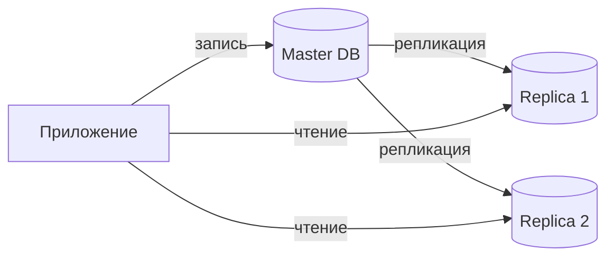
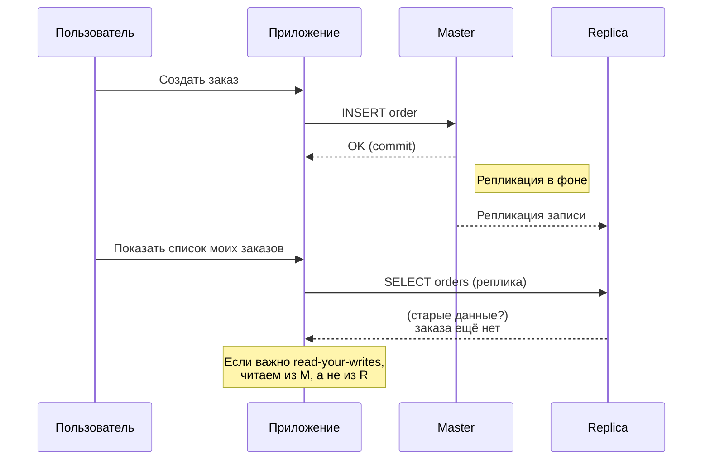

[← Назад к индексу части 18](index.md)

## 18.1. Репликация, консистентность и кворумы

### Цель раздела

Сформировать **чёткое понимание**, как работает репликация данных в распределённых системах, какие есть варианты **консистентности**, что такое **read‑your‑writes** и **кворумы**, и как эти решения влияют на UX, отказоустойчивость и сложность системы.

### В этом разделе главное

- Репликация отвечает за **копирование одних и тех же данных** на несколько узлов для отказоустойчивости и масштабирования чтений.
- В схемах master‑replica всегда есть **репликационный лаг** — задержка распространения изменений.
- Разные модели консистентности (strong, eventual, read‑your‑writes) дают **разный пользовательский опыт** и требования к архитектуре.
- CAP‑теорема — это не формула «выбери две буквы», а напоминание, что при сетевых проблемах нужно выбирать **компромисс между консистентностью и доступностью**.
- Кворумы чтения/записи позволяют **управлять балансом** между доступностью и согласованностью.

### Термины

- **Master‑replica** — топология, в которой один узел принимает записи (master/primary), а остальные реплицируют его данные и обслуживают в основном чтения.
- **Replication lag** — разница во времени между записью на мастере и появлением результата на реплике.
- **Read‑your‑writes** — гарантия, что клиент, который только что что‑то записал, **не увидит старые данные** в следующем чтении.
- **Strong consistency** — модель, в которой операции выглядят так, будто они выполняются **в одном едином узле** с тотальным порядком.
- **Eventual consistency** — модель, в которой возможны **временные расхождения**, но система в итоге приходит к согласованному состоянию.
- **Quorum** — правило, сколько узлов должны подтвердить операцию, чтобы считать её успешной (чтение, запись).

### Теория и правила

#### 1) Зачем нужна репликация

Репликация решает сразу несколько задач:

- **Отказоустойчивость**: если упал один узел, другие содержат актуальные (или почти актуальные) данные → система продолжает работать.
- **Масштабирование чтений**: можно распределить нагрузку чтения по нескольким репликам (особенно полезно для read‑heavy систем).
- **Геораспределение**: можно держать реплики ближе к пользователям в разных регионах, уменьшая латентность чтения.

Важно: репликация **сама по себе**:

- **не увеличивает пропускную способность записей**, если запись всё равно идёт через один мастер;
- добавляет **сложность консистентности**: данные на разных узлах могут отличаться в течение какого‑то времени.

#### 2) Мастер‑реплика и репликационный лаг

Типичная схема:

Запись:

- приложение пишет в **Master**;
- мастер фиксирует транзакцию;
- изменения **асинхронно** уходят на **R1**, **R2**.

Отсюда:

- между моментом `COMMIT` на мастере и появлением данных на реплике есть **репликационный лаг**;
- если сразу после записи читать с реплики, можно получить **старые данные**.

Правило:

- для операций, где пользователю критично видеть результат сразу (например, **создание только что оформленного заказа в его списке**), часто читают **из мастера** или используют сессионную консистентность.

#### 3) Модели консистентности: strong vs eventual vs read‑your‑writes

Важные практические режимы:

- **Strong consistency**:
  - как будто все операции идут через один узел;
  - при успешном ответе чтение **везде** возвращает новое состояние.
- **Eventual consistency**:
  - разные узлы могут отдавать **разные ответы** какое‑то время;
  - со временем все приходят к одному состоянию.
- **Read‑your‑writes**:
  - частный случай: **для одного клиента** гарантируется, что он видит свои изменения;
  - иногда достигается за счёт того, что этот клиент **временно читает только с мастера** или «закреплён» за конкретной репликой.

В архитектуре часто выбирают **смешанные подходы**:

- критичные операции (деньги, права доступа) → стремимся к **strong или read‑your‑writes**;
- менее критичные (счётчики просмотров, статистика) → **eventual** приемлема и даже желательна (дешевле и проще масштабировать).

##### Практическая таблица: “какую консистентность выбирать под сценарий”

| Сценарий | Что пользователь ожидает | Что чаще выбирают | Что важно предусмотреть |
| --- | --- | --- | --- |
| Оплата/баланс/права доступа | “сразу и точно” | strong / read‑your‑writes | транзакции, блокировки/идемпотентность, аудит |
| Создал заказ → сразу открыл “Мои заказы” | “вижу свой заказ” | read‑your‑writes (читать с мастера/сессионно) | UX‑подсказка “обновляем…”, защита от чтения со stale‑реплики |
| Лайки/счётчики просмотров | “примерно верно” | eventual | агрегация, батчи, допустимые расхождения |
| Поиск/каталог/индекс | “быстро, может с лагом” | eventual (проекции/индексы) | мониторинг лагов индекса, fallback на основной источник |
| Админка справочников | “после сохранения вижу новое” | read‑your‑writes | простой путь: читать из мастера/той же транзакции |

Ключ: консистентность — это не “свойство базы”, а **договор с пользователем** и осознанный выбор UX‑поведения при лаге/рассинхроне.

На практике используются и более точные модели:

- **Linearizability (линеаризуемость)** — сильная гарантия: операции выглядят так, будто выполняются мгновенно в некотором общем порядке, уважающем реальное время.
- **Causal consistency (причинно‑следственная)** — если операция `B` явно зависит от `A`, то все узлы никогда не увидят `B` «раньше» `A`, но независимые операции могут приходить в разном порядке.

Интуитивно:

- linarizability делает рассуждение о системе проще (особенно для денег и прав доступа), но стоит дороже;
- causal и eventual позволяют проще масштабироваться, но усложняют UX и отладку: пользователь может некоторое время видеть «старую версию мира».

##### Проверь себя: модели консистентности

1. В чём отличие **strong consistency** от **linearizability** на интуитивном уровне, и почему в учебных материалах их часто не разделяют?  
2. Когда **causal consistency** может быть достаточной, а когда тебе захочется заплатить за более сильную модель?  
3. Как выбор модели консистентности влияет на пользовательский опыт в интерфейсе?

Ответ

1. В большинстве «прикладных» описаний strong consistency уже подразумевает поведение очень близкое к linearizability: кажется, что операции выполняются в одном тотальном порядке. Формально strong consistency может описывать свойства реплик, а linearizability — свойства отдельных операций во времени, но для архитектора важнее интуиция: чем сильнее модель, тем проще о ней думать и дороже её реализовать.  
2. Causal consistency часто достаточно там, где важен порядок *зависимых* действий (комментарий после поста, ответ после вопроса), но не критично, в каком порядке пользователи увидят независимые события. Для денег, инвентаря, прав доступа, когда ошибка дорого стоит и сложно объяснима для пользователя, чаще выбирают сильные модели (linearizable/strong + read‑your‑writes).  
3. Более слабые модели означают, что пользователь может видеть «откаты» и противоречивые состояния (например, кнопка говорит «оплачено», а список — «в обработке»). Это допустимо для лайков и просмотров, но плохо для критичных операций. Сильные модели дают предсказуемость, но увеличивают латентность и чувствительность к сбоям.

#### 4) Синхронная vs асинхронная репликация

**Асинхронная репликация** (классический master‑replica):

- мастер подтверждает запись **не дожидаясь**, пока все реплики применят изменения;
- плюсы: низкая латентность записи, меньше зависимость от «медленных» реплик;
- минусы: при падении мастера часть записей, которые клиенту уже подтвердили, могла **ещё не успеть попасть** на реплики.

**Синхронная репликация**:

- мастер подтверждает `COMMIT` только после того, как **нужное число реплик** записало изменения;
- плюсы: сильнее гарантии «данные точно не потерялись при падении одного узла»;
- минусы: выше латентность, зависимость от состояния реплик (медленная реплика тормозит всех).

Часто применяют гибрид:

- часть реплик помечают как **синхронные** (для RPO≈0), остальные — как **асинхронные** (для чтения, бэкапов, геораспределения);
- настройки синхронности и кворума записи (`W`) по сути задают **компромисс между латентностью, RPO и доступностью**.

##### Проверь себя: синхронная vs асинхронная репликация

1. Почему асинхронная репликация обычно даёт меньшую латентность записи, но хуже RPO?  
2. В каком типичном сценарии тебе захочется включить хотя бы одну **синхронную** реплику, даже ценой увеличения задержек?  
3. Как настройки «синхронность + `W`» связаны с тем, сколько данных вы **готовы потерять** при аварии?

Ответ

1. Потому что мастер подтверждает `COMMIT`, не дожидаясь применения записи на всех репликах: запись занимает только время локальной транзакции и отправки событий репликатору. При этом, если мастер упадёт до того, как реплики успеют применить часть изменений, возможно «откатывание» уже подтверждённых клиенту операций.  
2. Например, в ядре платёжного сервиса или в хранилище критичных юридически значимых записей: там ценность «не потерять ни одной подтверждённой операции» зачастую выше, чем рост задержек на единицы–десятки миллисекунд. Синхронная репликация с кворумом записи даёт более жёсткие гарантии.  
3. Если запись считается успешной только после подтверждения от нескольких узлов, то падение одного из них не приводит к потере данных: другие реплики уже содержат изменения. Чем выше `W` и чем больше синхронных реплик, тем ближе ваш RPO к нулю, но тем больше зависимость от того, чтобы эти реплики были живы и быстры.

#### 5) CAP‑теорема и практический взгляд

CAP в одном предложении:

> В распределённой системе при сетевых разделениях (partition) нельзя одновременно гарантировать *сильную консистентность* и *полную доступность*.

Практический смысл:

- если часть узлов **не видит** другую часть (разделение сети), мы выбираем:
  - **отключить записи/чтения** для части запросов (жертвуем доступностью, сохраняем консистентность);
  - или **разрешать «локальные» операции**, рискуя конфликтами и рассогласованием (жертвуем консистентностью, сохраняем доступность).

В большинстве реальных БД и систем:

- они дают **настраиваемый баланс** через:
  - кворумы чтения и записи;
  - политики конфликтов;
  - выбор режима (strong/relaxed/eventual).

#### 6) Кворумы чтения и записи

В системах с несколькими репликами один и тот же ключ может храниться на **N узлах**. Тогда:

- кворум записи `W`: сколько узлов должны подтвердить запись;
- кворум чтения `R`: сколько узлов нужно прочитать, чтобы вернуть результат.

Классическое правило:

- если `W + R > N`, то чтение и запись **пересекаются хотя бы на одном узле**, что даёт более сильные гарантии консистентности.

Пример:

- `N = 3`, `W = 2`, `R = 2`:
  - запись считается успешной после подтверждения от 2 узлов;
  - чтение опрашивает 2 узла;
  - они **обязательно пересекутся** минимум на одном узле.

Практический вывод:

- повышая `W` и `R`, мы жертвуем частью **доступности** (нужно больше живых узлов), но получаем **лучше согласованность**;
- снижая `W`/`R`, повышаем доступность, но увеличиваем риск **старых или конфликтующих данных**.

#### 7) Многомастер и split‑brain

**Многомастер (multi‑master)**:

- несколько узлов принимают записи **параллельно**;
- полезен для геораспределённых и офлайн‑сценариев (офлайн‑клиент синхронизируется позже).

Цена:

- возможны **конфликты записей**, когда разные мастера по‑разному меняют одну и ту же сущность;
- нужны стратегии разрешения:
  - «последняя запись побеждает» (по времени/версии);
  - доменные правила (например, максимальный баланс/сумма, merge счётчиков);
  - ручное разруливание конфликтов через отдельный процесс.

**Split‑brain**:

- сетевое разделение, при котором кластер распадается на части, и **каждая часть считает себя «настоящим» кластером**;
- если обе стороны продолжают принимать записи, после восстановления связи возникает **лавина конфликтов и расхождений**.

Чтобы этого избежать:

- используют кворумные протоколы (Raft, Paxos), избирателей лидера, механизмы fencing‑токенов;
- проектируют так, чтобы «меньшая» часть кластера **отключала приём записей**;
- уже на этапе архитектуры формулируют: **в этом сервисе при разделении сети мы жертвуем либо консистентностью, либо доступностью** — и подкрепляют решение настройками репликации.

##### Проверь себя: многомастер и split‑brain

1. В чём ключевое преимущество схемы **multi‑master** по сравнению с классическим master‑replica?  
2. Какие типы конфликтов могут возникать при многомастере и почему «последний записавший побеждает» не всегда приемлемая стратегия?  
3. Как архитектурные решения (кворумы, выбор лидера, отключение меньшей части кластера) помогают избежать split‑brain и его последствий?

Ответ

1. Основное преимущество — возможность принимать записи **в нескольких точках одновременно**: это даёт меньшую задержку для геораспределённых пользователей и лучше работает в офлайн‑/edge‑сценариях (локальная нода пишет сразу, синхронизируется позже). Но это усложняет консистентность и обработку конфликтов.  
2. Конфликты: два мастера могут изменить одну и ту же запись по‑разному (разные поля, инкременты счётчиков, конкурирующие изменения статуса). Стратегия «last write wins» по времени может приводить к потере важных изменений (например, перезаписи более правильного состояния менее правильным, но более поздним). Часто нужны доменные правила (merge, max, суммирование, отказ от одного из событий) или ручное разруливание.  
3. Кворумы и протоколы консенсуса (Raft/Paxos) обеспечивают выбор единственного лидера, через которого проходят записи; при разделении сети меньшая часть кластера теряет кворум и **перестаёт принимать записи**, сохраняя консистентность за счёт снижения доступности. Это уменьшает вероятность split‑brain, когда две части системы независимо считают себя «главными» и накапливают конфликтующие изменения.

### Пошагово: как проектировать репликацию для сервиса

1. **Определи профиль нагрузки**:
   - много чтений и мало записей (read‑heavy);
   - много записей (write‑heavy);
   - геораспределение пользователей.
2. **Реши, что для тебя критично**:
   - всегда ли пользователь должен видеть **моментально** свои изменения?
   - сколько отказов узлов система должна переживать без простоев?
3. **Выбери топологию**:
   - простой master‑replica в одном регионе;
   - мастер + реплики по регионам;
   - многомастер (реже, выше сложность конфликтов).
4. **Определи, откуда кто читает**:
   - критичные запросы (баланс, безопасность) → читать с мастера или с кворума;
   - менее критичные (лидерборд, просмотры) → можно с ближайшей реплики.
5. **Настрой monitoring**:
   - `replication lag` по каждой реплике;
   - алерты при превышении порогов;
   - fallback‑стратегии (например, временно отключить чтения с сильно отстающих реплик).

### Простыми словами

Представь:

- **Мастер** — это «главный журнал» записей.
- **Реплики** — это «копии журнала» в других комнатах.

Если ты только что что‑то записал в главный журнал, а потом побежал читать с копии в другой комнате, там запись может появиться **чуть позже**. Это и есть replication lag.

Если для тебя важно **сразу увидеть свою запись**:

- либо читай из того же журнала (мастера),
- либо жди, пока копия догонит (read‑your‑writes через сессию).

### Картинка в голове

### Как запомнить

- **Репликация = копии тех же данных. Шардирование = куски разных данных.**
- **Strong** — все видят одно и то же; **eventual** — все **в итоге** видят одно и то же.
- Если пользователь жалуется «я только что сохранил, а не вижу» — это почти всегда история про:
  - **репликационный лаг**,
  - **чтение с реплики вместо мастера**,
  - или про отсутствие read‑your‑writes.

### Примеры

#### Пример 1. Чтения с реплик для отчётности

- Интернет‑магазин:
  - создание заказа и списание денег → запись в мастер;
  - отчёты для менеджеров (список заказов за неделю) → чтение с реплик.
- Репликационный лаг в пару секунд **некритичен** для отчётов, но критичен для личного кабинета пользователя:
  - личный кабинет: лучше читать из мастера или из реплики с read‑your‑writes.

#### Пример 2. Геораспределённые реплики

- Пользователи в Европе и США.
- Мастер в Европе, реплика в США:
  - европейские пользователи читают из мастера;
  - американские — из реплики в США (быстрее).
- Операции, где важно read‑your‑writes (например, смена пароля):
  - временно читают из мастера, пока не истечёт «окно» лагов или пока не получим явное подтверждение, что реплика догнала.

### Практика / реальные сценарии

- **Сервисы с балансами и транзакциями**:
  - баланс пользователя **обязательно** читается из мастера или через кворум;
  - вспомогательные отчёты и статистика — с реплик, готовы терпеть eventual consistency.
- **Ленты новостей и счётчики просмотров**:
  - могут жить на eventual consistency: цифра «1234 просмотра» может обновиться через несколько секунд.

### Типичные ошибки

- Читать **всё подряд** с реплик без учёта read‑your‑writes.
- Не мониторить replication lag и удивляться жалобам «данные пропадают/появляются через минуту».
- Делать многомастер **без стратегии разрешения конфликтов** (последний победил, но по какому времени?).

### Что будет, если…

- …игнорировать replication lag и читать критичные данные с реплик?
  - Пользователи будут видеть противоречивые состояния («деньги списали, а покупка не появилась»), терять доверие и создавать лишние тикеты.
- …отказаться от репликации ради простоты?
  - Любая проблема с единственным узлом БД превратится в **простой всей системы**; масштабирование чтений и геораспределение станут сильно сложнее.

### Проверь себя

1. В чём разница между **репликацией** и **шардированием** в контексте целей системы?  
2. Почему даже при master‑replica архитектуре пользователи могут не видеть свои последние изменения?  
3. Как помогают **кворумы** найти баланс между доступностью и консистентностью?

Ответ

1. Репликация создаёт **копии тех же данных** для отказоустойчивости и масштабирования чтения; шардирование делит **разные данные по узлам**, чтобы масштабировать объём и записи.  
2. Потому что репликация обычно асинхронная, и между `COMMIT` на мастере и применением изменений на реплике есть **репликационный лаг**; если читать с реплики, мы можем попасть в «окно устаревших данных».  
3. Устанавливая `W` и `R`, мы выбираем, сколько узлов должны участвовать в записи и чтении. Большие `W`/`R` повышают согласованность (операции пересекаются на одних и тех же узлах), но снижают доступность (нужно больше живых узлов); малые — наоборот.

### Запомните

- Репликация — это **про копии и отказоустойчивость**, а не про масштабирование записей.
- Любая репликация приносит с собой **вопросы консистентности и лагов**; их нужно осознанно решать.
- **Read‑your‑writes** — это не «магическая настройка», а **архитектурное решение**, как маршрутизировать чтения после записи.

---
