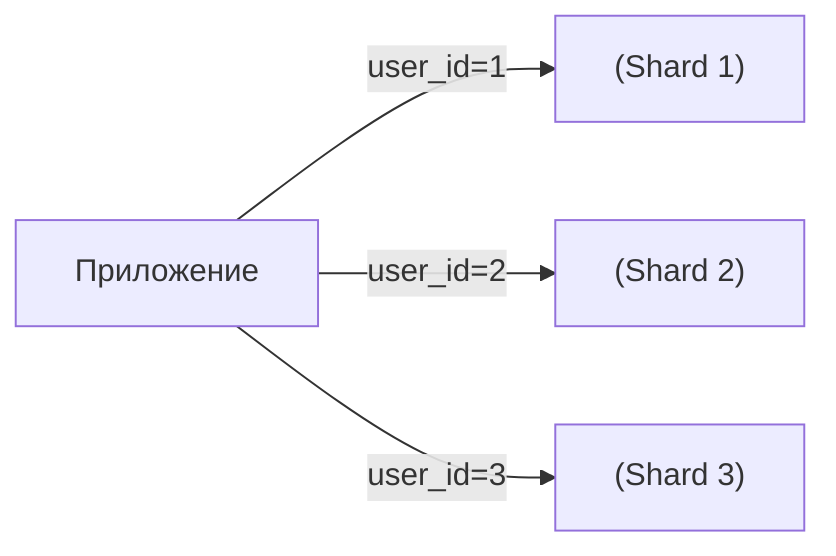

[← Назад к индексу части 18](index.md)

## 18.2. Шардирование, партиционирование и решардинг

### Цель раздела

Понять, как **делить данные по узлам**, чтобы система масштабировалась по объёму и нагрузке, как выбирать **ключ шардирования**, что такое **партиционирование по времени/диапазону**, и как безопасно проходить через **решардинг** (перенос данных между шардами).

### В этом разделе главное

- Шардирование решает задачу: «данных и нагрузки стало слишком много для одного узла».
- Выбор **ключа шардирования** критичен: от него зависят равномерность и сложность запросов.
- Партиционирование по времени помогает управлять **жизненным циклом исторических данных**.
- Решардинг — неизбежен в долгоживущих системах; нужно планировать его заранее.
- Непродуманное шардирование легко приводит к **горячим ключам** и **распределённым джойнам**.

### Термины

- **Shard (шард)** — логический или физический фрагмент данных (обычно набор строк или ключей), за который отвечает отдельный узел или кластер.
- **Партиция (partition)** — подмножество данных в пределах одной БД/таблицы (часто по времени или диапазону ключей).
- **Горячий ключ (hot key)** — значение ключа шардирования, на которое приходится **непропорционально много запросов**.
- **Resharding (решардинг)** — процесс изменения схемы шардирования (ключа, количества шардов) с переносом данных.

### Теория и правила

#### 1) Зачем нужно шардирование

Один узел БД имеет:

- ограничения по **объёму данных** (диск/память),
- ограничения по **скорости операций** (CPU/IO),
- ограничения по **сетевому трафику**.

Когда масштабирование «вертикально» (добавить CPU/RAM/диск) уже мало помогает или становится слишком дорогим, применяют **горизонтальное масштабирование данных** — шардирование.

Идея:

- разделить данные по ключу (`user_id`, `tenant_id`, `region` и т.п.) на несколько шардов;
- каждое приложение знает, **в какой шард ходить** за конкретным ключом.



#### 2) Выбор ключа шардирования

Хороший ключ:

- распределяет нагрузку **довольно равномерно** по шардам;
- соответствует **основным паттернам доступа** (чтения/записи);
- не приводит к необходимости **часто выполнять запросы «между шардами»**.

Типичные варианты:

- `user_id` или `account_id`:
  - все данные пользователя (заказы, настройки) на одном шарде;
  - удобно для многопользовательских систем.
- `tenant_id`:
  - все данные арендатора (компании) в одном месте;
  - удобно для SaaS‑систем.
- `region`:
  - данные распределены по регионам (Европа, США и т.д.).

Опасные варианты:

- шардирование по полю, по которому часто нужны **диапазонные запросы** (например, `created_at`), без продуманной стратегии;
- шардирование по полю, по которому часто нужны **джойны между пользователями** (например, социальные графы).

Для мультитенантных систем часто используют **составной ключ**:

- шардирование по связке `tenant_id + user_id` или `tenant_id + hash(user_id)`;
- это позволяет:
  - не смешивать данные разных арендаторов;
  - внутри арендатора равномерно распределять нагрузку;
  - при необходимости переносить «тяжёлых» арендаторов на отдельные шарды/кластеры.

#### 3) Партиционирование внутри одной БД

Иногда проще не шардировать по ключу, а **партиционировать таблицу по времени или диапазону**:

- партиции по месяцам/годам;
- партиции по диапазонам ID.

Зачем:

- дешевле удалять/архивировать старые данные (дроп партиции);
- улучшить производительность запросов по «свежим» данным.

Партиционирование:

- не обязательно разносит данные по разным узлам;
- но помогает управлять **жизненным циклом** и **индексами**.

#### 4) Решардинг: почему он неизбежен

Со временем:

- меняется **распределение данных**;
- появляются новые требования (другие отчёты, multi‑tenant и т.д.);
- шардов может стать **слишком много или слишком мало**.

Решардинг — это:

- выбор **новой схемы шардирования** (другой ключ, другое количество шардов);
- **перенос данных** со старых шардов на новые;
- **миграция клиентов** на новую схему.

Часто применяется:

- **consistent hashing** и слои‑абстракции (route‑service), чтобы уменьшить объём движущихся данных;
- **double‑write** в старую и новую схему на время миграции;
- фоновая миграция старых данных;
- специализированные решения (Vitess, Citus, sharding‑модуль облака), которые помогают прозрачно мигрировать данные и маршрутизацию на уровне кластера.

### Пошагово: как думать о шардировании

1. **Зафиксируй доменную единицу разреза**:
   - по пользователям (`user_id`);
   - по арендаторам (`tenant_id`);
   - по регионам или бизнес‑единицам.
2. **Проанализируй основные запросы**:
   - какие запросы самые частые и тяжёлые;
   - по каким полям фильтруем/джойним.
3. **Проверь ключ на «горячие» значения**:
   - нет ли супермаксимально активного пользователя/арендатора;
   - нет ли явного дисбаланса по регионам.
4. **Спланируй рост**:
   - сколько шардов нужно сейчас;
   - как будешь добавлять новые (consistent hashing, «слоты шардов» и т.п.).
5. **Заранее спроектируй решардинг**:
   - возможность зафиксировать новый ключ;
   - механизм миграции (double‑write, feature flag для чтения).

### Простыми словами

Представь склад:

- если всё хранить в одном огромном ангаре, в какой‑то момент туда **физически не влезет** весь товар и погрузчики начнут застревать в пробках.
- шардирование — это когда ты строишь **несколько складов** и делишь товары по правилу:
  - склад 1 — для клиентов с ID 1–1000;
  - склад 2 — для клиентов с ID 1001–2000;
  - и т.д.

Если ты выбрал правило «все популярные клиенты на одном складе», этот склад станет **горячей точкой**.

Партиционирование по времени:

- это как выделить отдельный склад «для старого товара», который можно почти не трогать и иногда целиком утилизировать.

### Картинка в голове

```mermaid
graph LR
  subgraph Users["Пользователи"]
    U1["user_id=1"]
    U2["user_id=2"]
    U3["user_id=3"]
  end

  subgraph Shards["Шарды"]
    S1["Shard A"]
    S2["Shard B"]
  end

  U1 -->|hash("1")| S1
  U2 -->|hash("2")| S2
  U3 -->|hash("3")| S1
```

Здесь простая хеш‑функция распределяет пользователей по двум шардам. Если мы захотим добавить Shard C, придётся аккуратно менять функцию и переносить часть данных — это и есть решардинг.

### Как запомнить

- **Ключ шардирования должен совпадать с тем, как ты обычно к данным обращаешься.**
- Если основные запросы: «всё по пользователю» — логично шардировать по `user_id`.
- Если часто нужны кросс‑пользовательские агрегации (аналитика) — лучше выносить их в **отдельное аналитическое хранилище**, а не пытаться делать это на продовых шардах.

### Примеры

#### Пример 1. Шардирование интернет‑магазина по `user_id`

- Все заказы и корзины пользователя хранятся на одном шарде:
  - просто обслуживать профиль и историю заказов;
  - легко скейлить по количеству пользователей.
- Отчёты по всем пользователям за год:
  - читаются из **отдельного аналитического хранилища** (OLAP), куда данные попадают батчами/потоком.

#### Пример 2. Партиционирование логов по времени

- Таблица `logs` партиционирована по дате (`2026_03`, `2026_04`, …):
  - свежие логи читаются быстро (индексы на последних партициях);
  - старые партиции можно архивировать или удалять целиком.

### Практика / реальные сценарии

- **SaaS‑система с тысячами арендаторов**:
  - выбор между:
    - один кластер с шардированием по `tenant_id`;
    - отдельные БД/кластеры на арендатора (изолированность vs операционная сложность).
- **Социальная сеть**:
  - шардирование профилей по `user_id`;
  - отдельные графовые/поисковые хранилища для связей и поиска друзей.

### Типичные ошибки

- Шардирование «на будущий миллиард пользователей», когда реальной нагрузки ещё нет:
  - получаем сложность инфраструктуры без реального выигрыша.
- Выбор ключа шардирования, который ломает основные запросы:
  - шардирование по `order_id`, при том что почти все запросы — «всё по пользователю».
- Отсутствие плана решардинга:
  - система растёт, шарды забиваются неравномерно, а поменять схему почти невозможно без больших простоев.

### Что будет, если…

- …выбрать ключ шардирования, по которому нужны постоянные джойны между шардами?
  - Каждая сложная выборка превратится в **распределённый джойн**, дорогой по сети и ресурсоёмкий; производительность будет нестабильной.
- …игнорировать вопрос партиционирования исторических данных?
  - «Горячие» таблицы раздуются, индексы разрастутся, бэкапы и миграции станут очень тяжёлыми и медленными.

### Проверь себя

1. Какой ключ шардирования логичнее выбрать для сервиса, где почти все операции — «показать данные конкретного пользователя»?  
2. Чем шардирование отличается от партиционирования по времени в одной БД?  
3. Почему решардинг почти неизбежен в долгоживущих системах?

<details><summary>Ответ</summary>

1. Почти всегда — `user_id`: это совпадает с основным паттерном доступа и позволяет держать все важные данные пользователя на одном шарде.  
2. Шардирование обычно подразумевает **разные узлы или кластеры** для разных частей данных; партиционирование по времени может оставаться в **одном и том же кластере**, но помогает управлять жизненным циклом и индексами.  
3. Потому что со временем меняются объёмы, распределение нагрузки и требования; изначальный выбор количества шардов и ключа почти никогда не остаётся оптимальным на весь срок жизни системы.

</details>

### Запомните

- Шардирование — мощный, но сложный инструмент; его лучше применять **по мере роста**, а не «на всякий случай».
- Ключ шардирования должен быть **подчинён паттернам доступа**, а не только «красивой теории».
- Решардинг — это **часть жизненного цикла данных**, а не редкая экзотика.

---
