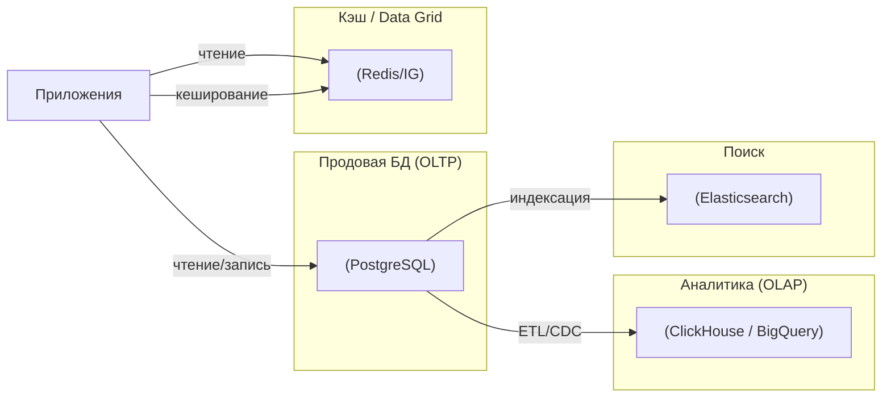

[← Назад к индексу части 18](index.md)

## 18.3. Полиглот‑персистентность, кэш и space‑based архитектура

### Цель раздела

Показать, как в реальных системах **сочетаются разные хранилища** (SQL, NoSQL, поиск, time‑series, кэш), зачем нужен **кэш как слой**, что такое **in‑memory data grid / space‑based архитектура**, и как на всё это влияют **регуляторные требования** (GDPR, data residency, аудит).

### В этом разделе главное

- Разные задачи требуют **разных типов хранилищ**: транзакции, аналитика, поиск, логирование, метрики.
- Полиглот‑персистентность — это осознанный выбор: **сложнее архитектурно, но гибче и эффективнее**.
- Кэш — это **копия данных** с осознанной стратегией инвалидации, а не второй «источник истины».
- Space‑based архитектура выносит **рабочее состояние в память кластера**, снижая нагрузку на БД, но усложняя консистентность и операции.
- Регуляторика (GDPR, data residency) влияет на то, **где и как мы храним и удаляем данные**.

### Термины

- **Полиглот‑персистентность** — архитектурное решение использовать **несколько типов хранилищ** под разные задачи.
- **OLTP‑хранилище** — БД, оптимизированная для транзакций: PostgreSQL, MySQL, и др.
- **OLAP‑хранилище / DWH** — хранилище для аналитики: ClickHouse, BigQuery, Snowflake и т.п.
- **Поисковый движок** — хранилище, оптимизированное для полнотекстового поиска (Elasticsearch, OpenSearch).
- **Time‑series DB** — хранилище для временных рядов (TimescaleDB, InfluxDB и др.).
- **In‑memory data grid** — распределённый кэш/хранилище в памяти кластера (Hazelcast, Ignite, Coherence).
- **Data residency** — требование хранить данные в определённом регионе/стране.
- **RPO/RTO** — показатели восстановления данных и времени восстановления.

### Теория и правила

#### 1) Зачем нужна полиглот‑персистентность

Один и тот же продукт обычно имеет:

- **транзакционные операции** (создание заказов, изменение баланса);
- **аналитику** (отчёты по продажам, фрод‑анализ);
- **поиск** (по товарам, пользователям, логам);
- **метрики и логи** (временные ряды, события).

Пытаться решить всё одной БД:

- либо приводит к **компромиссам** (медленные отчёты на продовой БД),
- либо к **ускоренному износу** системы (тяжёлые запросы мешают транзакциям).

Полиглот‑персистентность:

- позволяет подобрать **оптимальный инструмент для каждого типа нагрузки**;
- требует:
  - явного определения **источника истины** по каждому виду данных;
  - осознанных **ETL/CDC процессов** между хранилищами.

#### 2) Выбор СУБД под сценарий

Грубое, но полезное разбиение:

- **OLTP** (транзакции):
  - типичные кандидаты: PostgreSQL, MySQL, другие реляционные БД;
  - иногда — key‑value/документные БД (MongoDB и аналоги) для гибкой схемы;
  - важны: транзакции, надёжность, предсказуемая латентность.
- **OLAP / DWH** (аналитика):
  - ClickHouse, BigQuery, Snowflake, колоночные движки;
  - оптимизированы под большие сканы и агрегации, а не под обновление отдельных строк;
  - сюда чаще **копируют** данные из OLTP, а не держат прямой продовый трафик.
- **Поиск**:
  - Elasticsearch, OpenSearch, Solr;
  - отлично ищут по тексту, синонимам, языковым формам, но не заменяют транзакционные БД.
- **Временные ряды**:
  - TimescaleDB, InfluxDB, Prometheus‑подобные решения;
  - оптимизированы под «метрики во времени», downsampling, retention.

Рекомендация:

- начинай с **простой реляционной БД** как ядра;
- добавляй специализированные хранилища по мере появления **конкретной боли** (аналитика тормозит, поиск медленный, метрики не умещаются).

##### Проверь себя: выбор хранилища под сценарий

1. Почему попытка «сделать всё на одной реляционной БД» часто приводит к проблемам, когда система вырастает?  
2. В каком случае ты бы первым добавил(а) **отдельное OLAP‑хранилище**, а не пытался оптимизировать продовую БД?  
3. Когда поисковый движок вроде Elasticsearch уместнее, чем попытки «натянуть» полнотекстовый поиск на обычный индекс в OLTP‑БД?

Ответ

1. Потому что транзакционная БД оптимизирована под короткие операции чтения/записи, а тяжёлые аналитические запросы и полнотекстовый поиск начинают конкурировать за те же ресурсы: блокировки, кэш страниц, IO. В итоге и транзакции тормозят, и отчёты/поиск работают нестабильно. Разделение OLTP/OLAP/поиск позволяет каждому классу нагрузки получить подходящий инструмент.  
2. Когда стали появляться регулярные, тяжёлые отчёты «по всем пользователям/заказам за год», которые либо выполняются очень долго, либо ощутимо мешают продовой нагрузке. В таком случае целенаправленное копирование данных в DWH (через ETL/CDC) даёт предсказуемую производительность отчётов, не трогая транзакции.  
3. Когда нужны сложные запросы по тексту: морфология, синонимы, релевантность, поиск «похожих» документов, подсветка и сортировка по релевантности. Классические B‑tree индексы по текстовым полям в OLTP‑БД работают хуже и быстро превращают БД в «поисковый сервер», для которого она не была спроектирована.

#### 3) Кэш как слой

Кэш — это:

- слой быстрых копий данных (обычно в памяти: Redis, Memcached, локальный кэш приложения);
- не должен становиться «ещё одной БД» по смыслу.

Основные стратегии:

- **Cache‑aside (lazy caching)**:
  - приложение сначала читает из кэша;
  - при промахе читает из БД, кладёт в кэш;
  - при записи:
    - сначала пишет в БД,
    - затем инвалидирует/обновляет кэш.
- **Write‑through**:
  - запись идёт через кэш, который синхронно пишет в БД;
  - кэш и БД всегда (почти) в одном состоянии, но латентность записи выше.
- **Write‑behind**:
  - запись сначала идёт в кэш;
  - БД обновляется асинхронно;
  - риск потери изменений при сбоях, нужны механизмы надёжности.

Ключевые вопросы:

- **TTL и инвалидация**: как долго считаем данные в кэше свежими?
- **Гранулярность ключей**: что именно мы кэшируем (объект, фрагмент, результат сложного запроса)?
- **Согласованность**: готовы ли мы к временному рассинхрону?
- **Где живёт кэш**:
  - **локальный в приложении** (in‑process): очень быстро, но сложно шарить между инстансами, риск несогласованности;
  - **распределённый (Redis, Memcached)**: один слой кэша для многих инстансов, проще управлять, но дороже по сети.

Хороший принцип:

- локальный кэш — для микроскопических оптимизаций и «мягких» данных;
- распределённый — для **общих горячих данных**, которые нужны многим инстансам.

##### Проверь себя: локальный vs распределённый кэш

1. В чём основное преимущество локального (in‑process) кэша, и почему его недостаточно для распределённой системы?  
2. Какие проблемы могут возникнуть, если разные инстансы приложения держат **разный локальный кэш** одних и тех же сущностей без общего источника правды?  
3. В каком сценарии ты выберешь именно **распределённый кэш** (Redis/Memcached), а не только локальный?

Ответ

1. Локальный кэш даёт минимально возможную латентность (доступ из памяти процесса) и не требует сетевых вызовов; он прост. Но он не разделяется между инстансами: каждый экземпляр приложения видит только свои данные, поэтому несовместим с сильной консистентностью кэша в кластере.  
2. Разные пользователи могут видеть разные версии одной и той же сущности (например, один инстанс уже обновил кэш, другой — нет). Это приводит к трудноуловимым багам: поведение зависит от того, на какой инстанс попал запрос, и от таймингов. Без единого источника истины и продуманной инвалидации система становится непредсказуемой.  
3. Когда кэш должен обслуживать **много инстансов и много клиентов**: горячие справочники, конфигурации, агрегированные данные, которые читают разные процессы и сервисы. Распределённый кэш даёт один слой данных, который можно централизованно инвалидировать/обновлять и мониторить.

#### 4) Space‑based архитектура / in‑memory data grid

Space‑based подход:

- основное рабочее состояние (сессии, корзины, кэшированные данные) живёт **в памяти кластера**;
- БД становится **вторичным хранилищем** (snapshot, event log).

Плюсы:

- очень высокая пропускная способность чтения/записи;
- снятие значительной части нагрузки с БД;
- удобно для сессионного состояния, кешей, очередей.

Минусы:

- сложность консистентности и отказоустойчивости;
- сложнее делать сложные запросы (нет SQL‑движка на памяти по умолчанию);
- нужны продуманные механизмы **персистентности и восстановления** (snapshot, журнал событий).

#### 5) Данные и регуляторика

Регуляторные требования:

- **GDPR** и аналоги:
  - право на удаление;
  - минимизация собираемых данных;
  - аудит доступа.
- **Data residency**:
  - данные граждан определённых стран должны храниться **на территории этой юрисдикции**.

Влияние на архитектуру:

- данные могут быть **распределены по регионам**:
  - отдельные шарды/кластеры на регион;
  - отдельные кэши и реплики строго в том же регионе.
- «Право на забвение»:
  - нужно уметь **удалять/анонимизировать** данные **во всех хранилищах**, включая кэши, логи, аналитические БД;
  - event store нельзя полностью «зачистить» — нужно проектировать **анонимизацию событий** или отдельный слой идентификаторов.

#### 6) Бэкапы, восстановление и миграции данных

Архитектура данных всегда включает в себя **историю с бэкапами и авариями**:

- **Что бэкапить**:
  - основную БД (OLTP);
  - event store (если он есть) — часто это сам по себе «исторический» источник;
  - конфигурацию (схемы, миграции, настройки), без которой восстановление неполно.
- **RPO (Recovery Point Objective)**:
  - сколько данных мы готовы **потерять** при аварии (0 секунд, 1 минуту, 15 минут…);
  - влияет на частоту бэкапов и настройки репликации.
- **RTO (Recovery Time Objective)**:
  - сколько времени приемлемо **восстанавливать систему**;
  - влияет на выбор подхода (полные бэкапы vs реплики, «горячие» standby‑кластеры).

Связь с шардированием и репликацией:

- при шардировании бэкапить нужно **каждый шард и его метаданные** (схему маршрутизации);
- при миграции шардов (`resharding`) полезны:
  - **double‑write** (старый и новый шард параллельно);
  - механизмы «обратного чтения» (если новый шард недоступен, читаем из старого);
  - понятный **план отката**: как вернуться к старой схеме, если что‑то пошло не так.

##### Проверь себя: бэкапы, RPO/RTO и миграции

1. Почему RPO и RTO — это **архитектурные параметры**, а не просто настройки у админа БД?  
2. Как шардирование усложняет стратегию бэкапов и восстановления по сравнению с одной БД без шардов?  
3. Зачем при решардинге часто используют **double‑write** и как это связано с безопасным откатом?

Ответ

1. Потому что они определяют, **сколько данных можно потерять** и **как быстро их нужно восстановить** в случае аварии — а это напрямую влияет на выбор топологии (репликация, синхронность, количество регионов), частоту бэкапов, наличие standby‑кластеров и даже на бизнес‑требования к доступности сервиса. Это не просто «техника», а часть SLA/SLI и архитектурных решений.  
2. Нужно бэкапить не только данные каждого шарда, но и метаданные маршрутизации (какие ключи на каких шардах). При восстановлении важно восстановить согласованное состояние **всех шардов вместе**, иначе можно получить «дырки» или дубликаты данных. Также сложнее тестировать процедуру восстановления: нужно поднимать несколько узлов и проверять корректность распределения.  
3. Double‑write гарантирует, что некоторое время новые данные записываются и в старую, и в новую схему шардирования. Это позволяет:
   - переключить чтения на новый шард постепенно;
   - при проблемах быстро вернуться к старой схеме, не потеряв новые записи (они там тоже есть);
   - проверять корректность миграции, сравнивая результаты чтения из старой и новой схем до полного переключения.

### Пошагово: как выбирать хранилища и кэш под сервис

1. **Определи тип нагрузки**:
   - транзакции vs аналитика vs поиск vs логи.
2. **Выбери источник истины**:
   - для основной бизнес‑логики (OLTP);
   - для аналитики (отдельный DWH).
3. **Реши, нужен ли кэш**:
   - где именно он принесёт пользу;
   - какую стратегию использовать (cache‑aside, write‑through).
4. **Спланируй перенос данных**:
   - из OLTP в OLAP (ETL, CDC);
   - в поиск и time‑series.
5. **Учитывай регуляторику**:
   - где физически будут лежать данные;
   - как ты будешь удалять/анонимизировать их по запросу.

### Простыми словами

Думай о данных так:

- **Транзакции** — это «касса магазина» (основная БД).
- **Аналитика** — это «отдельный аналитический центр», который получает копии чеков.
- **Поиск** — это «каталог с быстрым поиском по описаниям».
- **Кэш** — это «полка у кассы с самыми ходовыми товарами, чтобы их не таскать каждый раз из дальнего склада».

Нельзя пытаться одной «кассой» решить и транзакции, и аналитику, и поиск, и полку у кассы одновременно — она просто не выдержит.

### Картинка в голове

### Как запомнить

- **Источник истины всегда один на кусок данных.** Остальные — производные копии.
- Кэш — это **слой оптимизации**, а не новый источник истины.
- Полиглот‑персистентность = «правильный инструмент для каждой задачи, с ценой в виде интеграции».

### Примеры

#### Пример 1. Финансовый сервис

- Основные транзакции (балансы, платежи) → OLTP‑БД (PostgreSQL).
- Отчётность и аналитика → DWH (ClickHouse), куда данные попадают через CDC.
- Поиск по контрагентам → Elasticsearch.
- Кэш для часто запрашиваемых справочников → Redis.

#### Пример 2. Продукт с высоким RPS на чтение

- Состояние сессий и профилей часто «горячее» → in‑memory data grid (Hazelcast).
- Долговременное хранилище транзакций → SQL.
- Кэш‑сетка сама отвечает на большую часть запросов, БД используется для персистентности и бэкапов.

### Практика / реальные сценарии

- **Онлайн‑игра**:
  - текущие состояния игроков и матчей → in‑memory data grid;
  - результаты матчей и статистика → БД и DWH;
  - кэш в памяти снижает латентность и нагрузку.
- **Большой интернет‑портал**:
  - контент и пользователи в БД;
  - поиск по контенту — Elasticsearch;
  - кэш страниц и блоков (edge‑кэш, Redis).

### Типичные ошибки

- Использовать **один тип хранилища для всего** (часто реляционную БД), а потом мучиться с отчётами и поиском.
- Строить кэш **без продуманной инвалидации** и TTL, превращая его в источник расхождений.
- Игнорировать требования data residency и хранить всё в одном регионе, а потом дорого мигрировать и перестраивать архитектуру.

### Что будет, если…

- …игнорировать регуляторные требования и хранить персональные данные «как попало»?
  - Можно нарваться на **штрафы, запрет обработки данных и репутационные потери**. Исправление задним числом очень дорого.
- …считать кэш полноценным источником истины?
  - При сбоях кэша или ошибках инвалидации можно потерять или «сломать» данные; восстановление станет очень сложным.

### Проверь себя

1. Почему полиглот‑персистентность — это не «архитектурная мода», а практический инструмент?  
2. В чём разница между **cache‑aside** и **write‑through**?  
3. Как регуляторика (GDPR, data residency) влияет на выбор и размещение хранилищ?

Ответ

1. Потому что разные типы нагрузки (OLTP, OLAP, поиск, метрики) требуют **разных оптимизаций**; одна БД редко хорошо решает всё. Полиглот‑персистентность позволяет подобрать инструмент под задачу, осознанно оплачивая усложнение архитектуры.  
2. При cache‑aside приложение само читает из БД при промахе и кладёт в кэш, а записи идут сперва в БД, потом кэш инвалидируется/обновляется. При write‑through запись идёт **через кэш**, который синхронно записывает и в БД, отсюда более тесная синхронизация, но выше латентность записи.  
3. Они заставляют учитывать **географию и жизненный цикл данных**: где можно и где нельзя хранить информацию, как обеспечивать удаление/анонимизацию во всех хранилищах, какие регионы и кластеры нужны для соблюдения законов.

### Запомните

- Полиглот‑персистентность работает, только если по каждому виду данных есть **ясный владелец и источник истины**.
- Кэш и in‑memory data grid — это **ускорители**, но их нужно проектировать с учётом консистентности и восстановления.
- Регуляторика данных — это **архитектурное ограничение**, а не только юридическая формальность.

---
