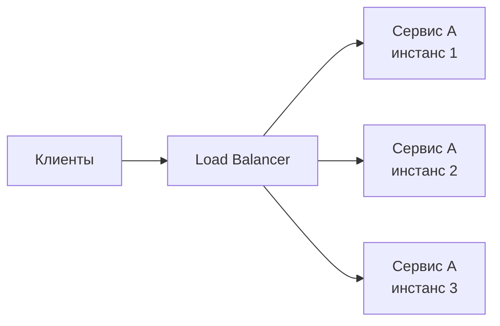
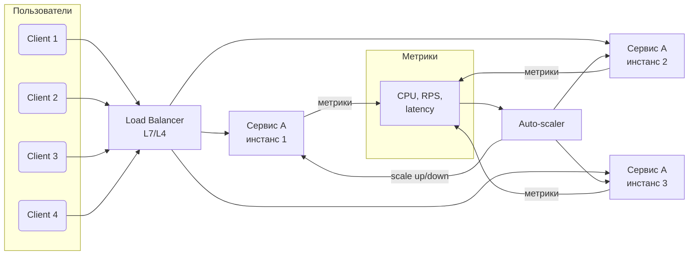

[← Назад к индексу части 19](index.md)

## 19.1. Масштабирование сервиса и балансировка нагрузки

### Цель раздела

Сформировать **чёткое понимание**, как сервис масштабируется по вертикали и горизонтали, как устроена **балансировка нагрузки и health‑checks**, что такое **автомасштабирование**, и как эти решения влияют на доступность, стоимость и поведение системы под нагрузкой.

### В этом разделе главное

- Вертикальное масштабирование **увеличивает мощность одного инстанса**, горизонтальное — **число инстансов**.  
- Балансировщик нагрузки — обязательный элемент горизонтального масштабирования; он должен **знать, кто жив и готов принимать трафик**.  
- Health‑checks делятся на **liveness** (жив ли процесс) и **readiness** (готов ли он обслуживать запросы).  
- Автомасштабирование по метрикам позволяет **подстраивать мощность под нагрузку**, но требует аккуратного выбора метрик и порогов.  
- Масштабирование без понимания **узкого места (bottleneck)** может лишь ускорить падение системы.

### Термины

- **Vertical scaling (scale up)** — увеличение ресурсов одного узла/инстанса: больше CPU, RAM, диска.  
- **Horizontal scaling (scale out)** — добавление новых узлов/инстансов в кластер.  
- **Load balancer (балансировщик нагрузки)** — компонент, который принимает входящие соединения и распределяет их дальше.  
- **L4 load balancer** — балансировщик на уровне транспортного протокола (TCP/UDP).  
- **L7 load balancer** — балансировщик на уровне HTTP/HTTPS, способный смотреть в URI, заголовки, cookies и т.п.  
- **Liveness probe** — проверка «процесс жив и не завис».  
- **Readiness probe** — проверка «инстанс готов принимать трафик».  
- **Auto‑scaler** — компонент, автоматически изменяющий количество инстансов по метрикам (HPA в Kubernetes, Auto Scaling Group в облаках).  

### Теория и правила

#### 1) Вертикальное масштабирование

- Самый простой способ: **дать сервису больше ресурсов**.  
- Плюсы:
  - не требует изменения архитектуры;
  - меньше элементов (нет кластера, проще мониторинг).
- Минусы:
  - **жёсткий потолок** (аппаратные лимиты, цена «монструозных» машин);
  - всё ещё **одна точка отказа**: падение узла = падение сервиса;
  - ухудшение «стоимости ошибки» — чем больше мощность, тем дороже падение.

#### 2) Горизонтальное масштабирование

Идея:

- запускать **несколько одинаковых инстансов** сервиса;  
- ставить **балансировщик**, который распределяет запросы между ними.

Плюсы:

- рост пропускной способности почти **линейно с количеством инстансов** (до пределов других bottleneck‑ов: БД, сеть);  
- **отказоустойчивость**: падение одного инстанса не ломает сервис целиком;  
- удобно для облаков и контейнеров.

Минусы:

- нужно обеспечивать **stateless‑поведение** или выносить состояние наружу (БД, кэш, session store);  
- нужна **централизованная конфигурация** (environment, секреты, версия);  
- без грамотного хранения состояния можно получить «липкость» (sticky sessions) и неравномерную нагрузку.

##### Sticky sessions и хранение сессий

**Sticky sessions (липкие сессии)** — это режим балансировщика, при котором:

- запросы одного и того же пользователя **всегда попадают на один и тот же инстанс** (обычно по cookie или IP);  
- это позволяет хранить сессионное состояние **локально в памяти** этого инстанса.

Плюсы:

- просто реализовать в небольших старых приложениях;  
- не нужно отдельное хранилище сессий.

Минусы:

- нагрузка распределяется **неравномерно** (часть пользователей может «прилипнуть» к одному инстансу);  
- при падении инстанса теряются все его локальные сессии;  
- сложно масштабировать и **перераспределять трафик**;  
- холодные инстансы могут оставаться почти пустыми, пока «липкие» сессии заняты на других.

Современный подход:

- **делать сервис stateless** по отношению к сессиям:
  - хранить сессии в Redis/БД/отдельном session store;  
  - использовать JWT/токены, если подходит по требованиям безопасности;  
  - не полагаться на память конкретного инстанса.  
- использовать sticky sessions **только как временный или вынужденный компромисс**, когда:
  - сложно/дорого переписать старое приложение;  
  - есть чёткие ограничения по масштабированию и отказоустойчивости, которые команда осознаёт и принимает.

Практическое правило:

- если ты планируешь горизонтальное масштабирование «по‑серьёзному» (auto‑scaling, blue‑green/canary‑деплои), лучше **убрать липкость и вынести сессии наружу**, чем надеяться на sticky‑режим балансировщика.

##### Мини‑проверка: sticky sessions и stateless‑подход

1. Почему sticky sessions ухудшают равномерность распределения нагрузки между инстансами?  
2. Какие риски появляются при падении инстанса, если сессии хранятся только в его памяти?  
3. Какие варианты хранения сессий помогают сделать сервис ближе к stateless‑подходу?

Ответ

1. Балансировщик «привязывает» пользователя к одному инстансу, и если таких активных пользователей много, один инстанс может оказаться перегруженным, тогда как другие простаивают. Это ломает идею равномерного распределения запросов.  
2. Все сессии, хранящиеся в памяти этого инстанса, теряются: пользователи разлогиниваются, у них сбрасываются промежуточные состояния, а при переключении на другой инстанс они получают ошибки или вынуждены начинать сценарий заново.  
3. Вынос сессий в централизованное хранилище (Redis, БД, специализированный session store) или использование токенов (например, JWT), в которых хранится нужный минимум состояния, позволяет любому инстансу обработать запрос пользователя, не полагаясь на локальную память.  

#### 3) L4 vs L7 балансировка

- **L4**:
  - работает на уровне TCP/UDP;
  - видит IP, порт, иногда SNI (для TLS);
  - не понимает HTTP‑маршруты и заголовки;
  - хорошо подходит для простых TCP‑сервисов, gRPC, баз данных.
- **L7**:
  - понимает HTTP/HTTPS;
  - может маршрутизировать по URI, заголовкам, cookies, методу;
  - позволяет делать:
    - path‑based routing (`/api`, `/admin`, `/static`);
    - A/B‑тесты и канареечные релизы (по cookies/заголовкам, части пользователей);
    - сжатие, кэширование ответов, TLS‑терминацию.

Практика:

- часто используют **L4 балансировщик облака → L7 (Nginx/Ingress)** → сервисы;  
- L7 дороже по ресурсу, но даёт **больше контроля** и наблюдаемости.

##### Алгоритмы балансировки нагрузки

Чаще всего используются простые, но эффективные алгоритмы:

- **Round‑robin**:
  - запросы «раздаются по кругу» инстансам: 1‑й, 2‑й, 3‑й, снова 1‑й и т.д.;  
  - хорошо подходит, когда инстансы **примерно одинаковой мощности**, а запросы схожи по «тяжести».
- **Least connections**:
  - каждый новый запрос отправляется на инстанс с **наименьшим числом активных соединений**;  
  - полезно, когда запросы сильно отличаются по времени выполнения: «длинные» запросы не будут закреплять за собой одни и те же инстансы.
- **Weighted round‑robin / weighted least connections**:
  - каждому инстансу задаётся **вес** (например, мощные узлы получают больший вес);  
  - балансировщик пропорционально весам направляет больше трафика на более мощные инстансы;  
  - удобно при постепенной миграции на новые инстансы или при работе с «разнотипным железом».

Важно:

- алгоритм балансировки должен соответствовать **характеру нагрузки**:
  - однородные короткие запросы → достаточно round‑robin;  
  - смешанные «лёгкие/тяжёлые» запросы → лучше least connections;  
  - разные классы инстансов → использовать веса.  

##### Мини‑проверка: алгоритмы балансировки

1. В чём практическая разница между round‑robin и least connections при сильно различающейся «тяжести» запросов?  
2. Зачем использовать взвешенные (weighted) алгоритмы балансировки, если уже есть обычный round‑robin?  
3. Какой алгоритм ты бы выбрал(а) для сценария, где часть инстансов — новые, более мощные машины, а часть — старые, менее производительные?

Ответ

1. Round‑robin не учитывает, сколько запросов уже обрабатывает инстанс: тяжёлые запросы могут «забить» отдельные инстансы, пока другим достаются только лёгкие. Least connections ориентируется на текущее число активных соединений и лучше выравнивает нагрузку при разной длительности запросов.  
2. Weighted‑алгоритмы позволяют направлять больше трафика на более мощные инстансы или постепенно «вкатывать» новые версии, регулируя долю трафика. Обычный round‑robin считает все инстансы равными, что не всегда отражает реальную производительность.  
3. Взвешенный round‑robin или weighted least connections: более мощным инстансам задают больший вес, чтобы они получали больше запросов, а старые машины — меньший. Это позволяет эффективно использовать ресурсы и плавно мигрировать на новый парк.  

#### 4) Health‑checks: liveness и readiness

**Liveness**:

- отвечает на вопрос: *«процесс жив?»*  
- если liveness‑check не проходит — инстанс **перезапускают**.

**Readiness**:

- отвечает на вопрос: *«инстанс готов принимать трафик?»*  
- если readiness‑check не проходит — балансировщик **перестаёт слать трафик** на этот инстанс, но не обязательно его убивает.

Пример:

- приложение стартует: поднимает соединения, нагревает кэш;  
- пока оно не готово, readiness `/healthz` возвращает 503 → балансировщик не посылает трафик;  
- как только всё готово — readiness возвращает 200, инстанс включается в пул.

#### 5) Автомасштабирование (auto‑scaling)

**Auto‑scaler** следит за метриками:

- CPU, RAM;
- RPS, latency;
- длина очереди (для consumer‑ов);
- бизнес‑метрики (количество активных сессий и пр.).

И по правилам решает:

- если метрика **выше верхнего порога** X секунд/минут → добавить N инстансов;  
- если **ниже нижнего порога** достаточно долго → убрать M инстансов.

Важно:

- избегать **«пилы» (flapping)**: нужны гистерезис и задержки перед scale‑down;  
- учитывать **время старта инстанса**: если инстанс запускается 1–2 минуты, авто‑скейл не успеет отреагировать на мгновенные пики.

#### 6) Scale to zero

Для некоторых классов сервисов (serverless, event‑driven) возможно **масштабирование до 0**:

- когда нет нагрузки — инстансы выключаются полностью;  
- при первом запросе — **холодный старт**: поднятие инстанса по требованию.

Компромисс:

- + экономия ресурсов при «тишине»;  
- – задержка первого запроса (cold start), которую нужно учитывать в UX и SLA.

### Пошагово: как думать о масштабировании сервиса

1. **Определи узкое место**:
   - CPU, память, БД, внешние API, диск, сеть?  
   - измерь (метрики, профилировка), не опирайся только на догадки.
2. **Реши, вертикально или горизонтально**:
   - если сервис ещё небольшой и не критичен → можно начать с **scale up**;  
   - если нужна отказоустойчивость, multi‑AZ/region, рост RPS → **scale out**.
3. **Спроектируй stateless‑поведение**:
   - вынеси сессии и состояние из памяти процесса;  
   - убедись, что каждый запрос может быть обработан **любым инстансом**.
4. **Выбери схему балансировки**:
   - L4/L7, алгоритм распределения (round‑robin, least connections, weighted).  
5. **Настрой health‑checks**:
   - отдельные endpoints для liveness и readiness;  
   - readiness должен учитывать зависимости (БД, кэш).
6. **Включи auto‑scaling**:
   - выбери 1–2 ключевые метрики и пороги;  
   - добавь гистерезис, чтобы избежать «пилы»;  
   - протестируй поведение под нагрузкой.

### Простыми словами

Представь:

- один инстанс сервиса — это **одна касса в магазине**;  
- вертикальное масштабирование — **поставить кассира‑супермена** и дать ему ультра‑быструю кассу;  
- горизонтальное масштабирование — **открыть больше касс** и поставить туда ещё кассиров.

Балансировщик нагрузки:

- это человек у входа, который **распределяет людей по свободным кассам**;  
- health‑checks — его способ проверить, **какая касса открыта и работает** (одна на перерыве, другая зависла).

### Картинка в голове

### Как запомнить

- **Scale up — «толстый» инстанс; scale out — «много обычных».**  
- Балансировщик без health‑checks — как диспетчер, который **не знает, какие кассы закрыты**.  
- Auto‑scaling не лечит **плохую архитектуру**: если узкое место — БД, добавление инстансов аппликейшена лишь быстрее убьёт базу.

### Примеры

#### Пример 1. Вертикальное масштабирование на старте

- Небольшой стартап: один сервис + один Postgres.  
- Первую проблему с производительностью проще решить:
  - поднять instance‑тип в облаке;  
  - добавить оперативки и CPU.  
- Это дёшево по сложности и достаточно до **определённого RPS и объёма данных**.

#### Пример 2. Переход к горизонтальному масштабированию

- Трафик растёт, один инстанс сервиса уже на 80–90% CPU.  
- Команда:
  - выносит сессии в Redis;  
  - поднимает 3 инстанса под балансировщиком;  
  - настраивает readiness `/health` с проверкой подключения к БД и Redis;  
  - включает auto‑scaling по CPU и RPS.  
- В результате сервис может переживать **рост нагрузки и падение одного инстанса**.

### Практика / реальные сценарии

- **Периодические пиковые нагрузки** (распродажи, отчётные периоды):
  - заранее увеличивают число инстансов (pre‑warming);
  - ослабляют пороги auto‑scaling;
  - следят за метриками БД/кэша как возможных bottleneck‑ов.
- **Сервисы с долгим стартом**:
  - readiness‑пробы учитывают время прогрева;
  - auto‑scaler использует **опережающий сигнал** (длина очереди, приходящие запросы), а не только CPU.

### Типичные ошибки

- Делать только vertical scaling и **не думать о отказоустойчивости**.  
- Использовать горизонтальное масштабирование, но **хранить сессии в памяти процесса** и включать sticky sessions «на авось».  
- Настраивать только liveness, игнорируя readiness:
  - инстансы принимают трафик, пока ещё не готовы (без БД/кэша).  
- Включить auto‑scaling по одной метрике CPU без учёта **ограничений БД** и других зависимостей.

### Что будет, если…

- …масштабировать только приложение, не трогая БД?
  - Количество соединений к БД растёт, она становится узким местом, появляются **deadlock‑и, рост latency и падения**.  
- …не использовать readiness и слать трафик на инстансы в процессе старта или миграции?
  - Пользователи будут получать ошибки и таймауты при каждом деплое, деградируя UX и доверие к системе.

### Проверь себя

1. В каких случаях вертикальное масштабирование может быть **лучшим первым шагом**, а когда без горизонтального не обойтись?  
2. Почему важно различать liveness и readiness, и что произойдёт, если использовать только liveness‑проверку?  
3. Как бы ты выбрал(а) метрики для auto‑scaling в сервисе, который потребляет очередь и обрабатывает задачи?

Ответ

1. Vertical — когда система ещё небольшая, архитектура проста, и проблемы упираются в ресурсы одного сервера; это даёт быстрый выигрыш без серьёзных изменений. Horizontal — когда нужен **запас по отказоустойчивости и росту нагрузки**, а также когда вертикальный рост стал слишком дорогим или упёрся в физические лимиты.  
2. Liveness говорит лишь о том, что процесс жив. Если использовать только её, инстанс может считаться здоровым и получать трафик, **даже если он ещё не подключился к БД, не прогрел кэш или выполняет тяжёлую миграцию**. Readiness позволяет временно исключить такие инстансы из пула, избегая ошибок для пользователей.  
3. Для consumer‑а очереди ключевая метрика — **длина очереди и возраст сообщений**. Можно масштабировать число воркеров по длине очереди (и, возможно, CPU). CPU сам по себе мало говорит о том, справляется ли система с задачами, если очередь растёт быстрее, чем обрабатывается.

### Запомните

- **Масштабирование — это не только «добавить ресурсов», но и «понять узкое место и архитектуру».**  
- Горизонтальное масштабирование без stateless‑подхода и грамотных health‑checks приводит к хаосу и трудноотлавливаемым багам.  
- Auto‑scaling полезен только тогда, когда выбранные метрики **действительно отражают нагрузку и бизнес‑цели**.

---
