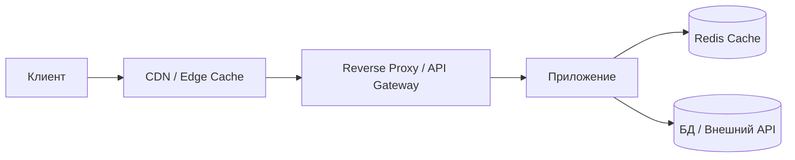
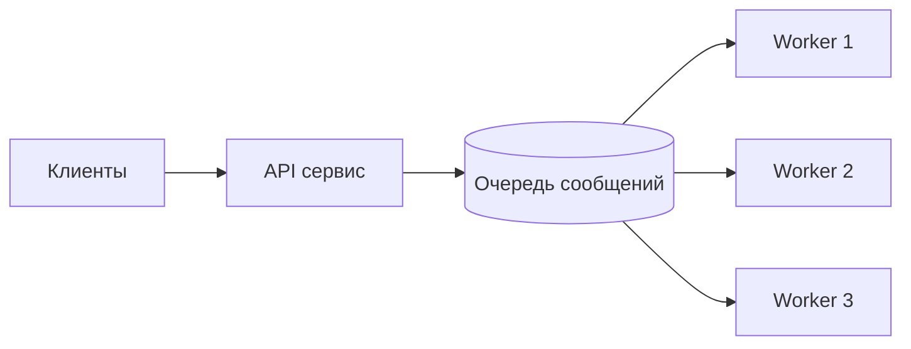
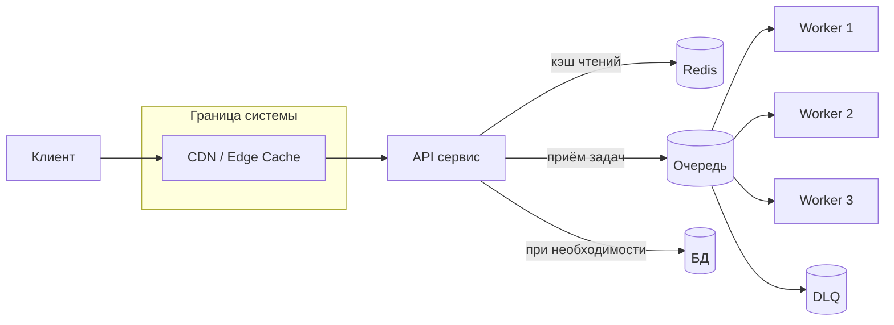

[← Назад к индексу части 19](index.md)

## 19.2. Кэш как инструмент масштабирования. Очереди и сглаживание пиков

### Цель раздела

Показать, как **кэширование и очереди** помогают масштабировать систему: снижать нагрузку на БД и внешние API, сглаживать пики запросов, управлять временем ответа и надёжностью, а также как правильно использовать DLQ и backpressure.

### В этом разделе главное

- Кэш — это **слой быстрых копий**, который уменьшает нагрузку на источник истины; он особенно полезен под высокими RPS.  
- Кэширование бывает на **разных уровнях**: CDN/edge, reverse‑proxy, приложение, БД.  
- Очереди позволяют **развязать приём запросов и их обработку во времени**, сглаживая пики.  
- Правильная настройка retry и DLQ критична: бесконечная обработка «плохих» сообщений уничтожает производительность.  
- Backpressure защищает систему, **ограничивая приём новой нагрузки** при перегрузке.

### Термины

- **CDN/edge‑кэш** — кэш на границе сети, рядом с пользователями.  
- **Reverse proxy cache** — кэш на уровне HTTP‑прокси (Nginx, varnish).  
- **Application cache** — кэш внутри сервиса или Redis‑слой.  
- **Message queue** — система очередей (RabbitMQ, Kafka, SQS и др.).  
- **Consumer / producer** — потребитель и производитель сообщений в очереди.  
- **DLQ (Dead Letter Queue)** — очередь для сообщений, которые не удалось обработать.  
- **Backpressure** — механизмы «сдерживания» входящего потока, когда система перегружена.

### Теория и правила

#### 1) Кэш и масштабирование

Кэширование снижает:

- **число обращений** к медленным и дорогим источникам (БД, внешние API);  
- потребление CPU/IO на стороне источника;  
- среднюю и 95/99‑й перцентиль latency.

Уровни кэширования:

1. **CDN / edge**:
   - кэширует статику и иногда HTML/JSON;  
   - снимает нагрузку с бекенда и приближает контент к пользователю.
2. **Reverse proxy**:
   - Nginx/Varnish могут кэшировать ответы на основании `Cache-Control`, `ETag`;  
   - помогает при дорогих GET‑запросах.
3. **Кэш в приложении / Redis**:
   - кэширует **данные и результаты запросов**;  
   - позволяет повторно использовать вычисленные результаты.

#### 2) Кэш и согласованность

Кэш **всегда про компромисс**:

- свежесть данных vs нагрузка и скорость.  

Архитектурные вопросы:

- что кэшируем: **объекты, списки, целые ответы**;  
- как долго (TTL);  
- как инвалидируем:
  - по событию (после записи в БД);
  - по TTL;
  - по manual‑сигналу (админка, deployment).

Неправильный кэш без инвалидации превращается в **источник неконсистентности**.

#### 3) Очереди и сглаживание пиков

Очередь позволяет:

- принимать **запросы быстро** (класть сообщения в очередь) даже при перегруженных обработчиках;  
- обрабатывать сообщения **со скоростью, соответствующей мощностям consumer‑ов**;  
- временно копить нагрузку, а не «ронять» запросы.

Классическая схема:

Производитель (API):

- синхронно возвращает пользователю:
  - либо «принято в обработку» (async pattern),
  - либо ждёт до результата (sync‑over‑async, осторожно).

#### 4) Гарантии доставки и DLQ

Типичные гарантии:

- **at most once** — либо доставили, либо потеряли (без повторов);  
- **at least once** — может доставиться несколько раз (нужна идемпотентность обработки);  
- **exactly once** — идеал, обычно достигается на уровне приложения/протокола, а не очереди.

DLQ:

- сообщения, которые **падают N раз подряд**, отправляются в DLQ;  
- DLQ **не должен быть конечной помойкой**:
  - нужен процесс анализа и реплея (или ручной обработки);
  - метрики DLQ: размер, возраст сообщений, типы ошибок.

#### 5) Мониторинг очередей и DLQ

Любая очередь должна быть **под постоянным наблюдением**. Ключевые метрики:

- **длина очереди** (сколько сообщений ждут обработки);  
- **скорость поступления vs скорость обработки** (drain rate);  
- **время пребывания сообщения в очереди** (age);  
- **размер и возраст DLQ**;  
- **распределение типов ошибок** (например, бизнес‑ошибка vs временный сбой сети).

Практические правила:

- если длина очереди и средний возраст сообщений **растут долгое время** — это сигнал, что мощность потребителей недостаточна или они часто падают;  
- если DLQ растёт — нужно:
  - приоритизировать разбор ошибок;  
  - временно остановить приём новых задач, если это возможно;  
  - настроить алерты на размер/возраст DLQ.  
- мониторинг очередей должен быть **частью общей наблюдаемости**: дашборды, алерты, runbooks по действиям при переполнении.

#### 6) Backpressure

Backpressure отвечает на вопрос: *«что делаем, когда мы уже не успеваем обрабатывать?»*.

Варианты:

- **отказывать быстро**:
  - HTTP 429/503 с понятным сообщением;
  - лучше честный отказ, чем таймауты в десятки секунд.
- **ограничивать приём**:
  - лимит на размер очереди;
  - лимит на количество параллельных задач.
- **замедлять источники**:
  - rate limiting;
  - договорённости с клиентами (SLA).

Важно:

- backpressure должен быть **осознанным решением**, а не побочным эффектом (например, скрытого дедлока).

##### Мини‑проверка: backpressure

1. Почему честный быстрый отказ (429/503) при перегрузке часто лучше, чем попытка обработать все запросы любой ценой?  
2. Как лимит на размер очереди помогает реализовать backpressure на уровне асинхронной обработки?  
3. Какие сигналы в метриках подскажут, что система нуждается в механизмах backpressure?

Ответ

1. Попытка обработать все запросы приводит к росту очередей, истечению таймаутов и ухудшению UX для всех пользователей, а также к риску падения всей системы. Быстрый отказ даёт предсказуемое поведение, сохраняет работоспособность ядра и позволяет клиентам реализовать свои стратегии повторов.  
2. Если очередь переполняется и начинает отбрасывать новые сообщения или возвращать ошибку при попытке записи, это сигнализирует продюсеру, что он должен замедлиться или начать отказывать. Так очередь становится «захлопкой» от перегрузки, а не бесконечной ямой.  
3. Рост длины очередей и среднего возраста сообщений, увеличение доли таймаутов и ошибок 5xx, пики latency без увеличения полезной пропускной способности — всё это признаки того, что система не справляется с текущей нагрузкой и ей нужны контролируемые механизмы backpressure.  

### Пошагово: как думать о кэше и очередях

1. **Определи горячие операции**:
   - какие запросы чаще всего бьют по БД/внешнему API;  
   - какие RPS и latency.
2. **Реши, что можно кэшировать**:
   - есть ли у данных **естественный TTL** (справочники, конфигурации);  
   - что будет, если пользователь увидит данные, отстающие на X секунд/минут.
3. **Выбери уровень кэширования**:
   - CDN/edge для статики/HTML;  
   - proxy‑кэш для GET‑ов;  
   - Redis/локальный кэш для частых запросов данных.
4. **Спроектируй инвалидацию**:
   - после мутаций;  
   - по TTL;  
   - по административным событиям.
5. **Для тяжёлых операций под нагрузкой**:
   - проверь, можно ли вынести работу в **очередь** и обрабатывать асинхронно;  
   - реши, какой UX будет у пользователя (страница статуса, email, пуш).
6. **Настрой DLQ и backpressure**:
   - лимиты на количество попыток;  
   - отдельная DLQ и процессы обработки;  
   - стратегия отказа/ограничения при переполнении.

### Простыми словами

Кэш — это:

- **полка с самыми популярными товарами рядом с кассой**, чтобы не бегать каждый раз на склад.  
- Если товары на полке **устаревают и не обновляются**, покупатели будут недовольны — это проблема инвалидации.

Очередь — это:

- **склад временного хранения заказов**: кассир принимает заказ и кладёт его в коробку с задачами, а отдельные работники (воркеры) выполняют заказы по мере возможности.  
- Если заказы **слишком сложные или с ошибками**, их откладывают в «корзину с проблемными заказами» (DLQ) для ручного разбора.

### Картинка в голове

### Как запомнить

- **Кэш уменьшает число запросов, очередь — перераспределяет их во времени.**  
- DLQ — это **«папка с проблемами, требующими внимания»**, а не место, куда мы «выметаем мусор и забываем».  
- Backpressure — это **вежливое «стоп, я больше не успеваю»**, а не хаотичный обвал.

### Примеры

#### Пример 1. Кэширование каталога товаров

- Каталог товаров меняется не чаще, чем раз в несколько минут.  
- Без кэша каждый запрос к каталогу бьёт по БД.  
- Решение:
  - кэшировать JSON каталога в Redis на 60 секунд;  
  - при изменении ассортимента — инвалидировать ключи;  
  - на уровне CDN кэшировать HTML‑страницы списка товаров.  
- Результат: **в разы меньше запросов к БД**, стабильный отклик под ростом трафика.

#### Пример 2. Очередь для генерации отчётов

- Генерация PDF‑отчёта занимает 5–30 секунд.  
- Если делать её синхронно по HTTP, API блокируется, пользователю приходится ждать.  
- Решение:
  - пользователь отправляет запрос на генерацию;  
  - API кладёт задачу в очередь и сразу возвращает «заказ принят» + ID;  
  - воркеры генерируют отчёт и кладут результат в хранилище;  
  - пользователь получает ссылку по email или видит статус по ID.  
- Пики задач сглаживаются, API остаётся **быстрым и отзывчивым**.

### Практика / реальные сценарии

- **Интеграции с внешними API** (платёжки, KYC, сторонние сервисы):
  - кэширование результатов для стабилизации нагрузки и уменьшения стоимости;  
  - использование очередей для ретраев и повторной отправки.  
- **Системы уведомлений**:
  - отправка email/SMS/пушей через очередь;  
  - DLQ для сообщений с неверными адресами/форматом;  
  - backpressure при сбое у провайдера уведомлений.

### Типичные ошибки

- Кэш без осмысленного TTL и инвалидации → **«баги, живущие только у части пользователей»**.  
- Очередь как «чёрная дыра» без DLQ и мониторинга → потерянные или «висящие» задачи.  
- Злоупотребление очередями там, где важен **синхронный пользовательский UX** (например, платежи).  
- Отсутствие backpressure: сервис продолжает принимать запросы, пока окончательно не падает.

### Что будет, если…

- …не иметь DLQ и бесконечно пытаться обработать одно и то же «битое» сообщение?
  - Оно будет снова и снова занимать воркеров, **блокируя нормальные сообщения** и создавая нагрузку на зависимости.  
- …решить все проблемы масштабирования только через кэш, не думая о очередях и архитектуре?
  - Некоторые задачи (длительные операции, интеграции) **всё равно будут перегружать систему**, а кэш не поможет, потому что работа уникальна для каждого запроса.

### Проверь себя

1. Какие уровни кэширования ты можешь применить для страницы «каталог товаров» в интернет‑магазине?  
2. В каких сценариях очередь — подходящее решение, а в каких она только усложнит архитектуру?  
3. Как бы ты спроектировал(а) DLQ и процесс работы с ней для сервиса отправки уведомлений?

Ответ

1. CDN/edge для статики и HTML, reverse‑proxy кэш для GET‑запросов к API списка товаров, Redis/приложенческий кэш для часто запрашиваемых агрегатов (популярные товары, фильтры). Всё это вместе значительно снижает нагрузку на БД.  
2. Очередь уместна для **длительных, повторяемых операций**, где пользователю не нужно мгновенное завершение (отчёты, массовые уведомления, долгие интеграции). Она вредна там, где нужен **строгий синхронный результат** (оплата, смена пароля) или где очередь лишь скрывает проблемы производительности без их решения.  
3. DLQ должна собирать сообщения, которые не удалось доставить после N попыток. Нужны:
   - метрики (размер, возраст сообщений, типы ошибок),  
   - процессы (ручной разбор, исправление данных, повторный запуск),  
   - возможно, инструменты реплея сообщений обратно в основную очередь после фикса.  

### Запомните

- **Кэш и очереди — это «подушки безопасности» для нагрузки, но они не отменяют необходимости хорошего дизайна БД и API.**  
- Без DLQ и наблюдаемости очереди быстро превращаются в **«кладбище забытых задач»**.  
- Backpressure и честные отказы часто **лучше бесконечных попыток и таймаутов**.

---
