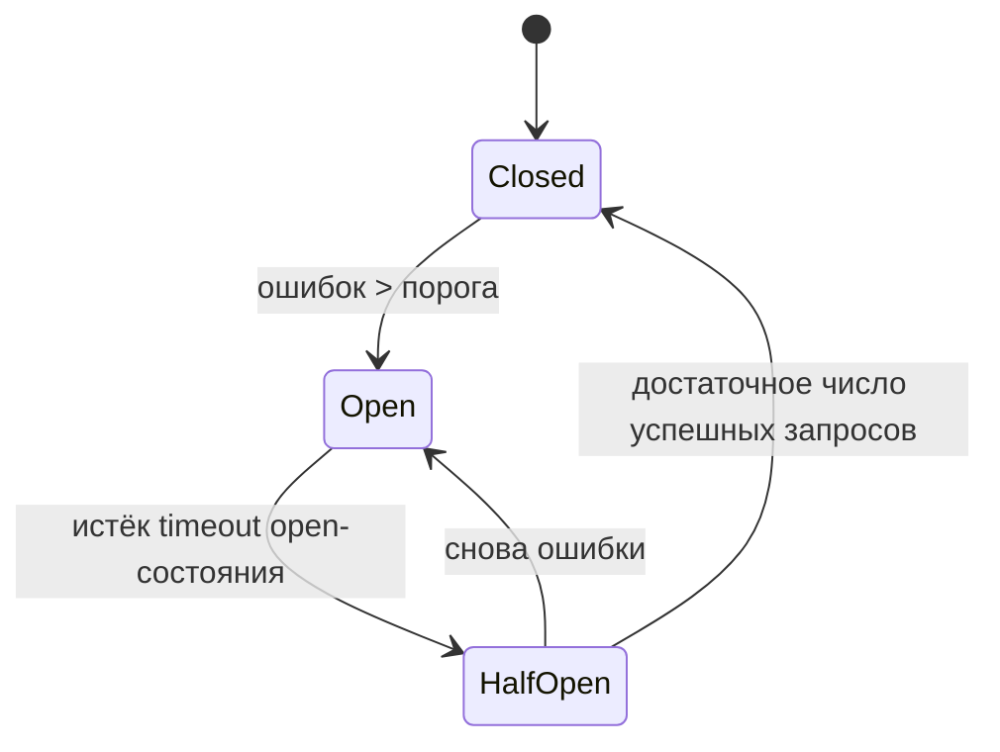
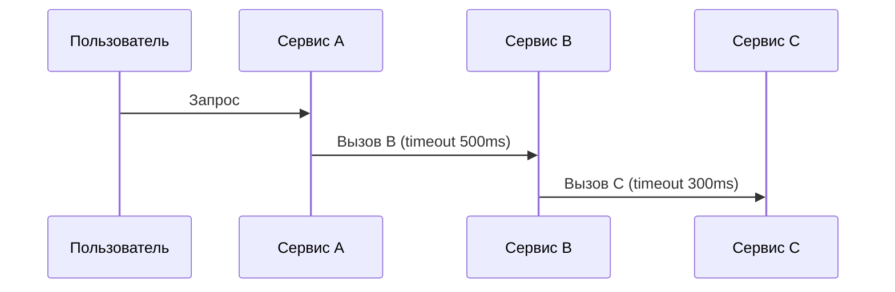
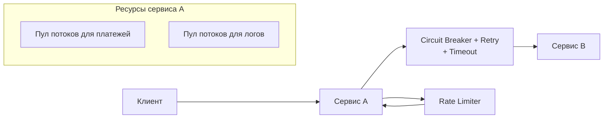

[← Назад к индексу части 19](index.md)

## 19.3. Устойчивость: circuit breaker, retry, rate limiting, bulkhead

### Цель раздела

Научиться проектировать **устойчивое поведение сервисов под сбоями**: применять circuit breaker, retry с backoff и jitter, rate limiting и bulkhead‑паттерн, настраивать таймауты так, чтобы отказы были **быстрыми и контролируемыми**, а не превращались в лавину каскадных падений.

### В этом разделе главное

- Сбой зависимого сервиса **не должен валить всю систему** — лучше контролируемая деградация.  
- **Circuit breaker** защищает зависимость и сам клиент от шторма ошибок, временно отключая вызовы.  
- **Retry** должен быть дозированным: с ограничением числа попыток, backoff и jitter, и только для **идемпотентных операций**.  
- **Rate limiting** и **bulkhead** защищают от перегрузки и «захвата» ресурсов одним потребителем.  
- **Таймауты** должны быть каскадными и согласованными, иначе одиночная задержка может парализовать весь поток запросов.

### Термины

- **Circuit breaker** — паттерн «предохранителя» вокруг вызова к зависимости.  
- **Open / half‑open / closed** — состояния circuit breaker‑а.  
- **Retry with exponential backoff** — повторные попытки с растущей задержкой между ними.  
- **Jitter** — случайная добавка к задержке, чтобы избежать синхронизации повторов.  
- **Rate limiting** — ограничение запросов по ключу в единицу времени.  
- **Bulkhead** — разделение ресурсов (пулы потоков, подключений) на независимые «отсеки».  
- **Timeout** — максимальное время ожидания операции до отказа.

### Теория и правила

#### 1) Circuit breaker: идея и состояния

Circuit breaker (CB) оборачивает вызов:

```text
клиент → [Circuit Breaker] → зависимость
```

Состояния:

- **Closed (замкнут)**:
  - вызовы идут как обычно;  
  - CB считает количество ошибок.
- **Open (разомкнут)**:
  - вызовы **не идут к зависимости**;  
  - клиент получает быстрый отказ или fallback;  
  - состояние включается при превышении порога ошибок/таймаутов.
- **Half‑open (полуоткрыт)**:
  - CB периодически пропускает несколько **пробных запросов**;  
  - если они успешны — возвращается в closed;  
  - если снова ошибки — обратно в open.



Правила:

- выбирать пороги по:
  - доле неуспешных запросов за окно;  
  - времени open‑состояния;  
  - количеству пробных запросов в half‑open.

#### 2) Retry: когда и как

Retry **полезен** при:

- временных сетевых сбоях;  
- краткосрочных перегрузках;  
- нестабильных, но важных зависимостях.

Retry **опасен**, если:

- операция не идемпотентна (каждый повтор меняет состояние по‑разному);  
- нет лимита числа попыток;  
- нет backoff и jitter → возникает «шторм повторов».

Экспоненциальный backoff:

- 1‑я попытка: задержка 100 мс;  
- 2‑я — 200 мс;  
- 3‑я — 400 мс;  
- … до некоторого максимума.  

Jitter:

- добавляет **случайность** в задержку (±X%), чтобы не все клиенты синхронно повторяли запросы → уменьшается пик нагрузки.

#### 3) Rate limiting

Rate limiting:

- ограничивает число запросов от **одного ключа** (IP, user_id, API key) за интервал;  
- защищает от DDoS/abuse и «шумных» клиентов.

Реализация:

- **token bucket / leaky bucket** алгоритмы;  
- хранение счётчиков в Redis/инструментах API gateway;  
- возврат 429 Too Many Requests или 503.

#### 4) Bulkhead

Bulkhead:

- разделяет ресурсы сервиса на **независимые отсеки**:  
  - отдельные пулы потоков;  
  - отдельные пулы подключения к БД;  
  - отдельные очереди задач.

Цель:

- сбой/перегрузка одного потребителя **не должна лишать всех остальных ресурса**.

Пример:

- API имеет:
  - отдельный пул соединений для платежей;  
  - отдельный — для логов/аналитики.  
- Если аналитика «зависла», платежи продолжают работать.

#### 5) Таймауты и каскады

Таймауты:

- ограничивают **время ожидания ответа**;  
- должны быть:
  - **короче, чем таймаут клиента выше по цепочке**;  
  - согласованы по всей цепочке.



Если таймаут в C = 5 секунд, а в B = 300 мс — всё ок: B сам завершит ожидание раньше.  
Если наоборот — **B будет ждать C слишком долго**, а A — ещё дольше, создавая «хвосты» висящих запросов.

Практическое правило:

- чем **выше по цепочке** сервис, тем **строже** у него должен быть таймаут на нижележащие вызовы, чтобы не блокировать ресурсы слишком долго;  
- общая сумма таймаутов по цепочке должна **укладываться** в SLA для пользователя (например, 2 секунды до ответа API).

#### 6) Инструменты resilience‑библиотек

Во многих языках и фреймворках есть готовые библиотеки, реализующие описанные паттерны:

- **Polly (.NET)** — политики retry, circuit breaker, timeout, bulkhead, fallback; конфигурируются декларативно и могут комбинироваться.  
- **Resilience4j (Java)** — лёгкая библиотека с модулями для circuit breaker, retry, rate limiting, bulkhead, cache; хорошо интегрируется со Spring Boot.  
- **go‑resilience, Hystrix‑подобные решения и аналоги** — для Go и других языков.

Важно:

- понимать **семантику паттернов и параметры**, а не просто «включать библиотеку по умолчанию»;  
- хранить конфигурацию (пороги, таймауты, лимиты) **снаружи кода** (конфиги, фичефлаги), чтобы можно было оперативно менять поведение без релиза;  
- обязательно **снимать метрики** по состоянию circuit breaker‑ов, числу retry, rate limiting‑событиям и использовать их в алертах.

##### Мини‑кейс: “circuit breaker открылся” — как быстро диагностировать

Симптом: у клиентов всплеск ошибок, а в метриках видно, что breaker перешёл в `OPEN`.

Что делать по шагам:

1. **Проверь, что именно стало триггером**:
   - рост `timeout`?  
   - рост 5xx у зависимости?  
   - рост латентности (p95/p99)?
2. **Посмотри на корреляцию**:
   - по `trace_id` и span’ам видно, какой вызов “тянет хвост”?
3. **Проверь “шторм ретраев”**:
   - если retry включён, он мог усилить перегрузку зависимости.
4. **Оцени fallback‑поведение**:
   - что увидит пользователь (частичный ответ, кэш, “попробуйте позже”)?
5. **Сделай оперативную настройку параметров** (если предусмотрено):
   - снизить число retry,  
   - ужесточить timeout,  
   - временно включить более жёсткий rate limit.

Это место, где resilience напрямую упирается в observability: без метрик/трейсов “breaker открыт” превращается в загадку вместо управляемого режима деградации.

##### Мини‑проверка: инструменты и конфигурация

1. Почему опасно «по умолчанию» включать circuit breaker или retry из библиотеки без осознанной настройки параметров?  
2. Какие преимущества даёт вынесение конфигурации (порогов, таймаутов, лимитов) resilience‑паттернов из кода во внешние конфиги или фичефлаги?  
3. Какие метрики по работе resilience‑библиотек ты бы обязательно собрал(а), чтобы понимать, как ведёт себя система?

<details><summary>Ответ</summary>

1. Неподходящие пороги ошибок, таймауты или лимиты retry могут привести к ложным срабатываниям (частые open‑состояния breaker‑а), усилению перегрузки (шторм ретраев) или, наоборот, к «немому» игнорированию проблем. Библиотека — это лишь механизм, а ответственность за семантику и параметры лежит на архитекторе.  
2. Внешняя конфигурация позволяет менять поведение системы (пороги circuit breaker‑а, количество retry, значения rate limiting) **без перекомпиляции и релиза**, быстро реагируя на инциденты и изменения нагрузки. Это также упрощает экспериментирование и A/B‑тестирование значений.  
3. Важно наблюдать: частоту срабатываний circuit breaker‑ов (open/half‑open), количество и процент запросов с retry, число запросов, отфильтрованных rate limiter‑ом, распределение таймаутов и ошибок. Эти данные помогают увидеть, где система реально страдает и где параметры требуют настройки.  

</details>

### Пошагово: как обернуть зависимость в устойчивую схему

1. **Пойми природу операции**:
   - идемпотентна ли она?  
   - критична ли она для пользователя (платёж vs логирование)?
2. **Определи максимальное допустимое время ожидания**:
   - для пользователя;  
   - для системы (ресурсы).  
   - поставь **таймаут** чуть меньше этого значения.
3. **Реши, нужен ли retry**:
   - если операция идемпотентна и сбои временные → да;  
   - иначе — осторожно или вообще без retry.
4. **Настрой retry с backoff и jitter**:
   - 2–3 попытки максимум;  
   - увеличивающиеся задержки;  
   - случайный разброс (jitter).
5. **Добавь circuit breaker**:
   - порог по проценту ошибок и времени;  
   - fallback (сообщение пользователю, default‑данные).
6. **Подумай о rate limiting и bulkhead**:
   - защита от «шумных» клиентов;  
   - разделение пулов ресурсов для критичных и некритичных операций.

### Простыми словами

Circuit breaker — это:

- **автоматический выключатель**: если свет моргает слишком часто (ошибки), он **отключает линию**, чтобы не сгорела проводка (зависимость и клиент).  

Retry — это:

- **повторный звонок**: если линия занята, ты звонишь ещё раз, но не бесконечно и не каждую миллисекунду — иначе выведешь из строя АТС.  

Rate limiting — это:

- **охранник на входе**, который не пускает больше 100 человек в зал, чтобы его не раздавило.  

Bulkhead — это:

- **перегородки на корабле**, чтобы пробоина в одном отсеке не топила весь корабль сразу.

### Картинка в голове



### Как запомнить

- **Circuit breaker — про «отключить зависимость вовремя»**, retry — про «попробовать ещё раз, но аккуратно».  
- Rate limiting защищает как **систему**, так и других пользователей.  
- Bulkhead — способ не позволить одному провальному сценарию «утянуть» за собой все остальные.

### Примеры

#### Пример 1. Вызов платёжного провайдера

- Операция: списание денег с карты, идемпотентна по `payment_id`.  
- Решение:
  - таймаут 3 секунды;  
  - retry: максимум 2 попытки с backoff 500 мс и jitter;  
  - circuit breaker: если за последние 30 секунд **>50% ошибок**, открыть на 1 минуту;  
  - fallback: сообщить пользователю, что платёж **в обработке**, и проверить статус позже.  

#### Пример 2. Логирование в внешний сервис

- Операция: отправка логов/метрик.  
- Решение:
  - при сбое **не блокировать основной поток**;  
  - ограниченный retry;  
  - circuit breaker с низким порогом;  
  - local buffer/очередь, но с лимитом;  
  - при полном отказе — деградировать до локального логирования.

### Практика / реальные сценарии

- **Межсервисные вызовы в микросервисной архитектуре**:
  - каждый вызов к другому сервису оборачивается в:
    - таймаут;  
    - retry (при необходимости);  
    - circuit breaker.  
- **Публичный API**:
  - rate limiting по API key;  
  - отдельные лимиты для бесплатных и платных клиентов;  
  - bulkhead‑разделение ресурсов для разных тарифов.

### Типичные ошибки

- Retry без backoff и лимита → **шторм повторных попыток**.  
- Circuit breaker без мониторинга → непонятно, почему «внезапно всё перестало ходить»; нет алертов на open‑состояние.  
- Отсутствие таймаутов → зависшие соединения, исчерпанные пулы, каскадные падения.  
- Rate limiting «по IP» без учёта NAT/прокси → случайное ограничение целых офисов/регионов.  
- Bulkhead «для галочки», когда все потоки и соединения всё равно общие.

### Что будет, если…

- …сделать retry для **неидемпотентной** операции (например, «создать заказ») без идемпотентного ключа?
  - Можно получить **дублирующие операции** (два заказа/списания), что особенно критично в финансовых системах.  
- …не ставить таймауты и не использовать circuit breaker?
  - При проблемах у зависимого сервиса твой сервис будет **висять, накапливая запросы** и исчерпывая ресурсы, после чего упадёт уже вся система.

### Проверь себя

1. В каких случаях circuit breaker **лишний**, а в каких — жизненно необходим?  
2. Какие параметры retry ты бы выбрал(а) для вызова, который в среднем занимает 100 мс, а иногда падает по сетевой ошибке?  
3. Как бы ты использовал bulkhead‑паттерн в сервисе, который одновременно обрабатывает платёжные операции и фоновую аналитическую обработку?

<details><summary>Ответ</summary>

1. Лишний — для локальных, очень быстрых и надёжных зависимостей (внутрипроцессные вызовы) или там, где ошибка не критична и не повторяется массово. Необходим — при вызовах внешних сервисов, сетевых зависимостей, нестабильных сторонних API, где серия сбоев может парализовать систему.  
2. Например: таймаут 300–500 мс, максимум 2–3 попытки, backoff 100 → 200 → 400 мс с jitter. Это даёт шанс пережить временный сбой, но не превращает его в долгую агонию.  
3. Выделить отдельные пулы ресурсов: один — для платежей с приоритетом и ограниченным количеством одновременных запросов; другой — для аналитики. Если аналитика «зависнет» или начнёт потреблять все ресурсы, платежи сохранят способность работать.

</details>

### Запомните

- **Resilience‑паттерны работают только вместе с хорошей наблюдаемостью (метрики, логи, трейсинг).**  
- Circuit breaker, retry и rate limiting — не «магия фреймворка», а **архитектурные решения с параметрами**, которые нужно осознанно выбирать.  
- Быстрый контролируемый отказ часто **лучше, чем медленное и хаотичное падение**.

---
