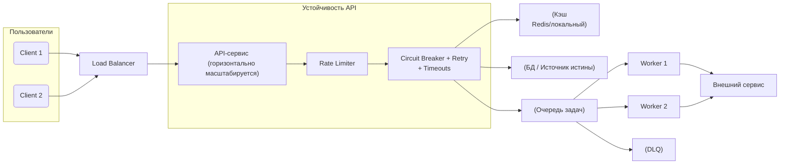

[← Назад к индексу части 19](index.md)

## Справочник по части 19

### Краткий конспект понятий и решений

| Тема | Ключевые пункты |
| --- | --- |
| Масштабирование | Vertical vs horizontal; stateless‑подход; балансировщик и health‑checks; auto‑scaling и scale to zero. |
| Балансировка | L4 vs L7; алгоритмы распределения (round‑robin, least connections, weighted); liveness vs readiness. |
| Кэш | CDN/edge, proxy‑кэш, Redis и приложенческий кэш; TTL, инвалидация; кэш как инструмент масштабирования, а не только оптимизации. |
| Очереди | Продюсеры и потребители; сглаживание пиков; гарантии доставки; DLQ; мониторинг и backpressure. |
| Circuit breaker | Состояния closed/open/half‑open; пороги ошибок; быстрый отказ и fallback. |
| Retry | Экспоненциальный backoff, jitter, лимит попыток; идемпотентность операций. |
| Rate limiting | Ограничения по ключам; защита от перегрузки и злоупотреблений; реализация через token bucket и Redis/API‑gateway. |
| Bulkhead | Разделение пулов ресурсов; защита критичных операций от фоновых и «шумных» клиентов. |
| Таймауты | Каскадные, согласованные по цепочке; ограничение времени ожидания, предотвращение зависаний и каскадных падений. |

---

### Общая картинка: нагрузка, кэш, очередь и устойчивость

Чтобы связать все элементы части 19 в одну ментальную модель, полезно посмотреть на «полный путь» запроса через систему:

Читаем по схеме:

- **Масштабирование и балансировка**: несколько пользователей идут через балансировщик на **кластер API‑инстансов**, которые умеют auto‑scaling и проходят через health‑checks.  
- **Кэш**: часть запросов обслуживается из кэша, снимая нагрузку с БД/внешних API.  
- **Очереди**: тяжёлые или асинхронные операции отправляются в очередь, обрабатываются воркерами, а проблемные сообщения попадают в DLQ.  
- **Устойчивость**: вокруг вызовов к БД, очереди и внешним сервисам работают rate limiting, circuit breaker, retry и таймауты, чтобы система **деградировала предсказуемо**, а не падала целиком.

Эта диаграмма — «карта» части 19: почти каждый блок соответствует отдельному разделу или подпункту плана и помогает держать общую архитектурную картинку в голове.

##### Мини‑проверка: общая архитектурная картина

1. Какую роль играет балансировщик нагрузки в общей схеме, если смотреть вместе на масштабирование, кэш, очереди и устойчивость?  
2. Почему кэш и очередь решают **разные задачи** в архитектуре, даже если оба влияют на производительность под нагрузкой?  
3. Как circuit breaker и rate limiting помогают защитить как внутренние зависимости (БД, внешние сервисы), так и сам API‑сервис на общей диаграмме?

Ответ

1. Балансировщик является входной точкой для трафика и распределяет запросы по нескольким инстансам API, обеспечивая горизонтальное масштабирование и отказоустойчивость. Без него все остальные механизмы (кэш, очереди, resilience‑паттерны) работали бы только в рамках одного узла и не решали бы задачи распределения нагрузки.  
2. Кэш уменьшает **количество обращений** к источникам данных, отвечая быстрее за счёт повторного использования результатов; очередь же **развязывает во времени** приём и обработку задач, сглаживая пики и позволяя обрабатывать тяжёлые операции асинхронно. Это комплементарные, а не взаимозаменяемые инструменты.  
3. Circuit breaker отключает «больную» зависимость при серии ошибок, предотвращая лавинообразный рост таймаутов и падение всего API. Rate limiting не даёт отдельным клиентам или потокам запросов перегрузить сервис и его зависимости, защищая как сам API (CPU, память, соединения), так и нижележащие компоненты (БД, внешние API) от неконтролируемых всплесков.  

---

## Частые сценарии

### Сценарий 1. Рост RPS на API сервиса

**Задача.** RPS вырос в 5 раз, пользователи жалуются на время ответа и ошибки 500.

- **Решение:**
  - определить bottleneck (БД, кэш, сеть);  
  - если приложение — узкое место:
    - сделать его stateless;  
    - поднять несколько инстансов под балансировщиком;  
    - включить auto‑scaling.  
  - если БД/внешний API — узкое место:
    - добавить кэш;  
    - оптимизировать запросы;  
    - возможно, вынести тяжёлые операции в очередь.

### Сценарий 2. Нестабильный сторонний сервис

**Задача.** Внешний сервис иногда отвечает 5xx/timeout, иногда работает нормально, но в пиках ломает твой бекенд.

- **Решение:**
  - обернуть вызов в circuit breaker с порогами по ошибкам и open‑timeout;  
  - настроить retry с backoff и jitter для временных сбоев;  
  - ограничить пул потоков/соединений (bulkhead), чтобы не блокировать другие операции;  
  - добавить rate limiting на уровне клиента, чтобы не усиливать перегрузку.

### Сценарий 3. Ночная расчётная задача

**Задача.** Ночью запускаются тяжёлые отчёты/агрегации, которые иногда «съедают» все ресурсы и мешают онлайн‑трафику.

- **Решение:**
  - вынести расчёты в отдельный сервис/воркер с собственным пулом ресурсов (bulkhead);  
  - запускать через очередь с лимитами параллелизма;  
  - для пользовательского интерфейса показывать состояние расчётов асинхронно;  
  - при необходимости масштабировать воркеры отдельно от онлайн‑API.

---

## Вопросы для самопроверки по части 19

1. Объясни на примере, чем **vertical** и **horizontal** масштабирование отличаются с точки зрения архитектурных решений.  
2. Какие уровни кэширования ты можешь использовать в своём текущем или учебном проекте и какие данные там хранить?  
3. Как бы ты спроектировал(а) цепочку: «пользователь → API → очередь → воркер → внешний сервис» так, чтобы она была устойчивой к временным и длительным сбоям внешнего сервиса?  
4. Для какого сценария ты выбрал(а) бы **только retry**, для какого — **retry + circuit breaker**, а для какого — **очередь + rate limiting**?

Ответ

1. Vertical: усиливаем один инстанс, не меняя сильно схему взаимодействия компонентов; основные решения — выбор instance‑типа, настройка ресурсов. Horizontal: строим кластер одинаковых инстансов под балансировщиком, решаем вопросы stateless‑поведения, балансировки, health‑checks и auto‑scaling.  
2. Например: CDN/edge для статики и редко меняющегося HTML, reverse‑proxy‑кэш для GET‑API, Redis/локальный кэш для часто читаемых и редко меняющихся сущностей (справочники). Важно для каждого уровня понимать TTL и правила инвалидации.  
3. Добавить: ограниченное число retry с backoff и jitter в воркере; circuit breaker вокруг вызова внешнего сервиса; DLQ для задач, которые упали N раз; rate limiting на стороне воркера или API; таймауты на каждом уровне. Это позволит системе деградировать контролируемо, не обваливая весь поток задач.  
4. Только retry — для локальной временной ошибки (например, файловая система вернула временный отказ). Retry + CB — для нестабильного внешнего API, где нужно остановить шквал запросов при длительном сбое. Очередь + rate limiting — для потока однотипных задач к внешнему сервису, который имеет договорной лимит запросов в секунду.  

---

## Практика после части 19

Возьми **один реальный или учебный сервис/модуль** (например, платёжный шлюз, сервис уведомлений, генератор отчётов) и письменно опиши:

1. **Как ты будешь масштабировать этот сервис**:
   - какие ограничения сейчас являются узким местом (CPU, БД, внешние API, сеть);  
   - с чего начнёшь: vertical или horizontal scaling, почему;  
   - какие health‑checks и метрики выберешь для auto‑scaling (CPU, RPS, длина очереди, бизнес‑метрики).
2. **Как ты используешь кэш и очереди**:
   - какие данные или результаты запросов можно кэшировать (на каких уровнях — CDN, proxy, Redis, локальный кэш);  
   - какие операции уместно вынести в очередь и какие гарантии доставки нужны;  
   - какие метрики очередей и DLQ ты будешь мониторить.
3. **Как ты обеспечишь устойчивость к сбоям зависимостей**:
   - какие внешние вызовы обернёшь в retry + circuit breaker, с какими параметрами (таймаут, число попыток, backoff, jitter);  
   - где внедришь rate limiting и bulkhead‑разделение ресурсов;  
   - какие таймауты по цепочке выберешь, чтобы уложиться в SLA для пользователя.
4. Назови по одной **типичной ошибке**, которую легко допустить при масштабировании и при настройке устойчивости этого сервиса, и опиши, как ты её избежишь.

Если есть возможность, обсуди своё решение с коллегой: сумеешь ли ты **обосновать выбор конкретных паттернов масштабирования и resilience** исходя из требований к нагрузке, отказоустойчивости и UX.

---

## Типичные ошибки и антипаттерны

- **Масштабирование только «вверх»**: огромный монолитный инстанс без отказоустойчивости и возможности прокачать пропускную способность.  
- **Кэш без стратегии инвалидации**: постоянные расхождения данных и «мистические баги», зависящие от TTL.  
- **Очередь без DLQ и мониторинга**: потерянные задачи и незаметные отказы.  
- **Retry без лимита, backoff и jitter**: усиливает перегрузку зависимостей и приводит к лавинным сбоям.  
- **Отсутствие таймаутов и circuit breaker**: зависшие соединения, исчерпание ресурсов и каскадные падения.  
- **Отсутствие rate limiting и bulkhead**: один «плохой» клиент или фича может уронить весь сервис.  
- **Слепое включение auto‑scaling** по одной метрике без понимания узких мест.

---

## Резюме части 19

- **Масштабирование и устойчивость** — это не только про «больше серверов», но про **архитектурные паттерны**, которые управляют нагрузкой, очередями, кэшем и сбоями.  
- Вертикальное и горизонтальное масштабирование дополняют друг друга; балансировщики, health‑checks и auto‑scaling делают кластеры управляемыми и адаптивными.  
- Кэш и очереди — ключевые инструменты для **снятия нагрузки с БД/внешних API и сглаживания пиков**, но они требуют продуманной инвалидации, DLQ и backpressure.  
- Circuit breaker, retry, rate limiting, bulkhead и каскад таймаутов позволяют системе **деградировать контролируемо**, сохраняя ядро функциональности даже при частичных сбоях.  
- Всё это работает по‑настоящему только в связке с **наблюдаемостью** (метрики, логи, трассировка) и осознанными архитектурными решениями.

