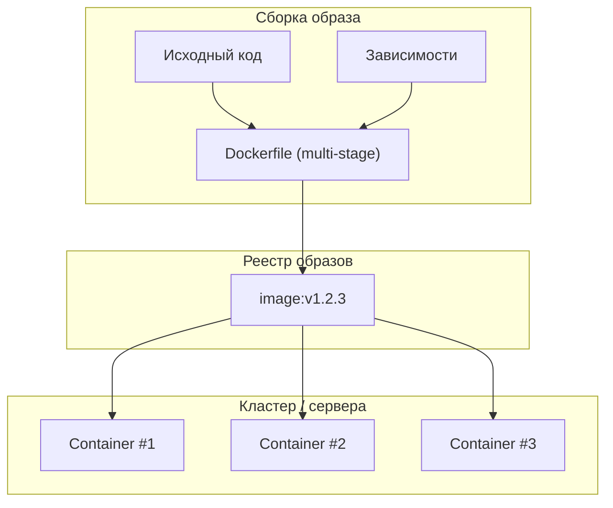

[← Назад к индексу части 20](index.md)

## 20.1. Контейнеры, образы и мультистейдж‑сборка

### Цель раздела

Сформировать у тебя **чёткое и практическое понимание**, что такое образ контейнера, как он устроен из слоёв, как писать Dockerfile так, чтобы образы были **маленькими, безопасными и предсказуемыми**, и как это связано с скоростью деплоя и безопасностью продакшена.

### В этом разделе главное

- Образ контейнера — это **не «мини‑ВМ»**, а **набор слоёв файловой системы** + метаданные о команде запуска.
- Хороший образ: **минимальный runtime**, один процесс, **никаких лишних тулзов и секретов** внутри.
- **Мультистейдж‑сборка** позволяет отделить «тяжёлую» стадию сборки от лёгкого продакшен‑образа.
- От структуры Dockerfile зависят:
  - размер образа;
  - скорость деплоя и прогрева кластера;
  - поверхность атаки и удобство обновлений.
- Образы должны быть **неизменяемыми**: после сборки ты их только запускаешь, а не «подправляешь на серверах».

### Термины

- **Dockerfile** — файл с инструкциями, как собрать образ (FROM, RUN, COPY, CMD и т.д.).
- **Base image (базовый образ)** — образ, от которого мы наследуемся (например, `node:20-alpine`, `python:3.12-slim`).
- **Runtime image** — финальный образ, который крутится в продакшене (без инструментов сборки).
- **Registry (реестр)** — хранилище образов (Docker Hub, GitLab Registry, ECR, GCR и т.д.).
- **Tag (тег)** — метка версии образа (`v1.2.3`, `commit‑sha`, `2026‑03‑16_001`).

### Теория и правила

1. **Образ как слоёный пирог**

   Каждый шаг Dockerfile (RUN, COPY и т.п.) создаёт **новый слой**.

   - Менее изменяемые слои выгодно располагать **выше** (в начале Dockerfile), чтобы их **кэшировал регистр и билд‑система**.
   - Часто меняющийся код (COPY исходников) лучше делать в конце — чтобы при изменении кода не пересобирать всё от начала.

2. **Один образ — один процесс**

   Архитектурное правило:

   - «толстый» образ с кучей демонов (cron, sshd, supervisor, приложение) — это **мини‑VM** и ломает модели оркестраторов;
   - современная практика: **один процесс на контейнер**, остальные задачи (cron, побочные процессы) выносятся в отдельные контейнеры/Jobs.

3. **Минимальные базовые образы**

   - `alpine`, `-slim`, `distroless` — уменьшают размер и поверхность атаки.
   - Но: слишком минимальные образы затрудняют отладку (нет `sh`, `curl` и т.п.) — часто в стейджинге можно использовать более «толстые», а в проде — максимально минимальные.

4. **Мультистейдж‑сборка**

   Пример шаблона:

   ```Dockerfile
   # 1. Стадия сборки
   FROM node:20-alpine AS build
   WORKDIR /app
   COPY package*.json ./
   RUN npm ci
   COPY . .
   RUN npm run build

   # 2. Лёгкий runtime-образ
   FROM node:20-alpine AS runtime
   WORKDIR /app
   COPY --from=build /app/dist ./dist
   COPY package*.json ./
   RUN npm ci --omit=dev

   USER node
   CMD ["node", "dist/main.js"]
   ```

   Ключевые идеи:

   - инструменты сборки (`npm`, компиляторы, dev‑зависимости) живут только в стадии `build`;
   - в финальный образ попадает **только артефакт сборки** и runtime‑зависимости.

5. **Неизменяемость образов и конфигурация**

   - После сборки образ **не должен меняться**: никакого `apt-get` прямо в продакшен‑контейнере по SSH.
   - Конфигурация (URL БД, лог‑уровни, фичефлаги) должна приходить **снаружи**:
     - переменные окружения;
     - монтируемые конфиги;
     - объекты типа ConfigMap/Secret в Kubernetes.

6. **Сканирование образов на уязвимости**

   - Инструменты вроде **Trivy, Snyk, Clair** сканируют слои образов на известные CVE.
   - Важно:
     - встраивать сканирование в **CI‑пайплайн**;
     - иметь процесс **обновления базовых образов** и зависимостей.

### Пошагово: как спроектировать хороший образ для сервиса

1. **Определи стек**: язык, runtime, нужны ли «тяжёлые» инструменты сборки.
2. **Выбери базовый образ**:
   - сначала посмотри на `*-slim` / `*-alpine` варианты;
   - оцени потребности в отладке (нужен ли shell).
3. **Раздели сборку и runtime**:
   - мультистейдж — почти всегда хорошая идея;
   - на стадии сборки устанавливай dev‑зависимости, запускай тесты/линтеры.
4. **Оптимизируй порядок слоёв**:
   - сначала COPY/INSTALL зависимостей, которые редко меняются;
   - затем — исходный код.
5. **Запусти от non‑root пользователя**:
   - создай пользователя в Dockerfile или используй уже имеющегося;
   - не запускай приложение от root без объективной необходимости.
6. **Подумай о логах и сигналax**:
   - пиши логи в stdout/stderr (а не в файлы внутри контейнера);
   - корректно обрабатывай SIGTERM для graceful shutdown (подробнее в 20.3).

### Простыми словами

Образ контейнера — это как **ISO‑образ диска** с уже установленным приложением:

- его **копируют на множество серверов/нод**;
- на его основе стартуют **контейнеры — живые экземпляры**.

Плохой образ — это как огромный монструозный ISO с кучей лишнего софта и «секретиками» в конфиге.  
Хороший образ:

- **маленький**, быстро скачивается и разворачивается;
- **чистый**, без лишнего мусора и уязвимостей;
- **предсказуемый** — всегда одинаковый при одном и том же Dockerfile и наборе зависимостей.

### Картинка в голове



Образ — это «заготовка», одинаковая для всех контейнеров; конфигурация и данные приходят уже на этапе запуска.

### Как запомнить

- **Образ = слоёный пирог, контейнер = кусок этого пирога на тарелке.**
- Всё, что относится к **окружению**, а не к логике, — стремись вынести **наружу образа**.
- «Толстые» образы = медленные деплои и большая поверхность атаки.

### Примеры

**Пример 1. Плохой Dockerfile для микросервиса**

```Dockerfile
FROM ubuntu:22.04
RUN apt-get update && apt-get install -y python3 python3-pip curl nano vim
WORKDIR /app
COPY . .
RUN pip install -r requirements.txt
CMD ["python3", "main.py"]
```

Проблемы:

- огромный базовый образ (`ubuntu` + множество пакетов);
- dev‑утилиты (`nano`, `vim`, `curl`) попадают в прод;
- нет разделения сборки и runtime;
- запуск от root по умолчанию.

**Пример 2. Улучшенный вариант**

```Dockerfile
FROM python:3.12-slim AS runtime
WORKDIR /app

COPY requirements.txt .
RUN pip install --no-cache-dir -r requirements.txt

COPY . .

RUN useradd -u 1001 appuser
USER appuser

CMD ["python", "main.py"]
```

Уже лучше:

- slim‑образ;
- нет лишних пакетов;
- non‑root пользователь.

Дальше можно вынести тесты в отдельную стадию сборки, а сюда копировать только проверенный код.

### Практика / реальные сценарии

- Миграция от «традиционного» деплоя (tar.gz + ansible/ssh) к контейнерам:
  - сначала сервисы упаковываются в образы **без изменения архитектуры**;
  - затем постепенно упрощаются образы (multi‑stage, slim), добавляется сканирование.
- Выявление проблем безопасности:
  - сканер показывает критические CVE в базовом образе;
  - команда переходит на более свежую версию или на другой базовый образ (например, с `ubuntu` на `*-slim`).

### Типичные ошибки

- Использование **огромных базовых образов** без необходимости.
- Хранение **секретов внутри образа** (ключи, пароли).
- Запуск приложения от root, хотя это не нужно.
- Отсутствие явного управления версией образа (только тег `latest` без привязки к коммиту/версии).

### Что будет, если…

- …хранить секреты (пароли к БД, API‑ключи) внутри образа?

  - Любой, кто получит доступ к образу (например, к реестру), получает **полный доступ к этим секретам**. Ротация секретов превращается в пересборку/перераздачу образов и становится крайне болезненной.

- …делать `apt-get` прямо в запущенном контейнере в проде?

  - Ты ломишься через идею **неизменяемости**: окружения начинают отличаться друг от друга, проблема воспроизводимости и отладки растёт, а патчи безопасности невозможно отслеживать централизованно.

### Проверь себя

1. Почему архитектурно важно стремиться к **одному основному процессу** в контейнере, а не собирать «мини‑VM»?  
2. Как мультистейдж‑сборка помогает **снизить риски безопасности** и улучшить скорость деплоя?  
3. Какие практики тегирования образов ты бы предложил(а) для команды, чтобы можно было быстро понять, **какой код** крутится в проде?

<details><summary>Ответ</summary>

1. Оркестраторы (Kubernetes и др.) работают в предположении, что контейнер = единица масштабирования и жизненного цикла одного приложения. Несколько несвязанных процессов внутри усложняют мониторинг, рестарты и масштабирование: нельзя независимо перезапустить часть функциональности, трудно понять, что именно упало. Отдельные процессы легче выносить в отдельные контейнеры/Pod‑ы с собственными политиками.  
2. Мультистейдж позволяет не включать в финальный образ компиляторы, дебаг‑тулы и прочие лишние пакеты, которые увеличивают поверхность атаки. Лёгкий runtime‑образ быстрее тянется в кластер, старты Pod‑ов и rollout‑ы проходят быстрее, уменьшая окно деградации при деплоях.  
3. Практично:
   - использовать **семантическую версию** (`vX.Y.Z`) + **тег с коротким SHA коммита** (`v1.2.3‑abcd1234`);  
   - закреплять в манифестах именно конкретный тег (а не `latest`);  
   - хранить связывание «тег → коммит → пайплайн CI» в регистре или в отдельном артефакте. Тогда по тэгу легко вернуться к конкретному коду и логу пайплайна.

</details>

#### Дополнительные вопросы по разделу 20.1

1. Почему важно писать логи в `stdout/stderr`, а не в произвольные файлы внутри контейнера, если смотреть глазами эксплуатации и observability?  
2. Чем опасно использовать в Dockerfile длинные цепочки `RUN apt-get ... && ... && ...` без очистки кэша и продуманного порядка шагов?  
3. В каких случаях ты сознательно выберешь **не самый минимальный базовый образ** (не `alpine`/`distroless`), и какие компромиссы при этом принимаешь?

<details><summary>Ответ</summary>

1. Потому что стандартные потоки логов легко подхватываются оркестратором и системой логирования (стек EFK, Loki и т.п.), их не нужно искать по файловой системе контейнеров; это упрощает централизованный сбор, поиск и ротацию логов. Логи во внутренних файлах:  
   - сложнее агрегировать,  
   - увеличивают размер контейнера/томов,  
   - усложняют диагностику при краткоживущих Pod‑ах.  
2. Такие команды часто ведут к «надутым» слоям: в каждый слой попадает много временных файлов и кэшей (`apt cache`, артефакты сборки), которые потом трудно удалить без дополнительного слоя. Непродуманный порядок шагов ломает кэширование (любое изменение внизу пересобирает всё), усложняет безопасность (лишние пакеты) и делает образы хрупкими при обновлениях.  
3. Например, когда нужна удобная отладка (наличие `sh`, базовых утилит, пакетов) в разработке или на стейджинге, либо когда сторонний vendor официально поддерживает только более «толстый» базовый образ. В таком случае ты осознанно платишь увеличенным размером и большей поверхностью атаки, получая взамен удобство поддержки и совместимость; это решение стоит явно зафиксировать и регулярно пересматривать.  

</details>

### Запомните

- Образ — это **артефакт архитектуры**, а не просто техническая деталь: от него зависят безопасность, скорость деплоёв и повторяемость окружений.
- **Неизменяемый, минимальный и правильно тегированный образ** — фундамент для всех последующих решений по оркестрации и CI/CD.

---
