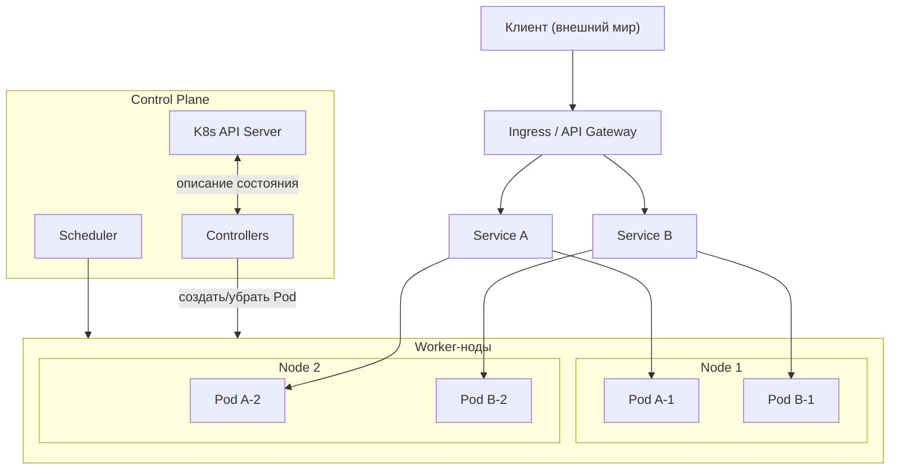

[← Назад к индексу части 20](index.md)

## 20.2. Оркестрация: Kubernetes и аналоги

### Цель раздела

Дать тебе **архитектурное понимание оркестрации**: как Kubernetes (и похожие системы) управляют контейнерами, что значат Pod, Deployment, Service, Ingress, HPA, проби и ресурсные лимиты, как реализуются стратегии деплоя и когда Kubernetes оправдан, а когда достаточно более простой схемы.

### В этом разделе главное

- Оркестратор — это **управляющий слоем поверх контейнеров**, который занимается расписанием, перезапусками, масштабированием и сетями.
- Kubernetes оперирует сущностями:
  - **Pod** (группа контейнеров),
  - **Deployment** (сколько и каких Pod‑ов),
  - **Service/Ingress** (доступ и балансировка),
  - **ConfigMap/Secret** (конфигурация),
  - **HPA** (авто‑масштабирование).
- Правильно настроенные **проби, лимиты и стратегии деплоя** — ключ к устойчивости и без‑даунтайм обновлениям.
- Kubernetes не всегда нужен: для **маленьких систем** может быть достаточно простых deployment‑скриптов или managed‑платформ.

### Термины

- **Control plane** — управляющая часть кластера Kubernetes (API‑сервер, scheduler, controller manager).
- **Node** — рабочий узел (виртуальная или физическая машина), на котором крутятся Pod‑ы.
- **Scheduler** — компонент, который решает, на какие ноды размещать новые Pod‑ы.
- **HPA (Horizontal Pod Autoscaler)** — объект, который по метрикам увеличивает/уменьшает число Pod‑ов.
- **Namespace** — логическое разделение ресурсов внутри кластера (по командам, средам и т.п.).

### Теория и правила

1. **Kubernetes как управляющая система**

   Архитектурно:

   - ты описываешь **желаемое состояние** (манифестами/Helm‑чартами);
   - Kubernetes **постоянно сравнивает реальность с этим описанием**;
   - контроллеры делают всё, чтобы привести реальность к желаемому состоянию:
     - создают/удаляют Pod‑ы;
     - перезапускают упавшие;
     - обновляют версии образов по Deployment’ам.

2. **Pod и Deployment**

   - Pod — минимальная единица исполнения; часто 1 контейнер = 1 Pod, но может быть sidecar (логирование, прокси и т.п.).
   - Deployment:
     - задаёт **шаблон Pod‑а**;
     - управляет количеством реплик (`replicas`);
     - реализует стратегии обновления (`rollingUpdate`, `recreate`).

3. **Service и Ingress**

   - Service даёт:
     - **стабильное имя** (DNS) для группы Pod‑ов;
     - балансировку по ним;
     - часто используется как внутренний «виртуальный IP».
   - Ingress/Ingress‑контроллер:
     - принимает внешний HTTP/HTTPS трафик;
     - по правилам (host, path, headers) направляет его на нужные Service’ы;
     - может реализовывать TLS‑терминацию, rate limiting, аутентификацию.

4. **Проби: liveness и readiness в контексте кластера**

   - **Liveness**:
     - определяет, жив ли процесс в Pod‑е;
     - при провале kubelet убивает контейнер, и он перезапускается.
   - **Readiness**:
     - определяет, готов ли Pod принимать трафик;
     - при провале Service **перестаёт посылать трафик** на этот Pod.

   Архитектурно:

   - readiness должен учитывать не только «поднялся ли HTTP‑сервер», но и:
     - подключение к БД/кэшу;
     - наличие нужных миграций;
     - прогретый кэш, если это критично.

5. **Ресурсные лимиты и QoS**

   Для каждого контейнера задаются:

   - **requests** — гарантированное минимальное количество ресурсов (CPU/RAM);
   - **limits** — максимальное количество.

   Зачем:

   - scheduler использует requests, чтобы **распределять Pod‑ы по нодам**;
   - при превышении limits контейнер может быть ограничен/убит (OOMKill);
   - это защищает от «прожора», когда один сервис съедает всю память/CPU ноды.

6. **Стратегии деплоя**

   - **Rolling update**:
     - постепенно уменьшается количество старых Pod‑ов и увеличивается новых (`maxUnavailable`, `maxSurge`);
     - хорошо подходит для backward‑совместимых изменений.
   - **Recreate**:
     - сначала убить все старые, потом поднять новые;
     - риск downtime, используется редко.
   - **Blue‑green и canary**:
     - часто реализуются на уровне Ingress/API‑шлюза или внешнего load balancer’а;
     - два Deployment’а/окружения: **blue (старое)** и **green (новое)**;
     - canary пускает малую долю трафика на green, остальное — на blue.

   Важно продумать и **стратегию отката**:

   - в Kubernetes есть встроенный механизм `kubectl rollout undo` для возврата к предыдущей ревизии Deployment’а;
   - при blue‑green откат — это **обратное переключение трафика** (зелёное окружение выключаем, синее снова делаем активным);
   - при canary откат — возврат веса трафика на старую версию и выключение новой.

7. **Сетевые политики и безопасность на уровне кластера**

   - **NetworkPolicy** позволяет задать, **кто с кем может общаться** внутри кластера:
     - какие Pod‑ы могут ходить к каким Service’ам;
     - какие внешние подключения разрешены/запрещены.
   - Архитектурно это:
     - продолжение идеи **границ и доверенных зон** (части 2 и 30–31);
     - способ реализовать принцип «минимально необходимого доступа» не только для пользователей, но и для **сервисов друг к другу**.

   Даже если на старте NetworkPolicy не вводится, хорошо **нарисовать целевую модель**:

   - какие сервисы считаются «краем» (принимают внешние запросы);
   - какие хранилища доступны только ограниченному набору Pod‑ов;
   - через какие точки проходят кросс‑границы (например, через API‑шлюз).

8. **Когда Kubernetes оправдан, а когда нет**

   Kubernetes даёт:

   - много возможностей для **масштабирования, самовосстановления, изоляции и гибких деплоев**;
   - но взамен требует:
     - достаточно компетенций в команде;
     - серьёзной инфраструктуры мониторинга/логирования;
     - дополнительных усилий в эксплуатации.

   Уместен, когда:

   - много сервисов;
   - нужны auto‑scaling, zero‑downtime деплои, multi‑AZ/region;
   - команда готова инвестировать в платформу.

   Избыточен, когда:

   - один‑два относительно простых сервиса;
   - достаточно managed‑PaaS или простого деплоя на виртуалки/серверless;
   - нет ресурсов на поддержку кластера.

   В качестве альтернатив оркестрации на «полном» Kubernetes используют:

   - **managed‑решения** (ECS/Fargate, Cloud Run и аналоги), где часть задач берёт на себя облако;
   - более простые системы вроде **Nomad, Docker Swarm** там, где возможности Kubernetes избыточны;
   - чистый **serverless** (Functions‑as‑a‑Service), когда нагрузка событийная, а задачи укладываются в модель коротких функций без сложного состояния.

   Эти варианты упрощают эксплуатацию ценой меньшей гибкости; выбор между ними — полноценное **архитектурное решение**, а не только технологический вкус.

### Пошагово: как думать об оркестрации для системы

1. **Определи масштаб и требования**:
   - сколько сервисов;
   - какие требования по доступности, RPS, multi‑region;
   - есть ли потребность в auto‑scaling.
2. **Реши, нужен ли Kubernetes/оркестратор**:
   - если да — будет ли это managed‑кластер или self‑managed.
3. **Для каждого сервиса**:
   - опиши **Pod‑шаблон**: ресурсы, порты, переменные окружения, побочные контейнеры;
   - создай Deployment: количество реплик, стратегия обновления;
   - создай Service: тип доступа (ClusterIP, NodePort, LoadBalancer).
4. **Продумай входной трафик**:
   - Ingress/API‑шлюз, домены, сертификаты;
   - маршрутизация по сервисам.
5. **Настрой prob’ы и лимиты**:
   - liveness для перезапуска «зависших» процессов;
   - readiness, учитывающий зависимости;
   - адекватные requests/limits.
6. **Спланируй авто‑масштабирование (HPA)**:
   - по CPU, RPS, длине очередей — опорные метрики из части 19.

### Простыми словами

Представь Kubernetes‑кластер как **автоматизированный «цех»**, где есть:

- **мастер‑цех** (control plane), который знает, **сколько и каких станков** (Pod‑ов) должно работать;
- **станки** (Pod’ы), каждый с определённым «чертежом» (образом) и настройками;
- **смотритель** (scheduler), который решает, на каких участках цеха (нодах) поставить новые станки;
- **коридоры и таблички** (Service/Ingress), по которым рабочие (запросы) находят нужные станки.

Ты как архитектор **рисуешь схему цеха и правила**, а Kubernetes следит, чтобы она выполнялась.

### Картинка в голове

### Как запомнить

- **Pod — «контейнер плюс окрестности», Deployment — «сколько и каких Pod‑ов», Service — «как к ним попасть».**
- Kubernetes — это **реализатор желаемого состояния**, а не просто «запускалка контейнеров».
- Проби и лимиты — это **страховочные пояса** для устойчивости.

### Примеры

**Пример 1. Простой HTTP‑сервис в Kubernetes**

- Deployment:
  - `replicas: 3`;
  - образ `app:v1.2.3`;
  - liveness `/live`, readiness `/ready`;
  - requests/limits по CPU/RAM.
- Service:
  - тип `ClusterIP`;
  - порт 80 → 8080 (порт приложения).
- Ingress:
  - домен `api.example.com`;
  - маршрут `/` → Service.

**Пример 2. Canary‑деплой новой версии**

- Есть Deployment `app-v1` (80% трафика) и `app-v2` (20%).
- Ingress или API‑шлюз:
  - распределяет трафик по весам 80/20;
  - следит за метриками ошибок/латентности для `app-v2`.
- При успехе постепенно увеличиваем долю для `app-v2` до 100% и выключаем `app-v1`.

### Практика / реальные сценарии

- Крупный продукт с десятками микросервисов:
  - каждый сервис — Deployment + Service;
  - отдельные Namespaces для окружений (dev/stage/prod);
  - HPA по нагрузке;
  - Ingress‑контроллер для роутинга HTTP‑трафика.
- Переезд с «зверинца» Docker‑Compose/VM‑ок на Kubernetes:
  - сначала поднимается **платформа** (кластер, мониторинг, логирование);
  - затем сервисы постепенно переносятся как Deployment’ы;
  - особое внимание уделяется readiness/liveness, ресурсам и стратегиям деплоя.

### Типичные ошибки

- Отсутствие или неправильная настройка **readiness‑проб**:
  - трафик попадает на Pod‑ы, которые ещё не подключились к БД/кэшу.
- Отсутствие ресурсных лимитов:
  - один сервис может «съесть» весь CPU/память ноды и уронить соседей.
- Непродуманные стратегии деплоя:
  - деплой «в лоб» без возможности отката;
  - отсутствие контроля над `maxUnavailable`/`maxSurge`.
- Внедрение Kubernetes в маленькую команду без опыта:
  - платформа сложнее самого продукта;
  - большая часть времени уходит на борьбу с инфраструктурой.

### Что будет, если…

- …не задавать лимитов по ресурсам для Pod‑ов?

  - Любой «заглючивший» сервис может начать потреблять всю память/CPU ноды, вытесняя другие Pod‑ы, что приведёт к **каскадным падениям**.

- …читать readiness только как «порт слушает», не проверяя зависимости?

  - Балансировщик начнёт слать трафик на Pod, который «жив», но не может выполнять запросы (нет БД, миграции не применены и т.п.), пользователи увидят ошибки/таймауты.

### Проверь себя

1. Чем **Deployment** отличается от **StatefulSet** и почему для статeless‑сервисов почти всегда достаточно Deployment?  
2. Какую роль играют **liveness и readiness** в сценарии rolling update?  
3. В каких случаях ты бы предпочёл(а) **managed Kubernetes‑кластер или serverless‑платформу**, а не собственный self‑managed кластер?

Ответ

1. Deployment подходит для **stateless‑сервисов**: Pod’ы идентичны и могут создаваться/удаляться произвольно. StatefulSet нужен, когда у Pod‑ов есть **устойчивые идентичности и связанные с ними тома** (например, кластеры БД). Для обычных API‑сервисов Stateless‑подход через Deployment проще и достаточно надёжен.  
2. Во время rolling update Kubernetes создаёт новые Pod‑ы и постепенно выводит из работы старые. Readiness позволяет **включать в трафик только готовые новые Pod‑ы**, а liveness — перезапускать зависшие. Если readiness настроен неверно, трафик может пойти на неготовые Pod‑ы, вызывая всплеск ошибок.  
3. Managed‑кластер или serverless имеет смысл, когда команда:
   - не хочет/не может инвестировать в поддержку control plane и нод;
   - хочет фокусироваться на приложениях, а не на платформе;
   - нагрузка подходит под возможности платформы (нет сверхспецифичных требований).  
   Self‑managed кластер оправдан, когда нужны особые настройки, on‑prem развертывание или корпоративные ограничения.

#### Дополнительные вопросы по разделу 20.2

1. Как нарушенная настройка `requests/limits` может привести к тому, что авто‑масштабирование по CPU «не помогает», хотя Pod‑ов становится больше?  
2. Почему при проектировании readiness‑проб важно учитывать не только свои зависимости (БД, кэш), но и **свою роль в цепочке** (например, BFF между фронтом и множеством backend‑сервисов)?  
3. Чем отличается архитектурный подход «всё в одном Namesapce без NetworkPolicy» от подхода с чётко размеченными Namespace‑ами и сетевыми политиками?

Ответ

1. Если `requests` занижены, scheduler может «упаковать» много Pod‑ов на одну ноду, считая, что им нужно мало ресурсов, а в реальности они будут конкурировать за CPU и память. Авто‑масштабирование добавит Pod‑ы, но они окажутся на тех же перегруженных нодах, и реальной производительности не прибавится. Если `limits` завышены, каждый Pod может отъедать больше ресурсов, чем разумно, вытесняя соседей; в обоих случаях кластер ведёт себя непредсказуемо.  
2. Потому что даже если твой сервис формально «поднялся» и может, например, сходить к БД, он может быть бессмысленно «готовым», если его основные зависимые сервисы недоступны: BFF без backend‑сервисов не может выполнять свою функцию. В таких случаях readiness логично завязать на критичные зависимости и/или режим деградации (BFF объявляет себя готовым, только если может вернуть хотя бы частичный, но осмысленный ответ).  
3. «Всё в одном Namesapce без NetworkPolicy» означает, что любой Pod может говорить с любым другим, границы доверия размыты, а любая компрометация одного Pod‑а даёт нападающему широкие возможности перемещения внутри кластера. Подход с Namespace‑ами и сетевыми политиками реализует принцип наименьших привилегий: сервисы видят только то, что им нужно по архитектуре, проще проводить аудит и ограничивать blast‑radius при инцидентах.  

### Запомните

- Оркестратор — это **архитектурный слой**, обеспечивающий жизненный цикл сервисов.
- Kubernetes даёт много силы, но **требует дисциплины**: проби, лимиты, стратегии деплоя и понятные конфиги — обязательны.

---
