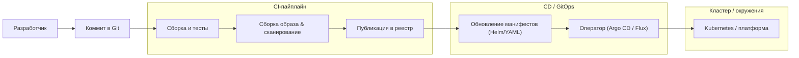

[← Назад к индексу части 20](index.md)

## 20.3. CI/CD, конфигурация, секреты и инфраструктура как код

### Цель раздела

Показать, как выстроить **надёжный путь «от коммита до продакшена»**: что такое хороший CI/CD‑пайплайн, как правильно хранить конфигурацию и секреты, зачем инфраструктуру описывать как код, что такое GitOps, и почему **graceful shutdown** — архитектурно важное требование.

### В этом разделе главное

- CI/CD — это **формализованный конвейер** от коммита до деплоя, который:
  - гарантирует прохождение тестов и проверок;
  - делает релизы воспроизводимыми и наблюдаемыми.
- Конфигурация и секреты должны жить **снаружи образа**, с явной стратегией ротации и доступов.
- Инфраструктура как код (Terraform/Pulumi/CloudFormation) делает окружения **воспроизводимыми, проверяемыми и поддающимися ревью**.
- GitOps — модель, где **git‑репозиторий описывает желаемое состояние окружения**, а оператор синхронизирует его с кластером.
- Graceful shutdown и zero‑downtime деплои — это **архитектурные требования** к сервисам, а не только «настройки оркестратора».

### Термины

- **CI (Continuous Integration)** — частая интеграция изменений с автоматическими сборками и тестами.
- **CD (Continuous Delivery/Deployment)** — автоматическая доставка изменений до окружений (staging/prod).
- **Pipeline (пайплайн)** — последовательность шагов (jobs) в CI/CD.
- **Artifact (артефакт)** — результат сборки: бинарь, пакет, образ.
- **GitOps** — подход, при котором git‑репозиторий хранит желаемое состояние окружений; изменения применяются операторами (Argo CD, Flux).
- **Secret manager** — система для безопасного хранения и выдачи секретов (Vault, AWS Secrets Manager, GCP Secret Manager).

### Теория и правила

1. **Типичный CI/CD‑пайплайн**

   Упрощённый, но типичный сценарий:

   1. **CI (на каждый коммит/PR)**:
      - checkout кода;
      - линтеры, статический анализ;
      - юнит‑ и интеграционные тесты;
      - сборка артефакта (образ контейнера);
      - сканирование образа/зависимостей;
      - публикация образа в реестр.
   2. **CD (по событию: тег/мердж/ручной триггер)**:
      - обновление манифестов (тег образа);
      - деплой в dev/stage;
      - автоматические smoke‑тесты;
      - при необходимости — ручной gate в prod;
      - деплой в prod (rolling/blue‑green/canary);
      - пост‑деплойные проверки и/или автоматический откат.

2. **Один артефакт — много окружений**

   - Идея: **один и тот же образ** проходит путь dev → stage → prod.
   - Конфигурация различается за счёт:
     - переменных окружения;
     - ConfigMap/Secret;
     - отдельных values для Helm‑чартов.

   Это повышает воспроизводимость: если артефакт работает на stage, он должен вести себя так же и в prod (при равной конфигурации).

3. **Конфигурация: 12‑Factor App взгляд**

   Принципы:

   - конфиг приложения отделён от кода;
   - конфиг передаётся через **окружение** или внешние конфиг‑хранилища;
   - конфиг можно менять без пересборки образа (часто с рестартом Pod‑а).

   Архитектурно:

   - различия между окружениями (dev/stage/prod) — это **различия конфигурации**, а не кода/образов;
   - минимизация «if ENV == prod» в коде: вместо этого — конфиг/фичефлаги;
   - для сложных систем полезен **централизованный конфиг‑сервис** (Spring Cloud Config, Consul, собственный конфиг‑API), из которого сервисы читают настройки — это облегчает согласованное изменение конфигурации без пересборки и ручных правок.

4. **Секреты: хранение и ротация**

   Требования:

   - секреты нельзя хранить в git‑репо и образах;
   - нужен **централизованный менеджер секретов** или механизмы шифрования;
   - должен существовать процесс **ротации**:
     - как часто;
     - кто инициирует;
     - как это влияет на работающие сервисы.

   Практические решения:

   - HashiCorp Vault, AWS/GCP/Azure Secret Manager, SOPS+git;
   - интеграция с Kubernetes Secrets (в идеале — секреты подгружаются от менеджера, а не живут в etcd в свободном виде).

   Важный практический момент — **ротация без массовых даунтаймов**:

   - секреты обновляются в секрет‑менеджере;
   - Kubernetes/приложения подтягивают новые значения:
     - через rolling restart Pod‑ов;
     - либо (в более продвинутых сценариях) через горячее чтение новых значений и переподключение к зависимостям;
   - архитектура должна допускать, что **часть инстансов работает со старыми секретами, часть — с новыми**, без нарушения корректности протоколов аутентификации и доступа.

5. **Инфраструктура как код (IaC)**

   - Terraform/Pulumi/CloudFormation/CDK описывают:
     - ВМ/нод‑пулы;
     - сети, подсети, балансировщики;
     - БД, очереди, кэши;
     - кластеры Kubernetes/managed‑сервисы.
   - Изменения проходят:
     - через code review;
     - через планирование (`terraform plan`), где видно, **что изменится**;
     - через аккуратное применение (apply).

   Архитектурные плюсы:

   - **воспроизводимость** (можно поднять копию окружения);
   - **аудит** (история изменений в git);
   - **откат** (часто через git revert + повторное применение).

6. **GitOps**

   - Для приложений и/или инфраструктуры:
     - репозиторий хранит манифесты (Kubernetes YAML, Helm values);
     - оператор (Argo CD, Flux) периодически сравнивает кластер с репо;
     - **дрейф** (ручные изменения в кластере) обнаруживается и откатывается/сигнализируется.

   Плюс:

   - «истина» о состоянии продакшена — в git, а не в чьей‑то голове или «случайных» изменениях в консоли.

7. **Graceful shutdown и zero‑downtime деплои**

   - При деплое или завершении Pod‑а Kubernetes посылает контейнеру **SIGTERM** и ждёт некоторое время (`terminationGracePeriodSeconds`).
   - Приложение должно:
     - **перестать принимать новые запросы** (readiness → fail);
     - доработать текущие запросы;
     - корректно закрыть соединения к БД/кэшу;
     - завершиться с кодом 0.

   Если же приложение игнорирует SIGTERM или просто «рубит» соединения:

   - пользователи получают обрывы запросов при каждом деплое;
   - миграции/обновления становятся рискованными.

### Пошагово: как спроектировать CI/CD и конфигурацию для сервиса

1. **Определи этапы пайплайна**:
   - build → test → scan → publish image → deploy to stage → tests → deploy to prod.
2. **Реши, что будет артефактом деплоя**:
   - контейнерный образ, тегируется по версии/коммиту.
3. **Разведи конфигурацию и код**:
   - определи список переменных окружения;
   - опиши, откуда они берутся (Kubernetes ConfigMap/Secret, secret‑manager).
4. **Интегрируй IaC**:
   - определи, как создаются БД, очереди, кластеры;
   - внеси Terraform/Pulumi‑конфиг в репо, настроив отдельный пайплайн/стейдж.
5. **Добавь GitOps (по мере зрелости)**:
   - выдели repo/директорию для манифестов окружения;
   - подключи Argo CD/Flux или аналоги;
   - переведи обновление манифестов на модель «PR → review → merge → sync».
6. **Реализуй graceful shutdown**:
   - убедись, что приложение обрабатывает SIGTERM;
   - тестируй деплои/перезапуски под нагрузкой, чтобы проверить поведение.

### Простыми словами

CI/CD + IaC — это **«сборочная линия и чертежи завода»**:

- CI — конвейер, который из сырья (коммиты) делает готовые детали (образы);
- CD — упаковка и доставка деталей на склад/в магазин (окружения);
- IaC — чертежи того, **как устроен завод и склад** (ВМ, сети, БД);
- GitOps — книга учёта, где записано **актуальное состояние завода и склада**, и инспектор, который сверяет реальность с книгой.

Без этого:

- каждый инженер «чинит завод по‑своему»;
- никто точно не знает, **что именно крутится в проде**;
- откат после неудачного релиза — как попытка «вспомнить, как было до этого».

### Картинка в голове

### Как запомнить

- **Один образ → много окружений, конфиг — снаружи.**
- Секреты — **никогда не в коде/образах**, всегда через менеджеры секретов/шифрование.
- IaC и GitOps — это **аналог «исходников» для инфраструктуры**; без них архитектура не считается полной.

### Примеры

**Пример 1. CI/CD для микросервиса**

- GitLab CI / GitHub Actions:
  - job `build` — сборка, тесты;
  - job `docker-build` — сборка образа, сканирование, пуш в реестр;
  - job `deploy-staging` — обновление Helm values для stage;
  - job `deploy-prod` — ручной trigger после проверки stage.

Конфигурация:

- переменные окружения (URL БД, фича‑флаги) — в ConfigMap/Secret;
- секреты БД/API — в Vault + интеграция с Kubernetes Secrets.

**Пример 2. IaC для базовой инфраструктуры**

- Terraform описывает:
  - nод‑пул для Kubernetes;
  - managed‑PostgreSQL;
  - Redis‑кластер;
  - S3‑бакеты для бэкапов.

План (`terraform plan`) показывает, какие ресурсы будут созданы/изменены/удалены перед применением.

### Практика / реальные сценарии

- **Миграция с «ручных» деплоев на CI/CD:**
  - сначала автоматизируется сборка и тесты (CI);
  - затем — создание образов и их публикация;
  - затем — полуавтоматический деплой в stage/prod;
  - дальше — GitOps и IaC.
- **Аудит безопасности:**
  - проверяет, где хранятся секреты;
  - требует, чтобы изменения инфраструктуры были **отслеживаемы и воспроизводимы**;
  - без IaC это почти невозможно сделать качественно.

### Типичные ошибки

- Хранение секретов в:
  - `application.yml` в репозитории;
  - Dockerfile/образах;
  - случайных shell‑скриптах деплоя.
- Использование тега `latest` для продакшен‑образов:
  - сложно понять, какой код реально крутится;
  - откаты по сути невозможны без ручных поисков.
- Разные образы для dev/stage/prod:
  - воспроизводимость ломается;
  - «на stage всё работало» не даёт гарантий.
- Отсутствие graceful shutdown:
  - при каждом деплое часть запросов обрывается;
  - пользователи жалуются на «рандомные» ошибки.
- Миграции БД без плана отката и обратной совместимости:
  - схема меняется, а старая версия сервиса ещё получает трафик (rolling/canary) → ошибки;
  - откат приложения невозможен, потому что схема уже “уехала”.

Практичное правило для безболезненных релизов:

- сначала делай **backward‑compatible миграции** (добавить колонку/таблицу, заполнить, держать оба пути),
- потом выкатывай код,
- потом удаляй старое (когда трафик и данные мигрировали).

---

## Инцидентные мини‑разборы (основательно): “что сломалось → почему → как диагностировать → как предотвратить”

Эти разборы специально привязаны к темам этой части: rollback, canary/rolling, probes, secrets, graceful shutdown. Их можно использовать как “мини‑runbook” и как источник правил для будущих ADR.

### Инцидент 1. Canary/rolling выкатывает код, а миграция БД уже “сломала откат”

**Симптомы**

- новая версия в canary получает ошибки 500/SQL errors;
- откат приложения не помогает: старая версия тоже ломается;
- в логах: “column does not exist” или “constraint violation”.

**Почему так происходит**

- миграция была **breaking** (удалили/переименовали колонку, ужесточили constraint);
- при canary/rolling старые и новые версии **живут одновременно** → контракт “код ↔ схема” должен быть совместим.

**Как диагностировать быстро**

- сравнить “какая версия кода на каком проценте трафика” (canary weights);
- проверить, какие запросы падают (по trace_id + SQL);
- проверить порядок: миграция → код → откат (часто видно по таймлайну).

**Как предотвратить**

- миграции делать в 2–3 фазы:
  1) add (новая колонка/таблица, nullable),
  2) backfill (заполнить),
  3) dual-read/dual-write (переходный период),
  4) deprecate/remove (когда старого трафика нет).
- держать правило: “любая схема должна поддерживать \(N\) и \(N-1\) версию сервиса”.

**Критерий готовности релиза**

- есть тест/проверка “старая версия под новой схемой” (smoke на stage).

---

### Инцидент 2. Readiness/Liveness настроены неверно → сервис вечно перезапускается или получает трафик “полуживым”

**Симптомы**

- Pod’ы уходят в restart loop;
- либо наоборот: трафик идёт на Pod, который ещё не прогрелся (ошибки на старте);
- HPA “прыгает” из‑за нестабильного состояния.

**Почему так происходит**

- liveness проверяет “внешнюю зависимость” (БД) → при временной деградации Kubernetes убивает Pod’ы, усугубляя ситуацию;
- readiness не учитывает прогрев кэша/миграции/инициализацию и остаётся “зелёной”.

**Как диагностировать быстро**

- события Kubernetes: причины рестартов, статус probes;
- метрики: restart count, время до ready, доля 5xx в момент rollouts.

**Как предотвратить**

- liveness = “процесс жив” (не зависеть от БД/внешних API);
- readiness = “можно принимать трафик” (учитывать прогрев/готовность зависимостей);
- добавить startupProbe для долгого старта (чтобы liveness не убивал на прогреве).

---

### Инцидент 3. Нет graceful shutdown → “рандомные” ошибки при каждом деплое и утечки ресурсов

**Симптомы**

- при деплое всплеск 499/502, обрывы запросов;
- часть задач в очереди “зависает”, потому что воркер умер посередине;
- соединения к БД остаются “висеть” (пулы/таймауты).

**Почему так происходит**

- сервис не обрабатывает SIGTERM и не выводит себя из readiness;
- нет политики “доработать текущие запросы” и корректно закрыть ресурсы.

**Как диагностировать быстро**

- сравнить график 5xx/499 с окном деплоя;
- проверить, падает ли readiness перед termination;
- посмотреть логи на SIGTERM/timeout.

**Как предотвратить**

- на SIGTERM:
  - переводить readiness в fail,
  - завершать текущие запросы в рамках `terminationGracePeriodSeconds`,
  - закрывать соединения/консьюмеры очереди корректно;
- тестировать “деплой под нагрузкой” на stage (не раз в год).

### Что будет, если…

- …секреты «временно» оставить в репозитории, а потом «планировать вынести»?

  - На практике эти «временно» легко превращаются в годы, секреты попадают в бэкапы/форы, инструменты ИБ находят утечки, и **ротация становится кошмаром**, затрагивающим множество систем.

- …не иметь формализованного пайплайна и IaC?

  - Каждая среда будет «чуть‑чуть отличаться»; локальные правки на серверах со временем превратят инфраструктуру в **«снежинки»**, которые невозможно воспроизвести; поиск причин инцидентов сильно усложнится.

### Проверь себя

1. Какие **обязательные шаги** ты бы включил(а) в CI‑пайплайн для критичного сервисного репозитория?  
2. Какой подход к секретам ты бы выбрал(а) в Kubernetes‑окружении: Kubernetes Secrets «как есть» или интеграцию с внешним Secret Manager — и почему?  
3. Что должен делать твой сервис при получении SIGTERM, чтобы деплои были **максимально безопасными для пользователей**?

Ответ

1. Как минимум:
   - сборка и юнит‑тесты;
   - линтеры/статический анализ;
   - интеграционные/контрактные тесты по ключевым границам;
   - сборка и сканирование образа;
   - публикация образа в реестр с версионированием;
   - (по желанию) прогон smoke‑тестов после деплоя в тестовое окружение.  
   Для особо критичных систем добавляют нагрузочные тесты и дополнительные проверки безопасности.
2. Kubernetes Secrets по умолчанию хранят данные в etcd в (как минимум) base64 и зависят от безопасности самого кластера. Для серьёзных систем предпочтительнее **интеграция с внешним секрет‑менеджером**, который:
   - специализируется на защите и ротации секретов;
   - даёт аудит обращений;
   - может автоматически обновлять значения.  
   Kubernetes Secrets в этом случае используются как транспортный слой/кэш, а не как единый источник истины.
3. При SIGTERM сервис должен:
   - перестать считаться готовым (readiness → fail, чтобы балансировщик не слал новые запросы);  
   - дать доработать текущие запросы в разумный таймаут;  
   - корректно закрыть соединения к БД/кэшу/очередям;  
   - завершиться с кодом 0.  
   Это минимизирует обрывы запросов и делает деплои почти незаметными для пользователей.

#### Дополнительные вопросы по разделу 20.3

1. Чем опасно иметь **разные Docker‑образы** для dev/stage/prod, даже если код «почти одинаковый», и как это влияет на диагностику инцидентов?  
2. Почему GitOps‑подход уменьшает риск «дрейфа окружений», и какую роль здесь играют code‑review и `plan/apply` (в IaC‑инструментах)?  
3. В каком месте цепочки CI/CD ты бы поставил(а) дополнительные проверки безопасности (static analysis, policy‑checks для Terraform, сканирование манифестов), и почему именно там?

Ответ

1. Разные образы означают, что ты фактически тестируешь **один артефакт**, а в прод выкатываешь **другой** — с иным набором библиотек, базового образа, настроек сборки. Это порождает класс багов «на стейдже всё работает, а в проде нет», причём иногда из‑за мелочей (другая версия glibc, OpenSSL и т.п.), которые сложно воспроизвести. Один артефакт на все среды делает поведение предсказуемым и упрощает отладку.  
2. GitOps фиксирует желаемое состояние в git и использует оператор, который **синхронизирует кластер с этим состоянием**. Любые ручные правки в окружении либо перетираются, либо становятся видимыми как дрейф. Code‑review и `plan/apply` в IaC дополняют это: до применения видно, какие ресурсы поменяются, есть шанс поймать ошибку до продакшена, а история изменений хранится как история коммитов.  
3. Логично:
   - statical analysis и линтеры — в ранних шагах CI (после checkout), чтобы быстро давать фидбек разработчикам;  
   - сканирование образов — сразу после сборки образа, до публикации и деплоя;  
   - policy‑checks для Terraform/манифестов — перед `apply` или merge в ветку, из которой GitOps‑оператор берёт конфигурацию.  
   Так ты не пускаешь небезопасные артефакты и конфигурации дальше по конвейеру и ловишь проблемы как можно раньше.  

### Запомните

- CI/CD, конфигурация, секреты и IaC — это **часть архитектуры**, определяющая, как система живёт, меняется и выдерживает ошибки людей.
- Без них «красивая архитектура на диаграммах» редко доезжает до стабильного production‑состояния.

---
