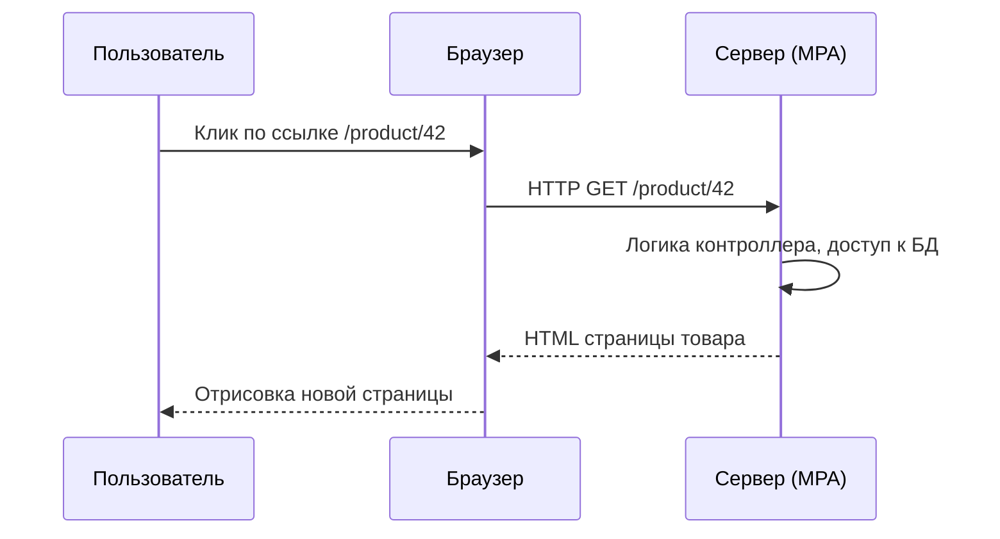
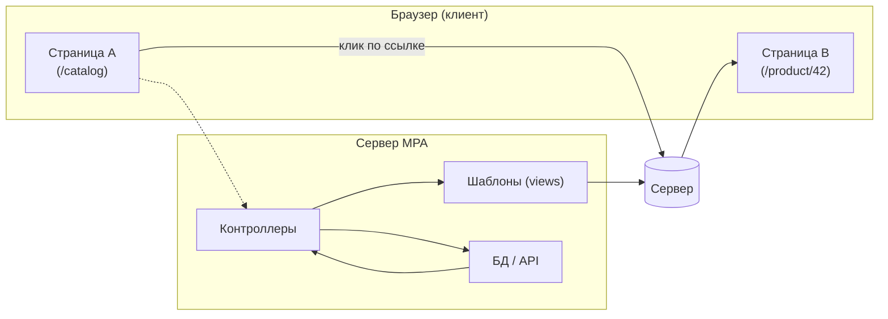

[← Назад к индексу части 21](index.md)

## 21.1. MPA: как устроено классическое многостраничное приложение

### Цель раздела

Сформировать **интуитивное и техническое понимание**, как живёт классическое MPA‑приложение: от клика по ссылке до полной перезагрузки страницы, как сервер рендерит HTML, как работает состояние сессии и почему такой подход до сих пор остаётся сильным базовым вариантом для множества систем.

### В этом разделе главное

- MPA — это архитектура, где **каждый маршрут = отдельный HTTP‑запрос за новым HTML**.  
- **Серверный рендер** (шаблоны, компоненты) — основа: браузер получает **готовый HTML‑документ**, а JS дополняет поведение, а не становится центром вселенной.  
- Состояние пользователя чаще всего живёт **на сервере в сессии**, а браузер хранит только идентификатор (cookie).  
- Полная перезагрузка страницы **очищает клиентское состояние**, но делает поведение предсказуемым и упрощает многие классы ошибок.  
- MPA даёт **естественный SEO, простой стек и низкий порог входа**, что важно для бизнес‑систем и контент‑сайтов.

### Термины

- **MPA (Multi‑Page Application)** — приложение, в котором каждый переход на новый URL означает **получение нового HTML‑документа** от сервера.  
- **Полная перезагрузка (full page reload)** — полное уничтожение текущего документа и загрузка нового; JS‑состояния и DOM создаются с нуля.  
- **Server‑rendered HTML** — результат работы серверных шаблонов/компонентов (Django templates, Rails views, Blade, Thymeleaf и т.п.), который приходит к клиенту.  
- **Сессия (server‑side session)** — структура данных на сервере (иногда в Redis/БД), связанная с идентификатором в cookie; хранит авторизацию, настройки, корзину и т.п.  
- **Layout / шаблон** — общий каркас страницы (шапка, подвал, меню), в который подставляется контент разных страниц.

### Теория и правила

#### 1) Жизненный цикл запроса в MPA

Высокоуровнево:



Ключевые шаги:

1. Пользователь кликает по ссылке `<a href="/product/42">`.  
2. Браузер отправляет **полноценный HTTP‑запрос** к серверу.  
3. Сервер:
   - выполняет код контроллера;
   - получает данные из БД/сервисов;
   - пробрасывает их в шаблон/компоненты;
   - генерирует HTML.  
4. Браузер получает **новый HTML‑документ**, уничтожает старый DOM и строит новый.  
5. Подключаются CSS и JS, инициализируются необходимые скрипты (валидация форм, виджеты и т.д.).

Важно: **каждая страница — самостоятельный HTML‑документ**, который можно открыть напрямую по URL (deep link).

#### 2) Серверный рендер и шаблоны

В MPA:

- логика разбита на:
  - **контроллеры/хендлеры**: принимают запрос, вызывают домен/сервисы, выбирают шаблон;
  - **шаблоны (views)**: описывают структуру HTML, включают куски (partials), циклы, условия.
- любые данные на странице — результат переноса из сервера в HTML ещё до того, как JS начнёт работать.

Пример фрагмента шаблона (упрощённо, псевдосинтаксис):

```html
<html>
  <body>
    <header>
      <h1>{{ site_title }}</h1>
      
        <span>Привет, {{ user.name }}</span>
      
    </header>

    <main>
      <h2>{{ product.name }}</h2>
      <p>{{ product.description }}</p>
      <span>Цена: {{ product.price }} ₽</span>
    </main>
  </body>
</html>
```

Здесь вся логика отображения **выполняется на сервере**; браузер получает уже готовый HTML.

#### 3) Состояние сессии

В MPA удобный паттерн — **состояние на сервере**:

- в cookie хранится только **идентификатор сессии** (например, `sessionid=abc123`);  
- на сервере по этому идентификатору находится объект сессии:
  - `user_id`;
  - содержимое корзины;
  - настройки интерфейса и т.п.

При каждом запросе:

```text
браузер → сервер: HTTP запрос + cookie сессии
сервер → определяет пользователя и его состояние → рендерит HTML с учётом этого
```

Плюсы:

- **безопасность**: чувствительные данные не «гуляют» по клиенту;  
- **простая модель**: любая страница может восстановить состояние, читая только сессию;  
- легче сделать «сохранение» между перезагрузками, не полагаясь на сложный клиентский стор.

#### 4) Навигация и производительность

Цена навигации в MPA:

- каждый переход — **полноценный HTTP‑запрос**;  
- браузер:
  - пересоздаёт DOM;
  - заново выполняет JS (если он есть);
  - иногда заново загружает часть статики (если кэш не настроен).

С другой стороны:

- это **простая, хорошо понятная модель**;  
- браузер может использовать:
  - **HTTP‑кэш** (статические ресурсы, HTML при правильных заголовках);
  - **preload / prefetch** ссылок (см. раздел 21.2).

#### 5) Где MPA особенно силён

- **Контент‑сайты и документация**:
  - страницы в основном читаются (статьи, документация, лонгриды);
  - важно, чтобы они хорошо индексировались и отдавали контент сразу.  
- **Маркетинговые / лендинговые сайты**:
  - фокус на SEO, скорости первого контента, A/B‑тестах;
  - сложная интерактивность обычно ограничена формами и виджетами.  
- **Простые CRUD‑системы и админки**:
  - классические формы, фильтры, таблицы;
  - перезагрузка страницы после отправки формы — нормальный UX, если всё быстро.

#### 6) Инструменты и фреймворки для MPA

Чтобы приземлить теорию, полезно связать её с конкретными стеками:

- **Классические MPA‑фреймворки**:
  - **Ruby on Rails** — контроллеры + ERB/Haml‑шаблоны, Hotwire/Turbo встроен в экосистему;
  - **Django** (Python) — views + шаблоны Django, классическая MPA‑модель «из коробки»;
  - **Laravel** (PHP) — контроллеры + Blade‑шаблоны;
  - **Spring MVC / Spring Boot (Java)** — контроллеры + шаблоны (Thymeleaf, FreeMarker и др.).  
- **Инструменты частичных обновлений**:
  - **Turbo (Hotwire)** — перехват ссылок/форм, навигация и `<turbo-frame>` для частичных обновлений;
  - **HTMX** — декларативные `hx-*`‑атрибуты для загрузки HTML‑фрагментов;
  - аналоги для других стеков (UJS в старых Rails, custom AJAX/Fetch‑слой и т.п.).

Практически любой из этих фреймворков позволяет:

- строить **чистое MPA** (полная перезагрузка) на старте;
- по мере роста требований добавлять **частичные обновления и островки**, не переписывая всё на SPA.

### Пошагово: как думать о MPA‑архитектуре

1. **Выдели маршруты и страницы**:
   - какие URL‑ы существуют (`/`, `/blog`, `/blog/:slug`, `/login`, `/admin/...`);  
   - какую информацию и действия они должны поддерживать.
2. **Реши, где рендерить HTML**:
   - в MPA **по умолчанию — на сервере**;
   - если нужно, отдельно пометь места, где нужен JS‑виджет.
3. **Спроектируй layout'ы**:
   - общий layout для публичных страниц;
   - отдельный layout для админки/кабинета;
   - фрагменты для повторяющихся блоков (карточки, боковые панели).
4. **Продумай модель сессии**:
   - что хранится на сервере (user, корзина, права);
   - какие данные отправляются в HTML (например, часть профиля).
5. **Определи места для интерактивности**:
   - формы;
   - динамические списки (фильтры, сортировка);
   - мини‑виджеты (поиск, лайки, рейтинги).
6. **Реши, нужен ли JS‑фреймворк**:
   - для многих MPA достаточно «Vanilla JS + прогрессивное улучшение»;
   - при сложных виджетах можно добавить локальные SPA‑островки (см. 21.3).

### Простыми словами

Представь MPA как **книгу с главами**:

- каждая глава — **отдельная страница** (HTML‑документ);  
- чтобы перейти к следующей главе, ты **перелистываешь страницу** — старый разворот исчезает из поля зрения, появляется новый;  
- вся верстка текста и иллюстраций **делается «на заводе» (на сервере)**, а читатель получает готовую книгу.

В SPA ты бы читал **один бесконечный холст**, где приложение само подгружает и переключает «главы» без закрытия книги.

### Картинка в голове



Смысл: **браузер каждый раз получает полный HTML**, а сервер каждый раз строит его из шаблонов и данных.

### Как запомнить

- **MPA = «каждый экран — новая страница»**.  
- В MPA внимание на **серверный рендер** и **сессию**, а не на огромный клиентский стор.  
- Если при отключённом JS сайт в целом продолжает работать — это **крепкий признак MPA‑подхода**.

### Примеры

#### Пример 1. Документация продукта

- Структура:
  - `/docs/intro`
  - `/docs/getting-started`
  - `/docs/api-reference`  
- Каждая страница — Markdown → HTML на сервере.  
- Навигация: клик по ссылкам в боковом меню → новая страница.  
- JS используется только для:
  - подсветки кода;
  - раскрывающихся списков;
  - копирования комманд в буфер обмена.

#### Пример 2. Интернет‑магазин на классическом фреймворке

- `/catalog` — список товаров (с пагинацией).  
- `/product/:id` — страница товара.  
- `/cart` — корзина, привязанная к сессии.  
- Сервер:
  - хранит корзину в сессии (например, идентификатор в cookie → запись в Redis);
  - рендерит страницы по шаблонам;
  - после POST на `/cart/add` делает redirect на `/cart` или `/product/:id`.

### Практика / реальные сценарии

- **Корпоративный сайт / портал**:
  - десятки разделов, много текстов и таблиц;
  - важна доступность для старых браузеров, корпоративных прокси, роботов.  
- **Вики / база знаний**:
  - навигация по страницам, ссылка на конкретный раздел;
  - MPA естественно поддерживает прямой доступ к любой статье.

### Типичные ошибки

- Считать, что MPA — *«устаревший подход, его надо срочно переписать на SPA»* без анализа требований.  
- Пытаться имитировать SPA **огромным количеством «случайного» JS**, без продуманной архитектуры: каждая страница тащит свой JS‑фреймворк, появляются дубли логики.  
- Путать **session‑состояние на сервере** с хранением чувствительных данных в cookie/`localStorage` без шифрования и контроля.

### Что будет, если…

- …перейти с MPA на SPA **только потому, что «так модно»**, без требований к богатой интерактивности?  
  - Стек усложнится: появится build‑система, роутер, состояние на клиенте, SSR/пререндер для SEO. Команда начнёт тратить ресурсы на поддержку фреймворка, которые могли бы пойти на бизнес‑ценность, а объективного выигрыша пользователь может и не заметить.  
- …игнорировать серверную сессию и всё состояние хранить только в JS для MPA?  
  - При каждой перезагрузке страницы состояние будет теряться, потребуется городить `localStorage`/cookie‑слои, рано или поздно всё равно придёшь к необходимости хранить состояние на сервере.

### Проверь себя

1. Как отличить MPA от SPA, просто наблюдая за поведением браузера при навигации и отключённом JS?  
2. Почему для MPA архитектурно логично использовать **server‑side session**, а не только клиентское состояние?  
3. В каких сценариях MPA даёт **максимальный выигрыш по простоте и надёжности**?

<details><summary>Ответ</summary>

1. В MPA при переходе по ссылке ты увидишь **полную перезагрузку** (вплоть до мерцания/белого экрана), адрес в адресной строке меняется, и при отключённом JS сайт продолжает работать: контент и навигация доступны. В SPA навигация обычно происходит без полной перезагрузки, а при отключённом JS сайт часто превращается в пустую страницу или сильно упрощается.  
2. Потому что в MPA каждый HTTP‑запрос самодостаточен: по cookie‑идентификатору сервер может восстановить всё нужное состояние. Это упрощает восстановление после перезагрузки, снижает риск потери данных и не требует сложного хранения на клиенте.  
3. Контент‑сайты, документация, многие админки и CRUD‑системы: там, где важнее простота, предсказуемость и SEO, чем сверхбогатая интерактивность и оффлайн‑режим. В этих сценариях MPA позволяет быстрее строить и сопровождать систему, не жертвуя качеством UX.

</details>

### Запомните

- **MPA — это не «прошлый век», а отдельный класс архитектуры фронтенда** с понятной моделью и сильными сторонами.  
- Серверный рендер + сессия → простое, предсказуемое поведение и хороший SEO «из коробки».  
- Не нужно тянуть SPA‑фреймворк туда, где **MPA и небольшие «островки» JS решают задачу лучше и проще**.

---
