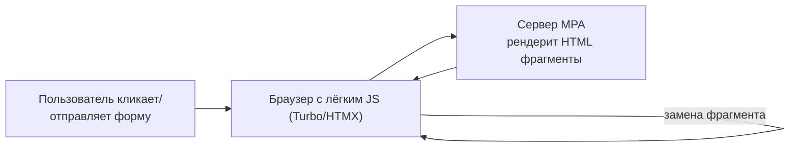
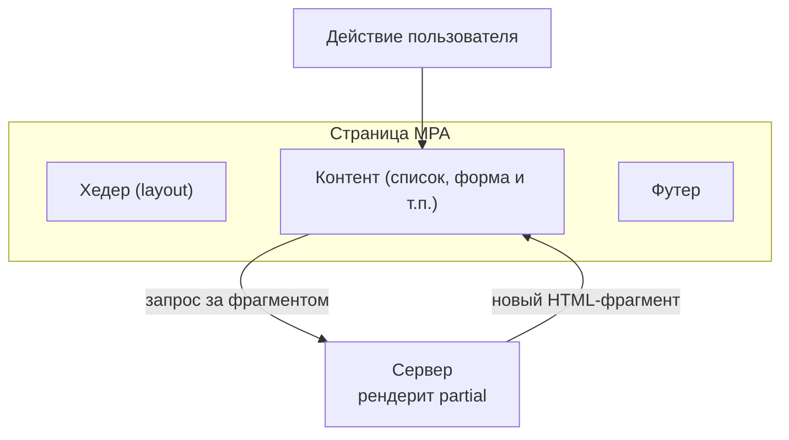

[← Назад к индексу части 21](index.md)

## 21.2. Частичные обновления: Turbo, HTMX и лёгкая интерактивность

### Цель раздела

Показать, как в MPA‑архитектуре **улучшить отзывчивость интерфейса без превращения всего приложения в SPA**: использовать частичные обновления (Turbo, HTMX и аналогичные подходы), обновлять фрагменты страницы, формы и списки, понимать ограничения и архитектурные компромиссы.

### В этом разделе главное

- MPA не означает, что **каждый клик обязан приводить к полной перезагрузке** — можно обновлять только нужные фрагменты страницы.  
- Подходы типа **Turbo/HTMX** позволяют:
  - отправить запрос с минимальным JS;
  - получить от сервера HTML‑фрагмент;
  - **заменить кусок DOM** (контент, таблицу, форму) без полной перезагрузки.  
- Это даёт эффект «почти SPA» там, где **не нужен полный фронтенд‑фреймворк**.  
- Важно держать **логику и шаблоны на сервере** и не дублировать её на клиенте.  
- Чрезмерное использование частичных обновлений без архитектуры может превратить код в «HTML‑спагетти» и усложнить дебаг.

### Термины

- **Частичное обновление (partial page update)** — обновление только части страницы (DOM‑поддерева), а не полного документа.  
- **Turbo (Hotwire)** — набор инструментов (в первую очередь Turbo Drive/Frames), позволяющих перехватывать ссылки/формы и обновлять страницу фрагментами.  
- **HTMX** — библиотека, которая через HTML‑атрибуты (`hx-get`, `hx-target` и т.п.) описывает, как элемент должен подгружать и заменять HTML‑фрагменты с сервера.  
- **Progressive enhancement** — подход, при котором базовый функционал работает **без JS**, а JS только улучшает UX.  
- **Inline partials / partial views** — серверные фрагменты шаблонов, предназначенные для встраивания и переиспользования (листинги, карточки, формы).

### Теория и правила

#### 1) Общая идея частичных обновлений

Схема:



Отличие от полной перезагрузки:

- полный документ не заменяется;  
- сервер всё так же рендерит HTML, но:
  - либо **полную страницу** (которую Turbo подставляет в `body` без полной перезагрузки);
  - либо **фрагмент** (часть шаблона), который вставляется в `target`‑элемент.

#### 2) Turbo (Hotwire): перехват ссылок и форм

Идея Turbo (в контексте Rails, но применима шире):

- JS‑бандл перехватывает клики по ссылкам и отправку форм;  
- вместо классического перехода браузера делает **XHR/fetch** запрос;  
- полученный HTML:
  - либо подменяет `<body>` (навигация без полной перезагрузки);
  - либо подменяет конкретные `<turbo-frame>` элементы.

Пример (сильно упрощённо, псевдо‑HTML):

```html
<turbo-frame id="orders">
  <!-- Список заказов -->
  
    <div class="order">
      #{{ order.id }} — {{ order.status }}
    </div>
  
</turbo-frame>
```

Сервер может вернуть только `<turbo-frame id="orders">...</turbo-frame>`, и Turbo подменит содержимое **без перезагрузки страницы**.

#### 3) HTMX: поведение в атрибутах HTML

HTMX действует похожим образом:

- ты добавляешь атрибуты к HTML‑элементам:

```html
<button
  hx-get="/cart/add?id={{ product.id }}"
  hx-target="#cart-summary"
  hx-swap="outerHTML">
  Добавить в корзину
</button>

<div id="cart-summary">
  {{ render_cart_summary(cart) }}
</div>
```

- при клике:
  - HTMX отправляет GET `/cart/add?id=...`;  
  - сервер меняет корзину и возвращает HTML для `#cart-summary`;  
  - HTMX подменяет содержимое `#cart-summary`.

Преимущества:

- логика отображения по‑прежнему **на сервере** (в шаблонах);  
- на клиенте минимум JS‑кода — поведение конфигурируется атрибутами.

#### 4) Где это особенно полезно

- **Фильтры и сортировки в каталогах**:
  - форма с фильтрами;
  - при изменении — запрос за HTML‑фрагментом списка, замена блока с товарами.  
- **Частичные обновления списков/таблиц**:
  - обновление таблицы заказов, логов, уведомлений;  
  - подгрузка следующих страниц (пагинация «Ещё»).  
- **Формы**:
  - валидация и вывод ошибок без полной перезагрузки;
  - обновление только формы и области с ошибками.

#### 5) Ограничения и риски

- Если каждый фрагмент начинает **выполнять свою логику**, легко прийти к:
  - дублированию серверных шаблонов;
  - непредсказуемым состояниям (частично обновлённые части страницы).  
- Сложнее реализовать **богатое глобальное состояние**:
  - много связанных виджетов на странице — сложнее синхронизировать;  
  - в таких случаях разумно выделять SPA‑островки (см. 21.3).

### Пошагово: как добавить частичные обновления в MPA

1. **Найди точки боли в UX**:
   - где полная перезагрузка выглядит тяжёлой и ломает поток пользователя (например, перезагрузка при изменении одного фильтра).  
2. **Выдели фрагменты для обновления**:
   - список товаров;
   - блок с результатами поиска;
   - панель корзины.  
3. **Сделай эти фрагменты серверными partial‑ами**:
   - например, отдельный шаблон `partials/_product_list.html`;  
   - контроллер умеет рендерить их по запросу.
4. **Выбери инструмент** (Turbo, HTMX или собственный минимальный JS):
   - в простом случае достаточно HTMX‑стиля атрибутов;
   - в Rails‑мире удобно Turbo/Hotwire.  
5. **Определи протокол общения**:
   - URL эндпоинта;
   - формат ответа (HTML‑фрагмент);
   - target‑элемент для замены.  
6. **Проверь деградацию без JS**:
   - при отключённом JS формы/ссылки должны всё ещё работать (пусть и с полной перезагрузкой);
   - это и есть **progressive enhancement**.

### Простыми словами

Частичные обновления — это как **маленький курьер**, который приносит не целую новую книгу, а **одну обновлённую страницу**:

- вместо того чтобы выбрасывать всю книгу (страницу) и печатать заново, типография (сервер) печатает только изменённый лист;  
- ты аккуратно **вклеиваешь его поверх старого** — весь остальной текст остаётся на месте.

Turbo/HTMX — это клей и ножницы, которые помогают **вырезать и вклеивать листы**, не разваливая книгу.

### Картинка в голове



Только блок `C` меняется, `H` и `F` остаются как были.

### Как запомнить

- **MPA + partial updates = «почти SPA» там, где нужно, без полного SPA‑фреймворка.**  
- Turbo/HTMX держат **логику на сервере**, а на клиенте лишь управляют тем, какие фрагменты HTML заменить.  
- Важно не забывать о **progressive enhancement**: базовый функционал работает без JS, JS — только улучшает UX.

### Примеры

#### Пример 1. Фильтр каталога с HTMX

Пользователь выбирает фильтры (цена, категория). При изменении фильтра:

- вместо полной перезагрузки:
  - отправляется XHR‑запрос с параметрами;
  - сервер рендерит partial списка товаров;
  - HTMX подменяет `#product-list`.

#### Пример 2. Обновление корзины в реальном времени

- Кнопка «Добавить в корзину»:
  - отправляет запрос `/cart/add`;  
  - сервер обновляет сессию и рендерит фрагмент `#cart-summary`;  
  - клиент получает новый HTML и заменяет только блок с суммой и количеством позиций.

### Практика / реальные сценарии

- **Корзина интернет‑магазина**:
  - нельзя позволить себе тяжёлый SPA из‑за сроков/команды;
  - частичные обновления корзины и каталога дают хороший UX.  
- **Админка на классическом фреймворке**:
  - таблицы и фильтры работают в MPA‑режиме;
  - часть таблиц обновляется по AJAX/HTMX для более плавной работы.

### Типичные ошибки

- Пытаться через HTMX/Turbo **воссоздать полноценный SPA**, дублируя сложную клиентскую логику и состояние — в таких случаях честный SPA или SSR+Islands могут быть лучше.  
- Перемешивать поведение в произвольных атрибутах так, что **невозможно понять поток данных** (много `hx-`/`data-` атрибутов, разбросанных по разным слоям).  
- Не думать о деградации: без JS ничего не работает или работает совсем иначе.

### Что будет, если…

- …добавить частичные обновления «точечно» без унификации подхода?  
  - Код быстро превратится в **зоопарк маленьких особенных решений**: каждый разработчик будет по‑своему прикручивать AJAX/HTMX, и через время станет сложно понять, где и как что обновляется.  
- …перенести в JS логику, которая уже реализована в серверных шаблонах, «чтобы было интерактивнее»?  
  - Появится **дублирование логики и риск рассинхронизации**: сервер считает одно, клиент — другое; баги будут сложными и дорогими.

### Проверь себя

1. В чём разница между «частичными обновлениями» и «полноценным SPA» с точки зрения архитектуры и разделения ответственности?  
2. Как HTMX/Turbo помогают сохранять server‑rendered подход и при этом улучшать UX?  
3. Как бы ты проверил(а), что MPA‑страница **корректно деградирует без JS**, если в ней есть частичные обновления?

<details><summary>Ответ</summary>

1. При частичных обновлениях сервер **остаётся центром логики и рендера**: он отдаёт HTML‑фрагменты, а клиент лишь подменяет DOM. В SPA логика рендера и состояния в основном на клиенте; сервер отдаёт данные (JSON), а не HTML. Это разные модели ответственности и сложности.  
2. Они:
   - перехватывают действия (клики, отправку форм);
   - отправляют запросы на сервер;
   - принимают готовый HTML и вставляют его в DOM.  
   При этом ты не пишешь много JS‑кода и не делаешь клиент сложнее, чем нужно, — всё главное остаётся на сервере.  
3. Отключить JS в браузере (или использовать плагин) и пройти сценарий: фильтры, отправка форм, навигация. Если **основная функциональность сохраняется** (хотя и с полной перезагрузкой), значит, деградация реализована. Если при отключённом JS форма перестаёт отправляться или критические части пропадают — архитектуру нужно доработать.

</details>

### Запомните

- Частичные обновления — мощный инструмент, чтобы **не прыгать в SPA раньше времени**.  
- Они хороши, пока **центр тяжести остаётся на сервере**, а JS — вспомогательный слой.  
- При сложных сценариях «мини‑SPA внутри MPA» лучше честно оформить это как **SPA‑островок или отдельное SPA‑приложение**.

---
