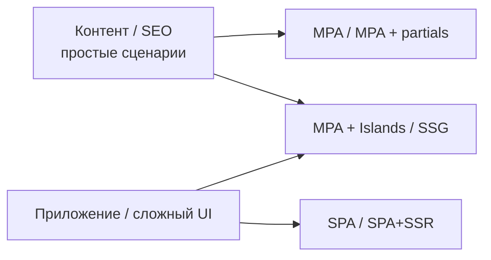
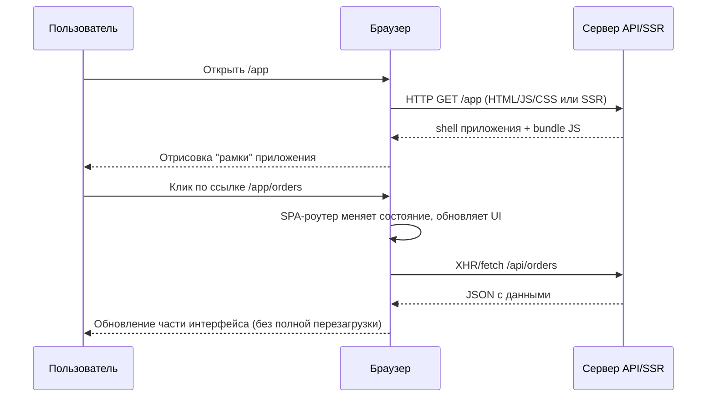
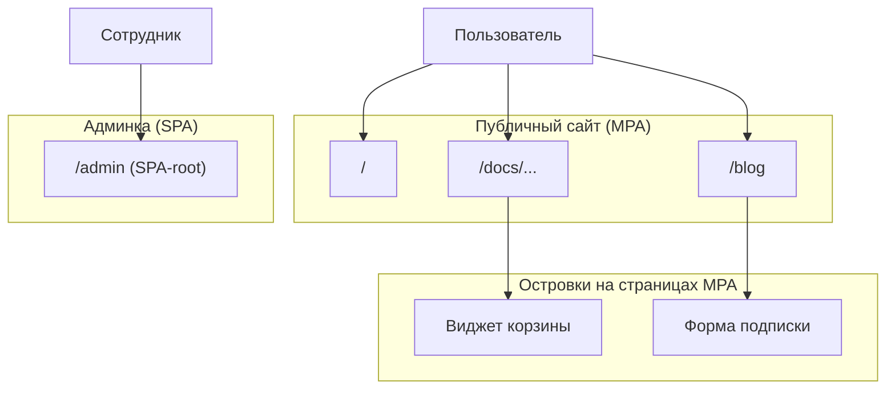

[← Назад к индексу части 21](index.md)

## 21.3. Когда выбирать MPA. Гибриды MPA + SPA + Islands

### Цель раздела

Помочь тебе **осознанно выбирать MPA или другие архитектуры фронтенда** под конкретный продукт, понимать, где MPA — лучший вариант, а где уже нужны SPA/SSR/Islands, и как аккуратно строить гибриды: MPA + SPA‑зоны + островки интерактивности.

### В этом разделе главное

- Нет «одной правильной архитектуры» — есть **соответствие задачи и контекста**.  
- MPA выигрывает там, где:
  - много контента;
  - важен SEO;
  - команда слабее по фронтенду и сильнее по бекенду;
  - ограничен бюджет на сложную инфраструктуру.  
- SPA/SSR/Islands выигрывают там, где:
  - нужна **богатая интерактивность и состояние на клиенте**;
  - есть сложные UI‑процессы (дашборды, realtime‑инструменты).  
- Гибриды (MPA + SPA‑админка, MPA + islands) позволяют **сбалансировать** сложность и возможности.  
- Главная опасность — **хаотичный гибрид без границ**, где неясно, что за что отвечает.

### Термины

- **MPA vs SPA** — сравнение архитектур: многостраничное приложение vs одностраничное.  
- **Hybrid (гибрид)** — архитектура, сочетающая несколько подходов (MPA, SPA, islands, SSR).  
- **Islands** — островки интерактивности на в основном статической/MPA‑странице (подробно — часть 24).  
- **TTI (Time To Interactive)** — время до момента, когда пользователь может **реально взаимодействовать** с интерфейсом.  
- **SEO‑ориентированное приложение** — приложение, где **поисковый трафик и индексация страниц критичны** для бизнеса.

### Теория и правила

#### 1) Простая матрица выбора: оси «контент ↔ приложение» и «SEO ↔ интерактивность»

Представь плоскость:

- по горизонтали — **контент / SEO‑фокус** ↔ **интерактивное приложение**;  
- по вертикали — **простота стека** ↔ **богатые возможности UI**.

Условно:

- Левый верхний угол: **контентные сайты** → MPA / MPA+partials / SSG+MPA.  
- Правый нижний угол: **сложные фронтенд‑приложения** → SPA / SPA+SSR / Islands.  
- Серёдка: **гибриды** — MPA с одним SPA‑разделом (админка), MPA + islands.

Смысл: MPA **естественно живёт** в левой части плоскости, но с частичными обновлениями и островками может смещаться ближе к центру.

#### 1.1) Краткая таблица сравнения MPA и SPA

| Критерий | MPA | SPA |
| --- | --- | --- |
| **Навигация** | Каждая ссылка = полный HTTP‑запрос и новый HTML‑документ. | Навигация перехватывается роутером на клиенте, меняется состояние приложения. |
| **Рендер** | HTML рендерится на сервере; JS дополняет поведение. | Данные приходят как JSON, HTML строится на клиенте (с SSR/SSG — частично на сервере). |
| **Состояние** | Чаще на сервере (сессии, БД); клиент хранит минимум. | Основное состояние в памяти приложения на клиенте (сторы, контексты и т.п.). |
| **SEO по умолчанию** | Хорошее: контент сразу в HTML. | Требуется SSR/пререндер или специальные решения для роботов. |
| **Сложность стека** | Ближе к классическому «бекенд + верстка», проще для бекенд‑ориентированной команды. | Нужен фронтенд‑фреймворк, сборка, роутер, управление состоянием, SSR/SSG при необходимости. |
| **Богатый UI на одном экране** | Возможен, но сложнее; при насыщенном UI часто приходим к islands/SPA‑островкам. | Естественный случай использования: сложные дашборды, канвасы, редакторы. |
| **Поведение без JS** | Базовый сценарий обычно работает (навигация, формы). | Часто почти ничего не работает без JS, если специально не продуман progressive enhancement. |

#### 2) Когда MPA — осознанно лучший выбор

Критерии:

- **Контент‑ориентированное приложение**:
  - документация, блоги, вики, корпоративные сайты;  
  - много текстов, таблиц, статических страниц.  
- **SEO без сложного SSR**:
  - страницы должны индексироваться «как есть»;  
  - нет необходимости в сложных per‑route стратегиях рендера.  
- **Команда и стек**:
  - сильный бекенд, мало фронтенд‑специалистов;  
  - нет ресурса на сложный фронтенд‑build‑pipeline.  
- **Низкие требования к «живому» UX**:
  - нет realtime‑коллаборации;
  - нет сложного dragging/board‑UI;
  - перезагрузка страницы при некоторых действиях допустима.

#### 3) Когда MPA уже не хватает

- **Дашборды и интерактивные инструменты**:
  - множество виджетов на одной странице;
  - постоянные обновления данных;
  - сложные формы, интерактивные таблицы, графики.  
- **Приложения с оффлайн/near‑realtime‑режимом**:
  - мессенджеры;
  - трекеры задач с drag‑and‑drop;  
  - rich‑UI для редактирования документов.  
- **Сложные клиентские workflows**:
  - много шагов на одной странице, быстрое переключение между панелями;
  - UX сильно страдает от полной перезагрузки.

В этих слоях **SPA/SSR/Islands** дают больше возможностей за цену сложности.

##### Жизненный цикл запроса в SPA (для сравнения)

Чтобы закрепить различия, полезно посмотреть на упрощённый жизненный цикл для SPA:

В SPA **оболочка приложения остаётся**, а навигация сводится к смене состояния и запросам за данными; в MPA (см. диаграмму в 21.1) каждый маршрут — новый HTML‑документ.

#### 4) Гибрид: MPA + SPA‑зона (часто админка)

Очень распространённый паттерн:

- публичный сайт — **MPA**:
  - `/`, `/pricing`, `/blog`, `/docs/...`;  
- админка — **SPA**:
  - `/admin/*` — отдельное приложение на React/Vue/Angular/Svelte.  

Плюсы:

- пользователи, приходящие «с улицы», видят быстрый MPA с хорошим SEO;  
- сотрудники/админы получают богатый SPA‑UI, где это действительно окупается.

Главное — **чётко отделить зоны**:

- другая кодовая база или по крайней мере другой entrypoint;  
- отдельный build и деплой для SPA‑админки;  
- понятные архитектурные границы (общие API, общие компоненты по необходимости).

#### 5) MPA + Islands

Островки (подробно в части 24) в контексте MPA:

- страница в целом рендерится сервером (MPA);  
- отдельные **блоки** (корзина, форма, чат‑виджет):
  - инициализируются JS‑фреймворком;
  - живут как мини‑SPA со своим состоянием.  

Это помогает:

- не тянуть весь React/SPA ради одного виджета;  
- локализовать сложность в отдельных зонах.

Важно:

- следить, чтобы **не появилось слишком много островков** на одной странице — иначе выигрыш по сложности и размеру бандла исчезнет;  
- планировать **границы/контракты** между островком и остальной страницей.

#### 6) Антипаттерн: «хаотичный гибрид»

Признаки:

- часть страниц — MPA, часть — SPA, но **никто не знает точно, где что**;  
- нет единой архитектурной схемы, команды «на глаз» подмешивают React/Angular/Vanilla‑виджеты;  
- логика бизнес‑правил **дублируется**:
  - в бекенд‑шаблонах;
  - в JS‑компонентах.  
- SEO и перформанс непредсказуемы, бандл растёт без контроля.

### Пошагово: как выбрать и задокументировать архитектуру фронтенда

1. **Определи тип продукта**:
   - больше контента или больше интерактивных UI‑процессов?  
2. **Оцени требования к SEO и TTI**:
   - нужен ли мощный органический трафик;
   - ок ли небольшая задержка первого рендера.  
3. **Проанализируй команду и стек**:
   - есть ли опыт и ресурс для сложного SPA/SSR;
   - насколько важна скорость вывода фич vs архитектурная сложность.  
4. **Нарисуй архитектурную схему**:
   - какие части — MPA;
   - какие — SPA‑зоны;
   - где островки.  
5. **Зафиксируй решение в ADR**:
   - «Почему MPA для публичного сайта»;
   - «Почему SPA для админки»;
   - «Границы и взаимодействия».  
6. **Регулярно пересматривай решение**:
   - раз в N месяцев смотри: не вырос ли продукт так, что пора менять подход;
   - не появился ли новый инструмент (например, islands/SSR‑фреймворки), который лучше подходит под текущий профиль нагрузки и UX.

### Простыми словами

Выбор между MPA, SPA и гибридами — как **выбор транспортной системы в городе**:

- маленький город с несколькими районами → **автобусы и дороги** (MPA): просто и достаточно;  
- мегаполис с миллионами пассажиров → **метро и развязки** (SPA/SSR): сложнее в строительстве и поддержке, но иначе не вывезти.  
- часто получается гибрид: **автобусы + метро + трамвай** (MPA + SPA + islands).

Главное — **понимать, кто и куда едет**, а не просто строить метро, потому что это «круто».

### Картинка в голове

Эта диаграмма отражает **типичную гибридную архитектуру**: MPA для публичных страниц, SPA‑админка и островки внутри MPA‑страниц.

### Как запомнить

- **Не каждая система должна быть SPA.**  
- MPA хорошо «держит» контент и SEO; SPA отлично тянет сложные интерфейсы.  
- Гибрид — не «хаос», если **границы и роли заранее нарисованы и задокументированы**.

### Примеры

#### Пример 1. Блог + админка

- Публичный блог:
  - статьи, теги, поиск → MPA с server‑rendered HTML;
  - частичные обновления для фильтров/поиска.  
- Админка:
  - редактор статей, медиа‑менеджер, статистика → отдельное SPA.  

#### Пример 2. SaaS‑сервис

- Маркетинговый сайт (`/`, `/pricing`, `/blog`) → MPA/SSG;  
- Продуктовая часть (`/app`) → SPA/SSR;  
- Части маркетингового сайта используют островки (форма регистрации, мини‑дашборд) — islands поверх MPA/SSG.

### Практика / реальные сценарии

- **Компания с существующим MPA‑сайтом**:
  - можно не «переписывать всё на SPA», а:
    - локально добавлять частичные обновления;
    - добавить islands там, где действительно нужна богатая интерактивность;
    - вынести админку в SPA, если она становится слишком сложной.  
- **Новый продукт**:
  - на раннем этапе достаточно MPA + немного JS;
  - по мере роста можно **эволюционировать** фронтенд в SPA/SSR/Islands, не ломая архитектуру.

### Типичные ошибки

- «SPA по умолчанию» без анализа, хотя продукт — контентный сайт.  
- «Всё по чуть‑чуть»: и MPA, и SPA, и islands, и SSR, но **без схемы и объяснения**, где и зачем.  
- Неявные зависимости и дублирование логики между бекендом и фронтендом.

### Что будет, если…

- …построить SPA‑архитектуру там, где достаточно MPA?  
  - Увеличится сложность, появятся требования к SSR/пререндеру для SEO, более тяжёлые бандлы; команда будет тратить ресурсы на инфраструктуру вместо бизнес‑ценности.  
- …оставаться на чистом MPA, когда продукт превращается в сложный интерактивный инструмент?  
  - Пользователи начнут страдать от постоянных полных перезагрузок, медленного отклика и «дубового» UX; конкуренты с modern‑SPA/SSR‑подходом будут выигрывать в удобстве.

### Проверь себя

1. Назови **два сценария**, где MPA явно выигрывает у SPA/SSR, и **два сценария**, где наоборот SPA/SSR выигрывают у MPA.  
2. Как выглядела бы архитектурная схема «MPA + SPA‑админка» для среднего SaaS‑продукта?  
3. Какие **документы и артефакты** (диаграммы, ADR) ты бы создал(а), чтобы зафиксировать принятое решение про MPA/SPA/гибрид?

Ответ

1. MPA выигрывает: (а) документация/блог с критичным SEO, (б) простой корпоративный сайт или портал без сложной интерактивности. SPA/SSR выигрывают: (а) сложный дашборд с большим количеством взаимодействий на одной странице, (б) инструмент с realtime‑обновлениями и оффлайн‑режимом (например, редактор).  
2. Публичная часть: MPA‑страницы (`/`, `/pricing`, `/blog`, `/docs/...`) с server‑rendered HTML и, возможно, частичными обновлениями. Админка: отдельное SPA на `/app` или `/admin`, с собственным build‑проектом и статикой, общим API с бекендом; на диаграмме — две зоны фронтенда, каждая общается с бекенд‑службами.  
3. Минимум: (а) архитектурная диаграмма фронтенда (MPA‑зоны, SPA‑зоны, islands), (б) ADR «Выбор MPA/SPA/SSR для продукта X» с контекстом, вариантом, аргументами «за/против», (в) возможно, таблица сравнения по критериям (SEO, интерактивность, команда, масштабируемость), чтобы новые участники быстро понимали логику решения.

### Запомните

- Выбор между MPA, SPA, SSR и islands — это **архитектурное решение, завязанное на бизнес‑контекст и команду**, а не на моду.  
- Гибридные решения мощны, если **их границы и роли чётко обозначены**.  
- Часть 21 — фундамент: дальше в частях 22–24 мы будем рассматривать SPA, SSR/SSG/ISR и islands как продолжение этой оси решений.

---
