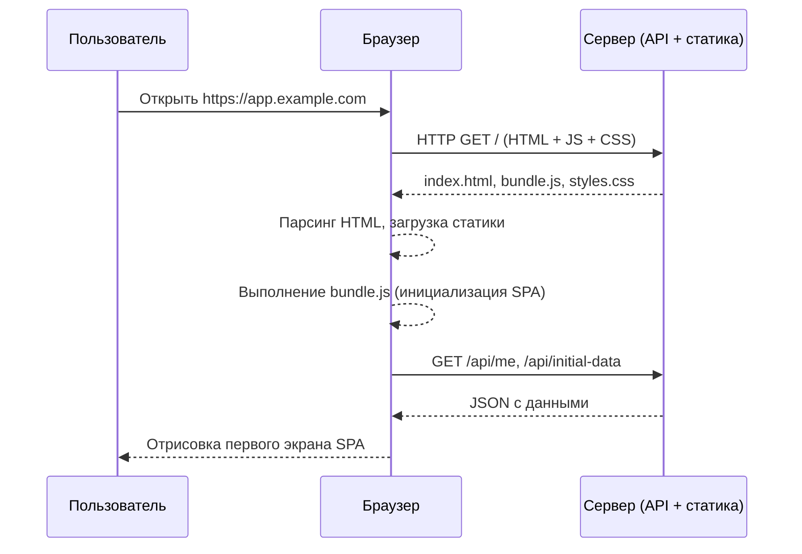
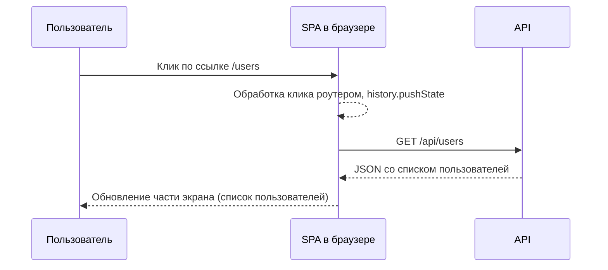
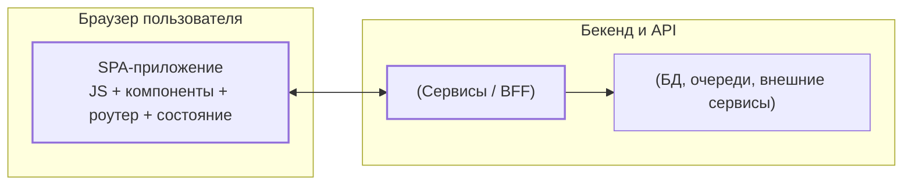
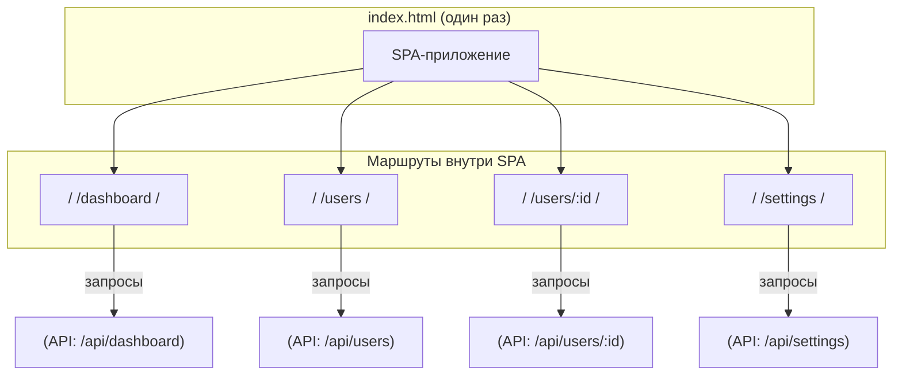

[← Назад к индексу части 22](index.md)

## 22.1. SPA: как устроено одностраничное приложение

### Цель раздела

Сформировать у тебя **интуитивное и техническое понимание**, что такое SPA: от первого запроса до ежедневной работы пользователя, как устроены один HTML, клиентский роутер, загрузка данных и состояние, и чем такая модель принципиально отличается от MPA и SSR.

### В этом разделе главное

- SPA — это архитектура, где **сервер отдаёт один базовый HTML**, а всё приложение живёт в браузере: рендер, роутинг, часть валидаций и логики.  
- Роутинг и состояние находятся **на клиенте**, а сервер чаще всего предоставляет **API (REST/GraphQL)**, а не HTML‑страницы.  
- Навигация по приложениям SPA происходит **без полной перезагрузки документа**: меняются только компоненты/виды и данные.  
- SPA естественны для **богатых интерактивных приложений** (админки, дашборды, сложные инструменты), но требуют осторожности в производительности и SEO.  
- Важно различать **архитектуру (SPA как стиль)** и **конкретный фреймворк (React/Vue/Angular)** — фреймворки лишь реализуют идеи SPA.

### Термины

- **SPA (Single‑Page Application)** — приложение, в котором **один HTML‑документ** служит «контейнером», а все основные экраны рендерятся **на клиенте** в JS.
- **CSR (Client‑Side Rendering)** — рендеринг интерфейса **в браузере** с использованием JS‑фреймворков/библиотек.
- **Клиентский роутер** — слой, который сопоставляет **URL → набор компонентов/экрана** внутри SPA, перехватывая навигацию (history API).
- **View/экран** — логически цельное представление (страница списка, карточка сущности, дашборд), реализованное как дерево компонентов.
- **State/состояние** — данные, от которых зависит рендер (фильтры, текущий пользователь, кэшированные ответы API и т.п.).
- **API‑слой** — часть кода SPA, которая отвечает за общение с сервером (fetch/Axios/GraphQL‑клиенты).

#### Виды состояния в SPA (для ориентира)

- **Локальное состояние компонента** — то, что касается только одного компонента или небольшой поддеревья (открыт ли модал, введённый текст в поле, выделенная строка).  
- **Глобальное UI‑состояние** — состояние, влияющее на несколько экранов/областей (выбранная организация, текущая тема, права пользователя).  
- **Серверное состояние** — кэш ответов API (список заказов, детали пользователя), которое:
  - живёт в клиенте (в памяти/кэше библиотеки),
  - но «истиной» остаётся сервер.  

Эти виды состояния будут подробнее разбираться в частях про **состояние фронтенда** (часть 26), здесь важно лишь видеть, что SPA вынуждено **управлять несколькими типами состояния одновременно**, что усиливает требования к архитектуре.

### Теория и правила

#### 1) Жизненный цикл первого запуска SPA

Высокоуровнево:

Ключевые моменты:

1. Сервер отдаёт **один HTML** (часто минимальный): `

` + ссылки на JS/CSS.  
2. Браузер загружает и выполняет JS‑бандл, который:
   - инициализирует фреймворк (React/Vue/Angular/...),
   - регистрирует роуты (`/dashboard`, `/users/:id` и т.п.),
   - настраивает состояние (store, кэш данных),
   - запускает первый рендер.  
3. Для получения данных SPA вызывает **API‑эндпоинты**, получает JSON и подставляет его в компоненты.  
4. После этого приложение становится **интерактивным**: клики, ввод данных, переходы по ссылкам обрабатываются JS‑кодом.

#### 2) Навигация внутри SPA

После первого запуска дальнейшие переходы выглядят иначе, чем в MPA:

Браузер **не запрашивает новый HTML‑документ**:

- изменяется URL через history API;
- роутер активирует новый набор компонентов;
- при необходимости приложение запрашивает данные у API;
- SPA обновляет DOM только там, где нужно (виртуальный DOM или другая система).

#### 3) SPA в архитектурной картине

Если упростить, архитектура выглядит так:

Здесь важно:

- **SPA живёт в браузере**, но плотно связана с архитектурой бекенда: API‑контракты, аутентификация, кэширование, согласованность данных.  
- Часто между SPA и «большим бекендом» вставляется **BFF (Backend For Frontend)** — отдельный сервис, который специально адаптирует API под нужды SPA.

#### 4) Отличия SPA от MPA и SSR

- **MPA**:
  - каждый URL → новый HTML с сервера;
  - состояние чаще живёт на сервере (сессии);
  - навигация → полная перезагрузка.  
- **SPA (чистый CSR)**:
  - один HTML → всё остальное рисует клиент;
  - состояние в памяти браузера (и частично в localStorage/sessionStorage);
  - навигация → без полной перезагрузки, через клиентский роутер.  
- **SSR/SSG/Islands**:
  - часть/весь HTML рендерится на сервере;
  - потом происходит гидрация (оживление JS);
  - навигация может быть гибридной (частичная перезагрузка, islands, mix CSR/SSR).

#### 5) Фреймворки для SPA: React, Vue, Angular, Svelte (очень коротко)

С архитектурной точки зрения все популярные фреймворки реализуют **одни и те же идеи SPA**, но с разными компромиссами:

| Фреймворк | Интуиция | Плюсы | Ограничения / особенности |
| --- | --- | --- | --- |
| **React** | «Конструктор из компонентов» + декларативный рендер | Огромная экосистема, много вариантов роутеров и state‑менеджмента, богатый опыт в индустрии | Много свободы → легко сделать архитектурный хаос; нужно самим выбирать стек (роутер, состояние, сборщик) |
| **Vue** | Реактивность «из коробки», шаблоны ближе к HTML | Быстрый порог входа, понятный синтаксис, официальная экосистема (Vue Router, Pinia, Nuxt) | Меньше «боевого опыта» под экстремальные нагрузки, чем у React, но этого чаще всего достаточно |
| **Angular** | «Фреймворк‑платформа» с жёстким мнением | Многое решено за тебя (модули, DI, роутинг, формы), удобно для больших корпоративных команд | Более тяжёлый порог входа, крупные бандлы, жёсткие рамки по структуре проекта |
| **Svelte** | Компилируемый фреймворк: меньше рантайма, больше компиляции | Небольшие бандлы, простая модель состояния, приятный DX | Экосистема меньше и моложе, чем у React/Vue, сложнее найти специалистов |

Важно: **архитектурные решения о том, где живёт SPA, как устроены API, как разделён код по маршрутам, одинаково важны для любого из этих фреймворков**. Инструмент меняется, архитектурные принципы остаются.

### Пошагово: как думать о SPA как архитектор

1. **Определи доминирующий сценарий**: контент или приложение?
   - если это **инструмент, дашборд, админка, сложное взаимодействие** → SPA/гибриды будут естественными;
   - если это **контентный сайт, блог, документация** → SPA часто избыточен.
2. **Нарисуй границу SPA**:
   - где именно живёт SPA (отдельный домен/поддомен, путь `/app` внутри MPA‑сайта и т.п.);
   - где заканчивается SPA и начинается MPA/SSR или другие зоны.  
3. **Определись с API**:
   - какие ресурсы нужны SPA;
   - какие endpoints будут использоваться для каждого экрана;
   - где будет жить BFF (если нужен).  
4. **Продумай маршрутизацию**:
   - какие маршруты есть в приложении (`/dashboard`, `/orders/:id`, `/settings`);
   - какие данные нужны для каждого маршрута (data loading);
   - нужно ли отличать public/private маршруты (аутентификация).  
5. **Подумай о производительности и SEO**:
   - насколько критично **время первого контента (FCP)** и **TTI**;
   - нужны ли **SEO и индексируемый контент**;
   - нужен ли пререндер/SSR или можно жить на чистом SPA.

### Простыми словами

Представь, что сайт — это **книга**, а SPA — это **приложение‑панель управления**.

- В книге (MPA) ты **перелистываешь страницы**: каждая страница напечатана заранее, и при перелистывании ты получаешь готовый лист с текстом.  
- В панели управления (SPA) у тебя **одна панель**, внутри которой **переключаются вкладки и блоки**:
  - рано или поздно нужно загрузить **всю логику этой панели** (какие вкладки бывают, какие кнопки, какая логика);
  - дальше ты быстро переключаешься между вкладками, не покупая новую панель каждый раз.  

SPA — это **интерактивный инструмент внутри браузера**:

- сначала ты грузишь сам инструмент (код, логику, шаблоны);
- потом он сам ходит к «серверу» за данными и рисует нужные экраны;
- браузер становится платформой для приложения, а HTML страницы — просто контейнером для него.

### Картинка в голове

Простейшая визуализация:

Ты видишь:

- **один HTML**, внутри которого живёт `App`;
- множество **внутренних маршрутов**, каждый из которых может ходить к своим API;
- переход между маршрутами **не приводит к загрузке нового `index.html`**.

### Как запомнить

- **MPA** — «**много страниц**»: каждый маршрут = новая страница с сервера.  
- **SPA** — «**одно приложение**»: один HTML, а всё остальное — переключение экранов внутри приложения в браузере.  
- **API вместо страниц**: сервер отдаёт **данные**, а не HTML‑страницы.

### Примеры

1. **Админка электронной коммерции**
   - Маршруты: `/dashboard`, `/orders`, `/orders/:id`, `/products`, `/customers`, `/settings`.  
   - Пользователь:
     - быстро переключается между разделами;
     - фильтрует списки;
     - открывает и редактирует сущности без перезагрузки страницы.  
   - Архитектура:
     - SPA на React/Vue/Angular;
     - API (REST/GraphQL) с ресурсами `orders`, `products`, `users`;
     - возможно, BFF для адаптации данных под нужды фронта.

2. **Сложный SaaS‑инструмент**
   - Приложение типа «канбан‑доска», редактор документации, визуальный конструктор.  
   - Пользователь:
     - работает часами в одном окне;
     - ожидает отзывчивости, drag‑and‑drop, живых обновлений.  
   - SPA даёт:
     - богатую интерактивность;
     - возможность держать в памяти сложное состояние (фильтры, выделения, черновики).

### Практика / реальные сценарии

- **Хорошие сценарии для SPA**:
  - админки, внутренние CRM, BI‑дашборды;
  - инструменты для работы (редакторы, конструкторы, IDE в браузере);
  - сложные интерфейсы с множеством взаимосвязанных панелей и виджетов.  
- **Сомнительные сценарии для чистого SPA**:
  - маркетинговые лендинги и промо‑страницы;
  - чисто контентные сайты без сложного взаимодействия;
  - документация, блоги, новостные сайты.

Во многих продуктах встречается **гибрид**:

- публичная часть — MPA/SSR/SSG;
- зона `/app` — SPA‑приложение (админка, личный кабинет).

### Типичные ошибки

- Выбор **SPA «по умолчанию»** для любого сайта, включая простые лендинги.  
- Игнорирование **границ SPA**: всё приложение сайта становится одним монолитным SPA без выделенной зоны.  
- Смешивание SPA и MPA без чёткого понимания, **кто за что отвечает** (часть логики и маршрутов в MPA, часть в SPA).  
- Ожидание, что SPA «сам по себе» решит проблемы UX и производительности: на практике SPA **легко сделать медленным**.  
- Отсутствие стратегии работы при **отсутствии JS или ошибке загрузки бандла** (white screen of death) и **невнимание к доступности (a11y)**: неработающие ссылки/кнопки без JS, отсутствие `aria`‑атрибутов, ломанный фокус‑менеджмент.

### Что будет, если…

- **Если сделать весь проект SPA, хотя 90% страниц — контентные**:
  - увеличится время загрузки для всех пользователей;
  - усложнится фронтенд‑стек и билды;
  - SEO станет сложнее, потребуется пререндер/SSR;
  - команда будет тратить силы на то, что могло быть MPA/SSG.  
- **Если не продумать API‑слой под SPA**:
  - экрану могут понадобиться данные сразу из многих сервисов;
  - фронтенд начнёт собирать их из десятка эндпоинтов;
  - вы получите сложный, чательно латанный код и медленные экраны.  
- **Если хранить слишком много состояния только в памяти SPA**:
  - при обновлении вкладки пользователю придётся всё настраивать заново;
  - трудно будет восстанавливать состояние после ошибок;
  - сложнее будет делать deep links и совместную работу.

### Проверь себя

1. Опиши **разницу в навигации** между MPA и SPA при переходе с «Список заказов» на «Карточку заказа».  
2. Назови **минимум три элемента**, которые отличают архитектуру SPA от классического MPA.  
3. Придумай пример, когда SPA **точно оправдан**, и пример, когда SPA будет **явно лишней сложностью**.

Ответ

1. В MPA клик по ссылке ведёт к полной перезагрузке: браузер запрашивает новый HTML `/orders/42`, сервер рендерит страницу, браузер пересоздаёт DOM. В SPA клик перехватывает роутер: меняется URL (history.pushState), SPA подгружает данные `/api/orders/42`, обновляет только нужную часть экрана без перезагрузки `index.html`.  
2. Отличия:
   - **один HTML** вместо множества отдельных страниц;
   - **роутинг и рендер на клиенте**, а не на сервере;
   - сервер отдаёт **данные (JSON)**, а не готовый HTML для большинства действий.  
3. Оправдан: админка с большим количеством интерактивных таблиц, фильтров, форм и взаимосвязанных панелей. Лишняя сложность: одностраничный промо‑лендинг для маркетинговой кампании, где главное — быстрый первый экран и индексируемый контент.

#### Дополнительные вопросы по разделу 22.1

1. Как изменятся требования к **обработке ошибок** на фронтенде, когда ты переходишь от MPA к SPA (валидация форм, сетевые ошибки, истечение сессии)?  
2. Представь, что продукт растёт: какие архитектурные сигналы подскажут, что текущая SPA начинает превращаться в «болото» (hint: связанные компоненты, глобальное состояние, API‑слой)?  
3. Как бы ты объяснил(а) идею **BFF** разработчику, который привык к «фронт ходит во все микросервисы напрямую»?

Ответ

1. В MPA часто можно полагаться на серверные редиректы/сообщения, а при ошибке просто показать новую страницу. В SPA:
   - нужно явно обрабатывать сетевые ошибки и показывать пользователю понятные статусы;
   - перехватывать истечение сессии (401/403) и переводить пользователя в логин/refresh;
   - не допускать «тихих» сбоев, когда часть интерфейса не работает, но экран «вроде загружен».  
2. Сигналы:
   - почти всё состояние живёт в одном/двух глобальных сторах без чётких границ;
   - компоненты сильно связаны и знают слишком много друг о друге;
   - API‑вызовы размазаны по компонентам, а не собраны в понятный слой;
   - становится трудно добавить новый экран, не трогая десяток существующих.  
3. BFF — это «прокси‑бекенд для фронта», который:
   - прячет за собой множество сервисов;
   - отдаёт фронту ровно те данные и в таком формате, который ему удобен;
   - позволяет менять внутреннюю микросервисную архитектуру, не ломая SPA.

### Запомните

- SPA — это **одностраничное приложение в браузере**, которое:
  - загружается один раз как HTML + JS + CSS;
  - управляет навигацией и состоянием на клиенте;
  - общается с сервером в основном через **API**.  
- SPA сильна там, где интерфейс — это **богатый инструмент** с множеством взаимосвязанных экранов и действий.  
- Важно **отделять архитектуру SPA** от конкретной реализации на React/Vue/Angular — фреймворки приходят и уходят, а архитектурные решения остаются.

---
