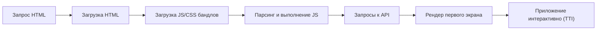
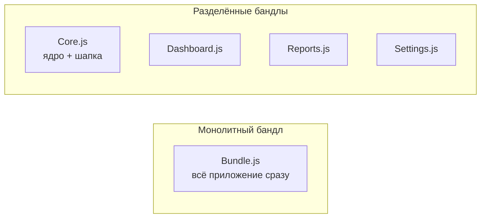

[← Назад к индексу части 22](index.md)

## 22.2. Производительность SPA: бандлы, TTI и код‑сплиттинг

### Цель раздела

Показать, **почему SPA часто упирается в производительность**, какие этапы влияют на скорость (от загрузки бандла до TTI), и как архитектор должен мыслить о **код‑сплиттинге, lazy‑loading, prefetch и критическом пути рендера**, чтобы SPA не превращалась в «белый экран на 10 секунд».

### В этом разделе главное

- Производительность SPA — это **не только «оптимизировать пару компонентов»**, а цепочка из: загрузка ресурсов → разбор и выполнение JS → загрузка данных → первый полезный рендер.  
- Главный враг SPA — **слишком большой и неструктурированный бандл**.  
- Архитектурный инструмент борьбы — **код‑сплиттинг и lazy‑loading** по маршрутам и крупным фичам.  
- Важно оптимизировать **критический путь**: чтобы пользователь увидел полезный интерфейс и смог начать взаимодействовать как можно раньше.  
- Архитектура API и BFF напрямую влияет на TTI: **слишком много последовательных запросов** или лишних данных замедляют всё приложение.

### Термины

- **FCP (First Contentful Paint)** — момент, когда пользователь видит **первый содержательный контент** (текст, картинки), а не пустой экран.
- **TTI (Time To Interactive)** — момент, когда страница **становится стабильно интерактивной** (обработчики событий готовы, основной JS выполнен).
- **Bundle splitting / code splitting** — разбивка кода на **несколько бандлов**, которые загружаются по мере необходимости.
- **Lazy‑loading** — отложенная загрузка модулей/компонентов **только при необходимости** (например, при открытии маршрута).
- **Prefetch** — **загрузка ресурсов заранее**, до того как пользователь явно перейдёт на маршрут.

### Теория и правила

#### 1) Критический путь SPA

Упрощённо:

На каждом шаге можно:

- либо **ускориться** (оптимизация размеров, параллельность запросов),
- либо **создать узкое место** (огромный бандл, последовательные API‑вызовы).

#### 2) Где часто ломают SPA

- **Огромный начальный бандл**:
  - все маршруты и компоненты в одном JS‑файле;
  - много сторонних библиотек (UI‑киты, графики, дата‑пикеры и т.п.), даже если они нужны редко.  
- **Последовательные запросы**:
  - сначала /api/me → потом /api/permissions → потом /api/sidebar → потом /api/page‑data — и всё это последовательно;  
- **Перерисовка всего дерева** при каждом изменении состояния вместо локализованного обновления.

#### 3) Архитектурные правила для производительности SPA

1. **Разделяй по маршрутам**:
   - каждый крупный маршрут (`/dashboard`, `/reports`, `/settings`) должен быть **отдельным бандлом**;
   - стартовый маршрут должен загружать **минимально необходимый код**.  
2. **Разделяй тяжёлые виджеты**:
   - графики, визуальные редакторы, сложные таблицы → отдельные lazy‑модули;
   - подгружай их, когда пользователь доходит до соответствующей зоны.  
3. **Оптимизируй API‑взаимодействие**:
   - параллельность запросов, использование BFF для агрегации данных;
   - минимум отдельных запросов при первом рендере экрана.  
4. **Думай о «скелетном экране»**:
   - пользователь должен **быстро увидеть структуру интерфейса** (шапка, меню, skeleton‑карточки);
   - данные могут подгружаться чуть позже.

### Пошагово: как подойти к производительности SPA

1. **Нарисуй карты маршрутов и фич**:
   - какие разделы есть, какие фичи внутри;
   - какие из них критичны для первого запуска.  
2. **Спроектируй бандлы**:
   - один минимальный базовый бандл + отдельные бандлы по крупным маршрутам/фичам;
   - избегай «один бандл на всё приложение».  
3. **Определи данные для первого экрана**:
   - какие данные действительно нужны, чтобы показать первый полезный экран;
   - какие можно дозагружать после.  
4. **Выбери стратегию загрузки данных**:
   - загрузка до рендера (blocking) или после рендера (non‑blocking);
   - prefetch данных для вероятных маршрутов.  
5. **Согласуй архитектуру API**:
   - BFF‑слой может отдавать «сжатый» ответ, пригодный сразу для первого экрана;
   - избежи ситуации «экран зависит от 5 разных микросервисов напрямую».

#### 6) Граничные случаи: SPA с «data loaders» (почти SSR)

Иногда SPA начинает **загружать данные «как SSR»** — по каждому маршруту есть отдельный «loader», который:

- вызывается при переходе на маршрут;
- ходит на сервер за данными;
- возвращает готовый набор данных для рендера конкретного экрана.

Это сближает SPA с SSR‑подходом по **модели мышления**:

- каждый маршрут мыслится как **функция от запроса к данным** (`route → load → render`);
- данные для маршрута описаны централизованно, а не размазаны по компонентам.

Но важно помнить:

- при чистом CSR рендер всё равно происходит **в браузере**, даже если у тебя есть «data loaders»;
- с архитектурной точки зрения это **всё ещё SPA**, просто с более структурированным доступом к данным;
- если требования по SEO/первому контенту ужесточаются, такой подход облегчает миграцию к **SSR/SSG** (часть 23), потому что у тебя уже есть явные функции «маршрут → данные».

### Простыми словами

Подумай о SPA как о **толстой настольной программе, запущенной в браузере**:

- если при запуске программы ты грузишь **все возможные модули, плагины и отчёты**, она стартует очень долго;
- если ты загружаешь **ядро + минимум** для первого окна, а остальное по мере использования, — старт быстрый, а потом модульно подгружается функциональность.

С SPA то же самое:

- либо ты загружаешь всё приложение сразу (один огромный бандл) → медленный старт;
- либо загружаешь ядро и текущий маршрут, а остальное — по мере надобности → быстрый старт и хорошая масштабируемость.

### Картинка в голове

Сравнение двух подходов:

В плохом варианте пользователю приходится **ожидать загрузки B1**, даже если он зашёл только в «Dashboard» и никогда не увидит «Reports» или «Settings».

### Как запомнить

- **«Меньше — значит быстрее»**: чем меньше кода нужно для старта, тем лучше.  
- Разделяй код **по маршрутам и тяжёлым фичам**, а не по техническим слоям типа «все редьюсеры», «все компоненты».  
- Продумывай **первый экран как продукт**: что нужно увидеть и сделать в первые секунды.

### Примеры

1. **Админка без код‑сплиттинга**
   - Одно приложение React, все маршруты в одном бандле.  
   - Результат:
     - 2–3 МБ JS на старте;
     - на медленных сетях пользователь видит белый экран долго;
     - TTI сильно страдает.  
2. **Админка с код‑сплиттингом**
   - Базовый бандл + отдельные чанки по маршрутам:
     - `dashboard.chunk.js`
     - `users.chunk.js`
     - `reports.chunk.js`  
   - При заходе в `/dashboard` грузится только ядро + `dashboard.chunk.js`.  
   - Остальные маршруты подгружаются при первом посещении.

### Практика / реальные сценарии

- В реальных проектах часто приходится:
  - **перепиливать старое SPA**, где всё в одном бандле;
  - вводить **route‑based code splitting** (React.lazy, dynamic imports и аналоги);
  - перекраивать API, чтобы первый экран не ждал десяток последовательных запросов.  
- Архитектор должен:
  - задать **принципы разбивки** (по маршрутам/доменам/фичам);
  - контролировать, чтобы новые фичи **не ломали критический путь** (не тянули тяжёлые библиотеки в базовый бандл).

### Типичные ошибки

- «Давайте сначала всё сделаем, а оптимизацию потом» → в продакшене гигантский бандл, который тяжело «резать».  
- Непродуманное подключение тяжёлых UI‑библиотек/графиков **везде**, хотя они нужны в паре мест.  
- Отсутствие **метрик**: команда не измеряет TTI, размер бандла, количество запросов на первый экран.  
- Попытка «починить» проблему только на уровне кода компонентов, игнорируя архитектуру бандлов и API.

### Что будет, если…

- **Если игнорировать размер бандла**:
  - на десктопах в офисе всё может казаться приемлемым;
  - на мобильных сетях приложение станет почти непригодным;
  - пользователи будут покидать страницу до загрузки.  
- **Если строить API без учёта SPA**:
  - SPA придётся делать много мелких запросов;
  - latencies будут суммироваться;
  - для первого экрана может потребоваться 5–7 round‑trip’ов.  
- **Если не продумать lazy‑loading тяжёлых фич**:
  - даже если пользователю не нужна сложная аналитика, он всё равно будет за неё «платить» временем загрузки.

### Проверь себя

1. Объясни, почему **один огромный бандл** — это архитектурная проблема, а не просто «неудачный билд».  
2. Придумай, как можно **разбить SPA админку** на логические бандлы.  
3. Как BFF может помочь **улучшить TTI** для первого экрана?

Ответ

1. Огромный бандл:
   - вынуждает всех пользователей загружать весь код, даже неиспользуемые части;
   - усложняет эволюцию (любое изменение трогает весь артефакт);
   - ухудшает TTI и UX. Это следствие **архитектурных решений о структуре приложения**, а не просто «плохая сборка».  
2. Разбивка:
   - `core` (layout, шапка, авторизация);
   - `dashboard`, `users`, `orders`, `reports`, `settings` — по маршрутам/доменам;
   - отдельные lazy‑чанки для тяжёлых графиков/редакторов.  
3. BFF может:
   - агрегировать данные из нескольких сервисов в **один оптимизированный ответ** для первого экрана;
   - уменьшить количество round‑trip’ов;
   - вернуть ровно те данные и в таком виде, который удобен для быстрого рендера SPA.

#### Дополнительные вопросы по разделу 22.2

1. Как ты будешь решать, **какие части кода** должны попасть в базовый бандл, а какие — в lazy‑чанки?  
2. Какие компромиссы появляются, если попытаться сделать бандлы **слишком мелкими** (каждый маленький компонент — отдельный чанк)?  
3. Как архитектура API (REST vs GraphQL, наличие BFF) влияет на количество запросов и, следовательно, на TTI?

Ответ

1. В базовый бандл попадает:
   - layout, навигация, аутентификация;
   - самый первый маршрут и всё, что нужно, чтобы он работал;
   - общие утилиты и минимальная часть дизайна.  
   Всё, что относится к отдельным разделам/редким фичам, — кандидаты для lazy‑чанков.  
2. Слишком мелкие чанки приводят к:
   - росту количества сетевых запросов;
   - накладным расходам на загрузку/инициализацию даже маленьких модулей;
   - усложнению reasoning’а (сложно понять, что где грузится).  
   Обычно разумно дробить по маршрутам/фичам, а не по каждому атомарному компоненту.  
3. GraphQL и BFF позволяют:
   - собирать данные для экрана в один запрос;
   - уменьшить количество round‑trip’ов;
   - передавать только нужные поля.  
   «Голый» REST без BFF, множество микросервисов и отсутствие агрегации → множество последовательных запросов, рост TTI.

### Запомните

- Производительность SPA — это **архитектурный вопрос**: как ты структурируешь код и данные.  
- Главные рычаги: **код‑сплиттинг, lazy‑loading, оптимизированное API и skeleton‑экраны**.  
- Измеряй и проектируй: без метрик (TTI, размер бандла) разговоры о «быстром SPA» — самообман.

---
