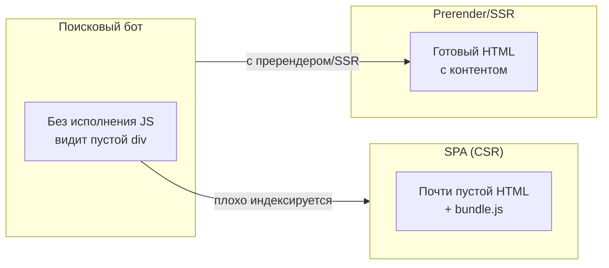

[← Назад к индексу части 22](index.md)

## 22.3. SPA и SEO: пререндер, SSR и ограничения

### Цель раздела

Разобраться, **как SPA живёт в мире поисковых систем и социальных сетей**: когда достаточно пререндера для ботов, когда нужен полноценный SSR/SSG, какие существуют ограничения у чистых SPA и какие архитектурные решения помогают «подружить» SPA с SEO.

### В этом разделе главное

- Классический SPA (чистый CSR) **плохо дружит с SEO**: роботы видят пустой или минимальный HTML без контента.  
- Есть три основных подхода: **чистый CSR + пререндер**, **SSR**, **SSG/ISR** — каждый со своими trade‑off’ами.  
- Пререндер может быть достаточен для **простого контента и ограниченного набора страниц**, но не заменяет полноценный SSR для персонализированных или часто меняющихся страниц.  
- Архитектор должен **отдельно продумывать SEO‑контур**: canonical URL, мета‑теги, Open Graph, карты сайта, поведение ботов.

### Термины

- **SEO (Search Engine Optimization)** — практики, помогающие поисковым системам корректно индексировать и ранжировать сайт.
- **Crawler / бот** — программа поисковой системы, которая обходит и анализирует страницы.
- **Пререндер (prerendering)** — генерация HTML заранее (на этапе билда или отдельным сервисом), чтобы боты видели готовый контент.
- **SSR (Server‑Side Rendering)** — рендер HTML **на сервере на каждый запрос** (или почти на каждый).
- **SSG (Static Site Generation)** — генерация HTML **на этапе билда** для всего набора страниц.
- **ISR (Incremental Static Regeneration)** — пересборка отдельных страниц по мере необходимости (гибрид SSR и SSG).

### Теория и правила

#### 1) Как боты видят классический SPA

Если у тебя чистый CSR:

- сервер отдаёт HTML вроде:
  ```html
  <html>
    <head>
      <title>My SPA</title>
    </head>
    <body>
      <div id="app"></div>
      <script src="/bundle.js"></script>
    </body>
  </html>
  ```  
- без исполнения JS бот видит **пустой `div` без контента**;
- современные поисковики умеют исполнять JS, но:
  - это **дорого** для них;
  - результат может быть **нестабилен**;
  - есть задержки и ограничения.

#### 2) Подходы к совместимости SPA и SEO

1. **Чистый CSR + пререндер**:
   - используешь сервисы типа Prerender.io или свой рендерер;
   - для ботов отдаётся **готовый HTML** (предварительно отрендеренный SPA);
   - для обычных пользователей SPA работает как CSR.  
2. **SSR**:
   - SPA‑фреймворк используется на сервере (Next.js, Nuxt, Angular Universal и т.п.);
   - каждый запрос (или часть запросов) рендерится на сервере, возвращая готовый HTML;
   - затем происходит гидрация и приложение продолжает работать как SPA.  
3. **SSG/ISR**:
   - статическая генерация страниц на этапе билда;
   - для часто обновляемых страниц — инкрементальная пересборка;
   - под капотом тоже обычно SPA‑фреймворк, но с другим режимом.

### Пошагово: как думать о SEO для SPA

1. **Определи, насколько SEO критичен**:
   - нужно ли, чтобы **каждый маршрут** был индексирован (например, товары в магазине, статьи в блоге);
   - достаточно ли индексировать только «лендинги» и несколько ключевых страниц.  
2. **Разбей страницы по типам**:
   - публичные контентные (нужен полноценный HTML для ботов);
   - личный кабинет/админка (SEO не важен).  
3. **Выбери стратегию**:
   - для зоны, где SEO важен:
     - SSR/SSG/ISR или MPA;
     - либо CSR + пререндер для ограниченного набора страниц.  
   - для зоны, где SEO не важен:
     - чистый SPA (CSR) без пререндера.  
4. **Продумай технические детали**:
   - мета‑теги, Open Graph, canonical URL;
   - как бот будет находить страницы (sitemap, ссылки).

### Простыми словами

Представь, что SPA — это **вывеска на двери офиса**, а SEO — это «как курьер или гость найдёт тебя по адресу».

- Если на двери только надпись «App», а всё содержимое внутри рисует JS, то **гость без ключа (JS)** не поймёт, что внутри и что там делать.  
- Пререндер/SSR — это как **вывесить план этажа и список комнат** на двери: даже если внутрь ещё не зашли, уже видно, что там за компания и что внутри.

### Картинка в голове



### Как запомнить

- Чистый SPA (CSR) **сам по себе** — не про SEO, а про UX.  
- Для SEO почти всегда нужен **дополнительный слой**: пререндер, SSR, SSG/ISR или отдельные MPA‑страницы.  
- **Не пытайся решить SEO «потом»**: очень больно перепиливать архитектуру с чистого SPA на SSR.

### Примеры

1. **SaaS с публичным лендингом и SPA‑кабинетом**
   - Публичный лендинг: SSR/SSG/MPA с хорошим SEO.  
   - Личный кабинет `/app`: SPA (SEO не важен).  
   - Иногда — единый монорепозиторий, но **две архитектуры фронта**.  
2. **Интернет‑магазин**
   - Каталог и страницы товаров: важно, чтобы каждая страница была индексируема.  
   - Корзина/процесс оформления: SEO не важен.  
   - Решение:
     - SSR/SSG/Islands для каталога/товаров;
     - SPA‑подход внутри корзины/checkout‑страниц.

### Практика / реальные сценарии

- Частый кейс: «Мы сделали SPA на React, а потом поняли, что нам нужен SEO → начинаем добавлять SSR».  
  - Это почти всегда больнее, чем спроектировать архитектуру заранее.  
- В некоторых случаях достаточно:
  - оставить SPA в зоне `/app`;
  - сделать MPA/SSR‑лендинги с пререндером для публичной части.

### Типичные ошибки

- Строить **весь сайт как SPA** и надеяться, что поисковики «как‑нибудь справятся».  
- Делать пререндер «на коленке» без контроля актуальности и без учёта всех важных маршрутов.  
- Пытаться **унифицировать всё под один стек** (например, только Next.js/SSR) без учёта, что часть зон вообще не нуждается в SEO.

### Что будет, если…

- **Если игнорировать SEO при выборе SPA**:
  - органический трафик будет сильно ниже, чем мог бы быть;
  - маркетинг и продукт будут давить на архитектуру с требованием «починить SEO» задним числом;
  - придётся дорого мигрировать на SSR/SSG/Islands.  
- **Если переусердствовать с SSR/SSG там, где не нужно**:
  - появятся лишние сложности в инфраструктуре;
  - усложнится модель данных и кэширования;
  - команда будет расходовать силы на нерелевантные вещи.

### Проверь себя

1. В каких сценариях **достаточно чистого SPA без пререндера**?  
2. Когда стоит предпочесть **SSR/SSG** вместо SPA + пререндер?  
3. Как можно **разделить зоны** продукта с точки зрения SEO и архитектуры фронта?

<details><summary>Ответ</summary>

1. Когда:
   - зона не требует поискового трафика (личный кабинет, админка, внутренние инструменты);
   - трафик идёт по прямым ссылкам/из приложений, а не из поисковиков.  
2. Когда:
   - важно, чтобы **каждый маршрут** был индексируем;
   - контент часто меняется;
   - требуется персонализация уже на уровне HTML (частично).  
3. Можно:
   - выделить публичную часть (лендинги, каталог, блог) как MPA/SSR/SSG;
   - вынести SPA в `/app` или отдельный домен;
   - использовать разные стеки/режимы рендера для разных зон, связывая их единым дизайном и навигацией.

</details>

#### Дополнительные вопросы по разделу 22.3

1. Какие **риски по SEO** остаются даже при использовании SSR/SSG, если архитектурно не продуманы маршруты и содержание страниц?  
2. Как бы ты оценивал, **хватает ли пререндера** для конкретного продукта, или уже пора переходить к полноценному SSR/SSG?  
3. Как архитектура кэширования (CDN, edge‑кэш) взаимодействует с SSR/SSG/ISR, и какие граничные случаи могут ломать ожидания?

<details><summary>Ответ</summary>

1. Риски:
   - слабая структура маршрутов и URL (непонятные, дубли, отсутствие иерархии);
   - тонкий или дублирующийся контент (плохая уникальность страниц);
   - отсутствие внутренних/внешних ссылок, sitemap, корректных мета‑тегов и canonical.  
   SSR/SSG лишь даёт HTML, но не решает автоматически проблемы качества контента и структуры сайта.  
2. Пререндера хватает, если:
   - набор страниц ограничен и понятен;
   - контент меняется не слишком часто;
   - нет сильной персонализации по пользователю.  
   Если страниц много, контент активно меняется или нужна персонализация, становится выгоднее перейти к SSR/SSG/ISR, чтобы не выстраивать сложные пайплайны пререндера.  
3. Кэширование:
   - помогает разгружать origin и ускорять первый байт;
   - в SSG/ISR важно правильно управлять временем жизни и инвалидацией кэша;
   - при SSR надо следить, чтобы персонализированный HTML случайно не кэшировался как общий.  
   Граничные случаи: кэширование приватных данных, устаревший контент при неправильной инвалидации, несогласованность между CDN и сервером.

</details>

### Запомните

- SPA и SEO — **два разных измерения**: SPA отвечает за UX и архитектуру приложения, SEO — за видимость в поиске.  
- Для SEO почти всегда нужен **дополнительный архитектурный слой** (SSR/SSG/пререндер/MPA).  
- Решения про SEO нужно принимать **на уровне архитектуры**, а не «прикручивать» их к готовому SPA.

---
