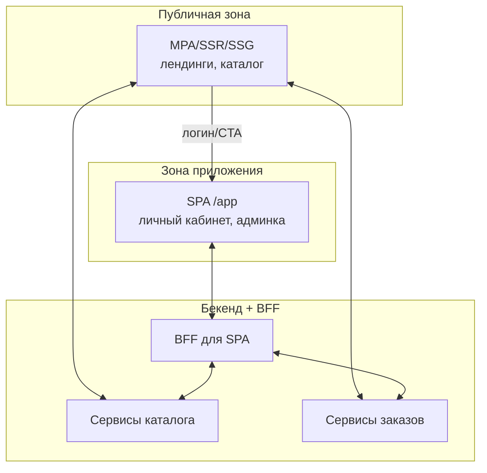

[← Назад к индексу части 22](index.md)

## 22.4. Когда выбирать SPA. Гибриды SPA + MPA/SSR/Islands

### Цель раздела

Научить тебя **осознанно выбирать SPA или альтернативы** в зависимости от контекста продукта, а также проектировать **гибридные архитектуры**, где SPA сочетается с MPA/SSR/Islands, не превращая систему в хаос.

### В этом разделе главное

- SPA — это **инструмент для определённого класса задач**, а не «современный фронтенд по умолчанию».  
- Хороший архитектор умеет **обосновать выбор**: где SPA оправдан, где — MPA/SSR/SSG/Islands, где — гибрид.  
- Важно **чётко рисовать границы** SPA‑зон и понимать, какие решения по состоянию, роутингу и API следуют из этого.  
- Многие успешные продукты используют **комбинацию подходов**: MPA/SSR для контента + SPA для «приложения внутри сайта».

### Термины

- **Hybrid frontend** — архитектура, где в одном продукте **сосуществуют несколько подходов**: MPA, SPA, SSR/SSG, Islands.
- **BFF (Backend For Frontend)** — слой бекенда, специально «заточенный» под нужды конкретного фронта (SPA/мобильное приложение).
- **Domain‑based разделение** — разделение фронтенд‑архитектур по доменам/поддоменам (`www.example.com`, `app.example.com`, `admin.example.com`).

### Теория и правила

#### 1) Критерии выбора SPA

SPA уместен, когда:

- доминирующий сценарий — **интерактивное приложение**:
  - много состояний и переключений;
  - пользователь проводит много времени внутри;  
- SEO либо:
  - не критичен (внутренний инструмент, личный кабинет),
  - либо решается через SSR/SSG/пререндер только для части маршрутов;  
- команда готова:
  - поддерживать сложный фронтенд‑стек (bundler, state management, роутер, тестирование);
  - инвестировать в производительность (TTI, бандлы).

#### 2) Когда лучше MPA/SSR/SSG

MPA/SSR/SSG уместнее, когда:

- продукт **контентно‑ориентирован**:
  - лендинги, страницы кампаний;
  - документация, блог, новости;  
- критично:
  - **SEO и скорость первого контента**;
  - простота стека для команды;  
- интерактивность ограничена:
  - формы, комментарии, поиск, несколько виджетов — можно решить islands/Turbo/HTMX без полного SPA.

#### 3) Гибридные архитектуры

Частый паттерн:

Такое разделение позволяет:

- держать публичную часть **простой и SEO‑дружелюбной**;
- выносить сложное интерактивное приложение в SPA, где это действительно нужно.

### Пошагово: как принять решение

1. **Собери контекст**:
   - тип продукта (контент, инструмент, маркетинг, смесь);
   - требования по SEO, производительности, платформам.  
2. **Нарисуй пользовательские сценарии**:
   - где пользователь проводит много времени и активно взаимодействует;
   - какие части нужны в первую очередь.  
3. **Нарисуй зоны архитектуры**:
   - публичная зона (тип: MPA/SSR/SSG);
   - зона приложения (тип: SPA/Islands/гибрид).  
4. **Определи границы SPA**:
   - URL‑пространство (`/app`, домен `app.example.com`);
   - ответственность по маршрутам и состоянию.  
5. **Синхронизируй с бекендом**:
   - нужен ли BFF;
   - как будут выглядеть API для SPA и для публичной части;
   - как это влияет на разбиение сервисов.

### Простыми словами

Думай не «**SPA vs не SPA**», а:

- «**Где мне нужен мощный интерактивный инструмент?**» → там SPA/Islands.  
- «**Где мне нужна простая, быстрая и индексируемая витрина?**» → там MPA/SSR/SSG.  

И почти всегда ответ: **оба варианта нужны, но в разных зонах**.

### Примеры

1. **B2B‑SaaS**
   - `www.example.com` — маркетинговый сайт (SSR/SSG, контент, блог, документы);  
   - `app.example.com` — SPA с админкой и рабочим интерфейсом;  
   - `docs.example.com` — документация (SSG).  
2. **Онлайн‑банк**
   - Публичная часть: MPA/SSR (продукты, тарифы, условия);  
   - Интернет‑банк: SPA (dashboard, платежи, аналитика);  
   - Иногда дополнительные мини‑SPA внутри MPA (виджет валют, котировки).

### Практика / реальные сценарии

- При проектировании новой системы:
  - бэкендеры часто предлагают «чистый API + SPA»;
  - маркетинг — «чтобы всё индексировалось и было быстро»;
  - архитекторы должны **найти баланс**:
    - разделить зоны,
    - выбрать стеки под каждую,
    - описать интеграцию.  
- В легаси‑системах:
  - может быть MPA‑монолит;
  - к нему постепенно «пристёгивают» SPA в отдельных зонах;
  - важно не превратить всё в неясный гибрид без границ.

### Типичные ошибки

- **SPA везде**: лендинги, маркетинг, документация, при том что SEO критичен.  
- Смешение SPA и MPA **внутри одних и тех же маршрутов** без чёткой границы, что приводит к дублированию логики и хаосу.  
- Игнорирование BFF, из‑за чего SPA напрямую зависит от десятков микросервисов и ломает границы.  
- Отказ от островной архитектуры/частичных обновлений там, где можно было бы **обойтись без полного SPA**.

### Что будет, если…

- **Если всегда выбирать SPA «потому что модно»**:
  - будете переплачивать производительностью и сложностью;
  - усложните стек и найм (нужны сильные фронтендеры под SPA);
  - получите проблемы с SEO и поддержкой.  
- **Если всегда избегать SPA «потому что сложно»**:
  - ограничите UX там, где нужен интерактивный инструмент;
  - будете изобретать свои «полу‑SPA» поверх jQuery/Turbo/HTMX;
  - в итоге всё равно придёте к части идей SPA, но без хорошего фреймворка и архитектуры.

### Проверь себя

1. Придумай продукт, где **нужны одновременно и SPA, и MPA/SSR**, и нарисуй границу между ними.  
2. Назови **минимум три критерия**, по которым ты будешь решать: нужен ли SPA для новой зоны.  
3. Как BFF помогает **упростить жизнь SPA** в гибридной архитектуре?

Ответ

1. Пример: образовательная платформа. Публичный сайт с курсами и маркетингом (SSR/SSG), личный кабинет студента с дашбордом, уроками, заданиями и чатами (SPA). Граница — `/app` или отдельный домен `app.example.com`.  
2. Критерии:
   - доминирует ли интерактивность и сложное состояние;
   - важен ли SEO для этой зоны;
   - готова ли команда поддерживать SPA‑стек;
   - ограничения по устройствам/сетям (мобильный, слабые устройства).  
3. BFF:
   - скрывает сложность бекенда;
   - агрегирует данные из нескольких сервисов в удобный формат для SPA;
   - позволяет эволюционировать бекенд, не ломая SPA‑контракты.

#### Дополнительные вопросы по разделу 22.4

1. Какие **организационные факторы** (структура команды, компетенции, процессы) влияют на выбор между SPA и MPA/SSR/SSG?  
2. Как бы ты описал(а) в ADR решение «публичная часть — SSR, кабинет — SPA», чтобы через год команда не превратила это в хаотичный гибрид?  
3. Какие сигналы говорят, что **текущая гибридная архитектура перестала масштабироваться** и нужно пересмотреть границы зон или выбранные подходы?

Ответ

1. Факторы:
   - есть ли в команде опытные фронтендеры под SPA‑стек;
   - насколько разделены роли (frontend/backend/devops) и как они взаимодействуют;
   - готовность инвестировать в инфраструктуру (SSR/SSG, CI/CD, observability) и поддержку сложного фронта.  
2. В ADR важно:
   - явное описание границ зон (`www`/`docs` vs `/app`);
   - мотивация (SEO, скорость первого экрана vs интерактивность и сложное состояние);
   - правила эволюции (где можно добавлять SPA‑островки, где нельзя; как проверять решения на соответствие архитектуре);
   - ответственность за поддержание границ (arch review, ownership).  
3. Сигналы:
   - растёт количество зависимостей между зонами (SPA начинает знать о маршрутах/логике MPA и наоборот);
   - становится сложно внедрять новые фичи, не нарушая существующие договорённости;
   - метрики UX/SEO/производительности деградируют, а локальные оптимизации не помогают — нужен пересмотр границ и, возможно, смена подхода (например, переход части SPA на SSR/Islands).

### Запомните

- SPA — это **осознанный выбор под конкретный класс задач**, а не новый «дефолт».  
- Самые устойчивые архитектуры фронтенда — **гибридные**, где SPA сосуществует с MPA/SSR/SSG/Islands с чёткими границами ответственности.  
- Архитектор должен уметь **обосновать и документировать** (ADR) решение: где и зачем применяется SPA.

---
