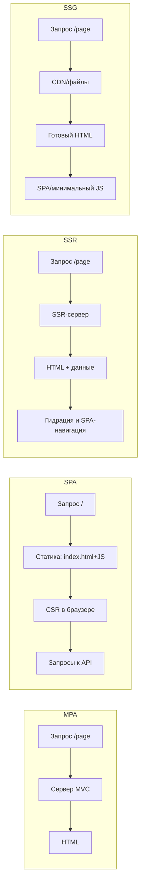
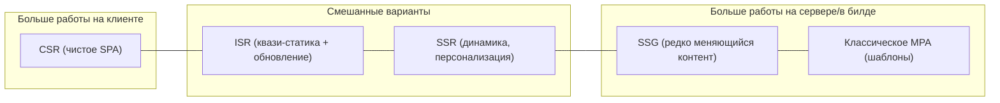

[← Назад к индексу части 23](index.md)

## 23.1. SSR, SSG, ISR: где рождается HTML и как это отличается от MPA/SPA

### Цель раздела

Понять, **где именно формируется HTML** при SSR, SSG и ISR, как это влияет на жизненный цикл запроса, и чем эти подходы **принципиально отличаются** от MPA и SPA.

### В этом разделе главное

- **SSR** — HTML собирается **на сервере при запросе**, часто тем же компонентным кодом, что и на клиенте, затем происходит гидрация.  
- **SSG** — HTML заранее сгенерирован **на этапе билда**, лежит как файл и раздаётся как статика; после загрузки страница становится SPA.  
- **ISR** — **SSG с механизмом обновления**: избранные страницы пересобираются по мере запросов/по таймеру.  
- MPA ≠ SSR, SPA ≠ SSG — это **разные архитектурные стили**, даже если иногда реализованы в одном фреймворке.  
- Важно чётко понимать **границу: где рендер, где состояние, где кеш**, иначе легко сделать медленный и дорогой в эксплуатации фронтенд.

### Термины

- **Render‑сервер** — компонент (процесс/функция), который выполняет код приложения и возвращает HTML для конкретного запроса.  
- **Build‑pipeline** — шаги, которые создают статические HTML/JS/CSS файлы до деплоя.  
- **Full SSR** — когда большинство маршрутов рендерятся на каждый запрос на сервере.  
- **Partial/Selective SSR** — только часть страниц/зон рендерится на сервере, остальное — CSR/SSG.  
- **Blocking vs non‑blocking generation** — пользователю сразу отдают HTML (blocking) или сначала заглушку и потом обновляют (non‑blocking, fallback).  

### Теория и правила

#### Базовые модели рендеринга

Удобно думать о фронтенд‑архитектуре как о выборе ответа на три вопроса:

1. **Когда** генерируется HTML?  
2. **Где** он генерируется (сервер, билд, клиент)?  
3. **Что происходит после первого экрана** (навигация, состояние, обновление данных)?

Если сильно упростить:

- **MPA**:  
  - HTML генерируется **на сервере, при каждом запросе**, но обычно без компонентной модели фронтенда.  
  - После загрузки каждая новая страница — новый HTML, полная перезагрузка.
- **SPA**:  
  - HTML формируется **в браузере** (CSR), сервер отдаёт в основном JSON.  
  - Один HTML и роутинг на клиенте.
- **SSR**:  
  - HTML генерируется **на сервере для каждого (или почти каждого) запроса**, но с использованием компонентного приложения.  
  - После этого клиент **берёт управление на себя как SPA**.
- **SSG**:  
  - HTML генерируется **заранее на этапе билда**, хранится как статика.  
  - После загрузки работает как SPA (или как статический сайт без значимой логики).
- **ISR**:  
  - HTML сначала как при SSG.  
  - Затем для конкретных страниц **иногда заново запускается SSR‑генерация**, и обновлённый HTML сохраняется вместо старого.

#### Визуальная схема различий



Основная идея: во всех случаях пользователь видит HTML, но **путь к нему разный**, и это влияет и на архитектуру, и на эксплуатацию.

### Пошагово: жизненный цикл запроса

Рассмотрим маршрут `/product/42` в трёх вариантах.

#### 1. SSR

1. Браузер отправляет запрос `GET /product/42`.  
2. Load‑balancer направляет запрос на **SSR‑нод**.  
3. SSR‑нод:
   - получает данные о продукте из БД/API/BFF,  
   - выполняет код компонентного приложения для этого маршрута,  
   - формирует HTML (иногда стримит его по частям).  
4. Пользователь получает **готовый HTML** (LCP часто быстрый).  
5. Параллельно или после этого JS‑бандл загружается, происходит **гидрация** — и дальше навигация внутри приложения работает как SPA.

#### 2. SSG

1. На этапе билда вызывается генератор:
   - он обходит список продуктов,  
   - для каждого ID вызывает тот же код рендера, что и в SSR,  
   - сохраняет HTML файлы `/product/42.html`, `/product/43.html` и т.д.  
2. При запросе `GET /product/42` CDN/сервер просто **отдаёт готовый файл**, не обращаясь к БД.  
3. Браузер показывает HTML, подгружает JS, дальше — как SPA.

#### 3. ISR (упрощённо)

1. При первом запросе `/product/42`:
   - если файла нет — выполняется SSR‑генерация и результат **кешируется/сохраняется**.  
   - при следующих запросах отдаётся кеш.  
2. Через заданный интервал (например, 60 секунд) или при специальном запросе (webhook из CMS) кеш **признаётся устаревшим**, и при следующем запросе:
   - пользователю можно сразу отдать старую версию (fallback),  
   - параллельно запустить фоновую регенерацию и обновить кеш.  

### Простыми словами

- **SSR** — это как если бы ты каждый раз заказывал свежую пиццу: вкусно и актуально, но печь должна работать быстро и надёжно.  
- **SSG** — это как если бы ты заранее напёк много пицц и разложил по витринам: очень быстро отдавать, но если рецепт поменялся, нужно перепечь и заменить.  
- **ISR** — это когда ты **печёшь заранее**, но иногда **обновляешь только самые популярные пиццы**, не переделывая весь ассортимент.

### Картинка в голове

```mermaid
flowchart TD
  subgraph SSR["SSR: печь по заказу"]
    U1[Пользователь] -->|GET /page| RS[Render-сервер]
    RS -->|HTML| U1
  end

  subgraph SSG["SSG: печь заранее"]
    Build[Билд] -->|HTML файлы| CDN1[CDN/статический хостинг]
    U2[Пользователь] -->|GET /page| CDN1 -->|HTML| U2
  end

  subgraph ISR["ISR: обновление порциями"]
    Build2[Первичная генерация] --> CDN2[CDN/хранилище]
    U3[Пользователь] -->|GET /page| CDN2 -->|HTML (возможно устаревший)| U3
    CDN2 -->|триггер регенерации| RS2[SSR-генерация]
    RS2 -->|обновлённый HTML| CDN2
  end
```

### Как запомнить

- **SSR** — *Server on Request*: сервер рендерит **по запросу**.  
- **SSG** — *Static Generated*: всё **заранее и статично**.  
- **ISR** — *Incremental*: **частями обновляем статику**.

### Примеры

- SSR:
  - Личный кабинет банка: баланс, последние операции, персональные предложения — всё зависит от пользователя и меняется часто.  
  - Новости с персонализированным блоком «рекомендовано вам».
- SSG:
  - Документация к API: текст и примеры обновляются раз в день/неделю.  
  - Маркетинговый лендинг с 10–20 страницами и редкими изменениями.
- ISR:
  - Интернет‑магазин с десятками тысяч товаров: описания обновляются время от времени, но не по щелчку; SSG всего каталога каждый раз слишком дорого.  
  - Блог с высокой посещаемостью, где важна скорость, но статьи иногда правятся.

### Практика / реальные сценарии

- Проект на Next.js:
  - публичные страницы (`/`, `/about`, `/blog/...`) — SSG или ISR,  
  - раздел `/app` — SSR+SPA (или чистое SPA),  
  - часть страниц админки — чистое SPA (CSR).  
- Проект на Nuxt/SvelteKit:
  - SSR для страниц с частыми изменениями или персонализацией,  
  - SSG/ISR для контентных страниц.

### Граничные случаи и продвинутые приёмы

- **SSR с потоковой отдачей (streaming SSR)**:
  - сервер начинает отправлять HTML **частями**, как только готовы верхние уровни страницы,  
  - пользователь быстрее видит «каркас» и верхнюю часть контента, пока тяжёлые блоки догружаются,  
  - полезно для больших страниц и медленных источников данных.  
- **SSG + онлайн‑персонализация**:
  - основной контент страницы генерируется статически (SSG),  
  - персональные блоки (например, приветствие пользователя, рекомендации) подставляются уже **на клиенте** или через лёгкий API‑запрос,  
  - так можно совместить быстрый первый рендер с приватностью и гибкостью персонализации.  
- **Per‑route стратегии в одном приложении**:
  - один и тот же фреймворк (Next.js/Nuxt/SvelteKit) позволяет для **каждого маршрута** выбрать: SSG, ISR, SSR или чистый CSR,  
  - это удобно, но требует явного решения и документации: «какая страница рендерится как».

#### Ось «статика ↔ динамика» и «клиент ↔ сервер»

Полезно представить себе **две перпендикулярные оси**:

- по горизонтали — где рождается HTML: **клиент (CSR)** ↔ **сервер (SSR/SSG)**;  
- по вертикали — **динамичность содержимого**: редко меняется ↔ часто и персонально меняется.



Так легче «раскладывать» реальные страницы по месту на плоскости, а не спорить в терминах «модно/немодно».

### Типичные ошибки

- Считать, что **SSR = «всё всегда будет быстрее»** — при больших шаблонах и сложном SSR‑коде можно легко сделать хуже SPA.  
- Пытаться сделать **все маршруты SSG** в большом каталоге (сотни тысяч страниц) и получать **часы билдов**.  
- Путать **пререндер** (однократная генерация некоторых маршрутов) и полноценный SSG/ISR, не продумывая стратегию обновления.  
- Игнорировать **стоимость SSR‑нод** и сложность отладки ошибок рендера на сервере.  
- Не учитывать **hydration mismatch**:
  - страница на сервере рендерится с одной разметкой, а на клиенте — с другой (например, использование `Date.now()`, `Math.random()` или разной локали),  
  - в результате фреймворк вынужден полностью перерисовывать компонент или выдаёт предупреждения/ошибки.

### Что будет, если…

- Если пытаться использовать **только SSR** для всего (включая тяжёлые внутренние страницы), можно:
  - перегрузить бекенд,  
  - получить медленные ответы при пиках трафика,  
  - усложнить кеширование и мониторинг.  
- Если пытаться использовать **только SSG**:
  - билды будут занимать часы,  
  - изменения контента будут откладываться до следующей сборки.

### Проверь себя

1. Сможешь ли ты устно нарисовать **жизненный цикл запроса** для SSR и SSG для одной и той же страницы?  
2. Почему SSR можно рассматривать как «динамическую печь HTML», а SSG — как «склад готовых страниц»?  
3. В чём ключевое преимущество ISR по сравнению с «чистым» SSG?

<details><summary>Ответ</summary>

1. Для SSR: запрос → SSR‑нод → загрузка данных → рендер компонентов → HTML → браузер → гидрация. Для SSG: билд → генерация HTML → сохранение файлов → запрос → раздача готового файла → гидрация.  
2. В SSR каждой порции HTML нужна работа сервера прямо в момент заказа, а в SSG всё приготовлено заранее и только отдаётся.  
3. ISR позволяет **обновлять только часть страниц по мере необходимости**, не пересобирая весь сайт, сохраняя при этом плюсы статики (быстрая раздача через CDN).

</details>

#### Дополнительные вопросы по разделу 23.1

1. Почему нельзя считать, что «SSR = современный MPA», если и там и там HTML рендерится на сервере?  
2. В чём разница в требованиях к инфраструктуре между проектом, который делает только SSG, и проектом, который делает только SSR?  
3. Как изменится поведение приложения, если страница, которая раньше была SSG, станет SSR (представь тот же маршрут `/product/42`)?  
4. Почему для ISR важно уметь **идентифицировать страницу** (например, по пути или ID) и как это влияет на дизайн URL‑ов и маршрутов?

<details><summary>Ответ</summary>

1. Классический MPA подразумевает полноцепочный серверный рендер **без компонентной модели фронтенда** и без обязательной гидрации: каждая страница живёт сама по себе, и JS часто добавляется точечно. SSR же обычно рендерит **одно и то же компонентное приложение**, которое затем продолжает жить как SPA на клиенте; это другой уровень сложности состояния, роутинга и билд‑пайплайна.  
2. При SSG большая часть нагрузки уходит в момент сборки: нужен быстрый и надёжный build‑контур и статический хостинг/CDN, но нет постоянного давления на рендер‑серверы. При чистом SSR нужен **постоянно доступный пул рендер‑нод**, масштабирование по RPS, продуманное кеширование и мониторинг ошибок рендера — это ближе к эксплуатации полноценного бекенда.  
3. При переходе с SSG на SSR первый байт HTML начинает зависеть от нагрузки и задержек на SSR‑ноде и бекенде; зато можно чаще обновлять контент и выдавать персонализированные данные. Навигация после первого рендера, если остаётся SPA‑подобной, может не измениться для пользователя, но эксплуатационные характеристики (нагрузка, стоимость, чувствительность к сбоям) изменятся сильно.  
4. ISR должен «понимать», **какой именно HTML нужно пересобрать**: для этого чаще всего используется путь или параметр (например, ID товара). Если URL‑ы неоднозначны или содержат много «шума», сложно корректно настроить ревалидацию и кеши; аккуратный дизайн маршрутов (один URL → одна сущность/страница) упрощает жизнь и для ISR, и для кеширования в целом.

</details>

### Запомните

- SSR/SSG/ISR — это **про то, когда и где рождается HTML**, а не про конкретный фреймворк.  
- MPA, SPA, SSR, SSG и ISR — **разные точки на одной оси**: от полностью динамического рендера на сервере до полностью статического контента.  
- Правильный выбор подхода почти всегда **контекстен**: тип продукта, частота изменений, требования к SEO и бюджету на инфраструктуру.

---
