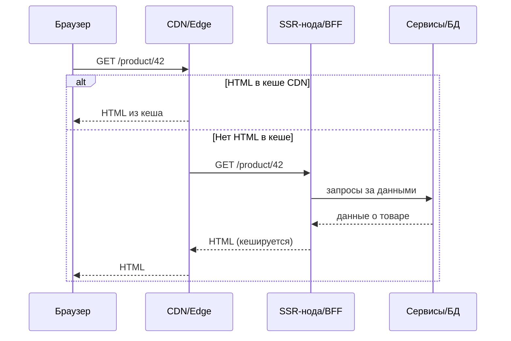
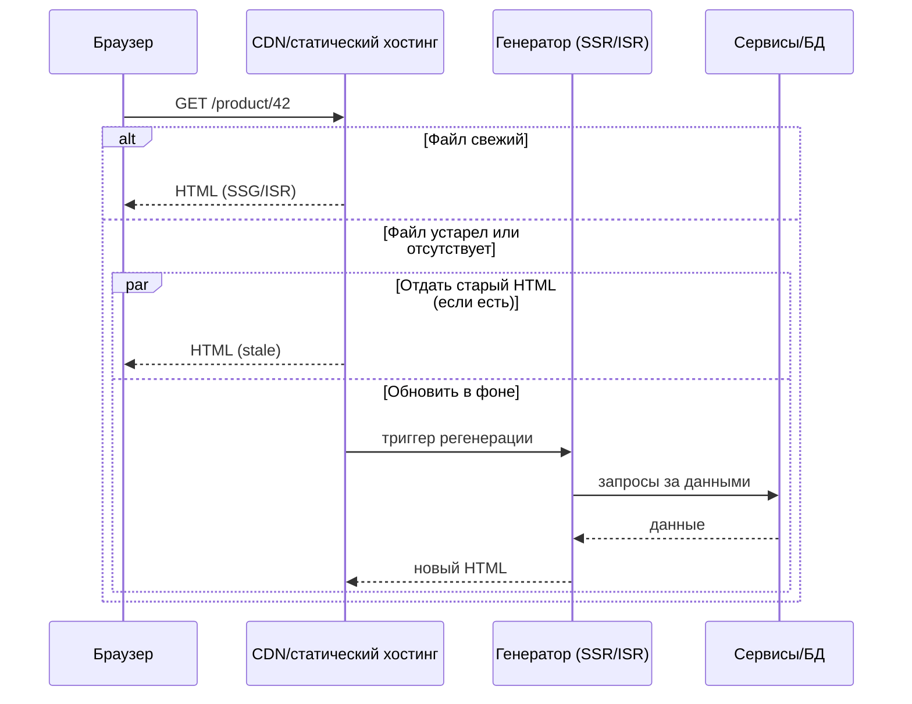
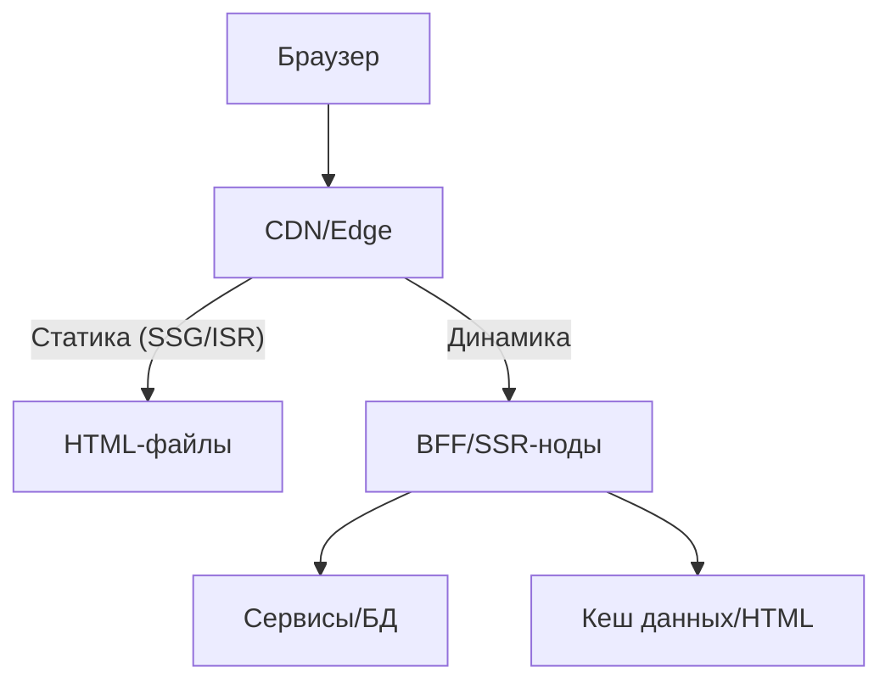

[← Назад к индексу части 23](index.md)

## 23.2. Потоки данных, кеши и производительность при SSR/SSG/ISR

### Цель раздела

Научиться видеть, **как запрос проходит через CDN, BFF, SSR‑нод и бекенд‑сервисы**, где можно и нужно кешировать HTML и данные, и как всё это влияет на **LCP, TTFB и нагрузку**.

### В этом разделе главное

- При SSR **кеш и CDN** становятся критически важными — без них SSR легко становится «узким местом».  
- При SSG значительная часть работы переносится в **build‑pipeline** и CDN — продакшен‑серверы разгружаются.  
- При ISR важно продумать **стратегию ревалидации**: когда обновлять, что делать в случае ошибок, как не убить БД.  
- **TTFB и LCP** зависят и от места рендера, и от веса JS‑бандлов, и от настроек CDN/cache headers.  
- Нельзя рассматривать SSR/SSG/ISR в отрыве от **архитектуры бекенда и BFF**.

### Термины

- **TTFB (Time To First Byte)** — время до получения первого байта ответа от сервера.  
- **LCP (Largest Contentful Paint)** — время до отображения крупнейшего содержимого на экране.  
- **Cache‑control, ETag** — HTTP‑заголовки, управляющие кешированием в браузере и CDN.  
- **Stale‑while‑revalidate** — стратегия: отдавать устаревший ответ, пока фоново обновляется кеш.  
- **BFF (Backend for Frontend)** — прослойка между фронтом и микросервисами/БД, может использоваться и для SSR/ISR.

### Теория и правила

#### Поток запроса при SSR с BFF

Правила:

- **Возможность кеша HTML** сильно снижает нагрузку на SSR‑ноды и бекенд.  
- BFF может:
  - агрегировать данные из нескольких сервисов,  
  - реализовывать кеширование на уровне данных,  
  - отдавать SSR‑слою уже готовый view‑модель.

#### Поток запроса при SSG/ISR

#### Как архитектура влияет на метрики

- **SSR без кеша**:
  - TTFB включает:
    - время сети до SSR‑ноды,  
    - время вызовов к сервисам/БД,  
    - время исполнения JS на сервере.  
  - Если SSR‑нод перегружен, TTFB растёт, а вместе с ним и LCP.
- **SSR с кешом HTML**:
  - TTFB для кеш‑хитов почти как у SSG (быстро).  
  - **Холодные хиты** всё ещё зависят от скорости SSR и бекенда.
- **SSG**:
  - TTFB ограничен в основном сетью и скоростью CDN.  
  - LCP зависит от размера HTML+CSS и веса JS‑бандлов.
- **ISR**:
  - Для популярных страниц после прогрева кеша поведение близко к SSG.  
  - Для редко запрашиваемых/новых страниц — ближе к SSR.

### Пошагово: проектируем кеширование для SSR/SSG/ISR

1. **Определяем типы страниц**:
   - статические (документация, блог),  
   - квази‑статические (каталог товаров, новости),  
   - динамические (кабинет, персонализированная лента).  
2. Для каждой группы решаем:
   - можно ли кешировать HTML целиком,  
   - есть ли персонализация по пользователю,  
   - насколько часто нужно обновлять контент.  
3. Выбираем стратегию:
   - SSG/ISR для статических и квази‑статических,  
   - SSR+SPA/чистое SPA для сильно динамических.  
4. Настраиваем:
   - CDN‑кеш (TTL, `stale-while-revalidate`),  
   - кеш на уровне BFF/SSR‑ноды (если уместно),  
   - кеш данных (например, Redis) под тяжёлые запросы к БД.  
5. Определяем метрики и мониторинг:
   - TTFB/LCP по типам страниц,  
   - hit‑ratio кеша,  
   - время билдов/регенерации,  
   - error rate SSR/ISR.

### Простыми словами

Можно думать так:

- **CDN и кеш — это твой «фронтовый холодильник»**: чем больше готовых страниц лежит там, тем меньше система «готовит» прямо во время заказа.  
- **SSR без кеша** — это когда повар готовит каждое блюдо с нуля при каждом заказе, даже если рецепт один и тот же.  
- **SSG/ISR** — это когда повар заранее готовит большую партию популярных блюд, а иногда обновляет их партиями.

### Картинка в голове: архитектура с BFF и разными видами страниц

### Как запомнить

- **Не бывает «просто SSR»** — есть SSR **с кешом или без него**, и это две разные системы по нагрузке и стоимости.  
- **SSG/ISR переносит нагрузку в билд и в кеши**, SSR — в рантайм и в бекенд.

### Примеры

- Интернет‑магазин:
  - Главная, категории, карточки популярных товаров — ISR через CDN.  
  - Личный кабинет, корзина, оформление заказа — SSR/SPA, часто без CDN‑кеша HTML (но с кешем статики и API).  
  - Список заказов в админке — чистое SPA, где SSR мало что даёт.
- SaaS‑продукт:
  - Маркетинговый сайт и документация — SSG/ISR.  
  - Приложение в `/app` — SPA+SSR только для первого экрана (иногда).

### Типичные ошибки

- Не разделять **публичные и персонализированные страницы** и пытаться кешировать всё одинаково.  
- Кешировать **персонализированный HTML** без учёта пользователя (утечка данных).  
- Игнорировать **инвалидацию кеша**: обновили данные в БД, но забыли пересобрать/инвалидировать страницы.  
- Не мониторить **ошибки SSR/ISR**: пользователи получают 500/белый экран, а в метриках — только 200 от CDN.

### Что будет, если…

- Если не продумать стратегию кеширования для SSR:
  - при росте трафика SSR‑ноды начнут «задыхаться»,  
  - TTFB вырастет, LCP испортится, а расходы на инфраструктуру возрастут.  
- Если неверно настроить ISR (слишком частая ревалидация):
  - можно случайно создать **DDoS на собственный бекенд**, когда многие страницы одновременно регенерируются.

### Проверь себя

1. В каких случаях кешировать **HTML целиком** безопасно, а в каких — опасно?  
2. Как повлияет на TTFB/LCP перевод части публичных страниц с SPA+CSR на SSG?  
3. Почему важно мониторить **hit‑ratio кеша** и ошибки регенерации при ISR?

Ответ

1. Безопасно — когда содержимое не персонализировано и одинаково для всех (документация, лендинги, публичный каталог). Опасно — когда HTML содержит данные конкретного пользователя (имя, баланс, корзину) или иные чувствительные данные; в этом случае кеш нужно либо отключать, либо сегментировать по пользователю.  
2. TTFB почти не изменится (CDN и так может быстро отдавать index.html), но LCP **существенно улучшится**, потому что браузер сразу получает готовый контент, а не ждёт выполнения крупного JS‑бандла.  
3. Hit‑ratio показывает, насколько хорошо кеш работает: низкое значение означает, что мы часто ходим в SSR/бекенд. Ошибки регенерации важны, потому что при их росте пользователи могут видеть устаревший контент или белые экраны, даже если CDN отдаёт 200.

#### Дополнительные вопросы по разделу 23.2

1. Почему иногда выгоднее кешировать **данные** (ответы API) вместо готового HTML при SSR, и в каких случаях это даёт больше гибкости?  
2. Как изменится профиль нагрузки на бекенд, если мы отключим `stale-while-revalidate` и будем всегда ждать свежего HTML при ISR?  
3. В чём практическая разница между кешированием на уровне CDN и кешированием внутри BFF/SSR‑ноды (по месту в архитектуре и по управлению)?  
4. Как стратегия кеширования должна меняться в зависимости от того, какой тип данных мы показываем: новости, курс валют, баланс счёта, корзина?

Ответ

1. Кеширование данных удобно, когда **одни и те же данные** используются в разных представлениях или когда нам нужно персонализировать часть страницы, а часть — нет. Кеш данных позволяет переиспользовать результат тяжёлых запросов к БД/микросервисам, не привязываясь к конкретной верстке; HTML при этом можно собирать динамически или кешировать отдельно для неперсонализированных зон.  
2. При отключении `stale-while-revalidate` каждый запрос, попавший на устаревший ресурс, будет **ждать полной регенерации** HTML: это увеличит латентность для пользователей и сконцентрирует нагрузку на бекенде в моменты обновления, а не растянет её во времени. В пиках это может привести к очередям на рендер и скачкам TTFB/LCP.  
3. Кеш CDN работает «на краю» и видит запросы только по HTTP‑характеристикам (URL, заголовки, куки), он идеален для публичного/квази‑публичного контента и разгрузки инфраструктуры. Кеш внутри BFF/SSR‑ноды может использовать **богатый контекст** (параметры, бизнес‑ключи, авторизацию) и тоньше управлять данными, но не разгружает сеть и не так хорошо распределяет нагрузку по географии. Выбор слоя кеша — часть архитектурного решения.  
4. Новости и лендинги часто можно кешировать как HTML с умеренным TTL или через ISR. Курс валют — данные, которые меняются регулярно и критичны по свежести, здесь разумнее кешировать данные с коротким TTL и аккуратно выбирать точки обновления. Баланс счёта и корзина — **персональные и чувствительные данные**, их HTML почти никогда нельзя кешировать публично; кеширование возможно только на уровне данных с сильной сегментацией по пользователю и осторожным подходом к безопасности и консистентности.

### Запомните

- SSR/SSG/ISR — это не только про рендеринг, но и про **архитектуру кешей и нагрузку на бекенд**.  
- Без продуманного кеширования **SSR легко становится дороже и медленнее SPA/MPA**.  
- При SSG/ISR ключевыми становятся **время билда, стратегия ревалидации и контроль ошибок генерации**.

---
