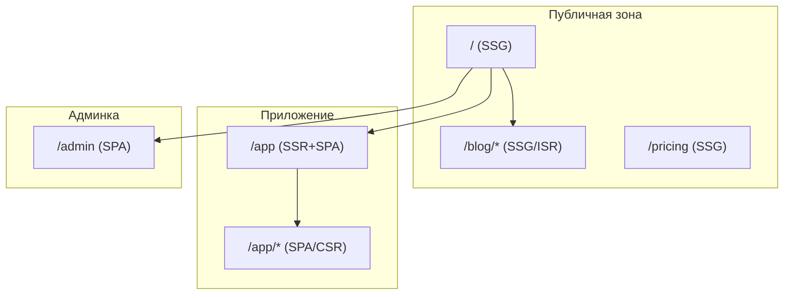

[← Назад к индексу части 23](index.md)

## 23.3. Когда выбирать SSR, SSG, ISR и какие гибриды использовать

### Цель раздела

Научиться **осознанно выбирать комбинацию SSR/SSG/ISR/SPA/MPA** под конкретный продукт, учитывая тип контента, трафик, частоту изменений, SEO и готовность команды к сложности.

### В этом разделе главное

- Нет «лучшего» подхода — есть **подход под контекст**.  
- SSR, SSG и ISR часто используются **совместно** внутри одного продукта.  
- Основные параметры выбора:
  - тип контента (статический/динамический/персонализированный),  
  - частота изменений,  
  - требования к SEO и LCP,  
  - размер и зрелость команды,  
  - бюджет на инфраструктуру и DevOps.  
- Хорошая архитектура рендеринга **допускает эволюцию**: начать проще (SSG+SPA) и при необходимости перейти к ISR/SSR.

### Термины

- **JAMstack** — архитектурный подход: JS + API + Markup (SSG/ISR + CDN + API).  
- **Hybrid rendering** — сочетание разных способов рендеринга в одном приложении (SSR+SSG+CSR).  
- **Migration path** — заранее продуманная траектория: с чего начинаем (например, SSG) и как будем усложнять (ISR/SSR) при росте требований.

### Теория и правила

#### Матрица выбора (упрощённая)

| Сценарий | Частота изменений | Персонализация | SEO важен? | Рекомендуемый подход |
| --- | --- | --- | --- | --- |
| Документация, блог | Низкая/средняя | Нет | Да | **SSG** (+ISR при росте объёма/частоте обновлений) |
| Маркетинговый сайт продукта | Низкая/средняя | Низкая | Да | **SSG/ISR**, иногда SSR для динамических блоков |
| Интернет‑магазин: каталог | Средняя | Низкая | Да | **ISR** (каталог, карточки), SPA/SSR для корзины/чекаута |
| Личный кабинет, админка | Высокая | Высокая | SEO не нужен | **SPA** с возможным SSR для первого экрана |
| Сложный SaaS‑интерфейс | Высокая | Высокая | Обычно нет | **SPA/SSR гибрид**, SSR для стартовой страницы и SSR/SPA для приложения |

#### Правила выбора

1. **Если страница не зависит от пользователя и меняется редко** — кандидат на SSG.  
2. **Если страница зависит от пользователя и/или часто меняется** — кандидат на SSR или SPA.  
3. **Если страниц очень много (десятки/сотни тысяч)** и они квази‑статические:
   - SSG может стать слишком дорогим по времени билда,  
   - ISR даёт баланс: не всё пересобирать сразу.  
4. **Если SEO критичен**:
   - избегаем «чистого CSR» без пререндера/SSR,  
   - SSG/ISR/SSR обычно дают лучший LCP и индексацию.  
5. **Если команда мала и DevOps‑контур слабый**:
   - не стоит начинать с супер‑сложного SSR‑кластера,  
   - разумный старт — SSG/ISR для публичных страниц + SPA/MPA для остального.

### Пошагово: как принять решение для нового продукта

1. Опиши **типы пользовательских зон**:
   - публичная витрина,  
   - документация/блог,  
   - приложение/кабинет,  
   - админка.  
2. Для каждой зоны ответь:
   - нужен ли SEO,  
   - как часто меняется контент,  
   - есть ли персонализация.  
3. Заполни матрицу:
   - публичная часть → SSG/ISR/SSR,  
   - приложение → SPA/SSR,  
   - админка → SPA/MPA.  
4. Сравни **ресурсы команды**:
   - есть ли экспертиза и время на поднятие SSR‑кластера,  
   - есть ли готовый хостинг для SSG/ISR (Vercel/Netlify/own CDN).  
5. Зафиксируй **минимальный рабочий вариант**:
   - например: «v1 — SSG для витрины, SPA для кабинета; v2 — добавим ISR для каталога и SSR для кабинета».  
6. Запиши решение в **ADR** (часть 32) с мотивацией и планом эволюции.

### Простыми словами

Подумай о своём продукте как о **наборе зон с разными потребностями**:

- одни зоны хотят **быть в поиске и грузиться мгновенно**,  
- другие — **быть максимально интерактивными**,  
- третьи — просто **удобными для внутренней команды**.  

SSR/SSG/ISR — это **инструменты**, которыми ты настраиваешь поведение каждой зоны, а не догмы «мы всегда делаем SSR».

### Картинка в голове: гибридный продукт

### Как запомнить

- **Не существует одного «архитектурного переключателя» на весь проект** — думай по зонам и страницам.  
- **Начни с простого** (SSG+SPA/MPA), а затем добавляй ISR/SSR туда, где появляется реальная боль (SEO, производительность, персонализация).

### Примеры

- Стартап с маркетинговым сайтом и кабинетом:
  - v1:  
    - сайт → SSG,  
    - кабинет → SPA без SSR.  
  - v2 (при росте требований):  
    - каталог/цены → ISR,  
    - кабинет → SSR для первого экрана (SEO не нужен, но важно быстрее first view).  
- Крупный e‑commerce:
  - витрина и категории → ISR,  
  - чекаут → SSR/SPA,  
  - бэкофис → MPA/SPA (часто без SSR).

### Типичные ошибки

- «**У нас Next.js, значит всё будет SSR/SSG/ISR автоматически**» — без продуманных стратегий рендеринга и кешей можно получить медленное и дорогое решение.  
- Выбор «всё SSG» или «всё SSR» без учёта **объёма контента и частоты изменений**.  
- Попытка оптимизировать каждый маршрут до идеала, вместо того чтобы **сфокусироваться на критичных страницах**.  
- Отсутствие **плана миграции**: начали с SSR, а потом тяжело перейти к ISR/SSG или наоборот.

### Что будет, если…

- Если изначально выбрать слишком сложную схему (полный SSR, сложные кеши) для маленькой команды:
  - значительная часть времени уйдёт на инфраструктуру,  
  - функциональные фичи будут страдать.  
- Если наоборот **недооценить важность SEO и LCP**, оставив всё на CSR:
  - можно проиграть в поиске,  
  - потерять конверсию из‑за медленных первых загрузок.

### Проверь себя

1. Какую комбинацию подходов ты бы выбрал(а) для: блога, интернет‑магазина и SaaS‑кабинета?  
2. Почему не стоит пытаться «всё сделать SSR» в крупном продукте с ограниченной командой?  
3. Как можно спланировать эволюцию архитектуры рендеринга, чтобы не переписывать всё с нуля?

Ответ

1. Блог — SSG/ISR; магазин — ISR для каталога, SSR/SPA для корзины/чекаута; SaaS‑кабинет — SPA, при необходимости SSR только для первого экрана или маркетинговых страниц.  
2. Полный SSR требует серьёзной инфраструктуры (рендер‑ноды, кеши, мониторинг ошибок, оптимизация SSR‑кода), а выгода от SSR далеко не на всех страницах окупает затраты; проще и надёжнее комбинировать подходы.  
3. Определить MVP‑архитектуру (например, SSG+SPA), зафиксировать её в ADR, а затем описать условия, при которых добавим ISR/SSR (рост трафика, требования SEO, проблемы с LCP), и план действий для этой миграции (новые маршруты, кеши, мониторинг).

#### Дополнительные вопросы по разделу 23.3

1. Почему при выборе между SSG и ISR важно учитывать не только частоту обновления контента, но и **распределение трафика по страницам** (какие страницы реально читают)?  
2. Как размер и зрелость команды влияют на то, насколько сложную гибридную архитектуру (SSR/SSG/ISR/SPA/MPA) стоит закладывать на первых этапах продукта?  
3. Приведи пример, когда решение «сделать всё SPA с CSR» выглядит заманчиво, но приводит к проблемам в SEO и производительности, которые было бы проще решить гибридом.  
4. Как наличие/отсутствие готового CDN и serverless/edge‑платформы у компании влияет на выбор между SSG/ISR и классическим SSR?

Ответ

1. Если контент обновляется, но **практически не читается**, то пересборка или ревалидация для таких страниц может быть пустой тратой ресурсов; наоборот, для страниц с большим трафиком даже редкие изменения могут требовать более агрессивной стратегии обновления. ISR особенно выгоден для страниц с **высоким трафиком и умеренной динамикой**, потому что позволяет освежать именно те HTML, которые реально востребованы.  
2. Сложная гибридная архитектура требует: продуманного мониторинга, кешей на нескольких уровнях, грамотного управления конфигурацией per‑route и опыта команды в эксплуатации распределённых систем. Небольшой или начинающий коллектив рискует потратить большую часть времени на инфраструктуру вместо бизнес‑функционала; поэтому на первых этапах разумно выбирать **минимально достаточную** архитектуру (например, SSG/SPA + ограниченный SSR) с явным планом эволюции.  
3. Классический пример — маркетинговый сайт и блог, реализованные как единое SPA: разработчикам удобно, один стек, быстрое локальное развитие. Но: первая отрисовка зависит от большого JS‑бандла, SEO хуже, чем при SSR/SSG, сложнее обеспечить быстрый LCP на мобильных. Гибрид (SSG/ISR для маркетинга и блога + SPA/SSR для кабинета) даёт те же возможности разработки, но лучше отвечает требованиям SEO и перформанса.  
4. Если в компании уже есть CDN и удобные сервисы для статики/serverless/edge, **SSG/ISR становятся особенно привлекательными**: легко разместить сгенерированный HTML ближе к пользователю и минимизировать нагрузку на бекенд. При их отсутствии и дороговизне сетевой инфраструктуры бывает проще начать с более «центричного» SSR (с кешами у самого приложения) или даже с MPA/SPA, а вопросы CDN и глобального распределения решать позже, по мере роста продукта.

### Запомните

- Правильный выбор архитектуры рендеринга — это **баланс между скоростью разработки, скоростью работы и стоимостью эксплуатации**.  
- SSR/SSG/ISR лучше всего работают **как набор инструментов**, а не как религия «мы всегда делаем X».

---
