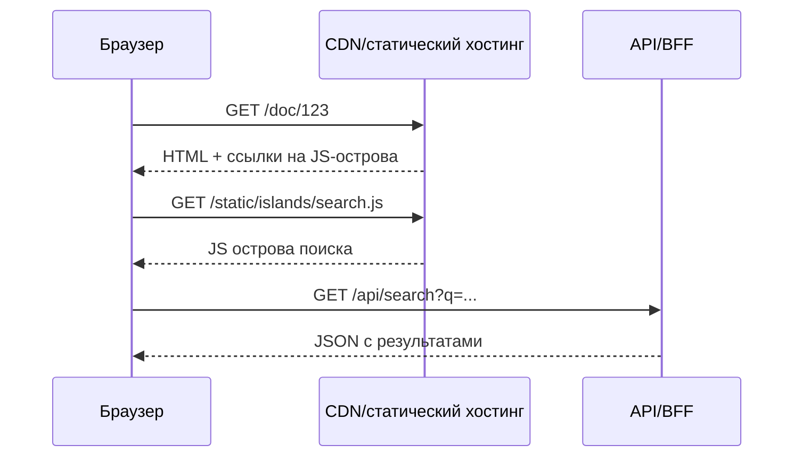

[← Назад к индексу части 24](index.md)

## 24.1. Островная архитектура и виды гидрации

### Цель раздела

Сформировать понятную и технически точную картину **островной архитектуры и вариантов гидрации**: где и как запускается JS, что остаётся чистой статикой, как это помогает уменьшить бандл и улучшить TTI, и какие появляются новые сложности.

### В этом разделе главное

- Islands — это **не маркетинговое слово**, а архитектурная модель: статический каркас + отдельные интерактивные острова, каждый со своим бандлом и жизненным циклом.
- Полная гидрация (classic SSR+hydration) делает страницу **почти SPA по нагрузке JS**: нужно и отрендерить, и полностью гидрировать всё дерево.
- Частичная/островная гидрация позволяет **гидрировать только то, что действительно интерактивно**; остальное остаётся чистым HTML/CSS.
- Streaming/progressive hydration помогает **уменьшить TTFB и улучшить восприятие скорости**, но требует аккуратного дизайна компонентов и источников данных.
- Resumability идёт ещё дальше: клиент **не повторяет серверный рендер**, а лишь «подхватывает» его, выполняя минимум кода.
- Islands‑подход хорошо сочетается с **SSG/ISR и JAMstack**: каркас статичен, острова общаются с API.

### Термины

- **Island** — компонент/зона, которая:
  - имеет собственный JS‑бандл,
  - может быть загружена/гидрирована независимо,
  - часто получает данные через API.
- **Island boundary** — граница между статической частью и интерактивным островом.
- **Hydration mismatch** — ситуация, когда HTML с сервера и результат рендера на клиенте **не совпадают**, что приводит к предупреждениям/ошибкам и перерисовке.

### Теория и правила

#### 1) Базовая модель Islands

Интуитивно:

- ты рендеришь страницу **как SSG/SSR**: весь текст, разметка, картинки — готовый HTML;
- где нужна интерактивность, ты **встраиваешь остров**: небольшой React/Vue/Svelte‑компонент;
- при загрузке страницы браузер:
  - получает HTML,
  - подгружает общий минимум (например, небольшую «раму»),
  - **лениво подгружает JS конкретных островов**, когда они попадают в viewport/нужны пользователю.

Мини‑пример (упрощённая идея разметки):

```html
<article>
  <h1>Статья</h1>
  <p>Текст статьи полностью статичен.</p>

  <div data-island="comments" data-props='{"postId":123}'>
    <!-- Статический fallback: "Загрузка комментариев..." -->
    <p>Комментарии загружаются…</p>
  </div>
</article>
```

JS для острова `comments` загружается отдельно и **гидрирует только содержимое этого `div`**.

#### 2) Полная vs частичная гидрация

При классическом SSR React:

- сервер рендерит весь HTML;
- в HTML вшивается сериализованное состояние;
- на клиенте загружается **один большой бандл**, который:
  - пересчитывает всё дерево компонентов,
  - вешает обработчики событий на весь DOM.

При Islands:

- можно разбить дерево на острова и:
  - не тянуть код для неинтерактивных блоков;
  - **использовать разные фреймворки/версии** для разных островов (в экстремальных случаях).

Практические правила:

- всё, что **никогда не интерактивно**, должно оставаться **чистой статикой**;
- острова должны быть **достаточно крупными**, чтобы не превратить страницу в «сотни микровиджетов» с отдельными бандлами;
- **границы островов** важно фиксировать и документировать (как архитектурные границы).

#### 3) Streaming и прогрессивная гидрация

Streaming SSR:

- сервер может отдавать:
  - сначала **каркас** (шапка, skeleton‑блоки),
  - затем по мере готовности — тяжёлые части (списки, виджеты);
- гидрация может начинаться **до того, как готов весь HTML**.

Это уменьшает TTFB и даёт пользователю «ощущение скорости», но:

- усложняет код рендера,
- требует аккуратного обращения с состоянием (часть данных может прийти позже).

#### 4) Resumability (на примере Qwik‑подхода)

Идея:

- сервер рендерит страницу и **сериализует минимум информации о состоянии и связях**;
- на клиенте не происходит «полный рендер + полная гидрация»;
- JS исполняется **только по событиям**, «размораживая» части UI.

Это потенциально даёт **радикальное уменьшение JS‑работы на старте**, но:

- усложняет рантайм и дебаг;
- пока менее распространено, чем классические SSR/Islands.

### Простыми словами

Представь город ночью:

- Улица (страница) освещена фонарями (статический HTML) — их видно сразу.
- Отдельные витрины/киоски (острова) загораются и оживают **только тогда, когда ты подходишь** (входит в viewport или пользователь совершает действие).
- Нет нужды включать сразу **весь ТЦ целиком** (SPA/полная гидрация) — только те витрины, которые действительно нужны.

### Картинка в голове

```mermaid
flowchart TD
  A[Статический HTML (SSG/SSR)] --> B[Остров 1: поиск]
  A --> C[Остров 2: комментарии]
  A --> D[Остров 3: переключатель темы]

  subgraph JS
    BJS[JS-бандл поиска]
    CJS[JS-бандл комментариев]
    DJS[JS-бандл темы]
  end

  B --> BJS
  C --> CJS
  D --> DJS
```

Дополнительно полезно представить **поток запроса** при Islands‑архитектуре:



Здесь:

- каркас и содержимое статьи приходят из CDN как статика;
- JS‑острова подгружаются отдельно;
- данные для интерактивности приходят уже из API/BFF, как в части 15–17.

### Как запомнить

- **Islands = статическая страница + несколько маленьких SPA‑островков.**
- Если **всё** гидратируется одним бандлом — это ближе к классическому SSR+SPA.
- Старайся, чтобы острова были:
  - **локально интерактивными** (форма, виджет),
  - **чётко очерченными по ответственности**.

### Примеры

- Документация:
  - статья → статический контент;
  - «поиск по документации» → остров;
  - «блок комментариев» → остров;
  - «переключатель темы» → остров.
- Маркетинг‑сайт:
  - лендинг → статика;
  - калькулятор стоимости/quiz → остров;
  - «подписаться» → остров.

### Практика / реальные сценарии

- **Astro**:
  - по умолчанию рендерит страницы как статику,
  - для компонентов React/Vue/Svelte можно указать режим:
    - `client:load`, `client:visible`, `client:idle` — фактически разные стратегии гидрации островов.
- **Next/Remix/SvelteKit**:
  - можно имитировать Islands через layout’ы и динамический импорт компонентов:
    - каркас SSR/SSG,
    - отдельные зоны — динамические компоненты.

### Типичные ошибки

- Остров **слишком велик**: по сути это просто SPA внутри страницы.
- Остров **слишком мал**: десятки мини‑островов → куча мелких бандлов и сложный стейт‑менеджмент.
- Непродуманная передача данных:
  - часть данных приходит через HTML,
  - часть — через API,
  - возникают рассинхронизации.
- Игнорирование **hydration mismatch** (например, использование `Date.now()` в рендере без фиксации).

### Что будет, если…

- …делать islands, но тянуть **общий гигантский фреймворкный бандл для всего**?  
  Практический выигрыш по TTI будет маленьким: ты уменьшишь работу DOM, но не уменьшишь парсинг/выполнение JS.

### Проверь себя

1. Чем Islands‑подход отличается от «SPA внутри MPA со встраиваемыми виджетами»?  
2. Почему важно фиксировать **границы островов** как архитектурное решение, а не просто «на глазок»?  
3. Как partial hydration влияет на стратегию кэширования HTML/JS?

<details><summary>Ответ</summary>

1. В SPA‑виджетах внутри MPA границы обычно продиктованы «где удобно подключить React/Vue», а не общей архитектурой; кода и зависимостей может быть много, контроль над бандлами слабый. Islands‑подход предполагает **системное разделение**: каркас как статика, острова как первый класс архитектуры, управляемые точки гидрации и явное управление бандлами.  
2. Потому что границы островов:
   - определяют, **где живёт состояние**,
   - влияют на **кэширование HTML и JS**,
   - задают **границы команд и ответственности** (кто поддерживает какой остров). Без явных границ архитектура быстро превращается в хаос из случайных виджетов.  
3. При partial hydration можно:
   - кэшировать HTML более агрессивно (он статичен),
   - кэшировать JS‑острова **отдельно**, переиспользуя их между страницами,
   - реже инвалидавать каркас страницы, ограничиваясь обновлением бандлов островов.

</details>

### Запомните

- Islands — это **способ уменьшить JS и сделать страницу «by default статической»**, добавляя интерактивность ровно там, где она нужна.
- Гидрация бывает разной; partial/resumable гидрация — это ответ на проблему перегруженных SPA/SSR.

---
