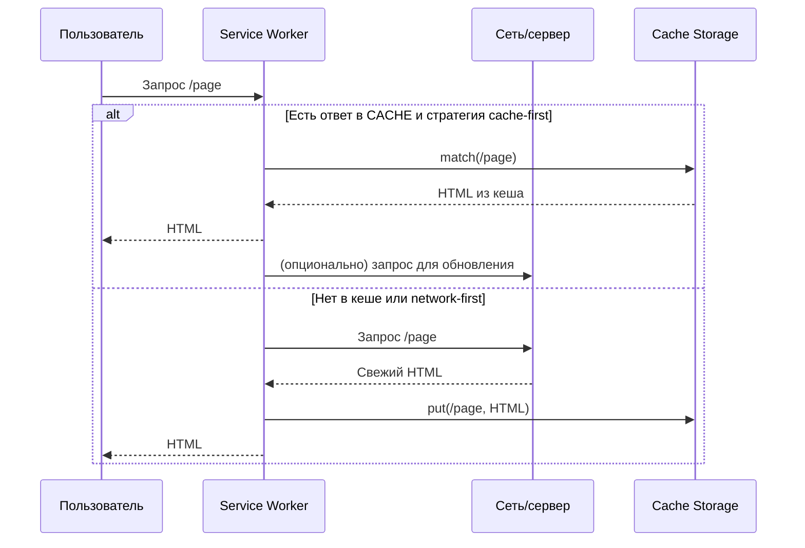

[← Назад к индексу части 24](index.md)

## 24.2. PWA: сервис‑воркеры, кэширование и оффлайн

### Цель раздела

Научиться **осознанно проектировать PWA‑поведение**: как работает service worker, как кэшировать HTML/ассеты/данные, как поддерживать оффлайн‑режим, не ломая консистентность и безопасность.

### В этом разделе главное

- PWA — это **надстройка над архитектурой рендеринга**, а не её замена.
- Service worker даёт **программируемый контроль над сетью и кэшем**.
- Существуют разные **стратегии кэширования**:
  - cache‑first,
  - network‑first,
  - stale‑while‑revalidate и др.
- Оффлайн‑режим требует **чётких границ**: что можно показывать из кеша, а для чего нужна строгая свежесть.
- PWA особенно полезна для:
  - мобильных пользователей,
  - плохой сети/оффлайна,
  - повторяющихся задач (таблицы, формы, справочники).

### Термины

- **Web App Manifest** — JSON‑файл с метаданными PWA (название, иконки, цвет, start URL).
- **Cache Storage** — API браузера для хранения закэшированных ответов (HTML/JS/CSS/JSON).
- **Background sync** — возможность отложенно отправить данные на сервер, когда сеть появится.

### Теория и правила

#### 1) Жизненный цикл service worker

Важные фазы:

1. **Регистрация** (из приложения):
   - вызывается `navigator.serviceWorker.register('/sw.js')`;
   - браузер скачивает `sw.js` и начинает установку.
2. **Установка (`install`)**:
   - хорошее место, чтобы **создать кэши и положить туда критичные ресурсы** (иконки, CSS, базовый HTML);
   - если установка не завершилась (`event.waitUntil` упал с ошибкой) — старый SW продолжает работать.
3. **Активация (`activate`)**:
   - можно **удалить старые кэши**, мигрировать данные;
   - с этого момента новый SW начинает перехватывать запросы (для подходящих scope).
4. **Работа (`fetch`, `sync`, `push` и др.)**:
   - каждый сетевой запрос проходит через SW (если попадает в его область);
   - логика обработки запросов и кэша живёт здесь.

#### 2) Стратегии кэширования (паттерны)

Самые часто используемые:

- **Cache‑First**  
  1. Сначала пытаемся найти ответ в `caches.match(request)`.  
  2. Если нашли — возвращаем немедленно.  
  3. Если нет — идём в сеть и при успехе кладём ответ в кэш.  
  Хорошо для: статики (иконки, шрифты, CSS, неизменяемые бандлы).

- **Network‑First**  
  1. Сначала пытаемся получить ответ из сети (`fetch`).  
  2. Если сеть недоступна или произошла ошибка — пробуем достать ответ из кэша.  
  Хорошо для: данных, где **важна свежесть** (новости, баланс, список задач).

- **Stale‑While‑Revalidate**  
  1. Если есть ответ в кэше — сразу отдаём его пользователю (быстро).  
  2. Параллельно в фоне делаем запрос в сеть.  
  3. Если сеть вернула новый ответ — обновляем кэш (в следующий раз пользователь увидит свежее).  
  Хорошо для: квази‑статических данных, где «чуть устаревшее ок» (статьи, карточки товаров, конфигурация).

- **Cache‑Only / Network‑Only**  
  Встречаются реже; полезны как крайние случаи (например, кэш‑только для оффлайн‑страницы ошибки).

Практическое правило: **стратегия зависит не от технологии, а от домена данных**. Один и тот же PWA может использовать:

- cache‑first для ассетов и документации,
- stale‑while‑revalidate для каталога,
- network‑first для корзины и баланса.

#### 3) Оффлайн‑паттерны

Типичные архитектурные решения:

- **Offline fallback**: при отсутствии сети:
  - отдаём специальную HTML‑страницу «Вы оффлайн» с базовой навигацией и локальным кэшем;
  - или последний успешный снимок нужной страницы (если это безопасно).
- **Queued writes (очередь записей)**:
  - при отправке формы/изменении состояния запрос пишется в локальную очередь (IndexedDB/Cache + метаданные),
  - SW с `background sync` отправляет запросы при восстановлении сети,
  - UI должен показывать статусы: «отправлено», «в очереди», «ошибка доставки».
- **Read‑through cache**:
  - чтения идут через SW, который:
    - может вернуть данные из кэша,
    - при возможности обновляет их из сети.

#### 4) Ограничения и безопасность

- Service worker **ограничен по домену и пути** (scope), не работает по HTTP, только по HTTPS (и на `localhost`).
- Кэш живёт **в браузере пользователя**:
  - нельзя на него полагаться как на единственный источник истины;
  - при смене устройства/браузера всё начинается с нуля.
- Нельзя кэшировать «как есть»:
  - токены, приватные данные, большие объёмы чувствительной информации;
  - то, что может нарушить регуляторику (PII, финансовые записи) без отдельного анализа.

### Простыми словами

PWA превращает твой сайт в «инсталлируемое приложение», у которого есть:

- «кладовая» (Cache Storage),
- «менеджер сети» (service worker),
- «паспорт» (manifest).

Они вместе позволяют:

- работать без сети (частично),
- обновляться управляемо,
- показывать пользователю «почти нативный» опыт.

### Картинка в голове



### Как запомнить

- **PWA = контролируемый кеш + оффлайн + интеграция с устройством.**
- Стратегии кэширования нужно выбирать **по типу данных**:
  - документация/иконки → агрессивный кеш;
  - баланс/корзина → аккуратный, network‑first.

### Примеры (упрощённые)

Фрагмент регистрации service worker:

```js
if ('serviceWorker' in navigator) {
  navigator.serviceWorker.register('/sw.js');
}
```

Простой `sw.js` с cache‑first для статики:

```js
const STATIC_CACHE = 'static-v1';

self.addEventListener('install', (event) => {
  event.waitUntil(
    caches.open(STATIC_CACHE).then((cache) =>
      cache.addAll(['/index.html', '/styles.css', '/bundle.js'])
    )
  );
});

self.addEventListener('fetch', (event) => {
  event.respondWith(
    caches.match(event.request).then((cached) => {
      if (cached) return cached;
      return fetch(event.request);
    })
  );
});
```

### Практика / реальные сценарии

- **Справочник/каталог**, который пользователи часто открывают на мобильных:
  - HTML+стили+основные данные кешируются;
  - при оффлайне показывается последний известный снимок.
- **Форма заявок**:
  - данные сохраняются локально,
  - при появлении сети отправляются через background sync.

### Пошагово: проектируем PWA‑слой для приложения

Сценарий: у нас есть каталог и форма обратной связи, нужно добавить PWA‑поведение.

1. **Определи зоны и данные**:
   - статика (иконки, CSS, общий layout),
   - каталог (карточки товаров/статей),
   - форма (заявка/обратная связь).
2. **Для каждой зоны выбери стратегию кэша**:
   - ассеты → cache‑first,
   - каталог → stale‑while‑revalidate,
   - форма → network‑first для чтения, очередь записей для отправки.
3. **Спроектируй fallback**:
   - что пользователь увидит в оффлайне:
     - список последних просмотренных элементов каталога,
     - сообщение о том, что новые элементы пока недоступны.
4. **Спроектируй политику обновлений**:
   - как часто обновлять кэши,
   - как уведомлять пользователя о новой версии приложения (например, баннер «Доступна новая версия, перезагрузить?»).
5. **Подумай про бизнес‑инварианты**:
   - где устаревшие данные допустимы (каталог, документация),
   - где нет (баланс, статусы заказов).
6. **Добавь мониторинг**:
   - логирование ошибок SW,
   - метрики попаданий/промахов кэша,
   - наблюдение за количеством оффлайн‑операций и их успехом.

### Типичные ошибки

- Кэшировать **слишком много и навсегда**:
  - пользователь годами видит старые данные.
- Кэшировать **персональные и чувствительные данные** без сегментации и шифрования.
- Не продумывать путь **миграции кеша** (смена схемы данных, формат JSON и т.п.).

### Что будет, если…

- …сделать PWA для банковского приложения и агрессивно кэшировать баланс и историю?  
  Можно получить рассинхронизацию, показ неверных сумм и сложные инциденты: пользователь видит одно, сервер знает другое.

### Проверь себя

1. Какие типы ресурсов можно кэшировать агрессивно, а какие — только с осторожностью?  
2. В чём разница между стратегиями cache‑first и network‑first?  
3. Почему PWA нельзя рассматривать как «бесплатное ускорение» без архитектурных решений?

<details><summary>Ответ</summary>

1. Агрессивно: иконки, шрифты, CSS, редко меняющиеся статьи/документация. Осторожно: данные о деньгах, корзина, приватные данные, любые быстро меняющиеся бизнес‑данные.  
2. Cache‑first: сначала пытаемся взять из кеша, сеть используем как fallback/для обновления; хорошо для статики. Network‑first: сначала сеть, кеш — как резерв; хорошо для данных, где важна свежесть.  
3. Потому что PWA:
   - добавляет свои failure‑моды (битый кеш, зависший service worker),
   - требует продуманной стратегии консистентности,
   - может конфликтовать с требованиями безопасности и регуляторики.

</details>

### Запомните

- PWA — мощный инструмент, но он **усложняет архитектуру кэшей и оффлайна**; применять её нужно там, где выгода превышает эту сложность.

---
