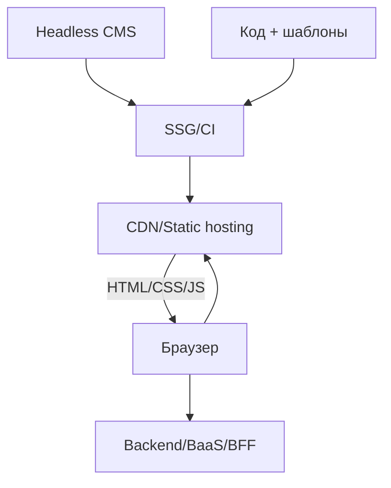
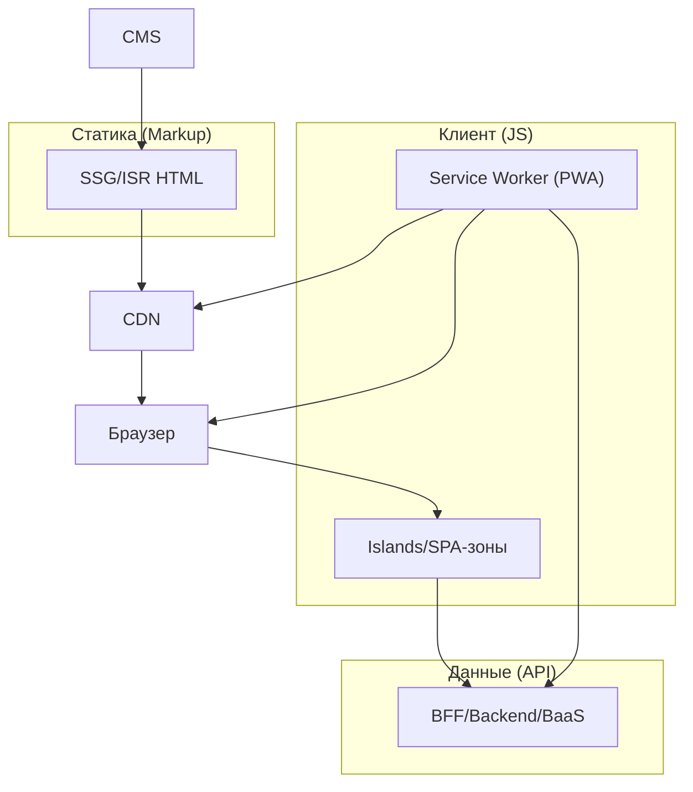

[← Назад к индексу части 24](index.md)

## 24.3. JAMstack и гибридные архитектуры на Islands/PWA

### Цель раздела

Понять **JAMstack как архитектуру**, уметь разложить по полочкам: где генерируется HTML, где живут данные, как работает интерактивность и PWA‑слой; научиться проектировать гибриды для реальных продуктов.

### В этом разделе главное

- JAMstack = **JS + API + Markup**:
  - Markup (HTML) → SSG/ISR + CDN,
  - API → backend/BaaS/BFF,
  - JS → islands/PWA/SPA‑зоны.
- JAMstack хорошо подходит для:
  - документации,
  - блогов,
  - маркетинговых сайтов с отдельным SPA‑кабинетом.
- Важные элементы:
  - **CDN/edge** — главный «сервер» HTML,
  - **дешёвый горизонтальный масштаб** (много статики),
  - **чёткое разделение публичных и авторизованных зон**.

### Термины

- **Headless CMS** — CMS без собственного фронтенда: отдаёт контент через API.
- **Edge Functions** — функции, работающие на границе (CDN), для лёгкой логики (A/B‑тесты, персонализация).

### Теория и правила

#### 1) Базовая схема JAMstack‑сайта

#### 2) Где здесь Islands и PWA

- Islands:
  - в HTML (сгенерированном SSG) есть точки для островов (поиск, комментарии, калькулятор);
  - острова тянут данные из API.
- PWA:
  - service worker:
    - кэширует HTML/ассеты,
    - может кэшировать данные API,
    - даёт оффлайн для части функционала.

#### 3) Гибридные архитектуры

- **Документация + кабинет**:
  - документация → JAMstack (SSG+Islands+PWA),
  - кабинет → SPA/SSR с отдельным бекендом, зависит от тех же API.
- **Интернет‑магазин**:
  - маркетинг, категории → JAMstack/ISR,
  - корзина, чекаут → SSR/SPA/BFF,
  - PWA для кэширования каталога и частично для корзины (с осторожностью).

#### 4) Эволюция и миграция

В реальных проектах редко «сразу попадают» в идеальную JAMstack‑архитектуру. Чаще путь такой:

1. **Старт с простого SSR/SPA**:
   - один репозиторий, один бекенд/фронтенд;
   - маркетинговые страницы и кабинет живут вместе.
2. **Выделение публичной части в SSG/ISR**:
   - маркетинг и документация выносятся в отдельное приложение (Astro/Next/Nuxt),
   - деплой через CDN,
   - бекенд остаётся для кабинета.
3. **Добавление Islands и PWA**:
   - интерактивность на публичных страницах переходит в острова,
   - PWA добавляет оффлайн для docs/блога.
4. **Тонкая настройка BFF/edge‑слоя**:
   - BFF/edge‑функции агрегируют данные,
   - «подмешивают» лёгкую персонализацию (A/B‑тесты, рекомендации) без ломки статики.

Важно: на каждом шаге нужно **держать в голове contract‑границы**:

- какие URL обслуживаются как статика,
- где начинается авторизованный SPA/SSR,
- через какие API идут данные.

### Простыми словами

JAMstack — это подход «**давайте сделаем как можно больше статики и вынесем всё динамическое в API и отдельные острова**», а уже поверх этого:

- раздаём всё через CDN,
- добавляем PWA для оффлайна,
- по‑минимуму держим «живой» сервер HTML.

### Картинка в голове

### Примеры

- **Astro + Headless CMS (Contentful, Strapi)**:
  - статические страницы документации/блога,
  - islands для поиска и комментариев,
  - PWA для оффлайна статей.
- **Next.js на Vercel**:
  - SSG/ISR для публичных страниц,
  - API Routes/BFF для данных,
  - SPA/SSR для `/app`‑зоны,
  - PWA поверх всего.

### Практика / реальные сценарии

- **Миграция существующего монолита**:
  - у вас есть крупный MPA/SSR‑сайт на традиционном фреймворке (Django/Rails/Laravel);
  - вы постепенно выносите публичные страницы в JAMstack‑приложение:
    - сначала главная и блог,
    - затем лендинги продуктов;
  - кабинет и сложные формы остаются на исходном стеке до отдельной миграции.
- **Партнёрские интеграции**:
  - публичная документация по API и примеры SDK → JAMstack,
  - партнёрский кабинет с отчётами → SPA/SSR;
  - единый BFF/логин, но разные фронтенды.

### Типичные ошибки

- Пытаться **запихнуть весь продукт в JAMstack**, включая сложный авторизованный кабинет.
- Не разделять:
  - публичные и приватные страницы,
  - статику и динамику.
- Отсутствие плана:
  - как будут **мигрировать данные и кеши** при изменении схемы;
  - как мониторить **ISR/SSG‑ошибки**.

### Что будет, если…

- …сделать интернет‑магазин «полным JAMstack» без отдельного канала для корзины и чекаута?  
  Скорее всего, бизнес‑логика и безопасность начнут протекать в client‑side JS и service worker, а не жить в централизованном бекенде/BFF; это усложнит контроль, тестирование, безопасность и аудит.

### Проверь себя

1. В чём ключевые плюсы JAMstack по сравнению с классическим SSR для публичных страниц?  
2. Какие типы страниц/зон **плохо подходят** для JAMstack?  
3. Как бы ты разделил(а) архитектуру для продукта «блог + платный закрытый клуб»?

Ответ

1. Плюсы:
   - дешёвый и надёжный деплой через CDN,
   - простое горизонтальное масштабирование,
   - быстрый TTFB/LCP за счёт статики,
   - меньше «живого» серверного кода, который нужно поддерживать 24/7.  
2. Плохо подходят:
   - сильно персонализированные зоны с высокой динамикой (кабинет, админка),
   - сложные транзакционные сценарии (чекаут, финансовые операции),
   - системы, где важна строгая консистентность в реальном времени.  
3. Блог → JAMstack (SSG/Islands/PWA), закрытый клуб → авторизованная SPA/SSR‑зона с отдельным бекендом/BFF, при этом статические страницы клуба (описания, правила) всё ещё могут быть JAMstack.

### Запомните

- JAMstack — это **архитектурный паттерн вокруг статики, API и JS**, а не конкретный фреймворк.
- Хороший JAMstack‑дизайн почти всегда **сосуществует** с классическим SPA/SSR/MPA для сложных зон.

---
