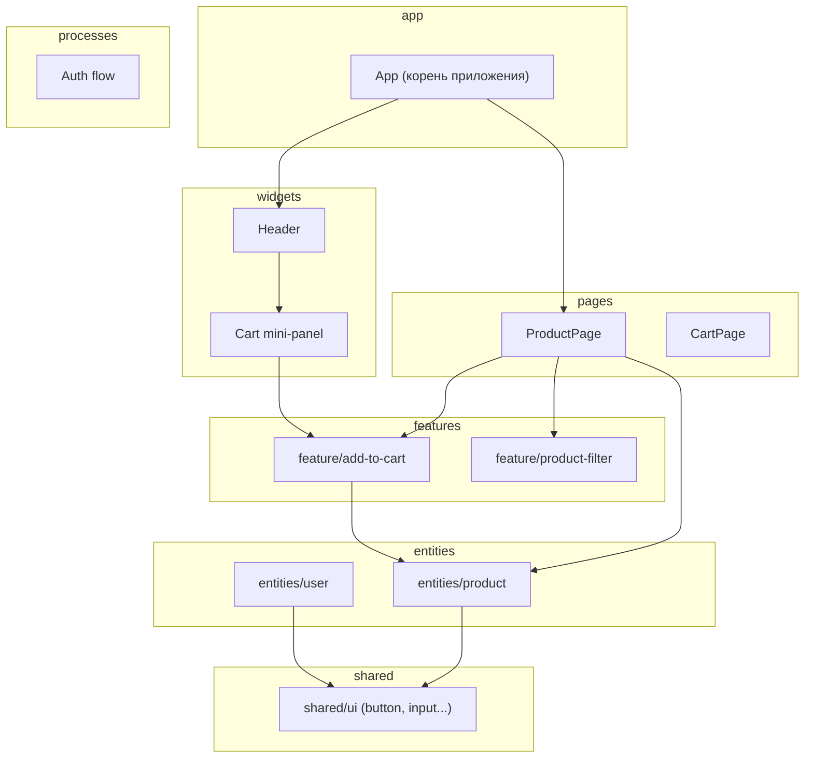
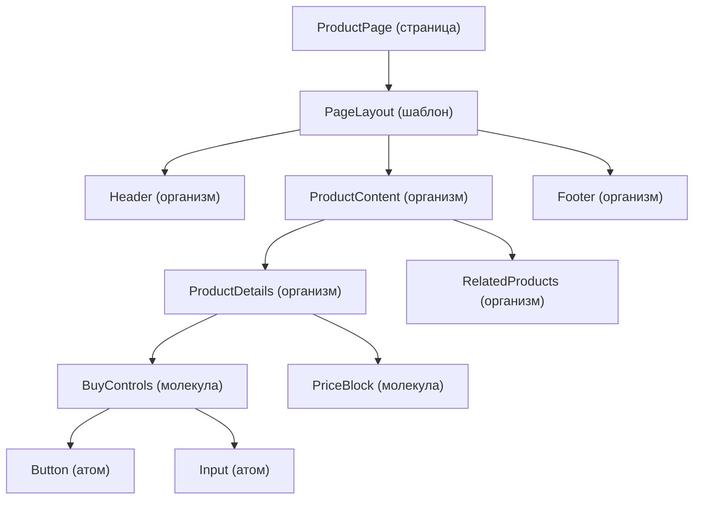
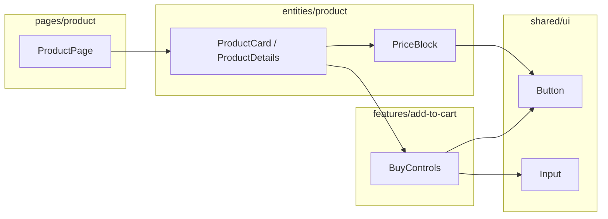

[← Назад к индексу части 25](index.md)

## 25.1. Иерархия компонентов: Atomic Design, FSD и аналоги

### Цель раздела

Сформировать понятную и практическую модель **иерархии компонентов**: от атомов и молекул до организмов и страниц, связать её с файловой структурой проекта (FSD, folder‑by‑feature) и понять, как не превратить эту модель в избыточную бюрократию.

### В этом разделе главное

- Компоненты удобно рассматривать **иерархически**: от маленьких кирпичиков до целых страниц — это помогает мыслить архитектурно, а не «по файлам».  
- **Atomic Design** — полезный образ, но не догма: его цель — разделение по **ответственности и уровню переиспользования**, а не строгое соблюдение названий.  
- Современные архитектуры фронтенда (например, **Feature‑Sliced Design**) фокусируются на **фичах и слоях**, а не только на атомах/молекулах.  
- Важно разделять **дерево компонентов в памяти** (runtime) и **структуру папок** (code structure) — они связаны, но не тождественны.  
- Избыточная иерархия (слишком много слоёв) так же вредна, как и полное её отсутствие.

### Термины

- **Atomic Design** — модель организации UI‑компонентов по уровням абстракции: атомы, молекулы, организмы, шаблоны, страницы.  
- **FSD (Feature‑Sliced Design)** — архитектура, где основной принцип организации — **фичи и слои**, а не типы файлов.  
- **Folder‑by‑type** — структура «по типам артефактов» (`components/`, `services/`, `store/`), часто удобна в маленьких проектах.  
- **Folder‑by‑feature** — структура «по фичам/сущностям» (`features/cart`, `entities/user`), хороша для крупных проектов и разделения ответственности.  
- **Организм** — компонент, который часто уже связан с конкретной **фичей** (форма заказа, карточка товара с кнопкой купить и т.п.).

### Теория и правила

#### 1) Уровни Atomic Design (практический взгляд)

Интуитивная лестница:

- **Атомы** — базовые элементы:
  - `Button`, `Icon`, `Input`, `Checkbox`, `Typography/Text`;
  - минимум логики, максимум переиспользования.
- **Молекулы**:
  - небольшие комбинации атомов с одной задачей;
  - примеры: `SearchField` (input + button + icon), `LabeledInput` (label + input + error).
- **Организмы**:
  - крупные блоки страницы;
  - примеры: `ProductCard`, `Header`, `Footer`, `OrderForm`.
- **Шаблоны**:
  - схемы расположения организмов на странице (`ProductPageLayout`, `DashboardLayout`);
  - знают, **где** что находится, но мало знают **о данных**.
- **Страницы**:
  - конкретные маршруты приложения (`ProductPage`, `OrdersPage`);
  - связывают шаблоны и данные (часто через контейнеры).

Важно: это **модель мышления**, а не обязательные папки `atoms/`, `molecules/` в каждом проекте.

#### 2) Где здесь FSD, вертикальные срезы и folder‑by‑feature

Atomic Design описывает **горизонтальный разрез по уровню абстракции**. FSD добавляет **вертикальный разрез по фичам и слоям** — то, что часто называют **вертикальными срезами (vertical slices)**: «кусок системы от UI до данных вокруг одной фичи».

Упрощённая схема FSD:

Здесь:

- атомы/молекулы чаще всего живут в `shared/ui` (или аналогичном слое);
- организмы и шаблоны — в `widgets/`, `pages/`, `features/`, `entities/`;
- FSD определяет **границы импортов** (например, `features` не должен импортировать `pages`).

#### 3) Связь дерева компонентов и файловой структуры

Важно разделять:

- **Runtime‑дерево компонентов** — то, как компоненты вложены **во время исполнения** (в памяти, в DOM);
- **Структуру папок/модулей** — то, как код организован **в репозитории**.

Они связаны, но:

- один и тот же компонент может быть переиспользован в разных местах дерева;
- в файловой структуре мы часто группируем по **фичам и слоям**, а не только по иерархии.

Практическое правило:

- для **маленького проекта** (1–2 человека, простое приложение) достаточно:
  - `components/` (базовые и общие компоненты),
  - `features/` или просто `pages/` с локальными компонентами;
- для **крупного продукта** имеет смысл:
  - FSD или аккуратный folder‑by‑feature;
  - отдельный слой для общих UI‑атомов/молекул (дизайн‑система).

#### 4) Когда Atomic Design избыточен

Типичные признаки:

- маленькая команда, простой продукт (5–10 страниц, пара форм);  
- много «формальных» уровней (`atoms`, `molecules`, `organisms`), но:
  - папки пустые или почти пустые;
  - разработчики тратят время на споры «к какому уровню это отнести», а не на ценность.

В таких случаях достаточно:

- **презентационные компоненты** (`ui/`, `components/`);
- **фичевые компоненты** (`features/`, `pages/`);
- здравого смысла: «этот компонент должен быть переиспользуемым?» → если да, вынести в общее `ui`.

#### 5) MVC, MVVM, MVI и компонентная архитектура

Эти аббревиатуры описывают **распределение ролей между частями приложения**:

- **MVC (Model–View–Controller)**:
  - *Model* — данные и бизнес‑логика;
  - *View* — отображение (UI);
  - *Controller* — связывает ввод пользователя, модель и обновление view.
- **MVVM (Model–View–ViewModel)**:
  - *View* — «тонкий» слой отрисовки;
  - *ViewModel* — состояние и логика представления (подготовка данных для View, команды);
  - часто используется в фреймворках с биндингами (Angular, Vue, Knockout‑подходы).
- **MVI (Model–View–Intent)**:
  - единый поток: Intent (намерение пользователя) → Model (состояние) → View (отображение);
  - популярно в односторонних потоках данных (Redux‑подходы, Elm‑подобные архитектуры).

Как это соотносится с компонентами:

- **презентационные компоненты** чаще всего — это **View**;
- **контейнеры, хуки и сторы** — это **Controller / ViewModel / часть Model**, в зависимости от стиля;
- при MVI‑подходе:
  - контейнер собирает Intents (события UI),
  - обновляет Model (store),
  - View подписывается на состояние и просто перерисовывается.

Важно: в современном фронтенде эти паттерны **не заменяют компонентную архитектуру**, а **накладываются поверх** неё. Компоненты — базовые строительные блоки; MVC/MVVM/MVI помогают договориться, **где живёт состояние и логика** относительно этих блоков.

### Пошагово: как разложить страницу на уровни

Возьмём пример страницы товара:

- шапка (логотип, навигация, корзина);  
- основной блок: фото, название, цена, описание, кнопка «В корзину»;  
- блок «Похожие товары»;  
- подвал.

Пошаговый разбор:

1. **Нарисуй дерево компонентов словами.**  
   - Страница: `ProductPage`.  
   - Внутри: `PageLayout` (шапка + контент + подвал).  
   - В шапке: `Header`, внутри него `Logo`, `MainNav`, `CartSummary`.  
   - В контенте: `ProductDetails`, `RelatedProducts`.  
2. **Определи организмы.**  
   - `Header`, `ProductDetails`, `RelatedProducts`, `Footer`.  
3. **Определи молекулы.**  
   - В `ProductDetails`: `PriceBlock`, `BuyControls` (количество + кнопка).  
   - В `Header`: `NavLink`, `CartIconWithBadge`.  
4. **Определи атомы.**  
   - `Button`, `Input`, `Icon`, `Text`, `Badge`.  
5. **Пойми, что должно быть переиспользуемым.**  
   - `Button`, `Input`, `Text` → atoms в `shared/ui`.  
   - `PriceBlock`, `BuyControls` → молекулы, возможно в `entities/product` или `features/add-to-cart`.  
   - `ProductCard` / `ProductDetails` → организмы, в `entities/product` или `widgets/`.

Это уже архитектурное решение: **где провести границу между «общим UI» и «фичами»**.

### Простыми словами

Думай о компонентах как о **кирпичиках и блоках**:

- атомы — отдельные кирпичики (кнопка, инпут);  
- молекулы — небольшие функциональные блоки (поисковая строка);  
- организмы — большие блоки комнаты (стена с окном, кухонный гарнитур);  
- шаблоны — план квартиры (где какая стена и комната);  
- страницы — конкретная квартира с мебелью и людьми.

Твоя задача как архитектора — решить:

- какие кирпичики стоит стандартизировать (atoms/ui);  
- какие блоки должны быть общими между комнатами (widgets/features/entities);  
- какие комнаты (страницы) имеют уникальный план.

### Картинка в голове

#### Дерево компонентов для страницы товара

#### Связь уровней с FSD

### Как запомнить

- **Atomic Design** отвечает на вопрос «**насколько этот компонент общий и мелкий**».  
- **FSD / folder‑by‑feature** отвечает на вопрос «**к какой фиче и слою он относится**».  
- Не обязательно создавать папку `atoms/` ради одного `Button` — важнее **понимать уровень абстракции** и границы переиспользования.

### Примеры

- В небольшом админском SPA:
  - `components/Button.tsx`, `components/Input.tsx`, `components/Card.tsx` — условные атомы/молекулы;
  - `pages/OrdersPage.tsx` → локальные организмы и молекулы внутри страницы;
  - отдельная папка `design-system/` может быть избыточной.  
- В крупном B2B‑продукте:
  - отдельная репа/пакет `ui-kit` с атомами/молекулами;
  - основное приложение использует `entities/`, `features/`, `widgets/`, `pages/` (FSD);
  - дизайн‑система разворачивается как отдельный артефакт (Storybook, документация).

### Практика / реальные сценарии

- **Миграция от хаотичных компонентов к иерархии.**  
  - Было: папка `components/` с 200 файлами, названия вроде `BigForm`, `NewBigForm`, `UserCard2`.  
  - Становится:  
    - `shared/ui/Button`, `Input`, `Modal`;  
    - `entities/user/UserCard`, `UserAvatar`;  
    - `features/user-profile/EditProfileForm`;  
    - `pages/user/UserProfilePage`.  
  - Выигрыш: проще искать, переиспользовать, обсуждать архитектурно.

- **Выбор между folder‑by‑type и folder‑by‑feature.**  
  - Для проекта с 3–4 фичами folder‑by‑type может быть достаточно.  
  - При росте фич и команд folder‑by‑feature или FSD почти неизбежен, чтобы каждый знал «свою полку».

### Типичные ошибки

- Пытаться **строго следовать Atomic Design** во всём:
  - спорить, является ли `Card` атомом или молекулой, вместо обсуждения ответственности;
  - плодить пустые папки `organisms`, `templates` ради формальности.  
- Полное отсутствие структуры:
  - все компоненты свалены в одну папку;
  - повторяющиеся паттерны не выделены в общие компоненты.  
- Смешивать слои:
  - атомы, которые знают о доменной логике (`UserStatusButton` в `shared/ui`);
  - организмы, которые живут в `shared/ui`, хотя завязаны на конкретную фичу.

### Что будет, если…

- …игнорировать иерархию и складывать всё в одну папку `components/`?  
  Со временем компоненты становятся **всё толще и всё более связаны друг с другом**. Любая правка в одном месте ломает другое; новые разработчики тратят много времени на поиск нужного куска и боятся рефакторить.

### Проверь себя

1. Сможешь ли ты устно разложить страницу «список заказов + фильтры + пагинация» на атомы, молекулы, организмы и страницы?  
2. Как бы ты разместил(а) `OrderCard` и `OrderFilters` в FSD‑структуре (какие слои/папки)?  
3. В каком случае ты бы решил(а), что Atomic Design в явном виде (папки `atoms/`, `molecules/`) вам **не нужен**?

Ответ

1. Примерный ответ:
   - страница: `OrdersPage`;  
   - организмы: `OrdersTable`, `OrdersFiltersPanel`, `PaginationBar`;  
   - молекулы: `OrderRow`, `FilterGroup`, `PageSizeSelector`;  
   - атомы: `Button`, `Input`, `Select`, `Checkbox`.  
2. `OrderCard`/`OrderRow` — в `entities/order`. `OrderFilters` — в `features/order-filters` или `features/orders`, если это фича. Страница `OrdersPage` — в `pages/orders`.  
3. Если у вас небольшой проект, 1–2 разработчика и нет планов на общую дизайн‑систему, явные папки `atoms/`, `molecules/` часто создадут только бюрократию. Достаточно логично разделять `ui/` и `features/` и следить за ответственностью компонентов.

#### Дополнительные вопросы по подпунктам раздела 25.1

1. Как связаны уровни Atomic Design (атомы/молекулы/организмы) с FSD‑слоями `shared/ui`, `entities`, `features` и почему важно не путать «общий UI» с доменными компонентами?  
2. В чём практическое отличие folder‑by‑type и folder‑by‑feature при работе над одной и той же фичой, например «корзина», и как это влияет на онбординг новых разработчиков?  
3. Как в терминах MVC/MVVM/MVI ты бы описал(а) роль контейнеров, хуков и презентационных компонентов в современном React/Vue‑приложении?

Ответ

1. В типичной FSD‑структуре:
   - атомы и простые молекулы лежат в `shared/ui` (Button, Input, LabeledInput);  
   - организмы и более «толстые» молекулы чаще живут в `entities/*` и `features/*` (ProductCard, OrderFilters).  
   Если доменный компонент (`OrderCard`) поместить в `shared/ui`, он начнёт использоваться как будто он универсальный, хотя на самом деле завязан на бизнес‑объект — это усложнит переиспользование и сделает код менее очевидным.  
2. При folder‑by‑type код корзины оказывается размазан: компоненты в `components/`, логика в `services/` и `store/` и т.п. Новому человеку сложно собрать картину по фиче. При folder‑by‑feature (`features/cart`) всё, что относится к корзине, колоцировано, проще понять границы фичи и быстрее вносить изменения без риска залезть в чужой функционал.  
3. Упрощённо:
   - презентационные компоненты играют роль **View**;  
   - контейнеры и хуки вокруг конкретной фичи — это смесь **Controller/ViewModel** (обработка событий, подготовка данных для View);  
   - глобальный store/кэш данных (Redux, React Query и т.п.) — часть **Model**.  
   В MVI‑вариантах интенты приходят из UI (презентационных компонентов) в контейнер/Model, там обновляется состояние, а View просто подписана и перерисовывается.

### Запомните

- Иерархия компонентов — это **инструмент мышления**, а не религия.  
- Atomic Design помогает понять **уровень абстракции и переиспользования**; FSD — **принадлежность к фиче и слою**.  
- Начинай с простого деления, постепенно уточняя иерархию по мере роста продукта.

---
