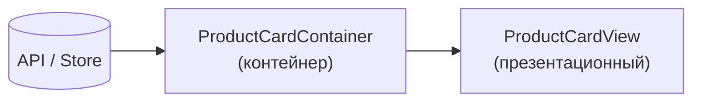
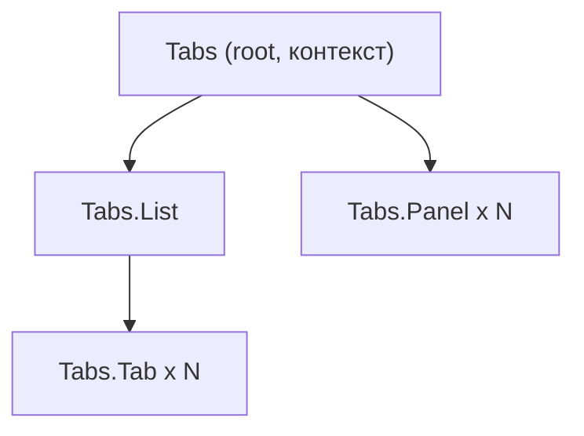

[← Назад к индексу части 25](index.md)

## 25.2. Контейнеры, презентационные и составные компоненты

### Цель раздела

Научиться **разделять данные и представление во фронтенде** через паттерн контейнер/презентационный компонент, использовать композицию и составные компоненты, уменьшать пропс‑дриллинг и повышать переиспользуемость и тестируемость UI.

### В этом разделе главное

- **Презентационные компоненты** знают только про внешний вид и пропсы, а **контейнеры** — про данные и источники (API, store, роутер).  
- Разделение упрощает:
  - переиспользование компонентов в разных контекстах,
  - тестирование и Storybook,
  - постепенный рефакторинг логики.  
- **Compound components** и композиция (`children`, slots, render‑props) дают гибкий API без жёстких пропс‑цепочек.  
- Пропс‑дриллинг — сигнал к пересмотру архитектуры: нужны контекст, составные компоненты или выделение фич.  
- «Божественный» компонент, который и ходит в API, и управляет роутингом, и рисует огромный UI — архитектурный запах.

### Термины

- **Презентационный компонент (presentational)** — компонент, который:
  - получает данные и колбэки через пропсы,
  - не знает о глобальном store, API, роутере,
  - часто живёт в `ui/` или `shared`.  
- **Контейнер (container)** — компонент, который:
  - подключает store, хуки, API, роутинг,
  - подготавливает данные и передаёт их в презентационные компоненты.  
- **Prop drilling** — «сверление пропсами»: когда пропсы передаются через множество промежуточных компонентов, которым они не нужны.  
- **Compound components** — набор связанных компонентов с общим контекстом (`Tabs`, `TabList`, `Tab`, `TabPanel`), позволяющий создавать гибкую иерархию.  
- **Render‑props / slots / children‑as‑a‑function** — приёмы композиции, когда родитель отдаёт управление отрисовкой дочерних элементов.

### Теория и правила

#### 1) Презентационные компоненты

Признаки:

- принимают **все данные через пропсы**;
- не вызывают `fetch`, не лезут в `localStorage`, не используют глобальные stores;
- не знают о роутере (`useNavigate`, `useRouter` и т.п.);
- могут быть легко показаны в Storybook с фиктивными данными.

Пример (абстрактный React‑подобный код):

```tsx
// ProductCardView.tsx
type ProductCardViewProps = {
  title: string;
  price: string;
  onAddToCart: () => void;
};

export function ProductCardView({ title, price, onAddToCart }: ProductCardViewProps) {
  return (
    <div className="card">
      <h3>{title}</h3>
      <p>{price}</p>
      <button onClick={onAddToCart}>В корзину</button>
    </div>
  );
}
```

Такой компонент можно использовать:

- в списке товаров,
- в рекомендательных блоках,
- в админке, где «Добавить в корзину» заменится другим действием.

#### 2) Контейнеры

Признаки:

- используют хуки/сторы/роутер:
  - `useQuery`, `useSelector`, `useDispatch`, `useNavigate` и т.п.;
- инкапсулируют **бизнес‑логику фичи**:
  - что считать успешным,
  - какие данные загрузить,
  - как обрабатывать ошибки;
- передают в презентационные компоненты:
  - готовые данные,
  - обработчики событий.

Продолжим пример:

```tsx
// ProductCardContainer.tsx
import { useProduct } from "../model/useProduct";
import { useAddToCart } from "../model/useAddToCart";
import { ProductCardView } from "../ui/ProductCardView";

export function ProductCardContainer({ productId }: { productId: string }) {
  const product = useProduct(productId);
  const addToCart = useAddToCart();

  if (product.isLoading) return <div>Загрузка…</div>;
  if (product.error) return <div>Ошибка загрузки</div>;

  return (
    <ProductCardView
      title={product.data.title}
      price={product.data.priceFormatted}
      onAddToCart={() => addToCart(productId)}
    />
  );
}
```

Здесь контейнер:

- знает про **источник данных** (`useProduct`, `useAddToCart`);  
- решает, что показывать при загрузке/ошибке;  
- отдаёт уже готовые пропсы в «чистый» UI `ProductCardView`.

Полезно помнить про **утечки абстракций**:

- если презентационный компонент начинает знать:
  - про конкретный формат ответа API,
  - про структуру глобального store,
  - про детали роутинга,  
  — значит, часть логики, которая должна жить в контейнере/модели, «просочилась» в UI‑слой.

#### 3) Compound components и контекст

Пример — вкладки:

```tsx
<Tabs value={activeTab} onChange={setActiveTab}>
  <Tabs.List>
    <Tabs.Tab value="details">Детали</Tabs.Tab>
    <Tabs.Tab value="reviews">Отзывы</Tabs.Tab>
  </Tabs.List>
  <Tabs.Panel value="details">...</Tabs.Panel>
  <Tabs.Panel value="reviews">...</Tabs.Panel>
</Tabs>
```

Архитектурно:

- `Tabs` создаёт **контекст** (activeTab, onChange);
- `Tabs.List`, `Tabs.Tab`, `Tabs.Panel` читают этот контекст;
- родительский код **композирует** структуру вкладок, не передавая пропсы по 5 уровней.

Плюсы:

- более **декларативный API**;
- меньше пропс‑дриллинга;
- логика фокусировки/клавиатурной навигации может жить внутри набора компонентов.

Такие компоненты удобно развивать и документировать в **Storybook**:

- каждая вариация Tabs/Accordion/Modal оформляется как отдельная «история»;
- команды видят единый способ использования и могут быстро ловить регрессии в API.

#### 4) Борьба с пропс‑дриллингом

Симптом:

- пропс `userId`/`theme`/`onChange` передаётся через 6 уровней вложенности, большинство компонентов просто «прокидывают» его дальше.

Инструменты:

- **контекст** (`Context` в React, `provide/inject` в Vue и аналоги);
- **compound components**;
- выделение **фичевых компонентов** ближе к месту использования;
- пересмотр архитектурных границ (этот пропс вообще должен идти так глубоко?).

Важно: контекст тоже нужно дозировать. Часть 26 подробно разберёт, когда уместен контекст, а когда — глобальный store или локальное состояние.

#### 5) Структура файлов и колокация стилей

Для поддержки компонентной архитектуры важно не только **делить ответственность логически**, но и **хранить связанные артефакты вместе**:

- компоненты и их стили (CSS Modules, `styled-components`, Tailwind‑классы) удобно держать рядом:
  - `ProductCardView.tsx` / `ProductCardView.module.css`;
  - `Button.tsx` + `button.css` или «tailwind‑классы прямо в JSX»;
- тесты и stories (для Storybook) также часто колоцируют:
  - `ProductCardView.test.tsx`;
  - `ProductCardView.stories.tsx`.

Это помогает:

- видеть **границу компонента** как одну папку/директорию;
- не разбрасывать стили и тесты по разным местам;
- проще рефакторить: в одном месте виден код, стили, тесты и документация.

### Пошагово: как разнести «толстый» компонент

Исходник (словами): есть компонент `UserProfilePage`, который:

- сам загружает профиль пользователя через API;  
- сам управляет формой изменений;  
- сам рисует сложную разметку;  
- сам показывает ошибки и уведомления.

Шаги:

1. **Выдели ответственность.**  
   - загрузка данных;  
   - UI профиля;  
   - форма редактирования;  
   - отображение ошибок/статусов.  
2. **Создай презентационные компоненты.**  
   - `UserProfileView` — показывает профиль, получает пропсы `user`, `onEditClick`;  
   - `UserProfileForm` — форма, получает `initialValues`, `onSubmit`, `onCancel`;  
   - `UserProfileLayout` — компоновка (view + форма + уведомления).  
3. **Создай контейнер(ы).**  
   - `UserProfileContainer`:
     - использует `useUserProfile` (API),  
     - решает, когда показывать `UserProfileView` и `UserProfileForm`,  
     - обрабатывает `onSubmit` (сохраняет через API).  
4. **Перенеси логику загрузки/сохранения в хуки/модель.**  
   - `useUserProfile`, `useUpdateUserProfile` — переиспользуемая логика данных.  
5. **Приведи файл к иерархии:**
   - `entities/user/ui/UserProfileView.tsx`;  
   - `features/user-profile-edit/ui/UserProfileForm.tsx`;  
   - `features/user-profile-edit/ui/UserProfileLayout.tsx`;  
   - `features/user-profile-edit/ui/UserProfileContainer.tsx`;  
   - `pages/user/UserProfilePage.tsx` — тонкий слой над контейнером.

### Простыми словами

Думай о контейнере как о **официанте**, а о презентационном компоненте — как о **тарелке с блюдом**:

- официант знает, **откуда взять еду** (кухня), и **кому её принести** (столик);  
- тарелка не знает, откуда еда, кто её заказал, каким способом оплачивали;
- тебе удобно **менять кухню или официанта**, не меняя сами блюда.

### Картинка в голове

#### Разделение контейнера и презентации



#### Compound components с контекстом



### Как запомнить

- **UI в Storybook** → презентационные компоненты.  
- **Хуки, stores, роутинг** → контейнеры и модель/логика.  
- Если компонент тяжело протестировать или показать в изоляции, он, вероятно, **слишком много знает**.

### Примеры

- Таблица заказов:
  - `OrdersTableView` — отрисовывает строки и колонки;  
  - `OrdersTableContainer` — грузит заказы, обрабатывает фильтры и пагинацию.  
- Модальное окно:
  - `Modal` (презентационный) — знает только про `isOpen`, `onClose`, контент через `children`;  
  - `DeleteOrderModalContainer` — знает, какой заказ удаляем, вызывает API, показывает статусы.

### Практика / реальные сценарии

- **Рефакторинг legacy‑SPA.**  
  - было: `Dashboard.tsx` на 1000+ строк с запросами, состоянием и UI;  
  - стало: `DashboardPage` → `DashboardContainer` (данные) → `DashboardLayout`, `DashboardWidgets` (UI) → `WidgetCard`, `StatsPanel`, `Chart` (презентационные).

- **Подготовка к переиспользованию фич в другой части продукта.**  
  - выделяем контейнеры и презентацию, чтобы можно было использовать те же UI‑компоненты в другом контексте (например, `UserCardView` и `UserCardCompactView`).

### Типичные ошибки

- Презентационные компоненты:
  - сами ходят в API;
  - напрямую используют `useSelector`/`useDispatch`/`useNavigate`;  
  - внутри спрятаны «магические» бизнес‑правила.  
- Контейнеры:
  - превращаются в «God‑компонент» с десятками хуков и колбэков;
  - не разделяют ответственность (лучше несколько маленьких контейнеров, чем один гигантский).

### Что будет, если…

- …смешивать всё в одном компоненте без разделения?  
  Любое изменение в логике или данных ведёт к массовым правкам и риску сломать UI. Переиспользовать такой компонент почти невозможно: он «пришит» к конкретному API/хранилищу/роутеру.

### Проверь себя

1. Как ты бы разнес(ла) компонент `OrderListPage`, который и грузит заказы, и рисует таблицу, и управляет фильтрами?  
2. В каком случае compound components (Tabs, Accordion) дают явное преимущество перед простым набором отдельных компонентов?  
3. Какой сигнал подаёт тебе **очень длинный список пропсов**, уходящий через несколько уровней вложенности?

<details><summary>Ответ</summary>

1. Возможный ответ:  
   - `OrderListPage` → `OrderListContainer`;  
   - `OrderListContainer` использует `useOrders`, `useOrderFilters`, формирует данные и передаёт в `OrderListView`;  
   - `OrderListView` рендерит таблицу и фильтры (презентационные компоненты `OrdersTableView`, `OrderFiltersView`).  
2. Когда нужно дать разработчику **гибкий, декларативный API**: он сам решает, сколько вкладок, какие панели, как они вложены, а внутренний контекст и поведение (фокус, клавиатура, aria‑атрибуты) остаются внутри набора компонентов.  
3. Это сигнал, что:
   - компонент, возможно, знает слишком много;  
   - часть пропсов просто прокидывается дальше (пропс‑дриллинг);  
   - стоит рассмотреть контекст, композицию или разбиение компонента на части (контейнер + UI).

</details>

#### Дополнительные вопросы по подпунктам раздела 25.2

1. Как по коду отличить, что презентационный компонент превратился в контейнер (утечка абстракции), и какие первые шаги рефакторинга ты бы предпринял(а)?  
2. В каких случаях стоит предпочесть контекст (Context/provide‑inject) для борьбы с пропс‑дриллингом, а в каких — выделить отдельный compound‑компонент или фичевый компонент ближе к месту использования?  
3. Как структура файлов (колокация компонента, стилей, тестов и stories) помогает поддерживать архитектурные границы между контейнерами, UI‑компонентами и фичами?

<details><summary>Ответ</summary>

1. Признаки утечки:
   - в компоненте, который задуман как «чистый UI», появляются `useQuery`/`useSelector`/`useNavigate` или прямые вызовы API;  
   - в нём много условной логики, завязанной на доменные сценарии.  
   Первые шаги:  
   - вынести работу с данными и побочные эффекты в контейнер или хук;  
   - оставить в презентационном компоненте только пропсы, связанные с отображением (данные и колбэки).  
2. Контекст удобен, когда:
   - одно и то же значение (тема, язык, текущий пользователь) нужно многим компонентам в поддереве;  
   - это состояние меняется не очень часто.  
   Compound‑компоненты хороши, когда есть локальная мини‑система (Tabs, Accordion, Form) с собственным контекстом и API. Фичевый компонент ближе к месту использования оправдан, если проблема пропс‑дриллинга локальна для одной фичи и не требует глобального контекста.  
3. Когда для каждой сущности есть своя папка (`FeatureX/` или `ComponentY/`) с кодом, стилями, тестами и stories, граница ответственности становится «материальной»: видно, что относится к компоненту, а что нет. Это снижает вероятность случайных сквозных зависимостей (например, когда тесты из другой фичи зависят от внутренностей компонента) и упрощает рефакторинг: можно безопасно двигать или выделять компоненты, не ломая структуру всего проекта.

</details>

### Запомните

- Разделение на контейнеры и презентационные компоненты — **базовый приём архитектуры фронтенда**, снижающий связность и повышающий тестируемость.  
- Compound components и композиция помогают строить гибкий UI без пропс‑дриллинга и захардкоженных структур.  
- Если компонент тяжело описать одной фразой «за что он отвечает» — его пора разделить.

---
