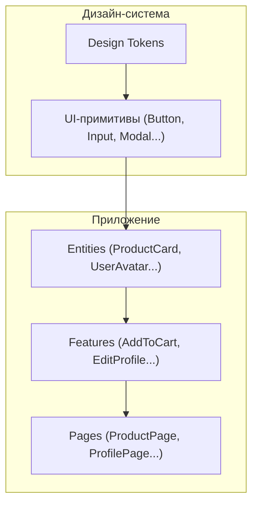
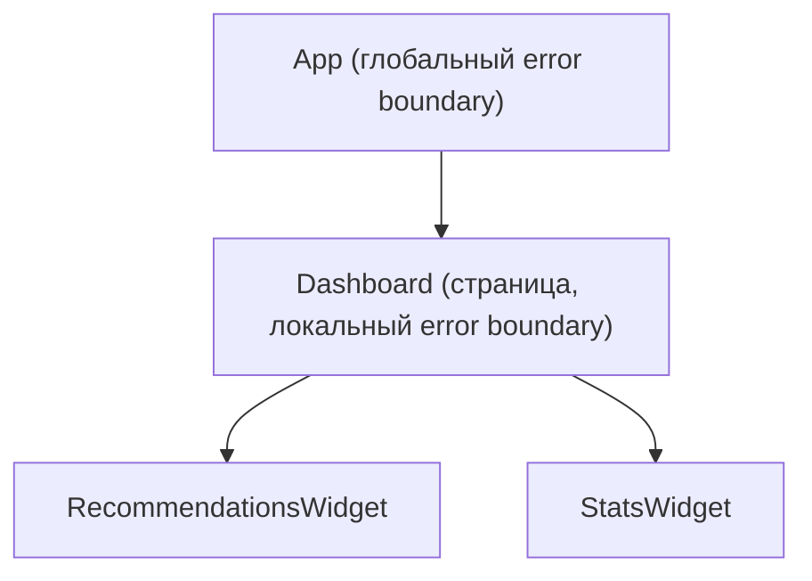

[← Назад к индексу части 25](index.md)

## 25.3. Дизайн‑системы, границы компонентов и a11y

### Цель раздела

Понять, как **компонентная архитектура становится основой дизайн‑системы**: где живут токены дизайна, какие компоненты отвечают за доступность и обработку ошибок, как проводить границы ответственности, чтобы продукт можно было масштабировать и развивать без хаоса.

### В этом разделе главное

- Дизайн‑система — это **архитектурный слой**, а не только набор стилей или Figma‑макеты.  
- Компоненты дизайн‑системы:
  - инкапсулируют a11y‑требования,
  - используют токены дизайна вместо «магических чисел»,
  - живут в отдельном слое (пакете/репо) и версионируются.  
- **Error boundaries** и похожие механизмы — это границы сбоев в дереве компонентов.  
- Важны **контракты**:
  - что компонент знает о родителе/о приложении,
  - как он сигнализирует об ошибках и состояниях,
  - какие гарантии даёт по a11y.  
- Типичные антипаттерны: «божественный» UI‑компонент, который и рисует, и ходит в API; отсутствие a11y‑требований в дизайн‑системе; хардкод стилей и текстов.

### Термины

- **Дизайн‑система** — набор UI‑компонентов, токенов, гайдлайнов и процессов, обеспечивающих единый визуальный язык и поведение продукта.  
- **Токены дизайна (design tokens)** — программируемое представление констант дизайна: цвета, отступы, шрифты, радиусы, тени и т.п.  
- **Error boundary** — компонент, который ловит ошибки рендеринга/лайфцикла дочерних компонентов и показывает fallback.  
- **A11y (accessibility)** — набор практик по доступности интерфейса (семантика, ARIA, клавиатура, контраст).

### Теория и правила

#### 1) Из чего состоит дизайн‑система

Обычно:

- **Библиотека компонентов**:
  - кнопки, инпуты, списки, модалки, табы, шаги, тосты и т.д.;
  - в идеале — независимый пакет (npm/внутренний registry).  
- **Токены дизайна**:
  - `color.primary.500`, `spacing.xs`, `radius.md`, `font.size.body`;  
  - хранятся в отдельном слое/пакете, иногда синхронизируются с Figma.  
- **Документация**:
  - Storybook/Styleguidist/Docz и т.п.;
  - гайды по использованию компонентов и паттернов.  
- **Процессы**:
  - как вносить изменения,
  - как версионировать (semver),
  - как деплоить и обновлять потребителей.

#### 2) Границы знаний компонента дизайн‑системы

Компонент дизайн‑системы **не должен знать**:

- про конкретные бизнес‑фичи,
- про конкретные API/форматы ответов,
- про доменные модели (`Order`, `User`, `Invoice`).

Он **может и должен знать**:

- про визуальный стиль и стейт UI (hover/focus/disabled/loading/error);
- про a11y‑требования:
  - роли (`role="button"`, `role="dialog"`),
  - ARIA‑атрибуты (`aria-label`, `aria-expanded`),
  - управление фокусом.

#### 3) Error boundaries и границы сбоев

В компонентной архитектуре важно уметь:

- **ограничивать влияние ошибок** в отдельных областях UI;
- обеспечивать graceful degradation (не падать целиком).

Где размещать error boundaries:

- на уровне **страниц**:
  - ошибка в одной странице не должна ломать всё приложение;  
- на уровне **виджетов/организмов**:
  - ошибка в «виджете рекомендаций» не должна ломать `ProductPage`;  
- на уровне **корня**:
  - глобальный boundary на крайний случай (логирование, общий fallback).

Граница ошибки — это **архитектурное решение**, как и граница сервиса в микросервисной архитектуре.

#### 4) Доступность (a11y) как архитектурное решение

Важно понимать:

- a11y не сводится к «проверить Lighthouse»;
- решения а‑ля:
  - использовать `button`, а не `div` с `onClick`,
  - управлять фокусом при смене страниц/модалок,
  - поддерживать клавиатурную навигацию в меню/табах,
  - задавать контраст и размеры шрифта  
  — это **архитектурные обязательства** дизайн‑системы.

Практическое правило:

- все интерактивные компоненты дизайн‑системы (кнопки, ссылки, поля, модалки, табы) должны:
  - иметь корректную семантику,
  - поддерживать клавиатуру и screen readers,
  - документироваться с точки зрения a11y.

### Пошагово: как начать дизайн‑систему

1. **Выдели повторяющиеся элементы.**  
   - Кнопки, инпуты, модалки, тосты.  
2. **Вынеси их в общий слой (`shared/ui` или отдельный пакет).**  
   - Определи базовые пропсы и стейты (`variant`, `size`, `isLoading`, `disabled`).  
3. **Введи токены дизайна.**  
   - Заменяй `#3498db`, `16px`, `4px` на `color.primary.500`, `font.size.body`, `spacing.xs`.  
4. **Добавь документацию (минимум Storybook).**  
   - Примеры использования, a11y‑заметки.  
5. **Спроектируй стратегию версионирования.**  
   - semver: `major.minor.patch`;  
   - фиксируй breaking‑changes: удалённое свойство, изменённый тип пропса;  
   - договорись о политике обновлений потребителей:
     - когда допускаются минорные «мягкие» изменения (добавление пропсов с дефолтами),
     - как коммуницируются major‑изменения (релиз‑ноуты, миграционные гайды);  
   - для монорепо — зафиксируй, какие пакеты дизайн‑системы могут обновляться независимо, а какие должны версионироваться синхронно с приложениями.  
6. **Определи, где будут error boundaries.**  
   - на уровне страниц и крупных виджетов (например, `UserDashboard`, `ProductPage`).  
7. **Встрои a11y‑требования в компоненты.**  
   - кнопки → `button` + ARIA‑атрибуты;  
   - модалки → фокус внутри, `aria-modal="true"`, управление Escape.

### Простыми словами

Дизайн‑система — это как **набор строительных блоков и инструкций**:

- блоки (компоненты) — это кирпичи, двери, окна стандартных размеров;  
- токены — стандарты: ширина дверного проёма, высота потолка, толщина стены;  
- инструкции — как эти блоки собирать, чтобы дом был безопасным и удобным;
- error boundaries — противопожарные секции: если в одной комнате пожар, весь дом не должен сгореть;
- a11y — нормы доступности (пандусы, лифты, ширина дверей), встроенные в проект.

### Картинка в голове

#### Слои дизайн‑системы и приложения

#### Границы ошибок

Ошибка в `RecommendationsWidget` должна ловиться на уровне `Dashboard`, а не ронять весь `App`.

### Как запомнить

- **Дизайн‑система = компоненты + токены + процессы.**  
- Компонент дизайн‑системы **знает про UI и a11y**, но не знает про бизнес‑домены.  
- Error boundaries — это «фьюзы» в электрической схеме: ограничивают зону аварии.

### Примеры

- Компонент `Button` в дизайн‑системе:
  - поддерживает варианты (`primary`, `secondary`, `danger`);  
  - имеет грамотно настроенные `:hover`, `:focus`, `:disabled`;  
  - использует токены цветов/отступов;  
  - документирован с точки зрения a11y (например, как использовать с иконкой без текста).  
- Error boundary для страницы:
  - логирует ошибку (Sentry/логирование);  
  - показывает fallback‑сообщение и, возможно, кнопку «Обновить страницу»;  
  - не ломает соседние страницы.

### Практика / реальные сценарии

- **Выделение дизайн‑системы из существующего приложения.**  
  - постепенно выносишь `Button`, `Input`, `Modal`, `Tabs` в отдельный пакет;  
  - заменяешь «самописные» реализации на стандартные;  
  - добавляешь токены и Storybook.  
- **Обновление дизайна.**  
  - меняешь токены (цвета, шрифты) и реализацию базовых компонентов;  
  - весь продукт обновляется единообразно без массовых правок в фичах.

### Типичные ошибки

- Компоненты дизайн‑системы:
  - начинают знать о бизнес‑логике (`OrderButton` в `ui`);  
  - тянут внутрь API/глобальный store;  
  - жёстко завязаны на один стек (например, внутрь `Button` зашит конкретный роутер).  
- Отсутствие версионирования:
  - изменения в UI‑компонентах ломают десятки экранов без контроля;  
  - нет истории изменений и миграционных гайдов.  
- Игнорирование a11y:
  - интерактивные элементы — `div` с `onClick`;  
  - отсутствие фокуса и клавиатурной навигации в модалках/меню.

### Что будет, если…

- …дизайн‑системы нет, а общие компоненты размазаны по коду?  
  Любое изменение дизайна превращается в **массовый ручной рефакторинг**: разные экраны используют разные версии кнопок, полей и модалок; баги и несогласованность накапливаются.

### Проверь себя

1. Какие компоненты в твоём (реальном или воображаемом) проекте могли бы стать основой дизайн‑системы?  
2. Где ты бы разместил(а) error boundaries и почему именно так?  
3. Как бы ты встроил(а) a11y‑требования в архитектуру компонентной библиотеки?

Ответ

1. Обычно это: `Button`, `Input`, `Select`, `Checkbox`, `Radio`, `Modal`, `Tabs`, `Tooltip`, `Toast`, `Card` и т.п. — всё, что повторяется многократно и не завязано на конкретную доменную сущность.  
2. Например: глобальный boundary вокруг всего приложения (чтобы не падать белым экраном), boundary на уровне крупных страниц/областей (Dashboard, ProductPage), возможно — на уровне отдельных тяжёлых виджетов (виджет аналитики, сложная диаграмма). Так зона падения каждой ошибки ограничена и легче диагностируется.  
3. Включить a11y в:
   - требования к компонентам дизайн‑системы (чек‑лист при ревью);  
   - документацию (как правильно использовать компоненты с точки зрения доступности);  
   - автоматические проверки (lint‑правила, тесты, Lighthouse/axe). Компонент `Button` должен сразу быть семантически правильным, чтобы потребители не дублировали a11y‑логику.

#### Дополнительные вопросы по подпунктам раздела 25.3

1. Как токены дизайна помогают уменьшить стоимость редизайна и ребрендинга, и какие риски появляются, если часть стилей всё ещё зашита «магическими значениями» в компонентах?  
2. Какие типы изменений в компоненте дизайн‑системы ты отнесёшь к `major`, `minor` и `patch` в semver и почему важно придерживаться этой градации для команд, зависящих от библиотеки?  
3. Как ты бы проверял(а) на практике, что error boundaries действительно ограничивают зону падения, а не скрывают важные ошибки или наоборот — стоят в неверных местах?

Ответ

1. Если все цвета, шрифты, отступы и радиусы вынесены в токены, редизайн часто сводится к изменению набора токенов и, возможно, нескольких базовых компонентов. Когда же часть стилей захардкожена (`#fff`, `16px`) в компонентах, приходится проходить по множеству файлов, что:
   - увеличивает стоимость и длительность редизайна;  
   - повышает риск несогласованности (часть экранов обновится, часть — нет).  
2. Примеры:
   - `patch` — фикс бага без изменения API (правка стилей, добавление недостающего ARIA‑атрибута, исправление поведения в edge‑кейсе);  
   - `minor` — добавление новых возможностей, не ломающих существующих клиентов (новый проп с дефолтным значением, новый вариант кнопки);  
   - `major` — изменения, требующие правок у потребителей (переименование пропа, изменение типа, удаление варианта компонента).  
   Строгое следование semver важно, чтобы команды могли безопасно обновляться: патч/минор — без массового рефакторинга, major — по осознанному плану с миграционным гайдом.  
3. Практически:
   - пишут интеграционные тесты или ручные сценарии, где специально провоцируются ошибки внутри виджетов/страниц;  
   - проверяют, что при ошибке в одном виджете:
     - падает и показывает fallback только этот виджет/страница,  
     - логирование срабатывает корректно,  
     - остальная часть приложения продолжает работать;  
   - анализируют логи: если глобальный boundary постоянно ловит ошибки, которые должны были отлавливаться локально, значит границы выбраны неверно (слишком мало локальных) или ошибки «утекают» через асинхронные пути.

### Запомните

- Хорошая компонентная архитектура **естественным образом ведёт к дизайн‑системе** — и наоборот.  
- Границы компонентов включают в себя не только «что рисуем», но и «как обрабатываем ошибки» и «какие гарантии по доступности даём».  
- Чем раньше выстроить слои дизайн‑системы и их контракт с приложением, тем дешевле дальнейшая эволюция продукта.

---
