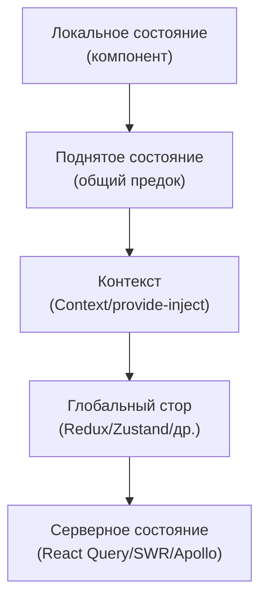
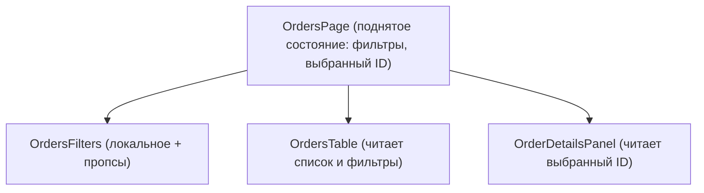

[← Назад к индексу части 26](index.md)

## 26.1. Уровни состояния во фронтенде

### Цель раздела

Понять, **какие уровни состояния бывают во фронтенд‑приложении**, как они соотносятся с **деревом компонентов** и архитектурами SPA/SSR/Islands, чем локальное состояние отличается от поднятого, контекста и глобального стора, и как не превратить всё приложение в один огромный «стор обо всём».

### В этом разделе главное

- В реальном приложении есть **несколько уровней состояния**, а не «один глобальный стор на всё».  
- **Локальное состояние** — самый дешёвый и безопасный уровень, пока оно не нужно за пределами компонента.  
- **Поднятое состояние и контекст** помогают **делиться состоянием в поддереве**, не убегая сразу в «глобальный Redux».  
- **Глобальный стор** нужен только там, где данные **реально общие** для далёких частей UI и должен обновляться предсказуемо.  
- **Серверное состояние** — отдельный тип: это **данные с сервера**, которые мы кэшируем, а не придумываем на клиенте; оно имеет свой жизненный цикл.  
- Главный навык архитектора фронтенда — **для каждой части приложения осознанно выбрать уровень состояния**, а не использовать один молоток для всех гвоздей.

### Термины

- **Компонентное дерево** — иерархия компонентов, которые образуют UI; состояние «поднимается» по этому дереву.  
- **Локальное состояние (component state)** — переменные, живущие внутри одного компонента.  
- **Поднятое состояние (lifted state)** — состояние, перенесённое в предка нескольких компонентов, чтобы они видели общие данные.  
- **Контекстное состояние** — данные, доступные многим потомкам через контекст без прокидывания пропсов.  
- **Глобальное состояние** — данные, хранящиеся в отдельном сторе, доступном из любого места приложения.  
- **UI‑состояние** — состояние, описывающее вид и поведение интерфейса, а не саму бизнес‑сущность.  
- **Серверное состояние** — данные, пришедшие с сервера, для которых сервер является источником истины.

### Теория и правила

#### 1) Лестница уровней состояния

Полезно представить уровни состояния как **лестницу от самого локального к самому глобальному**:

1. **Локальное состояние компонента** (`useState`, `useReducer` в компоненте).  
2. **Поднятое состояние у ближайшего общего предка**.  
3. **Контекст** (Context/provide‑inject, event bus внутри поддерева).  
4. **Глобальный стор** (Redux, Zustand, MobX, Pinia, effector и т.д.).  
5. **Серверное состояние / кэш** (React Query, SWR, Apollo, RTK Query).

При принятии решения:

- всегда **начинай снизу** (локальное);  
- поднимай состояние **ровно настолько, насколько нужно**;  
- переходи к контексту/глобальному стору **только если локальный/поднятый уровни уже явно неудобны**;  
- помни, что **серверное состояние — отдельная ось**: оно может жить в сторе, но лучше — в специализированном кэше.

#### 2) Где какое состояние уместно

- **Локальное (компонент)**:
  - состояние вводимых значений до отправки (форма, поиск),
  - открытие/закрытие модалок,
  - выбранная вкладка внутри отдельного виджета или таблицы,
  - временные флаги (анимация, hover, «идёт сохранение»).

- **Поднятое**:
  - список и фильтры на странице (фильтры нужны и списку, и пагинации),
  - выбранный элемент в таблице + панель деталей,
  - общие настройки зоны страницы (режим отображения, сортировка).

Отдельный, часто забываемый вопрос — **что делать со state при навигации**:

- при SPA‑роутинге (часть 27) страница может **не размонтироваться полностью**:
  - состояние останется живым при переходе на соседний роут, если он реализован как вложенный;  
- при MPA/полной перезагрузке любой state в памяти будет потерян.

Здесь появляются дополнительные паттерны:

- **keep‑alive / сохраняемые роуты**:
  - компонент страницы фактически «паркуется» в памяти и может вернуться с прежним состоянием;  
- **scroll restoration**:
  - браузер или фреймворк восстанавливает позицию скролла;  
- хранение части состояния **в роутинге**:
  - номер страницы, текущая вкладка → в query‑параметрах/фрагменте URL,  
  - текст введённого фильтра → чаще только в UI (чтобы не светить лишнее в URL).

Важно явное решение:  
**что должно «переживать» уход со страницы (keep‑alive/URL/глобальный стор), а что должно сбрасываться**. Для сложных форм и wizard‑экранов это критично (см. ниже и часть 26.3).

- **Контекст**:
  - тема (light/dark),
  - локаль,
  - текущий пользователь / токен сессии,
  - параметры окружения (feature‑флаги, AB‑варианты),
  - редко меняющиеся настройки, которые читает много компонентов.

- **Глобальный стор**:
  - авторизационное состояние (кто залогинен, его роли),
  - корзина в интернет‑магазине (если она нужна и в шапке, и в страницах),
  - кросс‑страничные фичи (уведомления, глобальные фильтры, маршруты).  

- **Серверное состояние (кэш)**:
  - список заказов, приходящий с сервера,
  - карточки товаров,
  - справочники (страны, тарифы, конфигурации),
  - данные профиля пользователя.

#### 3) Инструменты отладки состояния

Когда уровней состояния становится много, **без инструментов отладки легко запутаться**, кто и когда обновляет данные:

- **Redux DevTools**:
  - показывает историю action’ов и состояний стора (time‑travel отладки),
  - помогает увидеть, какие участки состояния меняются слишком часто,
  - удобен для поиска «шумных» участков UI, которые дергаются при каждом action’е.  
- **React Query DevTools / TanStack Query DevTools**:
  - показывают список активных запросов и их статусы (`fresh`, `stale`, `fetching`),
  - помогают увидеть, какие ключи запросов не инвалидируются,
  - позволяют отлавливать избыточные запросы и проблемы с кешированием.  

Общий принцип:

- **если модель состояния стала сложной — включи DevTools и посмотри на неё глазами инструмента**: это помогает превратить «чувствуется, что всё лагает» в конкретные наблюдаемые паттерны (какие action’ы и запросы происходят слишком часто, где нет инвалидации и т.д.).

#### 4) Почему «всё в глобальном сторе» — плохая идея

На первый взгляд удобно: «положим всё в Redux/Zustand, и любой компонент сможет это взять». Проблемы:

- **Перерисовки**: при каждом изменении часто перерисовывается половина дерева, если не настроены точечные селекторы и мемоизация.  
- **Сложность**: даже простые фичи начинают требовать действий через стор (action, reducer, selector), вместо прямого `useState`.  
- **Дублирование серверных данных**: одни и те же данные в сторах и в кэше запроса — риск рассинхронизации.  
- **Неразличимость уровней**: UI‑состояние смешивается с доменным и серверным, сложно понять, кто за что отвечает.

Правило:

> **Глобальный стор — это «последний рубеж», а не первая линия.**

### Пошагово: как выбрать уровень состояния для экрана

Представь экран «список заказов»:

- фильтры (статус, даты),
- таблица заказов,
- выбранный заказ (детали в боковой панели),
- модалка «изменить заказ».

Шаги:

1. **Раздели состояние на группы.**  
   - фильтры,  
   - список заказов,  
   - выбранный ID заказа,  
   - UI‑состояние модалки (открыта/закрыта, режим редактирования),  
   - формы внутри модалки.

2. **Определи, что чисто UI.**  
   - открыта ли модалка,  
   - какой таб активен,  
   - временные поля формы до отправки.

3. **Определи, какие данные приходят с сервера.**  
   - список заказов,  
   - деталка заказа.

4. **Реши, что можно хранить локально.**  
   - состояние формы → локально в компоненте формы,  
   - открытие/закрытие модалки → локально в компоненте страницы (или в роуте),  
   - активная вкладка → локально в виджете.

5. **Определи необходимость поднятого состояния/контекста.**  
   - фильтры и выбранный заказ нужны и таблице, и панели деталей → поднять в предка страницы (или в стор/роут, если это кросс‑страничное).  

6. **Реши, нужен ли глобальный стор.**  
   - если информация о выбранном заказе нужна в других частях приложения (например, в шапке, в истории, в других виджетах) — можно вынести выбранный ID в глобальный стор;  
   - если это только внутренняя логика страницы — достаточно локального/поднятого уровня.

7. **Реши, как работать с серверным состоянием.**  
   - список заказов и деталка логично перевести на React Query/RTK Query:
     - ключ кэша запросов (`['orders', filters]`, `['order', id]`),  
     - инвалидация после изменений,  
     - прелоадинг при наведении.

### Простыми словами

Представь, что у тебя есть:

- **карман** — то, что знаешь только ты (локальное состояние компонента);  
- **семейная доска на холодильнике** — общее, что знают все в квартире (поднятое состояние/контекст в поддереве);  
- **книга учёта в подъезде** — информация, доступная всем жильцам (глобальный стор);  
- **реестр в управляющей компании** — официальные данные (серверное состояние).

Если каждую заметку (даже «купить хлеб» для себя) ты бежишь записывать в реестр управляющей компании — получится странная и дорогая система. Так же и с состоянием: **не всё обязано жить в глобальном сторе или на сервере**.

### Картинка в голове

#### Лестница уровней состояния

#### Связь дерева компонентов и уровней состояния

Список заказов и деталка могут браться из **серверного кэша**, а фильтры/выбранный ID — жить локально/поднято.

### Как запомнить

- **Начинай с локального.** Если состояние нужно только в одном компоненте — оставь его там.  
- **Поднимай по мере необходимости.** Как только нужно разделить его между несколькими компонентами — подними в общего родителя.  
- **Контекст — для «фона», а не для быстро меняющихся данных.**  
- **Глобальный стор — для действительно глобального.**  
- **Серверное состояние — это не «ещё один Redux», а отдельный слой.**

### Примеры

- **Форма логина.**  
  - email/password → локальное состояние в форме;  
  - глобальное состояние авторизации (текущий пользователь, токен) → глобальный стор/контекст.  
- **Переключатель темы.**  
  - локальный флаг темы в компоненте **плох** — надо, чтобы его видело всё приложение;  
  - тема хранится в контексте/глобальном сторе, а предпочтение может быть синхронизировано с локальным хранилищем или сервером.  
- **Фильтры и список товаров.**  
  - фильтры и выбранный режим отображения — поднятое состояние в компоненте страницы;  
  - сами товары — серверное состояние (кэш запросов).

### Практика / реальные сценарии

- **Рефакторинг «всё в Redux».**  
  - выдели куски стейта, которые используются только в одном компоненте/поддереве;  
  - перенеси их в локальный/поднятый уровень;  
  - оставь в сторе только то, что нужно кросс‑странично.  

- **Проектирование нового экрана.**  
  - до начала кода распиши: какие данные серверные, какие UI;  
  - отметь, какие будут жить в React Query/аналогах, какие — в локальном/поднятом состоянии, какие — в сторе/контексте.

- **Сложные многошаговые формы.**  
  - если пользователь реально может **уйти со страницы и вернуться**, а ввод большой и ценный (многошаговый onboarding, заявка на кредит) — стоит рассмотреть:  
    - хранение черновика в глобальном сторе или в локальном хранилище,  
    - или периодическую синхронизацию черновика на сервер (autosave);  
  - если же форма короткая и заполняется за один сеанс — достаточно локального состояния + один POST на сервер.

### Типичные ошибки

- Использовать **глобальный стор для любого состояния**: от флагов модалок до текста в инпуте.  
- **Дублировать серверные данные**: один раз в Redux, второй — во внутреннем кэше запросов.  
- Хранить в контексте **часто меняющиеся значения** (например, текст инпута), что приводит к постоянным ререндерам поддерева.  
- Пытаться «синхронизировать всё» между локальным и глобальным состоянием, создавая рассинхронизацию.

### Что будет, если…

- …всё состояние держать только в локальных компонентах?  
  - На маленьком проекте может сработать, но при росте появится **хаос дублирования**: одно и то же состояние придётся синхронизировать между компонентами через пропсы и колбэки; трудно будет реализовать кросс‑страничные фичи.  
- …всё состояние держать только в глобальном сторе?  
  - Приложение станет сложным и хрупким: любой чих приводит к изменению глобального стейта, растёт количество связей, ререндеров и вероятностей ошибок; локальные детали UI будут «утекать» в стор.

### Проверь себя

1. Сможешь ли ты разложить на уровни состояния экран «список задач + фильтры + модалка создания задачи»?  
2. В каких случаях **контекст** предпочтительнее глобального стора, а в каких — наоборот?  
3. Как бы ты объяснил(а), почему данные профиля пользователя — это **серверное состояние**, а не просто «глобальный стейт»?

Ответ

1. Пример:  
   - список задач и детали задач → серверное состояние (кэш запросов);  
   - фильтры и выбранная задача → поднятое состояние в компоненте страницы;  
   - открытие/закрытие модалки создания задачи → локальное состояние страницы или виджета;  
   - поля формы создания → локальное состояние формы.  
2. Контекст лучше, когда:  
   - данные **редко меняются** и нужны многим компонентам (тема, локаль, аутентификация);  
   - нужна простая модель без внешних зависимостей.  
   Глобальный стор лучше, когда:  
   - много независимых участков UI должны знать/менять одно и то же состояние,  
   - важна предсказуемость и инструменты отладки (time‑travel, DevTools).  
3. Потому что профиль пользователя **живёт на сервере** и может меняться не только через наш фронтенд (другие клиенты, админка). Клиентский стор лишь хранит его копию; основной вопрос — как кэшировать и ревалидировать эти данные, а не просто где положить их в Redux.

### Запомните

- Уровни состояния — это **инструменты**, а не конкурирующие лагеря.  
- Всегда начинай с локального и поднимай состояние **по мере реальной необходимости**.  
- Серверное состояние — отдельный слой: его лучше поручать специализированным библиотекам, а не пытаться реализовать вручную во всём приложении.

---
