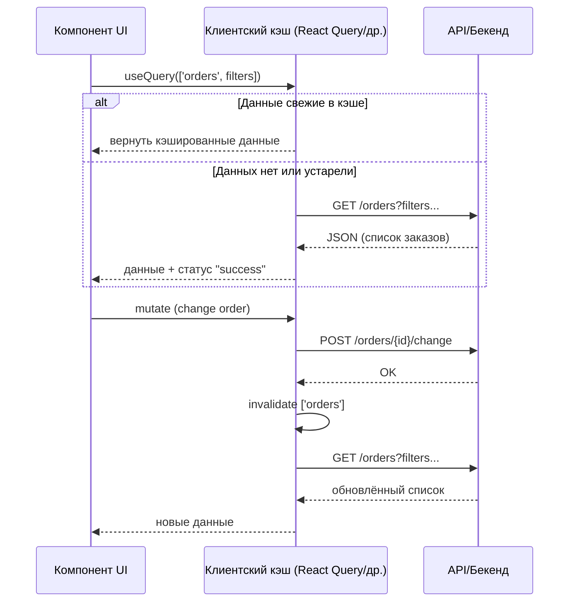

[← Назад к индексу части 26](index.md)

## 26.2. Серверное состояние и клиентский кэш

### Цель раздела

Понять, что такое **серверное состояние во фронтенде**, как работает **кэш данных на клиенте** (ключи запросов, ревалидация, инвалидация, оптимистичные обновления), зачем нужны **React Query / SWR / Apollo / RTK Query**, как они вписываются в архитектуру и как **не дублировать серверные данные** в глобальном сторе и локальном состоянии.

### В этом разделе главное

- **Серверное состояние** — это не просто «данные в сторе», а целый жизненный цикл: запрос → кэш → ревалидация → инвалидация → обновление.  
- Важно **разделять UI‑состояние и серверное состояние**: то, что живёт на сервере, не нужно дублировать или «изобретать» на клиенте.  
- Библиотеки вроде **React Query/SWR/Apollo/RTK Query** автоматизируют:
  - кэш по ключу,
  - повтор запросов,
  - ревалидацию при фокусе/переподключении,
  - инвалидацию после мутаций,
  - работу с оптимистичными апдейтами.  
- «Серверные данные только в Redux без ревалидации» — типичный антипаттерн: кэш появляется, но правила его обновления теряются.  
- Хорошая архитектура состояния на клиенте рассматривает **сервер как источник истины**, а клиент — как **слой кэша и UI‑состояния** вокруг него.

### Термины

- **Запрос (query)** — операция чтения данных с сервера (GET /api/orders).  
- **Мутация (mutation)** — операция изменения данных на сервере (POST/PUT/PATCH/DELETE).  
- **Ключ запроса (query key)** — идентификатор набора данных в кэше, по которому сохраняется и достаётся результат.  
- **Ревалидация (revalidation)** — проверка актуальности кэша и его обновление (on focus, on reconnect, по интервалу).  
- **Инвалидация** — явный сигнал библиотеке кэша «эти данные устарели, их нужно перезапросить».  
- **Оптимистичное обновление** — обновление UI до ответа сервера с возможным откатом.  
- **Stale‑while‑revalidate** — стратегия: отдать устаревшие данные сразу, а параллельно обновить кэш из сети.

### Теория и правила

#### 1) Почему серверное состояние особенное

Отличия от обычного UI‑состояния:

- **Источник истины на сервере.**  
  Любое несоответствие между клиентским кэшем и сервером — потенциальная проблема.

- **Есть сеть и задержки.**  
  Запросы могут падать, быть медленными, приходить в другом порядке.

- **Данные меняются вне клиента.**  
  Их могут менять другие клиенты, админка, фоновая обработка.

Вывод: для серверного состояния нужны **правила обновления кэша**, а не только «где его хранить».

#### 2) Базовая модель работы кэша запросов

На уровне архитектуры React Query/SWR/RTK Query/Apollo делают примерно следующее:

1. Компонент запрашивает данные `useQuery(key, fetcher)`.  
2. Библиотека:
   - смотрит в кэш по ключу `key`;  
   - если там **свежие данные**, отдаёт их;  
   - если данных нет или они устарели — делает запрос с помощью `fetcher`.  
3. После успешного запроса данные сохраняются в кэш по ключу.  
4. Другие компоненты с тем же ключом получают те же данные **без повторных запросов**.  
5. При мутациях (изменениях) вызывается `invalidateQueries`/аналог, чтобы пометить связанные ключи устаревшими и перезапросить их.

#### 3) Стратегии ревалидации

Библиотеки серверного состояния обычно поддерживают несколько триггеров ревалидации:

- **При фокусе окна** (on focus): когда пользователь возвращается во вкладку, данные обновляются.  
- **При восстановлении соединения** (on reconnect): после потери сети.  
- **По интервалу**: например, каждые 30/60 секунд.  
- **После мутации**: после успешного изменения данных (создание/редактирование/удаление).

Комбинация:

- для относительно статичных данных (справочники, медленно меняющиеся списки) достаточно ревалидации при фокусе/переподключении;  
- для «живых» данных (баланс, заказы в активной смене) может понадобиться интервал или события от сервера (WebSocket/SSE).

Отдельный важный приём — **prefetch (предзагрузка) данных** под будущую навигацию:

- когда пользователь наводит курсор на ссылку или карточку (`hover`),
- когда мы знаем, что следующей страницей с высокой вероятностью будет, например, карточка товара или деталка заказа,

можно заранее вызвать `prefetchQuery`/`prefetch` (или аналог в RTK Query/Apollo), чтобы:

- **заполнить кэш до перехода на новый роут**;
- на самом экране использовать обычный `useQuery` по тому же ключу и получить данные почти мгновенно.

Где это жить архитектурно:

- в слое **роутера** (data‑loader’ы, маршруты с загрузчиками — см. часть 27),
- или в **виджетах навигации** (списки, меню), которые знают, какие страницы чаще всего открываются следующими.

#### 4) Оптимистичные обновления

Сценарий:

1. Пользователь меняет статус заказа.  
2. Чтобы не ждать ответа сервера, мы **сразу обновляем** локальный кэш (оптимистично).  
3. Если сервер вернул успех — оставляем новое состояние.  
4. Если сервер вернул ошибку — **откатываем** к старому состоянию и показываем сообщение.

Ключевые моменты:

- нужно хранить **предыдущее значение** для отката;  
- UI должен явно показывать, что идёт операция (спиннер, статус «сохранение…»);  
- важно продумать, что делать при конфликте (если сервер изменил данные независимо).

#### 6) Почему «серверные данные в Redux без кэша» — антипаттерн

Когда серверные данные просто кладут в Redux/Zustand/MobX:

- нет единой политики ревалидации (кто и когда перезапрашивает данные);  
- разные компоненты могут по‑своему решать, когда обновляться;  
- легко получить **устаревший глобальный стейт** и рассинхронизацию с сервером;  
- сложно реализовать оптимистичные обновления и откаты без дублирования логики.

При этом бывают сценарии, когда часть серверных данных **всё‑таки разумно хранить в сторе**, но:

- в **нормализованном виде** (по ID, без дублирования в каждой вьюхе),
- с **явной связью** с источником (например, стор использует RTK Query как слой запросов),
- и с **ограниченным объёмом** (например, только сущности, реально нужные на многих экранах).

### Пошагово: как спроектировать слой серверного состояния

Возьмём пример: каталог товаров с фильтрами и карточкой товара.

1. **Определи основные типы запросов.**  
   - `GET /products` (список + фильтры),  
   - `GET /products/{id}` (деталь),
   - `POST /cart/items` (добавить в корзину).  

2. **Выбери библиотеку для серверного состояния.**  
   - например, React Query или RTK Query (для Redux‑проекта).

3. **Определи ключи запросов.**  
   - список: `['products', filters]`,  
   - деталь: `['product', id]`.  

4. **Настрой ревалидацию.**  
   - при фокусе и переподключении,  
   - по интервалу (если нужно),  
   - после мутаций (добавление/обновление товара).

5. **Настрой оптимистичные обновления (если нужны).**  
   - для лайков/оценок товара: «поднять счётчик», пока сервер не ответил;  
   - при ошибке — вернуть старое значение и показать уведомление.

6. **Реши, что НЕ должно жить в этом слое.**  
   - флаги открытия модалок, текущая вкладка, состояние форм — это не серверное состояние, оно в локальном/поднятом/глобальном UI‑слое.

#### 7) Нормализация и селекторы: когда это нужно

Если в приложении много взаимосвязанных сущностей (пользователи, заказы, товары), полезна **нормализация клиентского представления**:

- вместо хранения «сырых» массивов:

```ts
orders = [
  { id: 1, user: { id: 10, name: 'Аня' }, ... },
  { id: 2, user: { id: 10, name: 'Аня' }, ... },
];
```

- мы храним:

```ts
usersById = {
  10: { id: 10, name: 'Аня' },
};

ordersById = {
  1: { id: 1, userId: 10, ... },
  2: { id: 2, userId: 10, ... },
};
```

Плюсы нормализации:

- меньше дублирования (одно место для изменения имени пользователя);  
- проще мемоизировать производные данные через селекторы (`reselect`, computed‑свойства);  
- легче реализовать оптимистичные апдейты и частичные обновления.

Минусы:

- усложняется код стора и селекторов;  
- для небольших/простых экранов может быть избыточно.

Практическое правило:

- **не нормализуй всё подряд**;
- нормализуй там, где:
  - одни и те же сущности используются во многих местах,  
  - есть заметные проблемы с дублирующимися обновлениями и кешем.

### Простыми словами

Можно думать о библиотеке серверного состояния как о **умном кеше между UI и бекендом**:

- UI говорит: «дай мне заказы вот по таким фильтрам»;  
- кэш отвечает:  
  - «у меня уже есть такие данные, вот они» — и параллельно обновляет в фоне;  
  - или «у меня нет, пойду спрошу сервер»;  
- кэш сам знает, **когда то, что у него есть, устарело**, и как его обновить.

### Картинка в голове



### Как запомнить

- **Серверное состояние = данные, которые живут на сервере, а на клиенте только кэшируются.**  
- Библиотеки серверного состояния — это **«умный кэш + правила обновления»**, а не просто ещё один стор.  
- **UI‑состояние и серверное состояние должны быть разведены**, иначе сложно понять, откуда берутся расхождения.

### Примеры

- **React Query**:

```ts
const { data, isLoading, error } = useQuery(
  ['orders', filters],
  () => fetchOrders(filters),
  { staleTime: 60_000 } // 60 секунд считаем данные свежими
);
```

- **Оптимистичная мутация**:

```ts
const mutation = useMutation(updateOrderStatus, {
  // оптимистично обновляем кэш
  onMutate: async (variables) => {
    await queryClient.cancelQueries(['orders']);
    const prev = queryClient.getQueryData(['orders']);
    queryClient.setQueryData(['orders'], (old) =>
      updateOrderInList(old, variables)
    );
    return { prev };
  },
  // если ошибка — откатываем
  onError: (_err, _vars, context) => {
    if (context?.prev) {
      queryClient.setQueryData(['orders'], context.prev);
    }
  },
  // после успеха — ревалидация
  onSettled: () => {
    queryClient.invalidateQueries(['orders']);
  },
});
```

### Практика / реальные сценарии

- **Перевод legacy‑проекта с «ручных fetch + Redux» на серверное состояние.**  
  - Выдели пару ключевых запросов (список/деталь) и переведи их на React Query/RTK Query;  
  - убери дублирование в Redux там, где кэш уже ведёт библиотека;  
  - настрой ревалидацию на фокус и после мутаций.

- **Проектирование offline‑friendly кэша.**  
  - В связке с PWA (часть 24) можно кэшировать ответы API в IndexedDB/Cache Storage;  
  - при потере сети — показывать последний слепок, отмечая, что данные могут быть устаревшими.

- **Сложные формы с черновиками.**  
  - выбери, какие данные формы должны:
    - сохраняться только локально (черновик в памяти/LocalStorage),  
    - синхронизироваться с сервером (draft‑запись в БД);  
  - определи, какие поля участвуют в оптимистичных апдейтах (например, смена названия доски), а какие требуют строго дождаться ответа сервера (критичные финансовые поля).

### Типичные ошибки

- **Дублирование серверных данных**: одни и те же сущности в React Query и Redux без синхронизации.  
- **Отсутствие явной инвалидации**: после мутации кэш не обновляется, пользователь видит старые данные.  
- **Чрезмерные интервалы ревалидации**, создающие избыточную нагрузку на API.  
- Оптимистичные обновления без откатов — UI показывает сделанное изменение, хотя сервер его отклонил.

### Что будет, если…

- …держать серверные данные только в Redux без политики ревалидации?  
  - Приложение начнёт жить в своём «альтернативном прошлом»: пользователь может видеть устаревшие данные, которые уже изменены админкой/другими клиентами; исправить это потом намного дороже.  
- …бездумно включить ревалидацию по интервалу для сотен запросов?  
  - Можно устроить **сам себе DDoS**: приложение будет постоянно дергать API, даже когда пользователи ничего не делают.

### Проверь себя

1. Объясни разницу между **UI‑состоянием** и **серверным состоянием** на примере профиля пользователя.  
2. В каких случаях достаточно ревалидации «on focus/on reconnect», а когда нужен интервал?  
3. Какой минимум нужно продумать, прежде чем внедрять **оптимистичные обновления**?

<details><summary>Ответ</summary>

1. UI‑состояние профиля — это, например, флаг «форма редактирования открыта» или текущий текст, который пользователь набирает. Серверное состояние профиля — это объект, который хранится в БД; клиент должен показывать его актуальную версию и синхронизировать изменения. UI‑состояние может быть временно «не в согласии» с сервером (пока пользователь редактирует), а серверное состояние должно оставаться консистентным.  
2. On focus/on reconnect подходят, когда данные:
   - меняются **не особенно часто**,
   - не критичны в режиме «реального времени».  
   Интервал нужен, когда:
   - важна периодическая актуализация (например, статусы заказов, мониторинги),
   - пользователи долго сидят на одном экране, а данные на сервере часто меняются.  
3. Нужно решить:
   - что считается «предыдущим» значением и как его сохранить для отката;  
   - как UI покажет, что операция ещё не подтверждена;  
   - как обрабатывать ошибки и конфликты (например, если на сервере запретили это изменение);  
   - какие запросы нужно инвалидировать после успешной мутации.

</details>

### Запомните

- Серверное состояние — это **отдельный слой архитектуры фронтенда**, а не просто набор полей в сторе.  
- Использование специализированной библиотеки кэша данных **радикально упрощает** жизнь по сравнению с «ручным Redux для всего».  
- Главное — **не дублировать** серверные данные и иметь **явную стратегию ревалидации и инвалидации**.

---
