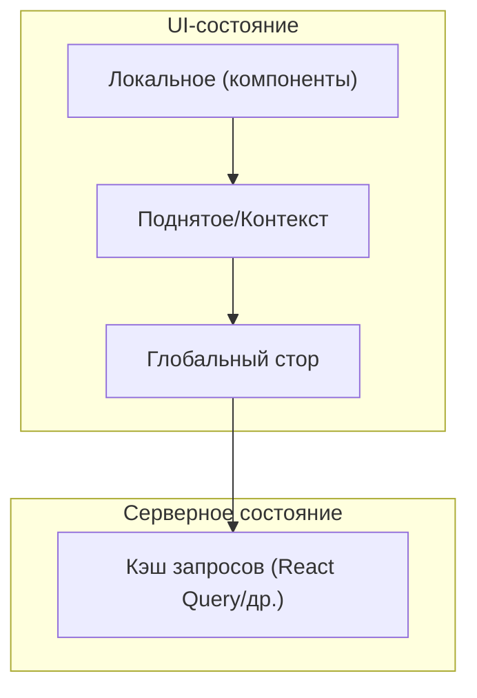

[← Назад к индексу части 26](index.md)

## 26.3. Выбор стратегии и антипаттерны состояния

### Цель раздела

Научиться **осознанно выбирать стратегию управления состоянием для конкретного продукта и экранов**, понимать типичные **антипаттерны** (всё в глобальном сторе, дублирование серверных данных, misuse контекста, пропс‑дриллинг), уметь проектировать **эволюционирующую модель состояния**, которая не развалится при росте команды, кода и требований.

### В этом разделе главное

- Нет «одной лучшей библиотеки» — есть **правильный набор уровней состояния под контекст**.  
- Модель состояния должна быть **понятной и документированной**: для каждой фичи видно, где её данные живут и как обновляются.  
- Частые антипаттерны:
  - глобальный стор «для всего»,
  - контекст, который рендерит полдерева каждые 100 мс,
  - серверные данные без ревалидации,
  - пропс‑дриллинг вместо композиции/контекста/фичевых компонентов.  
- Хорошая стратегия состояния допускает **эволюцию**: с ростом продукта можно вынести часть состояния из локального в контекст/стор/серверный кэш.  
- Связка **компонентная архитектура (25)** + **управление состоянием (26)** + **роутинг/загрузка (27)** даёт **целостную картину фронтенд‑архитектуры**.

### Термины

- **Стратегия состояния** — набор решений «где и как храним состояние для разных типов данных в продукте».  
- **Over‑global state** — ситуация, когда в глобальном сторе хранится слишком много, включая мелкое UI‑состояние.  
- **Prop‑drilling** — чрезмерное прокидывание пропсов через много слоёв.  
- **State explosion** — взрыв количества флагов и переменных в одном месте, делающий модель неподдерживаемой.

### Теория и правила

#### 1) Матрица выбора уровня состояния

Удобно рассматривать данные по трём осям:

1. **Откуда они взялись?** (сервер, пользовательский ввод, конфиг, локальное окружение).  
2. **Где они нужны?** (один компонент, поддерево, всё приложение).  
3. **Как часто меняются и насколько критична свежесть?**

Упрощённая матрица:

| Тип данных | Откуда | Где нужны | Частота изменений | Рекомендуемый уровень |
| --- | --- | --- | --- | --- |
| Временный ввод в поле | Пользователь | Один компонент | Высокая, локально | Локальное состояние |
| Фильтры на странице | Пользователь | Страница/поддерево | Средняя | Поднятое состояние/контекст страницы |
| Тема/локаль | Конфиг/сервер | Всё приложение | Низкая | Контекст/глобальный стор |
| Авторизация (текущий пользователь) | Сервер | Большая часть приложения | Низкая/средняя | Контекст/глобальный стор + серверное состояние для профиля |
| Список заказов | Сервер | Один или несколько экранов | Средняя/высокая | Серверное состояние (кэш запросов) |
| Корзина | Комбинация (клиент+сервер) | Всё приложение | Средняя/высокая | Глобальный стор + синхронизация с сервером |

#### 2) Как выглядят антипаттерны в жизни

- **«Всё в Redux/глобальном сторе»**:
  - модалки, инпуты, флаги спиннеров и т.п. живут в глобальном стейте;  
  - сложно понять, к какой фиче относится каждый кусок;  
  - любое изменение тянет каскад перерисовок.  

- **«Сервер = Redux»**:
  - данные с сервера считаются «истиной» в Redux;  
  - нет механизма ревалидации, кэш живёт «сам по себе»;  
  - при изменениях с других клиентов приложение показывает устаревшее.  

- **Контекст «на всё»**:
  - через один контекст тянут и тему, и текущий раздел, и текущую сущность, и т.п.;  
  - любое изменение вызывает ререндер большого дерева.  

- **Пропс‑дриллинг**:
  - один и тот же кусок состояния проталкивается через 5–7 уровней;  
  - промежуточные компоненты не используют эти пропсы, только «протаскивают».

#### 3) Эволюция стратегии состояния

Практически разумно строить стратегию **итеративно**:

1. **MVP**: в маленьком приложении большинство состояния живёт локально/поднято.  
2. **Рост**: появляются кросс‑страничные фичи (авторизация, корзина, нотификации) → логично ввести глобальный стор + контекст.  
3. **Сложные данные**: много серверных списков и сущностей → выделяем слой серверного состояния (React Query/RTK Query/Apollo).  
4. **Оптимизации и рефакторинг**: возвращаем в локальный/поднятый уровень то, что по ошибке оказалось в глобальном стейте, вычищаем дублирующее хранение серверных данных.

Эта эволюция хорошо сочетается с архитектурами из **части 25**: по мере роста продукта мы:

- лучше структурируем компоненты,
- вводим разделение на контейнеры и презентационные компоненты,
- заодно шлифуем модель состояния.

### Пошагово: проектируем стратегию состояния для продукта

Возьмём продукт: **интернет‑магазин с каталогом, корзиной и кабинетом**.

1. **Выдели крупные зоны продукта.**  
   - Маркетинг/лендинги.  
   - Каталог (список товаров, фильтры, карточка).  
   - Корзина и оформление заказа.  
   - Личный кабинет (история заказов, профиль).  

2. **Для каждой зоны ответь на три вопроса.**  
   - Какие данные приходят с сервера?  
   - Где они нужны (сколько экранов/компонентов)?  
   - Насколько критична свежесть и сколько пользователей работают одновременно?

3. **Заполни матрицу данных.**  
   - Товары, категории → серверное состояние;  
   - фильтры, сортировки → локальное/поднятое;  
   - корзина → гибрид: глобальный стор + синхронизация с сервером;  
   - профиль пользователя → серверное состояние + глобальный флаг авторизации.

4. **Определи библиотечный стек.**  
   - React Query/RTK Query/Apollo для серверного состояния;  
   - Redux/Zustand/Pinia для глобальных фич (авторизация, корзина, настройка приложения);  
   - контекст для темы/локали.

5. **Зафиксируй правила (минимальный набор).**  
   - серверные сущности не храним напрямую в Redux без кэша;  
   - UI‑состояние не поднимаем в глобальный стор без очевидной нужды;  
   - контекст не используем для часто меняющихся чисел/текстов;  
   - все ключевые решения описываем в ADR (часть 32).

6. **Продумай путь эволюции.**  
   - что произойдёт, когда количество товаров вырастет в 10 раз;  
   - как модель состояния поменяется при введении новых зон (например, «избранное» и «рекомендации»).

### Простыми словами

Стратегия состояния — это как **правила хранения вещей в квартире**:

- что лежит в кармане (локально),  
- что на общей полке семьи (поднято/контекст),  
- что в общей кладовке дома (глобальный стор),  
- а что вообще хранится не у тебя, а у управляющей компании/банка (серверное состояние).

Если таких правил нет, со временем всё оказывается в одной большой куче, и каждый поиск превращается в квест.

### Картинка в голове

### Как запомнить

- **Сначала думай о типе данных** (UI vs серверные), а уже потом — о библиотеке.  
- Лаконичное правило: **«как можно локальнее, но не локальнее, чем нужно»**.  
- Стратегия состояния — это часть **архитектуры**, а не только вопрос «Redux или нет».

### Примеры

- **Блог/документация.**  
  - Статьи → серверное состояние (SSG/ISR + клиентский кэш).  
  - Переключение темы → контекст.  
  - Локальные фильтры/поиск → локальное/поднятое состояние.  

- **SaaS‑кабинет с доской задач (канбан).**  
  - Задачи и доски → серверное состояние.  
  - Выбранный фильтр/борд → поднятое состояние.  
  - Доски, к которым есть доступ, и роль пользователя → глобальный стор + серверное состояние.  
  - Позиции карточек при drag‑and‑drop → локальное/поднятое состояние + оптимистичные апдейты сервера.

### Практика / реальные сценарии

- **Аудит существующего приложения.**  
  - Составь таблицу ключевых типов состояния и отметь, где они сейчас живут.  
  - Для 2–3 пунктов найди возможные упрощения/улучшения (перенос из глобального стейта в локальный, перевод серверных данных на React Query и т.п.).  

- **Проектирование нового модуля.**  
  - До начала разработки опиши модель состояния модуля в одном документе: где живут данные, как они поступают с сервера, как обновляются, какие библиотеки участвуют.

### Типичные ошибки

- Начать с тяжёлого стека (Redux + сложные middleware) там, где достаточно `useState` и пары контекстов.  
- Игнорировать серверное состояние: всё тащить в стор как будто это «локальные данные».  
- Пытаться «кэшировать всё» в PWA/IndexedDB без продуманной политики консистентности.  
- Нести state‑машину/супер‑сложный фреймворк состояний туда, где хватает простых паттернов (часть 25 + эта часть).

### Что будет, если…

- …изначально выбрать слишком сложную стратегию состояния для маленькой команды?  
  - Большая часть времени уйдёт на поддержание инфраструктуры стейта: action’ы, редьюсеры, селекторы, схемы кэша и т.п. Фичи будут делаться медленно, а команда — уставать от «церемоний».  
- …наоборот, слишком долго жить с хаотичным state‑менеджментом («где придётся, там и храним»)?  
  - При росте продукта каждый новый экран будет становиться всё дороже: чтобы добавить одну фичу, придётся «протаскивать» состояние через множество компонентов, править сразу несколько мест и бояться регрессий.

### Проверь себя

1. Какую стратегию состояния ты бы выбрал(а) для: интернет‑магазина, блога и внутренней админки?  
2. В чём риск стратегии «всё состояние только в React Query/серверном кэше, без выделенного UI/глобального слоя»?  
3. Как ты бы формально задокументировал(а) стратегию состояния для продукта?

Ответ

1. Примерный ответ:  
   - Интернет‑магазин: серверное состояние для каталога и заказов, глобальный стор для корзины и авторизации, локальное/поднятое состояние для фильтров и UI‑флагов.  
   - Блог: SSG/ISR + серверное состояние для комментариев, локальное состояние для форм поиска/комментариев, контекст для темы.  
   - Внутренняя админка: много локального/поднятого состояния, серверное состояние для списков/отчётов, возможно небольшой глобальный стор для авторизации и общих фильтров.  
2. Риск в том, что мы:
   - начнём пихать в серверный кэш чисто UI‑состояние (их жизненный цикл другой);  
   - потеряем удобный слой для кросс‑страничных фич (авторизация, тема, глобальные фильтры);  
   - завяжем всё приложение на одну библиотеку кэша, усложнив миграции и тестирование.  
3. Минимальный документ мог бы содержать:  
   - список типов данных и зон, где они используются;  
   - таблицу «данные → уровень состояния → библиотека/механизм»;  
   - правила (например, «серверные сущности храним только в кэше запросов», «UI‑флаги не поднимать в глобальный стор без необходимости»);  
   - примеры использования и гайды для команды. Это можно оформить как ADR или раздел в README архитектуры фронтенда.

### Запомните

- Стратегия состояния — это **архитектурное решение уровня продукта**, а не просто выбор библиотеки.  
- Хорошая стратегия балансирует между простотой и возможностью роста.  
- Антипаттерны состояния дорого обходятся при росте: лучше заметить и исправить их рано.

---
