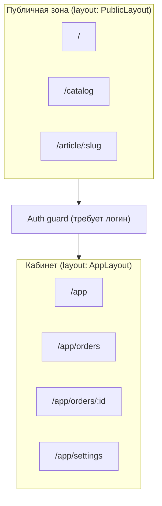
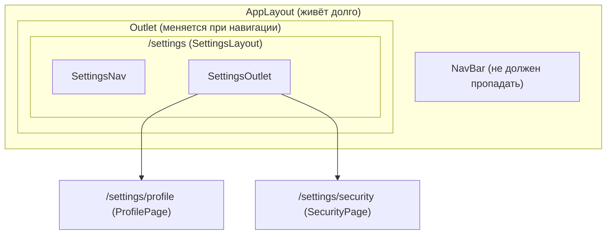

[← Назад к индексу части 27](index.md)

## 27.1. Роутинг: типы, вложенность, guards, ошибки

### Цель раздела

Разобраться, **как архитектурно устроить навигацию**: выбрать стиль роутинга (file‑based или config‑based), построить дерево маршрутов и layout’ов, определить, где живут **guards/middleware**, как делать **загрузку данных на уровне маршрута**, и как организовать **404 и ошибки** так, чтобы приложение было предсказуемым и “не разваливалось” при сбоях сети.

### В этом разделе главное

- Роутинг — это **контракт** между URL и экраном: “куда ведут ссылки” и “что значит этот URL”.  
- **File‑based** хорош там, где важна **предсказуемость структуры** и “страницы как файлы”; **config‑based** — когда нужна гибкость (guards, вложенность, условия).  
- Вложенные маршруты + layout позволяют менять **только часть экрана**, сохраняя общий каркас.  
- Guards/middleware решают **доступ и редиректы**, но безопасность всегда проверяется и на сервере.  
- Ошибки загрузки — неизбежны: лучше заранее иметь **error boundary / error page на уровне роута**, чем “белый экран”.  
- Loader на уровне маршрута помогает не размазывать “загрузку данных” по компонентам и не дублировать логику.

### Термины

| Термин | Определение |
| --- | --- |
| **Route** | Правило сопоставления URL → экран/обработчик. |
| **Router** | Движок, который выбирает route и управляет историей (back/forward). |
| **Nested routes** | Вложенные маршруты, где часть UI общая (layout), а часть меняется (outlet). |
| **Layout** | Общий “каркас” для группы страниц (шапка/меню/подвал/панель). |
| **Guard** | Проверка перед входом на маршрут (например, “нужен логин”). |
| **Middleware** | Промежуточная логика на пути к экрану (может быть на сервере или на клиенте). |
| **Loader** | Механизм загрузки данных для роута, часто с обработкой ошибок и редиректами. |
| **404 / Not Found** | Ситуация, когда маршрут не существует (или ресурс не найден). |
| **Error boundary (на уровне роута)** | Граница, которая ловит ошибки рендера/загрузки и показывает fallback. |

### Теория и правила

#### 1) File‑based routing vs config‑based routing

**File‑based routing (маршруты из файлов)**:

- Идея: структура файлов = структура URL.
- Сильные стороны:
  - легко ориентироваться: “страница = файл”,
  - меньше ручного конфига,
  - удобно для SSR/SSG и статических страниц.
- Риски/ограничения:
  - сложнее выразить “условные” маршруты и сложные guards без дополнительных механизмов,
  - иногда структура URL вынуждает “подгонять” структуру папок.

**Config‑based routing (маршруты как конфиг)**:

- Идея: маршруты — это явное дерево/список с параметрами.
- Сильные стороны:
  - гибкая вложенность и layout’ы,
  - удобно навешивать guards, loaders, meta‑информацию,
  - можно строить роутинг как “модель навигации”, не привязанную к файлам.
- Риски/ограничения:
  - конфиг может разрастаться и становиться сложным,
  - важно не потерять “предсказуемость” и единый стиль.

**Главное правило выбора:** выбирай не по моде, а по контексту.

- Если продукт “страницами” (маркетинг, docs, каталог), важна предсказуемость URL и SSR/SSG — file‑based часто проще.  
- Если это сложное SPA с кабинетами, ролями, вложенными layout’ами, сложной навигацией — config‑based часто даёт больше контроля.

Чтобы не оставалось “магии в воздухе”, держи в голове, **где чаще встречается каждый подход** (не как догма, а как ориентир):

- **File‑based** часто встречается в “фреймворках‑платформах”, которые дают сразу много инфраструктуры под страницы и рендеринг:
  - Next.js / Nuxt / SvelteKit (и подобные),
  - статические генераторы/гибриды, где “страница” — действительно единица сборки/рендера.
- **Config‑based** чаще встречается в “библиотеках‑роутерах”, которые ты встраиваешь в SPA:
  - React Router, Vue Router и аналоги,
  - сценарии, где конфиг маршрутов — часть доменной навигационной модели (guards, data loaders, layout‑дерево).

Важно: **подходы смешиваются**. В file‑based системах часто есть “декларативные” guards/loader‑хуки, а в config‑based проектах можно генерировать конфиг из структуры файлов. Архитектурно важно не “где лежит файл”, а **где у вас находится “истина” о навигации**.

##### Проверь себя (27.1 / file‑based vs config‑based)

1. В каком сценарии file‑based routing может **упростить** жизнь команде, а в каком — **усложнить**? Почему?  
2. Что значит “**истина о навигации**” в проекте и чем она отличается от “папок в репозитории”?  
3. Если у вас сейчас config‑based роутер, но часть страниц удобно мыслить как “страницы‑файлы”, как можно совместить подходы так, чтобы не потерять предсказуемость?

<details><summary>Ответ</summary>

1. Упростить: много “страничных” маршрутов, важна предсказуемая структура URL и интеграция со статикой/SSR/SSG — “страница = файл” снижает когнитивную нагрузку. Усложнить: сложные условия доступа, множество вложенных layout’ов, много meta‑логики (guards/loaders/ролевая модель) — тогда чисто file‑based без дополнительных механизмов может стать “магией” и разрастанием обходных путей.  
2. “Истина о навигации” — место, где зафиксирована модель: какие экраны существуют, как они вложены, какие у них правила доступа/данные/ошибки. Это может быть конфиг, соглашение file‑based или генератор. Папки — лишь физическое представление; “истина” — это договорённость и правила, по которым живёт навигация.  
3. Варианты: генерировать конфиг из файлов (одна истина — файлы, конфиг — производный), или держать конфиг как “истину”, а файловую структуру — как реализацию страниц. Главное — явно определить, где правят изменения (в одном месте), и не допускать двух независимых источников истины.

</details>

#### 2) Nested routes и layout как средство “не перемонтировать всё”

В больших приложениях **layout — это не декоративный компонент**, а:

- место, где живут общие элементы (навигация, сайдбар, шапка),
- место, где можно держать часть состояния UI (например, “какой раздел меню раскрыт”),
- граница для ошибок (если падает конкретная страница — не должен падать весь каркас).

Важно понимать два “типа” вложенности:

- **UI‑вложенность**: общий каркас + внутренняя часть (outlet).
- **URL‑вложенность**: `/orders` и `/orders/:id` как логически связанные экраны.

И они часто (но не всегда) совпадают.

Практическая подсказка (очень продакшн‑ориентированная): когда вы вводите nested routes, задайте себе вопрос:

- что должно **переживать** переход между дочерними страницами?
  - состояние раскрытого меню,
  - “поддержка” веб‑сокета/подписок,
  - кэш серверного состояния,
  - позиция скролла,
  - A/B‑контекст.

Если эти вещи “падают” при каждом переходе — значит, граница layout выбрана неудачно.

##### Проверь себя (27.1 / nested routes и layout)

1. Почему “layout живёт дольше страницы” — это архитектурная цель, а не вкусовщина? Назови 2 последствия, если это правило нарушено.  
2. Приведи пример, когда URL‑вложенность и UI‑вложенность **не совпадают**, и объясни, почему это нормально.  
3. Что именно из перечисленного (“скролл”, “кэш серверного состояния”, “websocket”) ты бы старался держать на уровне layout, а что — на уровне страницы? Почему?

<details><summary>Ответ</summary>

1. Потому что layout — это стабильный каркас UX: меню, навигация, общие подписки и кэш. Если он перемонтируется, пользователь теряет контекст (скролл/состояние), растёт стоимость переходов (повторные загрузки), увеличиваются баги “мигания”.  
2. Например, модальное окно “создать заказ” может открываться поверх разных URL (UI‑вложенность через модалку), при этом URL может не отражать вложенность напрямую (или отражать через query). Или наоборот: URL `/orders/123` может вести на тот же layout и почти тот же UI, что и `/orders`, меняя только правую панель — UI‑вложенность сильнее, чем URL‑дерево.  
3. На уровне layout часто уместны: навигация, общий контекст (пользователь/организация), долгоживущие соединения/подписки, кэш серверного состояния. На уровне страницы: специфичный для экрана скролл‑контекст, локальные виджеты, временные подписки. Причина — баланс стабильности и изоляции: общее — в каркасе, частное — в странице.

</details>

#### 3) Guards/middleware: где и что проверять

Есть две разные задачи, которые люди часто путают:

1) **UX‑задача:** не показывать пользователю экран, на который он не имеет доступа (и правильно редиректить).  
2) **Security‑задача:** реально не дать выполнить действие/получить данные без прав.

**Ключевое правило:** клиентские guards решают UX, но **безопасность решается на сервере**.

Практически это означает:

- клиентский guard может:
  - проверить “есть ли токен/сессия”,
  - вызвать “whoami/me” и понять роль,
  - показать fallback “проверяем доступ…”.
- но сервер должен:
  - проверять права на каждый защищённый API‑вызов,
  - не доверять тому, что фронт “не показал кнопку”.

Ещё один частый источник проблем — **временной разрыв** между “мы думаем, что доступ есть” и “сервер сказал, что нет”.

Пример: клиент кэшировал роль “admin”, пользователь разлогинился/права отозвали, а UI ещё пытается открыть админку. Хорошая архитектура:

- принимает, что права могут измениться,
- не делает “вечных” предположений на клиенте,
- умеет корректно обработать 401/403 во время загрузки данных (route‑level error UI).

##### Проверь себя (27.1 / guards и middleware)

1. Почему guard на клиенте — это про **UX**, а не про безопасность? Приведи пример обхода “клиентской безопасности”.  
2. Что произойдёт, если права пользователя изменились на сервере, а клиент ещё “верит” старому кэшу роли? Как архитектура должна это переживать?  
3. В каком месте (на уровне какого слоя) логичнее обрабатывать 401/403: внутри компонента, в data loader, в глобальном interceptor? Почему?

<details><summary>Ответ</summary>

1. Клиент контролируется пользователем: можно открыть DevTools, выполнить прямой запрос к API, подменить UI, вызвать приватный endpoint. Поэтому клиентский guard не может считаться защитой. Он нужен, чтобы не показывать запрещённый UI и корректно редиректить.  
2. Клиент может попытаться открыть страницу, получить 401/403 на загрузке данных или действиях. Архитектура должна иметь единый путь: показать “нет доступа/нужен логин”, сбросить/обновить auth‑контекст, возможно обновить `me`, а не “ломаться” или бесконечно ретраить.  
3. Чаще всего — на уровне роут‑loader или централизованного слоя запросов (interceptor), чтобы не дублировать обработку в каждом компоненте. Компонентам лучше отдавать уже нормализованное состояние: “данные/ошибка/нет доступа”, а не заставлять их разруливать протокол.

</details>

#### 4) 404 и обработка ошибок загрузки: как не получить “белый экран”

Ошибки бывают разные:

- **маршрут не существует** → 404,
- **ресурс не найден** (например, `/orders/123`, но заказа нет) → может быть 404 “на уровне данных”,
- **сеть/бекенд упал** → 5xx/timeout,
- **ошибка в коде страницы** → runtime error.

Архитектурно полезно иметь:

- общий “Not Found” экран,
- “Error screen” на уровне роута (или группы роутов),
- локальные error boundary для тяжёлых виджетов.

##### Проверь себя (27.1 / 404 и ошибки)

1. Чем отличается “404 маршрута” от “404 ресурса”, и какой UX‑паттерн обычно лучше для каждого случая?  
2. Почему “error boundary на уровне роута” часто выгоднее, чем “один глобальный обработчик ошибок”?  
3. В каком случае лучше показать fallback (skeleton/ошибка внутри экрана), а в каком — сделать редирект? Приведи пример.

<details><summary>Ответ</summary>

1. 404 маршрута: URL не соответствует экрану — обычно отдельная страница “Not Found”. 404 ресурса: экран существует, но сущности нет/недоступна — лучше состояние внутри доменного контекста (“заказ не найден, вернуться к списку”).  
2. Глобальный обработчик легко “роняет” весь каркас и делает UX грубым. Route‑level граница локализует сбой: каркас и соседние разделы остаются живыми, а пользователь получает понятное сообщение именно в рамках конкретного экрана.  
3. Fallback внутри экрана — когда ошибка локальная/временная (таймаут, частичный виджет). Редирект — когда навигационная цель изменилась (нужен логин, ресурс переехал, пользователь не имеет доступа и должен попасть на /login или /403).

</details>

#### 5) Data loaders и параллельная загрузка (код + данные)

Этот подпункт в плане звучит сухо (“data loaders и параллельная загрузка”), но в реальности это один из ключевых источников выигрыша в UX.

**Интуиция:** когда пользователь переходит на страницу, у нас почти всегда есть **две независимые загрузки**:

- загрузить **код** страницы (чанк),
- загрузить **данные** страницы (API).

Если вы делаете их “лесенкой” (сначала код, потом данные) — вы теряете время. Если вы делаете их **параллельно** — переход ощущается намного быстрее.

**Формально:** data loader — это архитектурная точка, где вы описываете:

- какие данные требуются для маршрута,
- какие запросы можно выполнять параллельно,
- как обрабатывать ошибки (401/403/404/timeout),
- когда считать переход завершённым (и что показывать до этого).

**Практическое правило:** держите “минимально достаточный” набор данных, который нужен, чтобы:

- показать корректный каркас экрана,
- отобразить критичный контент или хотя бы правильный skeleton,
- не мигать запрещённым контентом.

Остальное можно догружать “в фоне” (progressive loading).

##### Две стратегии: “данные до рендера” и “данные во время рендера”

1) **Данные до рендера (blocking loader)**  
Переход считается завершённым, когда данные готовы. Плюсы: меньше “мигания”. Минусы: при плохой сети пользователь дольше видит загрузку.

2) **Данные во время рендера (progressive + skeleton)**  
Экран показывается быстро (layout + skeleton), данные догружаются, UI обновляется. Плюсы: быстрее perceived performance. Минусы: важно грамотно проектировать skeleton и обработку ошибок.

Хорошие роутеры и дата‑слои дают вам комбинировать: критичное — blocking, второстепенное — progressive.

##### Проверь себя (27.1 / blocking vs progressive loaders)

1. В каком случае blocking loader даст лучший UX, чем progressive, даже если сеть “не идеальная”?  
2. Какие 2 ошибки чаще всего делают progressive‑загрузку хуже, чем blocking?  
3. Как бы ты разделил(а) данные на “критичные” и “догружаемые”, если экран — “детали заказа + история + рекомендации”?

<details><summary>Ответ</summary>

1. Когда без данных нельзя показать корректный или безопасный экран (например, доступ/роль, критичный контент без которого экран бессмысленен) — лучше дождаться и показать сразу корректное состояние, чем “мигать” или показывать неправильное.  
2. (а) Плохой skeleton: он вводит в заблуждение или вызывает скачки layout. (б) Отсутствие нормальной обработки ошибок/ретраев: пользователь видит вечный spinner или “сломанный” UI без пути восстановления.  
3. Критично: сам заказ (id, статус, сумма) и проверка доступа. Догружаемо: история действий, рекомендации/похожие товары, второстепенные блоки аналитики — их можно подгружать после первого meaningful контента.

</details>

##### Картинка в голове: параллельный переход


##### Проверь себя (27.1 / параллельный переход)

1. Почему параллельная загрузка “код + данные” обычно быстрее, чем последовательная, даже если общий объём одинаковый?  
2. Где в этой схеме логичнее всего размещать обработку “401/403”: до начала загрузки, во время, после? Почему?  
3. Какие риски у параллельной стратегии и как их минимизировать? (подсказка: дублирование запросов, отмена, гонки)

<details><summary>Ответ</summary>

1. Потому что вы сокращаете “простой”: сеть и CPU работают одновременно. В последовательной схеме данные ждут код (или наоборот), увеличивая суммарную задержку до готового экрана.  
2. Часть — до начала (быстрая проверка наличия сессии), но окончательно часто во время загрузки данных (сервер — источник истины). Поэтому route‑level обработка ошибок при загрузке — наиболее надёжная.  
3. Риски: double‑fetch (и loader, и компонент запросили одно и то же), гонки (поздний ответ перезаписал состояние), отсутствие отмены запросов при уходе со страницы. Минимизировать: дедупликация запросов в слое серверного состояния, отмена/ignore устаревших запросов, единая точка данных на уровне маршрута.

</details>

##### Пример (псевдокод): “одна точка истины” для данных роута

Это не код под конкретный фреймворк — это **архитектурная идея**: описать данные маршрута рядом с маршрутом.

```ts
// Псевдотипы: Router, Route, load() — чтобы показать принцип.
// Идея: loader знает, какие данные нужны и как обрабатывать ошибки.

const routes = [
  {
    path: "/app/orders/:id",
    guard: async ({ auth }) => auth.requireLogin(),
    load: async ({ params, api }) => {
      const [order, history] = await Promise.all([
        api.getOrder(params.id),
        api.getOrderHistory(params.id),
      ]);
      return { order, history };
    },
    onError: (e) => {
      if (e.status === 404) return "ORDER_NOT_FOUND";
      if (e.status === 403) return "FORBIDDEN";
      return "GENERIC_ERROR";
    },
  },
];
```

Почему это полезно:

- легче обеспечивать единый UX (skeleton/error/redirect),
- меньше дублирования запросов,
- проще сделать префетч (код+данные) “по одному ключу”.

##### Проверь себя (27.1 / “одна точка истины” для данных роута)

1. Какой главный минус у подхода “каждый компонент сам грузит данные в `useEffect`”, если проект растёт?  
2. Почему `Promise.all` в loader — это не “оптимизация ради оптимизации”, а архитектурная необходимость в некоторых экранах?  
3. Где лучше хранить логику `onError` (внутри страницы или рядом с маршрутом) и почему?

<details><summary>Ответ</summary>

1. Возникают дубли запросов, разные варианты обработки ошибок, трудно обеспечить единый UX загрузки и редиректов, а также сложно делать префетч/отмену при навигации.  
2. Потому что параллельность снижает latency перехода: если данные независимы, ждать их по очереди — это искусственное удлинение критического пути. В экранах “детали + справочники + роли” это ощущается пользователем.  
3. Чаще рядом с маршрутом/loader: там лучше видно “контракт экрана” (какие ошибки превращаются в редирект, какие — в 404 ресурса, какие — в retry). Страница тогда получает уже нормализованные состояния.

</details>

### Пошагово (как спроектировать роутинг в SPA)

1. **Опиши карту экранов** как продуктовую модель: какие страницы существуют, какие из них публичные/закрытые, какие вложенные.  
2. **Найди layout‑группы**: какие экраны делят один каркас (например, “кабинет” и “публичная часть”).  
3. Для каждой группы:
   - выдели layout,
   - определи, что должно сохраниться при переходах (шапка, меню, кэш данных, скролл).
4. **Определи guards**:
   - какие маршруты требуют авторизации,
   - где нужна роль/права,
   - какие редиректы и fallback нужны.
5. **Определи loaders**:
   - какие данные критичны для первого рендера экрана,
   - что можно догрузить после (progressive loading).
6. **Продумай ошибки**:
   - 404 (маршрут) и 404 (ресурс),
   - экран ошибки сети,
   - логирование ошибок и корреляция (см. часть 31).

##### Проверь себя (27.1 / пошаговое проектирование роутинга)

1. На каком шаге ты бы определил(а) границы layout’ов и почему это нельзя откладывать “на потом”?  
2. Какие 2 типа ошибок ты обязан(а) продумать до разработки UI, чтобы не получить “белые экраны” в проде?  
3. Как этот алгоритм изменится (или расширится), если у вас SSR/гибрид (часть 23)?

<details><summary>Ответ</summary>

1. На шаге 2–3: layout‑группы определяют жизненный цикл каркаса, состояние и зависимости. Если отложить, вы получите случайную структуру, которую больно рефакторить.  
2. Ошибки доступа (401/403) и ошибки навигации/данных (404 маршрута/404 ресурса, сетевые таймауты). Для них нужен fallback/редирект/путь восстановления.  
3. Добавится серверная фаза: часть guard/loader может выполняться на сервере, появятся вопросы TTFB/кэширования/гидрации, но логика “маршрут → доступ → данные → UI” останется.

</details>

### Простыми словами

Представь приложение как **здание**:

- **layout** — это коридоры, лестницы, лифты и общие зоны. Они не должны исчезать, когда ты заходишь в другой кабинет.  
- **страницы/маршруты** — это кабинеты. Когда ты переходишь, ты меняешь кабинет, но здание остаётся.  
- **guards** — это охрана у дверей: “в этот кабинет можно только по пропуску”.  
- **loader** — это секретарь, который готовит папки с документами до того, как ты войдёшь (или сразу после входа).

### Картинка в голове

Типичный поток навигации в SPA:

```text
Пользователь кликает ссылку /orders/123
        |
        v
  Router выбирает маршрут
        |
        v
  Guard: можно ли входить?
   |         |
  нет       да
   |         |
 редирект    v
        Loader: какие данные нужны?
             |
      +------+
      | success -> render page
      | error   -> show route error UI
      v
  Scroll restoration / state restore
```

Для SSR/SSR‑гибридов добавляется серверная фаза, но логика “маршрут → доступ → данные → UI” остаётся, просто часть делается на сервере.

### Как запомнить

- **URL — контракт**, а не “строка”.  
- **Guards — про UX**, безопасность — на сервере.  
- **Layout должен жить дольше страницы**.  
- **Ошибки не исключение, а режим работы**: проектируй fallback заранее.

### Примеры

#### Пример 1. Две зоны приложения: публичная и кабинет

Почти в каждом продукте есть две зоны:

- публичная: лендинг, каталог, статьи;
- кабинет: заказы, профиль, настройки.

С точки зрения роутинга это часто:

- разные layout’ы,
- разные правила доступа,
- разные стратегии загрузки.



Ключевая мысль: **layout’ы помогают не смешивать ответственность**. В публичной зоне один набор зависимостей, в кабинете — другой (auth, персональные данные, приватные запросы).

##### Проверь себя (27.1 / пример: публичная зона vs кабинет)

1. Почему разделение на две зоны часто снижает “архитектурный шум” в кодовой базе?  
2. Какие зависимости/настройки ты бы запретил(а) в публичной зоне (или старался минимизировать), чтобы не тянуть их на весь сайт?  
3. Что может пойти не так, если сделать один общий layout на публичную часть и кабинет “ради переиспользования”?

<details><summary>Ответ</summary>

1. Потому что у зон разные требования: публичная часть часто про SEO/скорость/статичность, кабинет — про авторизацию, персональные данные, сложные загрузки. Разделение даёт ясные границы и меньше случайных связей.  
2. Auth‑специфику, приватные SDK, тяжёлые библиотеки для кабинета, персонализированные запросы — всё, что не нужно гостю. Это уменьшает стартовый JS и снижает риск утечек/ошибок.  
3. Начинают “просачиваться” зависимости: публичная часть тянет auth/личные данные, усложняется кэширование, растёт риск “миганий” и ошибок доступа, увеличивается стартовый бандл.

</details>

#### Пример 2. Обработка “ресурс не найден” vs “маршрут не найден”

- `/orders/123`:
  - маршрут существует,
  - но заказ может не существовать → это “404 ресурса”.
- `/orders/abc/extra`:
  - маршрут может не существовать → “404 маршрута”.

Почему это важно:

- 404 ресурса — это часто “нормальная бизнес‑ситуация” (удалили заказ, нет доступа),
- 404 маршрута — ошибка навигации/URL.

##### Проверь себя (27.1 / пример: 404 ресурса vs 404 маршрута)

1. Какой текст и какой “следующий шаг” ты бы предложил(а) пользователю для 404 ресурса в кабинете?  
2. Почему “показывать 404 страницу на любой 404” может ухудшить UX?  
3. Приведи пример, когда 404 ресурса на самом деле должен выглядеть как 403 (и почему).

<details><summary>Ответ</summary>

1. Например: “Заказ не найден или у вас нет доступа” + кнопка “Вернуться к списку заказов”, возможно поиск/фильтр. Это удерживает пользователя в контексте доменной задачи.  
2. Потому что 404 ресурса часто не означает “вы ошиблись URL”, а означает бизнес‑состояние внутри существующего экрана. Глобальная 404 ломает контекст и не даёт правильного пути восстановления.  
3. Если заказ существует, но доступ ограничен (роль/организация) — корректнее “нет доступа” (403), чтобы не маскировать проблему и не вводить пользователя в заблуждение.

</details>

#### Пример 3. Nested routes глазами UI: где “outlet” и где границы ошибок

Эта схема помогает “увидеть” вложенные маршруты как каркас + окно.



Что важно архитектору:

- `AppLayout` и `NavBar` не должны “падать” из‑за ошибки конкретной страницы.  
- `SettingsLayout` — хорошее место для **локального error boundary** и fallback для всех подразделов настроек.  
- Если у вас “один глобальный error boundary”, то любая мелкая ошибка в дочерней странице может “уронить” весь каркас — это плохая граница.

##### Проверь себя (27.1 / пример: outlet и границы ошибок)

1. Где логичнее поставить error boundary для “настроек”: на уровне `AppLayout`, `SettingsLayout` или конкретной страницы? Почему?  
2. Что произойдёт с UX, если `NavBar` окажется внутри Suspense/границы, которая зависит от lazy‑чанка страницы?  
3. Как nested routes помогают избегать “перемонтирования всего приложения” при навигации?

<details><summary>Ответ</summary>

1. Часто лучше на уровне `SettingsLayout`: ошибка в конкретном подразделе не должна “ронять” весь `AppLayout`, но должна давать единый fallback для всех страниц настроек.  
2. Навигация может исчезать/мигать при загрузке страницы, пользователь теряет ощущение контроля и контекст; каркас становится хрупким и зависит от случайных чанков.  
3. Они позволяют держать общий каркас (layout) постоянным и менять только “outlet” часть, что сохраняет состояние каркаса и уменьшает стоимость перехода.

</details>

#### Пример 4. Guard + loader как единый жизненный цикл экрана (псевдо‑пример)

Идея: один и тот же “маршрут” описывает и доступ, и данные, и реакцию на ошибки.

```ts
// Псевдопример: важно не API конкретного роутера, а принцип.

const route = {
  path: "/app/admin/users",
  guard: async ({ auth }) => auth.requireRole("admin"),
  load: async ({ api }) => {
    const [users, roles] = await Promise.all([api.getUsers(), api.getRoles()]);
    return { users, roles };
  },
  onError: (e) => {
    if (e.status === 401) return "REDIRECT_LOGIN";
    if (e.status === 403) return "FORBIDDEN";
    return "ERROR_UI";
  },
};
```

Польза: вы не размазываете авторизацию и загрузку данных по 10 компонентам, а держите это в одной “точке входа” экрана.

##### Проверь себя (27.1 / пример: guard+loader lifecycle)

1. Почему “guard+load+onError рядом с маршрутом” снижает вероятность багов “мигания” приватного UI?  
2. В чём риск подхода “проверим роль в компоненте, а данные загрузим отдельно”?  
3. Как бы ты адаптировал(а) этот подход для случая, когда часть данных доступна всем, а часть — только admin?

<details><summary>Ответ</summary>

1. Потому что проверка доступа и загрузка данных становятся частью одного жизненного цикла: до рендера/входа можно показать правильный fallback/редирект и не успеть показать лишнее.  
2. Риск гонок и рассинхрона: UI успевает отрисовать запрещённые элементы, затем приходит проверка и делает редирект; ошибки/401/403 обрабатываются в разных местах и дают разные состояния.  
3. Разделить данные на “public” и “restricted”: loader может грузить public всегда, а restricted — только после успешного guard (или отдельным запросом с обработкой 403 внутри экрана). UI должен явно отображать “часть недоступна” без падения всего экрана.

</details>

### Практика / реальные сценарии

- **Ролевая модель:** “админка доступна только роли admin”.
  - На клиенте: guard + fallback.
  - На сервере: проверка прав на API.
  - В идеале: единая модель ролей/прав в контракте (см. часть 30).
- **Переиспользование layout:** если меню и шапка одинаковые для 30 страниц, но они перемонтируются при каждом переходе — это сигнал, что layout спроектирован неверно (или страница “перетягивает” layout).
- **Вложенная навигация:** `/settings/profile`, `/settings/security` — хороший кандидат для nested routes внутри одного layout’а “Настройки”.

##### Проверь себя (27.1 / практика)

1. В каком месте вы бы реализовали проверку роли admin, чтобы не получить дублирование (и почему)?  
2. Какой “симптом” в UI чаще всего показывает, что layout выбран неправильно?  
3. Почему вложенная навигация в настройках — хороший повод для nested routes, а не просто набора независимых страниц?

<details><summary>Ответ</summary>

1. Чаще всего на уровне маршрута/guard + централизованной модели auth (и на сервере). Так логика не размазывается по компонентам и не даёт “миганий”.  
2. Перемонтирование общего каркаса: меню “сбрасывается”, скролл теряется, подписки/кэш пересоздаются, появляется мигание при переходах.  
3. Потому что есть общий каркас и общая логика/контекст (SettingsLayout): навигация внутри раздела и стабильный outlet дают предсказуемый UX и меньше дублирования.

</details>

### Типичные ошибки

- **“Guards = безопасность”**: фронт сделал редирект, значит “всё защищено”. Нет — защищает сервер.  
- **Один гигантский layout на всё**: в итоге он тянет зависимости и состояние из разных зон, и любое изменение в layout ререндерит половину приложения.  
- **404 как исключение**: нет отдельной страницы, и пользователь видит “пусто” или “белый экран”.  
- **Загрузка данных размазана по компонентам**: одинаковые запросы живут в нескольких местах, сложно управлять ошибками и повтором.

##### Проверь себя (27.1 / типичные ошибки)

1. Почему “guards = безопасность” — опасная иллюзия именно на уровне архитектуры, а не “просто баг”?  
2. Какой один критерий поможет понять, что layout стал “гигантским” и его пора делить?  
3. Чем опасно отсутствие отдельной обработки 404 ресурса (внутри экрана), даже если у вас есть страница 404?

<details><summary>Ответ</summary>

1. Потому что это создаёт ложное чувство защищённости: архитектура не закладывает проверку прав на сервере и границы доверия, что может привести к утечкам данных и нарушениям безопасности.  
2. Если layout тянет зависимости/данные/состояние, которые нужны только части экранов, и при любом изменении в нём ререндерится “пол‑приложения” — это сигнал, что граница каркаса выбрана неверно.  
3. Пользователь теряет доменный контекст (“заказ/профиль”), не получает правильного пути восстановления (“назад к списку”), и поддержка/UX страдают: 404 страница слишком общая и не решает задачу.

</details>

### Что будет, если…

- **если сделать guards только на клиенте** — злоумышленник всё равно сможет вызвать API напрямую; утечка данных станет вопросом времени.  
- **если каждый экран будет своим layout** — ты потеряешь преимущества nested routes; будет много дублирования и сложных переходов.  
- **если loaders загружают “всё и сразу”** — переходы станут тяжёлыми, UX ухудшится; часто нужен progressive loading (критичное → сразу, остальное → позже).

### Проверь себя

1. Чем “вложенные маршруты” отличаются от “вложенных компонентов” и почему они часто идут вместе?  
2. Почему guard на клиенте не решает безопасность, но всё равно полезен?  
3. В каких случаях 404 должен быть “страницей”, а в каких — “состоянием внутри страницы”?

<details><summary>Ответ</summary>

1. Вложенные маршруты — это часть **модели навигации** (URL/история/переходы) и способ выразить “общий layout + меняющийся outlet”. Вложенные компоненты — просто композиция UI. Часто они совпадают, потому что общий layout удобно выразить через nested routes.  
2. Он улучшает UX: не показывает запрещённый экран, даёт корректный редирект и fallback. Но безопасность решает сервер, потому что клиент можно обойти.  
3. “Страница 404” нужна, когда маршрут/ресурс действительно недоступен как конечная точка. “Состояние внутри страницы” уместно, если это частный случай (например, “заказ удалён” в контексте раздела заказов, где можно предложить перейти к списку).

</details>

### Запомните

- Роутинг — это **архитектура навигации**: URL, экраны, доступ, данные, ошибки.  
- Layout и nested routes — ключ к **предсказуемым переходам** без перемонтирования каркаса.  
- Guards на клиенте — для UX; безопасность — на сервере.  
- Ошибки и 404 проектируются заранее, иначе вы получите “белые экраны” в продакшене.

---
