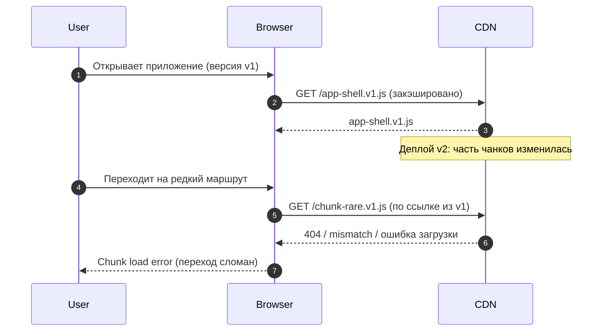
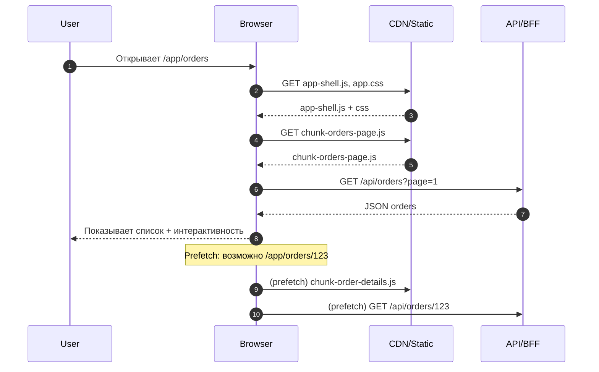

[← Назад к индексу части 27](index.md)

## 27.2. Код‑сплиттинг, lazy‑loading, preload/prefetch

### Цель раздела

Научиться **доставлять код и данные по мере необходимости**: резать бандл по маршрутам, лениво загружать тяжёлые компоненты, выбирать стратегии preload/prefetch, не ломая LCP/INP, и продумать восстановление контекста (scroll restoration, deep linking) как часть навигации.

### В этом разделе главное

- Code splitting — это про **время до полезного UI**: меньше стартовый JS → быстрее интерактивность.  
- Лучший “первый разрез” почти всегда — **по маршрутам** (route‑based).  
- Lazy‑loading полезен, когда компонент/виджет **не нужен на первом экране**.  
- Preload/prefetch — это “ускорение вероятных шагов”, но **без измерений легко сделать хуже**.  
- URL — часть восстановления состояния: deep linking уменьшает зависимость от “памяти приложения”.  
- Баланс важнее фанатизма: слишком мелкие чанки = много запросов и overhead.

### Термины

| Термин | Определение |
| --- | --- |
| **Bundle** | Итоговый набор JS, который браузер должен скачать/распарсить/выполнить. |
| **Chunk** | Часть бандла (файл/набор файлов), которую можно загружать отдельно. |
| **Dynamic import (`import()`)** | Механизм, который создаёт отдельный чанк и грузит его в runtime. |
| **Route‑based splitting** | Делим чанки по маршрутам (страницам). |
| **Component‑based splitting** | Делим по тяжёлым компонентам/виджетам (редактор, графики). |
| **Preload** | Ресурс нужен прямо сейчас; высокий приоритет. |
| **Prefetch** | Ресурс может понадобиться позже; низкий приоритет. |
| **Prefetch data** | Предварительная загрузка данных (например, React Query `prefetchQuery`). |
| **Scroll restoration** | Восстановление позиции скролла при nav назад/вперёд. |
| **Deep link** | URL, который точно воспроизводит состояние/место внутри приложения. |

### Теория и правила

#### 1) Почему “бандл” — это не только сеть

Когда браузер получает JS, он:

1) скачивает;  
2) распаковывает (gzip/brotli);  
3) парсит;  
4) компилирует JIT;  
5) выполняет;  
6) создаёт объекты и подписки.

Большой бандл — это не только “дольше скачать”, но и:

- “дольше распарсить и выполнить”,
- “дольше стать интерактивным”,
- “больше памяти”.

Поэтому code splitting помогает даже при хорошем интернете.

##### Проверь себя (27.2 / бандл = сеть + CPU)

1. Почему “JS тяжёлый” может тормозить даже при быстром интернете? Назови минимум 2 этапа кроме скачивания.  
2. Что произойдёт с INP/TTI, если вы уменьшили объём JS, но увеличили число подписок и перерисовок?  
3. Какой практический сигнал в проде может подсказать, что проблема именно в “парс/выполнении JS”, а не в сети?

<details><summary>Ответ</summary>

1. Потому что после скачивания JS надо распаковать, распарсить, скомпилировать и выполнить — это CPU/память. На слабых устройствах (или при нагрузке) это может доминировать над сетью.  
2. INP/TTI могут остаться плохими или даже ухудшиться: меньше JS “по весу” не гарантирует меньше работы на main thread. Подписки/рендеры создают long tasks и задерживают отклик.  
3. Например: сеть быстрая (малые TTFB/transfer), но при этом много long tasks в профайлере, высокий time-to-interactive, фризы при первом взаимодействии. В RUM это часто видно как плохой INP при нормальных сетевых таймингах.

</details>

#### 2) Route‑based code splitting как базовая стратегия

Типичный подход:

- **App shell** (основной чанк): layout, роутер, базовые компоненты, auth‑обвязка, критичные утилиты.  
- **Page chunks**: отдельный чанк на каждую страницу (или группу страниц).  
- **Heavy widget chunks**: отдельные чанки для тяжёлых виджетов, которые появляются редко.

Главный вопрос архитектора: **что считается “критичным для первого экрана”**?

Если пользователь открывает `/app/orders`, то критично:

- каркас кабинета,
- список заказов (или хотя бы skeleton),
- минимальная логика отображения.

Не критично:

- тяжёлый график “аналитика”,
- WYSIWYG‑редактор,
- карта, которая есть только на отдельном экране.

##### Проверь себя (27.2 / route‑based splitting)

1. Что должно входить в app shell, чтобы не получить “разваливающийся” UX при переходах? Назови 3 элемента.  
2. Как понять, что вы “перерезали слишком мелко” и получили регрессию? Приведи 2 симптома.  
3. Почему “критичность для первого экрана” — это решение на стыке UX и архитектуры, а не только “техническая оптимизация”?

<details><summary>Ответ</summary>

1. Обычно: базовый layout (каркас), навигация, роутер, минимальные UI‑компоненты/токены дизайна, auth‑обвязка (если нужна всем приватным экранам), инфраструктура ошибок/логирования.  
2. Симптомы: много маленьких запросов на один переход, заметная “лесенка” загрузки, рост времени переходов на плохой сети, увеличенные накладные расходы (handshake, HTTP/2 приоритизация, кеш‑промахи).  
3. Потому что “первый экран” — это то, что пользователь должен увидеть быстро и корректно. Если вы вынесли критичный UI в lazy‑чанк, вы ухудшите perceived performance, даже если “вес” стал меньше.

</details>

#### 3) Lazy‑loading: полезно, но не бесплатно

Lazy‑loading добавляет:

- дополнительный сетевой запрос,
- задержку при первом появлении компонента,
- сложности с обработкой ошибок и fallback UI.

Поэтому:

- лениво грузим то, что **не нужно сразу**,
- и создаём нормальный fallback (skeleton/spinner) на уровне компонента или роута.

##### Проверь себя (27.2 / lazy‑loading)

1. Назови два случая, когда lazy‑loading почти наверняка улучшит UX, и один случай, когда почти наверняка ухудшит.  
2. Почему fallback UI — это часть архитектуры, а не “косметика”?  
3. Какие ошибки загрузки/исполнения lazy‑чанка важно уметь обрабатывать (хотя бы на уровне UX)?

<details><summary>Ответ</summary>

1. Улучшит: редкие тяжёлые виджеты (редактор, карта), модалки/второстепенные панели, редко посещаемые разделы. Ухудшит: критичный контент первого экрана или элемент, который нужен сразу при первом взаимодействии (например, основная таблица).  
2. Потому что fallback определяет, что пользователь видит в “дырке загрузки”: будет ли это предсказуемый skeleton без прыжков, или “пустота/мигание”. Это влияет на доверие и понимание состояния системы.  
3. Ошибка загрузки чанка (network/404), ошибка выполнения (runtime exception), несовместимость версий после деплоя (chunk load error). UX должен давать путь восстановления: retry/reload/сообщение.

</details>

#### 4) Preload vs prefetch: правильное использование

**Preload** уместен, когда:

- ресурс нужен для **текущего экрана** (например, шрифт для заголовка, критический CSS/JS),
- или когда ты уже точно знаешь, что пользователь “вот‑вот” перейдёт (например, после клика, но до завершения навигации).

**Prefetch** уместен, когда:

- есть высокая вероятность следующего шага,
- и ты хочешь загрузить заранее “на фоне”.

Стратегии prefetch:

- on hover / on focus (наводим на ссылку),
- on viewport (ссылка попала в видимую область),
- after idle (когда браузер свободен),
- based on analytics (самые вероятные переходы).

##### Проверь себя (27.2 / preload vs prefetch)

1. Сформулируй разницу preload и prefetch так, чтобы её понял(а) менеджер продукта (не разработчик).  
2. Почему “prefetch всего списка” (например, 200 ссылок) опасен не только для клиента, но и для бекенда?  
3. Как бы ты ограничил(а) prefetch в каталоге: по числу объектов, по времени, по условиям сети — или всем сразу?

<details><summary>Ответ</summary>

1. Preload — “грузим сейчас, потому что это нужно прямо для текущего экрана”; prefetch — “грузим в фоне на случай, если пользователь пойдёт дальше”.  
2. Потому что это создаёт всплеск запросов: сеть клиента забивается, приоритеты критичных ресурсов падают, а API получает нагрузку как от “мини‑DDOS”, особенно если prefetch включает данные.  
3. Практично комбинировать: лимит по количеству (1–3 ближайших кандидата), по событиям (hover/viewport), по условиям сети (не делать на `2g/slow-3g`), и по времени (after idle).

</details>

#### 4a) Preload/prefetch “внутри браузера”: как это реально работает

В архитектуре полезно понимать, что “preload/prefetch” — это не только “мы вызвали функцию”.

Есть несколько уровней:

- **Preconnect** — заранее установить TCP/TLS к домену (ускоряет первый запрос к этому домену).
- **DNS‑prefetch** — заранее разрешить DNS.
- **Preload** — загрузить ресурс с высоким приоритетом (обычно “нужно для текущей страницы”).
- **Modulepreload** — отдельный вид preload для JS‑модулей (актуально для современных сборок).
- **Prefetch** — загрузить с низким приоритетом “впрок”.

Мини‑шпаргалка “когда что”:

- если вы точно будете ходить на домен `api.example.com` и это “первый запрос” важен → **preconnect** к API/BFF (но аккуратно: лишние соединения тоже стоят ресурсов);
- если важен конкретный модуль/чанк для первого экрана → **preload/modulepreload**;
- если это “вероятный следующий маршрут” → **prefetch** (низкий приоритет).

Пример (очень упрощённо, как идея):

```html
<!-- заранее готовим соединение -->
<link rel="preconnect" href="https://api.example.com" />

<!-- критичный ресурс текущей страницы -->
<link rel="preload" href="/assets/app-shell.css" as="style" />

<!-- вероятный следующий шаг -->
<link rel="prefetch" href="/assets/chunk-order-details.js" as="script" />
```

Важно: браузер — не “обязанный исполнитель”. Он может менять приоритеты, отменять prefetch на медленной сети и т.д. Поэтому префетч должен быть **подсказкой**, а не “критической логикой”.

##### Проверь себя (27.2 / preconnect, modulepreload и приоритеты)

1. Чем preconnect отличается от preload, и почему preconnect нельзя “накидать на все домены мира”?  
2. Как влияет `modulepreload`/preload на LCP, если вы ошиблись и “прелоадите лишнее”?  
3. Почему архитектурно опасно строить функциональность, которая “ломается”, если браузер не сделал prefetch?

<details><summary>Ответ</summary>

1. Preconnect готовит соединение (DNS/TCP/TLS), preload грузит конкретный ресурс. Лишние preconnect’ы потребляют сокеты/ресурсы и могут ухудшить работу критичных соединений.  
2. Лишний preload конкурирует за сеть с критичными ресурсами текущей страницы → может ухудшить LCP и даже INP, если лишний JS начнёт выполняться раньше нужного.  
3. Потому что prefetch — эвристика: браузер может отменить/отложить. Если ваша “логика” зависит от него, поведение станет недетерминированным и ухудшится на медленных сетях/устройствах.

</details>

#### 5) Deep linking: что хранить в URL, а что — нет

URL можно рассматривать как “внешнюю память” экрана.

Хорошо хранить в URL:

- идентификаторы (`/orders/123`),
- фильтры и сортировки (`?q=phone&sort=price`),
- вкладки (`?tab=security`),
- пагинацию (`?page=2`).

Плохо хранить в URL:

- токены и секреты,
- персональные данные (если не нужно),
- слишком большие структуры (длинные JSON).

Практическое правило: URL — это **контракт навигации**, а не база данных.

##### Проверь себя (27.2 / deep linking)

1. Назови 3 параметра, которые уместно хранить в URL для каталога, и 2 — которые точно неуместно.  
2. Почему deep linking снижает стоимость поддержки и отладки?  
3. Чем опасно хранить в URL чувствительные данные (даже если “закодировать” base64)?

<details><summary>Ответ</summary>

1. Уместно: фильтры, сортировка, пагинация, выбранная вкладка. Неуместно: токены/секреты, PII, большие payload’ы/JSON.  
2. Потому что по ссылке можно воспроизвести состояние, поделиться им, открыть в новой вкладке, повторить баг. Это превращает “словесное описание” в воспроизводимый артефакт.  
3. URL попадает в историю, логи, рефереры, аналитические системы. Base64 не защищает — это просто кодировка, данные остаются читаемыми и утечки становятся вероятнее.

</details>

#### 6) Scroll restoration и “память страницы”: держать vs сбрасывать

В глобальном плане часть 26 уже поднимала тему “сохранять ли состояние при навигации”. Здесь мы привязываем это к роутингу.

Есть два крайних режима, и оба плохи:

- **всегда сбрасывать всё**: пользователь теряет контекст (скролл, фильтры), раздражается;
- **никогда ничего не сбрасывать**: приложение накапливает память, состояния конфликтуют, появляются “призраки” (старые данные на новом экране).

Поэтому полезно явно проектировать **политику восстановления**:

- что восстанавливаем из URL (устойчиво и “шарится”);
- что восстанавливаем из роут‑кэша/keep‑alive (дороже по памяти, но даёт быстрый back);
- что всегда сбрасываем (временные UI‑детали).

Простой ориентир:

- если это “часть навигационного контракта” (фильтр/пагинация/выбранный id) — лучше в URL;
- если это “локальная интерактивность на текущем шаге” (открыт dropdown, фокус) — локально;
- если это “дорого пересобирать, но важно при back” (длинный список) — подумать про scroll restoration + кэш данных (серверное состояние) вместо “вечного keep‑alive”.

##### Проверь себя (27.2 / scroll restoration и политика памяти)

1. Почему “всегда помнить всё” приводит к “призракам” и утечкам памяти? Приведи пример.  
2. Что лучше положить в URL, а что лучше восстанавливать через кэш данных + scroll restoration в сценарии “длинный список → детали → назад”?  
3. Назови 2 события, при которых логично принудительно сбрасывать keep‑alive/роут‑кэш.

<details><summary>Ответ</summary>

1. Старые подписки/таймеры продолжают работать, старые состояния вмешиваются в новый контекст (например, фильтры от прошлого пользователя), память растёт.  
2. В URL — фильтры/страница/выбранный id (контракт). Кэш данных — список и детали (серверное состояние). Scroll restoration — позицию в списке при back.  
3. Смена пользователя/организации (tenant), logout/login, смена роли/прав, критичное обновление версии приложения.

</details>

##### Таблица решений: что хранить где (URL vs локально vs стор vs серверный кэш)

Это один из самых практичных “компасов” для фронтенд‑архитектора: он связывает часть 26 (состояние) и часть 27 (навигация).

| Что это | Где хранить чаще всего | Почему | Типичный пример | Частая ошибка |
| --- | --- | --- | --- | --- |
| **Навигационный контекст** (что должно воспроизводиться по ссылке) | **URL** | Deep linking, share, reload, back/forward | `?page=3&sort=price` | хранить только в памяти → “невоспроизводимые” баги |
| **Эфемерное UI‑состояние** (внутри шага) | **локально** | быстро, дёшево, не засоряет глобальные слои | открыт dropdown, фокус | тащить в URL/глобальный стор |
| **Состояние “внутри поддерева”** | поднятое / контекст | нужно нескольким компонентам рядом | выбранный таб в настройках | контекст для часто меняющихся больших данных |
| **Общее кросс‑экранное UI‑состояние** | глобальный стор | многие экраны читают/пишут | тема, feature flags, редкие глобальные настройки | “всё в стор на всякий случай” |
| **Данные с сервера** | серверный кэш (React Query/SWR/RTK Query) | источник истины на сервере, нужен кэш/ревалидация | список заказов | дублировать серверные данные в Redux без ревалидации |
| **Сохранение при back** (UX на длинных списках) | URL + кэш данных + scroll restoration | даёт “как в браузере” без вечного keep‑alive | длинный каталог | keep‑alive всего роута на бесконечное время |

##### Проверь себя (27.2 / таблица “что хранить где”)

1. В чём принципиальная разница между “данными с сервера” и “глобальным UI‑состоянием”, если и то и другое “видно многим компонентам”?  
2. Придумай пример “навигационного контекста”, который *неочевидно*, но всё же лучше хранить в URL. Почему?  
3. В каких случаях контекст будет хуже стора, даже если “удобно передать без пропсов”?

<details><summary>Ответ</summary>

1. Источник истины: серверные данные должны синхронизироваться и ревалидироваться, клиент — кэш. Глобальное UI‑состояние — истина на клиенте (настройки UI, флаги, тема). Их жизненные циклы разные.  
2. Например, выбранный tab в настройках (`?tab=security`) или режим просмотра списка (`?view=grid`). Это помогает шарить ссылку и восстанавливать контекст без памяти приложения.  
3. Если контекст содержит часто меняющиеся или большие данные, он может вызывать массовые ререндеры поддерева. Тогда стор/серверный кэш с подписками/селекторами даёт более контролируемые обновления.

</details>

##### Keep‑alive/кэш роута: когда полезно, а когда опасно

Иногда хочется “просто не размонтировать страницу” (keep‑alive). Это может дать отличный UX, но есть цена:

- память растёт (особенно если в странице большие списки/графики),
- подписки/таймеры могут продолжать работать,
- появляются “призраки”: старые данные/состояния вмешиваются в новый контекст.

Хорошая практика — если вы вводите keep‑alive, то **вводите и политику**:

- **лимит** (сколько экранов держим живыми),
- **время жизни** (TTL),
- **события сброса** (например, смена пользователя/организации, logout),
- **очистка ресурсов** (отписки, остановка polling).

##### Проверь себя (27.2 / keep‑alive политика)

1. Почему “keep‑alive без TTL” — это технический долг?  
2. Какие 2 ресурса ты обязан(а) “прибрать” при удержании экранов (даже если компонент не размонтируется)?  
3. Когда keep‑alive оправдан, а когда лучше обойтись кэшем данных + scroll restoration?

<details><summary>Ответ</summary>

1. Потому что память и активность фоновых процессов будут расти “втихую”, и проблемы проявятся позже (на слабых устройствах, при долгой сессии). TTL и лимиты — это явные границы эксплуатации.  
2. Подписки/слушатели (events, websockets), polling/таймеры/интервалы (а также тяжёлые наблюдатели). Их нужно останавливать/ограничивать, иначе фон съест CPU/батарею.  
3. Оправдан: очень частые back‑переходы и дорогая реконструкция UI, где UX критичен. Лучше кэш + scroll restoration: длинные списки, где можно быстро восстановить контекст без удержания всего компонента живым.

</details>

#### 7) Suspense / границы загрузки как архитектурный инструмент

В плане части 27 прямо упоминается Suspense. Важно понять не синтаксис, а **роль в архитектуре**.

**Интуиция:** Suspense — это “официальный” способ сказать: “эта часть UI может быть не готова, пока подгружается код/данные; вот fallback”.

Архитектурно это даёт:

- чёткие границы: где мы показываем skeleton, а где не должны “замораживать” всё приложение;
- возможность дробить загрузку по зонам: layout готов сразу, контент — по готовности;
- более предсказуемую модель, чем “разрозненные spinners” в каждом компоненте.

Ключевое правило: **граница Suspense должна совпадать с логической границей UX**.

- Плохо: один глобальный Suspense на всё приложение → любой маленький ленивый чанк блокирует весь экран.
- Лучше: Suspense на уровне “контента страницы” или “тяжёлого виджета”.

Мини‑диаграмма “правильной расстановки границ”:

```text
AppLayout (всегда доступен)
  ├─ NavBar (не должен зависеть от lazy)
  └─ PageOutlet
       └─ Suspense (fallback: skeleton страницы)
            ├─ PageChunk (lazy)
            └─ HeavyWidget (внутри ещё один Suspense, если нужно)
```

##### Проверь себя (27.2 / Suspense и границы загрузки)

1. Почему “один глобальный Suspense на всё приложение” — плохая архитектура?  
2. Где бы ты поставил(а) границу Suspense на странице “листинг + фильтры + тяжёлая аналитика”, чтобы не блокировать фильтры?  
3. Чем Suspense‑границы концептуально лучше “спиннера в каждом компоненте”?

<details><summary>Ответ</summary>

1. Потому что маленькая задержка в одном месте блокирует весь экран: каркас исчезает/замораживается, UX становится хрупким.  
2. На уровне “контента/аналитики”: фильтры и базовый список должны быть доступны, а тяжёлая аналитика — в отдельной Suspense‑границе с собственным fallback.  
3. Suspense задаёт явные архитектурные границы загрузки: где допустим fallback, где нет. Это упрощает управление UX и делает поведение более предсказуемым.

</details>

#### 8) Ошибка “chunk load error”: почему она возникает и как проектировать recovery

Это тот самый случай, когда “архитектура доставки” сталкивается с реальностью кэшей.

**Интуиция:** вы задеплоили новую версию, но у пользователя в браузере:

- HTML/app shell мог остаться старым (закэширован),
- а чанк, который он пытается подгрузить при переходе, уже новый (или наоборот).

В результате `import()`/загрузка чанка падает, и пользователь получает ошибку “Loading chunk failed” (или аналог).

**Формально:** это несогласованность версий статических ассетов между клиентом и CDN/сервером при долгом кэшировании.

##### Картинка в голове: рассинхрон версий



##### Что делать в продакшене (минимальный “план спасения”)

1) **Иметь route‑level error UI для ошибок загрузки**  
Не “белый экран”, а понятное сообщение “Обновили приложение, нужно перезагрузить”.

2) **Автоматический recovery по безопасному сценарию**  
Обычно это:

- повторить загрузку чанка 1 раз (иногда это transient‑ошибка),
- если не помогло — предложить “Перезагрузить” и/или сделать `location.reload()` (в зависимости от политики продукта).

3) **Правильное кэширование статики**  
Классика:

- ассеты с **content hash** (или версией) в имени файла можно кэшировать очень долго,
- HTML/entry‑точку — кэшировать осторожно (или с быстрой инвалидацией), чтобы новые чанки “сходились” с новым app shell.

4) **Если есть Service Worker (PWA)** — учитывать его как отдельный слой кэша  
Service Worker может “держать” старую версию. Тогда нужно:

- продумать стратегию обновления SW,
- показывать UI “доступна новая версия”,
- избегать silent‑breaking обновлений.

##### Типичная ошибка в мышлении

“Мы добавили hashing, значит chunk load error не будет”.  
Хеши помогают, но остаётся вопрос: **какая версия HTML/app shell у пользователя** и **когда** она обновится. Поэтому recovery‑стратегия всё равно нужна.

##### Проверь себя (27.2 / chunk load error)

1. Объясни “chunk load error” одной фразой так, чтобы было понятно, что это не “ошибка API”.  
2. Какие 3 элемента recovery‑стратегии ты считаешь минимально обязательными для продакшена?  
3. Почему наличие Service Worker усложняет ситуацию и какие действия это требует от архитектуры обновлений?

<details><summary>Ответ</summary>

1. Это ошибка рассинхрона статических ассетов: клиент пытается загрузить JS‑чанк, который не соответствует (или недоступен для) текущей версии app shell/HTML в кеше.  
2. (а) Понятный error UI на уровне роута/загрузки, (б) retry + безопасный reload‑путь, (в) корректная стратегия кэширования (hash‑ассеты долго, HTML осторожно).  
3. SW — дополнительный слой кэша и контроля. Нужно управлять обновлениями (показ “новая версия доступна”, согласованное обновление), иначе пользователь может “залипнуть” на старой версии и чаще ловить рассинхрон.

</details>

### Пошагово (как построить стратегию загрузки)

1. **Определи основной сценарий входа**: какая страница чаще всего первая (лендинг, каталог, кабинет).  
2. **Сделай первый разрез по маршрутам**: каждая страница — отдельный чанк.  
3. **Выдели app shell**: что точно нужно для всех маршрутов этой зоны (layout, навигация).  
4. **Найди тяжёлые виджеты** (редакторы, графики, карты) и вынеси их в lazy‑чанки.  
5. **Добавь prefetch “вероятных шагов”**:
   - ссылки, на которые чаще кликают,
   - “следующий шаг” в воронке.
6. **Prefetch данных** для переходов:
   - если используешь React Query/SWR — prefetch запросов под следующий экран (см. часть 26).  
7. **Проверь метрики до/после** (см. 27.3) и откати, если стало хуже.

##### Проверь себя (27.2 / пошаговая стратегия загрузки)

1. На каком шаге ты бы принял(а) решение “вынести аналитический график в отдельный чанк”, и почему именно там?  
2. Почему “prefetch данных” не должен жить внутри компонента страницы как случайный `useEffect`, если вы хотите предсказуемые переходы?  
3. Какие две метрики (или наблюдения) ты бы посмотрел(а) после внедрения route‑based splitting, чтобы понять, что стало лучше?

<details><summary>Ответ</summary>

1. На шаге 4: когда выделяем “тяжёлые виджеты” и решаем, что не входит в критический путь первого экрана.  
2. Потому что тогда это становится неуправляемым: разные компоненты префетчат по‑разному, появляются дубли, сложно отменять при уходе со страницы. На уровне роутинга/серверного кэша проще контролировать дедупликацию и жизненный цикл.  
3. Например: уменьшение стартового JS и улучшение INP/TTI (интерактивность), а также улучшение времени внутренних переходов (route_to_chunk/route_to_paint по RUM) или хотя бы более быстрый показ skeleton/контента на навигации.

</details>

### Простыми словами

Если сравнить приложение с рюкзаком:

- “один огромный бандл” — это как **таскать весь рюкзак всегда**, даже когда тебе нужна только бутылка воды.  
- code splitting — это когда ты **разложил вещи по карманам** и достаёшь только нужное.  
- preload — это “достать бутылку заранее, потому что ты уже бежишь”.  
- prefetch — это “положить в карман батончик на всякий случай, если станет голодно”.

### Картинка в голове

Как выглядит доставка кода при route‑based splitting:



### Как запомнить

- **Сначала режем по маршрутам**, потом — по тяжёлым виджетам.  
- **Preload — сейчас**, **prefetch — потом**.  
- URL должен позволять **вернуться и поделиться** (deep link).  
- Не оптимизируй “на глаз”: измеряй (см. 27.3).

### Примеры

#### Пример 1. “Тяжёлый редактор” в модалке

Сценарий: на странице заказов есть кнопка “Открыть редактор шаблона письма” — и это редкая функция.

Архитектурное решение:

- страница заказов загружается быстро,
- редактор (WYSIWYG/monaco) грузится **только при открытии модалки**.

Плюсы:

- быстрее первый экран,
- меньше CPU на старте.

Минусы:

- при первом открытии модалки будет задержка,
- нужен хороший fallback (skeleton) и обработка ошибок загрузки чанка.

##### Проверь себя (27.2 / пример: тяжёлый редактор)

1. Какой UX‑компромисс вы принимаете, вынося редактор в lazy‑чанк, и как его смягчить?  
2. Почему “редактор в модалке” — хороший кандидат для lazy‑loading, а “таблица заказов” — обычно нет?  
3. Какие ошибки (сетевые/версии) вы должны учесть, чтобы модалка не превратилась в “мертвый конец”?

<details><summary>Ответ</summary>

1. Компромисс: первая активация модалки будет медленнее. Смягчение: предсказуемый skeleton, prefetch по явному сигналу (например, hover по кнопке), хороший текст “загружаем редактор…”.  
2. Потому что редактор редко нужен и очень тяжёлый, а таблица — главный контент первого экрана/первого взаимодействия. Ленивить критичное — значит ухудшать perceived performance.  
3. Ошибка загрузки чанка, runtime ошибка, chunk load error после деплоя. Нужны retry/reload и понятный fallback.

</details>

#### Пример 2. Prefetch следующего вероятного шага (hover)

Сценарий: пользователь смотрит список заказов и обычно кликает в детали.

Стратегия:

- при hover по строке заказа:
  - prefetch чанка “детали заказа”,
  - prefetch данных `/orders/:id`.

Важно:

- не делать prefetch на каждый элемент списка, если их 200 (иначе DDOS своему API),
- ограничивать “окно” (например, prefetch только для 1–2 последних наведённых).

##### Проверь себя (27.2 / пример: prefetch по hover)

1. Почему prefetch по hover — это “компромисс вероятности”, а не гарантированное ускорение?  
2. Как бы ты защитился(лась) от DDOS‑эффекта prefetch на большом списке? Назови минимум 2 ограничения.  
3. В каких условиях (сеть/устройство/сценарий) ты бы отключил(а) prefetch вовсе?

<details><summary>Ответ</summary>

1. Потому что hover не всегда означает клик, и браузер может отложить/отменить prefetch. Это оптимизация по вероятности, которая должна иметь ограничения.  
2. Ограничить количество (1–2 последних), debounce по времени, префетчить только видимые элементы, учитывать тип сети, дедуплицировать запросы в кэше.  
3. На медленной сети, при экономии трафика, на слабых устройствах, когда API дорогой/лимитированный, или когда аналитика показывает низкую конверсию “hover → клик”.

</details>

#### Пример 3. Scroll restoration

Сценарий: список длинный; пользователь открывает детали и нажимает “назад”.

Если scroll restoration нет:

- пользователь попадает в начало списка,
- UX раздражает,
- люди думают, что “приложение сломалось”.

Архитектурно это задача роутинга/истории, а не “случайная мелочь”.

##### Проверь себя (27.2 / пример: scroll restoration)

1. Почему проблема “возвращает в начало списка” — это архитектурная, а не “верстка”?  
2. Какой самый устойчивый способ восстановить контекст: держать весь список в keep‑alive или использовать URL + кэш данных + scroll restoration? Почему?  
3. Как deep linking помогает восстановлению состояния даже при перезагрузке страницы?

<details><summary>Ответ</summary>

1. Потому что она связана с моделью навигации и историей: как роутер управляет состоянием при back/forward и что считается “тем же экраном”.  
2. Чаще устойчивее URL + кэш данных + scroll restoration: меньше памяти, предсказуемое восстановление, меньше “призраков”. Keep‑alive оправдан только в редких случаях, если UI крайне дорогой и переходы сверхчастые.  
3. URL хранит навигационный контекст (фильтры/страницу/id), поэтому состояние можно воспроизвести после reload, шаринга и открытия в новой вкладке.

</details>

### Практика / реальные сценарии

- **Каталог товаров:** маршруты по категориям; deep link хранит фильтры.  
  - В URL: `category`, `priceMin/priceMax`, `sort`, `page`.  
  - Не в URL: “временные” состояния UI (открыт ли dropdown прямо сейчас).
- **Кабинет:** route‑splitting по разделам; heavy‑widgets отдельно.  
- **Мобильный интернет:** aggressive prefetch может ухудшить UX; нужны условия (например, `navigator.connection.effectiveType`, если доступно) и ограничения.

##### Проверь себя (27.2 / практика)

1. Почему для мобильной сети “агрессивный prefetch” может ухудшить LCP, даже если вы “делаете быстрее”?  
2. Какие данные ты бы хранил(а) в URL для каталога, чтобы поддержать deep link и восстановление?  
3. Чем отличается “prefetch кода” от “prefetch данных” с точки зрения нагрузки на инфраструктуру?

<details><summary>Ответ</summary>

1. Prefetch конкурирует за сеть с критичными ресурсами текущего экрана; на медленной сети это чаще приводит к задержке доставки контента и ухудшению LCP/INP.  
2. Категория, фильтры, сортировка, пагинация, режим отображения — всё, что нужно воспроизвести состояние по ссылке.  
3. Prefetch кода нагружает CDN/статику и сеть клиента, prefetch данных — дополнительно нагружает API/БД/кэши и может быть дороже по стоимости и рискам.

</details>
### Типичные ошибки

- **Один огромный бандл**: “так проще”. Да, проще — но дорого по UX.  
- **Слишком мелкие чанки**: десятки запросов на один экран; overhead может съесть выигрыш.  
- **Prefetch без ограничений**: “наведи мышь на список — и мы префетчим 100 страниц”.  
- **Lazy‑loading “для галочки”**: вынесли компонент в lazy, но он нужен на первом экране → стало хуже.  
- **URL как свалка**: токены/PII/гигантские параметры → безопасность и стабильность страдают.

### Что будет, если…

- **если сделать всё lazy** — первые взаимодействия станут “ступенчатыми”: пользователь кликает, ждёт чанк, видит задержку.  
- **если всегда prefetch** — можно ухудшить LCP/INP из‑за конкуренции за сеть и CPU.  
- **если не делать deep links** — поддержка и UX усложнятся: “у меня не так на экране” невозможно воспроизвести по ссылке.

### Проверь себя

1. Почему route‑based splitting чаще всего лучший первый шаг, а не “сразу режем по компонентам”?  
2. Приведи пример, где lazy‑loading ухудшит UX.  
3. Что бы ты положил(а) в URL для “каталог + фильтры”, а что оставил(а) локальным UI‑состоянием?

<details><summary>Ответ</summary>

1. Потому что маршруты естественно соответствуют “единицам пользовательского опыта” (экранам). Это даёт большой выигрыш: стартовый бандл уменьшается, а переходы загружают только нужное. Компонентное дробление легко сделать слишком мелким и получить много запросов.  
2. Если компонент нужен на первом экране (например, главный контент страницы), а мы делаем его lazy — то пользователь будет видеть загрузку там, где ожидал сразу контент.  
3. В URL: фильтры, сортировку, пагинацию, выбранную вкладку. Локально: открыт/закрыт dropdown, фокус в поле, “подсказки автокомплита”.

</details>

### Запомните

- Code splitting — это про **быстрый полезный UI**, а не “про красивую сборку”.  
- Начинай с **разреза по маршрутам**, затем выделяй тяжёлые виджеты.  
- Preload/prefetch дают выигрыш только при **умной стратегии и измерениях**.  
- Deep linking и scroll restoration — часть качества навигации.

---
