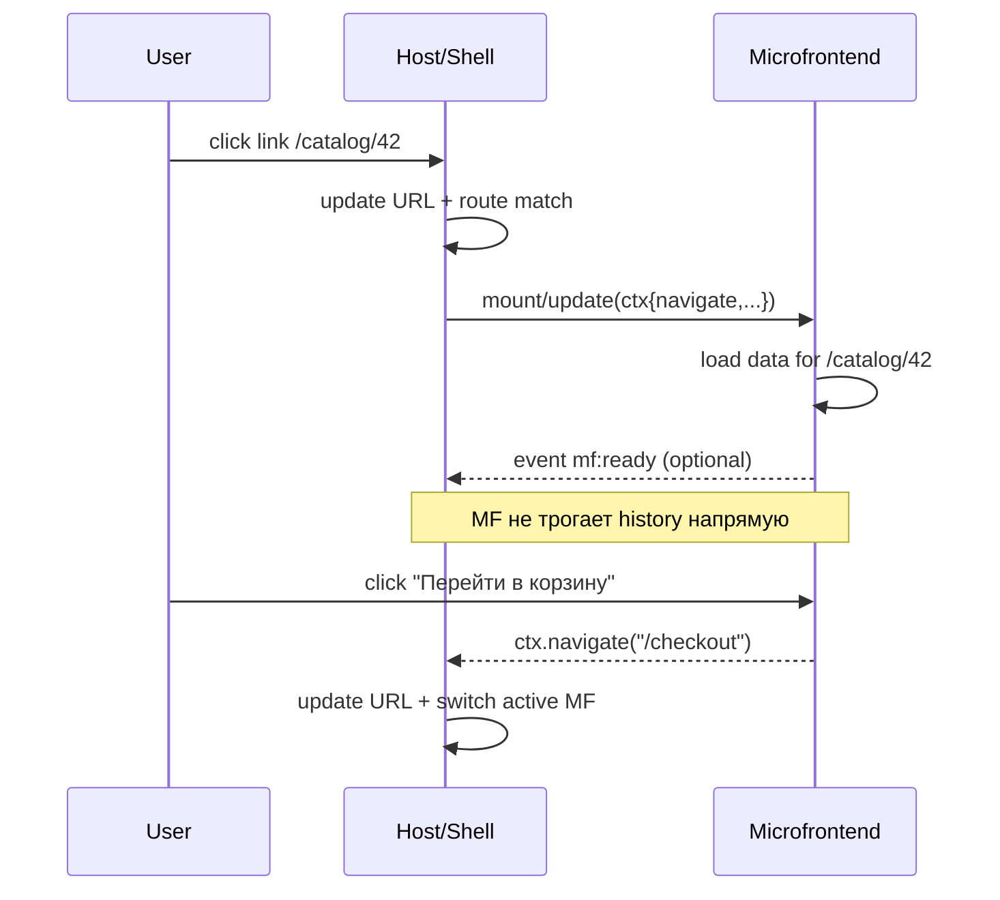
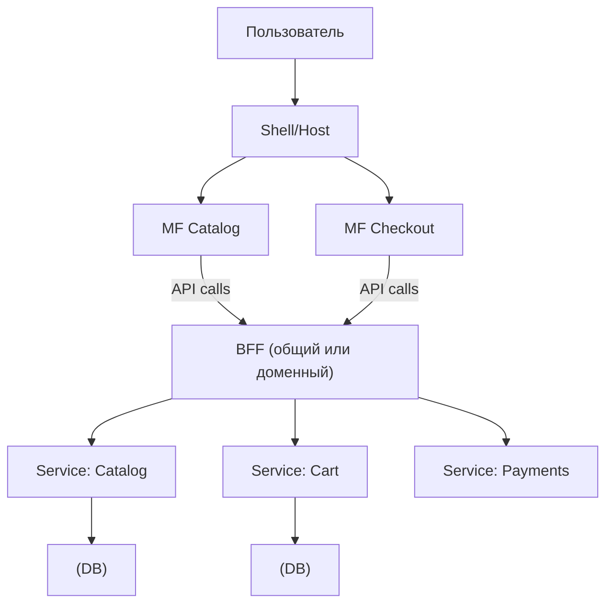

[← Назад к индексу части 28](index.md)

## 28.1 Границы и владение

### Цель раздела

Сформировать у тебя правильную “точку отсчёта”: **микрофронтенды начинаются не с Webpack**, а с **границ ответственности**. Мы разберём:

- как определить, что является микрофронтендом (и что им не является);
- какие обязанности у shell/host;
- какой минимальный набор контрактов нужен, чтобы система была предсказуемой.

### В этом разделе главное

- **Граница микрофронтенда = граница владения + контракт интеграции.**
- Shell — это “склейка”: **URL, навигация, общие зависимости, общий UX.**
- Самая частая ошибка — “разрезать по папкам”, не определив **контракты** (жизненный цикл, навигация, данные).

### Термины

| Термин | Коротко |
| --- | --- |
| **Вертикальная граница** | микрофронтенд владеет “срезом” фичи: UI + логика + возможно свой BFF/часть API‑адаптации |
| **Горизонтальная граница** | микрофронтенд — “слой” (например, только UI‑виджеты), а данные и логика общие |
| **Композиция страницы** | страница собирается из фрагментов от разных микрофронтендов (виджеты/зоны) |
| **Контракт** | явное соглашение: что принимает, что отдаёт, когда вызывается, какие ошибки допустимы |

### Теория и правила

#### 1) Что такое микрофронтенд “по сути”

Формулировка (архитектурная):

**Микрофронтенд** — это часть фронтенд‑продукта, которая:

- имеет **отдельную зону ответственности** (обычно фича/домен/команда),
- может иметь **отдельный цикл релиза** (в идеале — независимый),
- интегрируется в общий продукт через **явный контракт**,
- встраивается так, что пользователь ощущает **одно приложение** (единая навигация, единый UX).

Простая проверка на “настоящесть”:

- Если команда может выкатить свой фрагмент **без общего релиза всего фронта** — ты ближе к микрофронтендам.
- Если всё равно нужен общий релиз и общий “release train”, а “микрофронтенды” — это просто папки — это пока **модульный фронт‑монолит**.

Проверь себя (что такое микрофронтенд)

1. Назови два признака, без которых “микрофронтенд” чаще всего остаётся просто “папкой в монорепе”.  
2. Почему “одно приложение по ощущениям пользователя” — требование к микрофронтендам, даже если релизы независимые?  
3. Приведи пример, когда **частичная независимость** (не 100%) уже даёт пользу.

<details><summary>Ответ</summary>

1. Наличие независимой поставки хотя бы части изменений и явного контракта интеграции (lifecycle/nav/data/errors). Без этого обычно это модульный фронт‑монолит.  
2. Потому что пользователь ожидает единый UX: URL, “Назад”, обработку ошибок, единые стили/поведение. Если это не соблюдено, продукт распадается на несвязанные части.  
3. Например, команда “Каталог” выкатывает изменения каталога независимо от “Оплаты”, но обе части живут под единым shell и общим протоколом — это уже снижает очередь релизов и конфликт правок.

</details>

#### 2) Как определить границы (самое важное)

Есть несколько осей, по которым пытаются “резать”. Все они встречаются, но работают по‑разному.

**Ось A. По доменам/фичам (рекомендуемый базовый вариант)**  
Например: “Каталог”, “Корзина”, “Оплата”, “Профиль”.  
Плюсы: соответствует ответственности команд, меньше «сквозных правок».  
Минусы: страницу часто приходится **композировать** из нескольких частей.

**Ось B. По страницам (иногда удобнее для навигации)**  
Например: `/catalog/*` — один микрофронтенд, `/checkout/*` — другой.  
Плюсы: проще роутинг и deep linking.  
Минусы: доменные сущности могут повторяться (карточка товара и в каталоге, и в корзине).

**Ось C. По “виджетам” на одной странице (самая конфликтная зона)**  
Например: “виджет рекомендаций”, “виджет промо”, “виджет доставки”.  
Плюсы: очень независимые вставки.  
Минусы: общая навигация, общий стиль, общий перф — становятся болью; легко получить “зоопарк”.

Практическое правило:

- если у тебя **1 команда** и единый релиз — микрофронтенды почти всегда **избыточны**;
- если у тебя **3+ команды** и они мешают друг другу в релизах/ревью/регрессии — микрофронтенды могут быть оправданы;
- границы должны совпадать с:
  - владением (кто отвечает),
  - бизнес‑ценностью (что доставляем),
  - независимостью изменений (что часто меняется отдельно).

Проверь себя (как выбрать границы)

1. Почему “резать по виджетам” часто выглядит удобно на старте, но становится проблемой позже?  
2. Чем “граница по страницам” отличается от “границы по доменам” по влиянию на повторное использование UI‑компонентов и данных?  
3. Назови один сигнал, что границы выбраны плохо (на уровне процессов/релизов), и один — что плохо (на уровне кода).

<details><summary>Ответ</summary>

1. Потому что виджеты чаще пересекаются по данным, стилям и навигации, и получается много маленьких интеграций, которые сложно версионировать и тестировать. Это быстро увеличивает координацию и риск конфликтов.  
2. По страницам проще навигация и deep linking, но выше риск дублирования доменных компонентов/клиентов. По доменам проще владение и независимость изменений, но сложнее композиция страниц и согласование UI‑каркаса.  
3. Процессы: любая фича требует синхронного релиза 2–3 команд. Код: раздувается shared‑слой “на всё”, появляются прямые импорты или скрытые зависимости между микрофронтендами.

</details>

#### 2.1) Владение (ownership) как контракт: кто за что отвечает

Микрофронтенды часто “ломаются” организационно, а не технически. Поэтому полезно сделать **владение явным**: не “мы примерно договорились”, а “у этого есть владелец”.

**Интуиция:** если компонент системы без владельца — он деградирует:

- баги не чинятся быстро (“это не наше”),
- обновления откладываются (“кто тронет — тот и отвечает”),
- правила становятся непоследовательными.

Мини‑модель владения, которая работает в большинстве команд:

| Артефакт | Кто владеет | Что это значит на практике |
| --- | --- | --- |
| **Shell/Host** | команда платформы/инфры фронта (или выделенный владелец) | отвечает за URL/навигацию, политику ошибок, загрузку remotes, общие политики |
| **Каждый микрофронтенд** | доменная команда (Catalog/Checkout/…) | отвечает за свою фичу, контракт v1, качество перфа в своей зоне |
| **Shared слой (дизайн‑система, i18n, аналитика SDK)** | владелец shared‑пакета (не “все”) | выпускает версии, ведёт changelog, обеспечивает обратную совместимость |
| **Протокол интеграции** (`protocolVersion`) | совместный владелец (обычно host + platform) | определяет правила версии, deprecation, “срок жизни” v1/v2 |

Важно: “владение” — это не бюрократия, а ускоритель. Если ты знаешь владельца — ты знаешь:

- где принимать решение,
- где чинить инцидент,
- кто отвечает за совместимость.

Проверь себя (ownership)

1. Почему shared‑слой не должен “принадлежать всем сразу”?  
2. Какие 2 ответственности ты бы никогда не отдавал(а) микрофронтендам “на самотёк”, оставляя их в shell?  
3. Что будет, если протокол интеграции менять без владельца и deprecation‑периода?

<details><summary>Ответ</summary>

1. “Все” обычно означает “никто”: нет релизной дисциплины, нет поддержки, нет гарантий обратной совместимости.  
2. Единый URL/навигация и политика ошибок/фолбэков (а также загрузка remotes и общие политики безопасности/наблюдаемости).  
3. Breaking changes станут случайными прод‑инцидентами: часть пользователей будет на старом remote/кэше, часть — на новом host, совместимость развалится.

</details>

#### 3) Роль shell/host

Shell — это не “ещё одна страница”, а **компонент склейки**. Обычно на нём:

- базовая инфраструктура UI: layout, шапка/меню, “рамка” приложения;
- **маршрутизация верхнего уровня** (или делегирование маршрутов);
- общие поп‑апы/страницы ошибок/404 (или правила их отображения);
- аутентификация на клиенте (UI‑слой) и базовая авторизация в UI (но не забываем: права проверяет сервер);
- общие зависимости (дизайн‑система, i18n, аналитика, трейсинг ошибок);
- общие “политики”: версия протокола, формат событий, правила кэширования.

В идеале shell должен оставаться **тонким**, иначе он превращается в “новый монолит”.

Проверь себя (роль shell/host)

1. Назови 3 обязанности shell, которые дают “ощущение одного приложения”.  
2. Почему “толстый shell” опасен даже при наличии микрофронтендов?  
3. Приведи пример, какую логику разумно оставить в микрофронтенде, а какую — в shell (и почему).

<details><summary>Ответ</summary>

1. Единый URL/навигация, единая политика ошибок/фолбэков, общие зависимости и политики (дизайн‑система/i18n/аналитика), загрузка и размещение remotes.  
2. Потому что он превращается в новый монолит: очередь изменений возвращается, границы размываются, а сложность интеграции остаётся.  
3. В микрофронтенде — доменная UI‑логика и отображение (например, каталог и его фильтры). В shell — верхнеуровневая навигация/404/общий layout/политики загрузки и ошибок, чтобы UX и правила были едиными.

</details>

#### 4) Минимальный набор контрактов

Если ты хочешь предсказуемость, тебе нужны как минимум:

- **контракт жизненного цикла** (как загружать/монтировать/размонтировать),
- **контракт размещения** (куда рендерить, какие слоты/контейнеры),
- **контракт навигации** (кто и как меняет URL/history),
- **контракт данных** (как передавать контекст: user, locale, feature flags, токены),
- **контракт ошибок** (что делать при падении микрофронтенда: fallback, изоляция, репортинг).

Проверь себя (минимальные контракты)

1. Почему нельзя ограничиться только `mount()` и “как‑нибудь заработает”?  
2. Что именно должен покрывать контракт навигации, чтобы deep linking и кнопка “Назад” не ломались?  
3. Какой контракт чаще всего забывают на старте и почему это всплывает именно в продакшене?

<details><summary>Ответ</summary>

1. Потому что без nav/data/errors контрактов система становится непредсказуемой: история ломается, данные дублируются/рассинхронятся, а ошибка одного фрагмента может уронить всё или дать “вечный спиннер”.  
2. Кто владеет `history`, как микрофронтенд инициирует навигацию (через `ctx.navigate`/события), какие префиксы URL допустимы, как обрабатывается вход по deep link и 404/ошибки.  
3. Контракт ошибок и деградации: пока всё работает, про него не думают; когда remote не загрузился/упал, без него пользователь видит белый экран.

</details>

#### 4.1) Контракт ошибок: “один упал — не уронил всех”

Это очень практичная часть архитектуры, потому что в микрофронтендах ошибки неизбежны:

- remote может не загрузиться (сеть/CDN/кэш),
- `mount()` может упасть из‑за несовместимости или бага,
- микрофронтенд может рендерить ошибку в рантайме.

**Интуиция:** если один фрагмент упал, пользователь должен:

- увидеть понятный fallback в зоне этого фрагмента,
- иметь возможность продолжить работу (если это возможно),
- а команда — получить сигнал (лог/ошибка/метрика) с контекстом.

Минимальные правила контракта ошибок:

- **граница ошибок на уровне слота**: каждый микрофронтенд “обёрнут” error boundary в shell (или эквивалентом для не‑React окружения);
- **тайм‑аут загрузки remote**: если за \(N\) секунд не загрузилось — показать fallback и дать “повторить”;
- **репортинг**: host предоставляет `ctx.reportError(e)` (или аналог), чтобы все микрофронтенды отправляли ошибки единообразно;
- **мягкая деградация**: при несовместимости версии протокола — не падать “в белый экран”, а показать сообщение/заглушку + лог для команды.

Картинка: изоляция ошибок по слотам

```text
Shell (global) error boundary
  |
  +-- Slot A boundary -> MF A (упал) -> fallback только в Slot A
  |
  +-- Slot B boundary -> MF B (работает) -> UI продолжает жить
```

Проверь себя (контракт ошибок)

1. В чём разница между “ошибка внутри микрофронтенда” и “ошибка композиции/загрузки remote”, и почему их важно различать?  
2. Почему “вечный спиннер” — архитектурная ошибка, а не “просто UI”?  
3. Какие 2–3 сигнала ты бы обязательно отправлял(а) при ошибке (для расследования)?

<details><summary>Ответ</summary>

1. Ошибка внутри mf — это баг его логики/рендера при уже загруженном коде. Ошибка композиции — это загрузка/совместимость/кэш/протокол (mf может даже не стартовать). Диагностика и владельцы разные.  
2. Потому что он скрывает сбой: пользователь не понимает, что произошло, а система не деградирует управляемо. Нужен тайм‑аут, fallback и репортинг — это часть контракта.  
3. `trace_id`, `mf.name`, `mf.version`, `protocolVersion`, `host.version`, тип ошибки (load/mount/runtime) и URL/route.

</details>

#### 5) Контракт навигации: единый URL, deep linking и кнопка «Назад»

Это место, где микрофронтенды чаще всего “ломают ощущение одного приложения”.

**Интуиция:** пользователь ожидает, что:

- URL отражает текущий экран/контекст,
- ссылкой можно поделиться (deep linking),
- “Назад” работает предсказуемо,
- вкладки и фильтры (если это важно) восстановятся из URL.

В микрофронтендах есть две базовые схемы, и важно выбрать одну и закрепить.

**Схема 1. Shell владеет роутингом (наиболее предсказуемо).**

- Shell принимает решение “какой микрофронтенд активен” по URL.
- Микрофронтенд не пишет в `history` напрямую, а **просит** навигацию через `ctx.navigate(to)`.
- Внутреннюю маршрутизацию микрофронтенд может вести “внутри своего префикса” (например, `/catalog/*`), но изменения URL согласованы через shell.

**Схема 2. Делегирование роутинга микрофронтендам (опаснее, но иногда нужно).**

- Shell отдаёт “зону URL” микрофронтенду (например, всё под `/profile/*`).
- Микрофронтенд может сам менять `history`, но обязуется:
  - не ломать чужие префиксы,
  - отправлять события о навигации (для аналитики/трекинга/состояния оболочки),
  - корректно обрабатывать “первый вход по deep link”.

Практическое правило для начала:

- **первый пилот** почти всегда проще сделать по схеме 1 (shell владеет), потому что тогда меньше “двух капитанов” у history.

Диаграмма: навигация “shell владеет URL”



Мини‑пример: “просить навигацию”, а не “управлять history”

```ts
// Внутри микрофронтенда
function onGoToCheckout() {
  ctx.navigate("/checkout?from=catalog");
}
```

Почему это снижает хаос:

- у тебя одна точка, которая знает правила маршрутов;
- проще обеспечить 404/error/fallback на уровне продукта;
- проще инструментировать аналитику и наблюдаемость.

Проверь себя (контракт навигации)

1. Почему “два капитана у history” почти гарантированно ломают кнопку “Назад”?  
2. Что должен делать микрофронтенд при “первом входе по deep link” и где это прописывается?  
3. Какой компромисс между схемой “shell владеет” и “делегирование роутинга” ты считаешь приемлемым, и почему?

<details><summary>Ответ</summary>

1. Потому что два независимых источника изменений URL порождают непредсказуемый порядок пушей/реплей истории и разные представления “где мы сейчас”. В итоге back/forward не соответствует ожиданиям.  
2. Он должен уметь восстановить своё состояние из URL (путь/query) и корректно отрендерить/загрузить данные. Это часть контракта навигации и роутинга (описана в правилах интеграции).  
3. Обычно: shell владеет верхнеуровневым URL и префиксами, а внутри префикса mf может иметь внутренние под‑маршруты, но изменения всё равно идут через согласованный механизм (ctx.navigate/события).

</details>

#### 6) Контракт данных между микрофронтендами: 4 канала и их цена

Когда микрофронтенды живут рядом, почти всегда появляется вопрос:
“Как Catalog передаст Checkout, что пользователь выбрал товар X?”

Есть четыре распространённых канала. Важно понимать, что это **не равноценные** способы.

**Канал 1. URL (query params / path params)**  
Лучше всего для:

- навигационного состояния (выбранная вкладка, фильтр, страница пагинации),
- идентификаторов (productId, orderId),
- воспроизводимого контекста (deep link).

Плохо подходит для:

- больших payload (списки объектов),
- чувствительных данных (токены, PII),
- временных “слепков” UI.

**Канал 2. События (CustomEvent / EventTarget / postMessage)**  
Лучше всего для:

- “сигналов” (что‑то произошло) и небольших сообщений,
- интеграции виджетов,
- слабой связанности (publish/subscribe).

Риск:

- если события не версионировать и не документировать, получится “магия”.

**Канал 3. Shared слой (общая библиотека или шина)**  
Лучше всего для:

- единого клиента аналитики/логирования,
- дизайн‑системы,
- единого слоя feature flags / конфигурации.

Риск:

- shared слой может вырасти в “скрытый монолит” (всё туда).

**Канал 4. Backend/BFF как “источник правды”**  
Лучше всего для:

- данных домена (корзина, заказы) — пусть живут на сервере,
- консистентности между микрофронтендами,
- безопасности (не доверять клиенту).

Идея:

- микрофронтенды не должны “передавать друг другу корзину”, они передают **ID/навигацию**, а состояние корзины читают из API.

Мини‑пример: события как “сигнал”, а не как “передача базы данных”

```ts
// shell создает общую шину (EventTarget) и передает в ctx
const bus = new EventTarget();
const ctx = { protocolVersion: "v1", bus, navigate, /* ... */ };

// microfrontend A
ctx.bus.dispatchEvent(new CustomEvent("cart:add", { detail: { productId: "p1" } }));

// microfrontend B (или shell)
ctx.bus.addEventListener("cart:add", (e: Event) => {
  const { productId } = (e as CustomEvent).detail;
  // Важно: дальше - запрос на backend/BFF, а не "храним корзину в событии"
  api.addToCart(productId);
});
```

Правило безопасности и архитектуры:

- **не передавай секреты** и “источник правды” через события/URL;
- события — для “команды” и небольших сигналов, источник истины — backend/BFF.

Проверь себя (контракт данных)

1. Почему URL — “самый безопасный” канал для навигационного контекста, но плохой — для “данных домена”?  
2. В чём опасность общего shared store между микрофронтендами, если цель — независимость?  
3. Придумай пример: какое событие между микрофронтендами ок (signal), а какое — плохая идея (payload)?

<details><summary>Ответ</summary>

1. URL хорошо поддерживает deep linking и воспроизводимость состояния (id, фильтры), но плохо подходит для больших/чувствительных payload и не должен становиться источником истины.  
2. Shared store создаёт скрытые зависимости и общий инвариант: изменения одного mf влияют на остальных, независимые релизы и тестирование усложняются — система снова становится монолитом “через состояние”.  
3. Ок: `cart:add {productId}` как намерение. Плохая идея: `cart:set {fullCartObject}` как “передача базы данных” между mf.

</details>

#### 6.1) Вертикальные границы: микрофронтенд + (опционально) свой BFF

В глобальном плане микрофронтенды прямо связаны с идеей **вертикальных границ**: микрофронтенд может владеть не только UI, но и “адаптацией данных” под себя.

**Интуиция простыми словами:** если разные команды делают разные части продукта, им часто нужен “свой вход” к данным:

- чтобы не ждать, пока общий бекенд добавит “ещё одно поле”;
- чтобы агрегировать несколько сервисов в один “экранный” ответ;
- чтобы скрыть внутренние изменения бекенда от UI‑команды.

Тогда появляется BFF‑слой:

- либо **один общий BFF на весь продукт**,
- либо **BFF “по доменам/микрофронтендам”** (не всегда физически отдельный сервис, иногда это логическая граница внутри одного BFF).

Важно не перепутать:

- **BFF — это не “обойти бекенд”**, а слой адаптации под клиент/экран;
- источник истины остаётся в доменных сервисах/БД, BFF не должен становиться “вторым бекендом с бизнес‑логикой”.

Диаграмма: клиент → shell → микрофронтенды → (BFF) → сервисы



Практическое правило про данные:

- **между микрофронтендами передавай идентификаторы и намерения** (ID/событие/URL),
- **данные домена загружай из API** (обычно через BFF), чтобы не держать “второй источник истины” в браузере.

Типичные ошибки вертикальных границ:

- “у каждого микрофронтенда свой BFF” без общей политики аутентификации/логирования → разная безопасность и разные инциденты;
- BFF превращается в место бизнес‑логики (“так быстрее”), и потом его невозможно эволюционировать;
- микрофронтенды начинают обмениваться “слепками доменных данных” напрямую (через события/shared store), и консистентность ломается.

Проверь себя (про BFF и вертикальные границы)

1. Почему BFF полезен именно в микрофронтендах, а не только “вообще во фронте”?  
2. Что опаснее: общий BFF без границ владения или BFF по доменам без общих политик? Почему?  
3. Почему “передать корзину через событие” хуже, чем “передать `cartId` и загрузить из API”?

<details><summary>Ответ</summary>

1. Потому что микрофронтенды усиливают независимость команд, а BFF даёт независимость в форме данных/агрегации под экраны. Это снижает зависимость UI‑команды от изменений в доменных сервисах и уменьшает “сквозные” правки.  
2. Оба опасны по‑своему. Общий BFF без границ превращается в монолит и очередь на изменения. Доменные BFF без общих политик дают зоопарк безопасности/логов/версий. Практичный путь — общий слой политик (auth/observability) + границы владения внутри BFF.  
3. Потому что событие даёт второй источник истины и легко приводит к рассинхрону. `cartId` + загрузка из API делает сервер источником правды, а фронт — отображением.

</details>

#### 7) Тестирование композиции: как убедиться, что “вместе работает”

Микрофронтенды ломаются не в unit‑тестах, а **на стыке**.

Практичный набор, который даёт высокий эффект за разумную цену:

- **Contract checks**: host проверяет, что remote экспортирует `mount/unmount` и нужную версию протокола.
- **Smoke composition**: сборка “host + remotes” в тестовом окружении и быстрый прогон: открывается ли страница, нет ли ошибок загрузки remote.
- **E2E критичных потоков**: 2–5 сценариев (логин → каталог → корзина → оплата).

Пример “smoke‑сценария” на человеческом уровне:

- открыть `/catalog`,
- дождаться события `mf:ready`,
- кликнуть “добавить в корзину”,
- перейти в `/checkout`,
- убедиться, что корзина не пустая.

Ключевой принцип:

- тесты должны проверять **контракты и критические пользовательские потоки**, а не внутренности реализации микрофронтенда.

Проверь себя (тестирование композиции)

1. Почему unit‑тесты внутри микрофронтенда почти не ловят ошибки “между mf и host”?  
2. Что именно должны проверять contract checks, чтобы это было полезно, а не “формальность”?  
3. Как выбрать 2–5 E2E потоков так, чтобы они были “дешёвые”, но реально защищали прод?

<details><summary>Ответ</summary>

1. Потому что проблема часто в стыке: версия протокола, способ навигации, shared deps, загрузка remote, кэш. Unit‑тесты живут внутри mf и не видят этих условий.  
2. Наличие обязательных экспортов (mount/unmount), поддерживаемую версию протокола, формат событий/контекста, и базовую совместимость входов/выходов (например, что `ctx.navigate` вызывается корректно).  
3. Брать критичные пользовательские деньги/доступ/конверсию потоки (логин/покупка/оплата) + один поток навигации между mf. Не тестировать всё, а защитить “самые дорогие падения”.

</details>

### Пошагово: как спроектировать границы микрофронтендов

Ниже не “единственно верный” алгоритм, а практичный путь, который уменьшает хаос.

1) **Составь карту доменов/фич и команд.**  
Список: “Каталог”, “Корзина”, “Профиль”… и кто за это отвечает.

2) **Нарисуй пользовательские потоки.**  
Например: поиск → карточка товара → корзина → оплата → успех.  
Смотри, где чаще всего пересекаются изменения (это кандидаты на shared‑слой, но не на “всё общее”).

3) **Выбери первичную ось разрезания.**  
Обычно это домены/фичи или страницы. Виджеты — осторожно.

4) **Определи, что точно остаётся в shell.**  
Минимум: навигация верхнего уровня, общий layout, общая обработка ошибок, дизайн‑система (или политика её подключения).

5) **Зафиксируй контракты на стыке.**  
Прямо текстом (и лучше в репозитории рядом с кодом):  
`mount(container, context)`, `unmount()`, события `mf:navigate`, `mf:ready`, версия протокола `v1`.

6) **Определи стратегию тестирования композиции.**  
Какие тесты гарантируют, что host и микрофронтенд совместимы (см. ниже).

### Простыми словами

Представь торговый центр:

- **Shell** — это здание: входы, коридоры, вывески, общие правила безопасности.
- **Микрофронтенды** — это магазины разных брендов: каждый обновляет витрину и ассортимент независимо.
- Чтобы посетитель не чувствовал хаос, нужны правила: **как магазины подключаются**, как они **общаются** (например, где туалет/выход), какой **единый стиль навигации** (указатели), какие **общие сервисы** (охрана, уборка).

Если ты просто “нарезал магазинчики”, но не сделал коридоры и правила — получится рынок, а не торговый центр.

### Картинка в голове

```text
Пользователь
  |
  v
URL / Навигация / История
  |
  v
┌──────────────────────────────┐
│            SHELL             │
│ layout, auth UI, errors      │
│ top-level routing            │
│ shared deps (design system)  │
└───────┬───────────┬──────────┘
        |           |
        v           v
  ┌──────────┐  ┌──────────┐
  │  MF A    │  │  MF B    │    ... (другие)
  │ Catalog  │  │ Checkout │
  └──────────┘  └──────────┘
        ^           ^
        |           |
   контракты: mount/unmount, events, routes
```

### Диаграмма: “host ↔ микрофронтенды” и контракты

```mermaid
flowchart TB
  U["Пользователь"] -->|клик / URL| H["Shell / Host"]

  subgraph Shell["Shell / Host"]
    R["Router верхнего уровня"]
    L["Layout + общие UI-обвязки"]
    S["Shared: дизайн-система, i18n, аналитика"]
    E["Error boundaries + fallback"]
  end

  H --> R
  H --> L
  H --> S
  H --> E

  H -->|mount('container, context')| A["MF A: Catalog"]
  H -->|mount('container, context')| B["MF B: Checkout"]
  H -->|mount('container, context')| C["MF C: Profile"]

  A -->|events: mf:navigate / mf:data| H
  B -->|events: mf:navigate / mf:error| H
  C -->|events: mf:ready| H
```

### Примеры: контракт жизненного цикла (универсальная форма)

Ниже — **не “единственный стандарт”**, а понятная форма контракта, которая хорошо работает независимо от фреймворка.

```ts
// Типовой контракт микрофронтенда как "плагина".
export type HostContextV1 = {
  protocolVersion: "v1";
  locale: string;
  user?: { id: string; roles: string[] };
  featureFlags: Record<string, boolean>;
  navigate: (to: string) => void; // безопасный способ просить навигацию
  reportError: (e: unknown) => void;
};

export type MicrofrontendV1 = {
  mount: (container: HTMLElement, ctx: HostContextV1) => void;
  update?: (ctx: HostContextV1) => void; // например, смена locale/featureFlags
  unmount: () => void;
};
```

Почему это важно:

- `mount/unmount` заставляет микрофронтенд **освобождать ресурсы** (listeners, timers, subscriptions).
- `protocolVersion` позволяет версионировать контракт (см. 28.3).
- `navigate` как функция — безопаснее, чем “лезть” напрямую в history хоста.

### Практика / реальные сценарии

#### Сценарий 1. “Несколько команд мешают релизам”

Симптомы:

- релизы редкие и болезненные (“всё вместе”),
- любая правка в одной зоне ломает другую,
- очередь на ревью/мерджи, конфликты.

Решение‑кандидат:

- выделить 1–2 микрофронтенда по самым независимым доменам,
- сделать shell тонким,
- зафиксировать контракт жизненного цикла и навигации,
- измерить: ускорился ли time‑to‑market и снизился ли конфликт изменений.

#### Сценарий 2. “Нужно встраивать сторонний виджет”

Например: платежный виджет от партнёра или старый легаси‑кабинет.

Решение‑кандидат:

- начать с iframe (максимум изоляции),
- продумать `postMessage`‑контракт,
- если виджет станет “родным” и глубоко интегрированным — мигрировать к JS‑bundle / Web Components / Federation.

### Типичные ошибки

- **Резать по папкам**, не определив контракты. Итог: связность остаётся, а сложность растёт.
- Делать shell “толстым” (вся логика там). Итог: новый монолит.
- Обмен данными “как получится”: прямые импорты между микрофронтендами, общий гигантский store. Итог: обратно монолит, но хуже.

### Что будет если…

- …у микрофронтенда нет `unmount()` и он не освобождает listeners?  
  Получишь утечки памяти, двойные обработчики кликов, “призрачные” запросы, нестабильный перф при навигации.

- …каждый микрофронтенд управляет history сам по себе?  
  Кнопка “Назад” станет непредсказуемой, deep linking начнёт ломаться, баги будут “не воспроизводиться” между командами.

### Проверь себя

1. Почему “границы микрофронтендов” нельзя определять только по UI‑дереву?  
2. Назови 3 ответственности shell, которые обычно нельзя раздавать микрофронтендам “как попало”.  
3. Какие 2–3 контракта ты бы зафиксировал(а) в первую очередь, если внедряешь микрофронтенды впервые?

<details><summary>Ответ</summary>

1. UI‑дерево меняется часто, а границы должны быть стабильнее и соответствовать владению/доменам. Если резать по UI‑узлам, получится постоянная перекройка и много пересечений.  
2. Единый URL/навигация, общая обработка ошибок/фолбэков, общие зависимости и политики (дизайн‑система, i18n, аналитика/auth UI).  
3. Жизненный цикл (mount/unmount), навигация (кто меняет URL, как делаем deep linking), и контракт данных/контекста (locale/user/feature flags + правила передачи).

</details>

### Запомните

- Микрофронтенды — это **организационный инструмент**: независимость команд и релизов.  
- Без контрактов микрофронтенды дают **не независимость, а хаос**.  
- Shell — это “склейка”, он должен быть **тонким, но строгим** в правилах.

---
