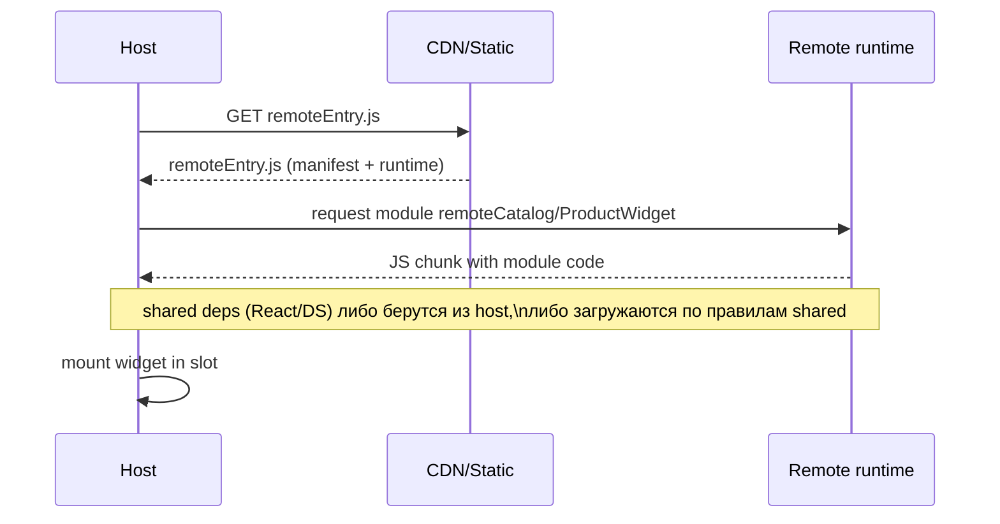
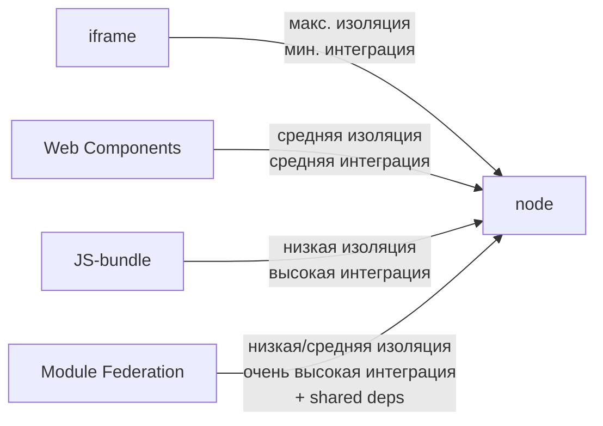

[← Назад к индексу части 28](index.md)

## 28.2 Способы интеграции

### Цель раздела

Научиться выбирать **способ интеграции** под реальный сценарий и понимать цену:

- изоляция (безопасность, стили, зависимости),
- совместимость (версии, shared runtime),
- производительность (вес, количество фреймворков),
- эксплуатация (деплой, откат, диагностика).

### В этом разделе главное

- Нет “лучшего способа”. Есть **подходящий под ограничения**.
- Чем сильнее изоляция (iframe), тем сложнее **интегрировать UX**.
- Чем ближе интеграция (JS‑bundle/Federation), тем важнее **совместимость версий** и дисциплина shared‑зависимостей.

### Термины

| Термин | Коротко |
| --- | --- |
| **Изоляция** | насколько микрофронтенд защищён от стилей/скриптов других |
| **Композиция** | насколько легко “склеить” несколько микрофронтендов в одну страницу |
| **Runtime integration** | интеграция в рантайме (подгрузка модулей на лету), а не на этапе сборки |

### Теория и правила

Ниже — 4 распространённых подхода, которые часто комбинируют.

#### Подход A. iframe

**Как работает:** в shell вставляется `<iframe src="...">`, внутри — отдельная страница/приложение.

Плюсы:

- сильная изоляция JS/CSS (почти как отдельный сайт),
- проще безопасность границ (sandbox‑политики),
- удобно для легаси/внешних систем.

Минусы:

- сложный UX: высота, скролл, фокус, модалки поверх всего,
- коммуникация через `postMessage` (явный протокол),
- навигация и deep linking требуют дисциплины (как синхронизировать URL?).

Когда подходит:

- виджет/легаси, который нужно быстро встроить и изолировать,
- разные домены/организации,
- высокий риск конфликтов.

Безопасность (важно, если iframe — внешний/недоверенный)

iframe часто выбирают именно из‑за изоляции. Но изоляция “по умолчанию” — не равно “безопасно”.

Ключевые элементы:

- **`sandbox`**: ограничивает, что iframe вообще может делать (скрипты, формы, popups, top‑navigation).
- **CSP (Content‑Security‑Policy)**: политика, что можно загружать и исполнять (скрипты/стили/фреймы).
- **Origin checks** в `postMessage`: принимать сообщения только от ожидаемого `origin`.

Мини‑пример: строгий sandbox (как идея)

```html
<iframe
  src="https://mf.example.com/widget"
  sandbox="allow-scripts allow-forms"
  referrerpolicy="no-referrer"
></iframe>
```

Пояснение простыми словами:

- `sandbox` без `allow-same-origin` делает iframe сильнее изолированным, но может ломать часть сценариев (cookies/storage).
- `allow-top-navigation` и похожие флаги опасны: iframe сможет уводить пользователя “наверх” без твоего контроля.

Типичная ошибка безопасности:

- принимать `postMessage` “от кого угодно” и выполнять команды навигации/логина. Всегда проверяй `event.origin`.

Мини‑пример контракта `postMessage`:

```js
// Внутри iframe
window.parent.postMessage(
  { type: "mf:navigate", to: "/checkout?step=payment", v: 1 },
  "https://host.example.com"
);

// Внутри host
window.addEventListener("message", (event) => {
  if (event.origin !== "https://mf.example.com") return;
  const msg = event.data;
  if (msg?.type === "mf:navigate" && msg.v === 1) {
    hostNavigate(msg.to);
  }
});
```

Проверь себя (iframe)

1. Почему iframe часто выбирают для легаси/внешних систем, даже если UX хуже?  
2. Какие два правила безопасности для `postMessage` ты считаешь обязательными и почему?  
3. В каком случае `sandbox` может сломать функциональность, и как это обнаружить до прод?

<details><summary>Ответ</summary>

1. Потому что iframe даёт сильную изоляцию JS/CSS и границу доверия: чужой код меньше влияет на остальную страницу, проще ограничить права и “песочницей” снизить риски конфликтов.  
2. Проверять `event.origin` (иначе любой сайт может послать команду) и версионировать/валидировать формат сообщения (иначе контракт превращается в неуправляемую “магию” и источник уязвимостей).  
3. Например, без `allow-same-origin` могут не работать cookies/storage; без нужных allow‑флагов — формы или скрипты. Выявляют через тестовый стенд и чек‑лист сценариев (логин, навигация, обмен сообщениями) + мониторинг ошибок.

</details>

#### Подход B. JS‑bundle (динамическая загрузка скрипта)

**Как работает:** host загружает скрипт микрофронтенда (`<script src="...">`) и вызывает `mount()`.

Плюсы:

- можно добиться “ощущения одного приложения”,
- проще общие UX‑правила (один DOM, один роутинг при правильной схеме),
- меньше ограничений, чем iframe.

Минусы:

- риск конфликтов глобальных зависимостей и стилей,
- “две версии React” — частая боль,
- нужно дисциплинировать контракт жизненного цикла.

Набросок (псевдокод):

```js
async function loadScript(url) {
  return new Promise((resolve, reject) => {
    const s = document.createElement("script");
    s.src = url;
    s.onload = resolve;
    s.onerror = reject;
    document.head.appendChild(s);
  });
}

// mf.bundle.js выставляет window.MF_CATALOG = { mount, unmount }
await loadScript("https://cdn.example.com/mf-catalog.bundle.js");
window.MF_CATALOG.mount(document.getElementById("slot-catalog"), hostContext);
```

Безопасность и контроль целостности (почему “просто загрузить скрипт с CDN” опасно)

JS‑bundle интеграция похожа на подключение “плагина” в твоё приложение. Если скрипт подменят — это фактически RCE в браузере пользователя.

Практики, которые обычно обсуждают на архитектурном уровне:

- загрузка только с доверенных доменов (CSP `script-src`);
- фиксация версии/хеша артефакта (content hash в URL);
- наблюдаемость загрузки (логировать, какой URL/версия была загружена).

Важно: техническая реализация (SRI, CSP‑заголовки и т.п.) зависит от инфраструктуры и обычно глубже раскрывается в части 29/31, но архитектурный вывод здесь простой: **динамическая загрузка кода = граница доверия**.

Проверь себя (JS‑bundle)

1. Почему интеграция через JS‑bundle чаще ломается на “глобальных” эффектах (CSS/глобальные переменные), а не на “бизнес‑логике”?  
2. Какая минимальная “политика безопасности” должна быть у host при динамической загрузке скриптов?  
3. Назови два способа снизить риск “несовместимая версия remote в кэше” именно для JS‑bundle подхода.

<details><summary>Ответ</summary>

1. Потому что микрофронтенд исполняется в одном DOM/JS‑окружении с host: любые глобальные селекторы/полифилы/переопределения могут влиять на соседей.  
2. Загрузки только с доверенных источников (CSP `script-src`), контроль версий/URL артефактов, наблюдаемость (логировать, что именно загрузили) и план деградации при ошибке загрузки.  
3. Content‑hash в URL, manifest‑выбор версии, версионирование протокола + fallback на стабильную версию, плюс canary‑выкладка.

</details>

#### Подход C. Web Components

**Как работает:** микрофронтенд поставляет кастомный элемент, например `<mf-catalog></mf-catalog>`.

Плюсы:

- хорошая граница интеграции: стандарт браузера,
- можно изолировать стили через Shadow DOM,
- разные фреймворки могут сосуществовать (React/Vue/Svelte).

Минусы:

- нужно аккуратно проектировать API (атрибуты/свойства/события),
- интеграция роутинга и общего состояния всё равно требует контракта,
- Shadow DOM усложняет глобальные стили/темы и тестирование (но решаемо).

Мини‑пример API элемента:

```js
// host
const el = document.createElement("mf-profile");
el.userId = "u_123";
el.addEventListener("mf:navigate", (e) => hostNavigate(e.detail.to));
slot.appendChild(el);
```

Контракт интерфейса Web Components (как сделать “не магию”, а API)

Чтобы Web Components были настоящей границей, договорись, что:

- **input** идёт через свойства/атрибуты (например, `user-id`, `locale`),
- **output** идёт через события (например, `mf:navigate`, `mf:error`),
- версии протокола передаются явно (например, `protocolVersion="v1"` или через свойство).

Мини‑пример (идея):

```js
const el = document.createElement("mf-profile");
el.protocolVersion = "v1";
el.locale = "ru";
el.userId = "u_123";
el.addEventListener("mf:navigate", (e) => hostNavigate(e.detail.to));
el.addEventListener("mf:error", (e) => reportError(e.detail));
slot.appendChild(el);
```

Типичная ошибка:

- передавать сложные объекты “как попало” и не версионировать события. Через полгода это превращается в неуправляемую интеграцию.

Проверь себя (Web Components)

1. Почему Web Components часто выбирают как границу между разными фреймворками (React/Vue/…)?  
2. Что именно должно быть “входом” и “выходом” контракта, чтобы интеграция оставалась управляемой через год?  
3. В чём риск передачи “сложных объектов” без версионирования событий и схемы?

<details><summary>Ответ</summary>

1. Потому что контракт кастомного элемента стандартизирован браузером (properties/attributes/events), и внутренняя реализация может быть любой, не ломая host.  
2. Вход: свойства/атрибуты (id, locale, flags, protocolVersion). Выход: события (navigate/error/ready) с документированным форматом и версией.  
3. Контракт становится неявным: разные команды по‑разному интерпретируют поля, появляются breaking изменения “случайно”, тестировать и мигрировать сложно.

</details>

#### Подход D. Module Federation (Webpack) / аналогичные механизмы

**Как работает:** host импортирует модуль из remote‑сборки в рантайме и может **делить зависимости**.

Плюсы:

- сильная интеграция (почти как “одна сборка”), но с независимыми деплоями,
- можно шарить React/дизайн‑систему как shared runtime,
- хороший путь к микрофронтендам при больших командах.

Минусы:

- требовательность к дисциплине версий shared,
- усложнение отладки, особенно при инцидентах и кэшах,
- тесная связь со сборочной инфраструктурой (часть 29 раскроет глубже).

Мини‑пример (очень упрощённо, чтобы понимать идею):

```js
// Host загружает remoteEntry.js, затем может импортировать "remoteApp/Widget"
const Widget = await import("remoteCatalog/ProductWidget");
render(<Widget.ProductCard id="p1" />, container);
```

Диаграмма: что реально происходит при Federation‑загрузке (высокоуровнево)



Проверь себя (Module Federation)

1. В чём ключевое отличие Federation от “просто загрузить JS‑bundle”, если смотреть на архитектуру поставки?  
2. Почему shared dependencies одновременно являются главным плюсом и главным риском Federation?  
3. Назови один сценарий, где Federation оправдана, и один — где это почти наверняка лишняя сложность.

<details><summary>Ответ</summary>

1. Federation позволяет импортировать модули другой сборки в рантайме и управлять shared‑зависимостями как контрактом между сборками, а не просто исполнять “плагин‑скрипт”.  
2. Плюс — одна копия React/DS, меньше веса и конфликтов. Риск — дисциплина версий: рассинхрон shared может ломать runtime, а диагностика усложняется.  
3. Оправдано: много команд, независимые релизы, общий runtime, нужна runtime‑композиция. Лишнее: одна команда/общий релиз, нет потребности в независимости — проще монолит/монорепо.

</details>

### Пошагово: как выбрать способ интеграции (практический чек‑лист)

1) **Нужна ли сильная изоляция (безопасность/легаси/разные домены)?**  
Если да → начни с **iframe**.

2) **Нужно ли ощущение “одного приложения” и глубокая композиция DOM?**  
Если да → смотри в сторону **JS‑bundle / Web Components / Federation**.

3) **Нужна ли независимость релизов + общий React/дизайн‑система без дубляжа?**  
Если да → **Module Federation** становится особенно привлекательным (но требует дисциплины).

4) **Насколько допустим дубляж фреймворков?**  
Если “нельзя” (перф критичен) → стремись к shared runtime.  
Если “можно” (виджет маленький, изоляция важнее) → допускай дублирование.

5) **Сколько команд и насколько различны технологии?**  
Если разные фреймворки — Web Components или iframe часто проще, чем “выравнивать” всё в одну экосистему.

### Простыми словами

Способ интеграции — это “как склеить магазины в торговом центре”:

- **iframe** — как отдельное помещение с дверью: безопасно, но общие коридоры не проходят через него.
- **JS‑bundle** — как арендатор внутри общего зала: удобно взаимодействовать, но нужен регламент, чтобы никто не ломал общие коммуникации.
- **Web Components** — как стандартный “контейнер‑витрина” с чётким интерфейсом: можно менять внутренности, пока витрина одинаковая.
- **Module Federation** — как система, где магазин может привозить часть товаров прямо на общую витрину, но все должны согласовать стандарты упаковки.

### Диаграмма: сравнение подходов по изоляции и интеграции



Мини‑таблица сравнения (чтобы быстрее выбирать)

| Подход | Изоляция CSS/JS | “Одно приложение” UX | Shared dependencies | Сложность эксплуатации | Типичные случаи |
| --- | --- | --- | --- | --- | --- |
| **iframe** | высокая | низкая/средняя | нет | средняя | легаси, партнёрский виджет, сильная изоляция |
| **JS‑bundle** | низкая | высокая | “на договорённости” | средняя | быстрый старт микрофронтендов, 1–3 команды |
| **Web Components** | средняя/высокая (Shadow DOM) | средняя/высокая | возможно, но не обязательно | средняя | разные фреймворки, нужен стандартный контракт |
| **Module Federation** | низкая/средняя | очень высокая | да (основная ценность) | высокая | много команд, независимые релизы, общий runtime |

### Практика / реальные сценарии

#### Сценарий 1. “Надо быстро встроить легаси‑кабинет”

- Старт: iframe + `postMessage` протокол.
- Дальше: если легаси становится “ядром продукта” → план миграции к Web Components/JS‑bundle, чтобы улучшить UX.

#### Сценарий 2. “Три команды делают один большой продукт, но релизы мешают”

- Старт: JS‑bundle или Federation (если готовы к сборочной дисциплине).
- Условие успеха: общий контракт shared‑зависимостей и тесты композиции.

### Типичные ошибки

- Выбрать Module Federation “потому что модно”, не имея потребности в независимых релизах.
- Начать с JS‑bundle без правил изоляции CSS: через месяц всё в глобальных стилях и конфликтует.
- Встраивать много iframe‑виджетов и ожидать “как одно приложение”: UX будет страдать.

### Что будет если…

- …допустить 2 копии React на странице?  
  Возможны: увеличенный вес, разные контексты, проблемы с хуками, неожиданные баги при передаче элементов/контекстов между копиями.

- …не продумать кэширование remoteEntry/бандлов?  
  Получишь “призрачные” баги: у пользователя старый remote в кэше, у хоста — новый контракт, и совместимость ломается.

### Проверь себя

1. В каком сценарии iframe — не “плохо”, а **оптимально**?  
2. Почему Web Components часто рассматривают как “границу фреймворков”?  
3. Какой основной риск у JS‑bundle интеграции без дисциплины shared‑зависимостей?

<details><summary>Ответ</summary>

1. Когда нужен быстрый и изолированный встраиваемый кусок: легаси, внешний партнёр, разные домены, требования к sandbox/изоляции.  
2. Потому что у кастомного элемента есть стандартный браузерный контракт (properties/events), и внутренняя реализация может быть на любом фреймворке.  
3. Конфликты версий (две копии фреймворка), утечки глобальных переменных, конфликты CSS и непредсказуемость жизненного цикла.

</details>

### Запомните

- Выбирай интеграцию от **ограничений**: изоляция/UX/релизы/перф.  
- Сильная интеграция требует **строгих контрактов и дисциплины версий**.  
- Начать можно с простого (iframe/JS‑bundle), но важно иметь путь эволюции.

---
