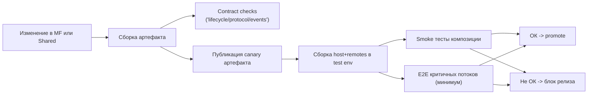
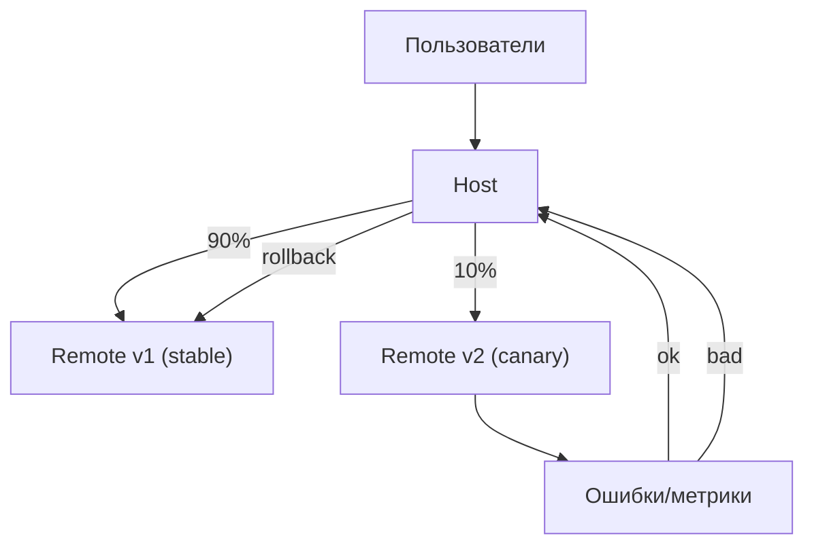

[← Назад к индексу части 28](index.md)

## 28.3 Стили, версии, общие зависимости (то, что “болит” в продакшене)

### Цель раздела

Понять и научиться предотвращать типовые “продакшен‑боли” микрофронтендов:

- конфликты CSS и тем,
- рассинхрон версий React/дизайн‑системы,
- shared‑зависимости и semver,
- тестирование совместимости host ↔ микрофронтенды,
- производительность и наблюдаемость.

### В этом разделе главное

- **Стили и версии — это архитектурные контракты**, а не “внутренности фронта”.
- Чем больше независимости команд, тем важнее:
  - **версионирование контрактов**,
  - **совместимость shared runtime**,
  - **автоматические проверки** (тесты композиции, контрактные тесты на границе).

### Когда микрофронтенды оправданы (и когда нет)

Этот блок в реальности спасает от самого дорогого решения: внедрить микрофронтенды “по моде” и потом много месяцев платить сложностью.

**Оправданы чаще всего, когда совпали 3 условия:**

1) **Несколько команд** (обычно 3+), которые регулярно мешают друг другу релизами/ревью/регрессиями.  
2) Есть **естественные границы владения** (домены/фичи), которые можно стабильно держать годами, а не перекраивать каждую неделю.  
3) Реально нужна **независимая поставка** хотя бы части фич (не обязательно “всё независимое”, но хотя бы “самые автономные домены”).

**Скорее не оправданы, когда:**

- одна команда и один релизный поток;
- проблема — “бардак в коде” (лечится частью 25 + 26 + 27), а не организация работы;
- нет стабильных границ: всё постоянно пересекается и “любой экран трогает все домены”.

#### Проверь себя (когда микрофронтенды оправданы)

1. Почему наличие “3+ команд” само по себе не гарантирует, что микрофронтенды — правильный ответ?  
2. Придумай пример “организационной боли”, которую микрофронтенды действительно лечат, и пример боли, которую они не лечат.  
3. Какая из трёх предпосылок (команды/границы/независимая поставка) чаще всего оказывается “ложной” на практике?

<details><summary>Ответ</summary>

1. Потому что может не быть независимых границ и потребности в независимой поставке: команды могут работать в одном релизном потоке без конфликтов, а проблема может быть в архитектуре кода/процессах, а не в структуре поставки.  
2. Лечат: очередь релизов и конфликт правок между командами доменов. Не лечат: плохой дизайн компонентов/стейта (это лечится архитектурой фронта), отсутствие тестов, хаос требований.  
3. Часто “стабильные границы”: домены меняются, ответственность пересекается, и если это не признать, микрофронтенды превращаются в постоянную перекройку контрактов.

</details>

### Ограничения (что ты неизбежно усложняешь)

Микрофронтенды почти всегда добавляют **операционную сложность**. Это нормально, если они решают организационную боль, и плохо, если боль отсутствует.

Ключевые ограничения:

- **Эксплуатация и релизы**: несколько артефактов, несколько окружений, больше вариантов несовместимости (host обновился, remote закэширован).
- **Отладка**: баги часто “между” фрагментами; нужны единые идентификаторы, единые логи/репортинг.
- **Производительность**: риск дубляжа фреймворков/дизайн‑системы; больше сетевых запросов (чанки/remoteEntry); сложнее оптимизировать LCP/INP целиком.
- **Координация shared‑слоя**: дизайн‑система, i18n, аналитика, error reporting становятся продуктом внутри продукта и требуют владельца.

#### Проверь себя (ограничения)

1. Почему “операционная сложность” — не абстракция, а конкретные новые классы инцидентов? Назови 2 примера.  
2. Какое ограничение чаще всего “взрывается” первым: перф, кэш/версии, или координация shared‑слоя — и почему?  
3. Что лучше: “дублировать зависимости и жить независимо” или “делить зависимости и координироваться”? От чего зависит ответ?

<details><summary>Ответ</summary>

1. Например: “старый remote в кэше + новый host”, “не загрузился remoteEntry”, “несовместимая shared версия React”.  
2. Часто кэш/версии: первые независимые релизы быстро выявляют несовместимость, а у пользователей кэш. Перф и shared‑координация тоже приходят, но обычно чуть позже.  
3. Зависит от сценария: если это виджет/iframe — дублирование допустимо. Если это “одно SPA по частям” и перф критичен — чаще нужен shared runtime и дисциплина версий.

</details>

### Граничные случаи (где легко ошибиться с масштабом)

В плане важно понимать три “края”, которые в жизни встречаются очень часто:

- **Один микрофронтенд на страницу**: иногда полезно как переходный этап, но часто это просто “модульный монолит с отдельной сборкой” без выигрыша.  
- **“Гигантский” микрофронтенд на целый домен**: по сути это уже почти отдельное приложение; граница с “несколькими продуктами” и отдельным роутингом/дизайном.  
- **Смешение микрофронтендов и обычных компонентов**: нормально и неизбежно, но важно не дать shared‑слою превратиться в помойку (“всё общее”).

#### Проверь себя (граничные случаи)

1. Почему “один микрофронтенд на страницу” часто не даёт выигрыша, хотя выглядит как “уже микрофронтенды”?  
2. В какой момент “микрофронтенд на целый домен” становится скорее “отдельным приложением”, и что это меняет?  
3. Как понять, что shared‑слой начал превращаться в “скрытый монолит”?

<details><summary>Ответ</summary>

1. Потому что независимость релиза может не дать ценности, а сложность поставки (версии/кэш/интеграция) уже появилась. Часто это переходный этап, но не конечная цель.  
2. Когда у него собственная навигация, дизайн‑язык, команды и релизы почти не пересекаются. Тогда меняются ожидания: возможно, нужны отдельные SLO, отдельная стратегия деплоя и даже отдельная архитектура продукта.  
3. Когда большинство изменений начинают требовать правок в shared, shared растёт быстрее доменных частей, и команды начинают “прятать” туда логику ради удобства.

</details>

### Термины

| Термин | Коротко |
| --- | --- |
| **SemVer** | правила версионирования: MAJOR.MINOR.PATCH (breaking / backward compatible / bugfix) |
| **Shared runtime** | общий рантайм библиотек (React, дизайн‑система), который делят микрофронтенды |
| **Backward compatibility** | обратная совместимость: старый потребитель продолжает работать с новым провайдером |
| **Контракт интерфейса** | договор между host и microfrontend: props/slots/events/версии протокола |

### Теория и правила

#### 1) Стили: изоляция vs единый язык UI

Есть две крайности, и почти всегда нужен баланс.

**Крайность 1. Полная изоляция стилей**  
Подходы:

- Shadow DOM (Web Components),
- CSS Modules + строгие правила,
- CSS‑in‑JS со scoped‑селектором,
- префиксы классов и изоляция “root” контейнера.

Плюсы: меньше конфликтов.  
Минусы: единая тема/дизайн‑система становится сложнее, а общий UX может “расползаться”.

**Крайность 2. Полностью общие глобальные стили**  
Плюсы: единый вид и меньше дубляжа.  
Минусы: малейшая правка глобального CSS ломает соседей; сложная независимость релизов.

Практичное правило:

- **дизайн‑система** (токены, базовые компоненты) — общий слой,
- “частные” стили микрофронтенда — **изолированы** внутри его контейнера,
- глобальные стили минимальны и управляются shell.

#### 2) Версии и shared‑зависимости: два режима

**Режим A. Shared (одна копия React/DS)**  
Требует:

- выравнивания версий,
- политики обновлений,
- совместимых контрактов.

Плюсы: меньше веса, меньше конфликтов.  
Минусы: координация: обновление shared затрагивает всех.

**Режим B. Дублирование (каждый со своей копией)**  
Плюсы: независимость релиза и технологий.  
Минусы: вес, конфликты контекстов, сложность интеграции, перф.

Практичное правило:

- если микрофронтенды маленькие и изолированные (виджеты/iframe) — дубляж может быть допустим;
- если это “одно большое SPA, но по частям” — shared runtime почти неизбежен.

##### 2.1) Governance shared‑слоя: политика обновлений, deprecation и “как не убить команды”

“Shared runtime” и общая дизайн‑система дают выигрыш, но требуют простого регламента. Иначе возникает парадокс:

- микрофронтенды внедрили ради независимости,
- а shared‑слой превратился в “единый стоп‑кран”: никто не может обновиться без всех.

Чтобы этого избежать, полезно заранее договориться о трёх вещах.

**1) Кто владеет shared‑пакетом**

- один владелец/команда (даже если маленькая), которая отвечает за:
  - релизы,
  - changelog,
  - поддержку потребителей.

**2) Версионирование по SemVer и правила breaking changes**

- MINOR: добавление совместимых возможностей (новый компонент, новое поле, новый токен),
- PATCH: багфикс,
- MAJOR: breaking change (удаление/изменение контракта).

**3) Deprecation‑период**

Практика, которая реально работает:

- сначала “deprecated” (в документации + предупреждение в дев‑режиме),
- затем период миграции (например, 1–2 спринта),
- затем удаление в MAJOR‑релизе.

Пример “человеческого” правила:

- “Нельзя удалить компонент/токен без альтернативы и без периода deprecated”.

##### 2.2) Как проверять совместимость в CI (pipeline как страховка от инцидентов)

Контракты без автоматической проверки — это “контракты на словах”. В микрофронтендах особенно важно проверять:

- что host умеет монтировать remotes нужных версий,
- что shared‑пакеты совместимы,
- что критичные страницы хотя бы открываются (smoke).

Диаграмма: типовой CI‑pipeline совместимости



Что важно запомнить:

- contract checks ловят “сломали интерфейс” ещё до деплоя,
- smoke ловит “не грузится/не монтируется”,
- E2E ловит “вместе не работает пользовательский поток”.

Проверь себя (governance и CI)

1. Почему shared‑слой без владельца почти гарантированно превратится в источник инцидентов?  
2. В чём смысл deprecation‑периода, если “всё равно можно быстро поправить”?  
3. Какие 2 проверки ты бы сделал(а) обязательными в CI в первую очередь?

<details><summary>Ответ</summary>

1. Потому что не будет релизной дисциплины, правил совместимости и поддержки потребителей: изменения будут ломать соседей “случайно”.  
2. Потому что “быстро поправить” в распределённой системе почти никогда не быстро: у разных команд разные циклы, у пользователей кэш, у окружений разные версии. Deprecation делает миграцию управляемой.  
3. Contract checks (lifecycle/protocol) и smoke‑композиция (host+remotes запускаются и открывают ключевые страницы). E2E — следующий шаг, но хотя бы минимальный набор очень желателен.

</details>

#### 3) Версионирование контракта host ↔ microfrontend

Важно различать:

- **версию микрофронтенда как продукта** (v2.3.1),
- **версию протокола интеграции** (например, `protocolVersion: v1`).

Почему нужно разделять:

- микрофронтенд может выпускать новые фичи, не меняя протокол;
- протокол менять больнее, поэтому нужен отдельный жизненный цикл (deprecated → removal).

Типовая стратегия:

- Host поддерживает `protocol v1` и `v2` некоторое время,
- микрофронтенды мигрируют по очереди,
- затем `v1` удаляется.

##### Версионная совместимость на практике: negotiation и “матрица совместимости”

В реальности важно ответить на вопрос: “Если host обновился сегодня, а remote у части пользователей старый — что будет?”

Чтобы это было управляемо, часто вводят два простых механизма:

**1) Negotiation (рукопожатие версий)**

Идея: при загрузке remote он сообщает, какой протокол поддерживает, а host решает:

- можно ли монтировать,
- нужно ли включить режим совместимости,
- или показать fallback.

Псевдокод:

```ts
// remote
export const mfMeta = { protocol: ["v1"], name: "catalog" };

// host
function canMount(meta: { protocol: string[] }) {
  return meta.protocol.includes("v1"); // или более сложное правило
}
```

**2) Матрица совместимости (как документ/правило)**

Минимальный вариант — таблица, которую реально поддерживает команда:

| Host | Protocol | Remote |
| --- | --- | --- |
| 2.5.x | v1 | >= 1.3.0 |
| 3.x | v2 | >= 2.0.0 |

Смысл: breaking change превращается не в “рандомный прод‑инцидент”, а в **управляемую миграцию**.

#### 3.1) Релизы, откат и “безопасные выкладки” (canary/feature flags)

Это ещё одна тема, которая быстро всплывает в микрофронтендах: “если remote выкатили отдельно — как откатывать, не ломая всех?”

Базовые подходы:

- **Feature flags**: включать новый remote/новую версию протокола для части пользователей или по ролям.
- **Canary**: выкладка на малый процент, наблюдение за ошибками/метриками, расширение.
- **Fallback на старую версию**: если новая несовместима/падает — host умеет выбрать “предыдущий стабильный remote”.

Диаграмма: canary‑выкладка remote



Ключевая мысль:

- независимые релизы без стратегии canary/rollback часто приводят к тому, что “независимость” превращается в “независимые инциденты”.

#### 4) Тестирование композиции (чтобы не ломать друг друга)

Есть 3 уровня:

- **unit/integration внутри микрофронтенда** (обычно есть всегда),
- **контрактные тесты на границе** (host ожидает контракт; mf гарантирует),
- **E2E на собранном продукте** (минимум критических потоков).

Идея контрактных тестов здесь — похожа на pact‑подходы из части 30 (на границе фронт–бекенд), только “потребитель ↔ провайдер” теперь — **host ↔ microfrontend**.

Мини‑пример контрактной проверки (идея, не конкретный фреймворк):

```ts
// host-contract.spec.ts
import type { MicrofrontendV1 } from "./contracts";

test("MF implements required lifecycle", async () => {
  const mf: MicrofrontendV1 = await import("remoteCatalog/entry");
  expect(typeof mf.mount).toBe("function");
  expect(typeof mf.unmount).toBe("function");
});
```

#### 5) Производительность и наблюдаемость (сквозное качество)

Микрофронтенды легко ухудшают перф:

- несколько фреймворков на странице,
- больше запросов (больше чанков),
- сложнее оптимизировать общий LCP/INP.

Практика:

- измеряй **Core Web Vitals** (LCP/INP/CLS) на реальных страницах,
- следи за дубляжом в бандлах (анализ бандла, часть 29),
- вводи единый `trace_id`/correlation id для событий и ошибок (пересечение с частью 31).

#### 5.2) Контракт наблюдаемости: что логировать и как склеивать “картину инцидента”

Это тот случай, когда “каждый микрофронтенд логирует по‑своему” быстро ломает диагностику. Тебе нужен **минимальный общий контракт**, иначе на инциденте команда потратит часы, чтобы просто понять: “какой кусок упал?”

**Интуиция:** когда на странице 3–5 микрофронтендов, у тебя есть два вида проблем:

- “сломался один микрофронтенд” (локальный инцидент),
- “сломалась композиция” (контракт/версии/кэш/навигация).

Чтобы расследовать быстро, почти всегда достаточно договориться о 4 вещах:

1) **Единые метаданные микрофронтенда**  
Каждый mf должен уметь сообщить:

- `mf.name` (например, `catalog`),
- `mf.version` (семантическая версия или build id),
- `protocolVersion` (например, `v1`),
- `host.version` (версия host/shell).

2) **Единый идентификатор корреляции**  
Минимум: `trace_id` или `correlation_id`, который:

- создаётся/назначается на уровне host,
- прокидывается в mf через `ctx`,
- добавляется в логи/ошибки/сетевые запросы.

3) **Единый путь репортинга ошибок**  
Чтобы ошибки не “улетали” в 5 разных проектов, host предоставляет `ctx.reportError(e, meta)`.

4) **События жизненного цикла** (для композиции)

- `mf:loaded` (скрипт загружен),
- `mf:mounted` (контент появился),
- `mf:ready` (экран готов),
- `mf:error` (ошибка/фолбэк).

Текстовая схема: как склеивается диагностика

```text
Host creates trace_id = T123
  |
  +--> ctx(trace_id=T123, hostVersion=3.4.1, protocol=v1)
        |
        +--> MF catalog logs: {trace_id:T123, mf:catalog@1.8.0, ...}
        +--> MF checkout logs: {trace_id:T123, mf:checkout@2.1.3, ...}
        +--> BFF/service logs:  {trace_id:T123, ...}

=> один trace_id связывает фронт-композицию и бекенд-вызовы
```

Связь с бекендом (коротко): если ты используешь BFF/бекенд, то полезно прокидывать `trace_id` в заголовках запросов (например, `X-Request-Id`) и/или через стандарт W3C Trace Context (`traceparent`). Конкретная техника — тема части 31, но принцип важен уже здесь.

Проверь себя (наблюдаемость)

1. Какие 4 поля ты бы сделал(а) обязательными в любом репорте ошибки микрофронтенда?  
2. Почему “общий trace_id” важнее, чем “много красивых логов у каждого mf отдельно”?  
3. Какие два события жизненного цикла помогут отличить “не загрузился remote” от “упал при mount”?

<details><summary>Ответ</summary>

1. `mf.name`, `mf.version`, `protocolVersion`, `host.version` (и желательно `trace_id`).  
2. Потому что на инциденте тебе нужно склеить цепочку: host → mf → сеть → бекенд. Без корреляции ты не понимаешь, какие логи относятся к одному пользовательскому действию.  
3. Например: `mf:loaded` (скрипт загрузился) и `mf:mounted` (смонтировался). Если `loaded` есть, а `mounted` нет — проблема при исполнении/контракте/mount.

</details>

#### 5.1) Кэш и доставка remote: как не получить “старый remote + новый host”

Эта проблема настолько частая, что её стоит объяснять как отдельное правило.

Что обычно делают:

- **content‑hash в URL** артефакта (например, `remoteEntry.ab12cd.js`), чтобы кэш был “навсегда”, но менялся только при релизе;
- **manifest‑подход**: host сначала получает “табличку версий” (manifest), а уже потом грузит конкретный remoteEntry по фиксированному URL.

Мини‑пример (идея manifest):

```json
{
  "catalog": { "remoteEntry": "https://cdn/x/remoteEntry.ab12cd.js", "protocol": ["v1"] },
  "checkout": { "remoteEntry": "https://cdn/y/remoteEntry.ef34aa.js", "protocol": ["v1"] }
}
```

Важно: конкретные HTTP‑заголовки кэша и инфраструктурная реализация — это уже тема части 29/31, но архитектурное правило здесь:

- **host должен контролировать, какую версию remote он грузит**, и у него должен быть план “что делать при несовместимости”.

#### 6) Диагностика: как понимать, “почему сломалось” (типовые инциденты)

Микрофронтенды часто ломаются одинаково. Полезно иметь “карту симптом → причина → проверка”.

**Инцидент A. Белый экран после релиза**

- **Частые причины**: несовместимость протокола; закэширован старый remote; падение при `mount()`; ошибка загрузки скрипта (404/timeout/CSP).  
- **Как проверять**:
  - в host логировать: какую версию remote/protocol ожидали и какую получили;
  - добавить тайм‑аут на загрузку remote и fallback UI (не “вечный спиннер”);
  - мониторить ошибки загрузки скриптов (Sentry/аналог) как отдельный тип.

**Инцидент B. Случайно сломались стили “в соседнем микрофронтенде”**

- **Частые причины**: глобальные селекторы и reset’ы; коллизии классов; разные версии токенов темы.  
- **Как проверять**:
  - быстрое правило: “найди глобальный селектор, который попадает на чужие узлы”;
  - договориться о том, что глобальный CSS имеет владельца (обычно shell) и минимален.

**Инцидент C. “Назад” ведёт не туда / deep links открываются неправильно**

- **Частые причины**: два “капитана” history; микрофронтенд меняет URL без уведомления shell; разные правила парсинга query/state.  
- **Как проверять**:
  - ввести один “источник истины” для правил URL (обычно shell);
  - протоколировать события навигации (кто инициировал, куда, почему).

**Инцидент D. Перф деградировал, хотя “каждый оптимизировал свой кусок”**

- **Частые причины**: дубляж фреймворков; рост количества чанков; тяжёлые shared‑зависимости; лишние прелоады.  
- **Как проверять**:
  - измерение Core Web Vitals на целевых страницах;
  - анализ бандла на дубляж;
  - договориться: “какие зависимости shared, какие нет” и почему.

### Пошагово: “минимальный продакшен‑регламент” для микрофронтендов

Если ты хочешь, чтобы оно работало не только на демо:

1) **Согласуй, что является shared‑слоем** (React, дизайн‑система, i18n, error reporting).  
2) **Опиши контракт протокола** и версионирование (`v1`, `v2`, deprecated).  
3) **Определи правила CSS**: что глобально, что изолировано, как применяются токены темы.  
4) **Введи проверки совместимости** (контрактные тесты/смоук‑композиция).  
5) **Определи политику кэша** для remote‑артефактов (чтобы не было “старый remote + новый host”).  
6) **Введи единые метрики и алерты** по ключевым пользовательским потокам.

### Простыми словами

Микрофронтенды — как несколько бригад, которые строят один дом:

- если нет общего стандарта “какие трубы и где проходят”, каждый сделает по‑своему, и дом будет протекать;
- **стили/версии/shared‑зависимости** — это и есть “стандарты труб и проводки”.

### Картинка в голове: почему shared‑версии — это контракт

```text
Если shared runtime общий:
  Host (React 18.2) + MF A (React shared) + MF B (React shared)
  => 1 копия React, меньше веса, меньше конфликтов

Если каждый со своей копией:
  Host (React 18.2) + MF A (React 18.2) + MF B (React 17)
  => 2-3 копии React, разные контексты, сложная интеграция, риск багов
```

### Практика / реальные сценарии

#### Сценарий 1. “Конфликт стилей: у одного микрофронтенда сломались кнопки”

Частая причина: глобальный CSS селектор (`button { ... }`, `.card * { ... }`) из другого микрофронтенда.

Решение:

- минимизировать глобальные селекторы,
- изолировать стили внутри root‑контейнера микрофронтенда (`.mf-catalog-root ...`),
- перейти на токены дизайн‑системы и ограничить “сырой CSS” правилами.

#### Сценарий 2. “После обновления host часть пользователей видит белый экран”

Частая причина: у пользователя закэширован старый remote, а host ожидает новый контракт.

Решение:

- контракты версионировать явно (`protocolVersion`),
- политика кэша: content‑hash + корректная инвалидация,
- fallback: если remote не совместим — показать “мягкую деградацию”, а не падать.

### Типичные ошибки

- Shared‑зависимости без политики обновления (“как‑нибудь договоримся”) → постоянные инциденты.
- Дизайн‑система как “общая папка копипасты” без версий → дрейф UI.
- “Один глобальный store на всё” между микрофронтендами → исчезновение независимости.

### Что будет если…

- …не вводить версионирование протокола?  
  Любой breaking change превратится в “рандомный прод‑инцидент”, потому что host и microfrontend начнут жить в разных ожиданиях.

- …не договориться про CSS‑изоляцию?  
  Любая команда сможет случайно сломать UX соседей без единого касания их репозитория. Это одна из самых демотивирующих причин “ненависти” к микрофронтендам.

### Проверь себя

1. Почему “общая дизайн‑система” одновременно помогает микрофронтендам и усложняет их?  
2. Чем отличается “версия микрофронтенда” от “версии протокола интеграции”?  
3. Назови 2 механизма, которые снижают риск конфликтов CSS между микрофронтендами.

<details><summary>Ответ</summary>

1. Помогает — единый UI‑язык и меньше дубляжа. Усложняет — требует версионирования и координации обновлений (иначе ломается совместимость).  
2. Версия микрофронтенда отражает развитие самого продукта/фич. Версия протокола — это версия **контракта** между host и mf; она должна меняться реже и иметь миграционный период.  
3. Shadow DOM (Web Components), CSS Modules/Scoped CSS, префиксация root‑контейнера, ограничение глобальных селекторов, токены дизайн‑системы.

</details>

### Запомните

- Главные риски микрофронтендов — не “как собрать”, а **как договориться** (версии, стили, контракты).  
- Версионирование протокола и тесты композиции — это то, что превращает “идею” в **управляемую систему**.  
- Перф и наблюдаемость должны быть общими: иначе каждая команда оптимизирует “свой кусок”, а пользователь страдает в целом.

---
