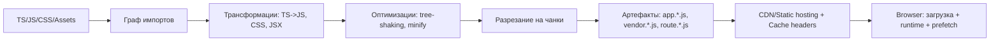
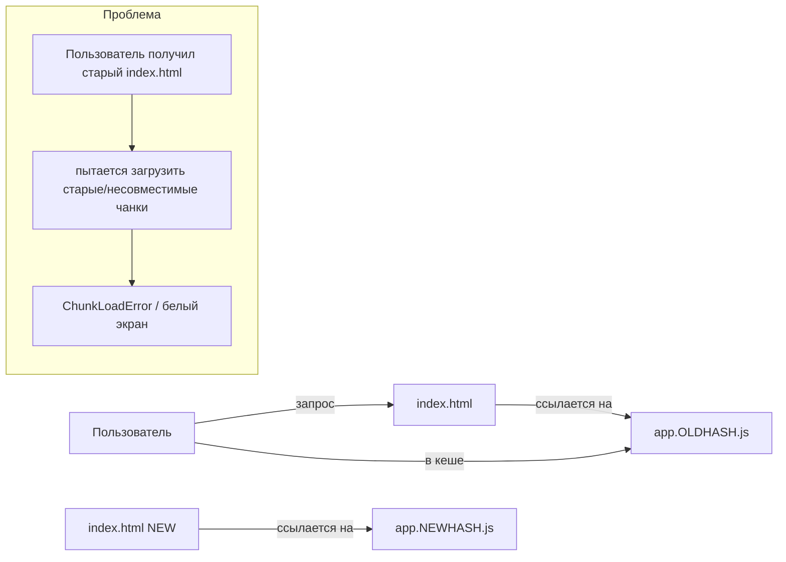

[← Назад к индексу части 29](index.md)

## 29.1 Бандлеры и оптимизации

### Цель раздела

Понять, как **из модулей** получается **доставляемый набор файлов** и почему разные решения в сборке меняют:

- скорость разработки,
- производительность в браузере,
- устойчивость релизов.

### В этом разделе главное

- **Бандлер — это “фабрика доставки кода”.** Он не только “склеивает файлы”, он задаёт форму продукта (чанки, кэш, рантайм).
- **Tree‑shaking — это не магия.** Он работает при определённых условиях (ESM, side effects, правильные сборки библиотек).
- **Chunk splitting — это баланс.** Слишком большой бандл — плохо, слишком много маленьких чанков — тоже плохо.
- **Content hash и кэш‑стратегия — обязательны для продакшена**, иначе неизбежны “призраки” старого кода.
- **Source maps — полезны, но опасны**, если их выкладывать без контроля.

### Термины

| Термин | Коротко |
| --- | --- |
| **Entry** | Точка входа в сборку (с чего начинается граф импортов). |
| **Dependency graph** | Граф модулей: кто кого импортирует. |
| **Split points** | Места, где граф можно разрезать на чанки (например `import()` или маршруты). |
| **Runtime chunk** | Небольшой код бандлера, который “склеивает” загрузку чанков. |
| **Vendor chunk** | Чанк с зависимостями из `node_modules` (React и т.п.) для долгого кэша. |
| **Long‑term caching** | Стратегия: “файлы почти никогда не меняются по имени → браузер кэширует долго”. |

### Теория и правила

#### 1) Что такое бандлер “по сути”

Формулировка:

**Бандлер** — инструмент, который строит **граф модулей**, преобразует их (TS/JS/CSS), применяет оптимизации (минификация, tree‑shaking), и выдаёт **набор артефактов** (чанков) + **рантайм загрузки**, чтобы браузер мог их корректно подгружать.

Простое представление:

- у тебя есть “комната с деталями” (модули),
- бандлер строит “инструкцию сборки” (граф),
- затем пакует набор коробок (чанки),
- наклеивает на коробки штрих‑коды (hash),
- и даёт курьеру правила “в какой последовательности доставлять” (runtime + preload/prefetch).

Картинка в голове: путь кода



##### Проверь себя (1 — что такое бандлер)

1. Чем **граф импортов** отличается от “списка файлов в проекте” и почему для сборки важен именно граф?  
2. Почему “бандлер выдал файлы” — это ещё не конец истории, и зачем нужен **runtime chunk**?  
3. Приведи пример, когда одна и та же кодовая база может давать **разные** артефакты сборки (разный набор чанков), и объясни почему.

<details><summary>Ответ</summary>

1. Граф импортов описывает реальные зависимости модулей: кто кого импортирует и по каким путям исполнения. Бандлер идёт по графу, а не по “папкам на диске”, поэтому именно граф определяет, что попадёт в бандл и какие точки можно разрезать на чанки.  
2. Потому что чанки нужно уметь загружать и склеивать в браузере: runtime — это “диспетчер”, который понимает, какие чанки нужны, где они лежат, как их подгрузить и как связать модули. Без него code splitting либо невозможен, либо превращается в хрупкую ручную логику.  
3. Например, dev vs prod (разные оптимизации и разрезание), или per‑route builds (SSR/SPA гибриды), или разные `manualChunks/splitChunks` правила. Артефакты зависят от конфигурации оптимизаций, точек split (`import()`/routes) и окружения.

</details>

#### 2) Webpack, Vite, Rollup, esbuild: кто есть кто (без “религиозных войн”)

Важно не “какой лучше”, а **какой роли** он соответствует.

- **Webpack**:
  - **сильный** там, где нужна тонкая настройка и сложные сценарии (особенно в зрелых enterprise‑проектах и MF);
  - исторически “всё умеет”, но конфиги тяжёлые, сборки могут быть медленнее.
- **Vite**:
  - быстрый dev server (в основе — нативные ESM в браузере + трансформации),
  - production build обычно через Rollup,
  - часто проще “войти” и быстрее работать на современных проектах.
- **Rollup**:
  - сильный для **сборки библиотек** (чистые ESM, хорошие оптимизации),
  - часто используется как “production bundler” в стеке Vite.
- **esbuild**:
  - очень быстрый транспайлер/бандлер,
  - часто используется как “быстрый шаг” (minify/transpile), но сложные сценарии могут требовать других инструментов/плагинов.

Практическое правило выбора:

- если тебе нужен **быстрый дев‑цикл** и современный стек → часто Vite “по умолчанию”;
- если у тебя уже большой проект на Webpack или нужен **Module Federation** и сложные плагины → Webpack будет более предсказуемым выбором;
- если ты делаешь **пакет‑библиотеку** (design system, utils) → ориентируйся на Rollup/Vite library mode.

##### Проверь себя (2 — выбор инструмента)

1. Почему вопрос “какой бандлер лучше” часто некорректен без уточнения “собираем приложение или библиотеку”?  
2. Назови по одному признаку, что проекту важнее **dev‑скорость**, и по одному — что важнее **контроль prod‑доставки**.  
3. В каком случае “оставить Webpack” может быть рациональнее, чем мигрировать на более “быстрый” dev‑инструмент?

<details><summary>Ответ</summary>

1. Потому что цели разные: приложение оптимизирует загрузку/чанки/кэш и метрики, библиотека — совместимость у потребителя и tree‑shaking. Инструменты сильны в разных режимах.  
2. Dev‑скорость: разработчики часто ждут HMR/сборки, много итераций в день. Prod‑контроль: есть сложные требования к кэшу/чанкам/интеграции (например MF), много прод‑инцидентов из‑за доставки/кэша.  
3. Когда в проекте уже есть сложная экосистема плагинов/интеграций (например Module Federation, специфичные лоадеры, enterprise‑ограничения), а риск миграции выше потенциального выигрыша.

</details>

#### 2.1) Скорость разработки: dev server, HMR и “почему Vite ощущается быстрее”

Эту тему часто обсуждают как “Vite быстрый, Webpack медленный”, но правильнее понимать **механику**:

- в разработке важно:
  - как быстро пересобирается “кусок, который ты поменял(а)”,
  - как быстро браузер применяет изменения (HMR),
  - насколько часто нужна полная пересборка/перезагрузка страницы.

Упрощённая картинка:

```text
Dev цикл:
  изменения в файле -> трансформация -> доставка в браузер -> обновление UI

Если шаг "сборка всего" происходит каждый раз, ты теряешь секунды/минуты ежедневно.
```

Что стоит запомнить:

- **HMR — не гарантия “состояние сохранится”**. Если ты меняешь модуль, который задаёт форму состояния (store, роутер), возможна полная перезагрузка.
- Быстрота dev server не отменяет важности прод‑сборки: иногда dev быстро, но prod требует тонкой настройки чанков и кэша.

##### Проверь себя (2.1 — dev server и HMR)

1. Почему HMR иногда приводит к полной перезагрузке, даже если “вроде всё настроено”?  
2. Чем отличается “быстро пересобрать модуль” от “быстро применить изменения в браузере”?  
3. Приведи пример правки, которая почти наверняка будет “не HMR‑friendly”.

<details><summary>Ответ</summary>

1. Потому что не любой модуль можно “горячо заменить” без нарушения инвариантов: если изменился контракт состояния/роутинга/инициализации, безопаснее перезагрузить страницу. Иногда ограничение в конкретном фреймворке/плагине.  
2. Пересборка — это время на трансформацию/бандлинг, а применение — время на доставку в браузер и обновление runtime/рендера. Можно быстро пересобрать, но медленно перерисовать UI (или наоборот).  
3. Изменение инициализации стора, маршрутизатора, глобального провайдера контекста, или кода, который выполняется один раз при старте приложения (bootstrap).

</details>

#### 2.2) “Бандлер” vs “транспайлер” vs “минификатор”: не путай роли

Это частый источник путаницы.

- **Транспайлер** (TypeScript/SWC/Babel/esbuild) — переводит синтаксис (TS → JS, JSX → JS, новый JS → совместимый JS).
- **Бандлер** (Webpack/Rollup и др.) — строит граф модулей и выдаёт артефакты (чанки) + рантайм загрузки.
- **Минификатор** (Terser/esbuild) — уменьшает размер кода (часто часть бандлера, но логически отдельная роль).

В реальности один инструмент может делать несколько ролей, но **архитектурно** полезно различать: “что отвечает за что”.

##### Проверь себя (2.2 — роли инструментов)

1. Почему полезно разделять “транспайлер” и “бандлер” даже если один инструмент делает и то и другое?  
2. Какой тип ошибки ты будешь искать в транспайлере, а какой — в бандлере?  
3. Почему минификация может ухудшить дебаг и observability, если не продумать source maps?

<details><summary>Ответ</summary>

1. Чтобы правильно диагностировать проблемы: “код не компилируется” (трансформации) и “код плохо доставляется” (чанки/кэш/рантайм) — разные классы задач.  
2. Транспайлер: синтаксис/TS‑типы/JSX трансформация. Бандлер: дубли зависимостей, неправильный splitting, проблемы с динамическими импортами, пути к чанкам.  
3. Минификация меняет имена и структуру кода, и без корректных source maps ошибки в продакшене становятся нечитаемыми, а иногда карты раскрывают лишнее — нужно выбрать режим и контроль доступа.

</details>

#### 2.3) Сборка приложения vs сборка библиотеки: в чём архитектурная разница

План прямо просит “назначение (сборка приложения vs библиотеки)”, и здесь важно не ограничиться фразой.

**Интуиция:**  
Приложение собирается “в один продукт для браузера”, а библиотека собирается “как деталь, которую будут встраивать в чужие сборки”.

Из этого вытекают разные правила.

##### Приложение (app build)

Ты оптимизируешь:

- код‑сплиттинг, чанки, кэш, загрузку
- метрики LCP/INP/CLS
- работу на разных сетях/устройствах

И ты можешь “позволить себе”:

- агрессивную минификацию,
- специфичный рантайм,
- вшитые оптимизации под свой проект.

###### Проверь себя (2.3 — app build)

1. Почему в сборке приложения мы можем “оптимизировать под себя”, а в библиотеке это часто вредно?  
2. Назови 2 решения в app build, которые напрямую влияют на пользователей через кэш/загрузку.  
3. В каких случаях “агрессивная минификация” может быть плохой идеей даже для приложения?

<details><summary>Ответ</summary>

1. Потому что приложение — конечный продукт: мы контролируем среду исполнения и можем выбирать компромиссы под свой UX/инфру. Библиотека же встраивается в чужие сборки, и “оптимизации под себя” могут ломать совместимость и tree‑shaking у потребителей.  
2. Например: стратегия chunk splitting (что в app shell, что лениво) и стратегия кэша (content hash + cache headers, политика обновления HTML).  
3. Когда нужны читаемые стектрейсы/observability, или когда минификация ломает эвристику дебага, или когда размер sourcemaps/безопасность становятся проблемой. Тогда нужно продумать режим source maps и сборки.

</details>

##### Библиотека (library build)

Ты оптимизируешь другое:

- совместимость с разными бандлерами потребителей,
- tree‑shaking у потребителя,
- корректные `exports`/типизацию,
- отсутствие неожиданных side effects,
- правильную модель зависимостей (peer deps для React‑экосистемы).

**Ключевой принцип:** библиотека должна быть максимально “предсказуемой деталью”, иначе она ломает сборку/кэш/версии у всех потребителей.

##### Пакетные поля, которые чаще всего решают судьбу библиотеки

Мини‑пример `package.json` для библиотеки (идея, не догма):

```json
{
  "name": "@acme/ui",
  "version": "1.2.3",
  "type": "module",
  "main": "./dist/index.cjs",
  "module": "./dist/index.js",
  "types": "./dist/index.d.ts",
  "exports": {
    ".": {
      "types": "./dist/index.d.ts",
      "import": "./dist/index.js",
      "require": "./dist/index.cjs"
    }
  },
  "sideEffects": [
    "*.css"
  ],
  "peerDependencies": {
    "react": "^18.0.0",
    "react-dom": "^18.0.0"
  }
}
```

Пояснение простыми словами:

- `exports` — “официальные двери” пакета (public API на уровне npm),
- `import/require` — поддержка ESM и CommonJS потребителей,
- `types` — чтобы потребители получали типы без магии,
- `sideEffects` — чтобы потребительский бандлер не выкинул нужное (например CSS),
- `peerDependencies` — чтобы не тащить “свой React” внутрь UI‑пакета.

###### Проверь себя (2.3 — package fields библиотеки)

1. Зачем нужен `exports`, если уже есть `main/module`?  
2. Что сломается у потребителей, если библиотека публикуется без `types` (или `exports.types`)?  
3. Почему `sideEffects` — это не “оптимизация ради оптимизации”, а способ избежать багов?

<details><summary>Ответ</summary>

1. `exports` делает публичную поверхность явной и управляет тем, что отдаётся в разных режимах импорта (ESM/CJS/типы). Это снижает “случайные импорты внутрь dist” и улучшает совместимость/безопасность.  
2. Типизация станет непредсказуемой: TS может не находить типы, IDE потеряет подсказки, а потребители начнут делать хаки (импортировать внутренние пути), что ломает эволюцию пакета.  
3. Потому что без корректного `sideEffects` бандлер потребителя может выкинуть важный код/стили как “неиспользуемые”, и это проявится как продакшен‑баг “пропали стили/инициализация”.

</details>

##### Граничный случай: CSS в библиотеке

CSS почти всегда side effect. Это значит:

- если библиотека автоматически импортирует CSS “при импорте компонента”, tree‑shaking станет сложнее предсказать;
- если библиотека отдаёт CSS отдельным файлом, потребителю надо явно подключить его (зато контроль понятнее).

В продакшене обычно выбирают один из подходов и документируют:

- “импортируй `@acme/ui/styles.css` один раз в app shell”
- или “каждый компонент сам тянет CSS (но тогда `sideEffects` и порядок важны)”.

###### Проверь себя (2.3 — CSS в библиотеке)

1. Почему CSS почти всегда считается side effect?  
2. Чем опасен подход “каждый компонент сам тянет CSS” при большом приложении?  
3. Какой один простой контракт про CSS ты бы зафиксировал(а) для дизайн‑системы?

<details><summary>Ответ</summary>

1. Потому что подключение CSS меняет поведение/внешний вид приложения при импорте, это не “чистая функция” и не может быть безопасно выброшено tree‑shaking’ом.  
2. Появляются сложности с порядком подключения и предсказуемостью каскада, а также труднее гарантировать, что стили не “пропадут” из‑за оптимизаций и что не будет лишних дубликатов.  
3. Например: “подключаем один `@acme/ui/styles.css` в app shell” (или “CSS всегда импортируется из entry пакета”), чтобы сделать поведение предсказуемым и проверяемым.

</details>

##### Проверь себя (сборка библиотеки)

1. Почему для UI‑библиотеки `react` часто делают **peerDependency**, а не dependency?  
2. Что такое `exports` в `package.json` простыми словами?  
3. Почему CSS влияет на `sideEffects` и tree‑shaking?

<details><summary>Ответ</summary>

1. Чтобы не тащить “свой React” внутрь библиотеки и не получить две копии React у потребителя (лишний вес и тонкие баги с контекстами/хуками).  
2. Это “официальная карта входов”: какие файлы пакета можно импортировать, и какие сборки (ESM/CJS/типы) отдать в разных режимах.  
3. CSS при импорте меняет поведение приложения (подключает стили) — это side effect. Бандлер не может “безопасно выкинуть” такой импорт, поэтому важно явно обозначать такие места.

</details>

#### 3) Tree‑shaking: условия, почему ломается, как чинить

Интуиция:

Tree‑shaking — это как выкинуть из чемодана всё, что ты не используешь, **но только если ты уверен, что вещи не “срабатывают сами”**.

Формальная суть:

Tree‑shaking в современных бандлерах работает лучше всего, когда:

1) модули — **ESM** (статические `import/export`),  
2) экспорты можно проанализировать статически,  
3) модули не имеют скрытых побочных эффектов (или они явно помечены).

Типичная причина “не работает”:

- библиотека поставляет только CommonJS (хуже анализируется),
- модуль делает что‑то при импорте (side effect),
- в `package.json` нет корректного `sideEffects`,
- используется “barrel export” (`export * from ...`) без понимания, что это может тянуть лишнее.

Пример: `sideEffects` в `package.json`

```json
{
  "name": "@acme/ui",
  "type": "module",
  "sideEffects": [
    "*.css"
  ]
}
```

Смысл:

- “в целом” пакет можно шейкать,
- но импорт CSS — это side effect, его нельзя выкинуть автоматически.

Граничный случай (важно):

- если ты импортируешь модуль, который **глобально регистрирует** что‑то (полифил, метрики, CSS‑инъекция), бандлер не может это “безопасно выкинуть”.

##### Проверь себя (3 — tree-shaking)

1. Почему tree‑shaking лучше работает с ESM, чем с CommonJS?  
2. Приведи пример **side effect**, из‑за которого бандлер обязан оставить модуль даже если “экспорт не используется”.  
3. Как бы ты проверил(а) в проекте, что tree‑shaking реально работает, а не “кажется, что работает”?

<details><summary>Ответ</summary>

1. ESM даёт статически анализируемые `import/export`: бандлер может понять, какие экспорты используются, и выкинуть остальное. CommonJS (`require`, динамические экспорты) хуже поддаётся статическому анализу, поэтому бандлер более консервативен.  
2. Например, модуль при импорте регистрирует полифил, подписывается на события, добавляет глобальные стили или “сам” инициализирует аналитику. Удалив импорт, ты изменишь поведение приложения.  
3. Через анализ бандла (source-map-explorer/анализатор) и A/B сравнение: (а) удалить использование экспорта и убедиться, что размер реально уменьшился; (б) проверить сборку библиотеки (ESM build) и `sideEffects`; (в) убедиться, что нет “баррельных” импортов, которые тащат всё.

</details>

#### 4) Chunk splitting: как резать и почему это trade‑off

Интуиция:

Разрезать бандл — как разделить багаж на сумки:

- одна большая сумка тяжёлая (медленный старт),
- 50 маленьких — ты долго их собираешь и таскаешь (много запросов/овер‑хед, особенно на мобильных).

Типовые стратегии:

- **Route‑based splitting**: чанк на маршрут (основа для SPA/SSR‑гибридов).
- **Feature/Widget splitting**: тяжёлые виджеты (редактор, графики) — отдельные чанки.
- **Vendor splitting**: зависимости (`react`, `react-dom`, UI libs) — отдельные чанки для долгого кэша.

Важное правило кэша:

- **вендор‑чанк должен меняться как можно реже**,
- иначе ты “сбрасываешь кэш” огромного файла при любом мелком изменении.

##### Имена чанков и стабильность хешей: почему “мелкая правка” иногда инвалидирует всё

По плану это отмечено как “имена чанков и стабильность хешей”, и это действительно важная продакшен‑механика.

Интуиция:

- ты хочешь, чтобы **изменение одной страницы** меняло только 1–2 чанка,
- а не “пересобирало” и переименовывало половину файлов.

Почему так бывает:

- если идентификаторы модулей/чанков зависят от порядка обхода графа, то изменение “в середине” сдвигает порядок → меняются имена/содержимое многих чанков.

Что обычно делают в продакшене (идея, зависит от бандлера):

- включают **детерминированные идентификаторы** модулей/чанков,
- следят, чтобы “общие чанки” (vendors/react) были стабильными,
- избегают случайного “перетаскивания” модулей между чанками из‑за неправильных правил splitting.

Мини‑пример (идея): Webpack “deterministic ids”

```js
// webpack.config.js (фрагмент, идея)
module.exports = {
  optimization: {
    moduleIds: "deterministic",
    chunkIds: "deterministic",
    runtimeChunk: "single"
  }
};
```

Почему это помогает:

- бандлер меньше “перемешивает” идентификаторы при небольших изменениях,
- значит меньше шансов, что обновление одной фичи инвалидирует кэш половины приложения.

Картинка в голове:

```text
Плохо:
  Правка в одном файле -> поменялись 20 чанков -> кэш сброшен -> пользователи качают заново

Хорошо:
  Правка в одном файле -> поменялся 1 route-чанк (+ возможно manifest/runtime) -> кэш сохраняется
```

Картинка в голове: минимальная архитектура чанков

```text
index.html
  |
  +-- runtime.*.js        (маленький: загрузка чанков)
  +-- vendor.*.js         (React + крупные библиотеки, кэшируется долго)
  +-- app-shell.*.js      (layout, router, базовая логика)
  +-- route-catalog.*.js  (страница каталога)
  +-- route-checkout.*.js (страница оплаты)
  +-- widget-editor.*.js  (тяжёлый виджет, по требованию)
```

Пошагово: как думать про разрезание на чанки

1) Выдели **app shell**: то, без чего приложение не живёт (роутер, layout, auth UI, базовые стили).  
2) Разрежь по маршрутам: каждая страница/группа страниц — отдельный чанк.  
3) Выдели тяжёлые виджеты, которые нужны редко → отдельный lazy‑чанк.  
4) Проверь, не дублируются ли зависимости между чанками (bundle analyzer).  
5) Проверь метрики (LCP/INP) и поведение на плохой сети (throttling).  

##### Практический “скелет” конфигов: Webpack `splitChunks` и Vite/Rollup `manualChunks`

Это не “универсальная истина”, а минимальные примеры, которые помогают увидеть, *как* это настраивается.

**Webpack (идея `splitChunks`)**

```js
// webpack.config.js (упрощённо)
module.exports = {
  optimization: {
    runtimeChunk: "single",
    splitChunks: {
      chunks: "all",
      cacheGroups: {
        react: {
          test: /[\\/]node_modules[\\/](react|react-dom)[\\/]/,
          name: "react",
          priority: 40,
        },
        vendors: {
          test: /[\\/]node_modules[\\/]/,
          name: "vendors",
          priority: 10,
        },
      },
    },
  },
};
```

На что смотреть:

- отдельный `runtimeChunk` помогает долгому кэшу,
- `cacheGroups` делает “долго живущие” чанки (например React) более стабильными.

**Vite/Rollup (идея `manualChunks`)**

```ts
// vite.config.ts (упрощённо)
import { defineConfig } from "vite";

export default defineConfig({
  build: {
    rollupOptions: {
      output: {
        manualChunks(id) {
          if (id.includes("node_modules")) {
            if (id.includes("/react/") || id.includes("/react-dom/")) return "react";
            return "vendor";
          }
        },
      },
    },
  },
});
```

Важная оговорка:

- “вынести всё из `node_modules` в один `vendor`” — не всегда хорошо; иногда лучше выделять 1–2 крупных и стабильных куска (React, charting‑lib) и оставлять остальное “как получится”.

##### Проверь себя (4 — chunk splitting)

1. Почему “один огромный бандл” и “100 маленьких чанков” — оба плохие крайности, но по разным причинам?  
2. В чём практический смысл выделить отдельный чанк для `react/react-dom`, а не только общий `vendor`?  
3. Приведи пример решения, которое улучшит LCP, но может ухудшить INP (или наоборот) через splitting/загрузку.

<details><summary>Ответ</summary>

1. Огромный бандл ухудшает старт и интерактивность (парсинг/выполнение JS), а слишком много чанков увеличивает количество запросов и оверхед загрузки/сборки, особенно на мобильной сети/CPU.  
2. React часто очень стабилен и критичен как shared‑рантайм. Выделив его, ты получаешь более стабильный долгий кэш и уменьшаешь вероятность, что мелкая правка в приложении инвалидирует большой vendor‑кусок.  
3. Вынести тяжёлый виджет в lazy‑чанк может улучшить LCP (меньше JS на первый экран), но при неправильном префетче/загрузке может ухудшить INP на момент взаимодействия с виджетом (если он грузится в момент клика). И наоборот: прелоад виджета может улучшить INP в сценарии клика, но ухудшить LCP из‑за конкуренции за сеть/CPU.

</details>

#### 5) Долгий кэш в production: content hash и cache headers

Если ты хочешь быстрый сайт, ты хочешь, чтобы браузер “не качал заново то, что не менялось”.

Стандартная схема:

- `app.[contenthash].js` → можно кэшировать **очень долго** (immutable),
- `index.html` → кэшировать **мало** (или с revalidate), потому что именно он “указывает” на новые имена файлов.

Пример (идея, не привязка к конкретному серверу):

- `index.html`: `Cache-Control: no-cache` (или короткий TTL)
- `*.{js,css,png,woff2}` с хешем: `Cache-Control: public, max-age=31536000, immutable`

Типичный прод‑инцидент без этого:

- у пользователя кэшируется старый `app.js`,
- `index.html` обновился и ссылается на новый чанк,
- старый `app.js` пытается загрузить новый чанк, но runtime не совпадает,
- итог: **белый экран** или “ChunkLoadError”.

##### Картинка в голове: почему “долгий кэш HTML” опасен



Смысл диаграммы:

- HTML — “указатель на версии”,
- если указатель устарел, браузер честно продолжает жить в старом мире, пока кэш не обновится.

##### Проверь себя (5 — кэширование чанков)

1. Почему `index.html` обычно кэшируют существенно “короче”, чем `app.[contenthash].js`?  
2. Чем отличается “долгий кэш” от “сломанного кэша”, если оба используют `max-age=31536000`?  
3. Какой минимальный набор действий ты проверишь при инциденте “ChunkLoadError после релиза”?

<details><summary>Ответ</summary>

1. Потому что HTML — это “указатель” на актуальные имена файлов. Если HTML застрял в кэше, он будет ссылаться на старые или несовместимые чанки. А чанки с content hash можно кэшировать долго, потому что имя меняется при изменении содержимого.  
2. Долгий кэш работает, когда **имена файлов уникальны по содержимому** (content hash) и есть правильная инвалидация через обновление HTML/manifest. Сломанный кэш — когда долго кэшируют файлы без хеша или долго кэшируют HTML/remoteEntry, из‑за чего у пользователей смешиваются версии.  
3. Проверить: (а) cache headers для HTML и чанков, (б) наличие content hash в именах, (в) корректность путей/публик‑паса к чанкам на CDN, (г) есть ли клиентская страховка (reload/fallback), (д) не разъехались ли версии host/remote (в MF).

</details>

#### 6) Оптимизация ассетов: изображения, шрифты, сжатие

Здесь важно не “выжать максимум”, а **не делать очевидных ошибок**.

- **Изображения**:
  - использовать современные форматы (WebP/AVIF там, где возможно),
  - подбирать размеры (не грузить 4000px картинку в 400px слот),
  - `loading="lazy"` для некритичных изображений,
  - `fetchpriority="high"` / preload для hero‑изображения (аккуратно).
- **Шрифты**:
  - subset (вырезать лишние глифы),
  - `font-display: swap`,
  - preload для критичных woff2, но не “всё подряд”.
- **Сжатие**:
  - gzip/brotli на статику (часто делает CDN/сервер),
  - важно понимать: сжатие помогает сети, но не CPU‑парсингу JS.

##### Проверь себя (6 — оптимизация ассетов)

1. Почему “перевести всё в WebP/AVIF” — не единственная и не всегда главная оптимизация изображений?  
2. Чем опасен “preload всего” для шрифтов и изображений?  
3. Почему gzip/brotli помогают не всегда, и что остаётся “дорогим” даже после сжатия?

<details><summary>Ответ</summary>

1. Потому что важны ещё размеры, адаптивные источники, приоритет загрузки и то, где картинка используется (hero vs ниже фолда). Можно иметь идеальный формат, но грузить 4000px изображение в 400px слот и проигрывать.  
2. Preload повышает приоритет и конкурирует за сеть/CPU с критическими ресурсами. Если прелоадить лишнее, можно ухудшить LCP/INP, хотя “как будто ускоряли”.  
3. Сжатие уменьшает трафик, но не отменяет стоимость парсинга/выполнения JS на CPU и не отменяет “количество запросов”. Поэтому большие JS‑пакеты могут тормозить даже в сжатом виде.

</details>

#### 7) Анализ бандла: как находить “жир”

Интуиция:

Bundle analyzer — это как “рентген”: показывает, где спрятался лишний вес.

Что обычно находят:

- дублирование одной и той же библиотеки через разные версии,
- случайный импорт “всей библиотеки” вместо конкретного модуля,
- тяжёлые зависимости, которые можно вынести в lazy‑чанк,
- “barrel exports” тянут лишнее.

Что делать “по‑взрослому”:

- сначала измерить (размер, LCP/INP),
- затем изменить одно решение,
- снова измерить (иначе оптимизация может стать хуже).

##### Инструменты и команды (примерно, без привязки к фреймворку)

Важно: цель не “сгенерировать красивую картинку”, а ответить на вопросы:

- что именно занимает размер?
- где дубли?
- что попало в app shell и тянется всегда?

Примеры команд (идея):

```bash
# Webpack: bundle analyzer (обычно через плагин/скрипт)
npm run build
npx webpack-bundle-analyzer dist/stats.json

# Source map explorer (универсально для статических сборок)
npx source-map-explorer "dist/assets/*.js" --html report.html
```

Практическая рекомендация:

- делай “снимок” отчёта до оптимизации,
- после оптимизации сравнивай, *что* изменилось (иначе легко оптимизировать “не туда”).

##### Performance budgets: как не “откатиться назад” незаметно

Проблема реальных проектов: даже если ты один раз оптимизировал(а) бандл, через месяц он снова “распухнет”, потому что:

- добавили новую зависимость,
- импортнули “всю библиотеку”,
- вынесли что‑то из lazy‑чанка в app shell.

Поэтому в продакшене вводят **бюджеты** (budgets) — автоматические правила, которые ломают PR/CI, если размер/метрики вышли за предел.

Простая модель:

```text
Есть предел (budget) -> при превышении CI падает -> команда вынуждена либо оптимизировать, либо осознанно поднять бюджет
```

Что обычно бюджетируют:

- общий размер JS на первый экран (или app shell),
- размер конкретного route‑чанка,
- размер vendor/react чанка,
- количество запросов на загрузку первого экрана (косвенно).

Инструментальные варианты (идея):

- `size-limit` / `bundlesize` (проверки размера),
- собственный скрипт “парсить manifest и сравнивать с порогом”,
- отчёты в PR (чтобы видеть регрессию).

Мини‑пример `package.json` со `size-limit` (идея):

```json
{
  "scripts": {
    "size": "size-limit"
  },
  "size-limit": [
    {
      "path": "dist/assets/app-shell.*.js",
      "limit": "180 KB"
    }
  ]
}
```

Важно:

- бюджет — не “вечная цифра”, а договор: иногда его повышают, но **осознанно**, понимая цену.

#### 8) Source maps: отладка vs безопасность

Source maps нужны, чтобы:

- видеть нормальные стектрейсы ошибок,
- дебажить минифицированный код.

Но риск:

- если ты выкладываешь “полные” sourcemaps публично, ты фактически раскрываешь внутреннюю структуру кода (иногда — строки, подсказки, пути).

Продакшен‑практики:

- хранить sourcemaps в закрытом хранилище или отдавать только авторизованным;
- интегрироваться с системой ошибок (Sentry и аналоги): загружать sourcemaps туда;
- не хранить секреты в бандле (это отдельное правило: секреты не должны попадать на клиент вообще).

##### Варианты source maps в продакшене (как думать про компромисс)

Разные проекты выбирают разные режимы:

- **Полные sourcemaps**:
  - проще дебажить,
  - выше риск “показать лишнее”, плюс больший объём.
- **`hidden-source-map` (идея)**:
  - карты есть, но не “светятся” пользователям напрямую,
  - удобно для загрузки в систему ошибок (Sentry), но не отдавать публично.
- **`nosources-source-map` (идея)**:
  - стектрейсы маппятся, но исходники не раскрываются полностью,
  - удобно, когда проект публичный/чувствительный.

Важная мысль:

- карты — это **часть observability** клиентского кода (связь с частью 31), но их надо встраивать в security‑модель.

#### 9) Окружения и переменные: не превращай клиент в “утечку секретов”

Важный принцип:

**Любая переменная, попавшая в клиентский бандл, считается публичной.**

Значит:

- токены, секреты, приватные ключи — никогда не в клиенте,
- любые “feature flags” на клиенте — не про безопасность, а про UX (безопасность — на сервере).

##### Пошагово: как безопасно работать с переменными окружения в фронтенде

1) Раздели переменные на две категории:

- **публичные** (можно показывать пользователю): базовый URL API, имя окружения, включение UI‑фичи;
- **секретные** (нельзя на клиенте вообще): ключи, токены, приватные урлы, доступы.

2) Прими правило “публичный префикс”.

Например (идея, зависит от инструмента):

- `VITE_*` / `NEXT_PUBLIC_*` — публичные,
- всё остальное — должно жить на сервере.

3) Если тебе нужно “менять конфиг без пересборки”, используй runtime‑конфиг.

Картинка в голове:

```text
Build-time env: вшивается в бандл -> неизменяемо без пересборки
Runtime config: отдается сервером -> можно менять без пересборки (в пределах правил)
```

Мини‑пример runtime‑конфига (идея):

```html
<!-- index.html -->
<script>
  window.__APP_CONFIG__ = {
    apiBaseUrl: "https://api.example.com"
  };
</script>
```

Важно:

- runtime‑конфиг — тоже публичен,
- поэтому он решает “гибкость”, но не решает “секреты”.

### Простыми словами

Сборка — это как “упаковка” продукта:

- ты можешь сделать коробку тяжёлой и неудобной (один огромный бандл),
- можешь сделать 100 маленьких коробочек (много запросов и оверхеда),
- можешь сделать упаковку, которая “застревает” в старом виде у пользователя (плохой кэш),
- и можешь сделать упаковку удобной: быстро загружается, правильно кэшируется, легко обновляется.

### Как запомнить

- **ESM + чистые модули → tree‑shaking.**
- **Хеши в именах + короткий кэш HTML → безопасные релизы.**
- **Chunk splitting = баланс веса и количества.**
- **Source maps: удобно, но контролируй доступ.**

### Примеры

#### Пример 1. “Почему tree‑shaking не сработал”: импорт всей библиотеки

Плохо (условный пример):

```ts
import _ from "lodash";
const x = _.chunk(items, 10);
```

Лучше (идея):

```ts
import chunk from "lodash/chunk";
const x = chunk(items, 10);
```

Смысл:

- первый вариант часто тянет больше кода,
- второй — даёт бандлеру шанс выкинуть лишнее (зависит от сборки библиотеки).

#### Пример 2. “ChunkLoadError после релиза”: неверный кэш HTML

Сценарий:

- статика с хешем (`app.abc.js`) кэшируется долго — это правильно,
- но `index.html` тоже кэшируется долго — это часто ошибка,
- пользователь получает старый HTML, который ссылается на старые имена чанков → ломается загрузка.

Решение (идея):

- HTML должен обновляться быстро (revalidate),
- чанки с хешем — кэшироваться долго.

Практическая “страховка” на клиенте (когда всё равно случилось):

Если пользователь получил несовместимую комбинацию, приложение может поймать ошибку загрузки чанка и **мягко восстановиться**:

```ts
// идея: обработать ChunkLoadError и предложить обновить страницу
export async function safeImport<T>(loader: () => Promise<T>): Promise<T> {
  try {
    return await loader();
  } catch (e) {
    const msg = String((e as any)?.message ?? e);
    const isChunkError =
      msg.includes("ChunkLoadError") ||
      msg.includes("Loading chunk") ||
      msg.includes("Failed to fetch dynamically imported module");

    if (isChunkError) {
      // Важно: это не "решение причины", а UX-страховка.
      // Причина решается кэшем HTML/asset hashing.
      window.location.reload();
    }

    throw e;
  }
}

// использование:
// const Page = await safeImport(() => import("./pages/HeavyPage"));
```

Почему это полезно:

- у части пользователей “само починится” без обращения в поддержку,
- ты можешь дополнительно залогировать событие (часть 31), чтобы видеть масштаб проблемы.

### Практика / реальные сценарии

#### Сценарий A. “Приложение стало медленным после добавления редактора/графиков”

Как рассуждать:

- тяжёлый виджет используется на 1–2 страницах → вынеси в lazy‑чанк;
- проверь, не попал ли он в app shell (и не тянется ли на все страницы);
- измерь INP/TTI до/после.

#### Сценарий B. “Пользователи видят белый экран после релиза”

Чек‑лист:

- есть ли content hash в именах чанков?
- правильно ли кэшируется HTML?
- не ломается ли загрузка чанков из‑за CDN/путей?
- есть ли обработка ChunkLoadError (показать fallback + предложить обновить страницу)?

### Типичные ошибки

- **Один огромный бандл “ради простоты”** → медленный старт, плохая интерактивность.
- **Слишком агрессивный splitting** → сотни запросов, деградация на мобильных.
- **Неправильный кэш HTML** → белый экран после релиза.
- **Tree‑shaking “ждут” без условий** → разочарование, потому что библиотека/модули не совместимы.
- **Source maps в публичном доступе без контроля** → лишние риски и раскрытие деталей.

### Что будет, если…

- …кэшировать всё “на год” без хешей?  
  Ты получишь случайные несовместимости после релизов, которые сложно воспроизвести: у разных пользователей разные комбинации старого/нового кода.
- …вынести слишком много в vendor‑чанк?  
  Любое изменение зависимости может инвалидировать огромный файл → обновления станут “дорогими”.
- …использовать preload везде?  
  Ты отнимешь приоритет у критичных ресурсов и можешь ухудшить LCP/INP.

### Проверь себя

1. Почему “маленький бандл” сам по себе не гарантирует хорошую производительность?  
2. Объясни разницу: **кэшировать долго чанки** vs **кэшировать долго HTML**.  
3. Назови один риск от продакшен‑sourcemaps и один способ этот риск снизить.

<details><summary>Ответ</summary>

1. Потому что важны не только килобайты, но и: количество запросов, стоимость парсинга/выполнения JS на CPU, блокировки основного потока, порядок загрузки и приоритеты. Можно сделать маленькие чанки, но загрузить их “в неправильный момент” и ухудшить INP.  
2. Чанки с content hash можно кэшировать долго: если код не поменялся — имя то же. HTML должен обновляться быстро, потому что он связывает страницу с актуальными именами файлов. Долгий кэш HTML часто ломает релизы.  
3. Риск: раскрытие структуры/внутренностей кода. Снизить: хранить карты в закрытом месте или загружать в систему ошибок (Sentry) и не раздавать публично.

</details>

### Запомните

- Сборка — часть архитектуры доставки: **чанки, кэш, ассеты, отладка**.
- Tree‑shaking работает при условиях (ESM, side effects, корректные сборки библиотек).
- Долгий кэш = **content hash + правильные cache headers**, иначе релизы будут “плыть”.

---
