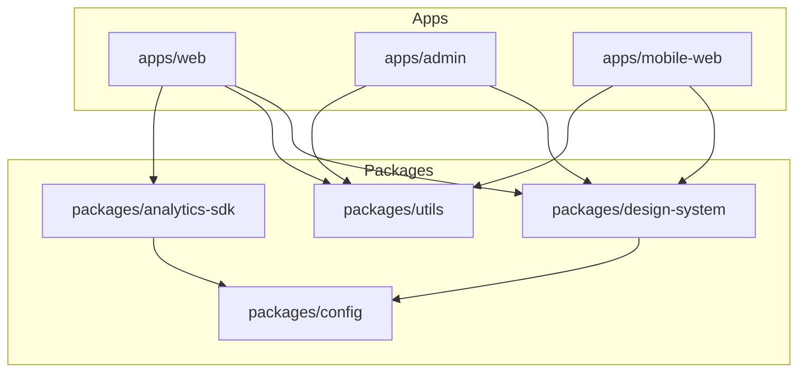
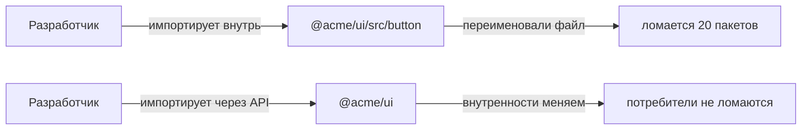

[← Назад к индексу части 29](index.md)

## 29.2 Монорепо

### Цель раздела

Понять, что монорепо — это **архитектурный выбор границ и процессов**: как организовать несколько приложений/пакетов так, чтобы:

- не копировать общий код,
- не “убить” скорость разработки,
- сохранить ownership и независимость там, где нужно.

### В этом разделе главное

- **Монорепо — это не “всё в одном репозитории”, а “единые правила и граф пакетов”.**
- Главный актив монорепо — **общие пакеты и единый tooling**, но главный риск — **связность** (все завязаны на всё).
- Выбор монорепо vs мультирепо зависит от:
  - независимости релизов,
  - структуры команд,
  - зрелости процессов,
  - потребности в shared‑коде.
- Shared‑пакеты без владельца превращаются в “болото”.

### Термины

| Термин | Коротко |
| --- | --- |
| **Workspace** | Механизм связки внутренних пакетов: локальные зависимости без публикации. |
| **Internal package** | Пакет внутри монорепо (design system, utils). |
| **Affected** | Понятие “какие пакеты затронуты изменением” (важно для CI и кэша). |
| **Task graph** | Граф задач сборки/тестов: что от чего зависит. |
| **Remote cache** | Кэш артефактов сборки между CI‑прогонами/разработчиками. |

### Теория и правила

#### 1) Монорепо как модель: единый репозиторий, но много продуктов

Простая модель:

- у тебя есть несколько приложений (`apps/*`) и общие пакеты (`packages/*`),
- зависимости между ними **явные**,
- CI умеет запускать тесты/сборку только для “затронутого”,
- команды имеют правила “кто чем владеет”.

Картинка в голове: граф монорепо



#### 2) Инструменты: Nx, Turborepo, Lerna, pnpm workspaces (роль, а не “бренд”)

Суть инструментов монорепо:

- определить workspaces (кто где живёт),
- построить граф зависимостей,
- кэшировать сборки и тесты,
- ускорить CI (affected builds),
- помочь с публикацией пакетов (если нужно).

Ключевой принцип:

**Инструмент не исправит плохие границы.**  
Если пакеты связаны хаотично — кэш будет мало помогать.

#### 3) Монорепо vs мультирепо: trade‑offs

Монорепо даёт:

- единые версии инструментов,
- удобное переиспользование пакетов,
- атомарные изменения (“изменил дизайн‑систему и сразу обновил приложения”).

Но платишь:

- сложностью графа,
- риском “все завязаны на всё”,
- необходимостью дисциплины ownership.

Мультирепо даёт:

- независимые циклы релизов,
- меньшую связанность,
- ясные границы на уровне репозиториев.

Но платишь:

- координацией версий общих библиотек,
- дублированием конфигов/инструментов,
- более сложным “сквозным изменением”.

Практическая эвристика:

- **1–3 приложения, общий UI и утилиты** → монорепо часто удобно.
- **десятки команд с независимыми релизами и разными владельцами** → мультирепо может дать меньше трения (или гибрид: монорепо на домен/платформу).

#### 4) Общие пакеты: дизайн‑система, утилиты, конфиги — это архитектурные контракты

Очень важный момент:

Если у тебя есть `packages/design-system`, то:

- это **контракт** между командами,
- у него должен быть владелец,
- у него должна быть версия,
- и должна быть политика breaking changes.

Простая и рабочая политика:

- semver для пакетов,
- changelog,
- deprecation‑период для изменений API компонентов,
- CI‑проверки совместимости (минимум — сборка потребителей).

#### 5) Зависимости между пакетами: запрещай хаос

Если нет правил, монорепо превращается в “монолит репозитория”.

Что обычно вводят:

- “слои” пакетов (например `shared` не зависит от `apps`, а `apps` зависит от `shared`);
- запрет циклов;
- правило импорта только через public API (`@acme/ui` вместо `@acme/ui/src/...`).

##### 5.1) Enforcement: как заставить правила работать (а не быть “в README”)

Проблема: почти любая команда “может договориться” про правила, но без автоматической проверки они **всё равно будут нарушаться** — случайно, под дедлайн, из‑за незнания.

Поэтому в зрелых монорепо правила делают *проверяемыми*:

- **линтеры границ** (enforce boundaries): запрещают импортировать “внутренности” пакета и запрещают запрещённые направления зависимостей;
- **граф зависимостей** (dep graph) как артефакт: его смотрят при ревью архитектурных PR;
- **CI‑гейты**: если нарушил правила — PR не проходит.

Интуиция:

```text
Правило без проверки = пожелание.
Правило с проверкой в CI = контракт.
```

Пример “контрактного” правила в форме, понятной всем:

- `apps/*` могут зависеть от `packages/*`
- `packages/shared-*` не могут зависеть от `apps/*`
- импорт разрешён только через public API (никаких `@acme/ui/src/...`)

Как запомнить:

- **границы должны быть не только описаны, но и “зафиксированы в инструментах”**.

###### Пример enforcement в конфиге (идея): Nx `depConstraints`

Если монорепо на Nx, часто используют “теги” и ограничения зависимостей.

Идея:

- `type:app` может зависеть от `type:lib`
- `scope:shared` не зависит от `scope:app`

Упрощённый пример (не привязан к версии Nx, смысл важнее синтаксиса):

```json
{
  "depConstraints": [
    {
      "sourceTag": "type:app",
      "onlyDependOnLibsWithTags": ["type:lib"]
    },
    {
      "sourceTag": "scope:shared",
      "onlyDependOnLibsWithTags": ["scope:shared", "scope:platform"]
    }
  ]
}
```

Что это даёт:

- правило становится машинопроверяемым,
- “случайная зависимость” ловится в PR, а не через месяц.

###### Пример enforcement deep‑import’ов: запрет “внутренностей”

Цель: запретить `@acme/ui/src/...` и разрешить только `@acme/ui`.

Практический смысл:

- можно менять структуру `src/` без массовых поломок,
- public API становится реальным контрактом.

Картинка в голове: где ломается без enforcement



Важно:

- запрет deep‑import’ов — не “бюрократия”, а защита эволюции архитектуры (см. часть 32).

#### 6) Кэширование сборок: почему это важно и когда ломается

Кэш помогает только когда:

- задачи детерминированы,
- входы/выходы описаны,
- зависимости корректно определены.

Ломается, когда:

- “скрытые входы” (переменные окружения, файловая система вне репо),
- недекларированные зависимости задач,
- нестабильные генерации (timestamps и т.п.).

#### 7) Версионирование и публикация shared‑пакетов: где чаще всего “болит”

В плане эта тема звучит кратко (“версионирование, публикация”), но в жизни это одна из главных причин, почему монорепо либо “взлетает”, либо превращается в болото.

Интуиция:

Shared‑пакет (дизайн‑система, утилиты, конфиги) — это **продукт внутри продукта**. Если его обновлять “как придётся”, он будет ломать потребителей.

Есть два базовых режима версионирования:

- **Fixed (единая версия на всё монорепо)**:
  - проще мыслить: “релизим всё вместе”,
  - хорошо, когда продукты выпускаются синхронно,
  - плохо, если пакеты должны жить независимо.
- **Independent (каждый пакет имеет свою версию)**:
  - хорошо для библиотек и независимых команд,
  - требует дисциплины релизов и changelog,
  - сложнее для сквозных изменений.

Публикация бывает двух типов:

- **не публикуем наружу**: пакеты используются только внутри монорепо через workspaces;
- **публикуем во внутренний registry** (private npm, GitHub Packages и т.п.), если есть потребители “вне” репозитория.

Мини‑пример: зависимости на workspace‑пакет (идея)

```json
{
  "dependencies": {
    "@acme/design-system": "workspace:*"
  }
}
```

Почему это удобно:

- приложения всегда берут локальную версию пакета,
- не нужно “публиковать”, чтобы использовать.

Но если нужно публиковать — обычно вводят процесс:

- PR с изменением shared‑пакета,
- changelog (автоматизировано),
- semver,
- проверка потребителей в CI.

Инструментальный пример (идея, без обязательности): Changesets

```text
.changeset/
  cool-change.md   -> описывает, какой пакет и насколько поднимаем версию
```

Ключевая мысль:

**Версии и changelog — это часть контракта между командами**, а не бюрократия “ради галочки”.

##### 7.1) Как выбрать fixed vs independent (пошагово, без догадок)

1) Ответь на вопрос: **приложения релизятся синхронно или независимо?**

- если есть “один релиз продукта” и все приложения/пакеты катятся вместе → fixed часто проще;
- если разные команды выкатывают пакеты независимо (или есть потребители вне монорепо) → independent естественнее.

2) Ответь на вопрос: **shared‑пакеты — это “внутренняя деталь” или “публичный продукт”?**

- “внутренняя деталь” (используется только в монорепо) → можно жить на `workspace:*` и не публиковать;
- “публичный продукт” (есть внешние потребители) → нужны версии, changelog, deprecation, публикация.

3) Проверь организационный контекст:

- если “владельцев нет”, но независимые релизы нужны → independent без дисциплины приведёт к хаосу;
- если “всё релизим вместе”, но пакеты должны жить независимо → fixed приведёт к лишней координации и “релизной очереди”.

Картинка в голове:

```text
Fixed = один поезд, много вагонов (проще, но все едут вместе)
Independent = много поездов (гибче, но нужен диспетчер и расписание)
```

##### 7.2) Внутренний registry: зачем он нужен и где здесь архитектура

Internal registry (private npm, GitHub Packages, Nexus/Artifactory) нужен, когда:

- есть потребители вне монорепо,
- нужно контролировать доступ и публикацию,
- хочется версионировать shared‑пакеты как продукт.

Мини‑пример `.npmrc` для scope (идея):

```text
@acme:registry=https://registry.example.com/
//registry.example.com/:_authToken=${NPM_TOKEN}
```

Архитектурные последствия:

- появляется “поставка библиотеки” как отдельный поток доставки (CI/CD для пакетов),
- надо думать о совместимости версий так же, как о совместимости API (semver + deprecation),
- зависимость на registry становится частью цепочки поставки (и точкой отказа).

##### 7.3) Peer dependencies для UI‑пакетов: как не получить “две React на странице”

Это напрямую связано с частью 28 (микрофронтенды) и 29.3 (shared deps в MF).

Если дизайн‑система или UI‑пакет тянет `react` как обычную dependency, ты рискуешь:

- получить несколько копий React в разных приложениях/чанках,
- увеличить вес,
- словить тонкие баги в контекстах/хуках (особенно в MF).

Типичная прод‑практика:

- `react`/`react-dom` — как **peerDependencies** у UI‑пакетов,
- а конкретные версии контролируются на уровне приложения/host.

Упрощённая идея `package.json` UI‑пакета:

```json
{
  "name": "@acme/design-system",
  "peerDependencies": {
    "react": "^18.0.0",
    "react-dom": "^18.0.0"
  }
}
```

Важно:

- peer deps не “магия” — они требуют дисциплины версий у потребителей,
- но они помогают не “встраивать React внутрь библиотеки”.

##### 7.4) Canary и “last known good” (LKG) для shared‑пакетов

Даже в монорепо полезно иметь понятие “последняя стабильная версия”, особенно если пакеты публикуются:

- **canary**: тестовая версия для ранних потребителей/стейджинга,
- **stable**: версия, которая прошла регрессию и считается LKG.

Это снижает риск ситуации “обновили дизайн‑систему → сломали 10 приложений”.

#### 8) Кэш сборок в CI: зачем remote cache и почему это архитектурное решение

Локальный кэш ускоряет одного разработчика.

Remote cache ускоряет:

- весь CI,
- всех разработчиков,
- повторные прогоны задач.

Но цена:

- нужно доверять детерминизму задач,
- нужно аккуратно описывать входы/выходы,
- иначе кэш будет давать “ложные успехи” или “странные флейки”.

Это напрямую влияет на throughput команды → значит, это архитектурно важно.

### Простыми словами

Монорепо — это как “один большой склад”, где:

- удобно делиться деталями (общие пакеты),
- легко менять несколько вещей одним изменением,
- но если не ввести правила, склад превращается в свалку: всё лежит вперемешку, и любая перестановка ломает половину системы.

### Пошагово: как внедрять монорепо “по‑инженерному”

1. Определи, **что является продуктами** (apps) и что — **библиотеками** (packages).  
2. Для shared‑пакетов назначь **владельца** и правила версии (semver + deprecation).  
3. Введи правила импортов: public API, запрет “лезть в src”.  
4. Настрой CI под “affected”: тесты/сборка только затронутого.  
5. Подключи кэш (локальный и при необходимости remote).  
6. Регулярно проверяй граф: нет ли циклов, нет ли “shared‑болота”.

### Примеры

#### Пример 1. `pnpm-workspace.yaml`

```yaml
packages:
  - "apps/*"
  - "packages/*"
```

#### Пример 1.1. `package.json` со скриптами для монорепо (идея)

```json
{
  "private": true,
  "workspaces": [
    "apps/*",
    "packages/*"
  ],
  "scripts": {
    "build": "turbo run build",
    "test": "turbo run test",
    "lint": "turbo run lint"
  }
}
```

#### Пример 1.2. `turbo.json` (очень упрощённо)

```json
{
  "pipeline": {
    "build": {
      "dependsOn": ["^build"],
      "outputs": ["dist/**", ".next/**"]
    },
    "test": {
      "dependsOn": ["build"]
    }
  }
}
```

Смысл:

- `dependsOn: ["^build"]` означает “сначала собери зависимости”,
- `outputs` помогает кэшу понимать, что считать результатом.

#### Пример 2. “Публичный API пакета”

Идея:

- `packages/ui/src/*` — внутренности,
- `packages/ui/index.ts` — публичная поверхность,
- потребители импортируют только `@acme/ui`.

#### Пример 3. “Когда монорепо не помогает”

Если все приложения импортируют “всё отовсюду”, то:

- изменение в любом месте приводит к сборке всего,
- кэш мало помогает,
- команды постоянно конфликтуют.

Значит проблема не в инструменте, а в границах и правилах зависимостей.

### Практика / реальные сценарии

#### Сценарий A. “Есть дизайн‑система, но команды копируют компоненты”

Как рассуждать:

- копирование = отсутствие доверия к shared‑пакету (или он неудобен),
- нужен владелец, семантические версии, стабильный API,
- миграции через deprecation, а не “сломали всех за ночь”.

#### Сценарий B. “CI стал очень медленным после перехода на монорепо”

Чек‑лист:

- запускаете ли вы “affected” или всегда “всё”?
- правильно ли описаны входы/выходы задач?
- есть ли кэш (локальный/remote)?
- нет ли скрытых зависимостей (например, глобальные файлы конфигов, которые меняются часто)?

### Типичные ошибки

- **Shared‑пакеты без владельца** (“пусть все правят”) → болото и отсутствие обратной совместимости.
- **Импорты внутренних файлов** (`@acme/ui/src/button`) → невозможно менять структуру без массовых поломок.
- **Отсутствие правил зависимостей** → циклы и “всё зависит от всего”.
- **Монорепо при независимых релизах 30 команд** без процессов → release‑train и постоянные блокировки.

### Проверь себя

1. Почему монорепо может ускорить разработку, даже если репозиторий стал “больше”?  
2. Что важнее для здоровья монорепо: инструмент (Nx/Turbo) или правила зависимостей? Почему?  
3. Назови 2 признака, что shared‑пакет превращается в “болото”.

<details><summary>Ответ</summary>

1. Потому что уменьшается дублирование, унифицируются инструменты, и можно делать атомарные изменения. Плюс, при правильной настройке “affected” и кэша, CI не обязан собирать всё.  
2. Правила зависимостей и ownership. Инструмент помогает автоматизировать, но не определяет границы. Без границ любой инструмент будет собирать всё и конфликтовать.  
3. Частые breaking changes “без предупреждения”, отсутствие версий/документации, рост “общих утилит” без ясного назначения, а также зависимость shared‑кода от конкретных приложений.

</details>

### Запомните

- Монорепо — это **граф пакетов + правила**, а не просто “всё рядом”.
- Главный риск — **неявные зависимости** и shared‑болото. Лечится ownership, public API, semver и проверками.

---
