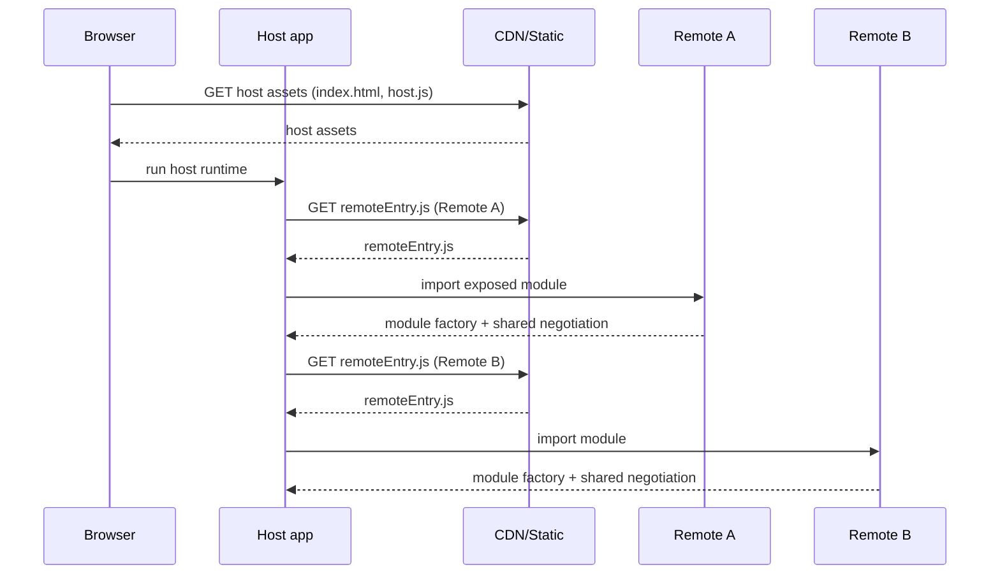
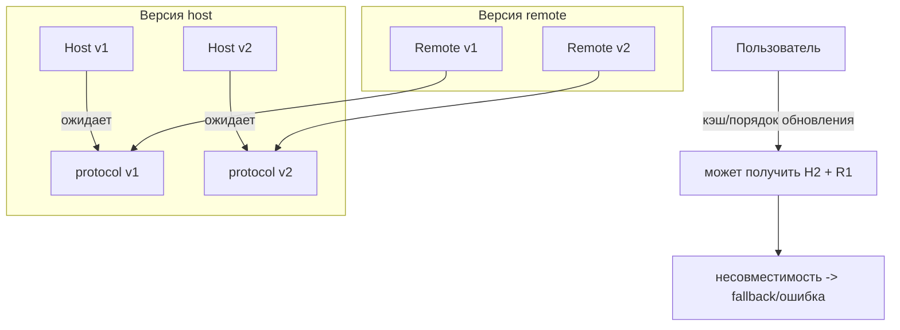
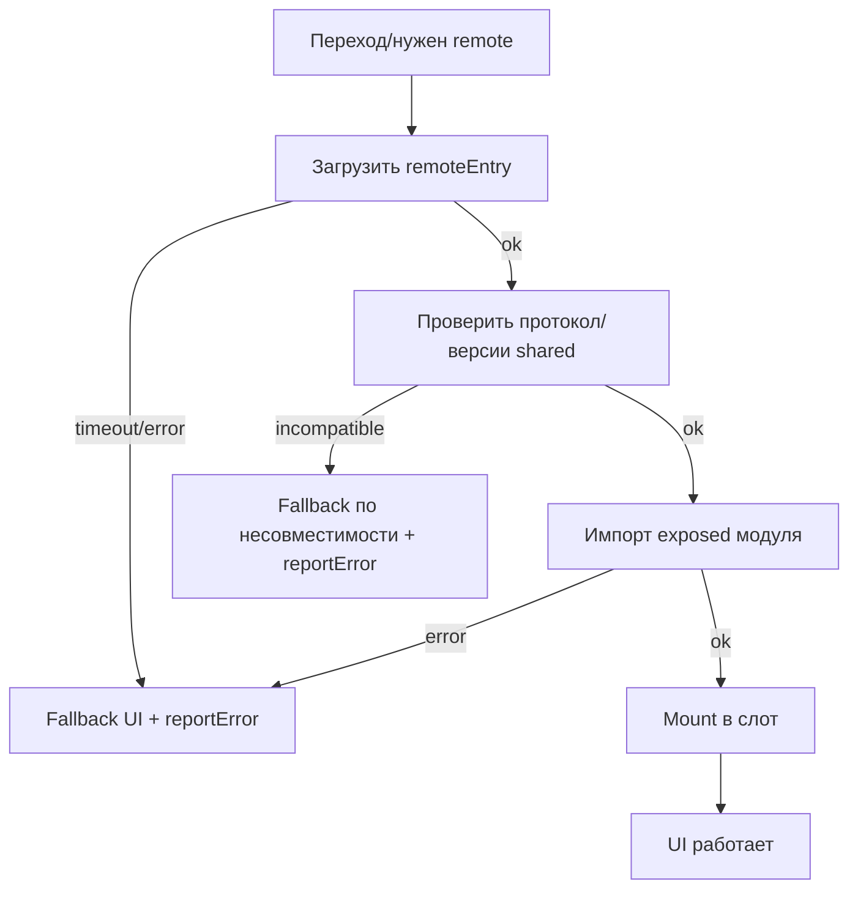

[← Назад к индексу части 29](index.md)

## 29.3 Module Federation и remote‑модули

### Цель раздела

Сформировать ясную модель Module Federation как **механизма рантайм‑импорта** между независимыми сборками, и понять:

- когда это действительно нужно,
- какие контракты и риски появляются,
- какие ловушки чаще всего “стреляют” в продакшене.

### В этом разделе главное

- Module Federation — это **не “просто импорт”**, а **контракт доставки в рантайме** между host и remote.
- Самая большая “цена” — **версии shared‑зависимостей** и диагностика несовместимости.
- MF оправдан, когда нужен **независимый релиз**/поставка частей фронта (микрофронтенды, плагины).
- MF не заменяет архитектуру границ: без контрактов (часть 28) ты получишь распределённый фронт‑монолит.

### Термины

| Термин | Коротко |
| --- | --- |
| **Remote entry** | Точка входа remote‑сборки (манифест/файл), через которую host узнаёт, что можно импортировать. |
| **Exposes** | Какие модули remote “выставляет наружу”. |
| **Remotes** | Какие remote’ы подключает host. |
| **Shared** | Какие зависимости должны быть общими (или согласованными) между host и remote. |
| **Singleton** | Требование “одна копия зависимости на страницу” (часто важно для React). |
| **Fallback** | План “что делать, если remote не загрузился/несовместим”. |

### Теория и правила

#### 1) Интуиция: MF как “подключить блок к системе на ходу”

Представь, что host — это “базовая система”, а remote — “сменный блок”.

- host в рантайме говорит: “мне нужен модуль X”,
- remote предоставляет этот модуль,
- и они договариваются, какими общими деталями пользоваться (shared deps).

Картинка в голове: host ↔ remotes



#### 2) Когда Module Federation оправдан

Сильные сценарии:

- **микрофронтенды** с независимой поставкой (часть 28),
- “плагинная” модель: подключаем новые блоки без пересборки host,
- организационные границы: разные команды, разные релиз‑циклы.

Слабые/сомнительные сценарии:

- одна команда, один релиз, просто хочется “модулярности” → чаще достаточно монорепо + обычных пакетов.

Эвристика:

Если ты не можешь сформулировать, **какую независимость релиза** ты покупаешь, MF, скорее всего, не нужен.

#### 3) Shared dependencies: почему это “архитектура”, а не “опция в конфиге”

Если host и remote используют React, то важно:

- одна копия React на страницу (часто),
- согласованные версии,
- единые инварианты (контекст, hooks).

Если версии разъедутся:

- могут появиться неочевидные ошибки,
- разные контексты,
- сломанные хуки,
- “два React’а” увеличивают вес и ломают ожидания.

Значит shared‑зависимости — это **контракт**.

#### 3.1) Share scope negotiation (простыми словами): что “инициализируется” и где ломается

Термин “shared negotiation” часто звучит как магия. Разложим очень приземлённо.

**Интуиция:**  
Host и remote должны договориться, *какую конкретно копию* `react`/`react-dom`/других shared‑пакетов использовать. Это похоже на “проверку совместимости деталей перед стыковкой”.

Упрощённо (идея механики):

1) host инициализирует “общий контейнер зависимостей” (share scope)  
2) remote подключается и говорит: “у меня есть/нет такие версии shared”  
3) рантайм выбирает, что использовать (singleton/required/strict влияют на выбор)

Псевдокод‑образ (идея, не буквальный API):

```ts
// идея: host готовит share scope
await __webpack_init_sharing__("default");

// идея: host загружает remoteEntry (скрипт)
await loadRemoteEntry({ url, global: "catalog" });

// идея: host инициирует контейнер remote и передаёт ему share scope
const container = (window as any).catalog;
await container.init(__webpack_share_scopes__.default);

// идея: после init можно запрашивать exposed модуль
const factory = await container.get("./Widget");
const Widget = factory();
```

Где это чаще всего ломается:

- remote не успел/не смог проинициализироваться (CSP/CDN/timeout) → контейнер отсутствует;
- версия shared не подходит (strict/required) → нужна **контролируемая деградация**, а не краш;
- две копии React просачиваются из‑за неправильных peer deps / shared‑настроек → тонкие баги.

Как диагностировать:

- логируй событие “share init ok/fail” с полями `remote`, `requiredVersion`, `protocolVersion`;
- различай “network/CSP” и “version mismatch” — это разные классы инцидентов.

#### 4) Версионирование и фолбэки: что делать, когда несовместимо

Реальность продакшена:

- у пользователя может быть кэш,
- CDN может отдавать разные версии,
- remote может обновиться раньше host (или наоборот).

Поэтому нужно:

- политика совместимости,
- протокол версий (например `protocolVersion` как в части 28),
- фолбэк: если remote не подходит — не уронить весь продукт.

##### Деплой и кэш remoteEntry: главный скрытый риск MF

Самая неприятная категория багов MF — “у части пользователей работает, у части нет”.

Почему:

- `remoteEntry.js` и чанки remote могут кэшироваться,
- host и remote могут обновляться в разном порядке,
- CDN может отдавать разные версии на разных edge‑узлах.

Картинка в голове: “смешанные версии”



Практические правила:

- **`remoteEntry` часто кэшируют коротко**, а чанки с hash — долго.
- Вводят **совместимость протокола**: host v2 должен уметь работать с remote v1 хотя бы некоторое время (deprecation).
- Держат стратегию “last known good” (LKG): возможность быстро откатить remote или отключить его фичефлагом.

##### Fallback‑стратегии (не “одна заглушка на всё”)

Минимальный набор, который реально спасает инциденты:

- **UI‑fallback в слот** (как в части 28): показать “часть недоступна” + кнопка “повторить”.
- **Технический fallback на версию**:
  - если протокол не совпал — не пытаться монтировать, сразу деградировать.
- **Отключение remote фичефлагом**:
  - если remote массово падает — отключить до фикса без релиза host.

Важно:

- fallback — часть UX и надёжности, а не “опция”.

Картинка: деградация при проблеме remote

```text
Host
  |
  +-- load Remote A -> ok -> render slot A
  |
  +-- load Remote B -> fail/compat -> render fallback in slot B + reportError
```

#### 5) Диагностика и отладка MF: почему это сложнее

В обычной сборке у тебя одна версия кода и один sourcemap‑набор.

В MF:

- несколько сборок,
- разные sourcemaps,
- возможные несовместимости,
- сложнее воспроизвести проблему пользователя.

Значит прод‑практики:

- единый `trace_id`/корреляция ошибок (связь с частью 31),
- централизованный репортинг (host предоставляет API),
- строгие правила версий и deprecation.

#### 5.1) Механика “как host реально загружает remote”: timeout, retry, диагностика

В документациях MF часто показывают “всё загрузилось”, но в продакшене важно сразу встроить:

- таймауты (иначе вечный спиннер),
- повтор (аккуратно, с backoff),
- различение причин (DNS/CDN/CSP/несовместимость протокола),
- логирование/метрики.

Интуиция:

- remote — это внешняя зависимость (почти как внешний API),
- значит к нему применимы принципы из части 19/31: timeout, retry, fallback, наблюдаемость.

Мини‑пример: загрузка `remoteEntry` с таймаутом и fallback (идея)

```ts
type LoadRemoteOpts = {
  url: string;
  global: string; // например "catalog"
  timeoutMs?: number;
};

function withTimeout<T>(p: Promise<T>, timeoutMs: number): Promise<T> {
  return new Promise<T>((resolve, reject) => {
    const t = setTimeout(() => reject(new Error("RemoteLoadTimeout")), timeoutMs);
    p.then(
      (v) => {
        clearTimeout(t);
        resolve(v);
      },
      (e) => {
        clearTimeout(t);
        reject(e);
      }
    );
  });
}

async function loadScript(url: string): Promise<void> {
  await new Promise<void>((resolve, reject) => {
    const s = document.createElement("script");
    s.src = url;
    s.async = true;
    s.onload = () => resolve();
    s.onerror = () => reject(new Error("RemoteScriptLoadError"));
    document.head.appendChild(s);
  });
}

export async function loadRemoteEntry(opts: LoadRemoteOpts): Promise<void> {
  const timeoutMs = opts.timeoutMs ?? 5000;
  await withTimeout(loadScript(opts.url), timeoutMs);
  if (!(window as any)[opts.global]) {
    throw new Error("RemoteGlobalMissing");
  }
}
```

Как это применять “по‑взрослому”:

- таймаут должен вести к **контролируемому fallback** (не к зависанию),
- ошибка должна репортиться (Sentry/лог) с полями: `remote`, `url`, `protocolVersion`, `env`,
- retry должен быть осторожным (не DDOSить CDN; лучше кнопка “повторить”).

##### Картинка в голове: жизненный цикл загрузки remote



##### Граничный случай: “загрузилось, но не исполнилось” (CSP)

Иногда сеть/скрипт загрузился, но браузер блокирует выполнение из‑за CSP.

Практический вывод:

- в мониторинге нужно различать:
  - network error,
  - CSP violation,
  - protocol mismatch,
  - runtime error внутри remote.

Именно так ты превращаешь MF из “магии, которая иногда падает” в управляемую архитектуру.

### Простыми словами

Module Federation — это “подключить кусок приложения, который собран отдельно”.

Это даёт свободу (независимые релизы), но требует дисциплины:

- кто владеет shared‑зависимостями,
- какие версии совместимы,
- что делать, если remote не загрузился.

### Пошагово: как внедрять MF безопасно

1. Определи **границы микрофронтов и контракты** (часть 28) до выбора инструмента.  
2. Реши, какие зависимости должны быть shared (и кто их владелец).  
3. Введи **протокол версий** (например `protocolVersion`, semver для shared).  
4. Сделай **fallback** для каждого remote (не белый экран).  
5. Настрой мониторинг ошибок: различай “remote не загрузился” и “ошибка внутри remote”.  
6. Добавь CI‑проверки совместимости: хотя бы “host + remote вместе собираются/запускаются в e2e” на ключевых сценариях.

### Примеры

#### Пример 1. Контракт “host вызывает remote”

Идея (псевдо‑контракт):

```ts
export type MfContext = {
  protocolVersion: "1";
  mountPoint: HTMLElement;
  navigate: (to: string) => void;
  reportError: (e: unknown) => void;
};

export type RemoteModule = {
  mount(ctx: MfContext): () => void; // returns unmount
};
```

Смысл:

- контракт явный,
- host контролирует навигацию и репортинг,
- remote возвращает `unmount`, чтобы не протекали подписки/таймеры.

#### Пример 2. “Shared React”: почему singleton важен

Интуитивно:

React — как “единая нервная система” приложения. Две независимые нервные системы на одной странице часто конфликтуют.

Поэтому shared‑React часто требует:

- singleton,
- согласованные версии.

#### Пример 3. Мини‑конфиг Module Federation (Webpack) для remote и host

Это “скелет”, чтобы увидеть основные поля. В реальном проекте вокруг будет больше: пути, публичные URL, окружения.

**Remote**

```js
// webpack.config.js (remote, упрощённо)
const { ModuleFederationPlugin } = require("webpack").container;

module.exports = {
  plugins: [
    new ModuleFederationPlugin({
      name: "catalog",
      filename: "remoteEntry.js",
      exposes: {
        "./Widget": "./src/widget",
      },
      shared: {
        react: { singleton: true, requiredVersion: "^18.0.0" },
        "react-dom": { singleton: true, requiredVersion: "^18.0.0" },
      },
    }),
  ],
};
```

**Host**

```js
// webpack.config.js (host, упрощённо)
const { ModuleFederationPlugin } = require("webpack").container;

module.exports = {
  plugins: [
    new ModuleFederationPlugin({
      name: "host",
      remotes: {
        catalog: "catalog@https://cdn.example.com/catalog/remoteEntry.js",
      },
      shared: {
        react: { singleton: true, requiredVersion: "^18.0.0" },
        "react-dom": { singleton: true, requiredVersion: "^18.0.0" },
      },
    }),
  ],
};
```

На что смотреть:

- `exposes` — публичная поверхность remote (как public API у пакета),
- `shared` — контракт по версиям и “одной копии на страницу”.

##### 3.1) `requiredVersion`, `strictVersion`, `singleton`: как не превратить shared в “случайность”

В MF shared‑настройки — это не “украшение конфигурации”, а способ формализовать то, что в монорепо мы делаем версиями и peer deps.

Интуитивно:

- **`singleton`** — “на странице должна быть одна копия зависимости” (часто критично для React).
- **`requiredVersion`** — “я ожидаю такую версию (или диапазон)”.
- **`strictVersion`** (если используется) — “если версия не совпала — не пытайся ‘как‑нибудь’, считай это несовместимостью”.

Почему это важно:

- без явности ты можешь получить “вроде работает” до тех пор, пока не прилетит тонкий баг в контекстах/хуках.

Практическая рекомендация:

- для React‑стека чаще делают `singleton: true`,
- версии согласуют через semver и релизную дисциплину,
- а несовместимость должна приводить не к крашу, а к **контролируемому fallback** (см. блок про fallback‑стратегии).

##### 3.2) Remote URL по окружению: не “захардкодить в конфиг”, а сделать управляемо

Один из реальных продакшен‑вопросов: как переключать `remoteEntry` между dev/staging/prod, не пересобирая host каждый раз (или пересобирать предсказуемо).

Подходы (по возрастанию зрелости):

- **Build‑time env**: URL remote вшивается в host при сборке (простое, но менее гибкое).
- **Runtime config**: host читает базовые URL из runtime‑конфига (как в 29.1), и формирует адрес remote на лету.
- **Remote manifest/registry**: host получает “таблицу remote → url/version” из сервиса/файла и выбирает, что подключать (это уже ближе к “платформе микрофронтов”).

Главный принцип:

**URL remote — это часть операционного контура**, поэтому он должен быть управляемым так же, как feature flags или конфиг окружения.

##### 3.3) Remote manifest: “таблица соответствия” как контракт доставки

Чтобы уйти от захардкоженных URL и получить управляемость (особенно при большом числе remotes), часто вводят **manifest**:

- простой JSON, который описывает:
  - имя remote,
  - URL `remoteEntry`,
  - версию/канал (stable/canary),
  - протокол (protocolVersion),
  - дополнительные флаги (например “временно отключён”).

Мини‑пример manifest (идея):

```json
{
  "env": "prod",
  "remotes": {
    "catalog": {
      "remoteEntryUrl": "https://cdn.example.com/catalog/remoteEntry.js",
      "protocolVersion": "1",
      "channel": "stable"
    },
    "checkout": {
      "remoteEntryUrl": "https://cdn.example.com/checkout/remoteEntry.js",
      "protocolVersion": "1",
      "channel": "canary"
    }
  }
}
```

Как это использовать:

- host при старте скачивает manifest (короткий кэш, как конфиг),
- выбирает нужные remotes,
- при инциденте можно переключить `channel` или “выключить” remote **без пересборки host** (если архитектура позволяет).

Важно:

- manifest — тоже контракт: его должен кто‑то владеть (platform/shell),
- изменения manifest должны быть наблюдаемыми (лог/аудит), иначе получишь “магические переключения”.

##### Важный граничный случай: CORS/CSP и политики безопасности

Если `remoteEntry` грузится с другого домена, в продакшене всплывают “не архитектурные” на вид проблемы:

- CORS и заголовки,
- CSP (Content Security Policy),
- политики `crossorigin` и работа с CDN.

Смысл для архитектора:

- это не “мелочь инфраструктуры”, а часть работоспособности MF‑архитектуры.

Если CSP строгая и remote не добавлен в allow‑list, ты получишь “не грузится remote” → fallback должен сработать, а мониторинг должен показать причину.

### Практика / реальные сценарии

#### Сценарий A. “Нужно независимое обновление витрины каталога без релиза всего сайта”

Ход мыслей:

- есть отдельная команда каталога,
- релизы частые и не должны блокировать оплату/профиль,
- нужна независимая поставка → MF может подойти,
- но обязательно: протокол версий, fallback, shared‑дизайн‑система.

#### Сценарий B. “Хотим MF, потому что Webpack умеет”

Проверка:

- есть ли организационная причина? (команды, независимые релизы)
- есть ли готовность к операционной сложности? (мониторинг, совместимость, CI)

Если нет — вероятно, монорепо + пакеты будет дешевле и надёжнее.

### Типичные ловушки

- **Рассинхрон shared‑зависимостей** (React/version drift) → трудноуловимые баги.
- **Нет fallback’ов** → любой сетевой сбой превращается в белый экран.
- **Скрытые контракты** (“передадим пропсы как‑нибудь”) → ломается при первом breaking change.
- **MF без реальной потребности** → усложнение сборки/отладки без выигрыша.

### Что будет, если…

- …remote обновится, а host останется старым?  
  Без протокола совместимости ты получишь случайные несовместимости у части пользователей (зависит от кэша и порядка обновления).
- …host и remote тащат разные версии React?  
  Возможны “сломанные хуки”, разные контексты, удвоение веса. Иногда всё “как будто работает”, пока не появится тонкий баг.

### Проверь себя

1. Почему Module Federation не решает проблему “плохих границ” сам по себе?  
2. Что важнее: “настроить shared deps” или “настроить fallback”? Почему?  
3. Назови один сценарий, где MF оправдан, и один — где лучше обойтись без него.

<details><summary>Ответ</summary>

1. Потому что без границ и контрактов ты просто получишь распределённый монолит: части будут жёстко связаны через данные/навигацию/общие состояния, только отладка станет сложнее.  
2. Оба критичны, но без fallback любой сбой сети/CDN превращается в инцидент для пользователя. Shared deps важны для корректности, fallback — для устойчивости UX.  
3. Оправдан: несколько команд, независимые релизы фрагментов одной страницы. Не оправдан: одна команда и общий релиз — лучше монорепо + пакеты + обычные динамические импорты.

</details>

### Запомните

- Module Federation = рантайм‑контракт между сборками.  
- Главные риски: shared‑версии, совместимость, диагностика, fallback.  
- Без организационной потребности MF часто дороже, чем полезен.

---
