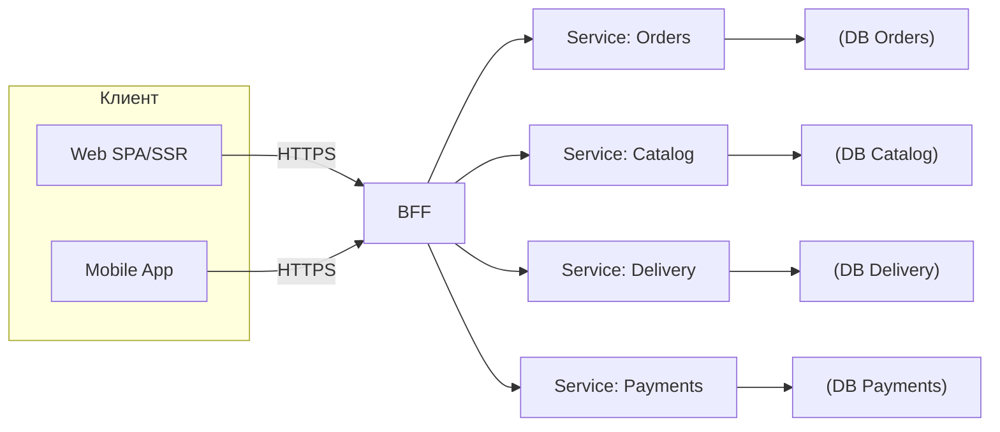
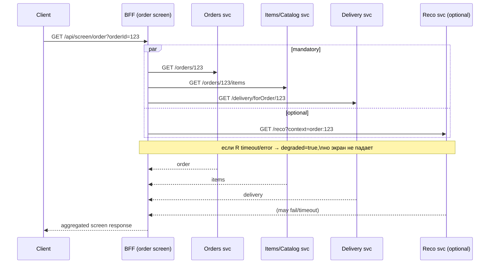

[← Назад к индексу части 30](index.md)

## 30.1 BFF (Backend for Frontend)

### Цель раздела

Понять BFF как архитектурный слой: **что он делает**, **какие проблемы решает**, **какую цену добавляет**, и как не превратить BFF в «ещё один бекенд‑монолит».

### В этом разделе главное

- **BFF — это слой “под клиента”, а не “ещё один сервис ради моды”.**
- **Тонкий BFF** — проще и дешевле, но может оставить боль «много походов» на клиента.
- **Толстый BFF** может сильно улучшить UX (меньше запросов, адаптация под экран), но риск — **дублирование логики** и “новый монолит”.
- В любом варианте BFF — это:
  - дополнительный hop (латентность),
  - новая точка отказа,
  - место, где нужно дисциплинировать контракты, наблюдаемость и безопасность.

### Термины

| Термин | Коротко |
| --- | --- |
| **Aggregation (агрегация)** | Собрать данные из нескольких сервисов в один ответ “для экрана”. |
| **Orchestration (оркестрация)** | Управлять последовательностью/параллелизмом вызовов, объединять результаты, обрабатывать ошибки. |
| **Edge BFF** | BFF ближе к пользователю (на CDN/edge), чтобы снижать задержку (но есть ограничения). |
| **Screen/Experience API** | API, ориентированное на “экран/сценарий”, а не на доменные сущности. Часто реализуется в BFF. |

### Теория и правила

#### 1) Интуиция: зачем вообще нужен BFF

Простая ситуация из реальной жизни:

- веб‑клиенту для “страницы заказа” нужны: заказ + товары + доставка + рекомендации,
- мобильному клиенту нужен похожий смысл, но **другой формат** (другой набор полей, другой порядок, меньше веса),
- при этом внутренний бекенд разбит на сервисы (orders, catalog, delivery, payments).

Если клиент ходит напрямую в каждый сервис, появляется боль:

- много запросов (особенно заметно на мобильной сети),
- сложнее управлять auth/политиками безопасности в браузере,
- клиент начинает знать внутреннюю архитектуру (“где какой сервис и как его вызывать”),
- изменения в бекенде чаще ломают клиентов.

**BFF** — это слой, который берёт на себя:

- “как собрать данные для экрана”,
- “как спрятать внутренние сервисы и их эволюцию”,
- “как унифицировать auth/ошибки/логирование”.

Картинка в голове: BFF как «официант» между залом и кухней

```text
Клиент (зал) хочет "комбо-обед":
  - быстро
  - в понятной форме
  - без знания, где на кухне что лежит

BFF (официант):
  - принимает заказ в понятных терминах ("экран заказа")
  - идет на кухню (внутренние сервисы)
  - приносит клиенту готовый "комбо-набор"
```

##### Проверь себя (30.1.1 — зачем нужен BFF)

1. В каких двух случаях BFF чаще всего **окупается**, а в каких двух — чаще всего становится “лишним hop”?  
2. Почему “клиент начал знать внутреннюю архитектуру” — это не только про “красоту”, а про стоимость изменений и инциденты?  
3. Придумай пример “экранной” потребности, которую неудобно решать без BFF (в 1–2 предложениях).

<details><summary>Ответ</summary>

1. Окупается: (а) несколько клиентов (web/mobile) с разными форматами/агрегацией; (б) экран требует много вызовов и важны единые политики auth/ошибок/трейсинга. Лишний: (а) один клиент и 1–2 простых вызова; (б) BFF не даёт ни нормализации ошибок, ни упрощения CORS/auth, ни агрегации — просто прокси.  
2. Потому что любое внутреннее изменение (версии сервисов, разбиение, переименование полей) начинает ломать клиентов напрямую. Это увеличивает координацию, делает релизы рискованнее и повышает вероятность прод‑поломок.  
3. Например: “экран заказа” требует собрать данные из orders + delivery + catalog + рекомендации, а на мобильной сети 4–6 запросов ухудшают UX; BFF может агрегировать и деградировать по необязательным блокам.

</details>

#### 2) Базовая архитектурная схема: клиент → BFF → сервисы



Ключевое: BFF **не должен** становиться “новым источником истины”. Источник истины — доменные сервисы/БД. BFF — **слой представления и адаптации**.

##### Проверь себя (30.1.2 — базовая схема)

1. Почему важно держать принцип “BFF не источник истины”? Какой тип проблем появится, если нарушить?  
2. Назови два примера, что именно BFF может “адаптировать”, не превращаясь в бизнес‑сервис.  
3. Где в этой схеме правильнее всего добавлять `trace_id`, и почему именно там?

<details><summary>Ответ</summary>

1. Иначе BFF начнёт хранить доменную правду и бизнес‑логику, превратится в новый монолит, появится дублирование правил и сложная консистентность (разные источники “правильных данных”).  
2. Форму ответа под экран (агрегация), нормализацию ошибок, маппинг полей/форматов (например, объединить данные из двух сервисов), but без принятия доменных решений “можно ли отменить заказ”.  
3. На входе BFF (первая серверная точка для клиента): там удобно создавать/прокидывать корреляцию дальше во внутренние сервисы, чтобы связать цепочку вызовов.

</details>

#### 2.1) Тонкий BFF как “шлюз политики”: что он реально делает (и зачем это не “просто прокси”)

Когда говорят “тонкий BFF”, легко представить «просто проксировать запросы». Но даже тонкий BFF обычно решает **архитектурно важную** задачу: он становится **единым местом политик** (security/ошибки/наблюдаемость), которые иначе размазываются по клиентам и становятся неуправляемыми.

Типичные обязанности тонкого BFF:

- **proxy + routing**: внешний стабильный URL → внутренний сервис/версия;
- **auth**: принять cookie/токен от клиента, проверить базовые условия, прокинуть контекст дальше;
- **нормализация ошибок**: привести 5 разных форматов ошибок сервисов к одной форме;
- **корреляция**: создать/прокинуть `trace_id`, замерить тайминги;
- **защитные меры**: rate limiting, базовая валидация, защита от очевидных злоупотреблений.

Простыми словами: тонкий BFF — это “рамка предсказуемости” вокруг внутренней кухни.

Мини‑пример: стабильные маршруты BFF → меняющиеся внутренние API

```text
GET  /api/orders/{id}      -> orders-service:  GET /v3/orders/{id}
POST /api/cart/items       -> cart-service:    POST /cart/items
GET  /api/catalog/search   -> catalog-service: GET /search?q=...

Клиенты знают только /api/* и один формат ошибок/логирования.
```

Граничный случай: если тонкий BFF не даёт ни нормализации ошибок, ни наблюдаемости, ни упрощения CORS/auth для браузера — он легко превращается в “hop без пользы”.

##### Проверь себя (30.1.2.1 — тонкий BFF как шлюз политик)

1. Чем “тонкий BFF” отличается от “просто API gateway”, если смотреть на обязанности и контекст (фронт‑ориентированность)?  
2. Почему нормализация ошибок — это архитектурная выгода, а не косметика?  
3. Назови один признак, что вы сделали BFF “тонким”, но пользы не получили.

<details><summary>Ответ</summary>

1. API gateway часто про глобальные инфраструктурные политики на входе в платформу, а BFF — про политику и адаптацию именно под конкретный продукт/клиент (формат ошибок, screen‑API, контекст UI). На практике границы могут пересекаться, но “под клиента” — ключевой признак BFF.  
2. Потому что единый формат ошибок снижает связность клиента с внутренними сервисами, упрощает обработку и диагностику (меньше ветвлений, проще наблюдаемость и поддержка).  
3. Например: BFF проксирует 1:1 без единого формата ошибок/trace_id и без упрощения CORS/auth — при этом добавил задержку и точку отказа.

</details>

#### 3) Тонкий vs толстый BFF: в чём разница на практике

**Тонкий BFF (thin BFF)** — чаще всего:

- проверяет аутентификацию (или прокидывает её),
- маршрутизирует запросы,
- нормализует ошибки,
- добавляет общие заголовки/trace_id,
- иногда делает “лёгкую” трансформацию.

Плюсы:

- проще поддерживать,
- меньше риска “дублировать бизнес‑логику”,
- легче масштабировать организационно.

Минусы:

- клиент может всё равно делать много запросов,
- часть “композиции экрана” остаётся на клиенте.

**Толстый BFF (thick BFF)** — делает:

- агрегацию нескольких сервисов под один экран,
- оркестрацию (параллель/последовательность),
- маппинг форматов (особенно под разные клиенты),
- иногда кэширование “экранных” ответов (аккуратно).

Плюсы:

- меньше сетевых походов с клиента,
- проще клиенту (особенно мобильному),
- меньше утечек внутренней архитектуры наружу.

Минусы:

- риск “BFF стал вторым бекендом с бизнес‑логикой”,
- сложнее тестировать и эволюционировать,
- при нескольких клиентах легко получить дублирование логики между BFF.

##### Проверь себя (30.1.3 — тонкий vs толстый)

1. Приведи пример задачи, где тонкий BFF **лучше**, и пример, где толстый BFF **лучше** (в 1–2 предложениях каждый).  
2. Почему “толстый BFF” особенно легко становится местом бизнес‑логики? Какая дисциплина это предотвращает?  
3. Как ты поймёшь, что “композицию экрана” лучше перенести с клиента в BFF? Назови 2 сигнала.

<details><summary>Ответ</summary>

1. Тонкий лучше: единый вход, auth/trace/error‑политики, но данные простые и мало вызовов. Толстый лучше: экран требует агрегации нескольких доменов, особенно для mobile/плохой сети, и нужна деградация по необязательным блокам.  
2. Потому что он “видит всё” и удобно “допилить здесь”. Предотвращает дисциплина: BFF — слой представления/агрегации, бизнес‑решения остаются в доменных сервисах; плюс контрактность и ревью на “не тащим доменные инварианты в BFF”.  
3. Сигналы: (а) 3–10+ запросов на один экран, заметно влияющих на UX; (б) разные клиенты требуют разные формы данных; (в) сложная обработка ошибок/частичных отказов на клиенте.

</details>

#### 4) Один BFF vs BFF по типам клиента

Два базовых варианта (оба встречаются в продакшене):

**Вариант A. Один BFF на продукт**

```text
web -> BFF -> services
mobile -> BFF -> services
```

Когда достаточно:

- фактически один тип клиента (например, только веб),
- требования к данным у клиентов почти одинаковые,
- команда хочет простоты и одного места политики безопасности.

Риски:

- BFF перегружается несовместимыми требованиями разных клиентов,
- внутри появляется «условная логика по клиенту» (ветвления), которая растёт.

**Вариант B. BFF по типам клиентов**

```text
web -> Web BFF -> services
mobile -> Mobile BFF -> services
```

Когда оправдан:

- веб и мобильный реально сильно отличаются по форматам/потокам,
- разные команды/скорости релиза,
- разные требования к кэшированию/латентности.

Риски:

- дублирование логики агрегации/мэппинга,
- сложнее держать единые политики (auth, observability), если нет общего ядра.

Практичное решение‑компромисс (часто встречается):

- **общие политики и библиотека “platform”** (auth middleware, tracing, error mapping) — общие,
- **экранная агрегация** — раздельная, потому что UX разный.

##### Проверь себя (30.1.4 — один BFF vs BFF по клиентам)

1. Почему “один BFF на всё” со временем часто превращается в “лес if‑ов по клиенту”?  
2. Какой подход снижает дублирование политик безопасности при нескольких BFF?  
3. Назови пример требования, которое оправдывает отдельный mobile‑BFF.

<details><summary>Ответ</summary>

1. Потому что клиенты начинают расходиться по payload/UX/кэшу/латентности, и вместо явных границ появляется условная логика внутри одного сервиса. Это усложняет тестирование и эволюцию.  
2. Общая платформенная библиотека/слой (auth middleware, tracing, error mapping) + единые стандарты логирования/метрик, чтобы политики были одинаковыми, а экранные ответы могли различаться.  
3. Например: на мобильной сети критична минимизация round‑trips и веса ответа, нужен другой формат “экранного” ответа и агрегация, отличная от веба.

</details>

#### 5) Цена BFF: latency, отказоустойчивость, точки отказа

BFF добавляет hop. Это не «плохо», но это факт.

Интуиция:

```text
Без BFF:
  клиент -> сервис (1 hop)

С BFF:
  клиент -> BFF -> сервис (2 hops)
  + BFF может вызвать несколько сервисов
```

Что из этого следует:

- BFF обязан быть **наблюдаемым**: логировать duration, errors, upstream timeouts.
- В BFF особенно нужны:
  - **таймауты** на вызовы сервисов,
  - **fallback/деградация** (если сервис рекомендаций упал — страница заказа не должна падать целиком),
  - **корреляция** запросов (trace_id).

Это напрямую перекликается с частью 31, но уже здесь важно запомнить: **BFF — это “внешняя зависимость” для клиента**, значит поведение при сбоях должно быть чётким.

##### Проверь себя (30.1.5 — цена BFF)

1. Что такое “hop” простыми словами, и почему дополнительный hop не всегда плохо?  
2. Почему таймауты в BFF — не “оптимизация”, а защита от зависаний?  
3. Назови два примера деградации, которые лучше, чем “уронить весь экран”.

<details><summary>Ответ</summary>

1. Hop — это один сетевой переход между компонентами. Дополнительный hop может быть оправдан, если он снижает количество других вызовов (агрегация), стабилизирует политику безопасности/ошибок и уменьшает связанность клиентов с внутренностями.  
2. Потому что без таймаутов зависимость может “висеть” долго, и пользователь получит вечный спиннер/таймаут браузера. Таймауты ограничивают ущерб и позволяют включить fallback.  
3. Рекомендации недоступны → пустой блок + degraded=true; сервис баннеров упал → не показывать баннер, но дать купить/оплатить.

</details>

##### 5.1) SPOF и перегрузка: когда BFF становится риском и как его “приземлять”

BFF превращается в единую точку отказа (SPOF), если:

- через него идёт весь трафик клиентов,
- у него нет реплик/автоскейла,
- нет таймаутов/деградации,
- нет ограничений нагрузки (и он падает при всплеске).

Что обычно делают в продакшене (идея, детали глубже в части 31):

- держат BFF максимально stateless (где возможно),
- масштабируют горизонтально,
- вводят таймауты на upstream,
- добавляют деградацию по некритичным зависимостям,
- включают rate limiting и защиту от перегрузки.

Картинка в голове:

```text
Плохо: BFF упал -> продукт "умер" целиком
Хорошо: часть зависимостей упала -> BFF вернул урезанный ответ/фолбэк -> ключевой поток живёт
```

##### Проверь себя (30.1.5.1 — SPOF и перегрузка)

1. Почему BFF чаще всего становится SPOF “по умолчанию”?  
2. Чем отличается “BFF stateless” от “BFF без состояния вообще” в реальном проекте?  
3. Приведи пример, как отсутствие rate limiting может превратить мелкую проблему в инцидент.

<details><summary>Ответ</summary>

1. Потому что он — единая точка входа для клиентов: если он падает, клиенту некуда идти.  
2. Stateless обычно означает, что экземпляры BFF не держат важное состояние в памяти между запросами; но состояние может существовать во внешнем хранилище (сессии/refresh‑реестр) — это нормально. “Вообще без состояния” редко достижимо, если нужен logout/ревокация.  
3. Например, бот/ошибка клиента начинает слать много запросов на экранный эндпоинт, BFF перегружает downstream сервисы, растёт очередь, падает всё.

</details>

##### 5.2) Толстый BFF на практике: оркестрация и деградация на примере “экранного” API

Чтобы толстый BFF стал понятен как инженерная механика, разберём типовой кейс: **экран заказа**.

**Нужно показать на первом экране:**

- заказ (обязательное),
- товары (обязательное),
- доставка (обязательное),
- рекомендации (необязательное: nice‑to‑have).

Экранный эндпоинт BFF:

- `GET /api/screen/order?orderId=123`

Идея контракта: деградация не “молча”, а явно:

```json
{
  "order": { "id": "123", "status": "PAID" },
  "items": [ { "sku": "s1", "qty": 2 } ],
  "delivery": { "slot": "2026-03-18T10:00:00Z" },
  "recommendations": { "items": [], "degraded": true }
}
```

Диаграмма: параллельные вызовы + деградация в BFF



Пошагово: как делать оркестрацию “по‑взрослому”

1) Раздели зависимости на **обязательные** и **необязательные**.  
2) Обязательные вызывай параллельно, но с таймаутами.  
3) Необязательные допускай деградировать: `degraded=true` + пустой блок.  
4) В ответе различай классы ошибок:

- 401/403 (проблема доступа),
- 404 (не нашли),
- 502/504 (проблема зависимости).

5) Считай и мониторь долю деградации (сколько ответов пришло с `degraded=true`).

Типичная ошибка: “всё обязательное”. Если рекомендации/баннер обязательные — они начнут “ронять” ключевой поток.

##### Проверь себя (30.1.5.2 — оркестрация и деградация)

1. Почему важно различать обязательные и необязательные зависимости именно на уровне контракта?  
2. В чём смысл флага `degraded=true` по сравнению с “просто не пришло поле”?  
3. Назови один пример, где деградация недопустима (то есть зависимость должна быть обязательной).

<details><summary>Ответ</summary>

1. Потому что контракт фиксирует ожидания клиента и делает поведение стабильным: клиент знает, что обязательные блоки будут либо корректны, либо придёт ясная ошибка; необязательные могут деградировать управляемо.  
2. “Просто не пришло” не отличает баг/контрактную поломку от управляемой деградации. `degraded=true` позволяет UI и мониторингу понимать: это ожидаемая деградация, а не сломанный контракт.  
3. Например, подтверждение оплаты/статус заказа в критичном потоке: если это недоступно, лучше ошибка/блокировка, чем “пусто”.

</details>

##### 5.3) Агрегация на клиенте vs агрегация в BFF: когда что лучше

| Подход | Когда подходит | Плюсы | Минусы |
| --- | --- | --- | --- |
| **Агрегация на клиенте** | быстрый прототип; один клиент; хорошая сеть; простая модель ошибок | меньше слоёв, проще backend | много запросов, сложный UX на плохой сети, CORS/auth/ошибки размазываются |
| **Агрегация в BFF** | несколько клиентов; “экранные” ответы; мобильные сети; единые политики | меньше запросов, единый формат ошибок, скрытие внутренностей | дополнительный hop, сложнее тестирование, риск “толстого монолита” BFF |

Эвристика:

- если экран требует 3–10 вызовов и это влияет на UX — агрегация в BFF часто окупается;
- если экран требует 1–2 вызова и клиент один — часто достаточно тонкого BFF + параллелизма на клиенте.

##### Проверь себя (30.1.5.3 — агрегация клиент vs BFF)

1. Почему “агрегировать на клиенте” часто ухудшает UX именно на мобильной сети, даже если каждый сервис быстрый?  
2. Назови один архитектурный риск агрегации в BFF и одну меру, которая его снижает.  
3. В каком случае уместно оставить агрегацию на клиенте, но всё равно иметь тонкий BFF?

<details><summary>Ответ</summary>

1. Из‑за множества round‑trips, конкуренции за сеть, последовательных зависимостей и усложнения обработки частичных ошибок. Даже быстрые сервисы в сумме дают ощутимую задержку.  
2. Риск: BFF станет “толстым монолитом” с бизнес‑логикой. Мера: чёткие границы (BFF = представление/агрегация), контрактность, ревью и метрики деградации/таймаутов.  
3. Когда запросов мало и данные простые, но нужен единый вход (CORS/auth/ошибки/trace_id) — тогда тонкий BFF полезен, а агрегацию можно оставить на клиенте.

</details>

#### 6) BFF и i18n/локализация: где хранить локаль и где форматировать

План явно просит i18n как часть BFF, потому что это часто всплывает в реальном проде.

Есть три вопроса, которые нужно разделить:

1) **Где хранить локаль (locale) как параметр запроса?**  
2) **Кто переводит тексты?** (обычно клиент, но бывает иначе)  
3) **Кто форматирует числа/даты/валюты?** (клиент или BFF)

**Где хранить локаль (передача)**

Типичные варианты:

- заголовок `Accept-Language: ru-RU` (естественный веб‑стандарт),
- cookie (если локаль — часть пользовательских настроек),
- URL (`/ru/...` или `?lang=ru`) — удобно для share/deeplink.

Практичный вывод:

- лучше иметь **один явный источник** (например, `Accept-Language` + fallback),
- и договориться, как он влияет на кэш (см. ниже).

**Форматирование дат/чисел: BFF vs клиент**

Проблема не в “кто умеет Intl”, а в последствиях:

- если BFF возвращает **уже форматированные строки** (“10 марта 2026”), то:
  - клиенту проще,
  - но контракт становится менее универсальным (строки зависят от локали),
  - сложнее переиспользовать данные и делать сортировки/фильтры на клиенте,
  - кэш усложняется (одни и те же данные в разных языках — разные ответы).
- если BFF возвращает **сырые данные** (timestamp/number + currency), а форматирует клиент:
  - контракт стабильнее (числа остаются числами),
  - проще кэшировать и переиспользовать,
  - клиент берёт на себя форматирование.

Частая продакшен‑практика:

- BFF возвращает **сырые значения** + **метаданные** (валюта, timezone),
- клиент форматирует для UI,
- исключение: email/pdf/документы — там форматирование часто на сервере.

**Как это связано с кэшированием (важно)**

Если локаль влияет на ответ, то кэш должен это учитывать:

- HTTP кэш обычно использует `Vary: Accept-Language`, чтобы не перепутать ответы разных локалей.

Это уже ближе к части 31/29, но важно держать в голове: **локаль — это часть контракта и часть ключа кэша**.

##### Проверь себя (30.1.6 — i18n и локаль)

1. Назови 3 места, где может “жить” локаль (header/cookie/URL), и по одному риску для каждого.  
2. Почему `Vary: Accept-Language` — это часть архитектуры кэша, а не “деталь сервера”?  
3. В каком случае форматирование на BFF оправдано, а в каком — лучше оставить на клиенте?

<details><summary>Ответ</summary>

1. Header `Accept-Language`: риск — кэш/прокси могут смешивать ответы без `Vary`. Cookie: риск — сложно контролировать в multi‑origin/SSO, плюс влияет на кэш. URL: риск — усложнение роутинга и необходимость поддерживать стабильные ссылки, но это удобно для deep link.  
2. Потому что кэш должен различать варианты ответов по локали. Без `Vary` можно отдать пользователю “не тот язык”, что превращается в баг на границе.  
3. Оправдано: письма/PDF/серверные документы. Лучше на клиенте: UI‑экраны, где нужны сортировки/фильтры и переиспользование сырых данных.

</details>

##### 6.1) Ловушка i18n: “локализованные строки” ломают контракт незаметно

Частая ошибка: начать возвращать из BFF строки “как показывать” (например “10 марта 2026”), потому что “так быстрее”.

Чем это опасно:

- контракт становится **зависимым от локали/таймзоны**, но это не отражено явно;
- сортировка/фильтрация на клиенте ломаются (строки ≠ даты/числа);
- тесты (включая контрактные) становятся нестабильнее из‑за таймзон/локалей.

Практичная рекомендация:

- отдавай **сырые значения** (timestamp/number) + метаданные (timezone/currency),
- локализацию UI‑строк делай на клиенте или в отдельном presentation‑слое, который явно помечен как локализующий.

##### Проверь себя (30.1.6.1 — ловушка локализованных строк)

1. Почему “отдать уже готовую строку даты” может сломать не только кэш, но и бизнес‑логику на клиенте?  
2. Какой минимальный набор метаданных стоит вернуть вместе с числом/датой, чтобы UI мог корректно форматировать?  
3. Приведи пример “скрытого breaking change” в i18n, который не меняет тип поля (строка остаётся строкой), но ломает смысл.

<details><summary>Ответ</summary>

1. Потому что строки теряют семантику: сортировка/сравнение/фильтрация становятся неверными, а контракт становится зависимым от локали/таймзоны.  
2. Например: timezone (или правило интерпретации), currency/locale (если нужно), единицы измерения.  
3. Например, изменить формат “01/02/2026” (неясно день/месяц) или поменять таймзону/локаль формирования строки — тип не изменился, но смысл и отображение ломаются.

</details>

#### 7) BFF и SSR/серверный рендеринг: как меняется граница и почему это влияет на auth и контракты

В оглавлении части 30.1 упомянуты SPA/SSR. Это важно, потому что при SSR фронтенд‑“клиент” частично становится сервером, и граница меняется.

**Интуиция простыми словами:**

- в SPA браузер сам ходит в API (или в BFF) после загрузки;
- в SSR сервер (рендерер) ходит в BFF/сервисы *до* того, как отдаст HTML пользователю.

Диаграмма: SSR как дополнительный “клиент” BFF

```mermaid
flowchart LR
  U["Пользователь"] -->|GET page| FE["Frontend SSR runtime"]
  FE -->|server-to-server| BFF["BFF"]
  BFF --> S["Services"]
  FE -->|HTML| U
  Note over FE,BFF: SSR может агрегировать данные\nдо отдачи HTML
```

Что это меняет на практике:

- **безопасность токенов**: SSR‑слой может не отдавать “опасные секреты” в браузер и держать часть auth‑логики на сервере (например, сессионные cookie и server‑side fetch).  
- **контрактность**: SSR‑рендерер становится ещё одним потребителем API/BFF. Если контракт ломается — падает не “одна кнопка”, а рендер страницы.  
- **латентность**: SSR‑ответ зависит от времени вызовов BFF/сервисов — таймауты и деградация особенно важны.  

Граничный случай: если SSR делает много последовательных вызовов, TTFB может резко вырасти. Это обычно лечится теми же принципами, что и в толстом BFF: параллелизм, кэширование, деградация, чёткие таймауты.

##### Проверь себя (30.1.7 — BFF и SSR)

1. Почему при SSR “ломается” больше, чем “одна кнопка”, если контракт изменился?  
2. Назови два способа, как SSR‑слой может улучшить безопасность токенов по сравнению с чистым SPA.  
3. Какие два инженерных приёма уменьшают TTFB при SSR, если данных много?

<details><summary>Ответ</summary>

1. Потому что SSR строит HTML на сервере. Если данные не получены/контракт сломан, может упасть рендер целой страницы (TTFB/500), а не только клиентский компонент после загрузки.  
2. Не выдавать долгоживущие секреты в JS, держать refresh/session сервер‑стороной, использовать httpOnly cookies и server‑side fetch.  
3. Параллельные запросы (а не последовательные), кэширование безопасных частей, деградация необязательных блоков и строгие таймауты.

</details>

#### 8) Кэширование в BFF: где оно уместно, а где превращается в баг‑фабрику

В 30.1 уже есть упоминание “иногда кэширование экранных ответов (аккуратно)”. Здесь важно сделать это практичным.

**Интуиция:**  
Кэш в BFF может резко снизить нагрузку и ускорить UX, но если кэшировать “не то” или “без ключей” — можно получить утечки данных между пользователями или “странные” устаревшие ответы.

##### Проверь себя (30.1.8 — кэширование в BFF)

1. Почему кэширование “screen API” сложнее, чем кэширование справочника категорий?  
2. Приведи пример, как неправильный кэш‑ключ может привести к утечке данных.  
3. Почему кэширование ошибок (например 500) может “заморозить инцидент”?

<details><summary>Ответ</summary>

1. Screen API часто персонализирован и зависит от прав/пользователя/локали/фичефлагов; справочник чаще общий и стабильный.  
2. Если ключ не включает user/tenant, ответ одного пользователя может быть отдан другому.  
3. Потому что после временного сбоя вы продолжите отдавать закэшированный 500 до истечения TTL, даже когда зависимость уже восстановилась.

</details>

##### 8.1) Что можно кэшировать “почти всегда”, а что — осторожно

| Тип данных | Кэшировать? | Почему |
| --- | --- | --- |
| публичные/общие справочники (категории, настройки) | часто да | одинаковы для многих пользователей |
| персонализированные ответы (корзина, заказы) | осторожно | зависят от пользователя и прав |
| экранные ответы (screen API) | иногда | быстро даёт выигрыш, но сложный ключ |

##### Проверь себя (30.1.8.1 — что кэшировать)

1. Назови один пример данных, которые почти всегда безопасно кэшировать публично, и один пример, которые нельзя кэшировать публично.  
2. Что значит “private контур кэша” простыми словами?  
3. Почему персонализированный ответ зависит не только от user id, но и от прав/скоупов?

<details><summary>Ответ</summary>

1. Публично: список категорий/справочник стран. Нельзя публично: корзина/заказ/профиль пользователя.  
2. Кэш, доступный только внутри доверенной зоны и разделяемый по пользователю/тенанту (не общий на всех).  
3. Потому что у одного и того же пользователя могут быть разные права в разных контекстах (роль, tenant, scope); кэш должен учитывать это, иначе отдаст “слишком много” или “слишком мало”.

</details>

##### 8.2) Ключ кэша: из чего он обычно состоит

Минимальная идея (зависит от продукта):

```text
cache_key = (endpoint + params + user/tenant + locale + auth-scope/version)
```

Если ты забудешь “user/tenant” — появится риск утечки данных.  
Если забудешь “locale” — получишь “русский текст на английской странице” (или наоборот).  
Если забудешь “версии/схемы” — появятся странные ошибки после релиза.

##### Проверь себя (30.1.8.2 — ключ кэша)

1. Какие 3 компонента кэш‑ключа ты считаешь минимальными для персонализированного ответа?  
2. Почему локаль — часть кэш‑ключа даже тогда, когда “данные те же”?  
3. Что может означать “auth-scope/version” в ключе и зачем это нужно?

<details><summary>Ответ</summary>

1. endpoint+params, user/tenant, права/скоуп (или иной маркер доступа). Часто ещё locale.  
2. Потому что форма/язык ответа может отличаться (локализованные строки, формат), и без ключа по локали можно смешать варианты.  
3. Это может быть версия протокола/контракта, версия набора прав или scope доступа. Нужна, чтобы после релиза не смешивать ответы разных версий/правил.

</details>

##### 8.3) Продакшен‑ловушки кэша в BFF

- **Кэширование персонализированного ответа как публичного** → утечка данных между пользователями.  
- **Слишком агрессивный TTL** → пользователь видит устаревшее состояние (особенно в заказах/платежах).  
- **Нет инвалидации** → “почему обновление не видно” превращается в инцидент.  
- **Кэширование ошибок** (например 500) → инцидент “застывает” на TTL.

##### Проверь себя (30.1.8.3 — ловушки кэша)

1. Какой один тест/проверка в ревью поможет поймать “кэш персонализированного ответа как публичного”?  
2. Почему отсутствие инвалидации — это не “неудобство”, а источник инцидентов и поддержки?  
3. Придумай, что может быть “инвалидацией” для screen‑API (не обязательно технически идеально).

<details><summary>Ответ</summary>

1. Проверить, что кэш‑ключ включает user/tenant/права, а ответ помечается как private; плюс убедиться, что нет общего CDN‑кэша для персонализированного ответа.  
2. Потому что пользователь начинает видеть устаревшее состояние после важных действий (оплата/заказ), появляется “не воспроизводится” и обращения в поддержку.  
3. Примеры: событие “заказ изменился” сбрасывает кэш по `orderId+userId`, короткий TTL для персонализированных данных, явный purge после критичных операций.

</details>

##### 8.4) Как запомнить (простая формула)

- Если ответ зависит от пользователя/прав — кэшируй только в “private” контуре и делай ключ безопасным.  
- Если ответ общий — кэшируй агрессивнее (и следи за `Vary`, если есть локаль).

##### Проверь себя (30.1.8.4 — как запомнить)

1. Сформулируй правило “private vs public кэш” одним предложением.  
2. Почему “следи за `Vary`” — это не опционально, если у тебя есть локаль/варианты ответа?  
3. Приведи пример общего ответа, который всё равно нельзя кэшировать агрессивно (и почему).

<details><summary>Ответ</summary>

1. Если ответ зависит от пользователя/прав — кэш только в приватном контуре с безопасным ключом; если ответ общий — кэшируй агрессивнее.  
2. Потому что иначе кэш может смешать варианты и отдавать неправильный язык/форму ответа. Это превращается в баг на границе.  
3. Например, “статус сервисов/доступность оплаты” может быстро меняться; агрессивный кэш даст устаревший ответ и неправильный UX.

</details>

### Пошагово: как спроектировать BFF “по‑инженерному”

1) Опиши 3–5 ключевых экранов/сценариев и посчитай, сколько запросов делает клиент без BFF.  
2) Раздели задачи BFF на категории:

- **политики** (auth, tracing, error mapping),
- **агрегация** (screen API),
- **трансформации** (shape, формат, фильтрация),
- **деградация** (fallback при сбое зависимостей).

3) Зафиксируй границы: чего BFF **не делает**:

- не хранит доменную “истину” (не становится новой БД для заказа),
- не принимает “решения о правах” без бекенда (проверка прав должна быть на стороне провайдера данных),
- не превращается в место тяжёлой бизнес‑логики “потому что быстрее”.

4) Выбери один BFF или несколько по типам клиента, обоснуй:

- насколько отличаются форматы/UX,
- насколько отличаются команды и релизные циклы,
- как обеспечить общие политики (shared middleware/lib).

5) Встрои наблюдаемость и безопасность:

- таймауты и ретраи (аккуратно),
- trace_id,
- единый формат ошибок,
- логирование без утечки токенов/PII.

#### Проверь себя (30.1 — пошаговое проектирование BFF)

1. Какие 2 пункта из этого алгоритма ты бы сделал(а) обязательными “гейтами” перед прод‑релизом BFF? Почему?  
2. Почему важно явно выписать “что BFF не делает” — какой класс архитектурных проблем это предотвращает?  
3. Назови один сигнал, что наблюдаемость BFF недостаточна (не из теории, а как симптом в эксплуатации).

<details><summary>Ответ</summary>

1. Например: (а) таймауты/деградация + базовая обработка ошибок (чтобы не было вечных зависаний), (б) trace_id + единый формат ошибок (чтобы инциденты были расследуемы).  
2. Это предотвращает “ползучее” попадание бизнес‑логики и источника истины в BFF — иначе он становится вторым монолитом и ломает границы домена.  
3. Симптом: “в проде падает экран, но мы не можем понять, какая зависимость виновата” (нет таймингов upstream, нет корреляции, нет классификации ошибок).

</details>

### Примеры (маленькие, но “жизненные”)

#### Пример 1. Единый формат ошибок BFF (зачем это фронту)

Если каждый сервис отдаёт ошибки по‑своему, фронт вынужден разбирать 5 разных структур. BFF может дать единый формат:

```json
{
  "error": {
    "code": "ORDER_NOT_FOUND",
    "message": "Заказ не найден",
    "trace_id": "T123",
    "details": { "orderId": "123" }
  }
}
```

Смысл:

- фронт получает один контракт ошибок,
- `trace_id` связывает клиентский инцидент с серверными логами,
- внутренности сервисов (их коды/форматы) не протекают наружу.

##### Проверь себя (30.1 — пример единого формата ошибок)

1. Почему добавление `trace_id` в ошибку — это не “красота”, а ускорение расследования?  
2. Назови один риск “слишком подробных errors” в BFF и одну меру против него.  
3. Как бы ты отличил(а) в формате ошибок “нет доступа” от “зависимость упала”?

<details><summary>Ответ</summary>

1. Потому что `trace_id` связывает клиентскую ошибку и серверные логи/трейсы, позволяя быстро найти цепочку вызовов и виновную зависимость.  
2. Риск: утечка внутренней информации/PII/секретов. Мера: стандартизировать коды ошибок, ограничить `details`, не логировать/не отдавать секреты, включать разные уровни детализации для prod vs dev.  
3. “Нет доступа”: 403 + код вроде `FORBIDDEN`. “Зависимость упала”: 502/504 + код вроде `UPSTREAM_TIMEOUT/UPSTREAM_ERROR`, плюс поле/метка `upstream`.

</details>

#### Пример 2. “Невидимая” деградация: как не уронить экран из‑за неважной зависимости

Плохо:

- “рекомендации упали” → весь экран 500.

Лучше:

- “рекомендации упали” → `degraded=true`, UI показывает пустой блок/скелетон, но заказ доступен.

##### Проверь себя (30.1 — пример деградации)

1. Почему “пустой блок + degraded=true” лучше, чем “просто не показывать блок без объяснений”?  
2. Какую метрику/счётчик ты бы завёл(а), чтобы понимать масштаб деградации?  
3. Приведи пример, где “деградировать” опасно и лучше сразу показать ошибку.

<details><summary>Ответ</summary>

1. Потому что это делает деградацию явной для UI и мониторинга: можно отличить деградацию от бага/сломавшегося контракта.  
2. Долю ответов с `degraded=true` по endpoint/экрану + разбиение по причине (timeout/ошибка зависимости).  
3. Критичные данные оплаты/подтверждение заказа: скрыть/задеградировать может привести к неправильным действиям пользователя; лучше явная ошибка/блокировка потока.

</details>

### Простыми словами

BFF — это “переводчик и сборщик” между клиентом и внутренним бекендом. Он делает клиенту удобно, но если его не ограничить, он быстро превращается в «второй бекенд», который сложно поддерживать.

#### Проверь себя (30.1 — простыми словами)

1. Какая “граница” у BFF: что он делает для клиента, но не должен делать вместо доменных сервисов?  
2. Почему “удобно клиенту” без дисциплины быстро превращается в технический долг?  
3. Назови один инженерный ограничитель, который помогает не превратить BFF во “второй бекенд”.

<details><summary>Ответ</summary>

1. Он адаптирует/агрегирует/нормализует и держит политики, но не становится источником истины и не принимает доменные решения вместо сервисов.  
2. Потому что туда начинают попадать бизнес‑правила “по пути”, возникает монолит и дублирование логики.  
3. Явные границы “BFF не делает”, контрактность, ревью на бизнес‑логику, метрики деградации/таймауты.

</details>

### Типичные ошибки

- **BFF как “место, куда складываем всё”** → превращается в монолит, очередь изменений возвращается.  
- **Слишком много логики “по типу клиента” в одном BFF** → ветвления растут, тестирование усложняется.  
- **Нет таймаутов и деградации** → падение одного сервиса роняет весь экран.  
- **BFF начинает “верить клиенту” в правах** → уязвимости (права всегда на стороне сервиса/данных).  

#### Проверь себя (30.1 — типичные ошибки)

1. Какая из перечисленных ошибок чаще всего приводит к уязвимостям, а какая — к деградации UX?  
2. Почему “слишком много логики по типу клиента” делает систему дороже в тестировании?  
3. Какой один сигнал в прод‑метриках укажет на отсутствие деградации/таймаутов?

<details><summary>Ответ</summary>

1. Уязвимости: доверие клиенту в правах. UX/надёжность: нет таймаутов и деградации, BFF монолит.  
2. Потому что растёт количество веток/комбинаций, и нужно проверять поведение для каждого клиента/версии.  
3. Рост 5xx/timeout’ов вместе с падением успешных ответов и длинные хвосты latency при проблемах upstream.

</details>

### Что будет, если…

- …сделать толстый BFF без границ?  
  Он станет “вторым монолитом” и начнёт дублировать бизнес‑логику. Через год изменения станут дорогими и рискованными.
- …раздать клиенту прямой доступ к внутренним сервисам?  
  Клиент станет зависеть от внутренней архитектуры: смена сервисов/эндпоинтов ломает клиентов, а политика безопасности усложняется (CORS, токены, разные домены).

#### Проверь себя (30.1 — что будет если)

1. Почему “толстый BFF без границ” почти неизбежно приводит к организационным проблемам (а не только к коду)?  
2. Как прямой доступ клиента к внутренним сервисам усиливает риск breaking‑изменений?  
3. Назови одну ситуацию, где прямой доступ клиента к сервису всё же может быть оправдан (и что нужно компенсировать).

<details><summary>Ответ</summary>

1. Появляется “бутылочное горлышко”: все изменения идут через один слой, растёт очередь и конфликт интересов команд, BFF становится монолитом.  
2. Клиент начинает зависеть от внутренней структуры и версий; любые изменения сервисов ломают клиентов напрямую.  
3. В простом продукте с одним сервисом и одним клиентом — но нужно компенсировать политиками безопасности/наблюдаемости/контрактами на самой границе.

</details>

### Проверь себя

1. Назови два признака, что BFF стал “толстым”, и один признак, что это **оправдано**.  
2. В чём цена “BFF по клиентам” и как её обычно снижают?  
3. Почему i18n в BFF влияет на кэш и контракт (даже если кажется «просто заголовок»)?

<details><summary>Ответ</summary>

1. Признаки: экранные агрегирующие эндпоинты, сложная оркестрация, маппинг форматов под разные клиенты. Оправдано, если без этого клиент делает много походов/плохо живёт на мобильной сети, и различия форматов реальны, а не “на всякий случай”.  
2. Цена — дублирование и поддержка нескольких кодовых баз/релизов. Снижают общей платформенной библиотекой (auth/tracing/errors) и разделением: общие политики общие, экранные ответы — разные.  
3. Потому что локаль меняет ответ; значит, кэш должен различать варианты (например через `Vary`). А контракт должен явно говорить, какие поля локализуются и где.

</details>

### Запомните

- BFF — это слой “под клиента”, который **упрощает клиент** и **стабилизирует границу**.  
- Тонкий BFF дешевле, толстый BFF может дать сильный UX‑выигрыш, но требует дисциплины границ.  
- BFF обязан быть наблюдаемым и устойчивым: таймауты, деградация, trace_id.

---
