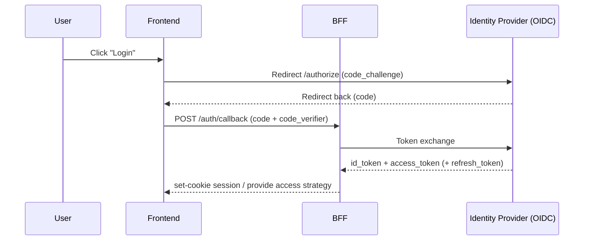
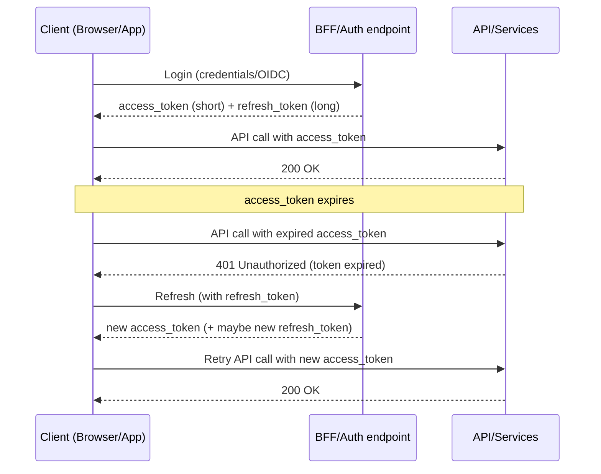
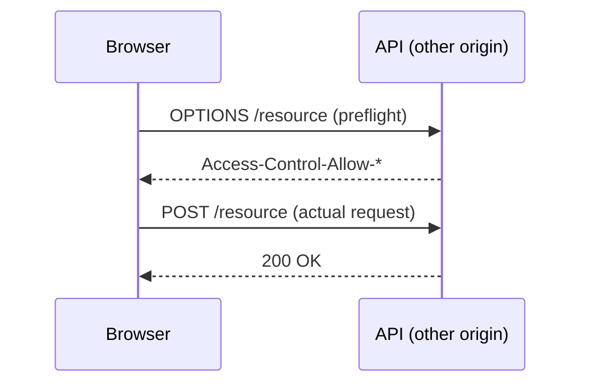

[← Назад к индексу части 30](index.md)

## 30.3 Аутентификация и авторизация

### Цель раздела

Построить ясную и практичную модель AuthN/AuthZ для fullstack‑архитектуры: какие бывают схемы (sessions/tokens), как устроен refresh flow, где хранить токены, как BFF влияет на CORS, и как правильно проверять права.

### В этом разделе главное

- **AuthN и AuthZ — разные задачи.** Ошибка в их разделении обычно приводит либо к уязвимости, либо к неудобному UX.
- Для веб‑клиента очень важно, **где хранится токен**: это напрямую связано с XSS/CSRF.
- **Refresh token flow** — это про управляемую долгую сессию без “вечного” access token.
- **Backend не должен доверять клиенту** в определении прав: проверка прав должна происходить на каждой операции на сервере.
- BFF часто упрощает CORS и безопасное хранение сессии (например, cookie для одного домена).

### Термины

| Термин | Коротко |
| --- | --- |
| **Session** | Сервер хранит состояние сессии (или ссылку на него), клиент хранит идентификатор (обычно cookie). |
| **JWT** | Токен (часто подписанный), который содержит claims и может проверяться без обращения к хранилищу (но не всегда “без состояния” на практике). |
| **OIDC** | Протокол поверх OAuth2 для login/identity (SSO, id_token). |
| **CSRF** | Атака, когда браузер автоматически отправляет cookie на ваш сайт, и злоумышленник провоцирует действие без согласия пользователя. |
| **XSS** | Инъекция JS на страницу: если токен доступен JS, его могут украсть. |
| **mTLS** | Взаимная аутентификация сертификатами (часто для сервис‑сервис). |

### Теория и правила

#### 1) AuthN: сессии vs токены (интуиция + формализация)

**Сессия (cookie‑based session)**:  
Интуиция — “у пользователя есть билетик (cookie), а сервер по нему знает, кто это”.

- клиент хранит cookie (желательно `httpOnly`, `Secure`, `SameSite`),
- сервер хранит состояние сессии (в памяти/redis/БД) или хотя бы “ревокацию”.

Плюсы:

- в браузере удобно,
- httpOnly cookie не доступна JS → меньше риск кражи токена при XSS,
- проще сделать “logout” (удалили сессию на сервере).

Минусы:

- нужен state на сервере (или инфраструктура),
- нужно понимать CSRF и правила SameSite,
- сложнее, если клиенты не браузерные (но решаемо).

**Токены (обычно JWT access token)**:  
Интуиция — “у пользователя есть пропуск, который он показывает на каждом входе”.

- клиент хранит access token и отправляет `Authorization: Bearer ...`,
- сервер проверяет подпись/срок/claims.

Плюсы:

- удобно для разных клиентов (mobile/desktop),
- хорошо ложится на API gateway и микросервисы,
- при правильной архитектуре проще масштабировать проверку.

Минусы:

- где хранить токен в браузере — сложный вопрос безопасности,
- “logout” сложнее (если токен живёт долго и нет ревокации),
- неправильная реализация refresh даёт уязвимости или плохой UX.

##### Проверь себя (30.3.1 — sessions vs tokens)

1. Почему “токены проще масштабировать” не означает, что они всегда проще для браузера?  
2. Что именно делает httpOnly cookie сильной защитой в сценарии XSS, и какой класс атак она не решает?  
3. Назови два признака, что вашей системе всё равно нужен серверный state, даже если вы “на JWT”.

<details><summary>Ответ</summary>

1. Потому что в браузере ключевой вопрос — безопасное хранение токена и модель CSRF/XSS. Токены удобны для разных клиентов, но для SPA усложняют безопасное хранение.  
2. Она не даёт JS прочитать cookie (уменьшает кражу секретов при XSS), но не решает CSRF и не заменяет проверки прав на сервере.  
3. Немедленный logout/отзыв, ротация refresh, управление устройствами/сессиями, блокировки при компрометации — всё это требует реестра/хранилища.

</details>

##### 1.1) OAuth2 и OIDC: где они здесь (без путаницы терминов)

План упоминает OAuth2/OIDC, и здесь важно не перепутать роли:

- **OAuth2** — про выдачу токенов доступа (делегирование доступа к API).  
- **OIDC (OpenID Connect)** — надстройка над OAuth2 про *идентификацию* пользователя (SSO, `id_token`).

Практическая картинка:

- “как войти” (логин/SSO) → чаще OIDC,
- “как ходить в API” → access token (OAuth2‑стиль).

##### Проверь себя (30.3.1.1 — OAuth2 vs OIDC)

1. Почему OIDC — это не “ещё один способ получить access token”, а отдельная часть про identity?  
2. Что потенциально пойдёт не так, если использовать `id_token` для вызовов API как bearer?  
3. Какой один вопрос поможет не перепутать, “какой токен где использовать”?

<details><summary>Ответ</summary>

1. Потому что OIDC добавляет проверяемую идентичность (id_token, SSO) поверх OAuth2. OAuth2 сам по себе про делегирование доступа, а не про login.  
2. `id_token` часто имеет другую audience и назначение, может быть не принят API или наоборот быть принят ошибочно; это риск безопасности и некорректной авторизации.  
3. “Кому предназначен этот токен?” (audience) и “что он должен доказывать?” (identity vs access).

</details>

##### 1.2) Authorization Code + PKCE: почему это стандарт для браузера/мобилки

Браузер и мобильное приложение считаются **публичными клиентами** (нельзя безопасно хранить секрет приложения как на сервере). Поэтому используют **PKCE**:

- клиент генерирует `code_verifier` (секрет на короткое время),
- отправляет `code_challenge` (хеш) в запрос авторизации,
- при обмене кода на токен доказывает владение `code_verifier`.

Простыми словами: PKCE снижает риск перехвата кода авторизации.

Диаграмма (упрощённо): OIDC login через BFF



Архитектурный смысл BFF в этом сценарии: централизовать политику (логирование, безопасность, refresh), а не раздавать “опасные секреты” по всему фронту.

##### Проверь себя (30.3.1.2 — Authorization Code + PKCE)

1. Почему браузер/мобилка считаются публичными клиентами, и как это влияет на выбор flow?  
2. Объясни PKCE в 1–2 фразах “для коллеги не из security”: что именно доказывается?  
3. Назови один практический плюс участия BFF в этом потоке и один практический риск.

<details><summary>Ответ</summary>

1. Потому что секрет приложения нельзя надёжно спрятать в клиенте. Поэтому нужен flow без client secret и с доказательством владения (PKCE).  
2. Клиент доказывает, что именно он инициировал авторизацию и владеет “временным секретом” (verifier), чтобы перехваченный код нельзя было обменять на токен.  
3. Плюс: меньше секретов в клиенте, единые политики refresh/логирования. Риск: BFF критичен (надёжность/латентность), усложняется инфраструктура.

</details>

#### 2) Где хранить токен в браузере: cookie httpOnly vs localStorage

Это одна из самых практичных “архитектурных развилок”.

**Cookie httpOnly**

- JS не может прочитать токен (защита от части XSS‑сценариев),
- браузер отправляет cookie автоматически.

Но:

- возникает тема CSRF (нужно защищать state‑changing запросы),
- нужно правильно настроить `SameSite`/`Secure`/домены.

**localStorage**

- проще “ручной контроль” отправки токена,
- меньше CSRF‑рисков, потому что токен не отправляется автоматически.

Но:

- при XSS токен легко украсть (JS читает localStorage),
- значит требования к XSS‑защите становятся намного строже.

Практическое правило (упрощённая эвристика):

- если это классическое веб‑приложение на одном домене — часто выбирают **httpOnly cookies** + CSRF‑защита;  
- если это набор разных клиентов (включая mobile) — часто выбирают **access token в памяти** + refresh через защищённый канал (см. ниже), но хранение в localStorage — осторожно и только с очень зрелой XSS‑защитой.

##### Проверь себя (30.3.2 — хранение токенов в браузере)

1. Почему localStorage часто “плохо по умолчанию” даже при аккуратном коде?  
2. Почему cookie‑подход обычно требует думать о CSRF, а bearer‑подход — о XSS?  
3. В каком сценарии “access token в памяти” может быть компромиссом, и какую проблему он создаёт (противоположную)?

<details><summary>Ответ</summary>

1. Потому что при XSS токен легко украсть: JS может прочитать localStorage. Это превращает XSS в компрометацию аккаунта.  
2. Cookie отправляются автоматически → CSRF‑риск. Bearer‑токен обычно доступен клиентскому коду → XSS‑риск.  
3. Компромисс — не хранить долгоживущий секрет в persistent storage. Проблема: после перезагрузки вкладки/страницы нужно заново восстановить access (через refresh/сессию), иначе UX ухудшится.

</details>

##### 2.1) Cookie‑атрибуты, которые реально влияют на безопасность

Если вы используете cookie для сессии или refresh‑механики, критично правильно выставить атрибуты:

- `HttpOnly` — JS не читает cookie (уменьшает риск кражи при XSS).  
- `Secure` — cookie отправляется только по HTTPS.  
- `SameSite`:
  - `Lax` — часто хороший дефолт (уменьшает CSRF‑риск, редко ломает UX),
  - `Strict` — максимально строго (может ломать некоторые переходы/SSO),
  - `None` — разрешает cross‑site, требует `Secure` (часто нужно для SSO, но повышает требования к CSRF‑защите).

Мини‑пример (идея):

```text
Set-Cookie: session=...; HttpOnly; Secure; SameSite=Lax; Path=/; Max-Age=...
```

##### Проверь себя (30.3.2.1 — cookie атрибуты)

1. Что именно даёт `HttpOnly`, и чего он не гарантирует?  
2. Почему `SameSite=None` почти всегда требует `Secure`, и чем это связано?  
3. Какой “дефолт” SameSite чаще всего разумен для обычного web‑приложения и почему?

<details><summary>Ответ</summary>

1. HttpOnly защищает от чтения cookie из JS (уменьшает кражу при XSS), но не защищает от CSRF и не заменяет серверную авторизацию.  
2. Потому что современные браузеры требуют Secure для cross‑site cookie (None), иначе cookie может быть заблокирована; плюс это снижает риск передачи по HTTP.  
3. Часто `Lax`: он уменьшает CSRF‑риск и редко ломает обычные сценарии.

</details>

##### 2.2) CSRF: почему появляется и что с этим делать (минимальный практичный набор)

Если cookie отправляется автоматически, то state‑changing запросы (POST/PUT/PATCH/DELETE) требуют CSRF‑защиты.

Два распространённых паттерна:

- **Synchronizer token**:
  - сервер выдаёт CSRF‑токен,
  - клиент отправляет его в заголовке (например `X-CSRF-Token`),
  - сервер проверяет совпадение.
- **Double submit cookie**:
  - CSRF‑токен хранится в cookie и дублируется в заголовке/теле,
  - сервер сравнивает.

Почти всегда это комбинируют с `SameSite` как дополнительной линией защиты.

##### Проверь себя (30.3.2.2 — CSRF)

1. Почему CSRF — это атака “через браузер пользователя”, и почему она появляется именно при cookie‑сессиях?  
2. Чем synchronizer token отличается от double submit cookie по “точке истины”?  
3. Назови один обязательный элемент проверки на сервере для state‑changing запросов, если вы используете cookie.

<details><summary>Ответ</summary>

1. Потому что браузер автоматически отправляет cookie на origin сайта, и злоумышленник может инициировать запрос через пользователя. Это не “кража токена”, а “выполнение действия от имени пользователя”.  
2. В synchronizer token истина хранится/проверяется на сервере (в сессии), в double submit истина — совпадение двух значений, присланных клиентом (cookie + header/body).  
3. Проверка CSRF‑токена (заголовок/поле) + проверка origin/referrer по политике, плюс корректный SameSite.

</details>

#### 3) Refresh token flow: как работает и зачем нужен

Интуиция:

- access token живёт недолго (например, 5–15 минут),
- refresh token живёт дольше (например, недели),
- если access истёк — клиент тихо получает новый access по refresh и продолжает работу.

Картинка в голове: два ключа

```text
Access = ключ на короткое время (если украли — ущерб ограничен)
Refresh = ключ "от сейфа" (его надо охранять сильнее)
```

Диаграмма: refresh flow (высокоуровнево)



**Ротация refresh токенов (важно для безопасности)**

Продакшен‑идея:

- при каждом refresh выдавать новый refresh token,
- старый помечать как использованный,
- если “старый внезапно снова пришёл” — это сигнал возможной компрометации.

Это требует хранилища на сервере (хотя бы списка refresh‑токенов/сессий).

##### Проверь себя (30.3.3 — refresh flow)

1. Почему refresh token по уровню риска ближе к “сессии”, чем к “обычному access token”?  
2. Что именно даёт ротация refresh токенов при компрометации, и какой сигнал она позволяет поймать?  
3. Какие два действия ты ожидаешь увидеть в дизайне “правильного logout”?

<details><summary>Ответ</summary>

1. Потому что он даёт долгий доступ через выпуск новых access токенов; если он украден, злоумышленник может продлевать доступ.  
2. Старый refresh становится одноразовым: если он внезапно используется повторно, это признак кражи/повторного использования. Можно заблокировать цепочку.  
3. Инвалидировать сессию/refresh на сервере и удалить/инвалидировать клиентскую cookie/маркер; плюс при необходимости отозвать “устройство/сессию” в реестре.

</details>

##### 3.1) Logout и отзыв: почему “настоящий logout” часто требует state

Если access token короткий — ущерб ограничен временем жизни. Но “logout прямо сейчас” обычно требует:

- удалить/инвалидировать сессию на сервере, или
- отозвать refresh токен (и связать его с устройством/сессией).

Если вы используете только “долгоживущий JWT без хранилища”, то “logout” чаще превращается в “подожди пока истечёт”.

##### Проверь себя (30.3.3.1 — logout/отзыв)

1. Почему “logout на клиенте” (стереть токен локально) не равен “logout в системе”?  
2. Назови один способ сделать logout мгновенным, и его цену (что вы добавляете в архитектуру).  
3. Какое последствие у схемы “нет отзыва, только TTL” для безопасности и поддержки?

<details><summary>Ответ</summary>

1. Потому что токен/сессия может оставаться валидной на сервере, и украденный токен продолжит работать. Клиентский logout не отменяет серверную валидность.  
2. Инвалидировать refresh/session в серверном хранилище (реестр сессий/refresh). Цена: появляется state и инфраструктура (хранилище, репликация, нагрузка).  
3. Компрометация живёт до истечения TTL, а пользователи/поддержка получают “почему меня не разлогинило” и “почему украденный токен работает”.

</details>

##### 3.2) Где хранить refresh в архитектуре с BFF (очень практичный паттерн)

Сильный и часто используемый паттерн для браузера:

- браузер получает **сессионную cookie** для BFF,
- BFF хранит refresh/сессию сервер‑стороной (или в защищённом хранилище),
- наружу в JS не выдаётся долгоживущий refresh‑секрет.

Простыми словами: BFF может “взять на себя” опасную часть хранения секретов.

##### Проверь себя (30.3.3.2 — где хранить refresh при BFF)

1. Почему хранение refresh “сервер‑стороной” снижает риск по сравнению с хранением в JS?  
2. Какой компромисс вы платите за этот паттерн (организационно/технически)?  
3. Назови один “контрактный” признак, что BFF действительно управляет сессией (а не просто прокидывает токены).

<details><summary>Ответ</summary>

1. Потому что refresh не доступен JS и сложнее украсть через XSS; клиент взаимодействует с BFF через cookie/сессию.  
2. Появляется state/хранилище сессий/refresh, нагрузка на BFF, требования к отказоустойчивости и наблюдаемости (BFF критичен).  
3. Например, наружу не отдаётся refresh‑секрет; есть эндпоинт refresh на BFF; logout реально инвалидирует сессию на сервере.

</details>

#### 4) Auth для сервис‑сервис (machine‑to‑machine): не путать с пользователем

План отдельно подчёркивает: сервис‑сервис auth — другой класс задач.

Варианты:

- **client credentials (OAuth2)** — сервис получает токен как клиент, без пользователя,
- **API keys** — просто секретный ключ (самый простой, но требует ротации и защиты),
- **mTLS** — сертификаты и доверие на уровне транспорта (часто в internal сетях).

Главная мысль:

- user‑context и service‑identity — разные, их нельзя смешивать “одним токеном на всё”.

##### Проверь себя (30.3.4 — service-to-service auth)

1. Почему client credentials токен нельзя трактовать как “пользователь вошёл”?  
2. В каком случае mTLS полезнее API key, и какую проблему он решает лучше всего?  
3. Какой один риск у API keys, если нет ротации и строгого хранения?

<details><summary>Ответ</summary>

1. Потому что он представляет сервис (клиент приложения), а не конкретного пользователя; у него другой смысл и другой набор прав.  
2. mTLS даёт сильную идентичность на уровне транспорта и взаимную аутентификацию; хорошо в внутренних сетях/межсервисных вызовах.  
3. Компрометация ключа даёт доступ “как сервис” до тех пор, пока ключ не заменят; часто тяжело обнаружить и отозвать без процессов.

</details>

#### 4.1) Передача контекста через границы: что именно прокидывать и где ломаются системы

План прямо включает “передача контекста: заголовки (Authorization); бекенд не доверяет клиенту в правах — проверка на каждом запросе”. Этот пункт кажется очевидным, но именно здесь рождаются самые неприятные баги и уязвимости.

**Контекст запроса** обычно включает:

- **кто пользователь** (AuthN): user id / subject (внутренний идентификатор),
- **какой клиент**: web/mobile, версия приложения (для безопасных миграций),
- **trace/correlation**: `trace_id`/`request_id`,
- **локаль/таймзона** (если влияет на ответы),
- иногда: tenant id (мульти‑тенантность), feature flags (осторожно).

Важно: контекст — это не “доверие”. Это данные для принятия решений на сервере, но права всё равно проверяются сервером.

##### Проверь себя (30.3.4.1 — контекст через границы)

1. Почему “прокинуть user id в заголовке” без криптографической защиты/валидации — уязвимость?  
2. Какие 3 элемента контекста чаще всего наиболее полезны для диагностики инцидентов?  
3. Почему tenant id — часть контекста, но не гарантия прав?

<details><summary>Ответ</summary>

1. Клиент может подделать заголовок. Без проверяемой аутентификации это превращается в подмену личности.  
2. `trace_id/request_id`, версия клиента, идентификатор пользователя/сессии (по политике) + результат авторизации (allowed/denied).  
3. Tenant id помогает маршрутизации/изоляции данных, но права на ресурс всё равно нужно проверять на сервере по реальным правилам.

</details>

##### 4.1.1) Два типовых способа “как клиент несёт идентичность” до бекенда

**Вариант A. Browser → BFF по cookie (сессия), BFF → сервисы server‑to‑server**

```mermaid
flowchart LR
  Br[Browser] -->|Cookie session| BFF[BFF]
  BFF -->|Service auth\n(m2m токен / mTLS)| S[Services]
  Note over Br,BFF: user-context хранится в сессии\n(или извлекается BFF-ом)
  Note over BFF,S: сервисы не доверяют браузеру,\nони доверяют BFF как сервису + проверяют права
```

Плюсы:

- у браузера меньше “опасных секретов” (часто нет refresh в JS),
- меньше CORS‑сложности (same‑origin),
- единый вход для политик.

Минусы:

- BFF становится критичным компонентом (SPOF‑риск, надо масштабировать и наблюдать).

##### Проверь себя (30.3.4.1.1 — два способа нести идентичность)

1. Почему для браузера вариант “cookie → BFF → server-to-server” часто проще с точки зрения безопасности?  
2. Почему вариант “Bearer из браузера” почти всегда возвращает вас к проблеме хранения токена?  
3. Назови одну причину, по которой в системе всё равно может понадобиться bearer‑токен даже при наличии BFF.

<details><summary>Ответ</summary>

1. Меньше секретов в JS, можно использовать httpOnly cookie и держать refresh/сессию на сервере; плюс проще same‑origin и меньше CORS‑головной боли.  
2. Потому что bearer нужно где‑то хранить/доставать в браузере, а значит появляется XSS‑риск и сложности с безопасным persistent storage.  
3. Нативные клиенты/партнёрские интеграции/внутренние сервисы могут использовать bearer для унификации доступа к API.

</details>

**Вариант B. Client → API с Authorization: Bearer (access token), BFF может быть опционален**

```text
Authorization: Bearer <access_token>
```

Плюсы:

- естественно для mobile/desktop,
- проще унифицировать доступ нескольких клиентов к одному API.

Минусы (для браузера):

- где хранить токен и как защищать от XSS — ключевая сложность.

##### 4.1.2) Token forwarding vs token exchange: почему “просто прокинуть токен дальше” не всегда правильно

Если у вас есть BFF и несколько внутренних сервисов, возникает вопрос:

- BFF должен **прокидывать** пользовательский токен в сервисы (forwarding)?
- или BFF должен **обменивать** его на сервисный токен (exchange / on‑behalf‑of)?

Архитектурная интуиция:

- **forwarding** проще, но внутренние сервисы начинают зависеть от формы/сроков/аудитории пользовательского токена;
- **exchange** сложнее, но позволяет:
  - сделать внутренние токены “под сервисы” (правильная `audience`),
  - ограничить scope,
  - добавить политику “что сервисам вообще нужно знать о пользователе”.

Здесь нет универсального ответа, но важно помнить два правила:

- **аудитория (audience)** токена должна соответствовать получателю (кому этот токен предназначен),
- **scope/claims** должны быть минимально достаточными (принцип наименьших привилегий).

##### Проверь себя (30.3.4.1.2 — forwarding vs exchange)

1. Почему неверная `audience` токена — это не “мелочь”, а риск безопасности?  
2. В чём обмен токена (exchange) помогает соблюдать принцип наименьших привилегий?  
3. Приведи пример, когда forwarding уместен, и пример, когда лучше exchange.

<details><summary>Ответ</summary>

1. Потому что токен может быть принят не тем сервисом или использоваться не по назначению; это открывает путь к несанкционированному доступу и “confused deputy”.  
2. Можно выдать внутренний токен с минимальным scope именно для конкретного сервиса/операции, не раскрывая лишние claims всем downstream.  
3. Forwarding: один сервис‑провайдер и простой стек, где audience совпадает. Exchange: много сервисов, разные audience, нужен ограниченный scope и изоляция.

</details>

##### 4.1.3) Что нельзя логировать и “почему это архитектура”

Базовое правило: **никогда не логируй секреты и токены**.

Не логировать:

- `Authorization` заголовки,
- refresh/access tokens,
- пароли, OTP,
- PII (если нет явного основания и политики).

Логировать можно (и полезно):

- `trace_id`/`request_id`,
- “исход” авторизации (allowed/denied),
- идентификаторы пользователя/сессии в безопасной форме (по политике),
- тип клиента и версию (для диагностики).

Идея: безопасность и диагностика — часть архитектуры границы, а не “внутренности логгера”.

##### Проверь себя (30.3.4.1.3 — что логировать нельзя)

1. Почему логирование `Authorization` опасно даже во “внутренних” логах?  
2. Что можно логировать вместо токена, чтобы сохранить диагностируемость?  
3. Приведи пример, как “слишком подробные логи” могут стать инцидентом сами по себе.

<details><summary>Ответ</summary>

1. Логи часто доступны шире, чем прод‑сервисы; утечка логов = утечка токенов. Плюс токены могут жить в логах дольше TTL.  
2. `trace_id`, user/session id в безопасной форме, результат auth (allowed/denied), причины отказа в виде кода, версия клиента.  
3. Утечка PII/секретов в систему логирования или в BI/экспорты; это юридический и security инцидент.

</details>

#### 5) CORS и архитектура: когда BFF “снимает” CORS

CORS — это ограничение **браузера**, а не “проблема HTTP”.

Если у тебя:

- фронт на `https://app.example.com`,
- API сервисов на `https://api.internal.example.com`,

то браузер будет делать кросс‑доменные запросы и потребует CORS‑заголовки, preflight и т.п.

Если же клиент ходит только на BFF:

- `https://app.example.com/api/*` → BFF,
- а BFF уже ходит server‑to‑server к внутренним сервисам,

то для браузера это один origin, и CORS для внутренних сервисов “уходит внутрь” (клиент его не видит).

Практическая диаграмма:

```mermaid
flowchart LR
  Browser[Браузер] -->|same-origin https://app.example.com/api| BFF[BFF]
  BFF -->|server-to-server| S[Internal Services]
  Note over Browser,BFF: CORS не нужен (для браузера)
  Note over BFF,S: CORS не применяется (не браузер)
```

Важно: это не “обход безопасности”, а упрощение модели. Но ответственность за безопасность не исчезает: BFF должен правильно валидировать, логировать, защищаться от атак.

##### Проверь себя (30.3.5 — CORS и роль BFF)

1. Почему CORS “не существует” для server‑to‑server вызовов?  
2. Как BFF может “снять” CORS‑сложность для браузера, не снижая безопасность?  
3. Что будет, если случайно открыть CORS “на всё” (`*`) для запросов с cookie?

<details><summary>Ответ</summary>

1. Потому что CORS — ограничение браузера. Серверы не применяют CORS‑политику так, как браузер.  
2. Сделать клиентские запросы same‑origin к BFF, а дальше BFF ходит во внутренние сервисы; при этом BFF остаётся точкой валидации/auth/логирования.  
3. Это может открыть CSRF‑подобные сценарии и утечки (браузеры ограничивают `*` с credentials, но неправильная конфигурация приводит к серьёзным уязвимостям).

</details>

##### 5.1) Preflight простыми словами: почему “вдруг появился OPTIONS”

Браузер иногда делает “пробный” запрос `OPTIONS` (preflight), чтобы проверить, разрешено ли реальное действие.

Это происходит, когда запрос “не простой”, например:

- нестандартные заголовки,
- методы PUT/DELETE,
- некоторые комбинации `Content-Type` и заголовков.

Картинка:



Почему это важно архитектору:

- preflight добавляет латентность,
- часто ломается из‑за неверных заголовков,
- same‑origin через BFF убирает целый класс таких проблем для браузера.

##### Проверь себя (30.3.5.1 — preflight/OPTIONS)

1. Почему preflight “внезапно добавляет latency”, даже если ваш API быстрый?  
2. Назови два типовых триггера preflight (какие свойства запроса заставляют браузер делать OPTIONS).  
3. Как наличие BFF на same‑origin меняет необходимость CORS/preflight для браузера?

<details><summary>Ответ</summary>

1. Потому что перед реальным запросом идёт дополнительный round‑trip OPTIONS, а это задержка сети + обработка на сервере.  
2. Нестандартные заголовки, методы PUT/DELETE (и другие “непростые”), некоторые `Content-Type` (например `application/json` с кастомными заголовками).  
3. Если браузер обращается к BFF на том же origin, CORS/preflight для внутренних сервисов не участвует в клиентском пути: дальше это server‑to‑server.

</details>

#### 6) AuthZ: где и как проверять права

Ключевая формула:

**UI может “прятать кнопки”, но права проверяет сервер.**

Авторизация обычно делается:

- на уровне API (middleware, guards),
- на уровне BFF (как дополнительный слой), если BFF агрегирует и должен фильтровать данные.

Модели:

- **RBAC**: роли → права (простая и популярная),
- **ABAC**: атрибуты пользователя/ресурса/контекста → решение (гибче, сложнее).

Очень важный частный случай: **права на ресурс**.

Не достаточно “роль admin”.
Нужно проверять: может ли пользователь X читать/менять **конкретный заказ Y**?

Простая “картинка” проверки:

```text
Request: GET /orders/123
Server:
  - кто пользователь? (AuthN)
  - имеет ли он право видеть order 123? (AuthZ on resource)
  - только потом отдаём данные
```

##### Проверь себя (30.3.6 — авторизация)

1. Почему “спрятали кнопку” не является авторизацией? Что должен уметь сервер “в любом случае”?  
2. Приведи пример “права на ресурс”, которое не выражается одной ролью.  
3. Почему BFF может фильтровать данные, но не должен быть единственной точкой проверки прав?

<details><summary>Ответ</summary>

1. Потому что запрос можно выполнить напрямую (через DevTools/скрипт). Сервер обязан проверять права на каждой операции.  
2. “Пользователь видит только свои заказы”: нужен `ownerId == userId`. Или “менеджер региона видит только свой регион”.  
3. Иначе права и инварианты рассинхронизируются с доменным сервисом; появятся уязвимости при обходе BFF или при ошибке в BFF‑логике.

</details>

### Пошагово: как спроектировать auth на границе (минимально безопасный вариант)

1) Выбери модель: sessions или tokens, исходя из клиентов (browser only vs many clients).  
2) Определи, где хранится access/refresh и как защищены:

- cookie httpOnly + SameSite + CSRF,
- или другой вариант с учётом XSS‑угроз.

3) Сделай access токены короткими, а refresh — защищённым и ревокуемым.  
4) Определи, где проверяется авторизация:

- минимум: в доменном API на каждой операции,
- дополнительно: в BFF для фильтрации/агрегации.

5) Привяжи наблюдаемость:

- не логировать токены/пароли,
- логировать trace_id + user_id (если допустимо) + outcome (allowed/denied),
- различать 401 (не аутентифицирован) и 403 (нет прав).

#### Проверь себя (30.3 — пошаговый дизайн auth)

1. Почему пункт “401 vs 403” важен не только для UX, но и для расследования инцидентов?  
2. Какие два решения в этом списке напрямую зависят от того, есть ли у вас BFF?  
3. Придумай минимальный набор логов/метрик, которые помогут найти проблему auth без логирования токенов.

<details><summary>Ответ</summary>

1. 401 означает проблему аутентификации (нет/истёк токен), 403 — аутентификация есть, но нет прав. Это ускоряет диагностику и предотвращает неправильные ретраи/UX.  
2. Хранение refresh/сессии (BFF может взять на себя), и дополнительная авторизация/фильтрация на уровне BFF для агрегированных ответов.  
3. `trace_id`, outcome (allowed/denied + код причины), user/session id в безопасной форме, latency/ошибки, счётчик 401/403 по endpoint и по версии клиента.

</details>

### Простыми словами

Аутентификация — “кто ты”, авторизация — “что тебе можно”. В браузере самое опасное — хранение токена там, где его может прочитать вредный JS. Поэтому вы либо защищаете токен (httpOnly cookie), либо крайне серьёзно относитесь к XSS.

#### Проверь себя (30.3 — простыми словами)

1. Почему эта часть постоянно возвращает к хранению токена как к “архитектуре”, а не к “детали фронта”?  
2. Какой риск добавляется, если вы выбираете cookie‑схему, и какая компенсация обычно нужна?  
3. Что значит “сервер проверяет права всегда”, даже если UI всё скрывает?

<details><summary>Ответ</summary>

1. Потому что способ хранения определяет поверхность атак (XSS/CSRF), UX (refresh/logout) и необходимость state на сервере.  
2. Риск CSRF; нужна защита SameSite + CSRF‑токены/проверки origin.  
3. Любой запрос можно послать напрямую; сервер обязан проверять AuthZ на каждой операции и на каждом ресурсе.

</details>

### Типичные ошибки

- **Доверять клиенту в вопросе прав** (“если кнопки нет — значит нельзя”) → уязвимость.  
- **Хранить чувствительные токены в localStorage “по привычке”** без понимания XSS‑риска.  
- **Делать access token “вечным”** → украли токен — доступ надолго.  
- **Не различать 401 и 403** → сложная диагностика и неправильный UX.  
- **Логировать токены/PII** → утечки через логи (часто это самые дорогие инциденты).  

#### Проверь себя (30.3 — типичные ошибки)

1. Какая ошибка здесь чаще приводит к прямой уязвимости, а какая — к “невидимой” долгой компрометации?  
2. Почему неразличение 401/403 ухудшает безопасность/UX одновременно?  
3. Назови один признак, что токены “утекают” через логи (как это может проявиться).

<details><summary>Ответ</summary>

1. Прямая уязвимость: доверять клиенту в правах. Долгая компрометация: вечный access или слабый refresh без отзыва.  
2. Клиент может делать неправильные действия (например, пытаться refresh при 403), а расследование путает проблему токена и проблему прав.  
3. Появление токеноподобных строк в логах/алертах, утечки в системы аналитики, доступы по логам к аккаунтам при компрометации лог‑хранилища.

</details>

### Что будет, если…

- …access token живёт долго и нет ревокации?  
  Украденный токен даёт долгий доступ, и “logout” не помогает.
- …refresh токен хранится так же слабо, как access?  
  Тогда смысл “короткого access” теряется: злоумышленник просто обновит себе доступ снова и снова.

#### Проверь себя (30.3 — что будет если)

1. Почему “долгий access без ревокации” делает incident response почти невозможным?  
2. Какая минимальная защита должна быть у refresh по сравнению с access?  
3. Какое следствие для UX и поддержки, если logout не может работать мгновенно?

<details><summary>Ответ</summary>

1. Потому что вы не можете быстро остановить доступ злоумышленника: остаётся ждать TTL.  
2. Более защищённое хранение, ротация и отзыв (серверный реестр/сессии).  
3. Пользователь не доверяет системе (“вышел, но всё ещё работает”), поддержка получает обращения, а безопасность не может “закрыть” сессию.

</details>

### Проверь себя

1. Почему cookie httpOnly снижает риск кражи токена при XSS, но добавляет тему CSRF?  
2. Зачем access token делать коротким, если всё равно есть refresh?  
3. Приведи пример “права на ресурс” и объясни, почему RBAC “по ролям” может быть недостаточно.

<details><summary>Ответ</summary>

1. Потому что JS не читает httpOnly cookie, но браузер автоматически отправляет cookie на ваш домен — это может быть использовано CSRF‑атакой для state‑changing запросов, если нет защиты (SameSite/CSRF token).  
2. Чтобы ограничить ущерб при компрометации access token. Refresh должен храниться/защищаться сильнее, и его можно отзывать/ротировать.  
3. Например: “пользователь может видеть только свои заказы”. Роль `user` есть у всех, но доступ должен зависеть от `order.ownerId == user.id` — это ресурсная проверка.

</details>

##### 6.1) RBAC vs ABAC: маленький пример, который делает разницу очевидной

RBAC отвечает на вопрос “какая роль у пользователя”, и это хорошо работает для грубых прав. Но в реальности часто нужны правила вида:

- “пользователь видит только **свои** заказы”,
- “менеджер региона видит заказы только **своего региона**”,
- “в ночь нельзя делать возвраты”.

Это уже ABAC: решение зависит от атрибутов пользователя/ресурса/контекста.

Простыми словами: RBAC — “кто ты”, ABAC — “подходит ли тебе этот ресурс сейчас”.

##### Проверь себя (30.3.6.1 — RBAC vs ABAC)

1. Почему RBAC часто недостаточен для “права на ресурс”?  
2. Приведи пример ABAC‑правила, которое зависит от времени/контекста.  
3. Какой риск появляется, если пытаться “впихнуть ABAC в RBAC” через десятки ролей?

<details><summary>Ответ</summary>

1. Потому что “роль” не учитывает конкретный ресурс (владелец/регион/tenant). Нужны атрибуты ресурса и пользователя.  
2. Например: “возвраты запрещены ночью” или “доступ к скидке только при определённом статусе заказа”.  
3. Взрыв ролей, сложность сопровождения и ошибки конфигурации, которые ведут к уязвимостям или отказам доступа.

</details>

##### 6.2) Где проверять авторизацию, если есть BFF

Практичное правило:

- **источник истины** по правам должен быть в доменном сервисе (там, где данные и инварианты).  
- BFF может дополнительно фильтровать/агрегировать, но не должен быть единственным местом проверки, иначе появится риск рассинхрона и уязвимостей.

##### Проверь себя (30.3.6.2 — где проверять права при BFF)

1. Почему доменный сервис — “источник истины” по правам?  
2. Какую полезную роль всё же может играть BFF в авторизации, не нарушая принципа источника истины?  
3. Приведи пример инцидента, который возможен, если авторизация только в BFF.

<details><summary>Ответ</summary>

1. Потому что там данные и инварианты: только доменный сервис знает истинные условия доступа к ресурсу и может гарантировать их на каждой операции.  
2. Фильтровать/скрывать части агрегированного ответа по уже проверенным правам, собирать данные только из разрешённых источников, но не “решать права вместо домена”.  
3. Если появился прямой путь к сервису (или новый клиент) — обход BFF даёт доступ без проверок; или BFF и сервис расходятся по правилам и открывают “дыру”.

</details>

### Запомните

- AuthN ≠ AuthZ.  
- Сервер проверяет права на каждой операции, UI — только улучшает UX.  
- В браузере безопасность сильно зависит от хранения токена и защиты от XSS/CSRF.  
- Refresh flow — стандартный путь к удобной и управляемой сессии.

---
