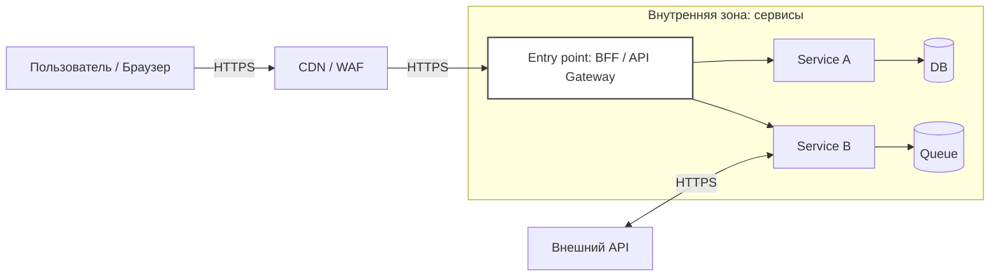

[← Назад к индексу части 31](index.md)

## 31.1 Безопасность в архитектуре

### Цель раздела

Понять безопасность как **архитектурное свойство**: где проходят **границы доверия**, почему “доверять нельзя по умолчанию”, и какие решения системно уменьшают риски (а не “закрывают одну дыру”).

### В этом разделе главное

- **Безопасность начинается с границ доверия.** Любой вход — потенциально враждебен (или просто ошибочен).
- **Zero Trust** — это “проверяем каждый вызов”, а не “ставим больше firewall’ов”.
- **Минимизируй поверхность атаки** и **привилегии**: меньше открытого, меньше прав, меньше ущерб при компрометации.
- **Не логируй секреты и PII**. “Удобно дебажить” ≠ “безопасно”.

### Термины

| Термин | Коротко |
| --- | --- |
| **Threat model** | Список угроз и защит: “кто атакует, как, что защищаем”. |
| **Trust boundary** | Граница, где данные и идентичность должны быть проверены. |
| **Zero Trust** | Нельзя доверять “потому что внутри”; доверяем после проверки. |
| **PoLP** | Минимально необходимые привилегии. |
| **PII** | Персональные данные (имя, телефон, email, паспорт и т.п.). |
| **CSP** | Content Security Policy — политика, уменьшающая риск XSS в браузере. |
| **Rate limiting** | Ограничение частоты запросов для защиты от злоупотреблений и атак. |

### Теория и правила

#### 1) Интуиция: “где система соприкасается с миром”

Представь систему как дом. Даже если внутри всё красиво, проблемы начинаются там, где:

- **дверь** (входной API),
- **окна** (админки, интеграции),
- **коммуникации** (сеть, межсервисные вызовы),
- **кладовка** (секреты, ключи),
- **журнал посещений** (логи и аудит).

Безопасность — это не “один замок”, а набор решений вокруг точек входа и доверия.

Схема “где границы” в типичном продакшене:



**Где здесь границы доверия?**  
Очевидная — вход на `ENTRY` (BFF/API Gateway). Но есть и другие:

- сервис ↔ сервис (если у вас микросервисы),
- сервис ↔ БД,
- сервис ↔ внешние API,
- админские операции (особый “вход”),
- фоновые джобы/очереди (сообщение тоже входные данные!).

##### Проверь себя (31.1 — 1)

1. Почему “очередь/сообщение” — это тоже граница доверия, даже если очередь внутри кластера?  
2. Назови два примера “невидимой границы”, которую часто забывают (кроме публичного API).  
3. В чём практический смысл “нарисовать границы” перед тем, как внедрять защитные меры?

<details><summary>Ответ</summary>

1. Потому что payload сообщения — это входные данные, которые могут быть ошибочными/вредоносными, а источник может быть компрометирован или просто работать неправильно. “Внутренняя очередь” не делает данные автоматически безопасными.
2. Админские панели/служебные эндпоинты; межсервисные вызовы; интеграции с внешними провайдерами; фоновые джобы/CRON.
3. Потому что безопасность — это “меры на границах”. Без карты границ вы либо защищаете не то, либо оставляете дыры (например, закрыли публичный API, но забыли админку или очередь).

</details>

#### 2) Границы доверия: формализация

**Граница доверия** — это место, где система должна:

1) **опознать, кто пришёл** (аутентификация: user/service),  
2) **решить, что ему можно** (авторизация),  
3) **проверить данные** (валидация/санитизация),  
4) **записать след** (аудит/логирование без секретов),  
5) **ограничить ущерб** (rate limiting, quotas, timeouts).

Важно: “валидация на фронте” — это про UX, но **не про безопасность**. Безопасность начинается на серверной границе.

##### Проверь себя (31.1 — 2)

1. Чем “валидация на фронте” полезна, и почему она не закрывает безопасность?  
2. Какие два пункта из списка (identity/права/валидация/аудит/ограничение ущерба) чаще всего пропускают в реальных проектах — и к чему это приводит?  
3. Приведи пример “ограничения ущерба” на границе, который не является авторизацией.

<details><summary>Ответ</summary>

1. Она улучшает UX (быстрее показать ошибку), но пользовательский клиент контролируется пользователем: запрос можно отправить “в обход” UI. Поэтому сервер обязан валидировать и защищать сам.
2. Часто пропускают аудит (потом невозможно расследовать) и ограничения ущерба (rate limiting/timeouts — потом легко получить каскадный сбой или brute force). Иногда пропускают строгую авторизацию (“проверили токен — значит можно”).
3. Rate limiting/quotas, строгие таймауты на внешние вызовы, ограничение размера payload, ограничение параллелизма, WAF‑правила.

</details>

#### 3) Zero Trust: простое правило и следствия

**Простое правило Zero Trust:** “доверие не наследуется от сети; оно выдаётся после проверки”.

Следствия для архитектуры:

- сервис‑сервис вызовы должны быть **аутентифицированы** (например mTLS, JWT для сервисов, API keys) и **авторизованы**;
- “внутренний” сервис не должен иметь “бог‑доступ” ко всем данным;
- сегментация: даже внутри кластера должны быть **политики** (network policies, RBAC);
- аудит: “кто читал персональные данные” — должен быть фактом, а не догадкой.

##### Проверь себя (31.1 — 3)

1. Почему Zero Trust — это не “про firewall”, а про архитектурные правила на границах?  
2. Что плохого в подходе “у нас микросервисы внутри кластера, значит можно доверять”? Назови два сценария.  
3. Как Zero Trust влияет на дизайн сервис‑сервис вызовов (что должно появиться в протоколе/инфре)?

<details><summary>Ответ</summary>

1. Потому что он требует проверки identity/прав на каждом переходе ответственности, а не “разового периметра”. Это меняет API, auth, наблюдаемость, политики доступа.
2. Компрометация одного сервиса (утек ключ/уязвимость) позволяет lateral movement; ошибка конфигурации/секретов даёт “бог‑доступ”; инсайдер/внутренний злоумышленник.
3. Появляется сервисная аутентификация (mTLS/сервисные токены), авторизация по ролям/политикам, ограничение сетевого доступа (network policies), аудит и корреляция запросов.

</details>

#### 4) Минимизация поверхности атаки

Это почти всегда даёт больше эффекта, чем “сложная криптография”:

- не публиковать внутренние сервисы наружу (прячем за gateway/BFF);
- закрывать админки (VPN, отдельный домен, MFA, allow‑list);
- отключать лишние порты/эндпоинты;
- делать явный “вход” (одна точка, где применяются политики).

##### Проверь себя (31.1 — 4)

1. Почему “уменьшить поверхность атаки” часто эффективнее, чем “добавить ещё один сложный механизм защиты”?  
2. Приведи пример “лишнего” входа, который обычно появляется случайно.  
3. Что будет, если внутренние сервисы станут доступны из интернета напрямую (мимо gateway/BFF)?

<details><summary>Ответ</summary>

1. Потому что меньше входов = меньше мест, где можно ошибиться, меньше кода/конфигурации, меньше неучтённых путей атаки. Это снижает риск системно.
2. Debug endpoint, временная админка, “временный” порт для health/debug, прямой доступ к сервису через Ingress без аутентификации.
3. Потеряется единая точка политик (auth/rate limiting/audit), возрастёт риск обхода проверок, увеличится поверхность атаки и вероятность утечек/сканирования.

</details>

#### 5) Принцип наименьших привилегий (PoLP)

Вопрос для каждого компонента:

> “Какие **минимальные** права нужны, чтобы выполнить задачу?”

Примеры:

- сервис чтения каталога не должен уметь удалять пользователей;
- джоба, которая шлёт письма, не должна иметь права на таблицу платежей;
- токен пользователя не должен “по умолчанию” быть админским.

##### Проверь себя (31.1 — 5)

1. Почему PoLP полезен даже если “все сервисы наши и команда маленькая”?  
2. Приведи пример PoLP на уровне БД и на уровне API (два разных примера).  
3. Что случится при компрометации сервиса, если он имеет “широкие права по умолчанию”?

<details><summary>Ответ</summary>

1. Потому что ошибки и компрометации случаются независимо от размера команды; PoLP ограничивает ущерб и радиус поражения.
2. БД: отдельный DB‑user с правами только на свои таблицы/операции. API: сервисный токен с доступом только к нужным эндпоинтам (например, чтение каталога, но не управление пользователями).
3. Компрометация превращается в “доступ ко всему”: утечка данных, удаление/изменение критичных сущностей, эскалация прав и быстрый lateral movement.

</details>

#### 6) Защита данных: TLS, секреты, логи

**Шифрование при передаче (TLS)** — обязательная базовая вещь для внешних и (в идеале) внутренних вызовов.  
**Шифрование в покое** — защита дисков/хранилищ и резервных копий.

**Секреты** (ключи, токены, пароли):

- не живут в коде и репозитории,
- не живут в логах,
- должны иметь ротацию и ограниченные права,
- хранятся в секрет‑хранилищах (vault/secret manager).

**Логи**:

- полезны для расследования, но опасны для утечек;
- правило: “логируем то, что поможет расследовать, но не раскрывает чувствительное”.

##### Проверь себя (31.1 — 6)

1. Почему “секреты не в коде” — это архитектурное требование, а не просто “хороший тон”?  
2. Назови два риска, если логировать токены/PII “временно, чтобы починить”.  
3. Какие два свойства должны быть у секретов, чтобы они “жили” безопасно в эксплуатации?

<details><summary>Ответ</summary>

1. Потому что код/репозиторий копируется, форкается, кэшируется, читается многими людьми и системами; секрет в коде трудно ротировать и легко утечь. Архитектурно секреты должны управляться отдельно.
2. Логи размножаются (агрегация, бэкапы) и живут долго → утечка даёт прямой доступ; трудно гарантировать удаление; компрометация может быть незаметной.
3. Ограниченные права (least privilege) и ротация (возможность быстро заменить/отозвать). Плюс контроль доступа и аудит.

</details>

#### 7) Типовые атаки и где их “ловить” в архитектуре

Ниже — важно не “выучить список”, а **понять, где ставится защита**.

1) **Инъекции** (SQL/NoSQL/command):
   - защита: параметризованные запросы, ORM правильно, валидация входа, запрет конкатенации SQL.
2) **XSS** (браузер):
   - защита: экранирование, санитизация, **CSP**, httpOnly cookies для токенов (уменьшают ущерб XSS).
3) **CSRF** (браузер + cookies):
   - защита: SameSite cookies, CSRF‑токены, проверка Origin/Referer для опасных методов, “double submit”.
4) **Brute force** (подбор):
   - защита: rate limiting, капча/многофакторка, блокировки/замедление, отдельные лимиты на логин/сброс пароля.
5) **DDoS / злоупотребление API**:
   - защита: WAF/CDN, rate limiting, quotas, “защита на входе” до дорогой логики.

##### Проверь себя (31.1 — 7)

1. Почему защита от XSS во многом “живет” на фронте, но последствия часто “долетают” до бекенда?  
2. Чем отличается защита от DDoS на входе (CDN/WAF) от rate limiting внутри сервиса по смыслу и эффекту?  
3. Приведи пример, когда CSRF актуален, и пример, когда он почти не актуален (и почему).

<details><summary>Ответ</summary>

1. XSS даёт злоумышленнику возможность исполнять JS в контексте пользователя → украсть данные/делать действия от его имени, взаимодействовать с API. Поэтому архитектура хранения токенов, политики CSP и серверные проверки всё равно важны.
2. CDN/WAF режет трафик “дешево” на периметре и защищает пропускную способность. Внутрисервисный лимит точнее по домену, но запрос уже потребил ресурсы сервиса.
3. Актуален при cookie‑based сессиях (браузер автоматически отправляет cookie). Менее актуален при строго `Authorization: Bearer` без cookies (но всё равно есть нюансы в зависимости от архитектуры и хранения токенов).

</details>

#### 7.1) Brute force на практике: где размещать защиту (и почему “в одном месте” недостаточно)

Глобальный план просит отдельно проговорить “где размещать” защиту от перебора. Тут важна архитектурная логика: **что отсекаем как можно раньше**, но при этом **сохраняем точность там, где нужно**.

Варианты (и как думать):

1) **На входе (CDN/WAF/API Gateway/BFF)**  
   - что даёт: дешёвое отсечение до дорогой бизнес‑логики; защита от “заливок” по сети  
   - минус: сложно корректно идентифицировать пользователя (IP за NAT, мобильные сети), риск false positive  
   - практика: лимит по IP/ASN + лимит по “ключу” (например, login/email) + отдельные лимиты на endpoints логина/сброса

2) **Внутри auth‑компонента (BFF или отдельный auth‑сервис)**  
   - что даёт: более точная логика (учёт пользователя, устройства, риска), возможность “мягкой” защиты (замедление, step‑up MFA)  
   - минус: запрос уже дошёл до сервиса (дороже), но зато точнее

3) **Комбинация (обычно лучший компромисс)**  
   - “грубый фильтр” на входе (чтобы не умереть от трафика)  
   - “умный фильтр” в auth‑логике (чтобы не ломать легитимных пользователей)

Тонкий, но важный момент: **блокировка аккаунта** — опасная мера, потому что её можно использовать как атаку (“заблокировать жертву”). Часто лучше:

- замедление (progressive delay),
- капча после N попыток,
- step‑up аутентификация,
- алерты/аудит на аномалии.

##### Проверь себя (31.1 — 7.1)

1. Почему блокировка аккаунта может стать вектором атаки (и что вместо этого часто делают)?  
2. В каких случаях “лимит по IP” даёт много false positive?  
3. Что даёт комбинация “грубый фильтр на входе + умная логика в auth”, чего не даёт один слой?

<details><summary>Ответ</summary>

1. Злоумышленник может “заблокировать” жертву, специально делая неверные попытки. Вместо этого применяют progressive delay, step‑up MFA, капчу и риск‑скоринг.
2. NAT (много пользователей за одним IP), мобильные сети, корпоративные прокси, shared Wi‑Fi — легитимные пользователи могут попасть под общий лимит.
3. Входной слой защищает доступность от массового трафика, а auth‑слой защищает корректность и UX (точная идентификация, мягкие меры, меньше ложных блокировок).

</details>

#### 8) Аудит в архитектуре: “технические логи” vs “аудит‑лог”

В плане части 31 отдельно подчёркнуто, что безопасность — это не только “защититься”, но и **уметь доказать, что происходило** (аудит доступа к чувствительным операциям, соответствие регуляторике).

Частая путаница: команда говорит “у нас же есть логи”, имея в виду **технические логи приложения**, но аудит‑задачи ими часто не закрываются.

**Технический лог** отвечает на вопрос “что происходило в коде/инфраструктуре”:

- ошибки, стеки, таймауты,
- технические события (подключились к БД, открыли breaker),
- дебаг‑контекст.

**Аудит‑лог** отвечает на вопрос “кто (identity) сделал какое действие (action) над каким объектом (resource) и с каким результатом (outcome)”:

- доступ к персональным данным,
- изменения прав и ролей,
- финансовые операции (создание/отмена),
- админские действия.

Практическое правило: **аудит‑лог должен быть устойчив к подмене и “по возможности неизменяем”** (append‑only), иметь ретеншн, и быть пригодным для расследований и проверки соответствия.

Минимальная структура audit‑записи (пример, упрощённо):

```json
{
  "timestamp": "2026-03-17T12:34:56.789Z",
  "event_type": "pii_read",
  "actor_type": "user",
  "actor_id": "u_12345",
  "action": "read",
  "resource_type": "customer_profile",
  "resource_id": "c_999",
  "scope": "support_screen",
  "outcome": "success",
  "trace_id": "4bf92f3577b34da6a3ce929d0e0e4736",
  "ip": "203.0.113.10"
}
```

Важно:

- audit‑лог **не должен** включать “сырые” токены/пароли;
- audit‑лог **должен** позволять ответить: “кто видел/менял данные” и “когда”;
- audit‑лог **должен** быть связан с наблюдаемостью (через `trace_id`), чтобы расследование не было “двумя отдельными мирами”.

##### Проверь себя (31.1 — 8)

1. Почему технических логов недостаточно для аудита “кто смотрел персональные данные”?  
2. Назови минимальные поля audit‑лога, без которых расследование почти невозможно.  
3. Почему audit‑лог часто делают append‑only и с отдельной политикой доступа?

<details><summary>Ответ</summary>

1. Техлоги описывают “что делал код”, но не гарантируют фиксирование акторов/действий/ресурсов и могут быть неполными/шумными. Аудит требует юридически/операционно значимой записи “кто‑что‑над чем”.
2. Время, actor (кто), action (что сделал), resource (над чем), outcome (успех/ошибка). Полезно добавить trace_id для связи с расследованием.
3. Чтобы снизить риск подмены/удаления следов и ограничить круг лиц, имеющих доступ к чувствительным событиям. Аудит часто нужен для регуляторики и пост‑фактум разборов.

</details>

#### 9) Мини‑алгоритм: как делать threat model (без паранойи и без бюрократии)

Threat modeling легко превратить либо в “огромный документ, который никто не читает”, либо в “ничего не делаем”. Для практики полезен простой 20‑минутный ритуал перед внедрением новой границы/фичи.

1) **Активы**: что защищаем (деньги, PII, доступ, репутация, доступность).  
2) **Акторы**: кто атакует (случайный злоумышленник, конкурент, инсайдер, компрометированный сервис).  
3) **Входы**: где границы (эндпоинты, интеграции, админка, очередь).  
4) **Риски**: что будет, если получится (утечка, списание денег, остановка сервиса).  
5) **Меры**: что делаем на границе (authz, валидация, rate limiting, аудит, TLS).  
6) **Проверка наблюдаемости**: можем ли мы заметить и расследовать (логи/метрики/трейсы/аудит).

##### Проверь себя (31.1 — 9)

1. Почему в threat model важно начинать с “активов”, а не с “списка атак”?  
2. Какая польза от пункта “проверка наблюдаемости” прямо внутри threat model?  
3. Приведи пример “меры”, которая выглядит как защита, но без наблюдаемости превращается в проблему.

<details><summary>Ответ</summary>

1. Потому что защита зависит от того, что мы реально защищаем (деньги/PII/доступность). Без активов легко переусложнить или пропустить критичное.
2. Если вы не можете заметить атаку/злоупотребление, вы узнаёте о нём слишком поздно. Наблюдаемость — часть безопасности: “заметить и расследовать”.
3. Rate limiting/блокировки без метрик и логов: пользователи жалуются, а команда не понимает, кого и почему режет; breaker без метрик — “сервис сам себя отключил”, но непонятно почему.

</details>

### Пошагово (как внедрять в проект)

1. Нарисуй **карту границ доверия** (entry points, админки, интеграции, межсервисные вызовы).  
2. Для каждой границы ответь: **кто приходит**, как проверяем identity, где авторизация, где валидация.  
3. Введи минимум:
   - TLS на входе,
   - входную валидацию,
   - запрет логирования секретов,
   - rate limiting на чувствительных эндпоинтах (логин, регистрация, сброс пароля).
4. Дальше — Zero Trust “внутри”:
   - сервис‑сервис аутентификация,
   - least privilege для БД и сервисов,
   - аудит доступа к чувствительным данным.

#### Проверь себя (31.1 — пошагово)

1. Почему “нарисовать карту границ” — это шаг №1, а не “приятный бонус”?  
2. Какие два шага из списка дают самый быстрый эффект по снижению риска утечек?  
3. Что вы внедрите раньше: сервис‑сервис аутентификацию или аудит доступа к PII — и почему?

<details><summary>Ответ</summary>

1. Потому что меры ставятся на границах; без карты границ вы не знаете, где именно проверять, логировать и ограничивать.
2. Запрет логирования секретов/PII + хранение секретов вне кода (и их ротация). Также — TLS на входе.
3. Зависит от контекста: обычно быстро ставят аудит на критичных операциях (чтобы видеть доступ), параллельно планируют сервис‑сервис auth. Если высокий риск lateral movement — сервис‑сервис auth может стать приоритетом.

</details>

### Простыми словами

Безопасность — это как **контроль на проходной** и **правильные ключи от комнат**:

- на проходной мы не верим словам, мы **проверяем** (identity),
- ключи открывают **только нужные двери** (least privilege),
- и мы ведём **журнал доступа**, чтобы потом не гадать, кто заходил.

### Картинка в голове

“Внутренняя сеть доверенная” — это как считать, что **все внутри офиса — свои**.  
Zero Trust — это как считать, что **даже в офисе нужен пропуск и права**: потому что пропуск могут украсть, а сотрудник может ошибиться или быть злоумышленником.

### Как запомнить

Формула: **Граница = проверка identity + права + валидация + аудит + ограничение ущерба.**

### Примеры

#### Пример 1. “Что логировать, а что нельзя” (безопасность)

Хорошая идея — логировать:

- `user_id` (если есть), но не “сырые” токены,
- `trace_id`/`request_id`,
- название операции и результат (успех/ошибка),
- “класс ошибки” (например `auth_failed`, `validation_failed`),
- минимальный контекст (endpoint, метод, статус).

Плохая идея — логировать:

- `Authorization` заголовок,
- `refresh_token`, `session_id`,
- пароли,
- полные payload’ы с PII (адреса, паспорта и т.п.).

Пример структурного лога (псевдо‑JSON):

```json
{
  "timestamp": "2026-03-17T12:34:56.789Z",
  "level": "INFO",
  "service": "bff",
  "event": "login_attempt",
  "result": "failed",
  "reason": "invalid_password",
  "user_id": "u_12345",
  "trace_id": "4bf92f3577b34da6a3ce929d0e0e4736"
}
```

##### Проверь себя (31.1 — пример 1)

1. Почему логировать `user_id` иногда полезно, но опасно, и от чего это зависит?  
2. Назови два поля, которые разработчики чаще всего “случайно” утаскивают в логи и потом жалеют.  
3. Зачем в безопасности‑логах нужен `trace_id`, даже если вы “не используете трейсинг”?

<details><summary>Ответ</summary>

1. `user_id` помогает расследованию (“кто столкнулся”), но повышает чувствительность логов (персональные данные/корреляция). Допустимость зависит от политики PII, доступа к логам, ретеншна и регуляторных требований.
2. `Authorization`/токены и cookies/session_id; полный request body с PII; иногда — пароли/секреты из конфигов.
3. Он даёт корреляцию: даже без полноценного трейсинга можно связать события в разных сервисах и быстрее восстановить ход запроса/инцидента.

</details>

#### Пример 2. Где размещать rate limiting (архитектурно)

```text
Вариант А: на API Gateway/BFF
  + дешевле, отсекает раньше
  + единое место политики
  - нужно правильно идентифицировать клиента (IP/токен)

Вариант Б: внутри сервиса
  + более точная логика (по домену)
  - дорогие запросы уже дошли до сервиса

Практика: базовый лимит на входе + дополнительный доменный внутри.
```

##### Проверь себя (31.1 — пример 2)

1. Почему “только в сервисе” rate limiting часто поздно, а “только на входе” — часто неточно?  
2. Приведи пример доменного лимита, который нельзя корректно выразить на уровне CDN/WAF.  
3. Какой сигнал/метрика поможет понять, что лимит “режет лишнее” (false positives)?

<details><summary>Ответ</summary>

1. В сервисе запрос уже потратил ресурсы (поздно для доступности). На входе проще резать трафик, но сложнее учитывать доменные условия (роль, состояние, конкретное действие).
2. “Не более N попыток смены пароля в час на аккаунт”, “не более N оплат в минуту на пользователя с риском”, “лимит на создание заказов с учётом статуса клиента”.
3. Рост 429/403 при нормальной нагрузке, всплеск жалоб/ошибок по конкретным сегментам, несоответствие метрик “попытки” и “успешные действия”, а также аудит/алерты по аномалиям.

</details>

### Практика / реальные сценарии

- **Сценарий “утекли токены в логи”**: как быстро локализовать (по поиску паттернов), как остановить утечку (фильтры, редактирование логов), как обновить секреты (ротация), как не повторить (правила логирования + проверки).
- **Сценарий “админка доступна из интернета”**: как перестроить вход (VPN/allowlist/MFA), как отделить домены, как добавить аудит.
- **Сценарий “сервис имеет доступ ко всем таблицам”**: как провести least privilege (разные учетные записи БД, роли, миграция без даунтайма).

#### Проверь себя (31.1 — практика)

1. Какой самый первый шаг после обнаружения “токены попали в логи” (до того как вы “почините код”)?  
2. Почему “просто закрыть админку паролем” обычно недостаточно как архитектурная мера?  
3. Какой технический признак покажет, что least privilege для БД действительно внедрён, а не “на словах”?

<details><summary>Ответ</summary>

1. Ограничить распространение и доступ к логам (права/фильтры), остановить дальнейшее логирование чувствительного (hotfix/конфиг), и сразу планировать ротацию/отзыв утекших секретов.
2. Потому что остаются риски перебора/фишинга/утечки пароля; нужны сетевые ограничения (VPN/allowlist), MFA, аудит и разделение доменов/ролей.
3. Отдельные учётки/роли БД на сервис с ограниченными правами и отказ при попытке доступа к чужим таблицам; аудит/проверки прав в инфраструктуре.

</details>

### Типичные ошибки

- “Внутри сети безопасно” → отсутствие сервис‑сервис защиты.
- “Логи всё решат” → логирование секретов/PII.
- “Валидация на фронте достаточно” → сервер принимает мусор/инъекции.
- “Откроем всё, потом закроем” → поверхность атаки растёт быстрее, чем успевают закрывать.

### Что будет, если…

- …**логировать токены**: при утечке логов злоумышленник получает прямой доступ. Это часто “тихий” риск, потому что логи копируются в разные места.
- …**не ограничивать brute force**: подбор пароля и атаки на логин становятся вопросом времени/денег, а не возможностей.
- …**не делать audit**: вы не сможете доказать, кто и когда делал чувствительные действия (и это может быть проблемой регуляторики).

### Проверь себя

1. Назови три места в архитектуре, которые часто забывают считать границами доверия (кроме “публичного API”).  
2. Почему Zero Trust полезен даже “для маленькой команды”?  
3. Приведи пример least privilege для БД в микросервисах.

<details><summary>Ответ</summary>

1. Очереди/сообщения (payload — входные данные), админские операции/внутренние панели, межсервисные вызовы (особенно если сервисы принадлежат разным командам или имеют разный уровень доверия).
2. Потому что он снижает риск “случайной катастрофы”: компрометированного сервиса, утечки ключа, неправильной конфигурации. Даже без злого умысла ошибка одного компонента не должна давать доступ ко всему.
3. У сервиса `orders` отдельный DB‑user с правами только на свои таблицы (`orders`, `order_items`) и только нужные операции (например `SELECT/INSERT/UPDATE`, но не `DROP`). Другой сервис не использует этого пользователя.

</details>

### Запомните

- **Границы доверия** — фундамент безопасности.  
- **Zero Trust** — “проверяй каждый вызов”, а не “верь внутренней сети”.  
- **Least privilege + минимизация поверхности атаки** уменьшают ущерб даже при компрометации.  
- **Не логируй секреты и PII** — это частая и дорогая ошибка.

---
