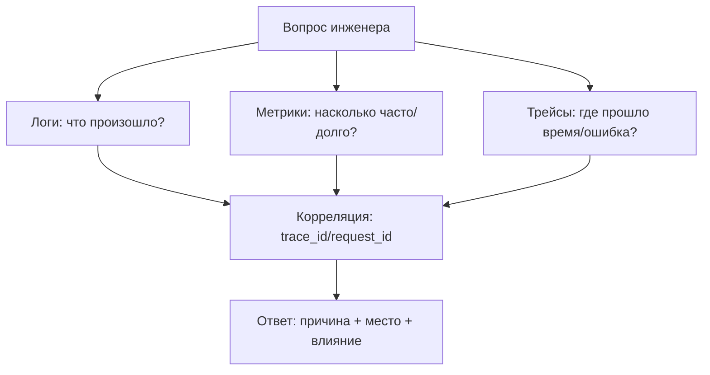
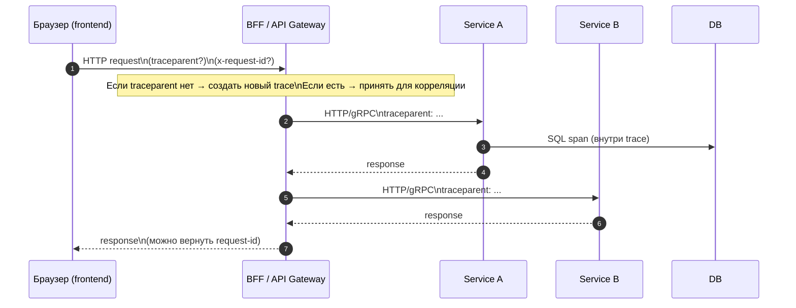

[← Назад к индексу части 31](index.md)

## 31.2 Наблюдаемость (Observability)

### Цель раздела

Построить ментальную модель наблюдаемости и практический набор механизмов, чтобы систему можно было **измерять, понимать и чинить**: логи, метрики, трейсы, корреляция, Trace Context, SLI/SLO и алертинг.

### В этом разделе главное

- **Наблюдаемость = способность объяснить “почему так”**, а не просто видеть “что плохо”.
- “Три столпа” дополняют друг друга:
  - **логи** отвечают “что произошло”,
  - **метрики** отвечают “сколько/как часто/как долго”,
  - **трейсы** отвечают “где прошло время и где ошибка”.
- Без корреляции (trace_id/request_id) вы получаете “три разрозненных мира”.
- W3C Trace Context — стандартный способ протащить контекст трассировки через границы.
- SLI/SLO превращают наблюдаемость из “красивых графиков” в **управление качеством**.

### Термины

| Термин | Коротко |
| --- | --- |
| **Log aggregation** | Сбор логов в одно место (ELK/Loki/Cloud). |
| **Cardinality** | Количество уникальных значений метки (высокая кардинальность ломает метрики). |
| **Sampling** | Выборочная запись трасс (не все запросы) ради стоимости. |
| **RED** | Метрики для сервисов: Rate, Errors, Duration. |
| **USE** | Метрики для ресурсов: Utilization, Saturation, Errors. |
| **Runbook** | Инструкция “что делать при алерте”. |

### Теория и правила

#### 1) Интуиция: почему “просто логов” недостаточно

Ситуация из жизни: “Сайт медленный”.  
Если у вас только логи, вы видите тысячи строк, но не видите:

- насколько медленно (p95/p99),
- у всех ли пользователей,
- где именно внутри цепочки запросов тормозит,
- это новая деградация или “так было всегда”.

Наблюдаемость — это как приборная панель самолёта: без неё можно лететь “по ощущениям”, но при проблеме вы не понимаете причин.

##### Проверь себя (31.2 — 1)

1. Почему “много логов” не равно “наблюдаемость”? Назови две причины.  
2. Какой тип проблемы лучше всего “видно” метриками, но плохо видно логами?  
3. Почему в распределённой системе важно смотреть на p95/p99, даже если error rate “нормальный”?

<details><summary>Ответ</summary>

1. Логи могут быть неструктурированными/шумными и не дают трендов; без метрик и трейсов сложно локализовать причины. Наблюдаемость — это способность объяснить “почему”, а не просто фиксировать события.
2. Деградация без явных ошибок: рост латентности, saturation пулов/очередей, увеличение хвостов p99.
3. Потому что пользователи чувствуют хвосты; p99 часто растёт раньше ошибок и показывает узкие места/перегрузку.

</details>

#### 2) “Три столпа” и как они работают вместе



Важно: это не “три разных моды”, а три разных типа сигнала:

- Логи — **дискретные события** (подходят для поиска конкретных случаев).
- Метрики — **агрегированная картина** (подходят для трендов и алертов).
- Трейсы — **путь запроса** (подходят для локализации задержек и ошибок в распределённой системе).

##### Проверь себя (31.2 — 2)

1. Какой “столп” ты используешь первым, если хочешь оценить **масштаб** проблемы, и почему?  
2. Приведи пример вопроса, на который **трейсы** отвечают лучше, чем логи и метрики.  
3. Что станет самым дорогим в расследовании, если у вас есть логи/метрики/трейсы, но нет корреляции (`trace_id`)?

<details><summary>Ответ</summary>

1. Метрики: они мгновенно показывают динамику (проценты ошибок, p95/p99, RPS) и “когда началось”.
2. “В каком сервисе/зависимости прошло время?” / “какой span дал ошибку?” / “какой маршрут выполнения выбрался?”
3. Склейка причин: придётся вручную сопоставлять по времени/догадкам и “плавать” между инструментами без единой ниточки.

</details>

#### 3) Структурированные логи: минимальный полезный формат

Если логи “человеческим текстом”, их сложно:

- искать по полям,
- коррелировать,
- строить дешёвые правила.

Минимально полезные поля (очень типичная практика):

- `timestamp`, `level`,
- `service`, `env`, `version`,
- `trace_id` (и/или `request_id`),
- `event` или `message`,
- `http.method`, `http.path`, `status_code` (если HTTP),
- `error.type`, `error.message` (без секретов).

##### Проверь себя (31.2 — 3)

1. Почему структурированные логи — это не “красота”, а инженерная необходимость для эксплуатации?  
2. Какие 4 поля ты считаешь минимальными, чтобы по логам можно было расследовать инцидент?  
3. Почему `trace_id` в логах полезен даже до того, как трейсинг внедрён “идеально”?

<details><summary>Ответ</summary>

1. По полям можно быстро искать/агрегировать/строить правила и связывать события; иначе лог‑архив превращается в непроходимый текст.
2. `timestamp`, `level`, `service/env/version`, `trace_id`/`request_id` (плюс http‑контекст для HTTP‑сервисов).
3. Он даёт корреляцию между сервисами и событиями; даже частичный трейсинг становится полезнее, когда логи “подхватывают” trace_id.

</details>

#### 3.1) Уровни логов и “редакция” данных: как не утонуть и не утечь

Фраза “не логируй PII/токены” правильная, но на практике её легко нарушить “случайно”:

- разработчик залогировал весь request body “чтобы дебажить”,
- библиотека залогировала заголовки целиком,
- в ошибке попал кусок payload’а.

Поэтому в продакшене обычно вводят два слоя дисциплины: **уровни логов** и **редакцию/маскирование**.

**Уровни (лог‑левелы)** — договор, который помогает управлять шумом и стоимостью:

- `DEBUG`: локальная/стендовая диагностика, в проде обычно выключено или сильно ограничено;
- `INFO`: нормальные бизнес‑события и контрольные точки (без чувствительных данных);
- `WARN`: подозрительные/нештатные ситуации, которые ещё не “падение” (например, выросли ретраи);
- `ERROR`: ошибки, требующие внимания (таймауты, исключения);
- `FATAL/CRITICAL`: состояние, при котором компонент не может продолжать работу.

Практическое правило: **в `INFO` в проде должно быть достаточно данных, чтобы расследовать 80% инцидентов без включения DEBUG**.

**Редакция/маскирование (redaction/masking)** — механизм “даже если кто-то ошибся, мы не утечём”:

- перед отправкой лога/ошибки в систему агрегации “вырезаем” или маскируем поля по списку (`password`, `token`, `authorization`, `refresh_token`, `cookie`, `ssn`, и т.п.);
- маскируем частично (например email `a***@domain.com`), если это реально нужно для расследования;
- запрещаем логирование заголовков целиком, логируем только whitelist (например `x-request-id`, `traceparent`, `user-agent` — в зависимости от политики).

Очень полезный шаблон политики “что можно в логах”:

```text
Разрешено (whitelist): service/env/version/trace_id/method/path/status/latency/error_class
Запрещено (denylist): Authorization, Cookie, password, refresh_token, full PII payloads
Сомнительное: user_id, email, phone → только если есть причина и политика хранения
```

И ещё один часто забываемый аспект: **ретеншн**.
Даже “безопасные” логи — это данные. Обычно:

- высокий объём (debug/info) хранится меньше,
- ошибки/аудит хранятся дольше,
- доступ к логам ограничен по ролям (least privilege уже на уровне эксплуатации).

##### Проверь себя (31.2 — 3.1)

1. Почему redaction/masking нужен даже в команде с хорошими практиками и код‑ревью?  
2. Чем whitelist‑логирование заголовков лучше, чем “запретим пару полей” (denylist) — или почему часто используют оба?  
3. Как ретеншн влияет одновременно на безопасность и стоимость?

<details><summary>Ответ</summary>

1. Потому что ошибки и “случайные логирования” неизбежны, плюс есть сторонние библиотеки и неожиданные payload’ы. Redaction — страховка от утечки.
2. Whitelist гарантирует, что в логи попадёт только разрешённое; denylist ловит “известные опасные” поля. Вместе дают лучшее покрытие.
3. Долгое хранение увеличивает риск утечки и стоимость; разные типы логов требуют разных сроков хранения и разных прав доступа.

</details>

#### 4) Метрики: что измерять и как не сломать систему

Хорошее правило старта: **RED** для сервисов и **USE** для ресурсов.

- **Rate**: сколько запросов/сек.
- **Errors**: доля ошибок (по классам: 4xx/5xx).
- **Duration**: распределение времени (p50/p95/p99).

Для ресурсов:

- **Utilization**: загрузка CPU, память, сеть.
- **Saturation**: “очереди”, “пулы”, “лимиты” (например, занятость соединений).
- **Errors**: ошибки ресурсов (например, ошибки диска).

Опасность: **высокая кардинальность**.
Например, метрика `http_requests_total{user_id="..."}` создаст миллионы уникальных series и убьёт систему метрик.
Правило: **в метках — только малое число значений** (endpoint, статус, метод), а не user_id/trace_id.

##### Проверь себя (31.2 — 4)

1. Почему высокая кардинальность особенно опасна именно для метрик (а не просто “много данных”)?  
2. Назови по одному примеру метрики из RED и из USE, которые вместе помогут диагностировать деградацию.  
3. Почему алертить на “среднюю латентность” обычно хуже, чем на p95/p99 или SLO‑нарушение?

<details><summary>Ответ</summary>

1. Метрики — это time series по комбинации меток; миллионы уникальных значений порождают миллионы рядов и ломают хранение/запросы/алерты.
2. RED: p95/p99 latency по endpoint; USE: saturation пула соединений/очереди/CPU. Вместе показывают симптом и ресурсную причину.
3. Среднее прячет хвосты; p95/p99 и SLO лучше отражают пользовательский опыт и управляемость инцидентов.

</details>

#### 4.1) Куда “уезжают” сигналы: агрегация логов и backend для метрик

Чтобы наблюдаемость работала как система, сигналы должны собираться и храниться централизованно:

- **логи**: ELK/Elastic, Loki, CloudWatch (и аналоги) — важно, что там есть поиск/агрегация по полям;
- **метрики**: Prometheus и аналоги (включая managed‑решения) — важно, что там есть time‑series и алертинг;
- **трейсы**: Jaeger/Zipkin/Tempo и аналоги — важно, что там есть визуализация trace/span и поиск.

Не цель “выбрать конкретный продукт”, цель — **понимать роли**: где хранится что, и как оно связывается через `trace_id`.

##### Проверь себя (31.2 — 4.1)

1. Почему “логи на каждом сервере” плохо работают в кластере и при авто‑масштабировании?  
2. Чем отличается задача “построить график p99 за сутки” от задачи “разобрать один конкретный запрос”?  
3. Зачем в логах/метриках важно иметь `service/env/version`, а не только `message`?

<details><summary>Ответ</summary>

1. Инстансы приходят/уходят, логи ротируются, их сложно собрать вручную; без агрегации нет единого поиска и корреляции.
2. График — задача метрик (агрегации/тренды). Конкретный запрос — задача логов/трейсов (контекст и путь).
3. Чтобы фильтровать и сравнивать поведение по сервисам и версиям, связывать проблемы с релизами и окружениями.

</details>

#### 5) Трейсы: что такое trace/span и зачем “прокидывать контекст”

Trace — это “один запрос” (например “открыть страницу заказа”).  
Span — шаг внутри: “BFF → service orders”, “orders → DB”, “orders → payment API”.

Смысл трассировки: увидеть:

- где время,
- где ошибка,
- какие зависимости виноваты,
- какой маршрут пошёл по условию.

##### Проверь себя (31.2 — 5)

1. Объясни разницу trace vs span простыми словами (1–2 предложения).  
2. Почему без прокидывания контекста в микросервисах трейсинг “рассыпается”?  
3. Приведи пример, когда трейс помогает найти “виновную зависимость”, хотя сервис выглядит просто “медленным”.

<details><summary>Ответ</summary>

1. Trace — весь путь одного запроса через систему; span — отдельный шаг внутри этого пути (вызов сервиса, запрос к БД и т.п.).
2. Каждый сервис начнёт новый trace, и сквозная цепочка пропадёт — не будет единого trace_id.
3. Например, рост p99 из‑за внешнего API или DB query: трейс покажет конкретный span с задержкой.

</details>

#### 5.1) Самплирование трейсов: как не разориться и не ослепнуть

План части 31 прямо упоминает самплирование при высокой нагрузке. Важно понимать компромисс:

- если **не самплировать**, то стоимость хранения/передачи трейс‑данных может стать огромной;
- если **самплировать слишком агрессивно**, то в инцидент “нужного трейса” может не быть.

Практические подходы (на уровне принципов):

- **head‑based sampling**: решение “писать/не писать” принимается в начале запроса (просто, дешево, но можно пропустить редкие ошибки);
- **tail‑based sampling**: решение принимается после завершения трейса (можно сохранять “все ошибки” и “все медленные”, но сложнее и дороже).

Хорошая стартовая практика: писать (почти) всё в dev/stage, а в prod:

- сохранять все ошибки (или хотя бы определённые классы),
- сохранять все “очень медленные” трейсы,
- остальное — семплировать.

##### Проверь себя (31.2 — 5.1)

1. Почему важно сохранять ошибки (или почти все ошибки) даже при активном sampling?  
2. Чем head‑based sampling выигрывает, и чем он проигрывает tail‑based?  
3. Назови один риск слишком агрессивного sampling для расследования.

<details><summary>Ответ</summary>

1. Ошибки — редкие, но критичные события; если их выкинуть, в инциденте не будет фактов.
2. Head‑based проще и дешевле (решение сразу), но может пропускать редкие ошибки/медленные хвосты. Tail‑based точнее (может “выбрать” ошибки/медленные), но дороже и сложнее.
3. В момент инцидента нужные трейсы отсутствуют, и команда вынуждена гадать по косвенным сигналам.

</details>

#### 6) W3C Trace Context: `traceparent` и “протянуть ниточку”

Если запрос идёт через несколько сервисов, нужно “протянуть ниточку”:

```text
Client ──HTTP──> BFF ──HTTP/gRPC──> Service A ──SQL──> DB
          (traceparent)      (traceparent)       (span)
```

Стандарт W3C Trace Context задаёт заголовки:

- `traceparent` — основной идентификатор трассы и текущего span,
- `tracestate` — дополнительный контекст (часто вендорский).

Практическое правило: **любой входной запрос** (HTTP/gRPC) должен:

1) принять/создать trace context,
2) записать `trace_id` в логи,
3) прокинуть контекст в исходящие вызовы.

##### Проверь себя (31.2 — 6)

1. Что в реальности даёт Trace Context, если у вас цепочка из 4–6 сервисов?  
2. Почему `traceparent` нельзя использовать как “доверенный” параметр для безопасности?  
3. Назови минимум 2 действия, которые должен делать сервис на входе/выходе, чтобы trace не терялся.

<details><summary>Ответ</summary>

1. Единую “нить” (`trace_id`) для сквозного пути запроса: можно увидеть, где время/ошибка и в какой зависимости.
2. Заголовок может прийти от недоверенного клиента и быть подделан; это корреляция, а не основа авторизации.
3. На входе: извлечь/создать контекст, записать trace_id в логи/спаны. На выходе: прокинуть `traceparent` в исходящие вызовы.

</details>

#### 6.1) Сквозная трассировка “фронт → BFF → сервисы”: как реально выглядит поток

В плане части 31 отдельно сказано “передача trace_id от фронта к бекенду”. Важно понимать: **браузер — это тоже часть распределённой системы** (особенно если у вас BFF).

Две распространённые стратегии (в реальности часто смешивают):

1) **Trace начинается на серверной границе (BFF/API gateway)**: браузер не генерирует `traceparent`, сервер создаёт новый trace.  
   - плюс: проще и безопаснее (контроль на сервере)  
   - минус: хуже связать “клик пользователя” и серверный трейс, если нет client‑side наблюдаемости
2) **Trace начинается на клиенте (RUM/SDK)**: браузер генерирует `traceparent` и прокидывает в запросы.  
   - плюс: можно связать “клик/навигацию” и весь путь на бекенде  
   - минус: нужно учитывать угрозы (заголовок приходит от недоверенного клиента) и контролировать sampling/политику

Самое главное правило безопасности: **traceparent можно принимать как “корреляцию”, но нельзя принимать как “доверенный факт”**. То есть он не должен влиять на авторизацию и логику доступа, но может связывать наблюдаемость.

Схема потока заголовков:



Практический минимальный чек‑лист “чтобы оно заработало”:

- на входе (BFF/API) фиксируем `trace_id` в логи и создаём root span;
- на исходящих вызовах всегда прокидываем `traceparent`;
- в каждом сервисе `trace_id` попадает в логи и трейсы;
- если есть фронт‑наблюдаемость (RUM), то она либо генерирует `traceparent`, либо хотя бы хранит `request_id`, возвращённый сервером.

##### Проверь себя (31.2 — 6.1)

1. Когда разумнее начинать trace на сервере, а когда — на клиенте?  
2. Почему BFF должен прокидывать `traceparent` дальше, а не “создавать новый” на каждом hop?  
3. Назови одну меру, которая снижает риск злоупотребления заголовками со стороны клиента, но не ломает наблюдаемость.

<details><summary>Ответ</summary>

1. На сервере — проще и безопаснее при старте/высоких требованиях контроля. На клиенте — когда нужна корреляция UX‑событий с серверной цепочкой (RUM).
2. Иначе сквозная цепочка разорвётся: вы не увидите путь запроса через несколько сервисов.
3. Принимать заголовок только как корреляцию, нормализовать/whitelist входные заголовки, не использовать их в авторизации.

</details>

#### 6.3) Наблюдаемость на фронтенде: мониторинг ошибок и RUM (и как не утечь исходниками)

Глобальный план подчёркивает, что часть 31 применима и к фронтенду (“мониторинг ошибок”). Это важно: иногда “инцидент” выглядит как “всё ок на сервере”, но пользователи видят белый экран из‑за ошибки JS.

Минимальный полезный набор на клиенте:

- **мониторинг ошибок**: необработанные исключения, ошибки загрузки, промисы;
- **RUM метрики**: базовые UX‑метрики (например LCP/INP) и время сетевых запросов (без PII);
- **корреляция с бекендом**: `request_id`/`trace_id` (если выбран такой подход) в событиях ошибок.

Важно про **source maps** (связь с частью 29 и эксплуатацией):

- source maps нужны, чтобы “минифицированную ошибку” превратить в понятный стек;
- но если вы раздаёте исходники всем (или храните maps публично), это повышает риск утечек.

Практика:

- source maps — либо в закрытом хранилище, доступном только команде/системе мониторинга, либо публикуются с жёсткими ограничениями доступа;
- в событиях мониторинга не отправлять токены, пароли, PII и “сырые” payload’ы.

##### Проверь себя (31.2 — 6.3)

1. Почему “серверные SLO зелёные” не гарантируют, что у пользователей нет проблем?  
2. В чём риск публикации source maps “как есть” и какой безопасный вариант чаще всего используют?  
3. Какие данные из событий фронтенд‑мониторинга нужно редактировать (redact) почти всегда?

<details><summary>Ответ</summary>

1. Проблемы могут быть на клиенте: JS‑ошибки, несовместимые чанки/кэш, блокировки ресурсов, проблемы сети, ошибки гидрации — пользователь не дойдёт до API.
2. Source maps могут раскрыть исходники/внутренности. Часто используют закрытое хранилище или ограничение доступа и интеграцию с системой мониторинга ошибок.
3. Токены/cookies/session_id, пароли, PII, сырые payload’ы запросов/ответов, секреты/конфиги.

</details>

#### 6.2) Что полезно прокидывать, кроме trace context (и что опасно)

Помимо `traceparent` команды часто хотят прокидывать:

- `x-request-id` (локальная корреляция),
- `x-client-version` (версия фронта),
- `x-device` / `x-platform` (web/mobile),
- `accept-language` (локаль).

Опасно прокидывать (или логировать как есть):

- токены (`Authorization`) и session identifiers,
- PII в заголовках,
- “сырые” параметры, которые могут содержать инъекции.

##### Проверь себя (31.2 — 6.2)

1. Зачем прокидывать `x-client-version` и `x-platform`, и где это реально помогает?  
2. Почему нельзя “на всякий случай” логировать все входные заголовки и query‑параметры?  
3. Приведи пример, как локаль (`accept-language`) влияет на кэш и поведение системы.

<details><summary>Ответ</summary>

1. Это ускоряет диагностику и сегментацию проблем по версии клиента/платформе (web/mobile), помогает с rollback и feature flags.
2. Там могут быть токены/PII/инъекции; это риск утечки, лишний шум и рост стоимости хранения.
3. Если кэш‑ключ не учитывает локаль, можно отдавать “не тот язык”. Различия форматов/контента по локали делают баг “только у части пользователей”.

</details>

Пример (упрощённо) заголовка:

```text
traceparent: 00-4bf92f3577b34da6a3ce929d0e0e4736-00f067aa0ba902b7-01
```

Важное: не нужно “знать наизусть формат”, нужно понимать смысл:

- **trace id** связывает всё,
- **span id** — текущий шаг,
- флаг sampling — записывать ли подробно.

#### 7) SLI/SLO и алертинг: “наблюдаемость ради управления качеством”

**SLI** — измерение: например “доля успешных запросов” или “p95 latency”.
**SLO** — цель: например “p95 < 300ms” или “availability 99.9%”.

Модель “error budget” (простыми словами):

- SLO даёт “сколько ошибок/плохого качества нам допустимо” за период.
- Пока бюджет есть — можно выпускать изменения.
- Если бюджет сгорает — фокус на стабильности.

Алертинг:

- алертить не всё подряд, а то, что требует действия,
- иметь **runbook**: что делать при срабатывании,
- избегать “шумных” алертов (иначе наступает усталость).

##### Проверь себя (31.2 — 7)

1. Чем SLO отличается от SLA по смыслу и последствиям для команды?  
2. Почему алерт “CPU > 90%” часто менее полезен, чем алерт “SLO нарушен”?  
3. Назови один SLI для важного пути, который не сводится к latency.

<details><summary>Ответ</summary>

1. SLO — внутренняя инженерная цель (управление качеством/бюджетом ошибок). SLA — внешнее обязательство/контракт (часто с финансовыми/юридическими последствиями).
2. CPU может быть высоким без проблемы для пользователя и наоборот. SLO ближе к пользовательскому эффекту.
3. Error rate (5xx/timeouts) по ключевому endpoint, availability, доля успешных бизнес‑операций.

</details>

#### 7.1) Как выбрать SLI/SLO так, чтобы они не были “бумажными”

Здесь легко ошибиться: выбрать “всё подряд” или выбрать метрику, которая не отражает опыт пользователя.

Мини‑алгоритм:

1) Выбери **важный путь** (например “открыть заказ”, “поиск товара”, “оплата”).  
2) Определи **что значит “хорошо” для пользователя**: скорость, отсутствие ошибок, доступность.  
3) Выбери 1–2 SLI:
   - latency percentiles (p95/p99),
   - error rate (5xx, timeouts),
   - availability по важному endpoint.  
4) Выставь SLO, который:
   - реалистичен (не “0 ошибок никогда”),
   - измерим,
   - полезен для решений (релизы/стабилизация).  
5) Привяжи алерты к SLO‑нарушениям (а не к “CPU 90% всегда” без контекста).

Типовые ошибки:

- SLI = “среднее время” (среднее прячет хвосты),
- SLO ставят “как мечту”, а не как управляемую цель,
- алерты не связаны с действиями (нет runbook, нет владельца, шум).

##### Проверь себя (31.2 — 7.1)

1. Почему SLO “0 ошибок” почти всегда приводит к плохой инженерной практике?  
2. Какие два шага из мини‑алгоритма выбора SLI/SLO самые важные и почему?  
3. Как SLO связано с decision‑making по релизам (что меняется в процессе команды)?

<details><summary>Ответ</summary>

1. Ошибки неизбежны; такое SLO делает алерты шумными, демотивирует и ведёт к “прятанию” проблем вместо управления ими.
2. Выбор важного пути и выбор SLI, отражающего опыт пользователя (p95/p99, error rate): без этого SLO будет “про удобство команды”, а не про качество.
3. Через error budget: пока бюджет есть — релизы идут; если бюджет сгорает — приоритет стабилизации, возможна пауза релизов/rollback/фокус на инцидентах.

</details>

#### 7.2) Runbook: что должно быть внутри (минимум)

Если алерт без runbook, он превращается в “сообщение о проблеме без плана”.

Минимальный runbook‑скелет:

- **Что означает алерт** (какой SLO/метрика нарушены, какой пользовательский эффект).  
- **Где смотреть** (дашборд/графики/трейсы/логи, ссылки если уместно).  
- **Быстрые проверки** (типовые причины: зависимость, DB, сеть, релиз).  
- **Временная стабилизация** (деградация/фичефлаг/rollback/ограничение нагрузки).  
- **Эскалация** (кто владелец, когда будить, что сообщать).

Подсказка по связям с планом:

- если стабилизация = таймауты/retry/circuit breaker → это напрямую перекликается с **частью 19** (resilience);
- если стабилизация = rollback/canary/graceful shutdown → это перекликается с **частью 20** (деплой и инфраструктура).

##### Проверь себя (31.2 — 7.2)

1. Почему runbook должен содержать “временную стабилизацию”, а не только “где смотреть”?  
2. Назови два примера “быстрой стабилизации”, которые часто спасают ситуацию до поиска root cause.  
3. Какие два пункта runbook обязаны быть, чтобы дежурный мог действовать без контекста команды?

<details><summary>Ответ</summary>

1. Потому что в инцидент важнее быстро остановить ущерб (деградация/rollback/лимиты), а root cause искать после стабилизации.
2. Rollback релиза, включение деградации/фичефлага, ограничение нагрузки/rate limiting, временное отключение нестабильной зависимости.
3. Где смотреть (дашборды/логи/трейсы) и эскалация/владелец (кого звать и когда), плюс краткие шаги проверки.

</details>

### Пошагово (минимум → продакшен‑уровень)

1. **Сделай единый формат структурных логов** и базовый набор полей (service/env/version/trace_id).  
2. Добавь **метрики RED** на входные запросы и ключевые зависимости (БД, внешние API).  
3. Включи **распределённый трейсинг** (OpenTelemetry) и настрой корреляцию: trace_id в логах.  
4. Сделай первые **дашборды**:
   - RPS, error rate, p95/p99 latency,
   - насыщение ресурсов (CPU/memory/connection pools),
   - ключевые зависимости.
5. Определи 2–3 **SLO** для “важного пути” (например “открытие заказа”, “оплата”).  
6. Настрой алерты на SLO‑нарушения и добавь runbook.

#### Проверь себя (31.2 — пошагово)

1. Почему порядок “логи → метрики → трейсы” часто работает лучше, чем пытаться внедрить всё сразу?  
2. Какие два дашборда ты бы сделал “в первый день”, чтобы инциденты стали разбираться быстрее?  
3. Почему SLO лучше выбирать по “важному пути”, а не “по всем эндпоинтам одинаково”?

<details><summary>Ответ</summary>

1. Потому что каждое следующее добавление опирается на предыдущее: без структурных логов и метрик трейсинг не даст полноценной картины и будет сложен в эксплуатации.
2. RED‑дашборд сервиса (RPS/error rate/p95–p99) + дашборд ключевой зависимости (БД или внешний API) с latency/timeouts/errors и saturation.
3. Потому что разные пути имеют разную критичность и требования; “один стандарт на всё” либо слишком строгий, либо слишком слабый и бесполезный.

</details>

### Простыми словами

Наблюдаемость — это когда ты можешь ответить:

- “что сломалось?” (логи),
- “насколько это плохо?” (метрики),
- “где именно внутри?” (трейсы),

и сделать это быстро, без гадания.

### Картинка в голове

Система без наблюдаемости — как город без камер, датчиков и диспетчерской:

- аварии случаются,
- но ты узнаёшь о них случайно (по жалобам),
- и долго ищешь, где именно проблема.

Наблюдаемость — это “диспетчерская”: видно, где пробка, где авария, куда отправить бригаду.

### Как запомнить

Формула: **Логи = события, Метрики = тренды, Трейсы = путь запроса.**  
И ещё: **корреляция — это клей**, без него всё распадается.

### Примеры

#### Пример 1. Корреляция: как это выглядит при расследовании

1) Метрика показывает: `p99` у эндпоинта `/orders/{id}` вырос с 400ms до 3s.  
2) По трейсингу видно: у `Service Orders` span “DB SELECT” стал 2.5s.  
3) В логах по `trace_id` видно: запросы упираются в “connection pool exhausted”.

Из этого рождается конкретное действие: проверить пул/лимиты/DB нагрузку, а не “оптимизировать JSON”.

##### Проверь себя (31.2 — пример 1)

1. Почему расследование начинается с метрик, а не с логов “потому что там ошибка”?  
2. Какой следующий шаг ты сделаешь, если трейс показывает, что “DB SELECT” стал медленным, но error rate не вырос?  
3. Почему `trace_id` в логах важен именно на шаге “подтвердить гипотезу”?

<details><summary>Ответ</summary>

1. Метрики быстро показывают масштаб и момент деградации (p99, RPS, ошибки) и помогают сузить область поиска; логи без контекста могут дать тысячи строк без понимания влияния.
2. Проверить saturation/пул соединений, планы запросов/индексы, конкуренцию/локи, нагрузку БД, лимиты и изменения после релиза.
3. Он позволяет взять конкретный “плохой” запрос и увидеть детали событий (ошибка пула, таймауты, параметры), не теряя связь с трейсом.

</details>

#### Пример 2. Почему нельзя класть `user_id` в labels метрик

```text
Плохо:
  http_requests_total{path="/orders", user_id="u_123"} 1
  http_requests_total{path="/orders", user_id="u_124"} 1
  ... миллионы рядов ...

Хорошо:
  http_requests_total{path="/orders", status="200"} 12345
  http_requests_total{path="/orders", status="500"} 12
```

`user_id` можно логировать (с осторожностью) или класть в trace attributes, но не в метки метрик.

##### Проверь себя (31.2 — пример 2)

1. Почему `user_id` подходит для логов, но почти всегда плох для метрик?  
2. Чем “labels” в метриках отличаются от “полей” в логах по стоимости и модели хранения?  
3. Как бы ты отследил проблему “только у одного пользователя” без метрик `user_id`?

<details><summary>Ответ</summary>

1. Потому что в метриках он создаёт огромную кардинальность (миллионы рядов). В логах это единичные события, которые можно фильтровать при нужных правах и политике ретеншна.
2. Labels формируют отдельные time series для каждой комбинации значений; поля в логах — данные событий, которые индексируются/ищутся иначе и не взрывают количество рядов так же.
3. Через логи/трейсы: найти по user_id (если разрешено политикой), взять trace_id, посмотреть путь запроса и сравнить с “нормальными” случаями.

</details>

#### Пример 3. “Минимальный набор” метрик для сервиса (RED)

```text
Rate:
  requests_per_second{service="orders", endpoint="/orders/:id"}
Errors:
  error_rate{service="orders", endpoint="/orders/:id", class="5xx"}
Duration:
  latency_seconds_bucket{service="orders", endpoint="/orders/:id", le="..."}
```

##### Проверь себя (31.2 — пример 3)

1. Почему “Duration” лучше собирать гистограммой/перцентилями, а не одной цифрой?  
2. Какие две ошибки в дизайне метрик чаще всего приводят к “бесполезным дашбордам”?  
3. Как ты добавишь метрики зависимости (например внешнего API) так, чтобы они помогали расследованию, а не создавали шум?

<details><summary>Ответ</summary>

1. Одна цифра (среднее) прячет хвосты; гистограмма позволяет вычислять p95/p99 и видеть распределение.
2. Высокая кардинальность меток и отсутствие привязки к важным путям/смысловым эндпоинтам (всё “в общей куче”).
3. Метрики по error rate/latency/timeouts для конкретной зависимости, с ограниченным числом меток (dependency name, result class), плюс корреляция через трейс/span.

</details>

### Практика / реальные сценарии

- **Сценарий “инцидент ночью”**: как по алерту перейти к графику SLO → выбрать проблемный endpoint → открыть trace → найти зависимость → подтвердить логами.
- **Сценарий “почему пользователи жалуются, а алертов нет”**: может быть, SLI измеряет “не то” (например, среднее вместо p95/p99) или алерт стоит слишком мягко.
- **Сценарий “дорого хранить логи”**: внедрить уровни логирования, семплирование, ретеншн, и оставить в проде максимум пользы при минимуме шума.

#### Проверь себя (31.2 — практика)

1. В каком порядке ты пойдёшь: алерт → метрики → трейс → логи, и почему именно так?  
2. Назови две причины, почему “алертов нет, а пользователи жалуются” может быть проблемой **измерения**, а не “реального качества”.  
3. Что вы должны сделать с логами/трейсами, прежде чем “просто увеличить ретеншн”, если стоимость хранения выросла?

<details><summary>Ответ</summary>

1. Алерт/метрики дают масштаб и момент проблемы, трейс локализует место в цепочке, логи подтверждают конкретные ошибки/контекст по trace_id.
2. Неподходящий SLI (среднее вместо p95/p99), слишком мягкие пороги, неправильная сегментация (важный путь не покрыт), ошибки измерения на клиенте.
3. Ввести уровни логов, redaction, sampling для трейсов, нормальную ретеншн‑политику по классам данных и убрать “шумные” события.

</details>

### Типичные ошибки

- “Сделали много логов” вместо наблюдаемости (нет метрик/трейсов, нет корреляции).
- Логи неструктурированные → поиск и агрегация превращаются в боль.
- Метрики с высокой кардинальностью → ломают мониторинг.
- Нет SLO → алерты либо шумят, либо молчат.
- Трейсы есть, но `trace_id` не попадает в логи → расследование всё равно тяжёлое.

### Что будет, если…

- …не иметь метрик: вы узнаёте о проблемах “по жалобам”, и не можете оценить масштаб/влияние.
- …не иметь трасс: вы видите, что медленно, но не видите “где внутри”, особенно при микросервисах.
- …не иметь SLO: команда спорит “нормально/ненормально” без чисел и цели; качество становится политикой, а не инженерией.

### Проверь себя

1. Почему p99 часто важнее среднего времени ответа в распределённой системе?  
2. Чем отличаются `request_id` и `trace_id`, и когда нужны оба?  
3. Назови два примера метрик, которые опасно делать с высокой кардинальностью.

<details><summary>Ответ</summary>

1. Потому что пользователь чувствует “худшие хвосты”: один медленный запрос может испортить UX. Среднее прячет хвосты. p99 показывает, что происходит с “самыми медленными” запросами.
2. `request_id` часто уникален для конкретного входного запроса на одном сервисе/границе. `trace_id` связывает всю цепочку вызовов через сервисы. Оба полезны: request_id как локальная корреляция, trace_id как сквозная.
3. Метрики с `user_id`, `trace_id`, `order_id`, `ip` как label — создадут огромное число time series и сломают систему мониторинга.

</details>

### Запомните

- Наблюдаемость — это **ответ на “почему”**, а не “много логов”.  
- **Три столпа** работают вместе, а **корреляция** делает их полезными.  
- **W3C Trace Context** — стандартная “нить” через границы.  
- **SLO** превращает мониторинг в управление качеством.

---
