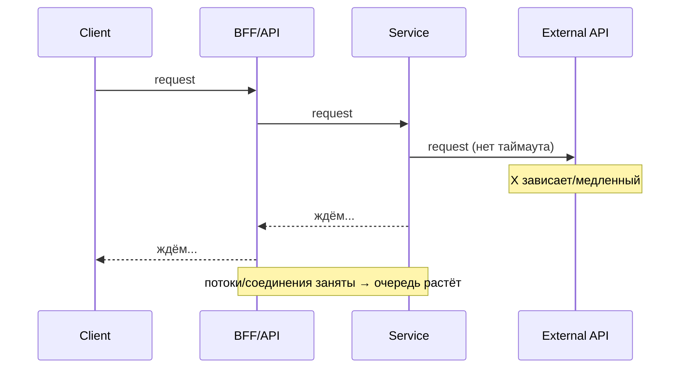
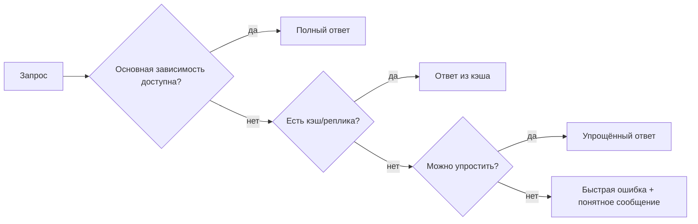

[← Назад к индексу части 31](index.md)

## 31.3 Отказоустойчивость на границах

### Цель раздела

Понять и уметь применять устойчивость как набор архитектурных механизмов **на границах**: таймауты, retry/backoff/jitter, circuit breaker, идемпотентность, деградация и понятные пользователю последствия.

### В этом разделе главное

- На **каждый** внешний вызов должен быть **таймаут**.
- Retry без правил превращается в **шторм** и убивает систему.
- Circuit breaker защищает систему от “долбёжки” в падающую зависимость.
- Идемпотентность делает повторы безопасными.
- Деградация — честная стратегия: “что мы делаем, когда зависимость недоступна”.

### Термины

| Термин | Коротко |
| --- | --- |
| **Cascading failure** | Каскадный сбой: падает зависимость → клиенты ждут → ресурсы кончаются → падают ещё сервисы. |
| **Bulkhead** | Разделение ресурсов (пулы) “чтобы пожар не распространился”. |
| **Deadline propagation** | Протягивание “сколько времени осталось” через цепочку вызовов. |
| **Fallback** | План Б: кэш/упрощение/заглушка вместо падения. |

### Теория и правила

#### 1) Интуиция: почему “одна зависимость” валит систему

Типичный каскад:



Если нет таймаутов и ограничений — всё “зависает”, а не “ошибается быстро”. Это часто хуже.

##### Проверь себя (31.3 — 1)

1. Почему “зависнуть и ждать” часто хуже, чем “быстро ошибиться”?  
2. Какие два ресурса чаще всего “съедаются” в каскаде (и приводят к лавине)?  
3. Назови один сигнал (метрика/симптом), по которому можно заподозрить каскадный сбой.

<details><summary>Ответ</summary>

1. Потому что ожидание удерживает ресурсы (потоки/соединения), блокирует обработку здоровых запросов и запускает лавину очередей и таймаутов.
2. Потоки/worker threads и пул соединений (HTTP/DB). Также часто — CPU/память из‑за роста очередей и ретраев.
3. Рост p99/таймаутов, saturation пулов, рост очередей/длины backlog, резкий рост количества активных запросов “in flight”.

</details>

#### 2) Таймауты: правило №1

**Правило:** у каждого внешнего вызова должен быть таймаут.

Почему:

- ограничиваем удержание ресурсов (потоки, соединения),
- делаем поведение предсказуемым,
- ускоряем деградацию и восстановление.

Важно: таймауты должны быть согласованы по цепочке (идея “deadline”):

```text
У клиента есть бюджет 2s на экран.
BFF забирает 1.5s на себя и зависимости.
Service A берёт 800ms.
DB берёт 200ms.
Нельзя, чтобы каждый слой “по умолчанию” ждал 30s.
```

##### Проверь себя (31.3 — 2)

1. Почему “таймаут по умолчанию” часто опасен в проде?  
2. Как связаны таймауты и деградация (fallback) на уровне архитектуры?  
3. Что будет, если верхний слой (BFF) имеет таймаут 1s, а нижний сервис ждёт 10s?

<details><summary>Ответ</summary>

1. Дефолты обычно слишком большие или не учитывают пользовательский бюджет; это приводит к удержанию ресурсов и каскадным сбоям.
2. Таймаут — это “момент принятия решения”: когда ждать больше нельзя, вы выбираете fallback/ошибку/кэш. Без таймаутов деградация не наступает вовремя.
3. Нижний сервис продолжит работу “в холостую” после того, как клиент уже ушёл; ресурсы будут тратиться, а цепочка станет нестабильной (лишняя нагрузка, очереди).

</details>

#### 2.1) Как выбирать значения таймаутов (практический алгоритм + типовые диапазоны)

План части 31 просит не просто сказать “ставьте таймауты”, а объяснить **как выбирать значения** и почему они связаны с SLA/SLO зависимостей.

Сначала — простой алгоритм:

1) Определи **бюджет времени** на пользовательскую операцию (например экран должен стать интерактивным за 2s).  
2) Выдели **бюджет на сервер** (например 1.2s), потому что часть уйдёт на сеть/рендер/клиент.  
3) Разбей серверный бюджет по зависимостям (BFF → сервисы → БД/внешние API).  
4) Поставь таймауты так, чтобы:
   - они были меньше бюджета,
   - они учитывали retry (см. ниже),
   - они отражали SLO зависимостей (если зависимость сама отвечает 95% за 300ms, таймаут 5s обычно бессмысленен).

Теперь — ориентиры “по типам вызовов” (не догма, а стартовая точка для обсуждения):

| Тип вызова | Что это | Типовой диапазон таймаута | Почему так (интуиция) |
| --- | --- | --- | --- |
| **DB запрос** | запрос к БД/кэшу как к “внутреннему ядру” | 50–300ms (часто по запросу/endpoint) | Длинные запросы “съедают” пул соединений и блокируют сервис. Лучше деградировать/оптимизировать запрос. |
| **Сервис внутри кластера** | HTTP/gRPC к соседнему сервису | 100–800ms (в зависимости от пути) | Внутренняя сеть быстрее, но при деградации легко уйти в каскад. Таймаут защищает ресурсы. |
| **Внешний API** | платёжка, доставка, сторонний провайдер | 200–1500ms (часто меньше, чем хочется) | Внешние API часто нестабильнее; нужен короткий таймаут + fallback/очередь. |
| **Очередь / брокер** | публикация/получение сообщений | 50–500ms на publish | Publish должен быть быстрым; долгие ожидания часто означают проблему соединений/квот. |

Как связать таймаут и retry (ключевой момент, который часто ломают):

```text
Если timeout = 500ms и retry = 2,
то верхняя граница ожидания только на этом вызове может стать ~1500ms (+ накладные).
Значит “таймаут на один вызов” должен быть меньше, чем “общий бюджет на зависимость”.
```

Практическая проверка здравого смысла:

- если p95 зависимости = 80ms, а таймаут = 2000ms — вы будете “долго ждать” то, что уже давно сломалось;
- если таймаут = 50ms при p95 = 120ms — вы сами создаёте ошибки и деградацию.

##### Проверь себя (31.3 — 2.1)

1. Почему таймаут должен учитывать retry (а не задаваться “на один вызов” в вакууме)?  
2. Приведи пример, когда таймаут слишком большой ухудшает систему, даже если “пользователь иногда дождётся”.  
3. Что означает “таймаут отражает SLO зависимости” простыми словами?

<details><summary>Ответ</summary>

1. Потому что суммарное ожидание может стать кратно больше: \(timeout × (attempts)\) + накладные, и вы легко съедите весь бюджет на операцию.
2. Долгий таймаут удерживает соединения/потоки, повышает очереди, ухудшает p99 и может привести к каскаду даже при “редких” сбоях.
3. Если зависимость обычно отвечает за 100–300ms, бессмысленно ждать 5s: когда она сломалась, лучше быстро деградировать, чем долго держать ресурсы.

</details>

#### 2.2) Таймауты и “deadline propagation”: как не разрушить бюджет в цепочке

Если клиент дал 2s, бессмысленно, чтобы каждый внутренний сервис “в одиночку” ожидал 2s.

Полезная ментальная модель:

```text
Общий дедлайн = “стоп‑часы”.
Каждый следующий шаг должен видеть, сколько осталось,
и не имеет права ждать больше оставшегося времени.
```

Это дисциплинирует архитектуру: не даёт “подвисать” хвостам и делает деградацию управляемой.

##### Проверь себя (31.3 — 2.2)

1. Зачем “протягивать дедлайн” по цепочке, если у каждого вызова и так есть таймаут?  
2. Что произойдёт, если каждый сервис будет считать, что у него “весь бюджет пользователя”?  
3. Как дедлайн помогает согласовать таймауты между BFF и сервисами?

<details><summary>Ответ</summary>

1. Чтобы суммарное ожидание не превысило бюджет операции и чтобы нижние уровни не делали лишнюю работу после истечения времени наверху.
2. Сумма ожиданий раздуется: каждый будет ждать “по максимуму”, цепочка станет нестабильной и медленной.
3. BFF задаёт общий бюджет; сервисы видят “сколько осталось” и уменьшают свои таймауты соответственно, делая поведение согласованным.

</details>

#### 3) Retry: когда помогает, а когда убивает

Retry полезен, когда ошибка **временная**:

- короткая сетевуха,
- краткий перегруз,
- временная 5xx.

Retry опасен, когда:

- зависимость реально “лежит”,
- ошибка логическая (например 400/401),
- операция не идемпотентна.

Правила “здорового retry”:

- ограничение попыток (например 2–3),
- **exponential backoff**,
- **jitter** (случайность),
- retry только на нужные типы ошибок,
- общая “квота” повторов, чтобы не устроить шторм.

##### Проверь себя (31.3 — 3)

1. Почему retry на 4xx обычно вреден?  
2. Зачем jitter, если уже есть backoff?  
3. Назови один пример операции, где retry возможен только при идемпотентности (или idempotency key).

<details><summary>Ответ</summary>

1. 4xx часто означает логическую ошибку клиента/прав/валидации; повтор не исправит причину, только добавит нагрузку.
2. Без jitter множество клиентов ретраят синхронно, создавая “волны” нагрузки и усугубляя перегрузку.
3. Создание платежа/заказа/списание бонусов: повтор без идемпотентности может создать двойной эффект.

</details>

#### 4) Circuit breaker: защита от шторма

Circuit breaker имеет состояния (упрощённо):

```text
CLOSED: всё ок → пропускаем вызовы
OPEN: слишком много ошибок → быстро отвечаем ошибкой/фолбэком
HALF-OPEN: пробуем несколько запросов → если ок, закрываем
```

Смысл: если зависимость падает, лучше **быстро** “не трогать её” некоторое время, чем продолжать забивать её запросами.

##### Проверь себя (31.3 — 4)

1. Почему circuit breaker часто называют “предохранителем” для распределённой системы?  
2. Что плохого в системе с retry, но без breaker, когда зависимость “лежит”?  
3. Почему breaker без наблюдаемости может создать “странные 503”, и какие метрики/логи нужны рядом?

<details><summary>Ответ</summary>

1. Он ограничивает ущерб: прекращает бесполезные вызовы в падающую зависимость и защищает ресурсы.
2. Retry усилит нагрузку на лежащую зависимость и на клиента, создавая шторм и ускоряя каскадный сбой.
3. Потому что сервис сам начинает быстро отказывать. Нужны метрики состояния breaker (open/half-open), метрики ошибок/таймаутов зависимости и логи с reason/trace_id.

</details>

#### 5) Идемпотентность: “повтор безопасен”

Классическая боль: пользователь нажал “оплатить”, сеть моргнула, клиент повторил → двойная оплата.

Решения:

- проектировать операции идемпотентно (где возможно),
- использовать **идемпотентный ключ** (Idempotency-Key) для критичных команд,
- хранить “результат по ключу” некоторое время.

Пример идеи:

```text
POST /payments
Idempotency-Key: 8b0f... (генерит клиент)

Сервис сохраняет ключ → если тот же ключ приходит снова,
он возвращает тот же результат, а не создаёт второй платёж.
```

##### Проверь себя (31.3 — 5)

1. Почему идемпотентность — это “архитектура взаимодействия”, а не “деталь реализации”?  
2. Что должно храниться на стороне сервиса, чтобы Idempotency-Key реально работал?  
3. Назови одну типичную ошибку внедрения Idempotency-Key, которая всё равно приводит к дублям.

<details><summary>Ответ</summary>

1. Потому что она определяет поведение системы при повторах/таймаутах/ретраях и влияет на контракты и гарантии.
2. Связка (key → результат/статус операции) или “метка обработано”, обычно с TTL и привязкой к операции/пользователю.
3. Не хранить результат и обрабатывать ключ “не атомарно” (гонки), или использовать один ключ на разные операции/пользователей без контекста.

</details>

#### 5.1) Идемпотентность и очереди: at‑least‑once доставка и дедупликация

На границах часто появляется очередь/брокер, и там действует неприятная, но важная реальность:

> Многие брокеры и схемы обработки дают гарантию **at‑least‑once** (“сообщение будет доставлено минимум один раз”),  
> а значит **повторы — нормальны** (из‑за ретраев, ребалансов, таймаутов подтверждения, падений воркера).

Если обработчик не идемпотентен, вы получите:

- двойные списания,
- двойную отправку письма,
- дубли в БД,
- странные “плавающие” баги.

Практические техники (по смыслу, без привязки к конкретному брокеру):

- **дедупликация по ключу**: у сообщения есть `event_id`/`dedup_key`, обработчик хранит “уже обработано” (с TTL) и пропускает повторы;
- **идемпотентные операции в БД**: upsert, уникальные индексы по ключу, проверка “если уже есть — не создавай снова”;
- **outbox/inbox‑паттерны** (связь с EDA‑частями): фиксируют отправку/получение так, чтобы повторы были безопасны.

Ключевая мысль: если у вас есть retry и очереди, **идемпотентность — не опция, а требование**.

##### Проверь себя (31.3 — 5.1)

1. Почему “at-least-once” почти гарантирует повторы в реальной эксплуатации?  
2. Назови два способа дедупликации обработчика (один через БД, один через “таблицу обработанных ключей”).  
3. Почему “просто сделать exactly-once” обычно не решает проблему целиком?

<details><summary>Ответ</summary>

1. Из‑за ретраев, ребалансов, таймаутов подтверждения, падений воркера и повторной доставки — брокер предпочитает “лучше доставить ещё раз, чем потерять”.
2. БД: уникальный индекс/UPSERT по `event_id`. Таблица: хранить `event_id` в inbox/processed‑таблице с TTL и пропускать повторы.
3. Потому что exactly-once чаще означает exactly-once “в рамках брокера”, но не гарантирует exactly-once эффект в вашем бизнес‑действии без идемпотентной логики и атомарности.

</details>

#### 6) Деградация: “как мы живём, когда что-то недоступно”

Деградация — не “скрыть проблему”, а **управляемо выбрать**, что делать:

- вернуть кэш,
- вернуть упрощённый ответ (без рекомендаций),
- показать понятное сообщение пользователю,
- поставить задачу в очередь,
- вернуть ошибку быстро (если нельзя иначе).

Схема fallback‑цепочки:



##### Проверь себя (31.3 — 6)

1. Почему деградация — это заранее выбранная стратегия, а не “скрыть проблему”?  
2. Приведи два примера “хорошей деградации” и один пример “плохой деградации”.  
3. Почему деградация без наблюдаемости опасна?

<details><summary>Ответ</summary>

1. Она определяет, что делать при недоступности зависимости (кэш/упрощение/очередь/ошибка) и какие функции считаются критичными. Это trade‑off и должен быть явным.
2. Хорошая: убрать рекомендации, но показать заказ; вернуть кэш; показать read‑only режим. Плохая: silently скрывать ошибку и показывать “успешно”, хотя операция не выполнена.
3. Вы можете годами жить в деградированном режиме, не замечая ухудшения, или резать функционал лишнего. Нужны метрики деградации, причины и эффект.

</details>

### Пошагово (как проектировать resilience на границе)

Для каждого внешнего вызова (БД/сервис/внешний API) пройди чек‑лист:

1. **Таймаут**: сколько максимум ждём?  
2. **Retry**: какие ошибки считаем временными? сколько попыток? backoff+jitter?  
3. **Breaker**: при каких условиях “открываем” и на сколько?  
4. **Ограничение параллелизма**: пул/лимит, bulkhead.  
5. **Идемпотентность**: если будет повтор — безопасно ли? нужен ли idempotency key?  
6. **Fallback**: что делаем при недоступности? кэш/упрощение/ошибка?  
7. **Наблюдаемость**: как измеряем и логируем (метрики ошибок/таймаутов, трейс‑span, без секретов)?

#### Проверь себя (31.3 — пошагово)

1. Почему пункт “наблюдаемость” должен быть в чек‑листе resilience, а не отдельной темой “потом”?  
2. Какие два пункта чек‑листа чаще всего пропускают, и чем это заканчивается в инцидент?  
3. Как ты поймёшь, что fallback включается слишком часто (и это уже проблема качества), а не “редкая страховка”?

<details><summary>Ответ</summary>

1. Потому что без измеримости вы не поймёте, когда и почему срабатывают таймауты/retry/breaker/fallback; механизмы будут “магией”, а не управляемой системой.
2. Таймауты (потом каскад) и идемпотентность (потом дубли/двойные эффекты), а также отсутствие лимитов параллелизма (потом выгорают пулы).
3. По метрикам срабатывания fallback/ошибок зависимости, по росту доли деградированных ответов, по влиянию на SLO и по тренду во времени.

</details>

### Простыми словами

Resilience — это как “амортизаторы” и “предохранители”:

- таймаут — не даёт машине “висеть в воздухе”,
- retry — пробует ещё раз, если дорога была временно плохой,
- breaker — не даёт снова и снова врезаться в закрытую дверь,
- деградация — позволяет доехать “на запаске”, когда идеальный вариант недоступен.

### Картинка в голове

Вызов во внешнюю зависимость — как звонок в дверь:

- таймаут — “жду 10 секунд и ухожу”,
- retry — “позвоню ещё раз через минуту”,
- breaker — “если 20 раз никто не открывает, перестаю звонить на час”,
- fallback — “если не открыли — беру запасной ключ/иду другим путём”.

### Как запомнить

Формула: **Timeout → Retry (с умом) → Breaker → Idempotency → Fallback.**  
И рядом всегда: **метрики/логи/трейсы** для диагностики.

### Примеры

#### Пример 1. “Где ставить таймауты” и почему “по умолчанию” опасно

```text
Плохо:
  HTTP client timeout = 30s (дефолт)
  DB query timeout = нет

Хорошо:
  BFF общий budget на запрос = 1500ms
  Вызов в Service A timeout = 500ms
  Вызов в внешнее API timeout = 300ms (с retry 2 раза)
  DB query timeout = 200ms (или per-query)
```

Смысл: верхние уровни не должны ждать дольше, чем “имеет смысл для пользователя”.

##### Проверь себя (31.3 — пример 1)

1. Почему таймауты “должны убывать вниз по цепочке”, а не быть одинаковыми на всех уровнях?  
2. Что будет, если у БД нет таймаута запросов, но у сервиса есть таймаут на HTTP?  
3. Какой сигнал/метрика укажет, что таймауты выставлены слишком маленькими (и вы сами создаёте ошибки)?

<details><summary>Ответ</summary>

1. Потому что у верхнего слоя общий бюджет на операцию; нижние слои не должны “съедать” весь бюджет и продолжать работу после того, как верхний слой уже сдался.
2. Сервис может оборвать ожидание, но БД будет продолжать выполнять запрос, удерживая соединения и создавая скрытую нагрузку/очереди.
3. Рост таймаутов при нормальной нагрузке, рост 504/timeout‑ошибок без роста saturation/ошибок зависимостей, ухудшение успешности при стабильных зависимостях.

</details>

#### Пример 2. Retry‑шторм и как его избежать

```text
Если 1000 запросов/сек и каждый делает 3 retry,
то при сбое вы получите до 4000 запросов/сек на зависимость.
Это не “помощь”, это усиление аварии.

Лечение:
  - ограничить попытки
  - backoff + jitter
  - breaker
  - bulkhead (ограничение параллелизма)
```

##### Проверь себя (31.3 — пример 2)

1. Почему retry‑шторм — это “усилитель аварии”, а не “механизм надёжности”?  
2. Как bulkhead помогает при деградации зависимости, даже если таймауты и breaker уже есть?  
3. Назови один “анти‑паттерн retry”, который ты бы запретил на уровне гайдлайна.

<details><summary>Ответ</summary>

1. Он умножает трафик в момент сбоя, добивает зависимость и съедает ресурсы клиента/сервиса, ускоряя каскад.
2. Он ограничивает параллелизм/пулы, чтобы “пожар” не съел все ресурсы и чтобы оставались ресурсы для других путей/операций.
3. Бесконечные ретраи; ретраи без backoff/jitter; ретраи на 4xx; ретраи на неидемпотентные операции без ключа.

</details>

#### Пример 3. Идемпотентный ключ для “создать оплату”

```http
POST /payments HTTP/1.1
Idempotency-Key: 2f1b2b9a-0f2c-4a08-9c5a-6f9d4d7e0b8a
Content-Type: application/json

{"orderId":"o_123","amount":1000,"currency":"RUB"}
```

Повтор с тем же ключом должен вернуть тот же результат (или корректный статус), не создавая второй платёж.

##### Проверь себя (31.3 — пример 3)

1. Почему Idempotency-Key должен быть привязан к конкретной операции (и часто к пользователю/контексту)?  
2. Что должен вернуть сервис при повторе с тем же ключом: “202 accepted”, “200 ok”, “409 conflict” — и от чего зависит ответ?  
3. Где в архитектуре чаще всего “теряются” ключи идемпотентности (кто должен их генерировать и сохранять)?

<details><summary>Ответ</summary>

1. Чтобы один ключ не “перекрывал” разные операции и не создавал неожиданные коллизии; ключ должен означать “это тот же самый запрос/команда”.
2. Зависит от модели: можно вернуть тот же результат (200/201) если операция уже выполнена, 202 если ещё в обработке, 409 если конфликтует с другим payload при том же ключе — главное, чтобы поведение было детерминированным.
3. Часто на границе клиента/BFF: ключ не генерируют, не прокидывают через BFF, теряют при ретраях или не сохраняют при редиректах/повторах.

</details>

### Практика / реальные сценарии

- **Сценарий “падает внешний API, но мы должны показывать страницу”**: убрать часть функционала (например рекомендации), вернуть кэш/заглушку, не блокировать весь экран.
- **Сценарий “платёжная операция”**: обязательная идемпотентность, аккуратный retry только на сетевые ошибки, строгие таймауты, аудит.
- **Сценарий “БД тормозит”**: таймауты запросов, breaker на пул соединений, деградация “read-only режим” или “кэшированная версия”.

#### Проверь себя (31.3 — практика)

1. Для сценария “внешний API падает” какой порядок действий лучше: увеличить таймауты, добавить retry, включить деградацию, открыть breaker — и почему?  
2. Почему для платёжных операций “быстрый retry” может быть опаснее, чем для чтения каталога?  
3. Какие два сигнала помогут отличить “БД медленная из‑за запроса” от “БД медленная из‑за saturation/пула соединений”?

<details><summary>Ответ</summary>

1. Обычно: короткий таймаут → breaker → деградация/кэш → ограниченный retry (только на временные ошибки) — чтобы не добивать зависимость и сохранить UX. “Увеличить таймаут” чаще ухудшит ситуацию.
2. Потому что это операции с побочным эффектом: повтор без идемпотентности/ключа может создать двойное списание; даже с ключом нужен аккуратный дизайн состояний.
3. Трейсы (какой span медленный) + метрики saturation (пул соединений, очереди) + планы/метрики запросов (долгие запросы, lock waits).

</details>

### Типичные ошибки

- Нет таймаутов → зависания и каскадные сбои.
- Retry на всё подряд (включая 4xx) → лишняя нагрузка и ухудшение.
- Retry без backoff/jitter → синхронные шторма.
- Breaker без наблюдаемости → “почему всё стало 503?” непонятно.
- Нет идемпотентности для команд → двойные эффекты.

### Что будет, если…

- …не ставить таймауты: при деградации зависимости вы “съедите” потоки/соединения, и сервис упадёт даже для здоровых запросов.
- …делать retry без правил: вы можете убить зависимость и себя — лавинообразный рост запросов.
- …не иметь fallback‑стратегии: любой сбой превращается в “всё упало”, даже если можно было “упростить”.

### Проверь себя

1. Почему retry и breaker часто идут вместе, а не по отдельности?  
2. Приведи пример операции, где retry опасен без идемпотентности.  
3. Назови два варианта деградации, кроме “вернуть ошибку”.

<details><summary>Ответ</summary>

1. Retry лечит временные сбои, а breaker защищает от ситуации “сбой не временный”. Вместе они дают баланс: пробуем восстановиться, но не добиваем.
2. “Создать платёж”, “создать заказ”, “списать бонусы” — любая операция с побочным эффектом. Без идемпотентности повтор может создать двойной эффект.
3. Вернуть кэшированную версию; вернуть упрощённый ответ (без тяжёлых блоков); поставить задачу в очередь и показать “обрабатываем”; показать ограниченный режим.

</details>

### Запомните

- **Таймауты везде** — базовый закон выживания.  
- Retry должен быть **ограниченным** и “умным” (backoff+jitter, только нужные ошибки).  
- Circuit breaker — “предохранитель” от каскадных сбоев.  
- Идемпотентность — фундамент безопасных повторов.  
- Деградация — заранее выбранный план, а не паника в инцидент.

---
