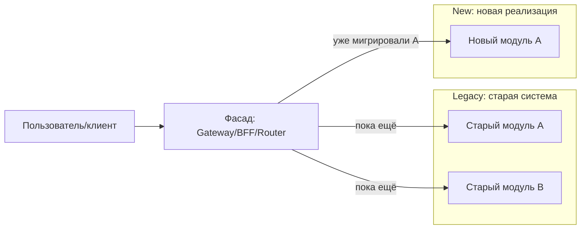
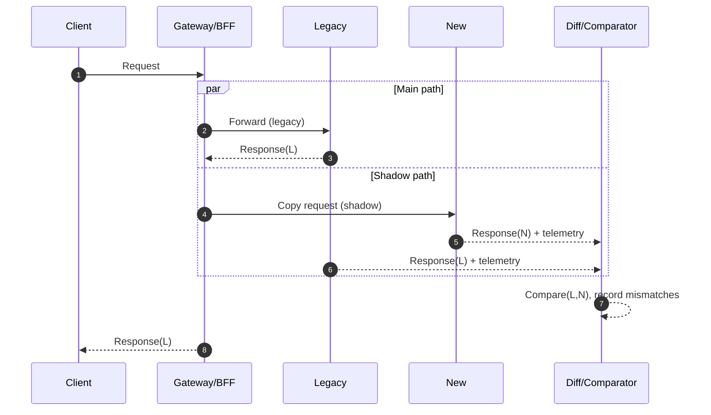
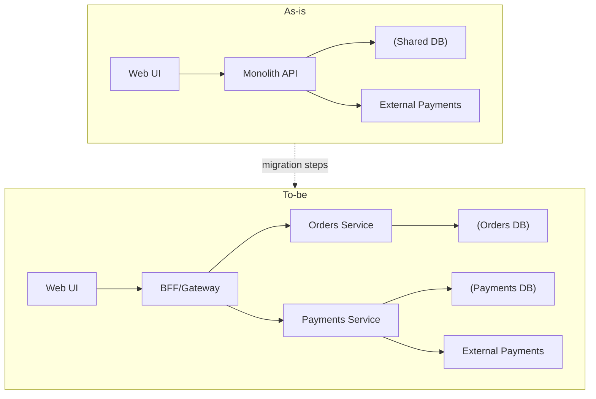
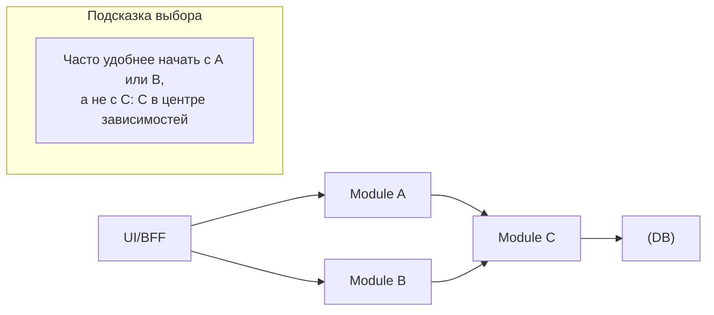
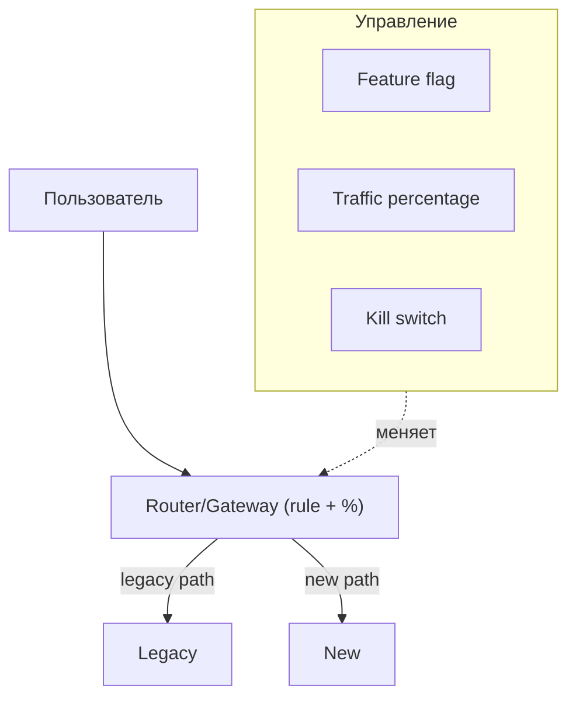
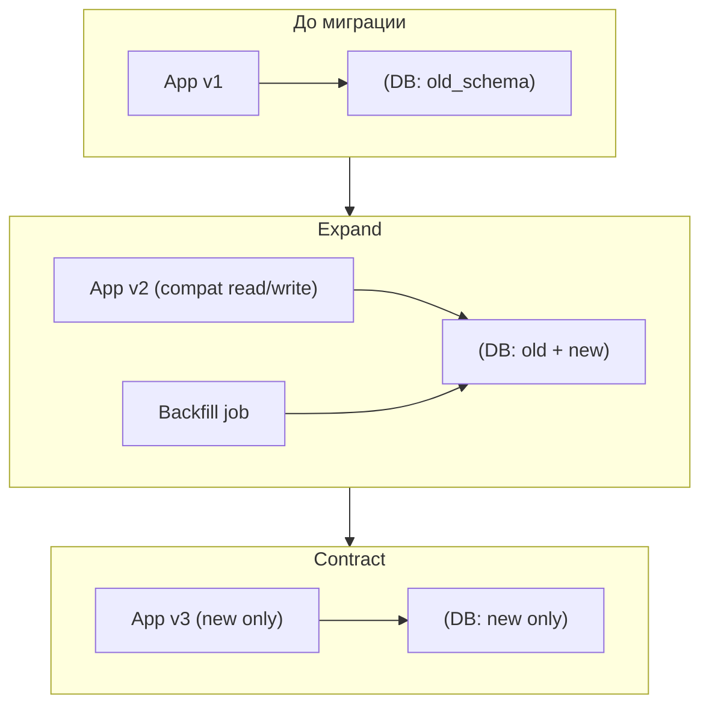

[← Назад к индексу части 32](index.md)

## 32.1 Стратегии миграции

### Цель раздела

Сформировать у тебя устойчивую модель: **миграция — это последовательность маленьких обратимых шагов**, где каждый шаг:

- понятен (что именно меняется);
- проверяем (какими метриками/сравнениями/тестами);
- управляем (как включаем/выключаем);
- по возможности откатываем (rollback).

### В этом разделе главное

- **Инкрементальность** почти всегда снижает риск сильнее, чем “идеальность дизайна”.
- **Трафик и данные** — два главных “рычага” миграции: куда идёт запрос и где живёт истина.
- **Проверка на реальном мире** (canary/shadowing) — это способ поймать то, что никогда не проявится на стенде.

### Термины

| Термин | Определение |
| --- | --- |
| **Инкрементальная миграция** | Переход по небольшим шагам, каждый из которых можно отдельно проверить и завершить |
| **Точка невозврата** | Шаг, после которого откат назад невозможен или крайне дорог (обычно из-за данных) |
| **Switch / routing** | Механизм перенаправления трафика (прокси, API gateway, BFF, роутер) |

---

### 32.1.1 Зачем миграции и почему “big‑bang” опасен

#### Цель подраздела

Понять, почему архитектура “меняется” не потому что модно, а потому что **контекст** изменился — и почему **big‑bang** почти всегда увеличивает риск.

#### Теория и правила

**Big‑bang rewrite** опасен по нескольким причинам (и это не “страшилки”, а статистически повторяемые эффекты):

1. **Долгий период без ценности.** Пока вы переписываете всё, бизнес не получает улучшений, но платит временем и риском.
2. **Дрейф требований.** Требования меняются быстрее, чем большой проект переписывания. В итоге “новое” уже не соответствует текущим нуждам.
3. **Неполная проверяемость.** “Сразу всё” трудно покрыть реалистичными тестами и нагрузкой. А реальные проблемы всплывают на проде.
4. **Параллельная поддержка.** Старое всё равно нужно чинить, пока новое не готово. Команда распыляется.
5. **Сложный откат.** Если переключение “разом” не удалось — откат может быть больнее, чем сама миграция.

**Правило‑ориентир:** если вы не можете сделать миграцию шагом, который занимает **дни/недели**, а не **месяцы**, и который **можно измерить и откатить**, — вы, вероятно, строите большой риск.

#### Простыми словами

Миграция — это как **ремонт квартиры, не выселяясь**: вы не сносите всё сразу, а делаете по комнатам, чтобы можно было жить и быстро исправлять косяки.

Ещё одна полезная метафора (из глобального плана): миграция — как **ремонт дороги по полосам, не перекрывая движение**. Вы закрываете одну полосу, переводите поток на другие, проверяете, что пробки не выросли, и только потом переходите к следующему участку.

#### Картинка в голове

Представь систему как корабль в море. Big‑bang — это “снять двигатель и поставить новый посреди шторма”. Инкрементально — это “менять узлы по одному, пока корабль плывёт”.

#### Как запомнить

**Эволюция = маленькие шаги + проверка + управляемое включение + план отката.**

#### Примеры

**Сценарий:** “Монолит стал тормозить команду, хотим микросервисы.”

- Плохой вариант: “перепишем всё на микросервисы за 6 месяцев, потом включим”.
- Более реалистичный: выбрать 1–2 домена с ясной границей (например, “платежи” или “уведомления”) и **вынести их первыми**, оставив остальное в монолите.

#### Практика / реальные сценарии

Попробуй сформулировать “почему миграция нужна” не словами “некрасиво/старо”, а через **измеримую боль**:

- время доставки фич выросло (lead time);
- растёт число инцидентов в одной подсистеме;
- зависимость от устаревшего стека мешает найму/безопасности;
- нагрузка выросла и нужна независимая масштабируемость.

#### Типичные ошибки

- пытаться “сразу сделать идеально” и терять управляемость;
- не иметь критериев “успеха шага” (какие метрики должны быть не хуже);
- не предусмотреть план отката заранее.

#### Что будет если…

- если вы всё-таки пойдёте big‑bang без измерений и rollback — вероятнее всего получите **долгий проект**, который либо не закончится, либо закончится **инцидентом** и потерей доверия.

#### Проверь себя

1. Назови два признака, что big‑bang в вашем контексте особенно опасен.  
2. Какие метрики могли бы служить “границами безопасности” миграции (что не должно ухудшиться)?  
3. Почему “у нас есть тесты” не гарантирует безопасность большого переключения?

<details><summary>Ответ</summary>

1. Например: (а) требования часто меняются, (б) система сильно интегрирована и много внешних зависимостей/данных.  
2. Ошибки (5xx), p95/p99 латентности, количество откатов, бизнес‑метрики (конверсия/оплата), нагрузка на БД, cost.  
3. Потому что тесты редко покрывают всё разнообразие реального трафика, данных и нагрузок; плюс окружение и интеграции на проде отличаются.

</details>

#### Запомните

Big‑bang — это ставка на “один большой успех”. Эволюция — это ставка на “много маленьких проверенных шагов”.

---

### 32.1.2 Strangler Fig: шаблон постепенной замены

#### Цель подраздела

Научиться применять Strangler Fig как “скелет” миграции: **оборачиваем старое входом**, постепенно “переключаем” части на новое, старое отмирает.

#### Термины

| Термин | Определение |
| --- | --- |
| **Фасад/прокси** | Слой, через который проходит трафик и который решает “куда отправить запрос” |
| **Сегмент миграции** | Часть функциональности, которую можно заменить относительно автономно |
| **Anti‑corruption layer (ACL)** | Прослойка, которая защищает новый домен/модель от “грязной” модели старой системы |

#### Теория и правила

Strangler Fig обычно выглядит так:

1. Появляется **точка управления трафиком**: API gateway/BFF/роутер/прокси.
2. Вы выбираете **сегмент** (функциональность), который можно перенаправить.
3. Реализуете этот сегмент в новом компоненте/сервисе.
4. **Переключаете** трафик сегмента на новое.
5. Повторяете, пока старое не станет пустым и его можно удалить.

Важный нюанс: Strangler Fig почти всегда требует **грамотной работы с данными**:

- либо новое читает/пишет в ту же БД (быстро, но риск “общей БД” и скрытых связей),
- либо вы вводите синхронизацию/репликацию событий,
- либо делаете “двойную запись” (dual write) — рискованно и требует строгой идемпотентности и наблюдаемости.

#### Mermaid‑схема: “обрастание” через фасад



#### Простыми словами

Ты не “выбрасываешь дом”, ты **пристраиваешь новое крыло**, постепенно переносишь туда комнаты и закрываешь старые.

#### Картинка в голове

“Лиана‑удушатель” обвивает дерево: дерево (legacy) ещё стоит, но со временем лиана (new) перехватывает питание (трафик), и старое можно убрать.

#### Как запомнить

**Strangler = фасад + сегменты + переключение + постепенное удаление.**

#### Пример: миграция одного endpoint

Представим, что у вас есть endpoint:

- `GET /api/orders/{id}` — отдаёт заказ.

Шаги:

1. В фасаде добавляем правило: если включён флаг `orders_read_v2`, то маршрут на новый сервис `orders-v2`, иначе — на legacy.
2. Делаем `orders-v2`, который умеет отдавать тот же контракт (или контракт v2 с обратной совместимостью).
3. Включаем флаг сначала для внутренних пользователей/тестовой группы.
4. Сравниваем метрики и корректность (см. shadowing ниже).
5. Увеличиваем процент, фиксируем успех, затем удаляем legacy‑ветку.

#### Практика / реальные сценарии

**Как выбрать “первый сегмент” для Strangler Fig**

Обычно хорошо подходят сегменты:

- с минимальным количеством зависимостей (меньше “хвостов”);
- которые дают бизнес‑ценность (есть смысл тратить усилия);
- где боль максимальна (частые инциденты/баги), если при этом сегмент изолируем.

**А что плохо подходит:**

- “ядро всего” (платёжная логика + корзина + скидки + доставка в одном комке) без разреза;
- сегменты с сильной связью по данным, где нет модели владения.

#### Типичные ошибки

- переключить трафик, но оставить старые зависимости (получить “распределённый монолит”);
- не заложить наблюдаемость (невозможно понять, что стало лучше/хуже);
- сделать новый сервис, но не удалить старый кусок (накопить “двойную систему” и долг).

#### Что будет если…

- если вы никогда не удаляете legacy‑кусочки, Strangler превращается в “плюс один слой навсегда”: стоимость поддержки растёт, а цель миграции не достигается.

#### Проверь себя

1. Зачем Strangler Fig почти всегда начинается с фасада/прокси?  
2. В чём риск “новое пишет в старую БД” и когда это может быть приемлемым временно?  
3. Почему важно заранее думать “как удалить старое”?

<details><summary>Ответ</summary>

1. Потому что нужен единый контрольный пункт, где вы можете управлять трафиком, включением/отключением и экспериментами без хаоса в клиентах.
2. Риск — скрытая связность и невозможность независимой эволюции. Временно допустимо, если это промежуточный шаг с ясным планом развязки и строгими границами доступа.
3. Потому что “оставить как есть” превращает миграцию в вечную поддержку двух реализаций.

</details>

#### Запомните

Strangler Fig — это не “технический паттерн”, а **организация изменений** вокруг трафика, сегментов и управляемого переключения.

---

### 32.1.3 Параллельный запуск: canary, shadowing, dual run

#### Цель подраздела

Научиться проверять “новое” на **реальном мире**, но не превращать это в инцидент.

#### Термины

| Термин | Определение |
| --- | --- |
| **Canary** | Новая версия получает маленькую долю реального трафика и отвечает пользователю |
| **Shadowing** | Копия трафика идёт в новую версию, но ответ пользователю формирует старая |
| **Diff / сравнение результатов** | Механизм сопоставления “что ответила старая” и “что ответила новая” |

#### Теория и правила

**Canary** подходит, когда:

- вы уверены, что ошибка будет заметна и контролируема;
- вы умеете быстро отключить (kill switch);
- у вас есть метрики/алерты, чтобы поймать деградацию.

**Shadowing** подходит, когда:

- цена ошибки высока (платежи, безопасность);
- вы хотите сравнить корректность/латентность без влияния на пользователя;
- вы хотите “обкатать” новые зависимости, кеши, схемы.

**Dual run** (параллельный запуск двух систем) часто включает:

- общий маршрутизатор трафика;
- режимы включения (flags, проценты, группы);
- слой сравнения результатов;
- контроль отклонений (какой процент расхождений допустим).

#### Mermaid‑диаграмма: shadowing с сравнениями



#### Пошагово (как внедрять без боли)

1. **Определи цель проверки.** Корректность? Производительность? Нагрузка на БД? Стоимость?
2. **Сделай минимальный слой метрик.** До сравнения ты должен видеть: латентность, ошибки, нагрузку.
3. **Добавь переключатель.** Feature flag/конфиг, чтобы включать и выключать режимы за минуты.
4. **Начни с маленького.** 0.1% трафика или только внутренние пользователи.
5. **Собери статистику расхождений.** Не только “есть/нет”, а “какие именно” и “почему”.
6. **Закрой расхождения.** Иногда проблема в данных/контрактах, иногда — в бизнес‑логике.
7. **Переходи к canary.** Когда shadowing показывает стабильность.
8. **Фиксируй результат ADR’ом.** Да, даже это может быть решением (почему так мигрировали).

#### Простыми словами

Shadowing — это как **дать стажёру решать задачи параллельно**, но пока решения стажёра не отдавать клиенту: сравниваем, учим, исправляем.

#### Как запомнить

- Canary: “новый уже отвечает, но мало”.  
- Shadowing: “новый считает, но молчит”.  
- Dual run: “оба живут вместе, мы сравниваем и управляем”.

#### Практика / реальные сценарии

**Кейс:** миграция расчёта цены/скидок.

- В shadowing “новый” считает сумму заказа и отдаёт только метрику “совпало/расхождение”.
- Вы строите дашборд: процент расхождений по типу корзины/стране/валюте.
- Затем включаете canary для 1% пользователей, но только если расхождения < 0.01% (условие — пример).

#### Типичные ошибки

- нет kill switch: “включили и ждём деплоя, чтобы выключить”;
- сравнивают ответы как строки, а надо сравнивать **семантику** (поля могут быть в разном порядке, округления);
- забывают про **побочные эффекты**: shadow‑запрос не должен списывать деньги/отправлять письма.

#### Что будет если…

- если shadowing‑запросы имеют побочные эффекты, вы создадите “призрачные” операции (двойные списания, двойные письма) — это один из самых опасных провалов.

#### Проверь себя

1. Почему shadowing опасен без контроля побочных эффектов?  
2. В чём принципиальная разница “canary на 1%” и “feature flag только для сотрудников”?  
3. Какие метрики важнее всего для решения “можно увеличивать процент”?

<details><summary>Ответ</summary>

1. Потому что запросы будут выполняться дважды и могут менять мир: списать деньги, записать в БД, отправить событие. В shadowing обычно надо делать read‑only или “сухой прогон”.
2. Canary — это случайная доля реальных пользователей; флаг “только сотрудники” — это выборка по роли, часто с другим поведением и другими данными. Оба полезны, но дают разные виды уверенности.
3. Ошибки и латентность (p95/p99), расхождения результатов (для корректности), нагрузка на зависимости (БД/очереди), бизнес‑метрики (если есть влияние).

</details>

#### Запомните

Параллельный запуск — это способ **получить уверенность на фактах**, а не на предположениях.

---

### 32.1.4 As‑is → To‑be → шаги: как планировать миграцию

#### Цель подраздела

Научиться превращать “хотим микросервисы/новый фронт” в управляемый план: **что сейчас**, **что будет**, **какие шаги**.

#### Теория и правила

Минимальный набор артефактов миграции:

- **As‑is диаграмма:** текущие границы, вызовы, владение данными, основные потоки.
- **To‑be диаграмма:** целевые границы и контракты.
- **Нарезка на шаги:** каждый шаг должен иметь:
  - цель (что улучшает),
  - критерии готовности,
  - способ включения,
  - способ отката,
  - влияние на данные.

**Как выбирать, что резать первым**

Есть несколько “логик нарезки” (часто комбинируют):

- **по графу зависимостей:** сначала более независимые части;
- **по ценности:** сначала то, что даёт ощутимый выигрыш;
- **по риску:** сначала низкий риск для отработки механики (флаги, роутинг, метрики), а не “самое критичное”.

#### Mermaid‑схема: from as‑is to to‑be



#### Пошагово (чек-лист планирования шага)

Для каждого шага миграции ответь письменно (хотя бы в тикете):

1. **Что меняем?** (граница, компонент, контракт, данные)
2. **Зачем?** (боль/цель/метрика)
3. **Как включаем?** (flag, routing rule, процент, окружение)
4. **Как проверяем?** (метрики, shadowing, контрактные тесты)
5. **Как откатываем?** (kill switch, rollback трафика, совместимость данных)
6. **Какие риски данных?** (миграция схемы, двойная запись, точки невозврата)
7. **Кто владелец?** (команда/ответственный)

#### Практический шаблон “карточки шага” (чтобы миграция была управляемой)

Если вы превращаете миграцию в тикеты, очень помогает единый шаблон. Он простой, но заставляет не забыть критичное.

| Поле | Что писать | Пример |
| --- | --- | --- |
| **Step ID / название** | коротко и уникально | `MIG-07: Orders read via BFF` |
| **Scope** | что именно переносим | `GET /orders/{id}` |
| **As‑is** | текущий путь вызова | `Browser → Monolith → Shared DB` |
| **To‑be** | целевой путь | `Browser → BFF → OrdersSvc → OrdersDB` |
| **Включение** | как включаем по шагам | `flag orders_read_v2 + canary 1%→10%→50%→100%` |
| **Проверка корректности** | как сравниваем | `shadowing + mismatch_ratio < 0.01%` |
| **Охранные метрики** | что нельзя ухудшить | `p95 < 300ms, 5xx < 0.2%` |
| **Rollback** | как откатываем | `kill switch + routing обратно на legacy` |
| **Данные** | что меняем в данных | `expand/contract, backfill батчами` |
| **Риски/края** | где может “взорваться” | `кэш, идемпотентность, очереди` |
| **Owner** | кто отвечает | `Team Orders` |

#### Проверь себя: карточка шага

1. Какие два поля в карточке шага помогают избежать “мы не знали, что станет хуже” после включения?  
2. Почему в карточке шага **Rollback** и **Данные** — это разные строки, даже если кажется, что “мы просто переключим трафик”?  
3. Если у шага нет Owner, чем это обычно заканчивается на практике?

<details><summary>Ответ</summary>

1. “Охранные метрики” и “Проверка корректности”: они задают, что измеряем и какие пороги считаем безопасными.  
2. Потому что откат трафика не возвращает назад уже изменённые данные. Данные могут стать точкой невозврата, поэтому их нужно планировать отдельно (expand/contract, backfill, совместимость).  
3. Шаг “повисает”: неясно, кто мониторит, кто принимает решение “увеличить процент/откатить”, и кто закрывает хвосты (удаление legacy, чистка флагов).

</details>

#### “По графу зависимостей” — это как именно? (простая механика выбора первых шагов)

Фраза “режем по графу зависимостей” звучит умно, но полезна только если ты понимаешь **что это за граф**.

**Граф зависимостей** в миграции — это ответ на вопрос: “если я вынесу модуль X, от чего он зависит и кто зависит от него?”

- узлы: модули/контейнеры/сервисы;
- ребро A → B означает: A вызывает/читает данные B (или зависит от контракта B).

**Практический принцип:** начать проще всего с узлов, у которых:

- мало входящих зависимостей (мало “кто зависит от них”),
- и/или мало исходящих (мало “от кого они зависят”),
- и есть ценность вынесения.

В терминах “ощущения”: выбираем кусок, который можно “отсоединить” с минимальным количеством проводов.

#### Проверь себя: граф зависимостей

1. Что означает ребро A → B в графе зависимостей миграции (приведи 2 примера: вызов и данные)?  
2. Почему “центральный” узел графа часто плохой кандидат для первого шага миграции?  
3. Какой вопрос ты задашь, чтобы отличить “зависимость по вызову” от “зависимости по данным”?

<details><summary>Ответ</summary>

1. A зависит от B: A вызывает API B, или A читает/пишет данные, которыми владеет B (или считает, что владеет).  
2. Центральный узел имеет много связей, значит вынесение затронет много потребителей/интеграций — шаг станет большим, рискованным и плохо откатываемым.  
3. “Если мы перестанем вызывать/использовать B, A сможет работать?” (вызов) и “Чьи данные мы трогаем и кто гарантирует инварианты?” (данные).

</details>

#### Mermaid‑схема: пример “сначала независимые”



Если C — “центр паутины”, вынесение C первым часто приводит к большим шагам и рискам. Поэтому сначала тренируются на A/B: настраивают роутинг, метрики, rollback, затем подходят к C.

#### Mermaid‑схема: постепенное переключение трафика (1% → 10% → 50% → 100%)



Смысл схемы: не “деплой = включили”, а “деплой = появилась возможность включить”, а включение происходит управляемо через правила и наблюдаемость.

#### Проверь себя: переключение трафика

1. Зачем одновременно нужны **feature flag**, **процент трафика** и **kill switch** — почему нельзя оставить только один механизм?  
2. Что будет, если процент увеличивать без охранных метрик и алертов?  
3. В каком случае “процент трафика” хуже, чем “включаем только для сотрудников/группы”?

<details><summary>Ответ</summary>

1. Флаг задаёт “включено/выключено” как логическое решение, процент даёт плавность и контроль риска, kill switch даёт мгновенный откат без деплоя. Это разные уровни управления.  
2. Вы не заметите деградацию вовремя: плохой путь будет расширяться до инцидента, а причина станет размыта.  
3. Когда вам нужна репрезентативная выборка по конкретному сегменту (например регион/роль/тариф) или когда “случайный 1%” не отражает критичные сценарии (редкие, но дорогие).

</details>

#### Простыми словами

As‑is/to‑be — это “карта местности”: без карты вы будете “улучшать” случайные места и спорить, где вы вообще находитесь.

#### Типичные ошибки

- to‑be как “идеальная картинка” без шагов, которые реально сделать;
- as‑is отсутствует или устарел: миграция превращается в сюрпризы;
- шаги слишком большие: нельзя понять, что именно сломалось.

#### Проверь себя

1. Почему as‑is диаграмма важнее, чем to‑be, на старте миграции?  
2. Что будет признаком “слишком большой шаг”?  
3. Какой один вопрос помогает удерживать прагматичность to‑be?

<details><summary>Ответ</summary>

1. Потому что вы не можете безопасно менять то, чего не понимаете: зависимости, потоки, владение данными. to‑be без понимания as‑is часто нереалистичен.
2. Если шаг нельзя завершить за обозримое время и нельзя явно измерить эффект и откатить — он слишком большой.
3. “Какая конкретная боль/метрика улучшится после этого изменения?” Если ответа нет — возможно, это “архитектура ради архитектуры”.

</details>

#### Запомните

Миграция — это не “рисунок будущего”, а **цепочка проверяемых шагов от текущего к целевому**.

---

### 32.1.5 Rollback и риски данных

#### Цель подраздела

Понять, что откат — это не “кнопка”, а заранее спроектированный механизм, особенно когда в игре **данные**.

#### Теория и правила

Rollback бывает разным:

- **Rollback трафика:** вернуть маршрутизацию на legacy.
- **Rollback фичи:** выключить новую ветку кода через feature flag.
- **Rollback версии:** откатить деплой.
- **Rollback данных:** вернуть схему/состояние данных — самый сложный вид.

Главная причина, почему rollback данных сложен: данные часто **необратимо меняются** (новые поля, новые инварианты, новые связи).

Практический подход: разделяй шаги на два типа:

1. **Обратимые шаги** (предпочтительно): можно отключить и вернуться.
2. **Шаги с точкой невозврата**: делай их отдельно, с отдельной подготовкой, бэкапами, миграциями “expand/contract”.

**Expand/Contract (расширь/сожми) для схемы данных**

- **Expand:** добавляем новое поле/таблицу, не ломая старое; пишем в оба/в новое; читаем по совместимости.
- **Migrate:** переносим данные постепенно.
- **Contract:** удаляем старое, когда уверены.

#### ASCII‑схема: expand/contract

```
Шаг 1 (expand):      Шаг 2 (migrate):         Шаг 3 (contract):
добавили новое поле  перенесли данные          удалили старое поле
старое работает      оба варианта читают       остаётся только новое
```

#### Важная часть, которую часто недооценивают: консистентность и “двойной мир”

Когда у вас одновременно живут “старое” и “новое”, вы почти неизбежно попадаете в ситуацию **двух истин**:

- часть запросов читает/пишет по старым правилам;
- часть — по новым;
- данные могут расходиться по времени (eventual consistency) или по смыслу (разные инварианты).

Поэтому миграцию данных полезно мыслить не как “SQL‑скрипт”, а как **проектирование переходного периода**:

- какие операции должны быть **строго консистентны** (например, списание денег);
- где можно позволить **временную рассинхронизацию** (например, аналитика, рекомендации);
- где проходит **граница ответственности** за данные (какой компонент владеет истиной).

Если не ответить на это заранее, вы получите “плавающие” баги: сегодня прочитали из старого, завтра из нового, сравнить нельзя, воспроизвести сложно.

#### Проверь себя: “двойной мир”

1. Приведи пример операции, где “временная рассинхронизация” недопустима, и пример где допустима. Почему?  
2. Что означает “граница ответственности за данные” и как она помогает при инцидентах во время миграции?  
3. Почему “плавающие баги” особенно плохо ловятся тестами?

<details><summary>Ответ</summary>

1. Недопустима: списание денег/учёт баланса — нужна строгая корректность. Допустима: рекомендации/аналитика — цена ошибки ниже, можно жить с eventual consistency.  
2. Это ответ “кто владеет истиной” и чьи инварианты главные. При инциденте это сокращает время расследования: ясно, где искать источник и кто принимает решение.  
3. Потому что проблема появляется только при определённой комбинации данных, трафика и “какая версия/ветка прочитала”, что сложно воспроизвести на стенде.

</details>

#### Два подхода к миграции данных (и их цена)

1) **Backfill + совместимое чтение (обычно самый безопасный)**

- добавляем новое поле/таблицу (expand);
- делаем **backfill** (заполняем исторические данные);
- на период перехода читаем “по совместимости”: если новое заполнено — берём новое, иначе — старое;
- затем переводим запись/чтение полностью на новое;
- удаляем старое (contract).

2) **Dual write (двойная запись) — опасно, но иногда неизбежно**

Dual write означает, что одна операция пишет **и туда, и туда** (в старую и новую схему/БД).

- **Плюс:** можно быстрее перейти, не ожидая полной миграции.
- **Минус:** риск рассинхронизации и “частичных” записей. Требует:
  - идемпотентности,
  - наблюдаемости,
  - механизма “долечивания” (reconcile job),
  - и очень чёткого ответа: что считается истиной, если значения расходятся.

Практическое правило: если можно избежать dual write — избегайте. Если нельзя — делайте его **как отдельный шаг миграции**, с метриками расхождений и планом выключения.

#### Проверь себя: backfill vs dual write

1. Почему dual write опаснее backfill даже если “мы просто пишем в два места”?  
2. Какую метрику ты заведёшь, чтобы понимать, что dual write “держится” и не рассинхронизируется?  
3. Что должно быть в плане, чтобы dual write не стал вечным состоянием системы?

<details><summary>Ответ</summary>

1. Потому что появляются частичные сбои (одно записали, другое нет), гонки, различия в инвариантах, и нужно решать “что истина при расхождении”.  
2. `mismatch_ratio` (доля расхождений) + метрика “неуспешных/частичных записей”, плюс мониторинг lag reconcile‑процесса.  
3. Чёткий шаг выключения: критерии готовности, миграция чтения на новый источник, удаление старой записи/ветки и флага.

</details>

#### Mermaid‑схема: backfill + совместимое чтение



#### Пример (SQL + логика чтения): меняем “status” из строки в enum‑код

**Проблема:** было `orders.status` строкой (`"NEW"`, `"PAID"`), хотим хранить как `status_code INT` ради индексации/стандарта.

**Шаг 1 — expand (совместимость):**

```sql
ALTER TABLE orders ADD COLUMN status_code INT;
CREATE INDEX idx_orders_status_code ON orders(status_code);
```

В коде чтение делаем совместимым:

```pseudo
function readOrder(row):
  if row.status_code is not null:
     status = decodeStatus(row.status_code)
  else:
     status = row.status  // legacy
  return status
```

Запись на переходный период можно делать “в оба”, но аккуратно:

```pseudo
function updateStatus(orderId, newStatus):
  code = encodeStatus(newStatus)
  UPDATE orders
    SET status = newStatus, status_code = code
    WHERE id = orderId
```

**Шаг 2 — migrate/backfill (дозировано):**

```sql
UPDATE orders
SET status_code =
  CASE status
    WHEN 'NEW' THEN 1
    WHEN 'PAID' THEN 2
    WHEN 'CANCELLED' THEN 3
    ELSE 0
  END
WHERE status_code IS NULL;
```

В реальности backfill часто делают **батчами**, чтобы не положить БД (и обязательно мониторят время/нагрузку).

**Шаг 3 — contract:**

- переводим чтение на `status_code` полностью;
- убеждаемся по метрикам, что `status_code` заполнен;
- удаляем `status` (и код совместимости).

#### Что проверять на каждом шаге (минимальный чек-лист “данные”)

- **Заполненность**: доля строк, где новые поля заполнены (и как быстро растёт).
- **Расхождения**: процент несовпадений (если dual write или совместимое чтение).
- **Нагрузка**: время backfill‑батча, блокировки, рост p95/p99 запросов.
- **Побочные эффекты**: очереди/события, репликации, кеши (кто-то может продолжать читать старое).

#### Проверь себя: чек-лист данных

1. Почему “заполненность нового поля” сама по себе не гарантирует успех миграции?  
2. Что из чек‑листа поможет поймать “проблема не в коде, а в нагрузке/БД”?  
3. Почему кеши и репликации часто ломают “идеально спланированную” миграцию данных?

<details><summary>Ответ</summary>

1. Поле может быть заполнено некорректно или по другому правилу; важно ещё проверять расхождения и бизнес‑инварианты.  
2. Метрики нагрузки: p95/p99, блокировки, рост времени запросов, деградация зависимостей.  
3. Потому что они создают задержки и “старые” представления данных: разные части системы могут читать разное состояние в разное время.

</details>

#### Практические советы “из продакшена”

- **Kill switch** должен выключать новую ветку без деплоя (конфиг/флаг).
- Для рисковых шагов с данными — **репетиция на копии** (стейдж с production‑подобными данными).
- Планируй “что делаем при расхождениях” заранее: кто принимает решение, какие пороги, какой порядок действий.
- Делай “точки контроля” в виде метрик: например `migration.new_field_fill_ratio`, `migration.mismatch_ratio`.

#### Типичные ошибки

- считать, что “откатим релиз” = “откатим миграцию” (не всегда, данные уже изменились);
- делать двойную запись без идемпотентности и наблюдаемости;
- не учитывать задержки и асинхронность (очереди/события) — откат может “догнать” позже.
- делать backfill одним огромным запросом и получить блокировки/деградацию продакшена;
- не договориться, “что истина”, и потом спорить на инциденте, какой из двух миров правильный.

#### Проверь себя

1. Почему rollback данных часто сложнее rollback трафика?  
2. Что такое точка невозврата, приведи пример.  
3. В чём смысл expand/contract и почему это “два релиза”, а не один?

<details><summary>Ответ</summary>

1. Потому что данные — это состояние мира. Если вы его изменили, просто “переключить назад” может быть невозможно без потерь.
2. Например, вы удалили колонку или поменяли формат так, что старый код не сможет прочитать/восстановить.
3. Expand даёт совместимость и время на миграцию. Contract — это уборка после того, как новое доказало работоспособность. Часто между ними должен пройти период эксплуатации.

</details>

#### Запомните

Rollback — это часть дизайна миграции, а не “план Б на словах”.

---
