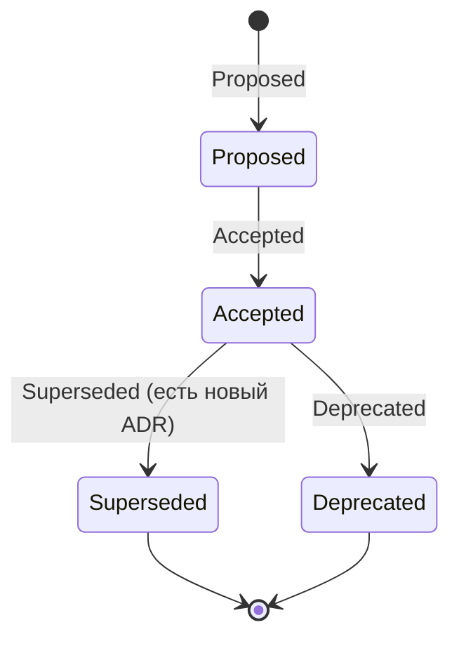
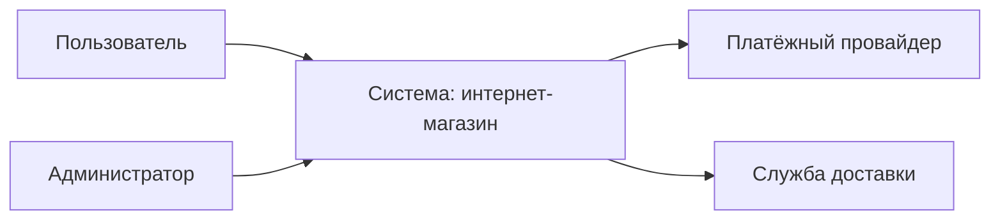
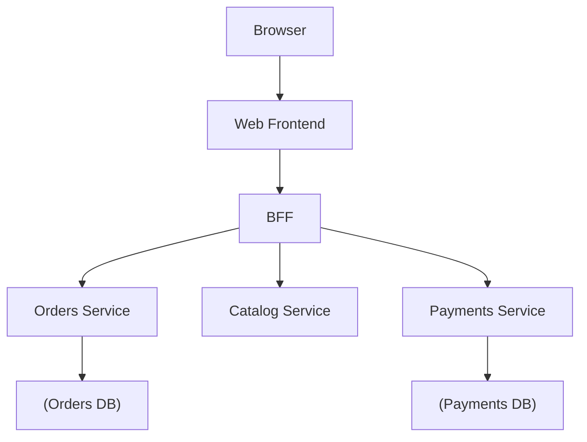
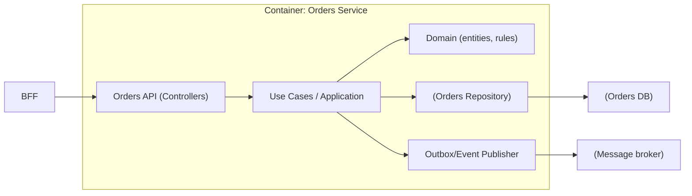
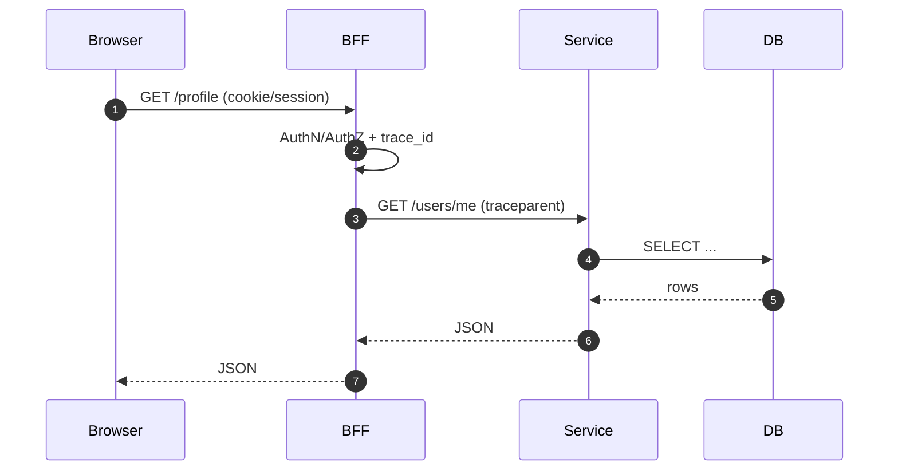
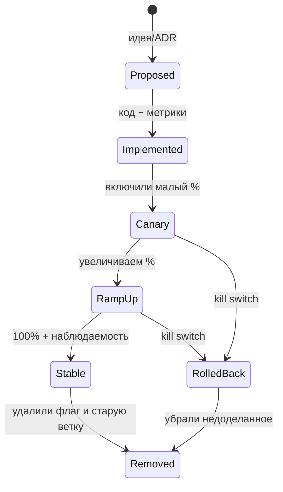

[← Назад к индексу части 32](index.md)

## 32.2 Документация решений и структуры

### Цель раздела

Сделать так, чтобы архитектурные решения:

- были **явными** (а не “в головах”),
- были **проверяемыми** (можно понять, что именно мы выбрали),
- имели **историю** (когда/почему изменили),
- и помогали команде **эволюционировать согласованно**.

### В этом разделе главное

- ADR фиксирует **почему** и **последствия**, а не “красивую теорию”.
- C4 даёт общий язык и уровни детализации: “от карты мира” до “карты района”.
- Документация должна жить рядом с кодом и изменениями: иначе она устаревает.

---

### 32.2.1 ADR: как фиксировать решения и последствия

#### Цель подраздела

Научиться писать ADR так, чтобы он был коротким, полезным и живым.

#### Термины

| Термин | Определение |
| --- | --- |
| **ADR** | Architecture Decision Record — запись решения и его контекста |
| **Status** | Статус ADR: Proposed / Accepted / Superseded / Deprecated (варианты) |
| **Superseded** | ADR заменён новым (ссылка на новый) |

#### Теория и правила

ADR нужен там, где решение:

- влияет на границы/контракты/данные/эксплуатацию;
- сложно/дорого изменить;
- имеет значимые trade‑off’ы;
- будет “всплывать” в будущих спорах и миграциях.

**Когда ADR не нужен:**

- для мелких локальных решений без последствий;
- если решение очевидно и дешево меняется.

**Минимальный шаблон ADR (практичный)**

- Заголовок: “Выбор X для Y”
- Дата, автор(ы), статус
- **Контекст:** почему вопрос возник, какие ограничения
- **Варианты:** что рассматривали (2–3)
- **Решение:** что выбрали
- **Последствия:** плюсы/минусы, риски, что нужно сделать (миграции, обучение), что мы сознательно принимаем
- Ссылки: на диаграммы, тикеты, метрики, RFC

#### Как запомнить (мнемоника, чтобы писать ADR быстро)

Запоминается как “**К‑В‑Р‑П**”:

- **К**онтекст
- **В**арианты
- **Р**ешение
- **П**оследствия

Если в ADR нет хотя бы одного из этих четырёх пунктов — через время документ почти наверняка станет бесполезным.

#### Проверь себя: мнемоника ADR

1. Какой пункт из К‑В‑Р‑П чаще всего “забывают” и почему именно он критичен?  
2. Придумай по одному предложению для каждого пункта К‑В‑Р‑П для решения “вводим feature flags”.  
3. Почему “решение без вариантов” опасно даже если вам кажется, что “и так всё понятно”?

<details><summary>Ответ</summary>

1. Часто забывают “Последствия”: без цены решения ADR превращается в декларацию и не помогает в будущем (неясно, что вы сознательно приняли и почему).  
2. Контекст: “нужно безопасно выкатывать миграции/эксперименты без инцидентов”; Варианты: “без флагов / флаги в ENV / флаг‑сервис”; Решение: “используем release+kill switch флаги с серверным хранением”; Последствия: “быстрый откат, но растёт тестовая матрица, нужен процесс удаления флагов”.  
3. Потому что вы теряете понимание альтернатив и причин. Через время контекст изменится, и вы не сможете оценить, почему тогда отвергли другой путь.

</details>

#### Где хранить ADR и как именовать (чтобы их реально находили)

Самая практичная стратегия — **хранить ADR рядом с кодом**, как часть репозитория (docs as code).

Обычно это выглядит так:

```
repo/
  docs/
    adr/
      ADR-001-use-postgres.md
      ADR-002-api-style-rest.md
      ADR-003-bff-for-web.md
```

Правила, которые повышают “живучесть” ADR:

- **номер + slug** в имени файла (`ADR-003-bff-for-web.md`), чтобы можно было ссылаться стабильно;
- в заголовке ADR оставлять тот же номер (`# ADR-003: ...`);
- ADR должен ссылаться на:
  - диаграмму C4 (если решение меняет структуру),
  - тикеты миграции (если решение требует шагов),
  - метрики/SLI (если решение про качество/производительность).

#### Проверь себя: хранение и именование ADR

1. Почему номер ADR в имени файла помогает миграциям и коммуникации, а не только “красоте”?  
2. Какие два типа ссылок ты бы добавил в ADR про миграцию данных (кроме “тикета”)?  
3. Что будет, если ADR хранить в отдельной вики без связи с PR?

<details><summary>Ответ</summary>

1. Потому что номер даёт стабильную ссылку и позволяет однозначно ссылаться на решение в обсуждениях/тикетах/инцидентах (“см. ADR‑014”).  
2. Ссылка на диаграммы as‑is/to‑be (структура/потоки) и на метрики/дашборды миграции (fill_ratio/mismatch_ratio/latency).  
3. ADR будет оторван от кода: его забудут обновлять, он станет недостоверным и перестанет быть “единым источником правды”.

</details>

#### Жизненный цикл ADR (как это работает в команде, а не на бумаге)

ADR — это не “памятник”. Он может устареть и быть заменён новым. Поэтому важно явно вести статус.



**Как делать Superseded правильно:**

- в старом ADR ставите статус `Superseded` и добавляете ссылку “заменён ADR-00X”;
- в новом ADR указываете, что он заменяет старый (и почему контекст изменился).

Мини‑пример формулировки:

```markdown
Статус: Superseded (заменён ADR-014)
Причина: выросла команда и количество клиентов; один общий BFF стал узким местом.
```

#### Проверь себя: статус и Superseded

1. Чем отличается `Deprecated` от `Superseded` в практическом смысле?  
2. Почему важно, чтобы старый ADR ссылался на новый и наоборот (двусторонняя связь)?  
3. Приведи пример, когда ADR стоит пометить Deprecated, но не Superseded.

<details><summary>Ответ</summary>

1. Deprecated — “не рекомендуем/готовим отказ”, но прямой замены может ещё не быть. Superseded — “заменено конкретным новым решением”.  
2. Чтобы сохранялась трассируемость истории: находя любой ADR, вы можете пройти по цепочке решений и понять эволюцию контекста.  
3. Например, временно прекращаем использовать экспериментальные флаги в проде из‑за регуляторики, но ещё не выбрали замену/процесс.

</details>

#### “Обновлять ADR или писать новый?”

Практическое правило:

- если **решение изменилось** (другая технология/другие границы/другие последствия) — пишите **новый ADR**, а старый помечайте superseded;
- если вы просто уточняете формулировки/ссылки — можно править существующий ADR, но аккуратно (чтобы не переписать историю).

Это важно: ADR ценен историей “почему тогда так”, а не только текущей правдой.

#### Проверь себя: новый ADR vs правка старого

1. Почему “переписать старый ADR под текущую правду” может быть вредно?  
2. Приведи пример изменения, которое точно требует нового ADR.  
3. Какую минимальную правку старого ADR можно считать допустимой без потери истории?

<details><summary>Ответ</summary>

1. Вы теряете исторический контекст и причины, почему решение было разумным тогда; это ломает способность учиться на прошлом и понимать последствия.  
2. Смена архитектурного стиля/границ: “общая БД → БД на сервис”, “REST → gRPC”, “один BFF → BFF по клиентам”.  
3. Уточнение ссылок, орфографии, добавление указания “заменён ADR‑00X” без переписывания исходных аргументов.

</details>

#### Пример ADR (короткий, но “боевой”)

```markdown
# ADR-003: BFF для web-клиента

Статус: Accepted
Дата: 2026-03-17

## Контекст
У web-клиента 8+ сетевых запросов на экран; микросервисы не предназначены для прямого вызова из браузера.
Нужна единая точка auth, логирования и нормализации ошибок.

## Варианты
1) Прямые вызовы микросервисов из браузера
2) Один общий API Gateway как BFF
3) Отдельный BFF под web-клиент

## Решение
Выбираем отдельный BFF под web-клиент.

## Последствия
Плюсы: меньше round-trip’ов, единый слой auth/observability, проще контрактирование.
Минусы: дополнительный hop и слой поддержки; риск "толстого BFF" — вводим правило: доменная логика остаётся в сервисах.
Миграция: внедряем canary для маршрутизации /profile и /orders, затем расширяем.
```

#### Простыми словами

ADR — это “записка из прошлого в будущее”: чтобы через полгода вы не спорили заново и не наступали на те же грабли.

#### Типичные ошибки

- ADR превращают в “книгу” на 20 страниц — никто не читает;
- пишут “мы выбрали X” без контекста и последствий — через месяц уже непонятно зачем;
- ADR пишут, но не поддерживают статусы и связи (superseded).

#### Проверь себя

1. В чём ценность ADR именно в разделе “последствия”?  
2. Когда ADR стоит пометить как superseded?  
3. Почему ADR лучше хранить рядом с кодом, чем в отдельной вики?

<details><summary>Ответ</summary>

1. Потому что последствия — это “цена решения”: что мы усложняем, какие риски берём, какие долги создаём.
2. Когда появилось новое решение, которое заменяет старое (и вы хотите сохранить историю “почему поменяли”).
3. Потому что тогда ADR попадает в тот же процесс ревью, версионирования и релизов, и у него больше шансов оставаться актуальным.

</details>

#### Запомните

ADR отвечает не на “что сделали”, а на “почему сделали и что это нам будет стоить”.

---

### 32.2.2 C4: Context/Container/Component как уровни понимания

#### Цель подраздела

Понять, какие диаграммы реально полезны, и как не утонуть в деталях.

#### Термины

| Уровень | Что показывает | Для кого |
| --- | --- | --- |
| **Context** | Система и её внешние акторы/соседи | бизнес, продукт, вся команда |
| **Container** | Крупные исполняемые части (web, BFF, сервисы, БД) и связи | инженеры, лиды |
| **Component** | Компоненты внутри контейнера (модули, подсистемы) | команда конкретного сервиса |
| **Code** | Детали кода (классы/файлы) | разработчики при реализации |

#### Mermaid‑пример: C4‑Context (упрощённо)



#### Mermaid‑пример: C4‑Container (упрощённо)



#### Mermaid‑пример: C4‑Component (упрощённо, внутри одного контейнера)

Component‑уровень полезен, когда внутри контейнера уже не “одна куча кода”, а есть несколько важных зон ответственности, и вы хотите:

- видеть “кто за что отвечает” внутри сервиса;
- понимать, где границы, где контракты, где точки изменения при миграции.

Пример: `Orders Service` внутри себя разделён на входной API, доменную логику, работу с БД и публикацию событий.



**Почему это “C4‑Component”, а не “диаграмма классов”:**

- компоненты — это “крупные блоки ответственности”, а не отдельные классы/файлы;
- цель — коммуникация о структуре и миграции, а не точная модель кода.

#### Проверь себя: C4‑Component

1. Почему “component” — это не “класс” и не “папка”, а именно ответственность?  
2. В диаграмме `Orders Service` где “границы” и какие контракты/интерфейсы там подразумеваются?  
3. Как component‑диаграмма помогает миграции (приведи один пример шага)?

<details><summary>Ответ</summary>

1. Потому что цель — говорить о стабильных блоках системы, которые меняются медленнее, чем конкретные файлы/классы, и которые важны для коммуникации и миграций.  
2. Границы: вход `API`, выходы `DB` и `MQ`. Контракты: HTTP/JSON на входе, контракт репозитория, контракт события/публикации.  
3. Например, вынести публикацию событий из “везде” в `Outbox/Event Publisher` — это отдельный шаг, который делает поведение более наблюдаемым и мигрируемым.

</details>

#### Правила, чтобы Component‑диаграммы не превращались в шум

- показывайте **5–9 компонентов** на контейнер (примерно), иначе диаграмма перестаёт читаться;
- обязательно подписывайте **контракты/границы**: вход (API), выходы (БД/очередь/внешние сервисы);
- не рисуйте “всё подряд”: показывайте то, что важно для обсуждения решений, тестируемости и миграций.

#### Проверь себя: правила компонентных диаграмм

1. Почему ограничение “5–9 компонентов” полезно именно для команды, а не только для читабельности?  
2. Что будет, если на component‑диаграмме нет выходов (БД/очередей/внешних API)?  
3. Приведи пример “лишнего” компонента, который стоит убрать с диаграммы.

<details><summary>Ответ</summary>

1. Потому что диаграмма — инструмент разговора. Если она перегружена, команда перестаёт её использовать, и “общего языка” не получается.  
2. Теряется понимание границ и зависимости: непонятно, где точки отказа, контрактов и миграций данных/интеграций.  
3. Внутренний helper/утилита или конкретный класс/файл, который не является отдельной зоной ответственности.

</details>

#### Теория и правила

- C4 полезен тем, что у диаграмм есть **масштаб**: вы не смешиваете “карта мира” и “схема проводки”.
- Диаграмма должна отвечать на вопрос **“что за что отвечает”** и **“как связаны части”**, а не “как красиво”.

**Правило качества диаграммы:** если по ней нельзя ответить “где граница ответственности?” и “какие контракты между частями?” — диаграмма не выполняет свою работу.

#### Как запомнить (мнемоника уровня детализации)

Думай “**4C**” (и выбирай ровно тот масштаб, который нужен разговору):

- **C**ontext — “карта мира”: система и окружение
- **C**ontainer — “карта города”: исполняемые части и связи
- **C**omponent — “карта района”: крупные зоны ответственности внутри контейнера
- **C**ode — “план подъезда”: детали реализации (использовать точечно)

#### Проверь себя: выбор масштаба C4

1. Какой уровень C4 ты выберешь, чтобы объяснить “почему у нас появились микросервисы” руководителю продукта?  
2. Какой уровень нужен, чтобы договориться между командами о границе владения данными?  
3. Почему попытка “сразу рисовать Code‑уровень” часто вредна для архитектурных обсуждений?

<details><summary>Ответ</summary>

1. Context (и частично Container).  
2. Container (и при необходимости Component внутри спорного контейнера).  
3. Потому что детали быстро меняются и отвлекают от ключевого: границы, контракты, потоки, последствия.

</details>

#### Простыми словами

C4 — это как карты: глобус (Context), карта города (Container), карта района (Component). Вы не используете глобус, чтобы найти подъезд.

#### Типичные ошибки

- пытаться показать “всё сразу” на одной диаграмме;
- рисовать компоненты без границ владения данными и без контрактов;
- не обновлять диаграммы при изменениях — они становятся вредны.

#### Проверь себя

1. Какой уровень C4 ты выберешь, чтобы объяснить бизнесу интеграции и внешних партнёров?  
2. Какой уровень нужен, чтобы обсудить “нужен ли BFF”?  
3. Почему “Code‑диаграммы” редко нужны как основная архитектурная документация?

<details><summary>Ответ</summary>

1. Context.  
2. Container.  
3. Потому что архитектура чаще про границы и взаимодействия; детали кода меняются быстро и перегружают.

</details>

#### Запомните

C4 — это не “стандарт ради стандарта”, а способ держать правильный уровень детализации.

---

### 32.2.3 Диаграммы потоков и “docs as code”

#### Цель подраздела

Понять, какие диаграммы потоков реально помогают миграциям и эксплуатации, и как обеспечить актуальность.

#### Теория и правила

Помимо C4, обычно нужны диаграммы:

- **поток запроса** (“кто кого вызывает”);
- **поток данных** (“где живёт истина и как данные двигаются”);
- **поток событий** (если EDA: кто публикует, кто потребляет, как обеспечивается идемпотентность).

**Docs as code** — это не “идеология”, а ответ на вопрос: “почему диаграммы всегда устаревшие?”

Рабочий минимум:

- хранить диаграммы и ADR в репозитории (например, `docs/` и `docs/adr/`);
- требовать обновления документации как часть PR, если меняются границы/контракты/данные;
- иметь простое правило ответственности: “кто меняет — тот обновляет”.

**Чуть более зрелый минимум (часто окупается быстро):**

- договориться о триггерах обновления диаграмм:
  - новый/удалённый контейнер (сервис, BFF, БД),
  - изменение протокола/контракта на границе,
  - значимая миграция данных,
  - новый ADR, который меняет структуру/границы;
- сделать диаграммы частью “Definition of Done” для таких изменений;
- хранить ссылки между ADR ↔ диаграммы ↔ тикеты миграции.

#### Инструменты для диаграмм (и когда какой удобнее)

| Инструмент | Когда хорош | Компромиссы |
| --- | --- | --- |
| **Mermaid** | быстро, рядом с кодом, PR‑friendly | ограниченная “графика”, иногда сложно сделать “красиво” |
| **PlantUML** | много нотаций (sequence/class/component), можно генерировать | нужно договориться о стиле, иногда сложнее вход |
| **Structurizr** | особенно хорош для C4 и “архитектуры как модели” | требует дисциплины, иногда отдельный процесс |
| **draw.io (diagrams.net)** | удобно рисовать руками, привычно многим | риск “жить отдельно от кода”, если не хранить файлы в репо |

**Генерация из кода (опционально):**

- иногда полезно генерировать диаграммы зависимостей модулей/пакетов, чтобы видеть “дрейф” (но это не заменяет C4);
- важно помнить: генерация показывает то, что есть в коде, но не объясняет “почему так” — это роль ADR.

#### Проверь себя: выбор инструмента диаграмм

1. Почему Mermaid часто выигрывает для “docs as code”, даже если картинки не идеальны визуально?  
2. В каком случае Structurizr лучше простых mermaid‑диаграмм?  
3. Почему “генерация диаграмм из кода” не заменяет ADR?

<details><summary>Ответ</summary>

1. Потому что Mermaid легко хранить рядом с кодом, ревьюить в PR и поддерживать актуальность без отдельного процесса.  
2. Когда команда хочет системно вести C4‑модель и связать её с архитектурными решениями/эволюцией как с “моделью”, а не набором картинок.  
3. Генерация показывает структуру факта, но не объясняет мотивы, альтернативы и последствия — а это делает ADR.

</details>

#### Пример: диаграмма потока запроса (когда она нужна)

Если вы мигрируете BFF или меняете аутентификацию, очень полезно зафиксировать:

- где именно проверяется токен;
- где добавляется `trace_id`;
- кто отвечает за кэш;
- какие зависимости критичны.



#### Типичные ошибки

- “диаграммы в Miro” без версии, без истории, без триггеров обновления;
- диаграммы показывают “как хотелось бы”, а не “как есть”;
- в диаграммах нет границ данных (кто владеет чем).
- у диаграмм нет владельца: “вроде бы должны обновлять”, но никто не обновляет.

#### Проверь себя

1. Какой триггер ты бы ввёл для обновления C4‑Container диаграммы?  
2. Почему “as‑is диаграмма” должна быть честной, даже если она выглядит некрасиво?  
3. Что произойдёт, если команда не согласует нотацию диаграмм?

<details><summary>Ответ</summary>

1. Любое изменение состава контейнеров/их связей (новый сервис/удаление сервиса/смена протокола/появление BFF).
2. Иначе миграция будет планироваться по ложной карте: вы будете удивляться зависимостям и “почему всё сломалось”.
3. Диаграммы станут непохожими друг на друга, их будет трудно читать и сравнивать; документация перестанет быть общим языком.

</details>

#### Запомните

Документация без процесса обновления — это не помощь, а потенциальная ловушка.

---

### 32.2.4 Feature flags как инструмент эволюции

#### Цель подраздела

Понять, что feature flags — это не только про “эксперименты”, но и про **управляемые миграции** и **безопасный откат**.

#### Теория и правила

Feature flag даёт вам:

- **управление включением** (кто видит новое);
- **быстрый откат** (kill switch);
- **постепенное наращивание** (проценты, группы, регионы).

Но у флагов есть цена:

- они создают **ветвление поведения** (сложнее тестировать);
- их нужно **убирать** (иначе растёт техдолг);
- они должны быть наблюдаемы: “какой флаг был включён” должно попадать в логи/трейсы (без чувствительных данных).

**Практическое правило:** у каждого флага должен быть:

- владелец,
- срок жизни,
- критерии удаления.

#### Важное уточнение: флаги бывают разные (и ими решают разные задачи)

| Тип флага | Зачем | Пример | Почему это важно |
| --- | --- | --- | --- |
| **Release flag** | постепенный релиз/миграция | “новый расчёт скидки” | помогает canary и откат, должен быть временным |
| **Ops/Kill switch** | аварийное отключение | “выключить интеграцию с провайдером” | должен быть максимально быстрым и надёжным |
| **Experiment flag** | A/B, эксперименты | “новый экран” | нужна статистика/аудит и контроль сегментов |
| **Permission/Entitlement** | доступ по правам | “фича только премиум” | часто живёт долго, но не должен смешиваться с release‑флагами |

Если смешать типы, получится хаос: “включили фичу для миграции”, а она внезапно “навсегда” стала правом доступа.

#### Проверь себя: типы флагов

1. Почему нельзя использовать “permission‑флаг” как временный release‑флаг миграции?  
2. Приведи пример ops/kill switch флага и объясни, какое поведение должно быть у системы при его срабатывании.  
3. Какой из типов флагов чаще всего порождает техдолг — и почему?

<details><summary>Ответ</summary>

1. Потому что permission‑флаг обычно живёт долго и становится частью модели прав, а release‑флаг должен быть временным и удаляться после стабилизации. Смешение ломает процесс удаления и тестирование.  
2. Например “выключить оплату провайдером X”: система должна деградировать (показать альтернативы/понятное сообщение), а не падать; отклик должен быть быстрым и без деплоя.  
3. Release‑флаги, если их не удаляют: они создают ветвление логики и растят матрицу тестирования.

</details>

#### Где хранить флаги (и почему это архитектурный вопрос)

По плану важно понимать, что “флаг” — это не только `if` в коде. Ему нужно хранилище и доставка значений.

- **Конфиг/ENV (простое):**
  - плюс: просто и надёжно;
  - минус: чтобы поменять — часто нужен деплой/рестарт, плохо для canary.
- **БД (своя таблица) или config‑service:**
  - плюс: менять без деплоя, можно таргетировать (проценты/группы);
  - минус: нужно думать о кэше, отказах, консистентности, аудит‑логах.
- **Выделенный сервис фич‑флагов (hosted или self‑hosted):**
  - плюс: продвинутый таргетинг, аудит, UI, SDK;
  - минус: зависимость (и её нужно делать устойчивой: кэш, fallback “по умолчанию”).

**Архитектурное правило:** если сервис флагов недоступен, система должна продолжать работать в **безопасном default‑режиме** (например “новое выключено”), иначе вы добавили новую точку отказа.

#### Проверь себя: хранение флагов и default

1. Почему “флаг‑сервис” становится новой критичной зависимостью и как это смягчить?  
2. Что значит “безопасный default” в примере миграции write‑path?  
3. Почему ENV‑флаги часто плохи для canary, но хороши для kill switch (в некоторых системах)?

<details><summary>Ответ</summary>

1. Если он недоступен — система может потерять способность принимать решение о ветке. Смягчение: локальный кэш, TTL, fallback, деградация “new off”, отказоустойчивость сервиса.  
2. Обычно “новая запись выключена”: система пишет по старому пути, чтобы не создавать необратимых данных, пока нет контроля.  
3. ENV часто требуют деплой/рестарт, что плохо для плавного управления процентом. Но для kill switch иногда выбирают максимально простой и надёжный механизм (в зависимости от инфраструктуры).

</details>

#### Флаги и консистентность: неприятная правда

Флаг может влиять на то, **как пишутся данные**. Тогда “разные пользователи” начинают жить в разных мирах данных.

Примеры опасных ситуаций:

- один пользователь записал заказ “по новой схеме”, другой сервис прочитал “по старой”;
- часть трафика пошла на новый алгоритм, но отчёты/аналитика продолжают считать по старому.

Практика:

- для “пишущих” флагов (write‑path) нужны отдельные меры: совместимость схемы (expand/contract), миграция данных, метрики расхождений;
- для “читающих” флагов (read‑path) проще, но тоже возможны расхождения в UX и кэше.

#### Проверь себя: флаги и консистентность

1. Почему write‑path флаги опаснее read‑path флагов?  
2. Приведи пример, как флаг может “сломать” совместимость данных между сервисами.  
3. Какой дополнительный механизм нужен, если флаг влияет на запись данных (назови 2–3)?

<details><summary>Ответ</summary>

1. Потому что они меняют состояние мира (данные). Разные ветки могут записывать по разным правилам, и потом чтение/инварианты ломаются.  
2. Новый код записал поле/формат, который старый потребитель не умеет читать; или поменял смысл значения без версии/контракта.  
3. Expand/contract, backfill, идемпотентность, метрики расхождений, план отката данных.

</details>

#### Mermaid‑схема: жизненный цикл флага (чтобы не копить техдолг)



#### Проверь себя: жизненный цикл флага

1. В какой момент флаг должен быть удалён и почему это часть “завершения миграции”?  
2. Чем полезен отдельный переход “RolledBack → Removed”?  
3. Какой артефакт (документ/тикет/ADR) должен сопровождать появление флага в серьёзной миграции?

<details><summary>Ответ</summary>

1. После стадии Stable (или после rollback) — когда принято решение, что флаг больше не нужен. Иначе код навсегда останется разветвлённым.  
2. Чтобы не оставлять “мертвый код” и недоделки: откатились — всё равно убираем временную ветку/флаг, иначе копится техдолг.  
3. Минимум: ADR или тикет миграции с owner/сроком/критериями удаления, плюс метрики контроля.

</details>

#### Пошагово: как использовать флаг как инструмент миграции (а не как “временный костыль навсегда”)

1. **Определи тип флага** (release/kill/experiment/permission) и запиши это (в ADR или в описании флага).
2. **Сделай безопасный default.** Если флаг недоступен — выбираем безопасный путь.
3. **Добавь наблюдаемость.** В лог/трейс добавляй “какие флаги активны” (на уровне запроса), но не чувствительные значения.
4. **Определи план удаления.** Что должно произойти, чтобы флаг можно было удалить (метрики стабильности, сроки).
5. **Удаляй старые ветки.** Завершение миграции = удаление флага + удаление legacy‑логики.

#### Простыми словами

Флаг — это рубильник. Но если у вас в щитке 200 рубильников без подписей — это уже опасно.

#### Проверь себя

1. Почему флаги усложняют тестирование?  
2. Что такое kill switch и почему он важен при canary?  
3. Почему “флаг навсегда” почти всегда плохая идея?

<details><summary>Ответ</summary>

1. Потому что появляется несколько веток поведения: надо проверять комбинации и переходы.
2. Kill switch — мгновенное выключение новой ветки без деплоя. Canary без kill switch делает риск неконтролируемым.
3. Потому что это постоянная сложность в коде и риск неожиданных комбинаций поведения; лучше завершать миграции удалением временных механизмов.

</details>

#### Запомните

Feature flags — это сила только при дисциплине: владелец, срок, удаление.

---
