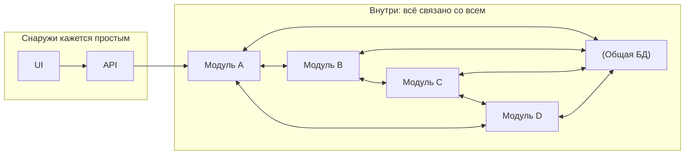
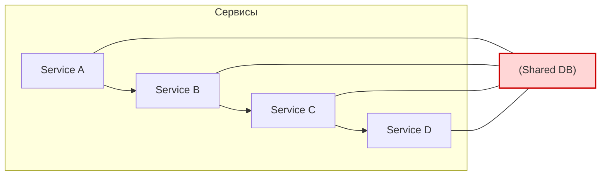
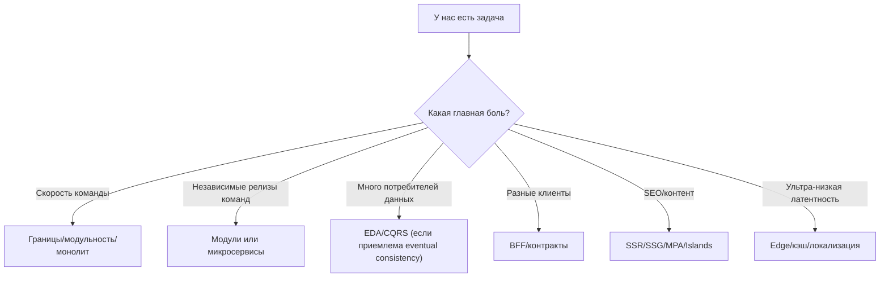
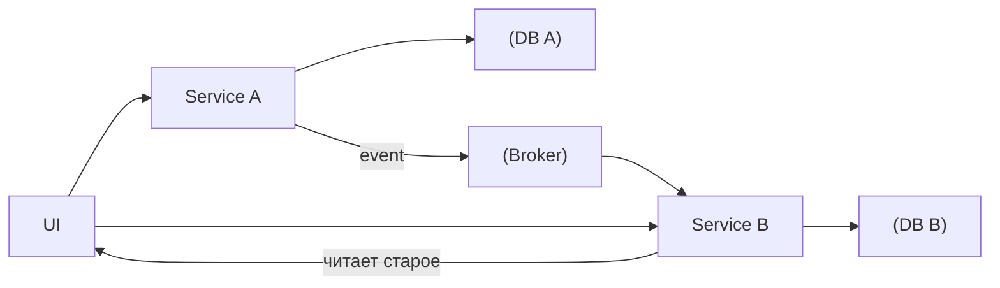
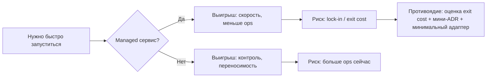

[← Назад к индексу части 33](index.md)

## 33.1 Антипаттерны

### Цель раздела

Научиться быстро распознавать архитектурные “плохие формы”, понимать их причины и последствия, и видеть **куда копать**: в код, границы, контракты, данные, эксплуатацию или организацию команд.

### В этом разделе главное

- Антипаттерн — это не “плохой стиль”. Это **структура**, которая делает улучшения дорогими и рискованными.
- Многие антипаттерны появляются из **разумных локальных решений**, но без общей модели контекста.
- Почти всегда антипаттерн лечится не “переписать всё”, а **сделать границы явными** и **эволюционировать по шагам** (часть 32).

### Термины

| Термин | Определение |
| --- | --- |
| **Связность (cohesion)** | Насколько элементы внутри модуля связаны одной задачей (высокая связность обычно хорошо) |
| **Связанность (coupling)** | Насколько сильно модуль зависит от других (высокая связанность обычно плохо) |
| **Граница** | Место, где меняются правила владения/ответственности/контракта |
| **Контракт** | Явная договорённость о входах/выходах (API, события, схемы данных, lifecycle) |

---

### 33.1.1 Big Ball of Mud

#### Цель подраздела

Понять, что такое “ком грязи”, как он формируется, почему он становится устойчивым, и как его диагностировать **по симптомам**, а не по эстетике.

#### Термины

| Термин | Суть |
| --- | --- |
| **Big Ball of Mud** | Система без явной структуры: “всё везде”, связность высокая, границы размыты |
| **Глобальное состояние** | Состояние/данные, которыми пользуются многие части без явных контрактов |
| **Эрозия архитектуры** | Постепенное размывание правил и границ под давлением изменений |

#### Проверь себя по терминам

1. Чем “Big Ball of Mud” отличается от “просто старого кода”? Назови признак, который видно по поведению системы, а не по стилю.  
2. Почему глобальное состояние усиливает связанность даже в хорошо написанном коде?  
3. Что такое “эрозия архитектуры” и какой один ранний сигнал ты бы искал в команде/процессе?

<details><summary>Ответ</summary>

1. Старый код может быть аккуратным и при этом работать. Big Ball of Mud проявляется системно: маленькое изменение тянет каскад правок и риск по всей системе; границы размыты.  
2. Потому что многие части начинают зависеть от одного неявного “мира”: общий формат/инварианты/порядок обновлений. Это скрытая зависимость и источник каскадных эффектов.  
3. Это постепенное разрушение правил и границ под давлением изменений. Ранний сигнал: “временные решения” становятся нормой без фиксации и без уборки (нет deprecation/нет удаления/нет ADR/нет ownership).

</details>

#### Теория и правила

**Как возникает Big Ball of Mud (типовой путь):**

1. В начале проект маленький: “давайте просто сделаем”.
2. Первые компромиссы оправданы: быстрее выпустить фичу.
3. Компромиссы не фиксируются как временные: “потом разберём”.
4. Добавляются новые люди/сроки/требования → “копируем подход”.
5. Появляется **страх изменений**: “не трогай, упадёт”.
6. Структура становится вторичной: система живёт на латках.

**Ключевой механизм:** отсутствие границ означает, что изменение в одном месте затрагивает много мест. Это делает изменения опасными и дорогими → команда начинает избегать улучшений → структура деградирует ещё быстрее.

#### Простыми словами

Это как квартира, где:

- нет комнат, а одна большая площадь,
- все вещи перемешаны,
- и чтобы найти нужное, надо переложить половину дома.

#### Картинка в голове

Антипаттерн как “красивая картинка снаружи, внутри — спагетти зависимостей”:



#### Как запомнить

**Если “изменение маленькое, а затрагивает полсистемы” — это сигнал Big Ball of Mud.**

#### Примеры (симптомы)

- **Симптом 1:** “Чтобы добавить поле на экран, нужно поменять 7 мест и 3 команды”.
- **Симптом 2:** “Один тестовый кейс требует поднять почти всё окружение”.
- **Симптом 3:** “Невозможно объяснить новичку, где что лежит и кто за что отвечает”.
- **Симптом 4:** “Любая оптимизация превращается в охоту на зависимости”.

#### Практика / реальные сценарии (как лечить)

Лечение почти всегда начинается не с “переписать всё”, а с минимальных правил:

1. **Сделать границы явными** (модули/пакеты/сервисы): кто за что отвечает.
2. **Сделать контракты явными**: где API, где схемы, где жизненный цикл.
3. **Запретить циклы зависимостей** на уровне модулей (часть 5).
4. **Выделить “ядро” и “адаптеры”** (части 6–7): отрезать внешнее от внутреннего.
5. Эволюция по частям (часть 32): Strangler Fig для наиболее “болезненных” зон.

#### Типичные ошибки

- лечить Big Ball of Mud только “рефакторингом внутри файлов”, не меняя границы;
- пытаться сразу сделать идеальную архитектуру (получить новый Big Ball, только с красивыми папками);
- не фиксировать правила и ownership (эрозия повторится).

#### Что будет если…

- если ничего не делать, скорость изменений падает, инциденты растут, команда становится заложником “опасных мест”, и архитектурный долг превращается в бизнес‑долг.

#### Проверь себя

1. Назови два признака Big Ball of Mud, которые не связаны с “красотой кода”.  
2. Почему “давайте перепишем всё” часто усиливает риск, а не снижает?  
3. Какие 2–3 минимальных правила ты бы ввёл, чтобы остановить эрозию?

<details><summary>Ответ</summary>

1. Масштаб каскадных изменений, страх релизов, отсутствие ясных границ/ownership, невозможность локализовать причины.  
2. Потому что big‑bang увеличивает риск, даёт долгий период без ценности и усложняет проверку; чаще безопаснее эволюция кусками.  
3. Явные границы модулей/пакетов, запрет циклов, явные контракты (схемы/версии), минимум документации границ (C4 Container) и мини‑ADR для значимых решений.

</details>

#### Запомните

Big Ball of Mud — это не “грязный код”, а **отсутствие границ и правил**, которое делает изменения опасными.

---

<a id="3312-raspredelyonnyy-monolit-распределённый-монолит"></a>
### 33.1.2 Распределённый монолит

#### Цель подраздела

Научиться отличать “настоящие микросервисы” от “распределённого монолита”: когда сервисов много, а независимости нет.

#### Термины

| Термин | Суть |
| --- | --- |
| **Распределённый монолит** | Сервисы отдельно, но изменения всё равно синхронные и каскадные |
| **Database-per-service** | Каждый сервис владеет своими данными, нет “общей БД для всех” |
| **Контракт** | Правила совместимости API/событий между сервисами |

#### Проверь себя по терминам

1. Почему “распределённый монолит” — это не просто “плохие микросервисы”, а отдельная форма проблемы?  
2. Что именно означает database‑per‑service (что “нельзя” делать в идеале)?  
3. Почему контракт важнее “внутренней реализации” при независимых релизах?

<details><summary>Ответ</summary>

1. Потому что проблема не в количестве сервисов, а в отсутствии независимости: вы получаете цену распределённости, но не получаете автономность изменений (релизы, данные, контракты).  
2. Каждый сервис владеет своими данными и инвариантами; другие сервисы не должны напрямую читать/писать его таблицы как “внутренность” (иначе это скрытая зависимость).  
3. Потому что потребители зависят от формы/смысла входов‑выходов. Если контракт нестабилен, независимый релиз превращается в “релизный поезд” и инциденты.

</details>

#### Теория и правила

Распределённый монолит обычно появляется, когда “разрезали по процессам”, но **не разрезали по ответственности и данным**.

Типовые причины:

- **общая БД** или общие таблицы, которые читают/пишут разные сервисы;
- **жёсткая синхронная цепочка вызовов** без устойчивости и деградации;
- **общие shared‑пакеты с доменной логикой**, которые все тащат одной версией;
- отсутствие контрактов и совместимости: “обновили сервис A — упал B”.

#### Mermaid‑диаграмма: “формально микросервисы, фактически монолит”



**Ключевая мысль:** если данные общие и нет владения — сервисы не могут эволюционировать независимо.

#### Простыми словами

Это как разделить одну команду на четыре комнаты и сказать “теперь у нас четыре команды”, но оставить им:

- одну общую доску задач,
- один общий ключ от кассы,
- и требование выходить на работу только вместе.

Форма изменилась, а независимость — нет.

#### Как запомнить

**Микросервисы = независимость релиза + владение данными + контрактность + наблюдаемость.**  
Если нет хотя бы двух первых пунктов — риск распределённого монолита очень высокий.

#### Примеры (симптомы)

- релиз “одного сервиса” требует релиза 5 сервисов;
- падение сервиса B ломает весь продукт (нет деградации);
- инциденты “плавающие”: сегодня упало в A из‑за изменения в C;
- схемы БД меняются централизованно “для всех”;
- невозможно определить, кто владелец конкретной таблицы/события.

#### Практика / реальные сценарии (как лечить)

Лечение — это почти всегда **про данные и контракты**:

1. Уточнить **владение данными**: какая команда владеет какой сущностью (и таблицами/проекциями).
2. Ввести правило: доступ к данным чужого сервиса — только через **API/события**, а не через прямой SQL.
3. Ввести **контрактность**:
   - версионирование API,
   - совместимость событий,
   - CDC/контрактные проверки (часть 30 для фронт–бекенд, аналогично для сервисов).
4. Снизить глубину синхронных цепочек: кэш, асинхронность, деградация, timeouts/bulkheads (части 19, 31).
5. Эволюция по шагам: Strangler Fig и постепенное переключение (часть 32).

#### Пошагово: план выхода из distributed monolith (реалистично, по шагам)

Ниже — один из самых практичных “скелетов” выхода. Он не требует “переписать всё”, но требует дисциплины.

##### Шаг 0. Согласовать цель и охранные метрики (чтобы лечение не стало деградацией)

Перед изменениями определите 2–3 охранные метрики:

- error rate (5xx),
- p95/p99 latency на ключевых потоках,
- MTTR (время локализации/восстановления),
- “пачка релизов” (сколько сервисов приходится релизить вместе).

##### Шаг 1. Ввести ownership данных (даже если БД пока общая)

Цель: перестать жить в режиме “все правят всё”.

- Таблица/сущность → владелец (команда/сервис) → кто читает/пишет.
- **Запрет записи “не владельцу”** — самый сильный первый шаг.
- Чтение “чужих” данных переводить на API/события владельца там, где риск высокий.

##### Шаг 2. Сделать контракты и совместимость обязательными

Цель: релиз одного сервиса не должен ломать других “внезапно”.

- формализованные контракты (API + события),
- правила deprecate → remove,
- автоматическая проверка (CDC/verification).

##### Шаг 3. Срезать синхронную связанность (уменьшить глубину цепочек)

Цель: падение одной зависимости не должно падать “всем продуктом”.

- ограничить цепочки до 2–3 hops, где возможно,
- добавить деградацию, кэш, асинхронность там, где eventual consistency допустима,
- обязательные таймауты/retry/breaker (часть 31).

##### Шаг 4. Развязать shared‑пакеты и “релизные сцепки”

Цель: перестать релизить “пачками”.

- отделить инфраструктурные shared‑пакеты (либы, типы) от доменной логики,
- доменная логика должна иметь владельца и не быть “общей для всех” без строгого процесса версий,
- вводить правила совместимости версий (semver + политика обновления).

#### Mermaid‑схема: что обычно “держит” distributed monolith

```mermaid
flowchart TB
  subgraph Coupling["Причины жёсткой связанности"]
    DB["(Shared DB)"]
    SH["Shared domain packages"]
    SYNC["Deep sync call chains"]
    NC["No contracts / no compatibility"]
  end

  subgraph Effects["Эффекты"]
    R["Release train\n("релизы пачкой")"]
    I["Cascading incidents"]
    U["Unclear ownership"]
  end

  DB --> R
  SH --> R
  SYNC --> I
  NC --> I
  DB --> U
  NC --> U
```

#### Метрики прогресса (как понять, что вы реально выходите)

| Что измеряем | Признак прогресса |
| --- | --- |
| **Пачка релизов** | уменьшается число “обязательных совместных релизов” |
| **MTTR** | быстрее локализуется причина (трейсы/ownership) |
| **Blast radius** | падает доля инцидентов, влияющих на весь продукт |
| **Совместимость** | меньше “внезапных” падений потребителей после релиза |

#### Проверь себя по плану выхода

1. Почему “Шаг 1 (ownership данных)” стоит раньше “Шага 3 (срезать синхронность)”? Приведи причинно‑следственную связь.  
2. Какие 2 охранные метрики ты бы выбрал(а) именно для своего продукта — и почему они покажут “мы лечим, а не деградируем”?  
3. Представь, что “пачка релизов” уменьшилась, но MTTR не улучшился. Что это может означать и куда копать?

<details><summary>Ответ</summary>

1. Без ownership данные остаются общими и неявными: сервисы всё равно “тянут друг друга” через схему/инварианты. Даже если вы сократите синхронные вызовы, вы сохраните скрытую связанность и точки невозврата. Ownership делает независимость возможной в принципе.  
2. Например, error rate и p95/p99 для ключевого user‑flow: они отражают реальное качество для пользователя. Плюс “пачка релизов” или MTTR как инженерная метрика, чтобы видеть автономность и диагностику.  
3. Это может означать, что observability/ownership всё ещё слабые: инциденты локализуются долго, нет trace‑корреляции, нет явных владельцев контуров, или проблема в общей инфраструктуре (shared DB/cache) продолжает давать “плавающие” симптомы.

</details>

#### Типичные ошибки

- пытаться “лечить” распределённый монолит только добавлением service mesh (mesh полезен, но не создаёт владения данными);
- оставлять общую БД “потому что проще” без плана выхода;
- “написать много API”, но без правил совместимости и без контрактных проверок.

#### Что будет если…

- если не лечить, система будет иметь цену распределённой архитектуры (сложность) без преимуществ (независимость), и это один из самых дорогих вариантов.

#### Проверь себя

1. Почему общая БД для всех микросервисов почти неизбежно создаёт распределённый монолит?  
2. Назови два “анти‑симптома”: признаки, что независимость реально есть.  
3. Почему “у нас Kubernetes” не является доказательством, что у вас микросервисы “по сути”?

<details><summary>Ответ</summary>

1. Потому что изменения схемы и инвариантов становятся общими, а сервисы зависят от внутренних деталей данных друг друга; исчезает возможность независимой эволюции.  
2. Например: сервис можно релизить независимо; схема данных меняется только командой‑владельцем; потребители не падают при эволюции API/событий (есть обратная совместимость).  
3. Kubernetes решает инфраструктуру, но не решает границы, контракты и владение данными — то есть основу архитектурной независимости.

</details>

#### Запомните

Распределённый монолит чаще всего “лечится” не переписыванием, а **владением данными + контрактностью + уменьшением синхронной связности**.

---

<a id="3313-zolotoy-molotok-золотой-молоток"></a>
### 33.1.3 Золотой молоток

#### Цель подраздела

Научиться распознавать “один подход для всего” и заменять его вопросами про контекст и trade‑off’ы.

#### Термины

| Термин | Суть |
| --- | --- |
| **Золотой молоток** | Одна технология/архитектура применяется к любой задаче |
| **Контекст** | Команда, домен, нагрузка, сроки, ограничения, эксплуатация |
| **Trade‑off** | Что выигрываем и чем платим |

#### Проверь себя по терминам

1. Приведи пример “золотого молотка” из практики (в любую сторону: микросервисы/события/SPA) и назови цену этого выбора.  
2. Какие 3 элемента контекста могут сделать “модную” архитектуру неуместной?  
3. Чем trade‑off отличается от “плюсы/минусы в вакууме”?

<details><summary>Ответ</summary>

1. Например: “всё в микросервисах” при 3 разработчиках → цена: CI/CD, observability, контракты, отладка цепочек, данные; выигрыш независимости не окупается.  
2. Размер/зрелость команды, сроки/ограничения, требования к эксплуатации/безопасности (и наличие этих практик).  
3. Trade‑off всегда привязан к цели и ограничениям: что именно улучшаем и чем конкретно платим (в TCO/рисках/скорости/надёжности), а не абстрактный список.

</details>

#### Теория и правила

Золотой молоток появляется из:

- успеха в прошлом (“в прошлой компании микросервисы спасли”);
- желания стандартизировать (“один стек проще учить”);
- давления трендов и “статусности” решений;
- неправильного измерения цели: путают “архитектура” и “качество продукта”.

**Правило:** если решение не сопровождается явным ответом “какую боль решаем” и “какую цену платим” — риск золотого молотка высокий.

#### Простыми словами

Если у тебя есть молоток, любая проблема выглядит как гвоздь. Но архитектурные проблемы бывают “гвозди”, “болты”, “клей” и “проводка” — и молотком можно только ухудшить.

#### Картинка в голове (мини‑решатель)



Это не “правильные ответы”, а напоминание: **первый вопрос — про боль и контекст**, а не про технологию.

#### Примеры

- “Мы всё делаем событиями” → появляется сложность консистентности и диагностики, там где хватило бы REST.
- “Мы всё делаем микросервисами” → много деплоев и контрактов, хотя домен простой и команда маленькая.
- “Мы всё делаем SPA” → проблемы SEO/перформанса там, где MPA/SSR проще.

#### Типичные ошибки

- смешивать стандартизацию стека (полезно) и стандартизацию архитектуры (опасно);
- использовать “архитектурные слова” как замену анализа (пример: “нам нужен DDD” без понимания границ и стоимости).

#### Проверь себя

1. Назови три вопроса, которые разрушат “решение по моде”.  
2. В каких случаях стандартизация оправдана, даже если не идеально?  
3. Почему золотой молоток часто появляется в организациях с сильной политикой “один стек”?

<details><summary>Ответ</summary>

1. “Какую боль решаем?”, “Какие альтернативы и trade‑off’ы?”, “Какая цена эксплуатации и изменений?”  
2. Когда цена поддержки нескольких стеков выше, чем цена “неидеальности” одного, и есть стратегия эволюции.  
3. Потому что “один стек” легко превращается в “одна архитектура”: организационно это проще объяснить, но технически часто неверно.

</details>

#### Запомните

Золотой молоток лечится вопросом: **“какой контекст делает этот выбор разумным?”**

---

<a id="3314-prezhdevremennaya-abstrakciya-преждевременная-абстракция"></a>
### 33.1.4 Преждевременная абстракция

#### Цель подраздела

Понять, почему “много уровней абстракции” не равно “хорошая архитектура”, и как отличать полезную абстракцию от декоративной.

#### Термины

| Термин | Суть |
| --- | --- |
| **Преждевременная абстракция** | Абстракции, которые появились до реальной необходимости |
| **Сложность** | Количество вещей, которые нужно держать в голове, чтобы изменить систему |
| **Стоимость изменения** | Время, риск и количество затронутых частей при изменении |

#### Проверь себя по терминам

1. Как “сложность” в этом разделе отличается от “количества строк кода”?  
2. Почему “стоимость изменения” часто растёт нелинейно при преждевременных абстракциях?  
3. Приведи пример: какая абстракция была бы преждевременной в твоём проекте и почему?

<details><summary>Ответ</summary>

1. Сложность — это количество концепций и связей, которые нужно держать в голове, чтобы безопасно поменять поведение. Строк кода может быть мало, а сложность — высокой (много слоёв/обёрток/неявных правил).  
2. Потому что изменение начинает проходить через цепочки: интерфейсы, фабрики, адаптеры, конфиги, тестовую матрицу. Каждая новая “обвязка” добавляет места, где можно ошибиться, и усложняет диагностику.  
3. Например, “плагинная система провайдеров” при наличии одного провайдера и отсутствия реального сценария добавления второго в горизонте — вы платите сложностью сейчас без выгоды.

</details>

#### Теория и правила

Абстракция полезна, когда:

- есть **несколько реальных вариантов** реализации сейчас (или устойчиво ожидаются);
- есть **стабильная граница** (контракт), которая живёт дольше конкретных деталей;
- абстракция уменьшает связанность и повышает тестируемость.

Абстракция вредна, когда:

- появляется “на всякий случай”;
- делает путь выполнения непрозрачным;
- множит сущности (интерфейс → фабрика → провайдер → адаптер) без выигрыша.

**Практическое правило:** абстракция должна отвечать на вопрос “какую конкретную связность/риск она уменьшает?”.

#### Простыми словами

Это как построить 5 этажей лестниц и коридоров “на будущее расширение”, когда у вас пока одна комната. Ходить неудобно уже сейчас, а расширение может и не случиться.

#### Пример (типовая ловушка)

Вместо:

- `OrderService` вызывает `PaymentProvider` (один реальный провайдер),

делают:

- `IPaymentProvider` + `PaymentProviderFactory` + `PaymentProviderRegistry` + `PaymentProviderAdapter` + “универсальные DTO”.

Если провайдер один и не планируется второй в горизонте, это чаще всего:

- увеличит количество кода,
- усложнит отладку,
- увеличит поверхность ошибок,
- не даст реальной гибкости (потому что настоящая гибкость упирается в контракты, данные, тесты, а не в интерфейсы).

#### Типичные ошибки

- строить архитектуру под “возможные будущие требования”, которые не подтверждены;
- вводить абстракции ради “красоты слоёв”, а не ради границ;
- путать “интерфейсы” и “контракты” (контракт — это про вход/выход и ответственность, а не про `interface`).

#### Проверь себя

1. Назови один пример полезной абстракции и один пример преждевременной.  
2. Почему “interface ради тестов” иногда ошибочный аргумент?  
3. Какой вопрос ты задашь, чтобы понять, нужна ли абстракция сейчас?

<details><summary>Ответ</summary>

1. Полезная: порт репозитория в гексагональной архитектуре, когда у вас есть внешняя БД и тесты/интеграции. Преждевременная: фабрика провайдеров при единственном провайдере и отсутствии сценария расширения.  
2. Потому что тестируемость часто достигается структурой кода и границами ответственности, а не количеством интерфейсов; можно тестировать через реальные адаптеры в интеграционных тестах.  
3. “Какая реальная боль/связность сейчас уменьшится?” и “Есть ли минимум два реальных варианта реализации в обозримом горизонте?”

</details>

#### Запомните

Абстракция — это инструмент. Если она не уменьшает связанность и риск — она увеличивает сложность.

---

<a id="3315-ignorirovanie-konsistentnosti-игнорирование-консистентности"></a>
### 33.1.5 Игнорирование консистентности

#### Цель подраздела

Понять, что в распределённых системах и даже внутри одного приложения **консистентность — это явный выбор**, а “как-нибудь сойдётся” приводит к плавающим багам.

#### Термины

| Термин | Суть |
| --- | --- |
| **Консистентность** | Правила, по которым разные части системы видят и обновляют данные |
| **Eventual consistency** | Разрешаем временную рассинхронизацию, но ожидаем сходимость |
| **Идемпотентность** | Повтор операции не должен приводить к двойному эффекту |

#### Проверь себя по терминам

1. Что именно делает eventual consistency “приемлемой” (какое условие обязательно)?  
2. Почему идемпотентность — обязательная часть архитектуры при ретраях, а не “опция”?  
3. Приведи пример, где консистентность должна быть строгой, и пример, где можно eventual. Объясни почему.

<details><summary>Ответ</summary>

1. Должна быть определена сходимость: какая система/правило является источником истины, и как/когда состояния приходят к согласованию (включая обработку повторов/порядка).  
2. Потому что ретраи неизбежны (сеть/таймауты). Без идемпотентности повтор превращается в двойной эффект (деньги/письма/заказы).  
3. Строгая: списание денег/баланс. Eventual: рекомендации/аналитика. Цена ошибки и требования к корректности разные.

</details>

#### Теория и правила

Антипаттерн “игнорирование консистентности” выглядит так:

- события публикуются “как получится”,
- повторные доставки не учитываются,
- порядок сообщений не гарантирован,
- чтение и запись разнесены, но никто не определил, что является истиной,
- “в разных местах разные правила”.

**Почему это опасно:** появляется класс ошибок, которые:

- редкие,
- зависят от тайминга,
- трудно воспроизвести на стенде,
- вызывают недоверие к системе и к данным.

#### Mermaid‑схема: “два источника истины без правил”



Если не определено:

- кто владеет сущностью,
- какие события являются “истиной”,
- как обрабатываем повтор/порядок,

то UI будет видеть “то так, то так”.

#### Простыми словами

Это как если два человека ведут один и тот же список покупок, но:

- иногда пишут в разные блокноты,
- иногда забывают синхронизироваться,
- иногда один пишет “молоко”, другой “молоко уже куплено”.

Без правил вы будете спорить “кто прав”, а не решать задачу.

#### Практика (минимальные правила, чтобы не утонуть)

Если вы допускаете eventual consistency:

- определите, **где истина** (source of truth) для каждой сущности;
- определите, какие операции должны быть **строго консистентны** (например, платежи);
- делайте обработку событий **идемпотентной**;
- фиксируйте схему событий и версионирование (контракты);
- добавьте наблюдаемость: lag, dead‑letter, метрики повторов и ошибок.

#### Типичные ошибки

- retries без идемпотентности (двойные эффекты);
- “всё eventual” даже там, где нельзя (баланс, безопасность);
- отсутствие механизма reconcile (сверки) при расхождениях.

#### Проверь себя

1. Приведи пример операции, где eventual consistency допустима, и где недопустима. Почему?  
2. Почему идемпотентность — не “доп. опция”, а необходимость при ретраях?  
3. Какие 2–3 метрики ты добавишь для диагностики событийного контура?

<details><summary>Ответ</summary>

1. Допустима: рекомендации/аналитика. Недопустима: списание денег/учёт баланса. Цена ошибки разная, и требования к корректности разные.  
2. Потому что ретраи неизбежны в распределённой системе; без идемпотентности повтор превращается в двойную операцию.  
3. Lag потребителей, число сообщений в DLQ, доля повторных обработок/ошибок, mismatch‑метрика сверки (если есть).

</details>

#### Запомните

Консистентность — это выбор и договорённость. Если её не сделать явной, система выберет хаос за вас.

---

<a id="3316-skrytye-zavisimosti-скрытые-зависимости"></a>
### 33.1.6 Скрытые зависимости

#### Цель подраздела

Понять, почему “общие ресурсы” (БД, кэш, глобальные таблицы, общие очереди) создают невидимую связанность и ломают независимость.

#### Термины

| Термин | Суть |
| --- | --- |
| **Скрытая зависимость** | Зависимость, не отражённая явным контрактом |
| **Shared DB / Shared cache** | Общая БД/кэш, которыми пользуются разные компоненты без владения |
| **Blast radius** | Радиус поражения: насколько далеко “разлетается” эффект сбоя/изменения |

#### Проверь себя по терминам

1. Почему “скрытая зависимость” опаснее явной зависимости по API, даже если “всё работает”?  
2. Приведи пример shared cache как скрытой зависимости (что именно связывает потребителей?).  
3. Объясни blast radius на примере: один неудачный релиз или миграция схемы — что именно “разлетится”?

<details><summary>Ответ</summary>

1. Явная зависимость видна, версионируется и проверяется контрактом. Скрытая ломает внезапно: вы не знаете, кто от чего зависит, и не можете безопасно эволюционировать.  
2. Общий Redis: формат значения, ключи без namespace, TTL/инвалидация, ожидания “какие данные там лежат” — всё это становится негласным контрактом.  
3. Например, миграция удаляет колонку: падают сервисы, отчёты, фоновые джобы, которые читали её напрямую. Это и есть большой радиус поражения.

</details>

#### Теория и правила

Скрытая зависимость опасна тем, что:

- её сложно увидеть на ревью,
- её сложно тестировать контрактно,
- её сложно менять без инцидента,
- она увеличивает blast radius.

**Типовые скрытые зависимости:**

- “временная” общая таблица “для всех”;
- общий Redis как глобальное состояние (ключи без namespace, TTL без правил);
- общие cron‑джобы, которые меняют данные “везде”;
- shared‑пакет с доменной логикой, который используют разные команды без владельца.

#### Простыми словами

Это как провести одну трубу воды на несколько квартир без счётчиков и правил: если один решил перекрыть воду “на минутку”, страдают все.

#### Практика (как делать зависимости явными)

- для данных: явное владение, доступ только через API/события владельца;
- для кэша: namespaces по доменам, правила TTL/инвалидации, owner;
- для shared‑кода: ограничить на “инфраструктурные вещи” (линтеры, типы), а доменную логику держать у владельца домена;
- документировать ключевые зависимости на C4‑Container диаграмме.

#### Проверь себя

1. Почему общий кэш может быть скрытой зависимостью так же, как общая БД?  
2. Что такое blast radius и как он связан с архитектурой?  
3. Назови один способ сделать зависимость явной, не переписывая систему.

<details><summary>Ответ</summary>

1. Потому что кэш становится общей точкой: ключи, TTL, инвалидация и формат значения “негласно” связывают потребителей.  
2. Это масштаб ущерба от сбоя/изменения. Чем больше скрытых общих точек — тем больше радиус поражения.  
3. Ввести правило владения и доступ через контракт (API), или хотя бы namespace+owner для общих ресурсов и документирование зависимостей.

</details>

#### Запомните

Скрытые зависимости — это “скрытая архитектура”. Если её не сделать явной, она будет управлять вами.

---

<a id="3317-riski-vybora-tehnologiy-риски-выбора-технологий"></a>
### 33.1.7 Риски выбора технологий

#### Цель подраздела

Понять технологические риски выбора и научиться держать баланс между стандартизацией, скоростью и независимостью от вендора.

#### Термины

| Термин | Суть |
| --- | --- |
| **Vendor lock‑in** | Цена смены провайдера/технологии слишком высока |
| **Not Invented Here** | “Сделаем своё”, даже если готовое решение лучше/дешевле |
| **Стандартизация** | Сведение разнообразия к разумному минимуму ради поддержки |

#### Проверь себя по терминам

1. Чем vendor lock‑in отличается от “мы просто используем популярный сервис”?  
2. Почему Not Invented Here — это не “плохо”, а риск‑паттерн (когда он становится проблемой)?  
3. Какая стандартизация полезна почти всегда, а какая может превратиться в “золотой молоток”?

<details><summary>Ответ</summary>

1. Lock‑in — это высокая цена выхода: данные/SDK/процессы/наблюдаемость так завязаны на вендора, что смена становится крайне дорогой. Популярность сервиса сама по себе не равна lock‑in.  
2. Он становится проблемой, когда вы берёте на себя долгосрочную стоимость разработки/безопасности/эксплуатации без реальной причины (готовые решения закрывают потребность лучше/дешевле).  
3. Полезна: стандарты логирования/метрик/трассировки, единые правила версионирования. Опасна: “всем всегда только микросервисы” или “всем всегда только один паттерн хранения данных” без контекста.

</details>

#### Теория и правила

Технологический риск — это не “плохо/хорошо”, а вопрос **управляемости**:

- Сильный lock‑in иногда оправдан (скорость, managed‑сервисы), если цена приемлема и осознана.
- Not Invented Here иногда оправдан (уникальные требования), но часто это скрытая цена поддержки.
- “Один стек” полезен, когда снижает стоимость обучения и поддержки, но опасен, когда превращается в “одна архитектура”.

**Практическое правило:** если вы выбираете технологию, оцените:

- стоимость внедрения (первый запуск),
- стоимость эксплуатации (наблюдаемость, инциденты),
- стоимость изменения/выхода (exit cost),
- дефицит навыков/найм,
- риски регуляторики/данных.

#### Пошагово: как оценить vendor lock‑in (и не превратить это в религию)

Когда команда слышит “lock‑in” она часто уходит в крайности: либо “нельзя никакого lock‑in”, либо “да какая разница”. Практичный путь — оценить **exit cost** по конкретным измеримым осям.

**Шаг 1. Опиши, что именно будет “закрыто” вендором.**  
Это важно: lock‑in бывает не только “про инфраструктуру”. Он бывает:

- **по данным** (формат, невозможность выгрузки, ограничения на миграцию),
- **по runtime** (специфичные API/ограничения),
- **по интеграциям** (частные протоколы/SDK),
- **по операционным практикам** (мониторинг, IAM, секреты, аудит),
- **по стоимости** (цены растут, а уйти дорого).

**Шаг 2. Выпиши “план выхода” хотя бы как гипотезу.**  
Не “мы выйдем”, а “если придётся — как мы могли бы выйти”. Это сразу делает риск видимым.

**Шаг 3. Оцени exit cost по чек‑листу.**

| Вопрос | Что означает «плохо» | Что можно сделать заранее |
| --- | --- | --- |
| **Экспорт данных** возможен? | выгрузка частичная/дорогая/медленная | регулярный экспорт/реплика, формат‑контракт данных |
| **Схема данных** переносима? | вендор‑специфичные типы/фичи | ограничивать использование “экзотики”, фиксировать причины в ADR |
| **API/SDK** стандартный? | только proprietary SDK | тонкая обёртка‑адаптер на границе (порт/адаптер) |
| **Наблюдаемость** переносима? | только вендор‑дашборды/алерты | стандарт метрик/логов/трейсов (OpenTelemetry), экспорт |
| **IAM/секреты** переносимы? | глубоко завязано на IAM провайдера | вынести политики, документировать, минимизировать surface |
| **Стоимость** предсказуема? | нет лимитов, рост цены “после успеха” | лимиты/квоты, бюджеты, алерты по cost |

**Шаг 4. Зафиксируй выбор как мини‑ADR.**  
Важная часть — не “мы выбрали X”, а “какую цену lock‑in мы считаем приемлемой и почему”.

#### Проверь себя по оценке lock‑in

1. Почему оценка lock‑in должна начинаться с вопроса “что именно закрыто вендором”, а не с “нравится/не нравится провайдер”?  
2. Назови 2 пункта exit cost, которые чаще всего “стреляют” внезапно через год эксплуатации. Почему именно они?  
3. В чём разница между “тонким адаптером на границе” и “кучей интерфейсов на будущее” (как не скатиться в преждевременную абстракцию)?

<details><summary>Ответ</summary>

1. Потому что lock‑in многомерен: данные, API/SDK, наблюдаемость, IAM, стоимость. Пока вы не описали, где именно зависимость, вы не можете оценить exit cost и управлять риском.  
2. Часто: (а) данные/экспорт (вдруг выясняется, что выгрузка неполная или слишком дорогая), (б) observability/IAM‑завязки (все алерты/доступы построены вокруг вендор‑специфичных механизмов). Они “прорастают” в процессы и становятся трудными для замены.  
3. Тонкий адаптер защищает конкретную границу (одна точка интеграции, понятный контракт). Куча интерфейсов без реальных альтернатив увеличивает сложность без выгоды. Критерий: есть ли сейчас минимум 2 реальных варианта интеграции или измеримая связность, которую адаптер снижает.

</details>

#### Картинка в голове: “быстро сейчас” vs “дорого потом” (управляемый баланс)



#### Пример: lock‑in “по‑взрослому”

Если вы используете managed‑очередь/БД провайдера:

- фиксируйте это как ADR (почему выбрали),
- определите “критерии выхода”: что должно случиться, чтобы рассматривать миграцию,
- продумайте минимальную абстракцию на границе (не “слои интерфейсов”, а понятный адаптер/порт).

#### Пример (реальный типовой): выбираем managed‑auth vs свой auth

**Контекст:** небольшой продукт, нужно быстро, но есть риск регуляторики/SSO.

Варианты:

1) Managed‑auth (например, OAuth/OIDC‑провайдер)  
2) Свой auth‑сервис  

Trade‑off:

- Managed‑auth:
  - **+** быстрее и безопаснее “по умолчанию” (если провайдер зрелый),
  - **+** меньше ответственности за хранение секретов/мфа/брютфорс,
  - **-** lock‑in по интеграциям, биллингу и иногда по данным (пользователи, сессии).
- Свой auth:
  - **+** полный контроль и переносимость,
  - **-** высокая цена безопасности и эксплуатации (много мест, где ошибаются).

Практичный компромисс: выбрать managed‑auth, но:

- использовать стандартные протоколы (OIDC),
- хранить в домене **свою** модель пользователя/ролей,
- иметь путь “переподключить провайдера” без переписывания всех клиентов (через один слой интеграции).

#### Проверь себя

1. Что такое exit cost и почему его надо оценивать заранее?  
2. Когда “not invented here” может быть разумным?  
3. Почему “мы выбрали X, потому что быстрее” — это нормально, если записать последствия?

<details><summary>Ответ</summary>

1. Цена выхода — это стоимость и риск смены технологии/вендора. Если её не оценить, вы можете оказаться в ловушке, где смена невозможна.  
2. Когда есть уникальные требования (безопасность, регуляторика, производительность) и готовые решения не подходят.  
3. Потому что это честный trade‑off. Главное — осознать последствия: lock‑in, операционная цена, требования к навыкам и план эволюции.

</details>

#### Запомните

Технологический выбор — это часть архитектуры. Не избегайте lock‑in любой ценой, но **делайте его осознанным**.

---

<a id="3318-telegrafnyy-stolb--nanoservices-телеграфный-столб"></a>
### 33.1.8 «Телеграфный столб» / nanoservices

#### Цель подраздела

Понять, почему “много маленьких сервисов” не равно “хорошая архитектура”, и как отличать смысловую декомпозицию от шума.

#### Термины

| Термин | Суть |
| --- | --- |
| **Nanoservices** | Сервисы слишком мелкие и не имеют смысловой автономии |
| **Vertical slice** | Срез по фиче/домену “от API до данных”, а не по техническому слою |
| **Операционная цена** | Цена деплоя, мониторинга, поддержки, алертинга, инцидентов |

#### Проверь себя по терминам

1. В чём отличие nanoservices от “нормальной мелкой декомпозиции”? Назови критерий автономности.  
2. Почему vertical slice обычно снижает связанность по сравнению с разрезом по слоям?  
3. Приведи 2 компонента операционной цены, которые резко растут при nanoservices.

<details><summary>Ответ</summary>

1. Нормальная граница автономна: владеет данными/инвариантами и может эволюционировать независимо. Nanoservice — прокладка без смысловой ответственности, требующая координации со всеми.  
2. Потому что один срез включает “вход + правила + данные” для сценария, и изменения локализуются внутри границы, а не проходят через цепочку слоёв.  
3. CI/CD‑матрица (много пайплайнов/версий), наблюдаемость (алерты/метрики/трейсы на много сервисов), отладка цепочек, сетевые вызовы и их сбои.

</details>

#### Теория и правила

Антипаттерн “телеграфный столб” возникает, когда систему режут:

- по техническим слоям (“auth service”, “validation service”, “db service”),
- или слишком мелко (“каждый endpoint — сервис”),
- без владения данными и без автономности.

В результате:

- растёт число сетевых вызовов,
- растёт шанс отказа,
- растёт стоимость наблюдаемости,
- а выигрыш независимости не появляется.

#### Простыми словами

Это как построить город из тысяч киосков вместо зданий: чтобы купить хлеб, нужно обойти 12 киосков, и каждый может быть закрыт.

#### Практика (как не попасть)

Хорошая граница сервиса/модуля обычно:

- владеет данными (или хотя бы инвариантами),
- имеет понятную ответственность,
- даёт автономность изменения и релиза,
- совпадает (или почти совпадает) с командной границей владения.

Если этого нет — вероятно, вы режете слишком мелко.

#### Проверь себя

1. Почему “много сервисов” увеличивает стоимость даже при идеальном коде?  
2. Что такое vertical slice и почему он лучше разреза по слоям?  
3. Назови один признак “слишком мелкой” границы.

<details><summary>Ответ</summary>

1. Потому что растут деплой‑матрица, мониторинг, алертинг, отладка, сети, контракты, инциденты.  
2. Vertical slice включает ответственность “от входа до данных”, поэтому снижает межмодульную связанность и повышает автономность.  
3. Сервис не владеет данными/инвариантами и является “прокладкой” без бизнес‑ответственности.

</details>

#### Запомните

Декомпозиция должна приносить автономность. Если приносит только сеть и поддержку — это nanoservices.

---

### Проверь себя по разделу 33.1 (антипаттерны)

1. Почему Big Ball of Mud и распределённый монолит — “родственные” проблемы, хотя формы разные?  
2. Назови два антипаттерна, которые чаще всего растут из “разумных временных решений”.  
3. Какой антипаттерн ты бы заподозрил, если “каждый релиз требует синхронного обновления всех”?

<details><summary>Ответ</summary>

1. Оба про отсутствие/размытость границ и контрактов: Big Ball — внутри одного приложения, распределённый монолит — между сервисами.  
2. Скрытые зависимости (общая БД/кэш “временно”) и преждевременная абстракция (“на будущее”).  
3. Распределённый монолит (жёсткие связи, общий данные/контракты без совместимости).

</details>

---
